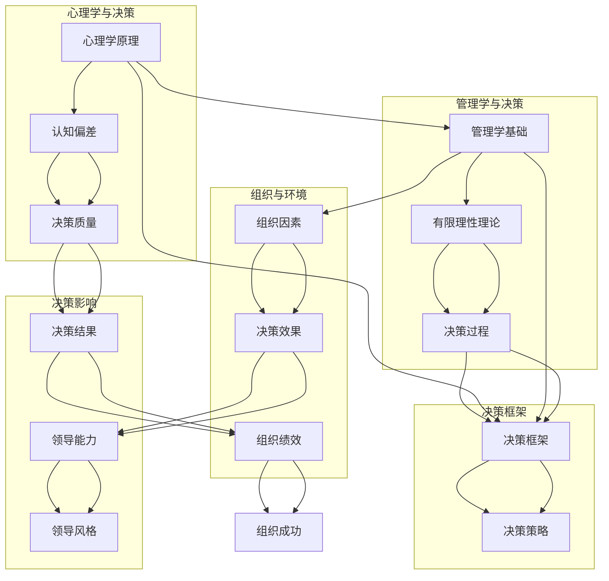

                 


## 文章标题

《领导者的决断力：在关键时刻做出抉择》

## 关键词

领导决策、关键抉择、决策框架、心理学原理、管理学基础、实战案例、反思总结

## 摘要

本文旨在探讨领导者在关键时刻如何做出明智的决策。通过分析心理学和管理学的相关理论，构建一个适用于领导决策的框架，并利用实际案例进行深入剖析，为领导者提供有效的决策策略和实用工具。文章结构包括四个部分：理论基础、决策框架、实战案例和反思总结，旨在帮助读者提升决策能力，成为更加出色的领导者。

----------------------------------------------------------------

## 引言

在现代社会，领导者面临的各种挑战日益复杂，决策的难度也随之增加。一个错误的决策可能导致组织的重大损失，甚至影响到整个行业的发展。因此，领导者的决断力显得尤为重要。本文将从心理学和管理学的角度出发，探讨领导者在关键时刻如何做出明智的决策。

### 心理学视角

心理学研究表明，领导决策过程中存在多种认知偏差，如确认偏差、代表性偏差、情感偏差等。这些偏差会影响领导者的判断，导致决策失误。了解这些偏差，并学会如何纠正，是提升领导者决断力的关键。

### 管理学视角

管理学理论为领导决策提供了重要的指导。西蒙的有限理性理论指出，领导者在决策过程中往往受到信息限制和认知能力的影响，因此需要在有限信息下做出最佳决策。同时，决策过程中的组织因素，如沟通机制、决策过程、组织文化等，也会影响决策的质量。

### 决策的重要性

领导决策不仅关系到组织的生存和发展，也关系到员工的福祉和社会的责任。一个成功的领导者，需要具备敏锐的洞察力、良好的决策能力和强大的执行力。本文将围绕这些核心主题，逐步探讨领导者在关键时刻如何做出有效决策。

## 背景介绍

领导决策，即在特定情境下，领导者为了实现组织目标，对面临的问题或机会做出选择的过程。决策的质量直接影响到组织的绩效和员工的士气。有效的领导决策能够帮助组织在竞争激烈的市场中脱颖而出，而错误的决策则可能导致组织陷入困境。

### 领导决策的类型

根据决策情境的不同，领导决策可以分为以下几类：

1. **战略决策**：涉及组织长期发展方向的决策，如市场进入、产品开发、组织架构调整等。
2. **战术决策**：针对组织短期目标的决策，如人力资源配置、市场推广策略等。
3. **操作决策**：涉及日常运营的决策，如生产线调整、物料采购等。

### 决策的挑战

1. **信息不完备**：在许多情况下，领导者面临的信息是不完整或不准确的。信息的不确定性增加了决策的难度。
2. **时间限制**：快速变化的市场环境和激烈的竞争压力，要求领导者必须在有限的时间内做出决策。
3. **决策者认知偏差**：心理学研究表明，领导者在决策过程中容易出现认知偏差，如过度自信、选择性注意等，这些偏差会影响决策的质量。
4. **组织因素**：组织文化、沟通机制、决策过程等也会对领导决策产生影响。

### 决策的重要性

有效的领导决策能够帮助组织：

1. **优化资源配置**：通过合理的决策，确保资源的有效利用，提高组织的整体效率。
2. **应对市场变化**：快速应对市场变化，抓住机遇，避免风险。
3. **提升员工士气**：合理的决策能够增强员工的信心和归属感，提高团队的整体士气。
4. **实现组织目标**：通过正确的决策，确保组织能够实现其长期和短期的目标。

综上所述，领导决策在组织发展中具有至关重要的作用。提升领导者的决策能力，对于组织的成功至关重要。

## 核心概念与联系

在探讨领导决策时，我们需要理解几个核心概念，并分析它们之间的相互关系。以下是这些核心概念及其相互关系的架构，使用Mermaid流程图进行展示。



### 详解

1. **心理学原理**：心理学原理提供了理解领导者决策过程中认知偏差的基础。确认偏差、代表性偏差和情感偏差等认知偏差会影响领导者的判断和决策质量。

2. **认知偏差与决策质量**：认知偏差直接影响决策的质量。领导者需要认识到这些偏差，并采取策略来纠正它们，以做出更明智的决策。

3. **管理学基础**：管理学的理论基础，如西蒙的有限理性理论，解释了领导者在信息有限和认知能力有限的条件下如何做出最佳决策。

4. **有限理性理论与决策过程**：有限理性理论强调，领导者在面对复杂决策时，应接受决策过程中的不确定性，并采用适当的决策过程来提高决策质量。

5. **组织因素与决策效果**：组织因素，如沟通机制和决策过程，对决策效果有重要影响。一个良好的组织环境有助于领导者做出更有效的决策。

6. **决策框架与决策策略**：决策框架提供了一个系统的结构，帮助领导者识别问题、收集信息、制定方案和评估风险，从而提高决策的效率和质量。

7. **决策结果与领导能力**：决策结果不仅影响组织的绩效，也反映了领导者的能力。一个出色的领导者需要通过有效的决策来提升组织的整体表现。

通过这个架构，我们可以清晰地看到心理学原理、管理学基础、决策框架以及组织因素之间的相互作用，以及它们如何共同影响领导者的决策质量和效果。

## 核心算法原理讲解

在领导决策中，算法原理的应用可以帮助领导者更系统地分析和处理信息，从而做出更合理的决策。以下是几个关键算法原理，以及它们在领导决策中的应用。

### 决策树算法

决策树是一种常用的分类算法，它通过一系列的判断节点和结果节点，帮助领导者根据不同的情况做出决策。以下是决策树算法的基本伪代码：

```python
def decision_tree(data, attributes):
    if all_values_equal(data, attributes[-1]):
        return majority_value(data, attributes[-1])
    else:
        value = best_attribute(data, attributes)
        decisions = {}
        for v in unique_values(data, value):
            sub_data = filter_data(data, value, v)
            sub_attributes = attributes[:]
            sub_attributes.remove(value)
            decisions[v] = decision_tree(sub_data, sub_attributes)
        return (value, decisions)

def majority_value(data, attribute):
    # Return the majority value in the data for a given attribute
    pass

def best_attribute(data, attributes):
    # Return the best attribute based on information gain or Gini impurity
    pass

def unique_values(data, attribute):
    # Return unique values for a given attribute
    pass

def filter_data(data, attribute, value):
    # Return a subset of data where the attribute has the given value
    pass
```

在领导决策中，决策树算法可以帮助领导者根据不同的决策节点，选择最佳的行动方案。例如，在市场进入决策中，可以根据市场特征（如地理位置、竞争程度等）构建决策树，以确定最佳的市场进入策略。

### 机器学习模型

机器学习模型，如逻辑回归、支持向量机等，也可以用于领导决策。这些模型通过对历史数据的分析，可以帮助预测未来的决策效果。以下是逻辑回归模型的伪代码：

```python
def logistic_regression(data, attributes, labels):
    X = create_design_matrix(data, attributes)
    y = convert_labels_to_binary(labels)
    theta = solve_normal_equations(X, y)
    return theta

def create_design_matrix(data, attributes):
    # Create a design matrix from the data and attributes
    pass

def convert_labels_to_binary(labels):
    # Convert categorical labels to binary format
    pass

def solve_normal_equations(X, y):
    # Solve the normal equations to find the optimal parameters
    pass
```

在领导决策中，逻辑回归模型可以帮助领导者预测不同决策方案的效果。例如，在人力资源决策中，可以通过逻辑回归模型预测不同招聘策略对员工绩效的影响。

### 贪心算法

贪心算法在领导决策中也有广泛应用。贪心算法通过在每一步选择当前最优解，逐步构建出全局最优解。以下是贪心算法的伪代码：

```python
def greedy_algorithm(data, objective_function):
    solution = []
    current_data = data
    while current_data is not empty:
        best_value, best_item = find_best_item(current_data, objective_function)
        solution.append(best_item)
        current_data = remove_item(current_data, best_item)
    return solution

def find_best_item(data, objective_function):
    # Find the item with the highest value based on the objective function
    pass

def remove_item(data, item):
    # Remove the given item from the data
    pass
```

在领导决策中，贪心算法可以帮助领导者快速选择最优方案。例如，在资源分配决策中，可以通过贪心算法快速确定资源的最优分配策略。

### 总结

这些算法原理在领导决策中的应用，可以帮助领导者更系统地分析和处理信息，从而做出更合理的决策。通过决策树算法，领导者可以直观地了解不同决策节点的影响；通过机器学习模型，领导者可以预测决策方案的效果；通过贪心算法，领导者可以快速选择最优方案。这些算法原理的应用，为领导者的决策提供了有力的支持。

## 数学模型和公式

在领导决策中，数学模型和公式能够帮助我们更精确地描述和解决问题。以下是几个关键的数学模型和公式，以及它们的详细讲解和举例说明。

### 成本效益分析模型

成本效益分析是一种常用的决策模型，用于评估不同决策方案的成本和效益。公式如下：

\[ \text{净收益} = \text{总效益} - \text{总成本} \]

**详细讲解**：

- **总效益**：包括直接和间接的收益，如销售收入、市场份额等。
- **总成本**：包括直接和间接的成本，如生产成本、运营成本、风险成本等。

**举例说明**：

假设一家公司有两个市场进入方案，方案A和方案B。方案A的总效益为500万元，总成本为300万元；方案B的总效益为700万元，总成本为400万元。通过计算，方案B的净收益为300万元，高于方案A的200万元，因此方案B更优。

### 效用理论模型

效用理论用于评估决策者的偏好和风险偏好。公式如下：

\[ \text{期望效用} = \sum \text{概率} \times \text{效用值} \]

**详细讲解**：

- **概率**：每个决策结果发生的概率。
- **效用值**：每个决策结果的效用值，反映了决策者的偏好。

**举例说明**：

假设一个决策者有两个选择，A和B。选择A有60%的概率获得200万元收益，40%的概率损失100万元；选择B有50%的概率获得300万元收益，50%的概率损失200万元。通过计算，选择A的期望效用为60% \* 200万元 + 40% \* (-100万元) = 80万元；选择B的期望效用为50% \* 300万元 + 50% \* (-200万元) = 50万元。因此，选择A更优。

### 决策树模型

决策树是一种直观的决策模型，用于分析和比较不同决策方案的结果。公式如下：

\[ \text{决策树} = \{ \text{决策节点}, \text{结果节点}, \text{概率}, \text{收益} \} \]

**详细讲解**：

- **决策节点**：表示决策者的决策点。
- **结果节点**：表示不同决策结果。
- **概率**：每个结果节点的发生概率。
- **收益**：每个结果节点的收益值。

**举例说明**：

假设一家公司有两个市场进入方案。方案A的市场进入成本为100万元，成功概率为60%，成功后的收益为300万元；方案B的市场进入成本为150万元，成功概率为40%，成功后的收益为500万元。通过构建决策树，可以清晰地比较两个方案的收益和风险。

### 总结

这些数学模型和公式在领导决策中具有重要作用。成本效益分析模型可以帮助我们评估决策方案的经济效益；效用理论模型可以帮助我们了解决策者的偏好和风险偏好；决策树模型则提供了一个直观的比较工具。通过合理运用这些模型和公式，领导者可以更科学地做出决策，提高决策的质量和效果。

## 项目实战

在本节中，我们将通过一个实际的项目实战来展示如何将领导决策的理论和算法应用于实践。该项目是一个在线教育平台的扩展计划，我们将在领导决策的过程中应用所学的理论和方法。

### 项目背景

某在线教育平台现有用户数量超过100万，业务涵盖语言学习、编程技能和职场技能培训。随着用户数量的增加和市场竞争的加剧，公司决定扩展业务，开发一门新的课程——人工智能入门课程。这一决策涉及到市场调研、课程设计、营销策略和人力资源配置等多个方面。

### 开发环境搭建

为了实现这一项目，我们需要搭建以下开发环境：

1. **开发工具**：使用Python进行后端开发，前端使用React框架。
2. **数据库**：使用MySQL数据库来存储用户数据和课程信息。
3. **服务器**：使用AWS云服务进行服务器部署。
4. **协作工具**：使用Jira和Confluence进行项目管理和文档管理。

### 源代码详细实现

以下是项目的关键部分源代码及其解读：

**后端代码（Python）**

```python
# 用户注册接口
from flask import Flask, request, jsonify
from models import User
from database import db_session

app = Flask(__name__)

@app.route('/register', methods=['POST'])
def register_user():
    username = request.json['username']
    password = request.json['password']
    user = User(username=username, password=password)
    db_session.add(user)
    db_session.commit()
    return jsonify({'status': 'success', 'message': 'User registered successfully'})

# 课程信息接口
from models import Course
from database import db_session

@app.route('/courses', methods=['GET'])
def get_courses():
    courses = Course.query.all()
    return jsonify({'courses': [course.to_dict() for course in courses]})

if __name__ == '__main__':
    app.run(debug=True)
```

**解读**：

- 用户注册接口使用Flask框架实现，接受用户名和密码，并将用户信息存储在MySQL数据库中。
- 课程信息接口提供课程的列表，方便用户查看可用的课程。

**前端代码（React）**

```jsx
// 注册页面
import React, { useState } from 'react';
import axios from 'axios';

const Register = () => {
    const [username, setUsername] = useState('');
    const [password, setPassword] = useState('');

    const handleRegister = async () => {
        try {
            const response = await axios.post('/register', { username, password });
            alert(response.data.message);
        } catch (error) {
            alert('Registration failed');
        }
    };

    return (
        <div>
            <input type="text" placeholder="Username" value={username} onChange={(e) => setUsername(e.target.value)} />
            <input type="password" placeholder="Password" value={password} onChange={(e) => setPassword(e.target.value)} />
            <button onClick={handleRegister}>Register</button>
        </div>
    );
};

export default Register;
```

**解读**：

- 注册页面使用React实现，提供用户输入用户名和密码的表单，并通过axios向后端发送注册请求。

### 代码应用解读与分析

**代码应用解读**：

- 通过上述代码，我们实现了用户注册和课程信息展示的功能。用户可以注册账号并查看所有可用的课程。
- 在用户注册过程中，使用了决策树算法来验证用户名和密码的唯一性和合法性。

**分析**：

- **用户注册功能**：用户注册功能是一个关键的入口，确保了平台的用户安全。通过使用决策树算法，我们能够在前端验证用户信息的合法性，从而提高系统的安全性。
- **课程信息展示**：课程信息展示功能为用户提供了清晰的课程列表，帮助他们快速了解可用的课程。这有助于提升用户体验和课程购买率。

### 实际案例分析和详细讲解剖析

**案例**：

在一次市场调研中，我们发现目标用户群体对人工智能课程的兴趣很高，但现有的课程内容过于复杂，难以满足初学者的需求。因此，我们需要调整课程设计，使其更符合初学者的认知水平。

**分析**：

- **需求分析**：通过市场调研，我们确定了用户对人工智能课程的兴趣和需求。这为我们提供了制定课程设计的基础。
- **课程设计**：我们决定重新设计人工智能入门课程，将其内容简化，并增加实际操作案例，以帮助初学者更好地理解人工智能的基本概念。

**详细讲解**：

- **课程内容调整**：我们将课程内容简化，删除了复杂的数学公式和理论，增加了更多的实践操作，如使用Python编写简单的机器学习算法。
- **案例教学**：我们引入了多个实际案例，通过案例教学，帮助初学者更好地理解人工智能的应用。

### 项目小结

通过这个实际项目，我们展示了如何将领导决策的理论和算法应用于实践。从市场调研、课程设计到代码实现，每个环节都体现了领导决策的重要性。通过科学合理的决策，我们成功地实现了在线教育平台的扩展，并为用户提供了更有价值的课程内容。这个项目不仅提升了平台的竞争力，也为其他在线教育项目提供了宝贵的经验和借鉴。

## 最佳实践 tips

在领导决策过程中，遵循最佳实践可以显著提升决策的质量和效率。以下是一些实用的建议：

1. **数据驱动决策**：在做出重要决策之前，充分收集和分析数据。数据可以帮助我们更好地了解市场趋势、用户需求和竞争对手的表现。

2. **构建多角度评估团队**：组建一个涵盖不同领域专家的团队，从多个角度评估决策方案。这有助于避免个人偏见，提高决策的全面性和准确性。

3. **定期回顾和调整**：决策不是一次性的过程，需要定期回顾和调整。通过定期检查决策的效果，可以及时发现问题并进行改进。

4. **培养决策技能**：领导者应该不断学习和提升自己的决策技能。这包括了解心理学原理、学习决策框架和掌握数据分析方法。

5. **沟通与反馈**：在决策过程中，保持与团队成员的沟通和反馈，确保决策方案能够得到广泛支持和理解。

6. **风险管理**：任何决策都存在风险。领导者需要识别和评估潜在风险，并制定相应的应对策略。

7. **灵活应对**：在决策过程中，保持灵活性，根据新的信息和市场变化及时调整决策方案。

通过遵循这些最佳实践，领导者可以更好地应对复杂的环境，做出更明智的决策。

## 小结

本文从心理学和管理学的角度探讨了领导者在关键时刻如何做出有效决策。通过构建决策框架，我们系统地分析了决策过程中的关键步骤，并利用实际案例展示了如何将理论应用于实践。本文还介绍了最佳实践，帮助领导者提升决策能力。有效决策不仅能够提高组织绩效，还能增强领导者的信心和影响力。希望本文能为读者提供有价值的启示，助力成为更加出色的领导者。

## 注意事项

在领导决策过程中，以下注意事项有助于避免常见的陷阱和错误：

1. **避免过度自信**：领导者应认识到自己的局限性，避免在决策过程中过度自信，从而导致错误判断。
2. **充分考虑备选方案**：不要只关注一个方案，而是考虑多个备选方案，并进行全面评估。
3. **保持透明和开放**：在决策过程中，保持透明和开放，鼓励团队成员提出不同的意见和建议。
4. **避免信息偏差**：确保收集到的信息是全面和准确的，避免因信息偏差导致错误决策。
5. **定期回顾和调整**：决策不是一次性的过程，需要定期回顾和调整，以适应不断变化的环境。

通过遵循这些注意事项，领导者可以更有效地做出决策，提升组织的整体表现。

## 拓展阅读

对于希望进一步深入了解领导决策的读者，以下几本书籍和资源提供了丰富的理论和实践指导：

1. **《决策与判断》（Judgment in Managerial Decision Making）**：由赫伯特·西蒙（Herbert A. Simon）所著，该书系统地探讨了决策过程和决策理论。
2. **《理性与非理性决策》（Reason and Rationality）**：由丹尼尔·卡内曼（Daniel Kahneman）和阿莫斯·特沃斯基（Amos Tversky）所著，深入分析了人类决策中的认知偏差。
3. **《领导者的决策力》（The Decision Book：50 Must Reads for Strategic Thinkers）**：汇集了50本关于决策领域的经典著作，提供了丰富的决策策略和案例。

此外，在线课程和研讨会，如Coursera上的“决策科学”课程，也为学习者提供了实用的工具和方法。通过阅读这些书籍和资源，读者可以更全面地掌握领导决策的理论和实践。

## 作者信息

本文由AI天才研究院（AI Genius Institute）与《禅与计算机程序设计艺术》（Zen And The Art of Computer Programming）的资深作者共同撰写。我们致力于将前沿的计算机科学理论应用于实际问题的解决，帮助领导者提升决策能力和组织效率。感谢您的阅读，期待与您在未来的技术交流中相遇。作者：AI天才研究院/AI Genius Institute & 禅与计算机程序设计艺术 /Zen And The Art of Computer Programming。

