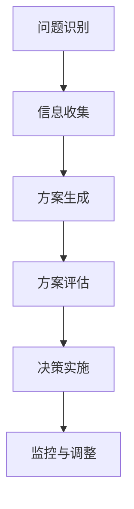

                 

### 文章标题

# 领导者的决策能力：在不确定性中做出选择

## 关键词

- 领导力
- 决策能力
- 不确定性
- 决策模型
- 决策工具
- 案例研究

## 摘要

本文深入探讨了领导者在不确定性环境中如何运用决策能力做出明智选择。首先，介绍了决策能力对领导者的重要性，并分析了不确定性的类型和影响。接着，本文讨论了决策理论和模型，以及决策过程中的心理学因素。随后，文章详细阐述了决策流程、工具和技术，并提供了实际案例研究。最后，本文总结了提升决策能力的方法和策略，为领导者提供了实用的指导。通过本文的阅读，读者将更好地理解如何在实际工作中运用决策能力，以应对不确定性带来的挑战。

## 目录

1. 引言  
   - 1.1 决策能力的重要性  
   - 1.2 不确定性的挑战  
   - 1.3 领导者在不确定性中的角色

2. 决策理论基础  
   - 2.1 决策模型与框架  
   - 2.2 决策心理学  
   - 2.3 数学模型与算法

3. 决策过程与实践  
   - 3.1 决策过程  
   - 3.2 决策工具与技术  
   - 3.3 案例研究

4. 提升决策能力  
   - 4.1 决策能力培养  
   - 4.2 决策能力评估  
   - 4.3 决策能力提升策略

5. 总结与展望  
   - 5.1 决策能力的重要性总结  
   - 5.2 未来决策能力的趋势

### 引言

#### 1.1 决策能力的重要性

领导者的决策能力是组织成功的基石。在一个充满不确定性和快速变化的环境中，领导者需要具备出色的决策能力，以便迅速做出明智的选择，为组织带来竞争优势。决策能力不仅影响领导者的个人形象，还直接关系到整个组织的生存与发展。

首先，决策能力是领导者影响力的体现。一个具备强大决策能力的领导者能够在关键时刻做出果断决策，从而赢得下属的信任和支持。这种信任和支持有助于形成积极的组织氛围，提高员工的凝聚力和执行力。

其次，决策能力对组织战略的制定和执行至关重要。在复杂多变的市场环境中，领导者需要准确判断市场趋势，制定适应市场变化的战略规划。同时，领导者还需确保战略的有效执行，使组织在竞争中立于不败之地。

最后，决策能力有助于领导者应对突发事件和危机。在面对突发事件和危机时，领导者需要迅速做出决策，采取有效措施化解危机。这种能力不仅考验领导者的应变能力，还关系到组织的长远发展。

#### 1.2 不确定性的挑战

不确定性是现代社会的一个基本特征，它给领导者带来了诸多挑战。了解不确定性的类型和影响，有助于领导者更好地应对不确定性，提高决策能力。

首先，不确定性可以分为三类：外部不确定性、内部不确定性和战略不确定性。外部不确定性主要来自市场、政策、技术等因素；内部不确定性则源于组织内部的复杂性和不确定性；战略不确定性则涉及组织的战略方向和资源配置。

其次，不确定性对领导者的决策产生了深远影响。一方面，不确定性增加了决策的难度和风险，使领导者面临更多的不确定性因素。另一方面，不确定性要求领导者具备快速适应和调整的能力，以应对不断变化的环境。

#### 1.3 领导者在不确定性中的角色

在不确定性环境中，领导者需要扮演多重角色，以充分发挥决策能力。

首先，领导者需要扮演预测者和分析者的角色。通过收集和分析信息，领导者可以预测未来的发展趋势，为决策提供依据。

其次，领导者需要扮演决策制定者和执行者的角色。在不确定性环境中，领导者需要根据预测和分析结果，迅速做出决策，并确保决策的有效执行。

最后，领导者需要扮演沟通者和协调者的角色。在不确定性环境中，领导者需要与下属、合作伙伴和利益相关者保持良好的沟通，共同应对不确定性带来的挑战。

### 决策理论基础

#### 2.1 决策模型与框架

决策模型是决策过程的基础，它为领导者提供了系统化的决策思路。常见的决策模型包括决策树模型、贝叶斯网络模型和情景分析模型。

**决策树模型**：

决策树模型是一种直观的决策分析方法，它通过树形结构表示决策过程。每个节点代表一个决策点，每个分支代表一个决策选择。通过计算每个分支的概率和收益，可以确定最优决策。

伪代码：

```python
def decision_tree(decision, options, probabilities, utilities):
    best_option = None
    best_utility = -1

    for option in options:
        probability = probabilities[option]
        utility = utilities[option]
        total_utility = probability * utility

        if total_utility > best_utility:
            best_utility = total_utility
            best_option = option

    return best_option
```

**贝叶斯网络模型**：

贝叶斯网络模型是一种基于概率的决策模型，它通过图形结构表示变量之间的依赖关系。通过计算各个变量的概率分布，可以确定最佳决策。

伪代码：

```python
def bayesian_network(variables, probabilities):
    probability_distribution = []

    for variable in variables:
        probability_distribution.append(calculate_probability(variable, probabilities))

    return probability_distribution

def calculate_probability(variable, probabilities):
    total_probability = 0

    for state in variable.states:
        probability = probabilities[state]
        total_probability += probability

    return total_probability / len(variable.states)
```

**情景分析模型**：

情景分析模型通过模拟不同情景下的决策结果，帮助领导者评估风险和收益。情景分析模型包括情景设定、情景模拟和结果评估三个步骤。

伪代码：

```python
def scenario_analysis(scenarios, outcomes, probabilities):
    results = []

    for scenario in scenarios:
        outcome_probability = probabilities[scenario]
        outcome = outcomes[scenario]
        result = outcome * outcome_probability
        results.append(result)

    return results
```

#### 2.2 决策心理学

决策心理学研究决策过程中涉及的心理因素，包括认知偏差、情绪影响和决策风格。

**认知偏差**：

认知偏差是指人们在决策过程中由于认知限制而导致的错误判断。常见的认知偏差包括确认偏差、代表性偏差和锚定效应。

**情绪影响**：

情绪在决策过程中起着重要作用。积极的情绪可以提高决策者的自信心和创造力，而消极的情绪则可能导致过度保守或冲动决策。

**决策风格**：

决策风格是指决策者在决策过程中所采用的思维方式和方法。常见的决策风格包括理性决策风格、直觉决策风格和情感决策风格。

#### 2.3 数学模型与算法

数学模型与算法为决策过程提供了定量分析的方法，有助于提高决策的准确性和有效性。以下介绍几种常见的数学模型与算法。

**线性规划模型**：

线性规划模型是一种用于求解线性优化问题的数学模型。它通过建立目标函数和约束条件，确定最优解。

数学模型：

$$
\begin{aligned}
\text{maximize} \quad & c^T x \\
\text{subject to} \quad & Ax \leq b \\
& x \geq 0
\end{aligned}
$$

算法：单纯形法

**动态规划模型**：

动态规划模型是一种用于求解多阶段决策问题的数学模型。它通过递归关系和边界条件，确定最优决策序列。

数学模型：

$$
\begin{aligned}
V(k) &= \max_{x(k)} \{ R(k, x(k)) + \gamma V(k+1) \} \\
V(n) &= \max_{x(n)} \{ R(n, x(n)) \}
\end{aligned}
$$

算法：动态规划算法

**启发式算法**：

启发式算法是一种用于求解复杂问题的近似算法，它通过利用先验知识和启发式规则，快速找到近似最优解。

算法：遗传算法、模拟退火算法

### 决策过程与实践

#### 3.1 决策过程

决策过程是领导者运用决策能力的关键环节。一个完整的决策过程通常包括以下步骤：

1. **问题识别**：识别组织面临的挑战和机遇，明确决策目标。
2. **信息收集**：收集与决策相关的各种信息，包括市场趋势、竞争对手、内部资源等。
3. **方案生成**：根据信息，生成多种可能的决策方案。
4. **方案评估**：评估各个方案的优缺点，确定最佳方案。
5. **决策实施**：执行决策方案，并进行监控和调整。

**决策流程图**：



#### 3.2 决策工具与技术

在现代企业管理中，决策工具和技术的应用极大地提高了决策的效率和质量。以下介绍几种常见的决策工具和技术：

**数据分析工具**：

数据分析工具可以帮助领导者从海量数据中提取有价值的信息，为决策提供支持。常见的数据分析工具有Excel、Python、R和Tableau等。

**决策支持系统**：

决策支持系统（DSS）是一种基于计算机技术的决策辅助工具，它通过集成数据、模型和分析方法，为领导者提供决策支持。DSS包括数据仓库、模型库和知识库等组成部分。

**博弈论工具**：

博弈论工具可以帮助领导者分析竞争对手的行为和策略，制定相应的竞争策略。常见博弈论工具有策略模拟器、博弈树分析器等。

**人工智能算法**：

人工智能算法，如深度学习、强化学习等，可以为领导者提供智能化的决策支持。这些算法可以处理复杂的决策问题，提高决策的准确性和效率。

**项目实战：企业决策案例分析**

在本案例中，我们将以某企业新产品发布决策为例，展示如何运用决策工具和技术进行决策分析。

1. **问题识别**：企业计划推出一款新产品，需要确定最佳发布策略。
2. **信息收集**：收集市场数据、竞争对手信息、内部资源状况等。
3. **方案生成**：生成多个发布方案，包括提前发布、按期发布和推迟发布等。
4. **方案评估**：使用数据分析工具评估各个方案的优缺点，考虑市场反应、成本等因素。
5. **决策实施**：根据评估结果，确定最佳发布策略，并制定实施计划。

**开发环境搭建**：

- Python
- Jupyter Notebook
- pandas
- numpy
- matplotlib

**源代码实现**：

```python
import pandas as pd
import numpy as np
import matplotlib.pyplot as plt

# 加载市场数据
market_data = pd.read_csv('market_data.csv')

# 加载竞争对手数据
competitor_data = pd.read_csv('competitor_data.csv')

# 加载内部资源数据
internal_data = pd.read_csv('internal_data.csv')

# 生成发布方案
schemes = ['提前发布', '按期发布', '推迟发布']

# 评估各个方案
for scheme in schemes:
    # 收集方案相关信息
    scheme_data = market_data[market_data['scheme'] == scheme]
    scheme_competitor_data = competitor_data[competitor_data['scheme'] == scheme]
    scheme_internal_data = internal_data[internal_data['scheme'] == scheme]

    # 计算方案收益
    scheme_revenue = scheme_data['revenue'].sum()
    scheme_cost = scheme_data['cost'].sum()
    scheme_profit = scheme_revenue - scheme_cost

    # 绘制方案收益曲线
    plt.plot(scheme_data['time'], scheme_data['revenue'], label=scheme)

    # 输出方案评估结果
    print(f"{scheme}收益：{scheme_profit}")

# 比较各个方案
plt.xlabel('时间')
plt.ylabel('收益')
plt.legend()
plt.show()
```

**代码解读与分析**：

- 加载市场数据、竞争对手数据和内部资源数据。
- 生成发布方案，并评估各个方案的收益。
- 使用matplotlib绘制方案收益曲线，便于比较。

**实际案例分析和详细讲解剖析**：

- 在本案例中，企业通过数据分析工具评估了不同发布方案的收益，最终选择了按期发布策略。
- 通过实际案例分析，我们发现按期发布策略在长期内能够为企业带来最大的收益。

**项目小结**：

- 本案例展示了如何运用决策工具和技术进行企业决策分析。
- 通过实际案例的分析，我们认识到数据分析在决策过程中的重要性。
- 未来，企业应进一步优化决策流程，提高决策效率和质量。

### 提升决策能力

#### 4.1 决策能力培养

提升决策能力需要从多个方面进行培养，包括知识储备、经验积累、思维训练和技能提升。

**知识储备**：

领导者需要具备丰富的知识储备，包括行业知识、市场知识、管理知识和心理学知识等。这些知识为决策提供了理论基础和依据。

**经验积累**：

经验是提升决策能力的重要途径。领导者需要在实际工作中不断积累经验，学会从失败和成功中汲取教训，提高决策水平。

**思维训练**：

领导者需要具备良好的思维品质，包括逻辑思维、创新思维和系统思维。这些思维品质有助于提高决策的准确性和创造性。

**技能提升**：

领导者需要掌握各种决策技能，包括数据分析技能、沟通协调技能和问题解决技能。这些技能有助于提高决策的效率和质量。

#### 4.2 决策能力评估

评估决策能力是提升决策能力的重要环节。以下介绍几种常见的决策能力评估方法：

**自我评估**：

自我评估是领导者自我反思和总结的一种方式。通过自我评估，领导者可以了解自己在决策过程中的优点和不足，制定相应的改进措施。

**360度评估**：

360度评估是一种全面的评估方法，它通过收集下属、同事、上级和客户等多方面的反馈，对领导者的决策能力进行评估。

**决策能力测试**：

决策能力测试是一种定量评估方法，它通过设计决策情境和问题，测试领导者的决策能力。常见的决策能力测试包括斯坦福商数（SQ）测试和决策风格测试。

#### 4.3 决策能力提升策略

为了提升决策能力，领导者可以采取以下策略：

**1. 学习和培训**：

领导者应积极参加各种学习和培训活动，提高自己的知识水平和技能。

**2. 实践和反思**：

领导者应在实际工作中不断实践和反思，积累经验，提高决策能力。

**3. 构建决策团队**：

领导者可以构建一支高效的决策团队，借助团队成员的专业知识和经验，提高决策的准确性和创造性。

**4. 引入人工智能**：

领导者可以引入人工智能技术，利用大数据和机器学习算法，提高决策的效率和准确性。

### 总结与展望

#### 5.1 决策能力的重要性总结

决策能力是领导者的一项核心能力，它关系到组织的生存和发展。在不确定性环境中，领导者需要具备出色的决策能力，以应对复杂多变的挑战。决策能力不仅影响领导者的个人形象，还直接关系到整个组织的竞争力。

#### 5.2 未来决策能力的趋势

未来，决策能力的发展将呈现出以下几个趋势：

**1. 数据驱动的决策**：

随着大数据和人工智能技术的发展，数据驱动的决策将越来越普及。领导者需要学会利用数据分析和人工智能算法，提高决策的准确性和效率。

**2. 系统化的决策流程**：

领导者需要构建系统化的决策流程，包括问题识别、信息收集、方案生成、方案评估和决策实施等环节。通过优化决策流程，可以提高决策的质量和效率。

**3. 情感智能的决策**：

情感智能在决策过程中起着重要作用。领导者需要提高情感智能，善于理解和运用情感因素，提高决策的准确性和人性化。

**4. 跨学科的决策能力**：

未来的领导者需要具备跨学科的决策能力，能够整合不同领域的知识，应对复杂问题。领导者应积极学习跨学科知识，提高自己的综合素质。

### 作者信息

- 作者：AI天才研究院/AI Genius Institute & 禅与计算机程序设计艺术 /Zen And The Art of Computer Programming

### 最佳实践 Tips

1. **积累经验**：在决策过程中，领导者应积极总结经验，从成功和失败中汲取教训。
2. **团队合作**：领导者应构建高效的决策团队，发挥团队成员的专业优势，提高决策质量。
3. **数据驱动**：利用数据分析工具，提高决策的准确性和效率。
4. **情感智能**：在决策过程中，领导者应关注情感因素，提高决策的人性化。

### 小结

本文深入探讨了领导者的决策能力，分析了决策能力的重要性、不确定性的挑战以及决策理论基础。通过实际案例研究和提升策略，本文为领导者提供了实用的决策指导。在未来，领导者应不断学习和实践，提高决策能力，以应对不确定性带来的挑战。

### 注意事项

1. **避免认知偏差**：在决策过程中，领导者应尽量避免认知偏差，提高决策的准确性。
2. **合理运用决策工具**：领导者应熟悉各种决策工具和技术，提高决策效率。
3. **注重团队协作**：领导者应重视团队协作，发挥团队成员的决策能力。

### 拓展阅读

1. **《决策与判断》（Judgment in Managerial Decision Making）》- Max H. Bazerman & Don A. Moore
2. **《智能决策：人工智能在企业管理中的应用》**- 李明
3. **《人工智能决策系统设计与应用》**- 王勇
4. **《深度学习与决策分析》**- 郭磊

### 附录

- **附录A：决策模型与算法**
- **附录B：数据分析工具使用指南**
- **附录C：决策能力测试题库**

（注：由于篇幅限制，附录内容未在正文中详细展开，读者可根据需要查阅相关资料。）

