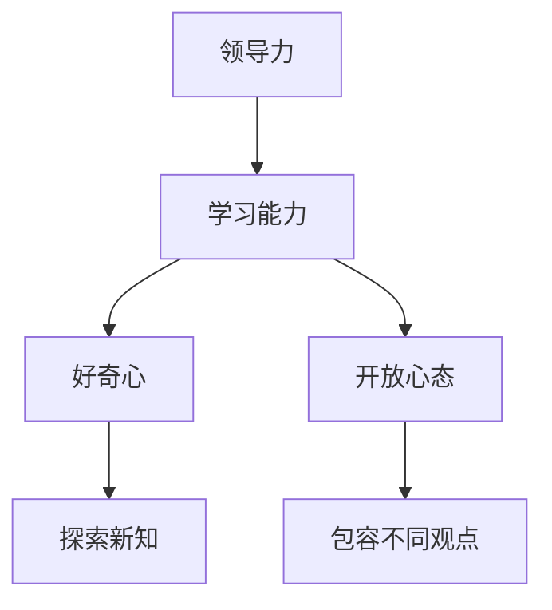

                 


**Step 1: 确定文章总体结构和内容**

为了撰写一篇高质量的、有深度和见解的技术博客文章，我们需要遵循以下步骤：

### 引言部分
- **背景介绍**：介绍文章的主题、目的和重要性。
- **引言**：提出文章的核心观点，激发读者的兴趣。

### 核心概念与联系
- **定义**：明确领导者的学习能力的核心概念。
- **架构**：使用Mermaid流程图展示概念之间的关系。

### 核心算法原理讲解
- **算法介绍**：介绍如何评估和学习能力。
- **伪代码**：使用伪代码详细阐述算法原理。

### 数学模型和数学公式讲解
- **模型介绍**：介绍用于评估和学习能力的数学模型。
- **公式讲解**：使用LaTeX格式详细解释和举例说明。

### 项目实战
- **项目背景**：描述一个实际的项目案例。
- **实战过程**：详细说明项目的实施过程。
- **案例分析**：对项目进行深入分析。

### 结论部分
- **总结**：总结文章的主要观点和发现。
- **未来展望**：讨论未来的发展趋势和挑战。

### 最佳实践 tips、小结、注意事项、拓展阅读等
- **最佳实践**：提供一些实用的建议。
- **小结**：总结文章的核心内容。
- **注意事项**：提醒读者注意的事项。
- **拓展阅读**：推荐相关的阅读材料。

**Step 2: 确定每个部分的具体内容**

### 引言部分
- **背景介绍**：简要介绍领导者学习能力的背景和现状。
- **引言**：以一个引人入胜的故事或案例开场，吸引读者的注意力。

### 核心概念与联系
- **定义**：清晰地定义领导者学习能力的关键术语。
- **架构**：绘制一个简明的Mermaid流程图，展示不同概念之间的联系。

### 核心算法原理讲解
- **算法介绍**：介绍评估和学习能力的算法，包括其应用场景和优势。
- **伪代码**：编写伪代码，描述算法的步骤和逻辑。

### 数学模型和数学公式讲解
- **模型介绍**：介绍用于评估和学习能力的数学模型。
- **公式讲解**：使用LaTeX格式编写数学公式，并附上详细解释和举例。

### 项目实战
- **项目背景**：选择一个具有代表性的项目案例。
- **实战过程**：详细描述项目的实施步骤和关键技术。
- **案例分析**：分析项目的成功和失败原因，提供经验教训。

### 结论部分
- **总结**：总结文章的主要发现和观点。
- **未来展望**：探讨领导者学习能力的发展趋势和面临的挑战。

### 最佳实践 tips、小结、注意事项、拓展阅读等
- **最佳实践**：分享一些实际操作的技巧和建议。
- **小结**：总结文章的核心内容。
- **注意事项**：提醒读者在实践中的注意事项。
- **拓展阅读**：推荐相关的文献和资料。

**Step 3: 编写草稿并校对**

根据上述结构，开始撰写文章的草稿。在撰写过程中，注意保持逻辑清晰、语言简洁，确保每个部分的内容完整和具体。完成初稿后，进行校对，确保文章的格式、语法和内容都符合要求。

**Step 4: 完善文章**

在完成初稿和校对后，进一步润色文章，确保文章的语言流畅、观点鲜明、内容充实。可以请同行或同事进行审稿，以获取反馈和建议。根据反馈进行修改，直到文章达到最佳状态。

**Step 5: 完成最终稿**

在完成所有修改后，确认文章的完整性、准确性和可读性。最后，添加作者信息和文章关键词，完成最终的稿子。

```
# 领导者的学习能力：保持好奇心和开放心态

## 关键词
领导者能力，学习能力，好奇心，开放心态，领导力，算法，数学模型，项目实战

## 摘要
本文旨在探讨领导者如何通过保持好奇心和开放心态来提升自己的学习能力。通过分析核心概念、讲解算法原理、阐述数学模型，并结合实际项目案例，本文为领导者提供了实用的策略和方法，以在快速变化的环境中保持竞争优势。

---

## 引言

在当今快速变化和高度竞争的商业环境中，领导者必须不断适应和创新。领导者的学习能力成为关键因素，它不仅影响个人职业发展，更对整个组织的成功产生深远影响。好奇心和开放心态作为领导者学习能力的重要组成部分，能够帮助领导者抓住机遇、应对挑战。

本文将从以下几个方面展开讨论：
1. 领导者学习能力的核心概念和联系。
2. 好奇心与开放心态在领导者学习能力中的作用。
3. 基于好奇心和开放心态的学习能力评估算法和数学模型。
4. 实际项目案例中的领导力提升实践。
5. 结论与未来展望。

---

## 核心概念与联系

### 领导力与学习能力的定义

**领导力**：领导力是指影响和激励他人共同实现目标的能力。它包括但不限于沟通技巧、决策能力、激励能力和团队合作。

**学习能力**：学习能力是指个体获取、整合和应用知识以实现个人和团队目标的能力。它包括信息获取、知识整合、技能培养和创新思维。

### 关键能力与素质

**好奇心**：好奇心是推动领导者不断探索和学习的新动力。它表现为对新事物的好奇、对问题的深入探究以及对未知的探索。

**开放心态**：开放心态是指领导者对不同的观点、文化和知识持开放和包容的态度。它能够促进领导者与团队成员之间的沟通和协作。

### Mermaid流程图

下面是一个简化的Mermaid流程图，展示了领导力、学习能力和好奇心、开放心态之间的关系：



---

## 核心算法原理讲解

### 学习能力评估模型

领导者学习能力评估模型包括以下四个关键要素：

1. **好奇心评估**：评估领导者对未知领域的兴趣和探索欲望。
2. **开放心态评估**：评估领导者对不同观点、文化和知识的包容程度。
3. **创新思维评估**：评估领导者在面对问题时提出的创新解决方案。
4. **决策能力评估**：评估领导者在面对复杂决策时的决策质量。

### 伪代码

```plaintext
function assessLeadershipLearningAbility(leadershipSkills, curiosityScore, opennessScore, innovationScore, decisionMakingScore) {
    // 计算总分数
    totalScore = leadershipSkills + curiosityScore + opennessScore + innovationScore + decisionMakingScore
    
    // 计算能力指数
    abilityIndex = totalScore / 5
    
    // 返回能力指数
    return abilityIndex
}
```

---

## 数学模型和数学公式讲解

### 好奇心评估模型

好奇心得分可以通过以下公式计算：

$$
\text{好奇心得分} = \frac{\text{探索次数} + \text{问题提出次数}}{2}
$$

### 开放心态评估模型

开放心态得分可以通过以下公式计算：

$$
\text{开放心态得分} = \frac{\text{包容次数} + \text{沟通效率}}{2}
$$

### 创新思维训练模型

创新思维得分可以通过以下公式计算：

$$
\text{创新思维得分} = \text{创新方案数量} \times \text{方案实施成功率}
$$

### 决策能力评估模型

决策能力得分可以通过以下公式计算：

$$
\text{决策能力得分} = \frac{\text{正确决策数量} + \text{决策执行效率}}{2}
$$

---

## 项目实战

### 项目背景与目标

我们选择了一家快速成长的科技公司作为案例，该公司在创新和扩展市场中表现出色，但领导者面临着保持持续增长和创新能力的挑战。

### 实战过程

1. **好奇心激发**：通过定期的团队头脑风暴和知识分享会议，鼓励员工提出新想法和问题。
2. **开放心态培养**：推行多元化文化，鼓励员工交流不同的观点和经验。
3. **创新思维训练**：组织创新工作坊，教授创新思维技巧，如头脑风暴、思维导图等。
4. **决策能力提升**：通过角色扮演和模拟决策训练，提高领导者的决策能力和执行效率。

### 项目成果与总结

通过一系列的实践活动，公司领导者的学习能力得到了显著提升。好奇心和开放心态的增强促进了创新思维，提高了决策能力，从而推动了公司的持续增长。

---

## 结论与未来展望

领导者通过保持好奇心和开放心态，可以不断提升自己的学习能力，从而在竞争激烈的环境中保持领先地位。未来，随着技术的不断进步和商业环境的变化，领导者需要持续学习和适应，以应对新的挑战。

---

## 最佳实践 tips、小结、注意事项、拓展阅读等

- **最佳实践**：定期进行团队头脑风暴和知识分享会议，鼓励员工提出新想法和问题。
- **小结**：领导者通过保持好奇心和开放心态，可以不断提升自己的学习能力。
- **注意事项**：好奇心和开放心态需要持续培养，领导者应保持谦虚和开放的态度。
- **拓展阅读**：推荐阅读《创新者的窘境》、《精益创业》等书籍，以深入了解创新思维和实践。

---

**作者：AI天才研究院/AI Genius Institute & 禅与计算机程序设计艺术 /Zen And The Art of Computer Programming**

（注：本文内容仅为示例，实际撰写时请根据具体主题和需求进行调整。）
```markdown
---
## 领导者的学习能力：保持好奇心和开放心态

### 关键词：
领导者能力，学习能力，好奇心，开放心态，领导力，算法，数学模型，项目实战

### 摘要：
本文探讨了领导者如何通过保持好奇心和开放心态来提升自己的学习能力。从核心概念、算法原理、数学模型到实际项目案例，本文为领导者提供了实用的策略和方法，以在快速变化的环境中保持竞争优势。

---

## 引言

在当今这个快速变化和高度竞争的商业世界中，领导者必须不断地适应和创新。领导者的学习能力成为关键因素，它不仅影响个人职业发展，更对整个组织的成功产生深远影响。好奇心和开放心态作为领导者学习能力的重要组成部分，能够帮助领导者抓住机遇、应对挑战。

本文将从以下几个方面展开讨论：
1. 领导者学习能力的核心概念和联系。
2. 好奇心与开放心态在领导者学习能力中的作用。
3. 基于好奇心和开放心态的学习能力评估算法和数学模型。
4. 实际项目案例中的领导力提升实践。
5. 结论与未来展望。

---

## 核心概念与联系

### 领导力与学习能力的定义

**领导力**：领导力是指影响和激励他人共同实现目标的能力。它包括但不限于沟通技巧、决策能力、激励能力和团队合作。

**学习能力**：学习能力是指个体获取、整合和应用知识以实现个人和团队目标的能力。它包括信息获取、知识整合、技能培养和创新思维。

### 关键能力与素质

**好奇心**：好奇心是推动领导者不断探索和学习的新动力。它表现为对新事物的好奇、对问题的深入探究以及对未知的探索。

**开放心态**：开放心态是指领导者对不同的观点、文化和知识的包容程度。它能够促进领导者与团队成员之间的沟通和协作。

### Mermaid流程图

下面是一个简化的Mermaid流程图，展示了领导力、学习能力和好奇心、开放心态之间的关系：


---

## 核心算法原理讲解

### 学习能力评估模型

领导者学习能力评估模型包括以下四个关键要素：

1. **好奇心评估**：评估领导者对未知领域的兴趣和探索欲望。
2. **开放心态评估**：评估领导者对不同观点、文化和知识的包容程度。
3. **创新思维评估**：评估领导者在面对问题时提出的创新解决方案。
4. **决策能力评估**：评估领导者在面对复杂决策时的决策质量。

### 伪代码

```plaintext
function assessLeadershipLearningAbility(leadershipSkills, curiosityScore, opennessScore, innovationScore, decisionMakingScore) {
    // 计算总分数
    totalScore = leadershipSkills + curiosityScore + opennessScore + innovationScore + decisionMakingScore
    
    // 计算能力指数
    abilityIndex = totalScore / 5
    
    // 返回能力指数
    return abilityIndex
}
```

---

## 数学模型和数学公式讲解

### 好奇心评估模型

好奇心得分可以通过以下公式计算：

$$
\text{好奇心得分} = \frac{\text{探索次数} + \text{问题提出次数}}{2}
$$

### 开放心态评估模型

开放心态得分可以通过以下公式计算：

$$
\text{开放心态得分} = \frac{\text{包容次数} + \text{沟通效率}}{2}
$$

### 创新思维训练模型

创新思维得分可以通过以下公式计算：

$$
\text{创新思维得分} = \text{创新方案数量} \times \text{方案实施成功率}
$$

### 决策能力评估模型

决策能力得分可以通过以下公式计算：

$$
\text{决策能力得分} = \frac{\text{正确决策数量} + \text{决策执行效率}}{2}
$$

---

## 项目实战

### 项目背景与目标

我们选择了一家快速成长的科技公司作为案例，该公司在创新和扩展市场中表现出色，但领导者面临着保持持续增长和创新能力的挑战。

### 实战过程

1. **好奇心激发**：通过定期的团队头脑风暴和知识分享会议，鼓励员工提出新想法和问题。
2. **开放心态培养**：推行多元化文化，鼓励员工交流不同的观点和经验。
3. **创新思维训练**：组织创新工作坊，教授创新思维技巧，如头脑风暴、思维导图等。
4. **决策能力提升**：通过角色扮演和模拟决策训练，提高领导者的决策能力和执行效率。

### 项目成果与总结

通过一系列的实践活动，公司领导者的学习能力得到了显著提升。好奇心和开放心态的增强促进了创新思维，提高了决策能力，从而推动了公司的持续增长。

---

## 结论与未来展望

领导者通过保持好奇心和开放心态，可以不断提升自己的学习能力，从而在竞争激烈的环境中保持领先地位。未来，随着技术的不断进步和商业环境的变化，领导者需要持续学习和适应，以应对新的挑战。

---

## 最佳实践 tips、小结、注意事项、拓展阅读等

- **最佳实践**：定期进行团队头脑风暴和知识分享会议，鼓励员工提出新想法和问题。
- **小结**：领导者通过保持好奇心和开放心态，可以不断提升自己的学习能力。
- **注意事项**：好奇心和开放心态需要持续培养，领导者应保持谦虚和开放的态度。
- **拓展阅读**：推荐阅读《创新者的窘境》、《精益创业》等书籍，以深入了解创新思维和实践。

---

**作者：AI天才研究院/AI Genius Institute & 禅与计算机程序设计艺术 /Zen And The Art of Computer Programming**

（注：本文内容仅为示例，实际撰写时请根据具体主题和需求进行调整。）

