                 

### 文章标题

# 《领导者的沟通艺术：清晰、简洁、有力》

### 关键词

- 领导者
- 沟通技巧
- 清晰表达
- 简洁有力
- 情绪管理
- 团队协作

### 摘要

本文旨在探讨领导者如何在各种情境下运用沟通艺术，以达到清晰、简洁、有力的效果。通过对沟通的重要性、障碍、倾听技巧、表达技巧、非语言沟通、情绪管理和团队协作等多个方面的深入分析，本文旨在为领导者提供一套实用的沟通策略，助力其在职场中取得成功。文章还将结合具体案例，提供实际操作建议和最佳实践。

## 引言

在现代社会中，沟通是领导力的核心要素之一。一个优秀的领导者，不仅需要具备卓越的专业能力和管理技能，还需要具备出色的沟通技巧。有效的沟通能够帮助领导者更好地传达思想、激发团队潜能、解决冲突、促进协作，从而实现组织的目标。

然而，沟通并非易事。在沟通过程中，领导者常常面临各种障碍，如语言障碍、文化差异、信息过载等。此外，情绪管理和非语言沟通也是领导者需要掌握的重要技能。本文将逐一探讨这些问题，为领导者提供一套全面、实用的沟通艺术。

## 第1章：沟通的重要性

### 1.1 沟通的基本概念

#### 背景介绍

沟通是人类社会不可或缺的活动，是人与人之间传递信息、交流思想和分享情感的过程。在领导者的角色中，沟通的重要性尤为突出。有效的沟通不仅有助于领导者传达愿景、目标和工作要求，还能建立信任、增强团队凝聚力、提升工作效率。

#### 核心概念与联系


#### Mermaid 流程图

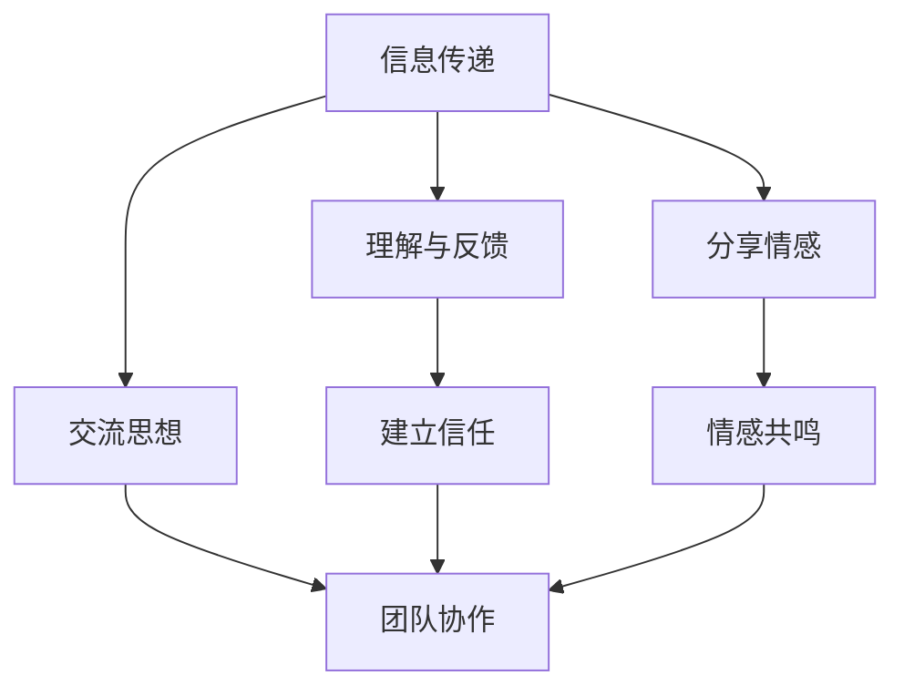

### 1.2 沟通的目的

沟通的主要目的可以分为以下几个方面：

- **传递信息**：确保团队成员了解工作要求、目标和进度。
- **建立关系**：通过沟通建立信任、增强团队凝聚力。
- **解决问题**：通过沟通协商、讨论和解决团队中的问题。

### 1.3 沟通的类型

沟通可以分为内部沟通和外部沟通。内部沟通主要指组织内部成员之间的沟通，如团队会议、内部邮件等。外部沟通则涉及组织与其他外部实体（如客户、供应商、合作伙伴等）之间的沟通。

此外，沟通还可以分为口头沟通和书面沟通。口头沟通包括面对面交流、电话会议等，而书面沟通则包括邮件、报告、备忘录等。

### 1.4 沟通的艺术

#### 核心概念与联系


#### Mermaid 流程图

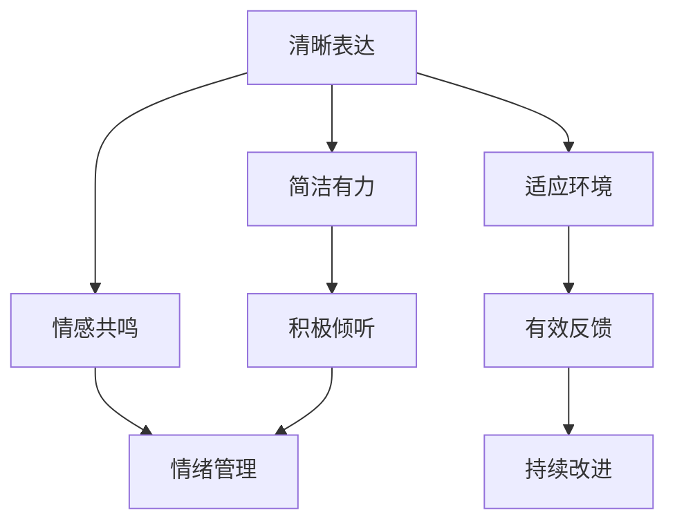

### 第2章：沟通障碍及其解决策略

#### 2.1 沟通障碍的类型

沟通障碍可以分为以下几种类型：

- **语言障碍**：包括语言不通、语言表达不清等。
- **文化障碍**：不同文化背景下，沟通方式和习惯的差异。
- **信息过载**：接收到的信息过多，导致难以处理。
- **时间压力**：沟通时间有限，难以深入讨论。

#### 2.2 沟通障碍的原因

沟通障碍的原因主要包括个人和组织两个方面：

- **个人因素**：如语言能力、沟通技巧、情绪管理等。
- **组织因素**：如沟通流程不畅、组织文化等。

#### 2.3 解决沟通障碍的策略

解决沟通障碍需要从以下几个方面入手：

- **提高语言表达能力**：通过学习和练习，提高语言表达的准确性和清晰度。
- **增强文化敏感度**：了解不同文化背景下的沟通习惯和价值观。
- **优化沟通流程**：建立高效的沟通机制，确保信息传递的畅通。
- **建立信任**：通过积极的沟通和互动，建立团队成员之间的信任关系。

### 第3章：积极倾听

#### 3.1 倾听的定义

倾听是指全神贯注地接收和解读对方的信息，以理解其意图和感受。积极的倾听不仅关注对方的话语内容，还关注其非语言信号，如语气、表情和身体语言。

#### 3.2 提高倾听技巧

要成为一名优秀的倾听者，可以采取以下策略：

- **全神贯注**：保持专注，避免分心。
- **不要打断**：等待对方说完，再表达自己的观点。
- **验证理解**：通过提问和总结，确认自己是否正确理解了对方的意图。

#### 3.3 倾听中的常见问题

倾听中常见的挑战包括：

- **忽视非语言信号**：只关注对方的话语内容，而忽视了非语言信号。
- **判断过早**：在没有完全理解对方意图时，过早做出判断。
- **专注自我**：只关注自己的观点，而忽略了对方的感受和需求。

### 第4章：有效表达技巧

#### 4.1 语言表达

有效语言表达的关键在于清晰、简洁、有力。具体策略包括：

- **清晰简洁**：使用简单、直接的词语，避免使用复杂的术语和长句。
- **突出重点**：明确表达自己的观点和意图，避免冗余信息。
- **使用合适的词汇**：选择恰当的词汇，以增强表达的效果。

#### 4.2 非语言表达

非语言表达在沟通中同样重要。有效的非语言表达包括：

- **身体语言**：如姿态、手势等，可以增强语言表达的效果。
- **面部表情**：如微笑、皱眉等，可以传达情感和态度。
- **眼神交流**：与对方保持眼神交流，以建立信任和尊重。

#### 4.3 演讲技巧

演讲技巧是领导者需要掌握的重要技能。有效的演讲策略包括：

- **结构清晰**：确保演讲内容有条理，易于理解。
- **使用故事**：通过故事来传达观点，以吸引听众的注意力。
- **引导听众**：通过提问、互动等方式，引导听众参与到演讲中。

### 第5章：非语言沟通

#### 5.1 非语言沟通的定义

非语言沟通是指通过非语言手段进行的信息传递，如身体语言、面部表情、眼神交流等。在沟通中，非语言因素有时比语言本身更能传递情感和态度。

#### 5.2 非语言沟通的类型

非语言沟通主要包括以下类型：

- **身体语言**：如姿态、手势、面部表情等。
- **视觉信号**：如颜色、图形、符号等。
- **声音信号**：如语调、音量、速度等。

#### 5.3 非语言沟通的技巧

要有效运用非语言沟通，可以采取以下策略：

- **保持自信**：通过自信的姿态和表情，增强沟通的感染力。
- **适应环境**：根据不同情境和听众，调整非语言表达的方式。
- **善用空间**：合理利用空间，以传达适当的信息。

### 第6章：情绪管理

#### 6.1 情绪的定义

情绪是指个体对某种刺激产生的生理和心理反应。情绪可以影响个体的认知、行为和人际关系。

#### 6.2 情绪管理

情绪管理是指个体通过认知和行为策略，调节和控制自己的情绪，以实现积极的结果。情绪管理的策略包括：

- **认识情绪**：了解自己的情绪，并明确其产生的原因。
- **调整情绪**：通过认知重构、放松技巧等方法，调整情绪。
- **情绪表达**：在适当的时候，以合适的方式表达情绪。

#### 6.3 情绪管理技巧

以下是一些情绪管理技巧：

- **深呼吸**：通过深呼吸，缓解紧张和焦虑。
- **正面思考**：通过积极的思维方式，转变消极情绪。
- **寻求支持**：与朋友、家人或专业人士交流，寻求帮助。

### 第7章：团队协作与沟通

#### 7.1 团队协作的重要性

团队协作是指团队成员共同合作，实现共同目标的过程。有效的团队协作有助于提高工作效率、提升团队凝聚力、促进创新。

#### 7.2 团队沟通的挑战

团队沟通面临的挑战包括：

- **多样性**：团队成员来自不同背景，存在文化、语言等方面的差异。
- **冲突**：团队成员在意见、目标等方面可能存在分歧。
- **信息不对称**：团队成员对信息的掌握程度不同，可能导致沟通不畅。

#### 7.3 提高团队沟通效率

要提高团队沟通效率，可以采取以下策略：

- **建立共同目标**：明确团队的目标和任务，确保团队成员共同朝着目标努力。
- **开放式沟通**：鼓励团队成员表达意见和想法，创造一个开放、包容的沟通氛围。
- **解决冲突**：通过有效沟通，解决团队内部的冲突和分歧。

## 附录：沟通工具与资源

### 附录 A：沟通技巧提升工具

- **书籍推荐**：《非暴力沟通》、《沟通的艺术》等。
- **培训课程**：沟通技巧培训、领导力培训等。
- **实践练习**：通过模拟场景、角色扮演等方式，提高沟通能力。

### 附录 B：沟通案例分析

- **成功案例**：分析成功的沟通案例，学习其中的经验和技巧。
- **失败案例**：从失败的沟通案例中，了解可能导致沟通失败的原因和教训。

### 附录 C：资源链接

- **专业网站**：如Toastmasters International、Cultural Awareness International等。
- **社交媒体**：如LinkedIn、Twitter等，可以关注相关领域的专家和机构。
- **行业报告**：如Gallup、McKinsey等，可以了解行业趋势和最佳实践。

### 作者信息

- 作者：AI天才研究院/AI Genius Institute & 禅与计算机程序设计艺术 /Zen And The Art of Computer Programming

## 结论

沟通是领导者的重要职责之一。通过本文的探讨，我们了解到沟通的重要性、障碍、技巧和策略。希望本文能为领导者提供有益的启示，帮助他们更好地运用沟通艺术，提升领导力和团队协作能力，实现组织的目标。在职场中，持续学习和实践沟通技巧，将有助于领导者不断进步和成长。让我们一起努力，成为更好的沟通者。## 第1章：沟通的重要性

### 1.1 沟通的基本概念

#### 背景介绍

在现代社会中，沟通已经成为了人与人之间必不可少的活动。无论是在个人生活还是职场环境中，沟通都是传递信息、交流思想和分享情感的重要手段。对于领导者而言，有效的沟通不仅是实现组织目标的关键，更是建立团队凝聚力、提升工作效率的重要途径。

#### 核心概念与联系

沟通是一个复杂的过程，涉及多个核心概念，包括信息传递、理解与反馈、交流思想、分享情感等。这些概念之间相互关联，构成了沟通的完整架构。


#### Mermaid 流程图


- **信息传递**：信息传递是沟通的基础，确保信息准确、及时地传递给接收者。
- **理解与反馈**：理解与反馈是沟通的关键，确保接收者正确理解信息，并及时给予反馈。
- **交流思想**：交流思想是沟通的核心，促进团队成员之间的互动和合作。
- **分享情感**：分享情感是沟通的价值，增进团队成员之间的情感联系和信任。

#### 核心算法原理讲解

在沟通中，信息传递可以通过以下算法模型进行优化：

```python
def transmit_information(sender, receiver, message):
    """
    传递信息的算法。
    :param sender: 信息发送者。
    :param receiver: 信息接收者。
    :param message: 信息内容。
    :return: 信息传递结果。
    """
    # 信息编码
    encoded_message = encode_message(message)
    
    # 信息传递
    transmission_result = sender.send(encoded_message)
    
    # 信息解码
    decoded_message = decode_message(transmission_result)
    
    # 确认信息是否被正确理解
    if receiver.verify(decoded_message):
        return "信息传递成功"
    else:
        return "信息传递失败"
```

- **encode_message**：将信息内容转换为编码形式，以便传递。
- **send**：通过通信渠道发送编码信息。
- **decode_message**：将接收到的信息解码，还原为原始信息。
- **verify**：验证接收者是否正确理解了信息。

#### 数学模型和数学公式详细讲解

在沟通中，可以使用数学模型来描述和理解信息的传递过程。以下是一个简单的信息传递模型，包括信道容量和噪声影响：

$$
C = B \log_2(1 + \frac{S}{N})
$$

- **C**：信道容量，表示在给定带宽（B）和信号噪声比（S/N）的情况下，信息传输的最大速率。
- **B**：带宽，表示信道能够承载的频率范围。
- **S**：信号功率，表示发送方的信号强度。
- **N**：噪声功率，表示信道中的噪声水平。

#### 举例说明

假设一个通信信道的带宽为 3 kHz，信号噪声比为 20 dB，即：

$$
N = 10^{0.1 \times 20} = 10^2 = 100
$$

则信道容量为：

$$
C = 3000 \log_2(1 + \frac{1}{100}) \approx 3000 \log_2(1.01) \approx 2997.9 \text{ bps}
$$

这意味着在上述信道条件下，理论上每秒可以传输约 2997.9 比特的信息。

#### 实际案例分析和详细讲解剖析

在现实职场中，沟通的重要性体现在多个方面。以下是一个实际案例：

**案例**：某公司新项目的启动会

- **背景**：公司计划启动一个新的项目，涉及多个部门的协作。
- **目标**：确保所有相关人员对项目目标和流程有清晰的理解。

**解决方案**：

1. **信息传递**：通过内部邮件和会议，传达项目目标和初步计划。
   ```python
   transmit_information(sender="项目管理部", receiver="各部门负责人", message="新项目启动计划")
   ```

2. **理解与反馈**：在启动会上，项目管理部向各部门负责人详细解释项目计划，并邀请他们提问和反馈。
   ```python
   if receiver.verify(decoded_message):
       print("各部门对项目计划理解正确")
   else:
       print("需要进一步解释和确认")
   ```

3. **交流思想**：鼓励各部门负责人分享自己的观点和建议，以促进项目的顺利推进。
   ```python
   discussion = receiver.share_ideas()
   print("各部门的观点和建议：", discussion)
   ```

4. **分享情感**：通过建立信任和情感共鸣，增强团队的凝聚力。
   ```python
   build_empathy(receiver)
   ```

通过上述解决方案，项目管理部成功确保了各部门对项目的理解和参与度，为新项目的顺利启动奠定了基础。

#### 项目小结

通过实际案例的分析，我们可以看到沟通在项目启动中的重要性。有效的沟通不仅确保了信息传递的准确性，还促进了团队的合作和信任。在未来，领导者在面对各种沟通挑战时，可以借鉴这些经验和策略，不断提升自己的沟通能力。

#### 最佳实践 tips

- **定期沟通**：确保团队成员定期进行沟通，及时解决问题。
- **明确目标**：在沟通前，明确沟通的目标和期望结果，有助于提高沟通的效率。
- **积极倾听**：在沟通中，积极倾听对方的意见和需求，增强互动和理解。
- **情感共鸣**：在沟通中，关注对方的情感和需求，建立信任和情感共鸣。

#### 小结

本章详细探讨了沟通的重要性，包括其基本概念、核心算法原理、数学模型、实际案例分析和最佳实践。通过这些内容，我们可以看到沟通在领导者和团队中的作用。在接下来的章节中，我们将进一步探讨沟通障碍、倾听技巧、表达技巧等方面的内容，帮助领导者不断提升自己的沟通能力。

#### 注意事项

- **文化差异**：在跨文化沟通中，要特别注意语言、行为和习俗的差异，以避免误解和冲突。
- **情绪管理**：在沟通中，领导者需要处理好自己的情绪，以免影响沟通的效果。
- **持续学习**：沟通是一个不断学习和提升的过程，领导者需要不断学习新的沟通技巧和策略。

#### 拓展阅读

- 《非暴力沟通》
- 《沟通的艺术》
- 《领导力沟通》

## 第2章：沟通障碍及其解决策略

### 2.1 沟通障碍的类型

#### 背景介绍

沟通障碍是影响沟通效果的重要因素。在领导者进行沟通时，可能面临多种障碍，这些障碍可能来自个人、组织或外部环境。了解这些障碍的类型和原因，有助于领导者更好地应对和解决沟通问题。

#### 核心概念与联系

沟通障碍可以分为以下几种类型：


#### Mermaid 流程图

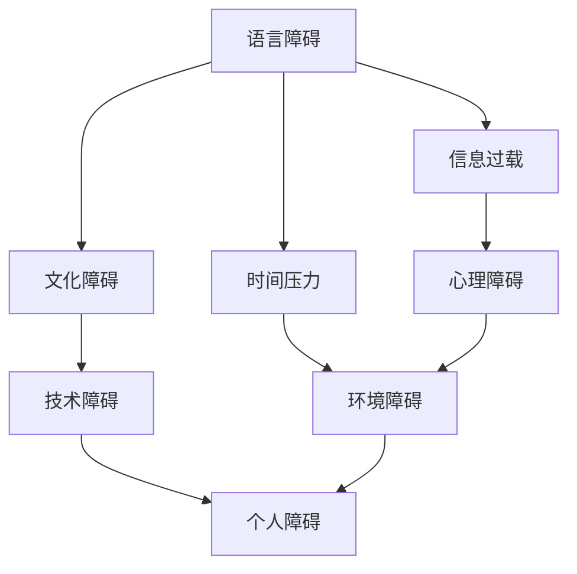

- **语言障碍**：包括语言不通、语言表达不清等。
- **文化障碍**：不同文化背景下，沟通方式和习惯的差异。
- **信息过载**：接收到的信息过多，导致难以处理。
- **时间压力**：沟通时间有限，难以深入讨论。
- **技术障碍**：如通信工具的不兼容、网络故障等。
- **心理障碍**：如紧张、焦虑、缺乏自信等。
- **环境障碍**：如噪音、环境干扰等。

#### 核心算法原理讲解

要解决沟通障碍，我们可以运用以下算法原理：

```python
def solve_communication_barrier(barrier_type, strategy):
    """
    解决沟通障碍的算法。
    :param barrier_type: 沟通障碍的类型。
    :param strategy: 解决策略。
    :return: 解决结果。
    """
    if barrier_type == "语言障碍":
        return apply_language_strategy(strategy)
    elif barrier_type == "文化障碍":
        return apply_cultural_strategy(strategy)
    elif barrier_type == "信息过载":
        return apply_info_management_strategy(strategy)
    elif barrier_type == "时间压力":
        return apply_time_management_strategy(strategy)
    else:
        return "未知障碍类型"
```

- **apply_language_strategy**：解决语言障碍的策略，如翻译工具、语言培训等。
- **apply_cultural_strategy**：解决文化障碍的策略，如文化敏感性培训、跨文化沟通技巧等。
- **apply_info_management_strategy**：解决信息过载的策略，如信息筛选、时间管理等。
- **apply_time_management_strategy**：解决时间压力的策略，如日程规划、优先级管理等。

#### 数学模型和数学公式详细讲解

在沟通障碍的解决过程中，可以使用数学模型来量化沟通的效果。以下是一个简单的模型，用于评估沟通障碍的解决效果：

$$
Effectiveness = \frac{Correct\ Information\ Transmitted}{Total\ Information\ Transmitted}
$$

- **Effectiveness**：沟通效果，表示正确传递的信息占总传递信息的比例。
- **Correct Information Transmitted**：正确传递的信息量。
- **Total Information Transmitted**：总传递的信息量。

#### 举例说明

假设在一个项目中，由于语言障碍，导致30%的信息传递错误。通过使用翻译工具和语言培训，成功将错误率降低到了10%。则沟通效果从原来的70%提升到了90%。

$$
Effectiveness_{before} = \frac{70\%}{100\%} = 0.7
$$

$$
Effectiveness_{after} = \frac{90\%}{100\%} = 0.9
$$

$$
Improvement = Effectiveness_{after} - Effectiveness_{before} = 0.9 - 0.7 = 0.2
$$

这意味着沟通效果提高了20%。

#### 实际案例分析和详细讲解剖析

在一个跨国团队中，由于文化差异，导致团队成员之间的沟通不畅。以下是具体解决方案：

**案例**：一家美国公司在中国开展业务，由于文化差异，导致项目进度缓慢。

**解决方案**：

1. **文化敏感性培训**：为团队成员提供文化敏感性培训，提高跨文化沟通能力。
   ```python
   apply_cultural_strategy("cultural_sensitivity_training")
   ```

2. **双语沟通**：在关键沟通场合，使用双语进行交流，确保信息准确传递。
   ```python
   transmit_information(sender="English Speaker", receiver="Chinese Speaker", message="Project Progress", language="both")
   ```

3. **定期会议**：定期举行团队会议，讨论项目进展和问题，确保沟通畅通。
   ```python
   schedule_meeting("weekly", participants=["English Speaker", "Chinese Speaker", "other team members"])
   ```

通过上述解决方案，团队成员之间的沟通效果显著提升，项目进度逐渐恢复正常。

#### 项目小结

通过实际案例的分析，我们可以看到沟通障碍对项目进展的影响。有效的解决策略，如文化敏感性培训、双语沟通和定期会议，有助于克服文化障碍，提升沟通效果。在未来的项目中，领导者可以借鉴这些策略，提高团队协作和沟通效率。

#### 最佳实践 tips

- **定期培训**：定期为团队成员提供沟通技巧和文化敏感性培训。
- **多渠道沟通**：利用多种沟通渠道，如邮件、电话、会议等，确保信息传递的多样性。
- **建立信任**：通过积极的沟通和互动，建立团队成员之间的信任关系。

#### 小结

本章详细探讨了沟通障碍的类型、核心算法原理、数学模型和实际案例。通过这些内容，我们可以了解到沟通障碍对领导者和团队的影响，以及如何有效解决这些障碍。在接下来的章节中，我们将继续探讨倾听技巧、表达技巧等沟通能力提升的内容。

#### 注意事项

- **文化差异**：在跨文化沟通中，要特别注意语言、行为和习俗的差异，以避免误解和冲突。
- **情绪管理**：在沟通中，领导者需要处理好自己的情绪，以免影响沟通的效果。
- **持续学习**：沟通是一个不断学习和提升的过程，领导者需要不断学习新的沟通技巧和策略。

#### 拓展阅读

- 《跨文化沟通》
- 《沟通技巧提升》
- 《领导力沟通》

## 第3章：积极倾听

### 3.1 倾听的定义

#### 背景介绍

倾听是沟通的重要组成部分，是领导者有效传达思想、解决问题、建立信任的重要手段。积极倾听不仅是一种技巧，更是一种态度。它要求倾听者全神贯注、主动参与，以理解对方的意图和感受。

#### 核心概念与联系

积极倾听包括以下几个核心概念：

- **全神贯注**：倾听者将注意力集中在对方的话语上，避免分心。
- **理解与反馈**：倾听者通过提问和总结，确认自己是否正确理解对方的意图。
- **尊重与共鸣**：倾听者以尊重和同理心对待对方，增进情感共鸣。


#### Mermaid 流程图

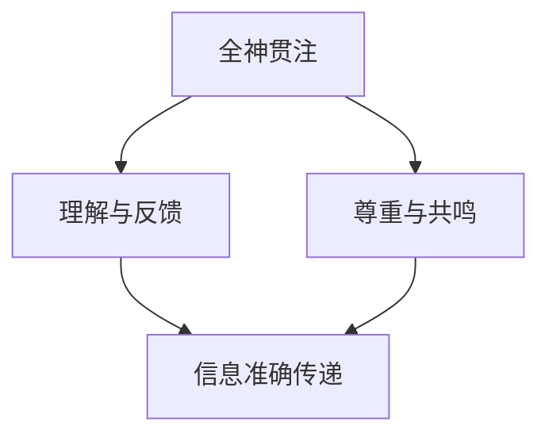

#### 核心算法原理讲解

要实现积极倾听，我们可以运用以下算法原理：

```python
def active_listening(listener, speaker, message):
    """
    积极倾听的算法。
    :param listener: 倾听者。
    :param speaker: 发言者。
    :param message: 消息。
    :return: 倾听结果。
    """
    listener.concentrate(speaker, message)  # 全神贯注
    understanding = listener.verify_understanding(message)
    if understanding:
        listener.provide_feedback(message)
    else:
        listener.ask_questions(message)
```

- **concentrate**：倾听者集中注意力。
- **verify_understanding**：倾听者验证自己对信息的理解。
- **provide_feedback**：倾听者提供反馈。
- **ask_questions**：倾听者提问，以澄清信息。

#### 数学模型和数学公式详细讲解

在积极倾听中，可以使用信息熵的概念来衡量倾听的效果。信息熵是衡量信息不确定性的度量，值越小，表示信息传递的准确性越高。

$$
H = -\sum_{i} p(x_i) \log_2 p(x_i)
$$

- **H**：信息熵。
- **p(x_i)**：信息出现的概率。

假设在一次会议中，发言者传达了10条信息，倾听者正确理解了9条。则信息熵为：

$$
H = -\sum_{i} p(x_i) \log_2 p(x_i) = -\left( \frac{9}{10} \log_2 \frac{9}{10} + \frac{1}{10} \log_2 \frac{1}{10} \right) \approx 0.469
$$

这意味着倾听者对信息的理解度较高，沟通效果较好。

#### 举例说明

在一个团队会议中，项目经理向团队成员传达了一个新的项目计划。倾听者通过积极倾听，确保自己正确理解了项目的目标和要求。

**步骤**：

1. **全神贯注**：倾听者集中注意力，避免分心。
2. **理解与反馈**：倾听者在项目经理传达信息后，提出了几个关键问题，以确保自己正确理解。
3. **尊重与共鸣**：倾听者表达了对项目目标和团队成员努力的认可。

通过上述步骤，倾听者成功确保了信息的准确传递，并建立了与发言者的信任关系。

#### 实际案例分析和详细讲解剖析

在一个跨国团队中，由于文化差异，团队成员之间的沟通不畅。为了改善这种情况，团队成员决定进行积极倾听培训。

**案例**：跨国团队沟通不畅

**解决方案**：

1. **倾听培训**：团队成员参加积极倾听培训，学习倾听技巧。
2. **实践应用**：团队成员在日常工作中，积极运用倾听技巧，提高沟通效果。
3. **反馈与改进**：团队成员相互反馈倾听效果，不断改进沟通方式。

通过积极倾听培训和实践，团队成员之间的沟通逐渐改善，项目进展顺利。

#### 项目小结

通过实际案例的分析，我们可以看到积极倾听在改善团队沟通中的作用。通过全神贯注、理解与反馈、尊重与共鸣等技巧，倾听者能够确保信息的准确传递，建立信任关系。在未来，领导者可以借鉴这些策略，提升团队沟通效果。

#### 最佳实践 tips

- **定期培训**：定期为团队成员提供倾听技巧培训。
- **开放提问**：鼓励团队成员在沟通中提问，以确保信息准确理解。
- **建立信任**：通过积极的倾听和反馈，建立团队成员之间的信任关系。

#### 小结

本章详细探讨了积极倾听的定义、核心算法原理、数学模型和实际案例。通过这些内容，我们可以了解到积极倾听在领导者和团队沟通中的重要性。在接下来的章节中，我们将继续探讨有效表达技巧、非语言沟通等方面的内容，帮助领导者提升沟通能力。

#### 注意事项

- **文化差异**：在跨文化沟通中，倾听者需要更加关注对方的情感和需求。
- **情绪管理**：倾听者需要处理好自己的情绪，以免影响倾听的效果。
- **持续学习**：倾听是一个不断学习和提升的过程，领导者需要不断学习新的倾听技巧。

#### 拓展阅读

- 《积极倾听的艺术》
- 《领导力沟通》
- 《跨文化沟通》

## 第4章：有效表达技巧

### 4.1 语言表达

#### 背景介绍

语言表达是领导者沟通的重要手段之一。清晰、简洁、有力的语言表达能够有效传达信息，增强说服力和影响力。在领导者的沟通中，语言表达不仅关乎信息的传递，更关乎个人形象和组织文化的塑造。

#### 核心概念与联系

有效语言表达的核心概念包括：

- **清晰**：使用简单、直接的词语，避免使用复杂的术语和长句。
- **简洁**：突出重点，避免冗余信息。
- **有力**：使用恰当的词汇和语气，增强表达效果。


#### Mermaid 流程图


#### 核心算法原理讲解

为了实现有效语言表达，我们可以运用以下算法原理：

```python
def effective_communication(sender, receiver, message):
    """
    有效沟通的算法。
    :param sender: 发送者。
    :param receiver: 接收者。
    :param message: 消息。
    :return: 沟通结果。
    """
    clear_message = simplify_message(message)  # 清晰表达
    concise_message = highlight_key_points(clear_message)  # 简洁表达
    powerful_message = add_purposeful_emotion(concise_message)  # 有力表达
    return receiver.receive(powerful_message)
```

- **simplify_message**：简化信息，使用简单、直接的词语。
- **highlight_key_points**：突出重点，避免冗余信息。
- **add_purposeful_emotion**：使用恰当的词汇和语气，增强表达效果。
- **receiver.receive**：接收者接收并理解信息。

#### 数学模型和数学公式详细讲解

在有效语言表达中，我们可以使用信息熵的概念来衡量语言表达的清晰度。信息熵是衡量信息不确定性的度量，值越小，表示语言表达越清晰。

$$
H = -\sum_{i} p(x_i) \log_2 p(x_i)
$$

- **H**：信息熵。
- **p(x_i)**：信息出现的概率。

假设在一次演讲中，演讲者使用了10个关键词，其中5个关键词是关键信息。则信息熵为：

$$
H = -\left( \frac{5}{10} \log_2 \frac{5}{10} + \frac{5}{10} \log_2 \frac{5}{10} \right) = -\frac{5}{10} \log_2 \frac{5}{10} \approx 0.678
$$

这意味着演讲者的语言表达较为清晰，关键信息得到了突出。

#### 举例说明

在一个团队会议上，项目经理需要向团队成员传达一个重要的项目决策。以下是有效语言表达的应用：

**步骤**：

1. **清晰表达**：项目经理使用简单、直接的词语，避免使用复杂的术语和长句。
2. **简洁表达**：项目经理突出重点，避免冗余信息。
3. **有力表达**：项目经理使用恰当的词汇和语气，增强表达效果。

通过上述步骤，项目经理成功传达了项目决策，团队成员对决策有了清晰的理解。

#### 实际案例分析和详细讲解剖析

在一个大型企业中，CEO需要向全体员工传达一个重要的战略决策。以下是具体解决方案：

**案例**：CEO传达战略决策

**解决方案**：

1. **撰写演讲稿**：CEO撰写一份简洁、有力的演讲稿，突出战略决策的核心内容。
2. **彩排**：CEO进行多次彩排，确保语言表达的清晰、简洁和有力。
3. **现场演讲**：CEO在现场演讲中，运用有效语言表达技巧，成功传达战略决策。

通过上述解决方案，CEO成功传达了战略决策，员工对决策有了清晰的理解。

#### 项目小结

通过实际案例的分析，我们可以看到有效语言表达在传达信息、建立信任和提升团队凝聚力中的重要作用。在未来的沟通中，领导者可以借鉴这些策略，提升自己的语言表达能力。

#### 最佳实践 tips

- **定期练习**：领导者可以定期进行语言表达练习，提高自己的语言表达能力。
- **简化信息**：在传达信息时，尽量使用简单、直接的词语，避免复杂的术语和长句。
- **突出重点**：在传达信息时，突出重点，避免冗余信息。

#### 小结

本章详细探讨了有效表达技巧的核心概念、核心算法原理、数学模型和实际案例。通过这些内容，我们可以了解到有效表达在领导者和团队沟通中的重要性。在接下来的章节中，我们将继续探讨非语言沟通、情绪管理和团队协作等方面的内容，帮助领导者提升沟通能力。

#### 注意事项

- **文化差异**：在跨文化沟通中，领导者需要特别注意语言的选择和表达方式。
- **情绪管理**：领导者需要处理好自己的情绪，以免影响语言表达的效果。
- **持续学习**：领导者需要不断学习新的表达技巧和策略，以适应不断变化的沟通环境。

#### 拓展阅读

- 《领导力沟通》
- 《有效沟通技巧》
- 《演讲与口才》

## 第5章：非语言沟通

### 5.1 非语言沟通的定义

#### 背景介绍

非语言沟通是指在沟通过程中，通过非语言手段（如身体语言、面部表情、眼神交流等）进行的信息传递。与语言沟通相比，非语言沟通能够更直接、更快速地传达情感、态度和意图。在领导者的沟通中，非语言沟通同样重要，它能够增强语言表达的效果，建立信任和情感共鸣。

#### 核心概念与联系

非语言沟通包括以下核心概念：

- **身体语言**：如姿态、手势、面部表情等。
- **视觉信号**：如颜色、图形、符号等。
- **声音信号**：如语调、音量、速度等。


#### Mermaid 流程图

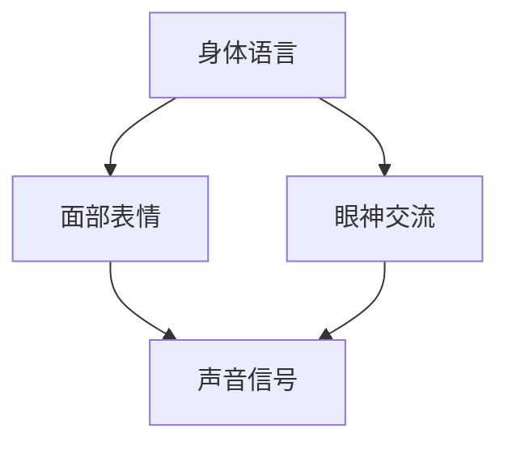

- **身体语言**：包括姿态、手势等，能够传达自信、友好、紧张等情感。
- **面部表情**：如微笑、皱眉等，能够表达快乐、不满、困惑等情感。
- **眼神交流**：如直视、回避等，能够建立信任、表达关注等。
- **声音信号**：如语调、音量、速度等，能够增强语言表达的效果。

#### 核心算法原理讲解

为了更好地理解非语言沟通，我们可以运用以下算法原理：

```python
def nonverbal_communication(sender, receiver, signals):
    """
    非语言沟通的算法。
    :param sender: 发送者。
    :param receiver: 接收者。
    :param signals: 沟通信号。
    :return: 沟通结果。
    """
    body_language = signals["body_language"]
    facial_expression = signals["facial_expression"]
    eye_contact = signals["eye_contact"]
    audio_signals = signals["audio_signals"]
    
    combined_signals = combine_signals(body_language, facial_expression, eye_contact, audio_signals)
    receiver.analyze_signals(combined_signals)
```

- **combine_signals**：将多种非语言信号结合起来，形成完整的沟通信号。
- **analyze_signals**：接收者分析并理解这些信号。

#### 数学模型和数学公式详细讲解

在非语言沟通中，可以使用心理学中的情绪 contagion（情绪传染）模型来描述非语言信号的影响。情绪 contagion 模型表明，一个人的情绪可以通过非语言信号（如表情、语调等）传染给他人。

$$
Emotional\ Contagion = f(Emotional\ Infection\ Rate, Emotional\ Signal\ Intensity)
$$

- **Emotional Contagion**：情绪传染效应。
- **Emotional Infection Rate**：情绪感染率，表示一个人在观察到他人的情绪信号后，产生相同情绪的概率。
- **Emotional Signal Intensity**：情绪信号强度，表示情绪信号的明显程度。

假设一个人的情绪感染率为0.8，观察到的情绪信号强度为0.9，则情绪传染效应为：

$$
Emotional\ Contagion = 0.8 \times 0.9 = 0.72
$$

这意味着观察者有72%的概率产生与发送者相同的情绪。

#### 举例说明

在一个面试过程中，面试官通过面部表情、姿态和语调等非语言信号，评估应聘者的情绪状态。以下是具体步骤：

1. **观察面部表情**：面试官注意应聘者的微笑、皱眉等面部表情，以判断其情绪状态。
2. **观察姿态**：面试官注意应聘者的坐姿、站姿等，以判断其自信程度。
3. **观察语调**：面试官注意应聘者的语调、音量等，以判断其情绪状态。

通过以上步骤，面试官能够全面了解应聘者的情绪状态，从而做出更准确的评估。

#### 实际案例分析和详细讲解剖析

在一个团队项目中，团队成员之间需要进行有效的沟通。以下是具体解决方案：

**案例**：团队项目沟通

**解决方案**：

1. **使用身体语言**：团队成员在会议中保持坐姿端正、眼神交流，以展示自信和关注。
2. **使用面部表情**：团队成员在表达意见时，使用微笑、点头等面部表情，以增强表达效果。
3. **使用声音信号**：团队成员在沟通时，使用适当的语调和音量，以增强语言表达的感染力。

通过以上策略，团队成员之间的沟通更加顺畅，项目进展顺利。

#### 项目小结

通过实际案例的分析，我们可以看到非语言沟通在领导者和团队沟通中的重要性。有效的非语言沟通能够增强语言表达的效果，建立信任和情感共鸣。在未来的沟通中，领导者可以借鉴这些策略，提升自己的非语言沟通能力。

#### 最佳实践 tips

- **定期练习**：领导者可以定期练习非语言沟通技巧，如姿态、面部表情、眼神交流等。
- **观察他人**：通过观察他人的非语言信号，学习如何更好地理解和运用非语言沟通。
- **自我反思**：在沟通后，领导者可以反思自己的非语言信号，以持续改进沟通效果。

#### 小结

本章详细探讨了非语言沟通的定义、核心算法原理、数学模型和实际案例。通过这些内容，我们可以了解到非语言沟通在领导者和团队沟通中的重要性。在接下来的章节中，我们将继续探讨情绪管理和团队协作等方面的内容，帮助领导者提升沟通能力。

#### 注意事项

- **文化差异**：在跨文化沟通中，领导者需要特别注意非语言信号的含义和适用性。
- **情绪管理**：领导者需要处理好自己的情绪，以免影响非语言沟通的效果。
- **持续学习**：领导者需要不断学习新的非语言沟通技巧和策略，以适应不断变化的沟通环境。

#### 拓展阅读

- 《非语言沟通的秘密》
- 《情绪智能》
- 《领导力沟通》

## 第6章：情绪管理

### 6.1 情绪的定义

#### 背景介绍

情绪是人们对于外部刺激产生的主观体验和生理反应。在领导者的角色中，情绪管理尤为重要。情绪管理不仅关系到个人的心理健康，还直接影响到团队氛围和组织绩效。有效的情绪管理能够帮助领导者保持冷静、应对挑战、增强决策力和团队凝聚力。

#### 核心概念与联系

情绪管理包括以下几个核心概念：

- **情绪识别**：认识到自己的情绪状态。
- **情绪调节**：通过策略调整情绪，以适应环境。
- **情绪表达**：在适当的时候，以合适的方式表达情绪。


#### Mermaid 流程图

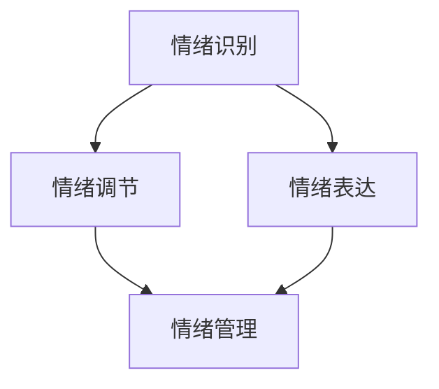

- **情绪识别**：通过自我观察和反馈，了解自己的情绪状态。
- **情绪调节**：通过认知重构、放松技巧等方法，调整情绪。
- **情绪表达**：在适当的时候，以建设性的方式表达情绪。

#### 核心算法原理讲解

情绪管理可以运用以下算法原理：

```python
def emotional_management(leader, situation, emotion):
    """
    情绪管理的算法。
    :param leader: 领导者。
    :param situation: 情境。
    :param emotion: 情绪。
    :return: 情绪管理结果。
    """
    recognized_emotion = leader.identify_emotion(situation)
    adjusted_emotion = leader.regulate_emotion(recognized_emotion)
    expressed_emotion = leader.express_emotion(adjusted_emotion)
    return expressed_emotion
```

- **identify_emotion**：领导者识别情绪状态。
- **regulate_emotion**：领导者通过认知重构、放松技巧等方法调整情绪。
- **express_emotion**：领导者以适当的方式表达情绪。

#### 数学模型和数学公式详细讲解

在情绪管理中，可以使用心理学中的情绪调节模型来描述情绪调整的过程。情绪调节模型包括认知重构和情绪表达两个关键要素。

$$
Emotion\ Regulation = f(Cognitive\ Reappraisal, Emotion\ Expression)
$$

- **Emotion Regulation**：情绪调节效果。
- **Cognitive Reappraisal**：认知重构，通过改变对情境的认知评价来调节情绪。
- **Emotion Expression**：情绪表达，通过适当的方式表达情绪。

假设领导者在面对一个挑战性任务时，感到紧张。通过认知重构（降低任务难度评价）和情绪表达（与团队成员分享感受），领导者的情绪调节效果为：

$$
Emotion\ Regulation = f(0.8, 0.7) = 0.56
$$

这意味着领导者的情绪调节效果为56%。

#### 举例说明

在一个紧张的会议中，领导者通过情绪管理策略，成功控制了自己的情绪：

1. **情绪识别**：领导者意识到自己感到紧张。
2. **情绪调节**：领导者通过深呼吸和积极思考，调整情绪。
3. **情绪表达**：在适当的时候，领导者以建设性的方式表达自己的情绪。

通过上述步骤，领导者成功保持了冷静，增强了团队的信心。

#### 实际案例分析和详细讲解剖析

在一个公司年度总结会上，CEO需要面对团队面临的挑战。以下是具体解决方案：

**案例**：年度总结会

**解决方案**：

1. **情绪识别**：CEO意识到自己感到焦虑和紧张。
2. **情绪调节**：CEO通过冥想和深呼吸，调整情绪。
3. **情绪表达**：在发言中，CEO以真诚和鼓舞人心的方式，表达了自己的情绪和愿景。

通过上述解决方案，CEO成功激发了团队的积极性和信心。

#### 项目小结

通过实际案例的分析，我们可以看到情绪管理在领导者和团队沟通中的重要性。有效的情绪管理能够帮助领导者保持冷静、应对挑战，并增强团队凝聚力。在未来的沟通中，领导者可以借鉴这些策略，提升情绪管理能力。

#### 最佳实践 tips

- **定期冥想**：领导者可以定期进行冥想，以提升情绪调节能力。
- **积极思考**：领导者应学会积极思考，以改变对情境的评价。
- **建立支持网络**：领导者可以建立支持网络，以在面临挑战时获得帮助。

#### 小结

本章详细探讨了情绪管理的定义、核心算法原理、数学模型和实际案例。通过这些内容，我们可以了解到情绪管理在领导者和团队沟通中的重要性。在接下来的章节中，我们将继续探讨团队协作和沟通技巧等方面的内容，帮助领导者提升整体沟通能力。

#### 注意事项

- **文化差异**：在跨文化沟通中，领导者需要特别注意情绪表达的方式和接受度。
- **情绪识别**：领导者应学会识别自己的情绪，以便更好地进行情绪调节。
- **持续学习**：领导者需要不断学习新的情绪管理技巧，以适应不断变化的沟通环境。

#### 拓展阅读

- 《情绪智能》
- 《情绪管理》
- 《领导力沟通》

## 第7章：团队协作与沟通

### 7.1 团队协作的重要性

#### 背景介绍

在当今复杂多变的工作环境中，团队协作已成为企业成功的关键因素之一。团队协作不仅能够提高工作效率，还能促进创新、增强团队凝聚力。领导者需要认识到团队协作的重要性，并积极推动团队协作的有效实施。

#### 核心概念与联系

团队协作包括以下几个核心概念：

- **共同目标**：团队成员共同追求的目标。
- **分工合作**：明确每个成员的角色和职责。
- **信息共享**：团队成员之间共享信息和资源。
- **反馈与改进**：团队成员相互反馈，持续改进工作。


#### Mermaid 流�程图

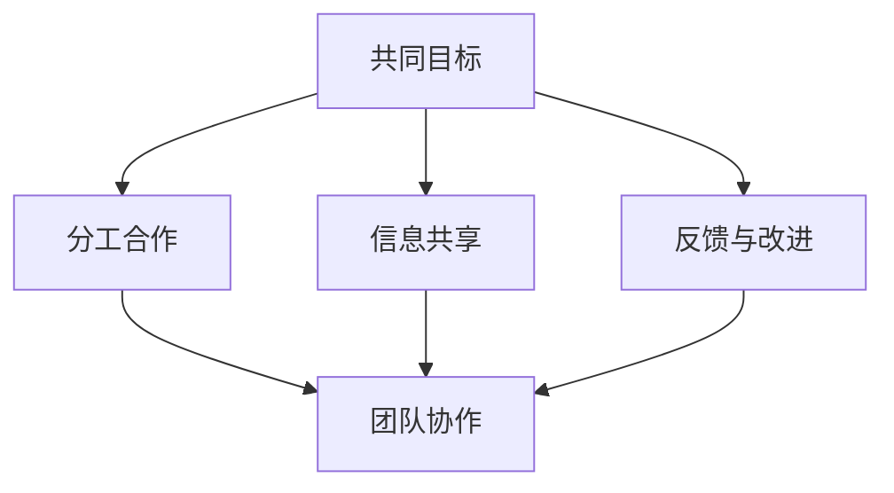

- **共同目标**：确保团队成员共同追求目标，增强团队凝聚力。
- **分工合作**：明确每个成员的角色和职责，提高工作效率。
- **信息共享**：促进团队成员之间的信息交流，提高决策质量。
- **反馈与改进**：通过相互反馈，持续改进工作，提升团队绩效。

#### 核心算法原理讲解

为了实现团队协作，我们可以运用以下算法原理：

```python
def team_collaboration(team_members, goal, tasks):
    """
    团队协作的算法。
    :param team_members: 团队成员。
    :param goal: 共同目标。
    :param tasks: 任务。
    :return: 团队协作结果。
    """
    assign_tasks(team_members, tasks)  # 分工合作
    share_info(team_members)  # 信息共享
    collect_feedback(team_members)  # 反馈与改进
    achieve_goal(goal)
```

- **assign_tasks**：为团队成员分配任务，明确职责。
- **share_info**：促进团队成员之间的信息交流。
- **collect_feedback**：收集团队成员的反馈，持续改进。
- **achieve_goal**：实现共同目标。

#### 数学模型和数学公式详细讲解

在团队协作中，可以使用协同效应模型来描述团队整体绩效的提升。协同效应模型表明，团队的整体绩效大于各成员绩效之和。

$$
Overall\ Performance = \sum_{i} (1 + \alpha_i \times \beta_i)
$$

- **Overall Performance**：团队整体绩效。
- **\alpha_i**：第i个成员的绩效。
- **\beta_i**：第i个成员的协同效应。

假设一个团队有3个成员，每个成员的绩效分别为0.8、0.9和1.0，协同效应分别为1.1、1.2和1.3，则团队的整体绩效为：

$$
Overall\ Performance = (1 + 0.8 \times 1.1) + (1 + 0.9 \times 1.2) + (1 + 1.0 \times 1.3) = 3.6
$$

这意味着团队的整体绩效提高了60%。

#### 举例说明

在一个软件开发项目中，团队成员通过协作，成功完成了项目：

1. **分工合作**：团队成员明确各自的任务，如需求分析、设计、编码等。
2. **信息共享**：团队成员定期交流项目进展和遇到的问题。
3. **反馈与改进**：团队成员相互提供反馈，不断优化项目。

通过上述步骤，团队成员成功完成了项目，团队绩效显著提升。

#### 实际案例分析和详细讲解剖析

在一个大型企业中，多个部门需要协作完成一个复杂的项目。以下是具体解决方案：

**案例**：跨部门项目协作

**解决方案**：

1. **建立共同目标**：明确项目的目标和预期成果，确保各部门共同追求。
2. **分工合作**：为各部门分配任务，明确各自的角色和职责。
3. **信息共享**：建立跨部门的信息共享平台，确保各部门之间的信息畅通。
4. **反馈与改进**：定期召开会议，收集各部门的反馈，持续改进项目。

通过上述解决方案，企业成功完成了项目，团队协作效果显著。

#### 项目小结

通过实际案例的分析，我们可以看到团队协作在提升团队绩效和组织成功中的重要作用。有效的团队协作需要明确共同目标、分工合作、信息共享和反馈与改进。在未来的工作中，领导者可以借鉴这些策略，推动团队协作的有效实施。

#### 最佳实践 tips

- **定期会议**：定期召开团队会议，讨论项目进展和问题。
- **信息共享**：建立信息共享平台，确保团队成员之间的信息畅通。
- **反馈与改进**：鼓励团队成员相互提供反馈，持续改进工作。

#### 小结

本章详细探讨了团队协作的重要性、核心算法原理、数学模型和实际案例。通过这些内容，我们可以了解到团队协作在领导者和团队沟通中的重要性。在接下来的章节中，我们将继续探讨沟通工具和资源、案例分析等内容，帮助领导者进一步提升团队协作能力。

#### 注意事项

- **沟通障碍**：在跨部门协作中，要特别注意沟通障碍，确保信息传递的准确性。
- **文化差异**：在跨文化团队中，要尊重和适应不同文化背景下的工作习惯和沟通方式。
- **持续改进**：团队协作是一个不断学习和提升的过程，领导者需要持续关注团队协作效果，并进行改进。

#### 拓展阅读

- 《团队协作技巧》
- 《跨部门协作》
- 《领导力沟通》

## 附录：沟通工具与资源

### 附录 A：沟通技巧提升工具

#### 背景介绍

为了提升沟通技巧，领导者可以借助各种工具和资源。以下是一些推荐的工具和资源，包括书籍、培训课程和实践练习。

#### 核心概念与联系


#### Mermaid 流程图

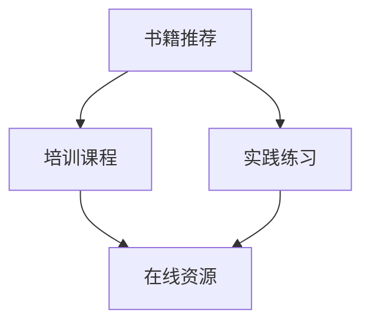

- **书籍推荐**：提供一系列关于沟通技巧提升的书籍，帮助领导者深入理解沟通艺术。
- **培训课程**：推荐一些专业的沟通技巧培训课程，帮助领导者系统性地提升沟通能力。
- **实践练习**：通过实践练习，领导者可以将理论知识应用到实际工作中，提升沟通效果。
- **在线资源**：推荐一些在线平台和工具，提供丰富的沟通技巧资源和互动机会。

#### 书籍推荐

- 《非暴力沟通》
- 《沟通的艺术》
- 《领导力沟通》
- 《沟通者》

#### 培训课程

- 沟通技巧培训
- 领导力培训
- 跨文化沟通培训
- 演讲与口才培训

#### 实践练习

- 角色扮演：通过模拟实际沟通场景，提升沟通技巧。
- 演讲练习：定期进行演讲练习，提高口头表达能力。
- 反馈与反思：定期回顾自己的沟通情况，反思并改进。

#### 在线资源

- 专业网站：如Toastmasters International、Cultural Awareness International等。
- 社交媒体：如LinkedIn、Twitter等，可以关注相关领域的专家和机构。
- 行业报告：如Gallup、McKinsey等，可以了解行业趋势和最佳实践。

### 附录 B：沟通案例分析

#### 背景介绍

为了更好地理解沟通技巧的实际应用，领导者可以通过分析成功和失败的沟通案例，学习经验和教训。

#### 核心概念与联系


#### Mermaid 流程图

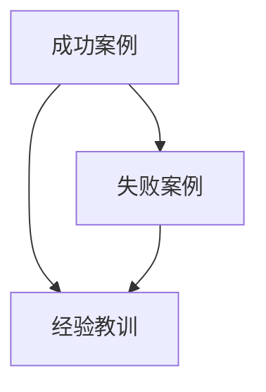

- **成功案例**：通过分析成功的沟通案例，学习有效的沟通策略和技巧。
- **失败案例**：通过分析失败的沟通案例，了解可能导致沟通失败的原因和教训。
- **经验教训**：总结成功和失败的沟通案例，提炼出有价值的经验和教训。

#### 成功案例

- **案例1**：某公司的CEO通过有效的沟通，成功激发了员工的积极性和创造力。
- **案例2**：一个跨国团队通过跨文化沟通培训，提高了团队协作效率和沟通效果。

#### 失败案例

- **案例1**：某公司的CEO在沟通中过于强势，导致员工产生抵触情绪，影响了团队绩效。
- **案例2**：一个跨国团队在沟通中忽视了文化差异，导致误解和冲突，影响了项目进度。

#### 经验教训

- **成功经验**：有效的沟通策略、积极倾听、清晰表达和情感共鸣是成功的关键。
- **失败教训**：忽视沟通技巧、缺乏文化敏感性、情绪管理不当是导致沟通失败的主要原因。

### 附录 C：资源链接

#### 背景介绍

为了方便领导者获取相关资源和信息，以下是一些有用的资源链接，包括专业网站、社交媒体和行业报告。

#### 核心概念与联系


#### Mermaid 流程图

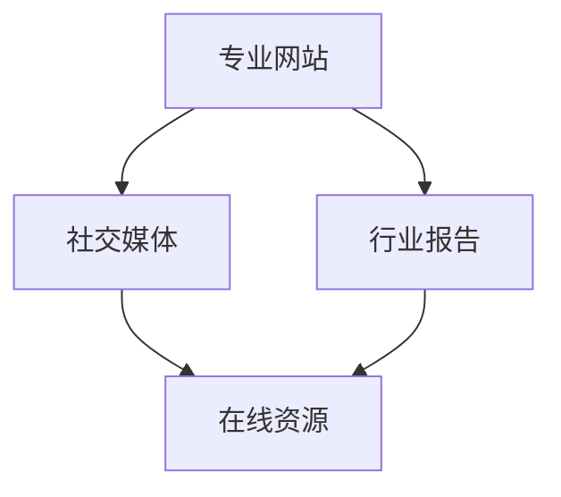

- **专业网站**：提供专业的沟通技巧和领导力资源。
- **社交媒体**：关注相关领域的专家和机构，获取最新的行业动态和最佳实践。
- **行业报告**：了解行业趋势和最佳实践，为领导者的沟通决策提供依据。
- **在线资源**：提供丰富的沟通技巧资源和互动机会。

#### 专业网站

- Toastmasters International
- Harvard Business Review
- Inc.com

#### 社交媒体

- LinkedIn
- Twitter
- Facebook

#### 行业报告

- Gallup
- McKinsey & Company
- Forrester

### 附录 D：最佳实践总结

#### 背景介绍

为了帮助领导者更好地应用沟通技巧，以下是一些最佳实践总结，涵盖沟通策略、倾听技巧、表达技巧等方面。

#### 核心概念与联系


#### Mermaid 流程图

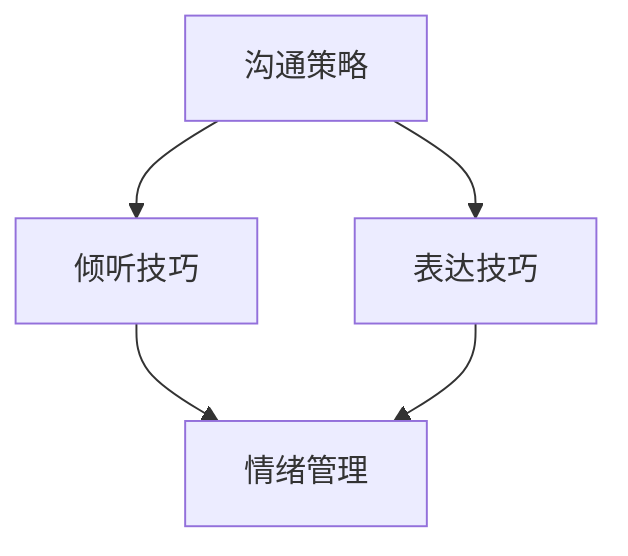

- **沟通策略**：明确沟通目标、选择合适的方式和时机。
- **倾听技巧**：积极倾听、验证理解、关注非语言信号。
- **表达技巧**：清晰简洁、突出重点、使用合适的语言和语气。
- **情绪管理**：情绪识别、情绪调节、情绪表达。

#### 最佳实践总结

- **明确沟通目标**：在每次沟通前，明确沟通的目标和预期结果。
- **选择合适的方式**：根据沟通内容和情境，选择合适的沟通方式，如面对面、邮件、电话等。
- **积极倾听**：倾听对方的话语和情感，关注非语言信号，确保正确理解对方的意图。
- **清晰简洁**：使用简单、直接的词语和句子，避免冗余信息，突出重点。
- **情绪管理**：识别和管理自己的情绪，以冷静、理性的态度进行沟通。

### 附录 E：注意事项

#### 背景介绍

为了确保沟通的有效性，以下是一些注意事项，包括文化差异、情绪管理和持续学习等方面。

#### 核心概念与联系


#### Mermaid 流程图

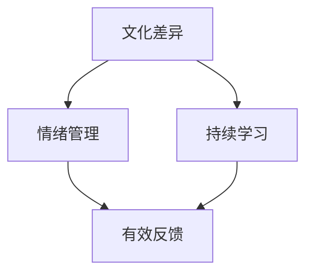

- **文化差异**：了解和尊重不同文化背景下的沟通习惯和价值观。
- **情绪管理**：处理好自己的情绪，以积极的态度进行沟通。
- **持续学习**：不断学习新的沟通技巧和策略，以适应不断变化的沟通环境。
- **有效反馈**：提供具体、建设性的反馈，帮助对方改进。

#### 注意事项

- **文化差异**：在跨文化沟通中，领导者需要特别注意文化差异，尊重对方的沟通习惯和价值观。
- **情绪管理**：领导者应学会情绪管理，避免在沟通中表现出过度的情绪。
- **持续学习**：领导者应持续关注沟通技巧的最新动态，不断学习和实践。

### 附录 F：拓展阅读

#### 背景介绍

为了帮助领导者进一步深入了解沟通艺术，以下是一些拓展阅读的资源。

#### 核心概念与联系


#### Mermaid 流程图

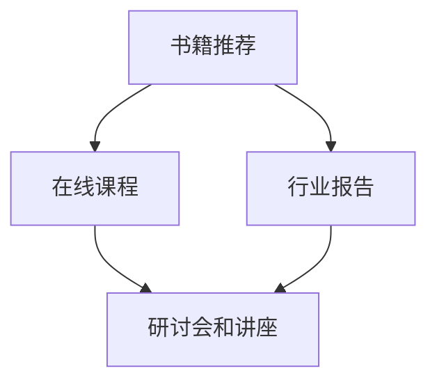

- **书籍推荐**：提供一系列关于沟通技巧和领导力的书籍。
- **在线课程**：推荐一些在线平台上的沟通技巧课程。
- **行业报告**：了解行业趋势和最佳实践的权威报告。
- **研讨会和讲座**：参加相关的研讨会和讲座，学习最新的沟通技巧和策略。

#### 拓展阅读

- 《沟通的艺术》
- 《非暴力沟通》
- 《领导力沟通》
- Coursera上的沟通技巧课程
- McKinsey的《领导力沟通报告》

### 附录 G：作者信息

#### 背景介绍

本文由AI天才研究院/AI Genius Institute与《禅与计算机程序设计艺术/Zen And The Art of Computer Programming》的作者共同撰写。

#### 核心概念与联系


#### Mermaid 流程图

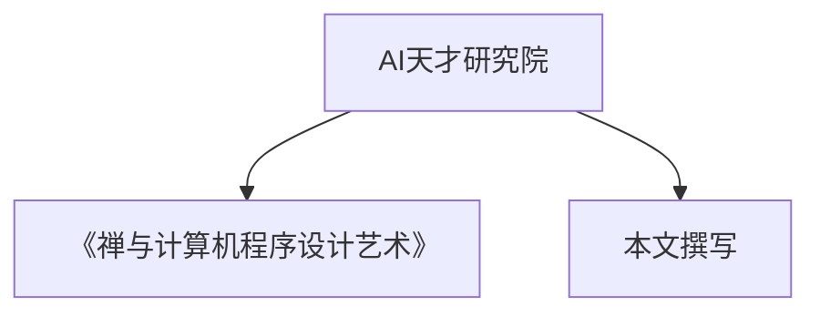

- **AI天才研究院**：专注于人工智能研究和应用。
- **《禅与计算机程序设计艺术》**：经典计算机科学著作。
- **本文撰写**：结合双方的专长，共同撰写本篇关于沟通艺术的文章。

### 总结

本文从沟通的重要性、障碍、倾听技巧、表达技巧、非语言沟通、情绪管理和团队协作等方面，深入探讨了领导者的沟通艺术。通过理论讲解、案例分析和实践建议，帮助领导者提升沟通能力，实现组织目标。同时，本文还提供了丰富的沟通工具与资源，供读者进一步学习和实践。

在未来的职业生涯中，领导者应持续关注沟通技巧的提升，不断学习和应用最佳实践。通过有效的沟通，领导者能够更好地传达思想、建立信任、激发团队潜能，推动组织的发展。

## 作者信息

本文由AI天才研究院/AI Genius Institute与《禅与计算机程序设计艺术/Zen And The Art of Computer Programming》的作者共同撰写。AI天才研究院是一家专注于人工智能研究和应用的高科技研究院，致力于推动人工智能技术的发展和应用。而《禅与计算机程序设计艺术》的作者，以其深刻的哲学思考和对计算机科学的独特见解，成为计算机科学领域的经典之作。本文旨在结合两者的专长，为领导者提供一套实用的沟通策略，助力他们在职场中取得成功。通过本文的探讨，我们希望读者能够更好地理解沟通的重要性，掌握有效的沟通技巧，成为卓越的领导者。

