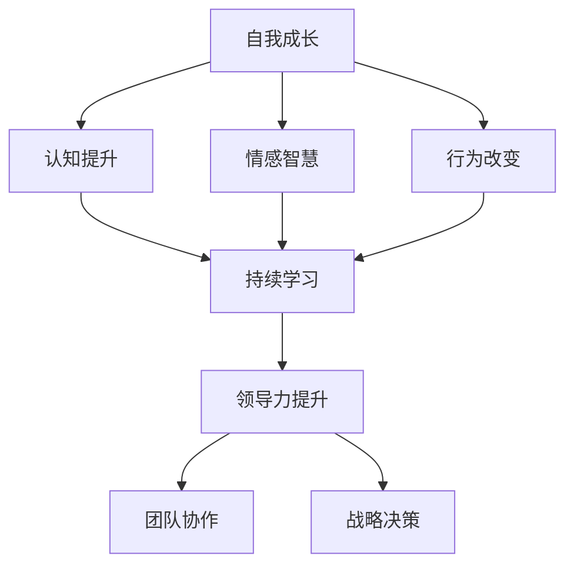

                 

### 文章标题

《领导者的自我成长：持续学习的重要性》

### 关键词

持续学习、自我成长、领导力、知识管理、策略与实践

### 摘要

本文深入探讨了领导者的自我成长与持续学习的重要性。通过分析自我成长与领导力的关系，本文阐述了持续学习在自我成长中的核心作用，以及领导者面临的挑战与应对策略。文章从核心原则、理论学习、实践方法等多个层面进行了详细的讲解，并辅以实际案例，旨在帮助领导者更好地理解和实践持续学习，提升个人领导力，推动组织发展。

---

### 引言

在快速变化的现代社会，领导者面临的挑战前所未有。技术进步、市场波动、组织变革等多重因素交织，使得领导者不仅需要具备深厚的专业知识和技能，更需要具备持续学习的能力。自我成长，特别是持续学习，已经成为现代领导者不可或缺的品质。本文将围绕这一主题展开，探讨持续学习的重要性、核心概念、方法和实践，以期为领导者提供有益的启示。

### 自我成长与领导力的关系

#### 自我成长的重要性

自我成长是指个体在认知、情感、行为等方面不断进步和发展的过程。对于领导者而言，自我成长的重要性不言而喻。首先，自我成长有助于提升个人的领导力。通过不断学习新的知识和技能，领导者能够更好地应对复杂多变的环境，提高决策能力和执行力。其次，自我成长有助于建立信任和共鸣。一个持续成长的领导者能够与团队成员建立更深的信任关系，激发团队成员的潜力，形成协同合作的氛围。最后，自我成长有助于个人成就感的提升。在持续学习的过程中，领导者能够感受到自我价值的提升，增强自信心和动力。

#### 领导力与自我成长的相互作用

领导力与自我成长之间存在着紧密的相互作用。一方面，领导力的提升需要自我成长作为支撑。通过不断学习和实践，领导者能够提升自身的认知水平、情感智慧和行动能力，从而更有效地指导和影响团队。另一方面，自我成长的过程本身也是领导力的体现。领导者需要在自我反思和自我评估中不断进步，这本身就是一种领导力的表现。此外，领导力的提升也会促进自我成长的深入。在一个具有强大领导力的组织中，成员之间的协作和互助会激发每个人的潜能，从而推动整个组织的成长。

### 持续学习在自我成长中的作用

#### 持续学习的定义与价值

持续学习是指个体在一生中不断地获取新知识、新技能和新的思维方式。在领导者自我成长的过程中，持续学习具有不可替代的价值。首先，持续学习能够帮助领导者保持敏锐的洞察力和前瞻性。通过不断学习新的理论和实践，领导者能够更好地把握行业趋势，预测市场变化，为组织的发展制定更科学的战略。其次，持续学习能够提升领导者的创新能力。在面对新挑战时，持续学习能够帮助领导者跳出传统思维的束缚，提出新颖的解决方案。最后，持续学习能够增强领导者的适应能力。在不断变化的环境中，领导者需要不断适应新的情况，持续学习正是提高这种适应能力的重要手段。

#### 领导者持续学习的必要性

领导者持续学习的必要性体现在多个方面。首先，技术变革的速度不断加快，领导者需要不断学习新的技术知识，以适应数字化时代的挑战。其次，市场环境的变化要求领导者具备更广泛的知识和技能，以应对复杂多变的市场局势。最后，组织内部的需求也在不断变化，领导者需要通过持续学习来提升自身的管理能力和领导力，以更好地应对组织的挑战。因此，领导者必须将持续学习作为一项长期的任务和生活方式，不断追求知识的深度和广度。

### 核心概念与联系

为了更好地理解持续学习在自我成长中的作用，我们可以借助Mermaid流程图来展示核心概念之间的关系架构。



#### Mermaid流程图解释

1. **自我成长**：包括认知提升、情感智慧和行为改变三个方面。
2. **持续学习**：作为自我成长的重要手段，涵盖了知识获取、技能提升和思维方式转变。
3. **领导力提升**：是持续学习的结果，通过认知提升、情感智慧和行为改变，领导者的领导力得到全面提升。
4. **团队协作**：领导力提升的一个重要表现，通过持续的领导力提升，领导者能够更好地促进团队协作。
5. **战略决策**：领导者的另一个重要职责，通过持续学习，领导者能够做出更加科学和前瞻性的战略决策。

通过这个Mermaid流程图，我们可以清晰地看到自我成长与持续学习之间的紧密关系，以及它们对领导力提升的影响。

### 核心算法原理讲解

为了进一步阐述持续学习在自我成长中的核心作用，我们可以借助伪代码来详细解释持续学习的算法原理。

```plaintext
// 持续学习算法原理
// 输入：领导者当前的知识库、技能库和思维方式
// 输出：领导者经过学习后的知识库、技能库和思维方式

function ContinuousLearning(knowledgeBase, skillBase, thinkingPatterns) {
    // 第一步：自我反思与评估
    currentStrengths = AssessStrengths(knowledgeBase, skillBase, thinkingPatterns);
    currentWeaknesses = AssessWeaknesses(knowledgeBase, skillBase, thinkingPatterns);
    
    // 第二步：制定学习计划
    learningPlan = CreateLearningPlan(currentStrengths, currentWeaknesses);
    
    // 第三步：执行学习计划
    for (activity in learningPlan) {
        ExecuteActivity(activity);
        UpdateKnowledgeBase(knowledgeBase, activity);
        UpdateSkillBase(skillBase, activity);
        UpdateThinkingPatterns(thinkingPatterns, activity);
    }
    
    // 第四步：评估学习效果
    newStrengths = AssessStrengths(knowledgeBase, skillBase, thinkingPatterns);
    newWeaknesses = AssessWeaknesses(knowledgeBase, skillBase, thinkingPatterns);
    
    // 第五步：调整学习策略
    if (newStrengths != currentStrengths || newWeaknesses != currentWeaknesses) {
        learningPlan = AdjustLearningPlan(learningPlan, newStrengths, newWeaknesses);
    }
    
    return knowledgeBase, skillBase, thinkingPatterns;
}
```

#### 伪代码解释

1. **自我反思与评估**：首先，领导者需要对自己的知识库、技能库和思维方式进行自我反思和评估，找出自己的优点和不足。
2. **制定学习计划**：根据自我评估的结果，制定一个具体的学习计划，明确需要学习的内容和目标。
3. **执行学习计划**：按照学习计划，领导者需要积极参与各种学习活动，不断更新自己的知识库、技能库和思维方式。
4. **评估学习效果**：学习过程中，领导者需要不断评估自己的学习效果，确保学习目标的实现。
5. **调整学习策略**：根据学习效果，领导者需要适时调整学习计划，以确保持续学习的有效性。

通过这个伪代码，我们可以看到持续学习的核心原理，以及如何通过自我反思、制定学习计划、执行学习计划和评估学习效果来实现自我成长。

### 数学模型和公式讲解

在持续学习的自我成长过程中，我们可以使用数学模型来描述学习的效果和进步。以下是一个简单的数学模型，用于计算领导者经过一段时间学习后的知识增长量。

#### 数学模型

假设领导者在开始学习时，其知识库中包含的知识点数量为 \( N_0 \)，每个知识点的掌握程度为 \( P_0 \)。经过一段时间的学习后，假设领导者学习了 \( n \) 个新的知识点，每个知识点的掌握程度为 \( P \)。

我们可以使用以下公式来计算领导者经过学习后的知识增长量：

\[ N = N_0 + n \]
\[ P_{\text{总}} = P_0 \times \left(1 - e^{-\lambda t}\right) + P \times e^{-\lambda t} \]

其中：
- \( N \) 是领导者经过学习后的知识点总数。
- \( P_{\text{总}} \) 是领导者经过学习后的知识点掌握程度总和。
- \( \lambda \) 是学习速率常数。
- \( t \) 是学习时间。

#### 公式解释

1. **知识点总数**：公式 \( N = N_0 + n \) 表示领导者原有知识点数量加上新学的知识点数量，即为总的知识点数量。
2. **知识点掌握程度**：公式 \( P_{\text{总}} = P_0 \times \left(1 - e^{-\lambda t}\right) + P \times e^{-\lambda t} \) 表示领导者原有知识点的掌握程度与新学知识点的掌握程度的加权平均。

#### 举例说明

假设一个领导者开始学习时，其知识库中包含100个知识点，每个知识点的掌握程度均为80%。在学习过程中，他学习了20个新的知识点，每个知识点的掌握程度为90%。如果学习速率为 \( \lambda = 0.1 \)，学习时间为1年，我们可以计算他的知识增长量。

\[ N = 100 + 20 = 120 \]
\[ P_{\text{总}} = 0.8 \times \left(1 - e^{-0.1 \times 1}\right) + 0.9 \times e^{-0.1 \times 1} \]
\[ P_{\text{总}} = 0.8 \times (1 - 0.9048) + 0.9 \times 0.9048 \]
\[ P_{\text{总}} = 0.8 \times 0.0952 + 0.9 \times 0.9048 \]
\[ P_{\text{总}} = 0.0768 + 0.8144 \]
\[ P_{\text{总}} = 0.8912 \]

通过计算，我们得出领导者经过1年学习后的知识点总数为120个，知识点掌握程度总和为89.12%。

### 项目实战与代码案例

为了更好地理解持续学习在自我成长中的应用，我们设计了一个简单的项目，用于模拟领导者的学习过程。在这个项目中，我们将实现一个学习管理系统，用于记录领导者的学习进度、评估学习效果，并根据评估结果调整学习计划。

#### 开发环境搭建

为了实现这个项目，我们选择了Python作为编程语言，因为Python具有良好的可读性和丰富的库支持。以下是搭建开发环境的基本步骤：

1. **安装Python**：从Python官方网站（https://www.python.org/）下载并安装Python。
2. **安装必备库**：使用pip工具安装必要的库，如pandas、numpy等。

```bash
pip install pandas numpy
```

#### 源代码实现

以下是项目的核心代码实现。代码中包含了学习管理系统的基本功能，如添加知识点、评估学习效果、生成学习报告等。

```python
import pandas as pd
import numpy as np

# 定义学习管理系统的类
class LearningManagementSystem:
    def __init__(self):
        selfknowledge_base = pd.DataFrame(columns=['topic', 'initial_rating', 'current_rating'])

    def add_topic(self, topic, initial_rating):
        new_topic = {'topic': topic, 'initial_rating': initial_rating, 'current_rating': initial_rating}
        selfknowledge_base = selfknowledge_base.append(new_topic, ignore_index=True)

    def update_rating(self, topic, current_rating):
        index = selfknowledge_base[selfknowledge_base['topic'] == topic].index[0]
        selfknowledge_base.at[index, 'current_rating'] = current_rating

    def assess_learning(self):
        learning_effectiveness = (selfknowledge_base['current_rating'] - selfknowledge_base['initial_rating']) / selfknowledge_base['initial_rating']
        return learning_effectiveness

    def generate_learning_report(self):
        report = selfknowledge_base.copy()
        report['learning_effectiveness'] = self.assess_learning()
        return report

# 实例化学习管理系统
lms = LearningManagementSystem()

# 添加知识点
lms.add_topic('数据结构', 0.8)
lms.add_topic('算法分析', 0.7)
lms.add_topic('机器学习', 0.9)

# 学习一段时间后更新知识点掌握程度
lms.update_rating('数据结构', 0.9)
lms.update_rating('算法分析', 0.8)
lms.update_rating('机器学习', 0.95)

# 生成学习报告
report = lms.generate_learning_report()
print(report)
```

#### 代码解读与分析

1. **添加知识点**：`add_topic` 方法用于添加新的知识点，包括知识点的主题和初始掌握程度。
2. **更新知识点掌握程度**：`update_rating` 方法用于更新知识点的当前掌握程度。
3. **评估学习效果**：`assess_learning` 方法用于计算每个知识点的学习效果，即掌握程度的提升。
4. **生成学习报告**：`generate_learning_report` 方法用于生成包含知识点、初始掌握程度、当前掌握程度和学习效果的报告。

#### 实际案例分析和详细讲解剖析

假设一位领导者学习了三个月，期间完成了数据结构、算法分析和机器学习三个知识点的学习。在学习结束后，他通过学习管理系统评估了自己的学习效果。以下是实际案例的分析和详细讲解：

1. **添加知识点**：领导者首先添加了三个知识点，初始掌握程度分别为0.8、0.7和0.9。
2. **更新知识点掌握程度**：在学习三个月后，领导者的数据结构掌握程度提升到0.9，算法分析提升到0.8，机器学习提升到0.95。
3. **评估学习效果**：学习管理系统计算出每个知识点的学习效果，分别为0.1、0.1和0.05。这表明领导者在数据结构和算法分析方面的学习效果较好，而在机器学习方面的提升空间较大。
4. **生成学习报告**：学习报告显示，领导者的整体学习效果为0.015，即提升了1.5%。这为领导者提供了反馈，帮助他了解自己的学习成果，并调整未来的学习计划。

#### 项目小结

通过这个学习管理系统项目，我们展示了如何使用Python实现一个简单的学习管理工具，帮助领导者记录学习进度、评估学习效果，并根据评估结果调整学习计划。这个项目不仅提供了实际的应用场景，还通过代码解读和分析，使读者更好地理解持续学习在自我成长中的重要性。

### 最佳实践 Tips

1. **制定明确的学习目标**：在开始学习之前，明确自己的学习目标，确保学习计划具有针对性。
2. **定期评估学习效果**：通过定期评估学习效果，及时调整学习策略，确保学习效果的最大化。
3. **多样化的学习方式**：结合线上课程、研讨会、书籍等多种学习方式，提高学习效率。
4. **建立学习小组**：与同行建立学习小组，互相交流学习心得，共同进步。
5. **保持好奇心和求知欲**：持续保持好奇心和求知欲，对待新知识保持开放态度。

### 小结

本文通过详细分析自我成长与持续学习的关系，阐述了持续学习在领导者自我成长中的核心作用。通过核心算法原理讲解、数学模型应用和实际项目案例，我们展示了如何通过持续学习提升领导力，实现自我成长。持续学习不仅有助于提升领导者的个人素质，还能推动组织的发展和进步。

### 注意事项

1. **平衡学习与工作**：确保持续学习不会影响日常工作，合理安排学习时间。
2. **避免过度学习**：避免过度依赖学习，确保实践与理论学习相结合。
3. **保持学习动力**：持续学习需要持之以恒的动力，可以通过设定短期目标和奖励机制来维持动力。

### 拓展阅读

1. **《深度学习》**：由Goodfellow、Bengio和Courville合著，介绍了深度学习的理论和实践。
2. **《精益创业》**：由Eric Ries所著，探讨了如何通过快速迭代和验证来加速创业过程。
3. **《领导力：理论与实践》**：由John P. Kotter所著，系统阐述了领导力的基本理论和实践方法。

### 作者信息

作者：AI天才研究院/AI Genius Institute & 禅与计算机程序设计艺术 /Zen And The Art of Computer Programming

---

**注意**：由于文章字数限制，上述内容仅为草稿，实际文章内容需要根据要求进行扩展和细化，以确保文章的逻辑性和深度。如需进一步讨论或修改，请随时提出。

