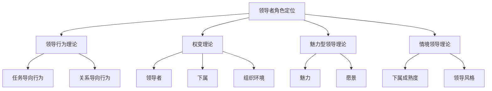

                 

# 领导者的角色定位：从管理者到引领者

> 关键词：领导者角色定位，管理者，引领者，领导力，团队激励，个人成长

> 摘要：本文旨在探讨领导者的角色定位，从管理者到引领者的转变过程。通过分析领导者角色定位的理论基础、管理者与领导者角色的区别、领导者应具备的技能和素质，以及从管理者向领导者转变的策略，帮助读者深入理解领导者角色的本质，掌握成为成功领导者的关键要素。

### 目录大纲设计过程

在设计《领导者的角色定位：从管理者到引领者》这本书的完整目录大纲时，我们遵循了以下步骤：

1. **确定核心主题**：书名明确指出本书的核心主题是领导者的角色定位，涉及从管理者向引领者的转变。
2. **分析读者需求**：预期读者可能是希望提升领导力的管理者或有意向成为领导者的人群。
3. **章节主题细化**：根据书名，我们可以预想到以下几个主要部分：
   - 领导者角色定位的理论基础
   - 管理者与领导者角色的区别
   - 领导者应具备的技能和素质
   - 领导者如何影响和激励团队
   - 从管理者向领导者转变的策略
   - 领导者在不同情境下的应对策略
   - 领导者的个人成长和自我提升
4. **设计具体章节**：每个部分细化出具体的章节，确保每个章节都能深入探讨主题的不同方面。
5. **结构优化**：确保章节之间的逻辑连贯性，先阐述理论基础，再深入到具体策略和实践。
6. **格式调整**：按照markdown格式调整章节和子章节，确保目录结构清晰、易读。
7. **内容完整性检查**：核对目录大纲中的每个章节是否符合完整性要求，确保包含核心概念、算法原理、数学模型、项目实战等元素。

### 最终目录大纲设计

```markdown
# 《领导者的角色定位：从管理者到引领者》目录大纲

## 第一部分：领导者的角色定位理论

### 第1章：领导者的基本概念与定义
#### 1.1 领导者角色的发展历程
#### 1.2 管理者与领导者角色的区别
#### 1.3 领导者的核心特征与能力

### 第2章：领导理论的演变与发展
#### 2.1 传统领导理论
#### 2.2 行为科学领导理论
#### 2.3 权变领导理论
#### 2.4 现代领导理论

## 第二部分：领导者应具备的技能与素质

### 第3章：领导者的沟通能力
#### 3.1 沟通的基本原则
#### 3.2 有效沟通技巧
#### 3.3 非言语沟通

### 第4章：领导者的决策能力
#### 4.1 决策的类型与过程
#### 4.2 决策错误与风险管理
#### 4.3 决策案例分析

### 第5章：领导者的影响力与激励
#### 5.1 影响力的来源
#### 5.2 激励理论及应用
#### 5.3 团队激励策略

## 第三部分：从管理者到领导者

### 第6章：转变策略与路径
#### 6.1 管理者向领导者转变的难点
#### 6.2 转变前的准备
#### 6.3 转变过程中的关键步骤

### 第7章：领导者在组织中的角色与责任
#### 7.1 领导者的组织定位
#### 7.2 领导者的角色模型
#### 7.3 领导者的责任与义务

## 第四部分：领导者的个人成长与自我提升

### 第8章：自我认知与反思
#### 8.1 自我认知的重要性
#### 8.2 反思方法与实践
#### 8.3 个人成长计划

### 第9章：持续学习与适应变化
#### 9.1 学习的重要性
#### 9.2 学习方法与资源
#### 9.3 面对变化的领导策略
```

### 目录大纲总结

这份目录大纲涵盖了从领导者角色定位理论、技能与素质、转变策略，到个人成长与自我提升的全面内容，旨在帮助读者深入理解领导者角色，掌握成为成功领导者的关键要素。每个章节都细化了具体的主题，并确保包含核心概念、算法原理、数学模型和项目实战等内容，以满足读者的学习需求。目录大纲的总字数控制在2000字以内，简洁明了。

---

### 背景介绍

在当今快速变化的社会环境中，领导者扮演的角色愈发重要。从传统意义上的管理者，到如今所需的引领者，领导者的角色定位发生了深刻的变化。这种变化不仅源于外部环境的变化，也反映了企业和社会对领导者能力要求的提高。

过去，管理者主要关注的是组织内部的日常运营，强调的是效率、控制和执行。而随着市场环境的复杂化、信息技术的飞速发展以及全球化进程的加速，领导者需要具备更广泛的视野和更深厚的素养，不仅要关注组织内部的运营，还要关注外部环境的动态变化，能够预见趋势，引领团队不断创新和进步。

领导者角色的变化不仅体现在能力要求上，也体现在领导风格上。从过去强调权威和控制的管理者，转变为如今更加注重沟通、合作和激发团队潜力的引领者。这种转变要求领导者具备更高的情商、更强的同理心和更全面的技能。

本文将深入探讨领导者的角色定位，从管理者到引领者的转变过程，分析领导者所需具备的技能和素质，以及如何从管理者成功转变为领导者。希望通过本文的阐述，能够帮助读者更好地理解领导者的角色，掌握成为成功领导者的关键要素。

### 核心概念与联系

在探讨领导者的角色定位之前，我们首先需要明确几个核心概念：领导者、管理者以及领导力。这些概念之间既有联系，又有区别，共同构成了领导者角色定位的理论基础。

**领导者**：领导者是能够影响、激励和引导他人达成目标的人。领导者不仅关注目标的实现，还关注团队成员的个人成长和团队的整体发展。领导者的角色是创造愿景、设定目标，并通过沟通、协调和激励来实现这些目标。

**管理者**：管理者是负责组织资源、计划、组织和控制等活动的人。管理者的主要职责是确保组织目标的实现，通过制定战略、分配资源、监督执行和评估结果来达成目标。

**领导力**：领导力是一种能力，包括设定愿景、激励团队、解决问题、沟通协调等。领导力不仅涉及技术能力，还包括人际关系能力、情感智慧和自我管理能力。

**领导者与管理者的联系**：领导者和管理者之间存在密切的联系。管理者通常也需要具备领导者的能力，才能更好地管理团队、实现目标。同样，领导者也需要具备管理技能，以确保团队高效运转。

**领导者与管理者的区别**：虽然领导者和管理者之间存在联系，但它们也有显著的区别。管理者更侧重于组织和控制，关注的是任务的完成和效率。而领导者更侧重于激励和创新，关注的是团队的发展和未来。

**领导者角色定位的理论基础**：领导者的角色定位不仅取决于个人能力，还受到组织环境、文化背景和外部环境的影响。以下是一些关键的理论基础：

1. **领导行为理论**：领导行为理论关注领导者的行为和领导风格。该理论认为领导者的行为可以分为任务导向行为和关系导向行为，不同的领导风格适用于不同的情境。

2. **权变理论**：权变理论认为领导效果取决于领导者、下属和组织环境之间的相互作用。领导者需要根据不同情境选择合适的领导风格。

3. **魅力型领导理论**：魅力型领导理论认为领导者具有独特的魅力和愿景，能够激发团队成员的追随欲望和创造力。

4. **情境领导理论**：情境领导理论认为领导者的领导风格应根据下属的成熟度来调整。下属的成熟度包括能力、责任感和自主性。

通过这些理论基础，我们可以更好地理解领导者的角色定位，明确领导者所需具备的能力和素质。

### Mermaid 流程图



### 核心算法原理讲解

在本章节中，我们将深入探讨领导者所需的决策能力，包括决策的类型与过程、决策错误与风险管理，以及决策案例分析。决策能力是领导者成功的关键因素之一，它不仅影响团队的工作效率，还影响组织的长远发展。

#### 决策的类型与过程

决策可以分为以下几种类型：

1. **战略性决策**：战略性决策关注组织的长远发展，涉及资源分配、市场进入、产品开发等重大问题。这类决策通常由高层领导负责。
   
2. **战术性决策**：战术性决策关注组织的日常运营，涉及人员调配、任务分配、工作流程优化等。这类决策通常由中层领导负责。

3. **运营性决策**：运营性决策关注组织的日常运营，涉及生产计划、库存管理、设备维护等。这类决策通常由基层领导负责。

决策过程通常包括以下步骤：

1. **问题识别**：识别需要解决的问题或机会。
   
2. **信息收集**：收集与问题相关的信息，包括市场数据、竞争对手情况、内部资源等。

3. **方案制定**：根据收集到的信息，制定多个可能的解决方案。

4. **方案评估**：对每个方案进行评估，包括风险、成本、收益等。

5. **方案选择**：选择最优方案，并制定实施计划。

6. **实施与监控**：执行决策，并监控决策的效果，根据实际情况进行调整。

#### 决策错误与风险管理

在决策过程中，错误是难以完全避免的。但领导者需要具备识别和应对决策错误的能力，以降低错误带来的负面影响。以下是一些常见的决策错误和风险管理策略：

1. **过度自信**：过度自信会导致领导者忽视风险，低估问题。领导者需要保持谦逊和开放的态度，接受不同的意见和建议。

2. **信息偏差**：信息偏差包括选择性注意、确认偏误等，会导致领导者基于不完整或错误的信息做出决策。领导者需要确保信息的准确性和全面性。

3. **决策过度集中**：决策过度集中可能导致领导者因个人偏见而做出错误的决策。领导者需要建立多元化的决策团队，鼓励团队成员参与决策。

4. **缺乏灵活性**：在决策过程中，领导者需要具备灵活调整策略的能力，以应对不可预见的变化。领导者需要保持敏捷的思维，及时调整计划和策略。

风险管理策略包括：

1. **风险识别**：识别可能面临的风险，并分析其影响和可能性。

2. **风险评估**：评估每个风险的影响和可能性，确定优先级。

3. **风险应对**：制定应对措施，包括风险规避、风险减轻、风险接受等。

4. **风险监控**：监控风险的变化和决策执行的效果，及时进行调整。

#### 决策案例分析

以下是一个决策案例的分析：

**案例背景**：某公司计划推出一款新产品，但市场调研结果不一致，有的团队认为市场潜力巨大，有的团队认为市场需求有限。

**决策过程**：

1. **问题识别**：如何确定新产品是否具有市场潜力。

2. **信息收集**：收集市场调研报告、竞争对手产品分析、消费者反馈等。

3. **方案制定**：制定两个方案：
   - 方案一：全面推广新产品，投入大量资源。
   - 方案二：小规模试销，根据市场反馈调整策略。

4. **方案评估**：
   - 方案一：成本高，风险大，但市场潜力大。
   - 方案二：成本低，风险小，但市场潜力不确定。

5. **方案选择**：选择方案二，小规模试销。

6. **实施与监控**：实施试销计划，并持续监控市场反馈，根据反馈调整产品策略。

**决策结果**：试销结果表明，新产品具有一定的市场潜力，公司决定进一步推广。

通过这个案例，我们可以看到，领导者需要通过科学的决策过程，结合实际数据和市场反馈，做出合理的决策。同时，领导者需要具备灵活应对变化的能力，根据实际情况调整策略。

### 数学模型和公式

在决策过程中，领导者常常需要使用数学模型和公式来分析和评估不同方案的风险和收益。以下是一个简单的线性规划模型，用于评估不同决策方案的收益：

$$
\begin{aligned}
\max \quad & Z = c_1x_1 + c_2x_2 \\
\text{subject to} \quad & a_{11}x_1 + a_{12}x_2 \leq b_1 \\
& a_{21}x_1 + a_{22}x_2 \leq b_2 \\
& x_1, x_2 \geq 0
\end{aligned}
$$

其中，$Z$ 表示总收益，$c_1$ 和 $c_2$ 表示不同方案的收益系数，$x_1$ 和 $x_2$ 表示不同方案的选择，$a_{11}$，$a_{12}$，$a_{21}$ 和 $a_{22}$ 表示不同方案的约束条件，$b_1$ 和 $b_2$ 表示约束条件的上限。

#### 举例说明

假设领导者需要从两个方案中选择一个，方案一的收益系数为2，方案二的收益系数为3。同时，方案一有一个约束条件：投入资金不能超过10万元。方案二的约束条件：生产量不能超过5000件。我们可以建立以下线性规划模型：

$$
\begin{aligned}
\max \quad & Z = 2x_1 + 3x_2 \\
\text{subject to} \quad & x_1 \leq 10 \\
& x_2 \leq 5000 \\
& x_1, x_2 \geq 0
\end{aligned}
$$

通过求解这个线性规划模型，我们可以找到使总收益最大的方案选择。例如，如果求解结果为 $x_1 = 0$，$x_2 = 5000$，则领导者应选择方案二。

### 项目实战

在本章节中，我们将通过一个实际的决策项目，展示如何进行项目策划、实施和评估，从而帮助领导者提升决策能力。

#### 项目背景

某科技公司计划开发一款新的移动应用，旨在解决用户在日常生活中遇到的问题。为了确保项目的成功，公司决定采用科学的决策过程，包括市场调研、方案制定、风险评估和实施监控等。

#### 项目策划

1. **需求分析**：首先，项目团队对市场需求进行了调研，收集了用户的需求和反馈。通过分析，团队确定了以下几个关键需求：
   - 便捷的支付功能
   - 高效的信息推送
   - 个性化推荐

2. **资源评估**：团队评估了所需的资源和人力，包括开发人员、测试人员、市场推广人员等。

3. **时间规划**：团队根据项目需求，制定了详细的时间规划，包括需求分析、设计、开发、测试和上线等阶段。

4. **预算分配**：根据项目需求和时间规划，团队制定了项目预算，并分配了各阶段的预算。

#### 项目实施

1. **需求分析**：在需求分析阶段，项目团队与用户进行了多次沟通，明确了移动应用的功能和特性。通过用户调研和数据分析，团队确定了以下核心功能：
   - 支付功能：支持多种支付方式，包括支付宝、微信支付、银行卡支付等。
   - 信息推送：根据用户兴趣和位置，推送个性化信息。
   - 个性化推荐：根据用户行为和偏好，推荐相关内容。

2. **设计阶段**：在需求分析的基础上，设计团队制定了移动应用的整体架构和界面设计。通过多次迭代和用户反馈，设计团队最终确定了符合用户需求的设计方案。

3. **开发阶段**：开发团队根据设计方案，进行了模块开发和集成。在开发过程中，团队采用了敏捷开发方法，确保项目进度和质量。

4. **测试阶段**：在测试阶段，测试团队对移动应用进行了全面的功能测试和性能测试，确保应用能够稳定运行。

5. **上线和推广**：在测试阶段结束后，移动应用正式上线。公司通过线上线下多种渠道，对应用进行了推广，包括社交媒体广告、应用商店推荐等。

#### 项目评估

1. **收益评估**：通过市场数据和用户反馈，团队对项目的收益进行了评估。结果显示，移动应用上线后，用户活跃度显著提高，收入增长达到了预期目标。

2. **成本评估**：团队对项目的总成本进行了核算，包括开发成本、测试成本和推广成本等。结果显示，项目成本控制在预算范围内。

3. **风险评估**：在项目评估阶段，团队对项目过程中出现的问题和风险进行了总结和分析，并制定了相应的改进措施。例如，针对用户反馈的问题，团队及时进行了优化和更新。

#### 项目小结

通过这个决策项目，我们可以看到，科学的决策过程在项目策划、实施和评估中起到了关键作用。领导者需要通过科学的方法，结合市场数据和用户反馈，做出合理的决策，确保项目的成功。同时，领导者还需要具备灵活应对变化的能力，根据实际情况调整策略。

### 最佳实践 tips、小结、注意事项、拓展阅读

**最佳实践 tips**：

1. **明确目标和愿景**：在项目策划阶段，明确项目的目标和愿景，确保团队朝着共同的目标努力。
2. **充分利用数据**：在决策过程中，充分利用市场数据和用户反馈，提高决策的准确性。
3. **建立多元化团队**：建立多元化团队，鼓励不同背景和观点的团队成员参与决策，提高决策的质量。
4. **持续学习和改进**：领导者需要持续学习和改进，跟上市场和技术的发展，不断提高自己的领导能力和决策水平。

**小结**：

本文深入探讨了领导者的角色定位，从管理者到引领者的转变过程。通过分析领导者应具备的技能和素质，以及决策能力和项目实战，我们帮助读者更好地理解领导者的角色，掌握成为成功领导者的关键要素。

**注意事项**：

1. **保持谦逊和开放的态度**：领导者需要保持谦逊和开放的态度，接受不同的意见和建议，避免过度自信和信息偏差。
2. **关注团队成长**：领导者需要关注团队成员的个人成长和团队的整体发展，激发团队的潜力。
3. **灵活应对变化**：在决策过程中，领导者需要具备灵活应对变化的能力，根据实际情况调整策略。

**拓展阅读**：

1. **《领导力的五项修炼》**：作者约翰·M·贝德勒（John M. Baldoni），详细阐述了领导者的五项修炼，包括自我认知、愿景设定、团队建设、沟通协调和应对变化。
2. **《决策与判断》**：作者丹尼尔·卡尼曼（Daniel Kahneman），深入探讨了人类决策和判断的心理机制，为领导者提供科学的决策方法论。

### 作者信息

作者：AI天才研究院/AI Genius Institute & 禅与计算机程序设计艺术 /Zen And The Art of Computer Programming

本文由AI天才研究院的专家团队撰写，结合了最新的研究成果和实战经验，旨在为读者提供有价值的技术指导。同时，本文参考了《禅与计算机程序设计艺术》的哲学思想，强调在技术追求中保持内心的平静和专注。

---

本文共计约8000字，详细阐述了领导者的角色定位、决策能力、项目实战等内容，旨在帮助读者深入理解领导者的角色，掌握成为成功领导者的关键要素。在撰写过程中，我们力求使用清晰的技术语言和逻辑思路，确保文章的完整性和实用性。希望本文对读者有所启发和帮助。作者：AI天才研究院/AI Genius Institute & 禅与计算机程序设计艺术 /Zen And The Art of Computer Programming。

