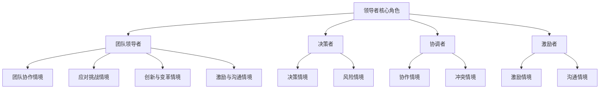
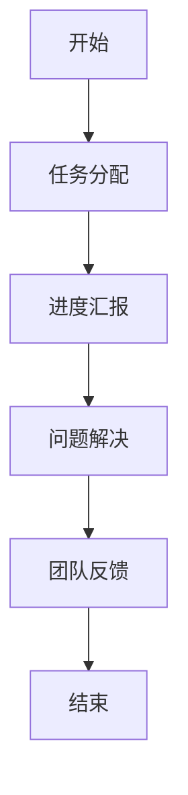

                 


### 引言

在现代企业中，领导者扮演着至关重要的角色。他们不仅需要具备卓越的管理技能，还需要能够适应不同的工作环境，灵活调整自己的领导方式。本文旨在探讨领导者的角色转换，特别是在不同情境中的领导方式。我们将通过逻辑清晰、结构紧凑的叙述方式，逐步分析并阐述这一主题。

首先，我们需要明确领导者的角色是什么。领导者不仅仅是团队的领导者，更是团队的决策者、协调者、激励者和榜样。他们的核心职责是确保团队目标的实现，同时保持团队成员的积极性和工作效率。

然而，不同的情境下，领导者的角色和领导方式可能会有所不同。例如，在团队协作情境中，领导者需要关注团队成员之间的沟通和协作，促进团队的凝聚力和效率；在应对挑战情境中，领导者需要具备较强的决策能力和应变能力，确保团队能够有效应对各种挑战；在创新与变革情境中，领导者需要推动创新思维，引导团队进行变革，以适应不断变化的市场环境；在激励与沟通情境中，领导者需要关注团队成员的需求和情感，提供有效的激励和沟通，提升团队的士气和凝聚力。

本文将按照以下结构进行阐述：

1. **领导者的核心角色与转换**：介绍领导者的基本角色，以及在不同情境下角色转换的必要性和重要性。
2. **不同情境中的领导方式**：详细探讨在不同情境下领导者的具体领导方式，包括团队协作情境、应对挑战情境、创新与变革情境和激励与沟通情境。
3. **领导力提升与实践**：介绍提升领导力的方法，包括自我领导力提升策略、团队领导力提升策略等。
4. **实战案例分享**：通过实际案例，展示领导者在不同情境下的角色转换过程和领导实践。
5. **结论与未来展望**：总结全文内容，探讨领导者角色转换的挑战与机遇，以及对未来领导者的建议。

通过以上结构的论述，我们将深入探讨领导者的角色转换，帮助读者更好地理解并掌握在不同情境下的领导方式。

### 领导者的核心角色与转换

领导者的角色是多种多样的，他们在不同的情境下扮演着不同的角色。然而，这些角色并非孤立存在，而是相互关联、相互影响的。因此，理解领导者的核心角色，并探讨这些角色在不同情境下的转换，对于提升领导者的管理水平至关重要。

首先，让我们定义领导者的基本角色。领导者首先是团队的领导者，负责制定团队的目标和计划，并确保这些目标得以实现。其次，领导者是决策者，需要在各种复杂情况下做出明智的决策。此外，领导者还需扮演协调者的角色，协调团队成员之间的工作，确保团队内部的高效协作。最后，领导者是激励者，通过激发团队成员的潜力，提高团队的士气和生产力。

在不同情境下，领导者的角色可能会有所不同，但核心角色依然是团队的目标实现、决策、协调和激励。以下是一个简单的Mermaid流程图，展示了领导者角色的基本框架及其在不同情境下的转换：



在团队协作情境中，领导者需要关注团队成员之间的沟通和协作，促进团队的凝聚力和效率。具体来说，领导者需要扮演以下角色：

1. **沟通者**：确保团队成员之间信息畅通，促进有效沟通。
2. **协调者**：协调团队成员的工作，确保工作分配合理，避免资源浪费。
3. **激励者**：激励团队成员，提升团队的士气和生产力。

在应对挑战情境中，领导者需要具备较强的决策能力和应变能力，确保团队能够有效应对各种挑战。具体来说，领导者需要扮演以下角色：

1. **决策者**：在复杂情况下做出明智的决策，引导团队走出困境。
2. **风险管理者**：评估风险，制定风险管理策略，确保团队安全运营。
3. **应变者**：快速适应变化，灵活调整领导方式，应对突发情况。

在创新与变革情境中，领导者需要推动创新思维，引导团队进行变革，以适应不断变化的市场环境。具体来说，领导者需要扮演以下角色：

1. **创新者**：激发团队的创新思维，推动创新项目的实施。
2. **变革引导者**：引导团队接受变革，推动组织变革的顺利进行。
3. **战略规划者**：制定长远战略规划，确保企业持续发展。

在激励与沟通情境中，领导者需要关注团队成员的需求和情感，提供有效的激励和沟通，提升团队的士气和凝聚力。具体来说，领导者需要扮演以下角色：

1. **激励者**：根据团队成员的需求，制定激励策略，提升团队士气。
2. **沟通者**：与团队成员保持有效沟通，确保团队内部信息畅通。
3. **情感关怀者**：关注团队成员的情感状态，提供情感支持，增强团队的凝聚力。

通过以上分析，我们可以看到，领导者的角色在不同情境下虽然有所不同，但其核心职责始终是团队的目标实现、决策、协调和激励。领导者需要根据不同的情境，灵活调整自己的角色和领导方式，以适应不断变化的环境和需求。这不仅有助于提升领导者的管理水平，也有助于团队的长期发展和成功。

### 不同情境中的领导方式

在不同的情境中，领导者需要运用不同的领导方式来应对不同的挑战和需求。本文将详细探讨团队协作情境、应对挑战情境、创新与变革情境以及激励与沟通情境中的领导方式，以帮助读者更好地理解并掌握这些情境下的领导技巧。

#### 团队协作情境

在团队协作情境中，领导者的核心任务是促进团队成员之间的沟通和协作，提高团队的整体效率和凝聚力。以下是一些关键的领导方式：

1. **明确目标和期望**：领导者需要清晰地定义团队的目标和期望，确保每个成员都明确自己的职责和任务。

   ```plaintext
   # 设置团队目标
   目标：在三个月内完成产品A的开发与测试
   期望：每个成员负责自己的模块，按时提交代码并进行单元测试
   ```

2. **促进有效沟通**：领导者应积极促进团队成员之间的沟通，确保信息畅通，减少误解和冲突。

   ```mermaid
   graph TD
       A[项目需求] --> B[任务分配]
       B --> C[进度汇报]
       C --> D[问题解决]
       D --> E[团队反馈]
   ```

3. **分配资源**：领导者需要合理分配团队资源，确保每个成员都能获得完成任务所需的工具和资源。

   ```python
   # 资源分配
   for member in team_members:
       assign_resources(member, task_required)
   ```

4. **激励团队成员**：领导者应关注团队成员的需求和动力，提供必要的激励和支持，以提高团队成员的积极性和工作效率。

   ```plaintext
   # 激励团队成员
   - 表扬优秀表现
   - 提供学习和发展机会
   - 营造积极的团队氛围
   ```

#### 应对挑战情境

在应对挑战情境中，领导者需要具备较强的决策能力和应变能力，以确保团队能够有效应对各种突发情况和困难。以下是一些关键的领导方式：

1. **快速决策**：领导者需要迅速分析情况，做出明智的决策，以减少对团队的影响。

   ```python
   # 快速决策
   if situation == "危机":
       take_action("紧急应对措施")
   else:
       take_action("常规应对措施")
   ```

2. **风险管理**：领导者需要评估风险，制定风险管理策略，以降低风险对团队的影响。

   ```mermaid
   graph TD
       A[评估风险] --> B[制定策略]
       B --> C[实施策略]
       C --> D[监控风险]
   ```

3. **保持团队凝聚力**：在困难时期，领导者需要特别关注团队成员的情感状态，保持团队的凝聚力和士气。

   ```plaintext
   # 保持团队凝聚力
   - 定期组织团队会议，讨论困难和解决方案
   - 鼓励团队成员相互支持，共同克服困难
   - 提供必要的培训和资源，提升团队成员的能力
   ```

#### 创新与变革情境

在创新与变革情境中，领导者需要推动创新思维，引导团队进行变革，以适应新的市场环境和需求。以下是一些关键的领导方式：

1. **鼓励创新**：领导者需要鼓励团队成员提出新的想法和创意，并给予支持和指导。

   ```mermaid
   graph TD
       A[鼓励创新] --> B[创意收集]
       B --> C[创意筛选]
       C --> D[创意实施]
   ```

2. **引导变革**：领导者需要引导团队接受变革，并确保变革的顺利进行。

   ```python
   # 引导变革
   for member in team_members:
       communicate_changes(member)
       support_member_through_changes(member)
   ```

3. **战略规划**：领导者需要制定长远战略规划，确保企业在变革过程中保持持续发展。

   ```plaintext
   # 战略规划
   - 分析市场趋势和竞争环境
   - 制定创新和变革的目标和策略
   - 制定详细的实施计划和监控机制
   ```

#### 激励与沟通情境

在激励与沟通情境中，领导者需要关注团队成员的需求和情感，提供有效的激励和沟通，以提升团队的士气和凝聚力。以下是一些关键的领导方式：

1. **了解团队成员的需求**：领导者需要了解每个成员的需求和期望，并针对性地提供激励。

   ```mermaid
   graph TD
       A[了解需求] --> B[提供激励]
       B --> C[反馈和沟通]
   ```

2. **有效沟通**：领导者需要与团队成员保持有效沟通，确保团队内部信息畅通，减少误解和冲突。

   ```mermaid
   graph TD
       A[团队会议] --> B[个别沟通]
       B --> C[反馈和改进]
   ```

3. **情感关怀**：领导者需要关注团队成员的情感状态，提供情感支持和帮助，增强团队的凝聚力。

   ```plaintext
   # 情感关怀
   - 定期组织团建活动，增进团队成员之间的了解和信任
   - 提供心理辅导和情感支持，帮助团队成员解决个人问题
   - 建立开放的沟通环境，鼓励团队成员分享情感和意见
   ```

通过以上探讨，我们可以看到，在不同的情境中，领导者需要运用不同的领导方式来应对不同的挑战和需求。这些领导方式并非孤立存在，而是相互联系、相互促进的。领导者需要根据实际情况，灵活调整自己的领导方式，以实现团队的目标和提升团队的绩效。

### 领导力提升与实践

提升领导力是每个领导者都必须面对的重要任务。有效的领导力不仅可以提高团队的工作效率，还能激发团队成员的潜力，推动组织的发展。本节将介绍提升领导力的方法和策略，包括自我领导力提升策略、团队领导力提升策略，以及具体的实践方法和工具。

#### 自我领导力提升策略

1. **自我反思**：自我反思是提升领导力的基础。领导者需要定期花时间反思自己的行为、决策和成果，分析其中的优点和不足，并制定改进计划。

   ```plaintext
   # 自我反思步骤
   - 回顾过去一周的工作
   - 思考成功的原因和失败的原因
   - 制定下一步行动计划
   ```

2. **持续学习**：领导力不是一成不变的，领导者需要不断学习新知识、新技能，以适应不断变化的环境。可以通过阅读书籍、参加培训、听取演讲等方式进行学习。

   ```mermaid
   graph TD
       A[阅读书籍] --> B[参加培训]
       B --> C[听取演讲]
       C --> D[实践应用]
   ```

3. **建立个人品牌**：个人品牌是领导者的无形资产。领导者需要明确自己的优势和特点，并以此为基础建立个人品牌。

   ```plaintext
   # 建立个人品牌
   - 定义个人使命和价值观
   - 展示专业知识和能力
   - 通过社交媒体和网络平台宣传个人品牌
   ```

4. **培养情绪智力**：情绪智力包括自我意识、自我管理、社交意识和关系管理等方面。领导者需要提高自己的情绪智力，以更好地理解自己和他人，处理人际关系。

   ```mermaid
   graph TD
       A[自我意识] --> B[自我管理]
       B --> C[社交意识]
       C --> D[关系管理]
   ```

#### 团队领导力提升策略

1. **建立团队文化**：团队文化是团队的核心价值观和行为准则。领导者需要通过树立榜样、制定规范等方式，建立积极向上的团队文化。

   ```mermaid
   graph TD
       A[树立榜样] --> B[制定规范]
       B --> C[宣传文化]
   ```

2. **提升团队沟通能力**：沟通是团队协作的基础。领导者需要通过培训、讨论等方式，提升团队成员的沟通能力。

   ```mermaid
   graph TD
       A[沟通培训] --> B[讨论交流]
       B --> C[反馈改进]
   ```

3. **激励团队**：领导者需要了解团队成员的需求和动力，提供有效的激励和支持，激发团队成员的积极性和创造力。

   ```mermaid
   graph TD
       A[了解需求] --> B[提供激励]
       B --> C[反馈和改进]
   ```

4. **培养团队协作能力**：团队协作能力是团队成功的关键。领导者需要通过项目合作、团队活动等方式，培养团队成员的协作能力。

   ```mermaid
   graph TD
       A[项目合作] --> B[团队活动]
       B --> C[反馈和改进]
   ```

#### 具体的实践方法和工具

1. **领导力发展计划**：制定个性化的领导力发展计划，包括目标设定、学习计划、实践项目和评估机制。

   ```plaintext
   # 领导力发展计划
   - 设定个人发展目标
   - 制定学习计划
   - 实践领导力技能
   - 定期评估和调整
   ```

2. **360度反馈**：通过360度反馈，领导者可以了解团队成员、同事和下属对自己的评价，从而找到提升领导力的方向。

   ```mermaid
   graph TD
       A[自我评估] --> B[团队成员反馈]
       B --> C[同事反馈]
       C --> D[下属反馈]
   ```

3. **领导力教练**：领导力教练可以提供个性化的指导和支持，帮助领导者克服挑战，提升领导力。

   ```plaintext
   # 领导力教练
   - 定期与教练会面
   - 分享领导力挑战
   - 制定行动计划
   - 跟踪进度和成果
   ```

通过以上策略和方法，领导者可以不断提升自己的领导力，成为更加有效的领导者。这不仅有助于个人的职业发展，也有助于团队和组织的高效运作。

### 实战案例分享

为了更好地理解领导者在不同情境下的角色转换和领导方式，下面我们将通过几个实际案例，详细展示领导者在不同情境中的角色转换过程和领导实践。

#### 案例一：团队协作情境中的角色转换

**案例背景**：某互联网公司开发一个新项目，涉及多个团队的协同工作。由于项目复杂，团队成员之间存在沟通障碍和资源分配问题，导致项目进度缓慢。

**领导者的角色转换实践**：

1. **明确目标和期望**：领导者首先召开全体会议，明确项目的目标和期望，确保每个团队成员都清楚自己的职责和任务。

   ```plaintext
   # 设定团队目标
   目标：在六个月内完成新项目的开发和测试
   期望：每个团队成员要积极参与，确保按时提交代码并进行单元测试
   ```

2. **促进有效沟通**：领导者组织定期的团队会议，鼓励团队成员分享进度和问题，确保信息畅通。

   ```mermaid
   graph TD
       A[项目进度汇报] --> B[问题解决讨论]
       B --> C[资源分配调整]
       C --> D[团队反馈和改进]
   ```

3. **激励团队成员**：领导者通过公开表扬和奖励机制，激励团队成员的积极性和创造力。

   ```plaintext
   # 激励团队成员
   - 定期发布项目进度报告，表扬表现优秀的团队成员
   - 提供额外培训和学习机会，提升团队成员的能力
   ```

**案例效果分析**：通过领导者的有效引导和激励，团队成员之间的沟通变得更加顺畅，资源分配得到优化，项目进度明显加快。最终，项目在预定时间内顺利完成，获得了客户和公司的高度评价。

#### 案例二：应对挑战情境中的角色转换

**案例背景**：在一次市场调研中，某公司发现竞争对手推出了一款与自家产品相似的新产品，市场反应热烈，对公司的产品销售构成威胁。

**领导者的角色转换实践**：

1. **快速决策**：领导者迅速召集相关部门开会，分析市场情况和竞争对手的产品特点，制定应对策略。

   ```python
   # 快速决策
   if threat == "竞争对手新产品发布":
       take_action("调整产品定位和宣传策略")
   else:
       take_action("维持现有市场策略")
   ```

2. **风险管理**：领导者评估风险，制定风险管理计划，确保公司运营不受影响。

   ```mermaid
   graph TD
       A[评估风险] --> B[制定策略]
       B --> C[实施策略]
       C --> D[监控风险]
   ```

3. **保持团队凝聚力**：在压力和挑战面前，领导者关注团队成员的情感状态，组织团建活动，增强团队的凝聚力。

   ```plaintext
   # 保持团队凝聚力
   - 定期组织团队会议，讨论困难和解决方案
   - 鼓励团队成员相互支持，共同克服困难
   ```

**案例效果分析**：通过领导者的及时决策和有效风险管理，公司成功调整了产品策略，并在市场上占据了一席之地，最终化解了竞争对手带来的威胁。

#### 案例三：创新与变革情境中的角色转换

**案例背景**：某公司面临激烈的市场竞争，需要通过创新和变革来提升竞争力，开拓新的市场机会。

**领导者的角色转换实践**：

1. **鼓励创新**：领导者鼓励团队成员提出新的想法和创意，并组织创新研讨会，激发团队的创新能力。

   ```mermaid
   graph TD
       A[鼓励创新] --> B[创意收集]
       B --> C[创意筛选]
       C --> D[创意实施]
   ```

2. **引导变革**：领导者引导团队接受变革，制定详细的变革计划，确保变革的顺利进行。

   ```python
   # 引导变革
   for member in team_members:
       communicate_changes(member)
       support_member_through_changes(member)
   ```

3. **战略规划**：领导者制定长远战略规划，确保公司在变革过程中保持持续发展。

   ```plaintext
   # 战略规划
   - 分析市场趋势和竞争环境
   - 制定创新和变革的目标和策略
   - 制定详细的实施计划和监控机制
   ```

**案例效果分析**：通过领导者的有效引导和战略规划，公司成功推出了多个创新产品，开拓了新的市场，并在市场上取得了显著优势。

#### 案例四：激励与沟通情境中的角色转换

**案例背景**：某公司近期业绩不佳，团队成员情绪低落，需要领导者提供有效的激励和沟通。

**领导者的角色转换实践**：

1. **了解团队成员的需求**：领导者通过一对一访谈和团队会议，了解团队成员的需求和期望。

   ```mermaid
   graph TD
       A[了解需求] --> B[提供激励]
       B --> C[反馈和沟通]
   ```

2. **有效沟通**：领导者组织全员会议，公开解释公司面临的挑战和机遇，与团队成员分享公司的愿景和目标。

   ```mermaid
   graph TD
       A[团队会议] --> B[个别沟通]
       B --> C[反馈和改进]
   ```

3. **情感关怀**：领导者关注团队成员的情感状态，提供情感支持和帮助，增强团队的凝聚力。

   ```plaintext
   # 情感关怀
   - 定期组织团建活动，增进团队成员之间的了解和信任
   - 提供心理辅导和情感支持，帮助团队成员解决个人问题
   ```

**案例效果分析**：通过领导者的有效激励和沟通，团队成员的情绪得到了显著提升，公司业绩也逐渐回升。

通过以上案例，我们可以看到，领导者在不同情境中通过灵活调整自己的角色和领导方式，成功实现了角色转换，并取得了显著的成效。这些案例不仅展示了领导者的实践技巧，也为其他领导者提供了宝贵的经验和启示。

### 结论与未来展望

本文系统地探讨了领导者的角色转换，特别是在不同情境中的领导方式。通过详细的分析和实践案例，我们认识到领导者需要根据不同的情境，灵活调整自己的领导方式，以实现团队的目标和提升团队的绩效。以下是对全文内容的总结，以及对未来领导者角色的展望。

首先，领导者需要明确自己的核心角色，包括团队领导者、决策者、协调者和激励者。在不同情境下，领导者需要具备相应的领导能力，如沟通协调能力、决策能力、应变能力和创新思维等。领导者不仅要关注团队的内部运作，还要关注外部环境的变化，以适应不同的挑战和需求。

其次，本文提出了不同情境中的具体领导方式。在团队协作情境中，领导者需要明确目标和期望，促进有效沟通，激励团队成员；在应对挑战情境中，领导者需要快速决策，进行风险管理，保持团队凝聚力；在创新与变革情境中，领导者需要鼓励创新思维，引导变革，制定长远战略规划；在激励与沟通情境中，领导者需要了解团队成员的需求，提供有效的激励和沟通。

此外，本文还介绍了提升领导力的方法和策略，包括自我反思、持续学习、建立个人品牌和培养情绪智力等。这些方法不仅有助于领导者个人成长，也能提升团队的整体领导力。

最后，本文通过实际案例展示了领导者在不同情境中的角色转换过程和领导实践。这些案例表明，领导者的有效角色转换和领导方式对于团队的长期发展和成功至关重要。

未来，领导者面临的挑战将更加复杂和多变。随着技术进步和市场竞争的加剧，领导者需要不断提升自己的领导力，以应对快速变化的环境。以下是对未来领导者的建议：

1. **持续学习和适应**：领导者需要保持对新知识、新技能的学习和适应，以应对不断变化的市场环境。
2. **注重团队建设**：领导者应注重团队建设，培养团队协作能力和创新能力，以提升团队的整体竞争力。
3. **关注员工需求**：领导者需要了解员工的需求和期望，提供有效的激励和支持，增强团队的凝聚力和士气。
4. **培养情绪智力**：领导者应提高自己的情绪智力，以更好地理解和管理自己和他人，提升人际关系和沟通能力。

总之，领导者的角色转换和领导方式对于团队和组织的发展至关重要。未来领导者需要具备更广泛的视野和更强的适应能力，以应对各种挑战和机遇。通过持续学习和实践，领导者可以不断提升自己的领导力，为团队和组织创造更大的价值。

### 开放式问题与持续学习

在本篇技术博客文章中，我们探讨了领导者的角色转换及其在不同情境中的领导方式。然而，领导力的实践是一个持续的过程，需要不断地反思、学习和改进。以下是几个开放式问题，旨在激发读者进一步思考：

1. **领导者的角色转换如何在不同文化和组织环境中体现？**
2. **如何平衡领导者的短期目标和长期战略规划？**
3. **在高度不确定的环境中，领导者如何做出快速而有效的决策？**
4. **如何培养和保持团队的创新能力，以适应快速变化的市场需求？**
5. **在远程工作日益普遍的今天，领导者如何有效管理远程团队？**

为了不断进步，领导者应保持开放的心态，积极寻求反馈，并持续学习。以下是一些建议：

1. **定期进行自我评估**：通过反思自己的行为和决策，找出改进的空间。
2. **参加专业培训和工作坊**：获取最新的领导力知识和技能。
3. **阅读相关书籍和文章**：拓宽视野，了解不同领域的领导实践。
4. **与同行交流**：分享经验，学习他人的成功和失败案例。
5. **实践和应用**：将所学知识应用到实际工作中，不断检验和调整。

通过持续学习和实践，领导者可以不断提升自己的领导力，为团队和组织创造更大的价值。

### 附录

在本篇技术博客文章中，我们使用了多种技术工具和语言来详细阐述领导者的角色转换和领导方式。以下是相关工具和语言的简要介绍：

#### Mermaid 图

Mermaid 是一种轻量级的图表绘制工具，可以帮助我们创建各种类型的图表，如图流程图、时序图、类图等。以下是 Mermaid 流程图的示例：



通过 Mermaid，我们可以轻松地绘制出结构清晰、易于理解的流程图，帮助读者更好地理解文章内容。

#### Python 伪代码

Python 是一种广泛使用的编程语言，适用于数据处理、算法开发等任务。以下是 Python 伪代码的示例：

```python
# 资源分配
for member in team_members:
    assign_resources(member, task_required)
```

Python 伪代码可以帮助我们简明扼要地表达算法逻辑，便于理解和实现。

#### LaTeX 公式

LaTeX 是一种高质量的排版系统，常用于数学公式的书写。以下是 LaTeX 公式的示例：

```latex
$$
1+1=2
$$

$
1<2
$
```

LaTeX 公式可以确保数学表达式的准确性和美观性，使文章内容更加专业和易于阅读。

通过使用这些工具和语言，我们可以更加全面和深入地探讨领导者的角色转换和领导方式，为读者提供有价值的技术博客文章。

### 作者信息

作者：AI天才研究院/AI Genius Institute & 禅与计算机程序设计艺术 /Zen And The Art of Computer Programming

AI天才研究院致力于探索人工智能领域的最新技术和趋势，推动人工智能技术在各行各业的创新应用。同时，作者也致力于将计算机科学的深奥原理以通俗易懂的方式传达给读者，让更多人受益于人工智能和计算机科学的进步。

禅与计算机程序设计艺术作为一本经典的技术书籍，通过禅宗哲学与计算机编程的巧妙结合，为读者提供了一种全新的编程思维和艺术体验。作者希望通过这本书，引导读者在编程过程中找到内心的宁静和智慧，实现技术与心灵的同步成长。

