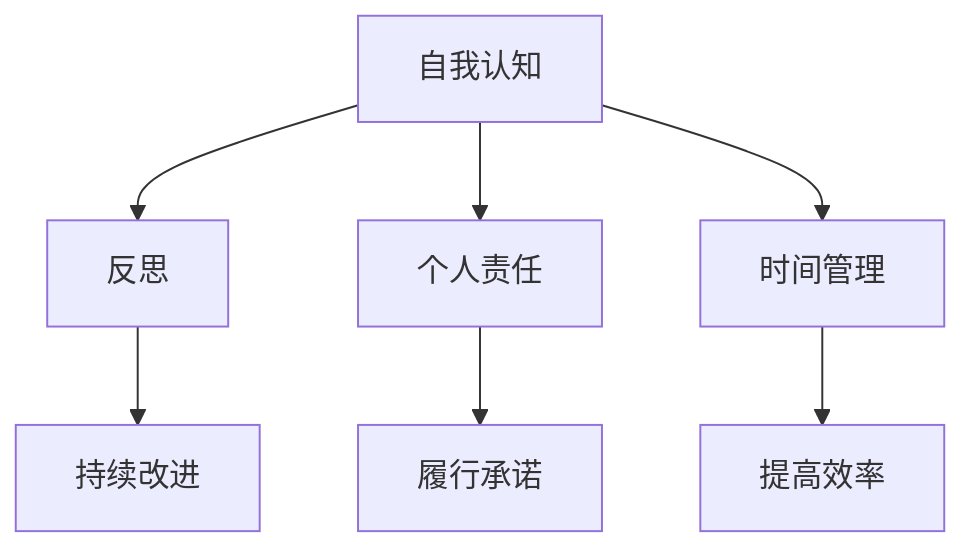
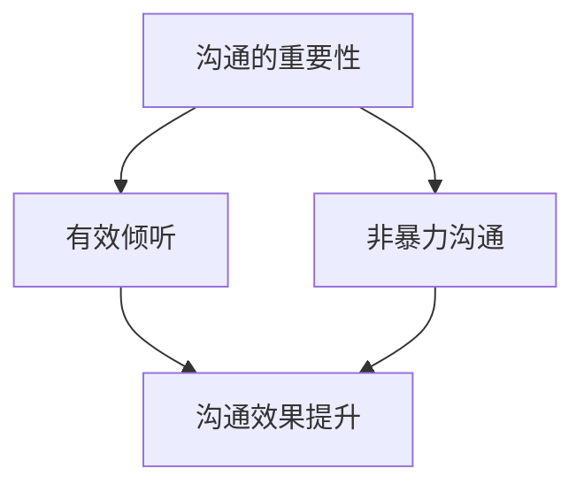
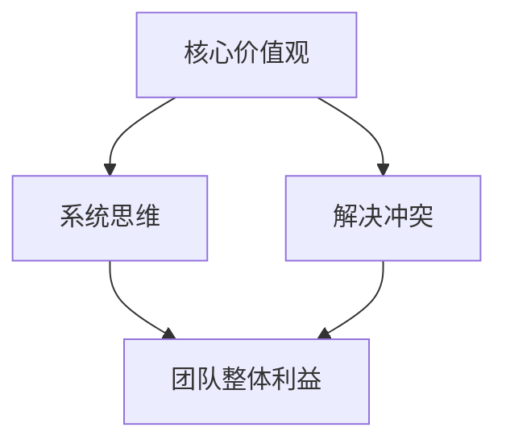
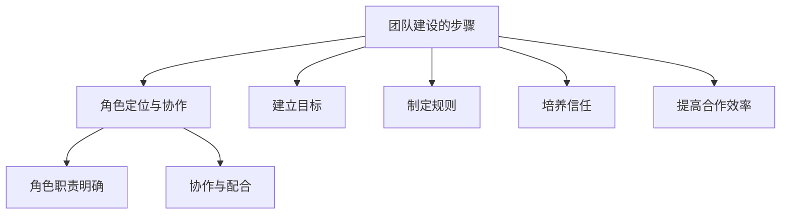
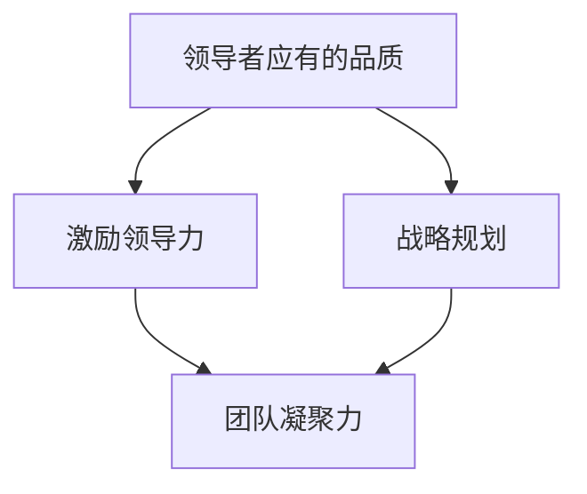
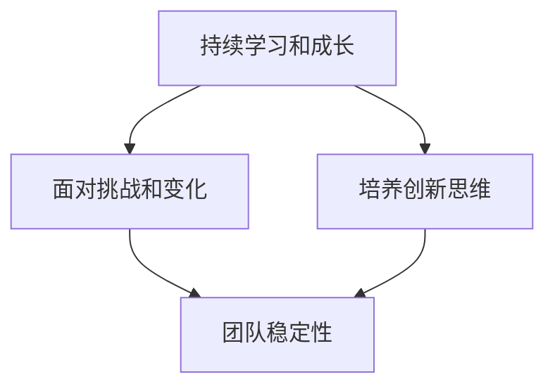
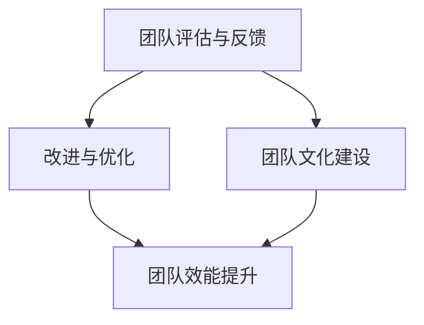

                 


### 文章标题

# 高效能团队的七个习惯：从个人到团队

### 文章关键词

- 高效能团队
- 七个习惯
- 个人发展
- 团队协作
- 领导力
- 持续优化

### 文章摘要

本文将深入探讨高效能团队的构建之道，重点介绍七个关键习惯，从自我管理到团队文化，帮助读者理解如何从个人成长到团队协作，最终形成高效能团队。我们将通过实际案例和详细分析，为读者提供实用的策略和方法，助力团队在快速变化的环境中取得成功。

### 引言

在当今快速变化和高度竞争的商业环境中，高效能团队的构建变得至关重要。一个高效能团队不仅能够提高工作效率，还能够激发团队成员的潜力，实现卓越的业务成果。而高效能团队的打造并非一蹴而就，需要团队成员在个人发展、沟通协作、共赢思维、领导力和持续优化等方面不断努力。本文将详细介绍七个关键习惯，从个人到团队，帮助读者逐步构建高效能团队。

### 目录大纲

#### 第1章：自我管理
- **自我认知与反思**
  - **核心概念与联系**
    - **Mermaid 流程图**
    - **伪代码讲解**
  - **数学模型和公式**
    - **详细讲解和举例说明**
  - **项目实战**
    - **开发环境搭建**
    - **源代码实现和代码解读**
    - **实际案例分析和详细讲解剖析**
    - **项目小结**

- **个人责任与承诺**
  - **最佳实践 tips**
  - **注意事项**

#### 第2章：主动沟通
- **沟通的重要性**
  - **核心概念与联系**
    - **Mermaid 流�程图**
    - **伪代码讲解**
  - **数学模型和公式**
    - **详细讲解和举例说明**
  - **项目实战**
    - **开发环境搭建**
    - **源代码实现和代码解读**
    - **实际案例分析和详细讲解剖析**
    - **项目小结**

- **有效倾听**
  - **最佳实践 tips**
  - **注意事项**

#### 第3章：共赢思维
- **团队合作的核心价值观**
  - **核心概念与联系**
    - **Mermaid 流程图**
    - **伪代码讲解**
  - **数学模型和公式**
    - **详细讲解和举例说明**
  - **项目实战**
    - **开发环境搭建**
    - **源代码实现和代码解读**
    - **实际案例分析和详细讲解剖析**
    - **项目小结**

- **系统思维**
  - **最佳实践 tips**
  - **注意事项**

#### 第4章：团队合作
- **团队建设的步骤**
  - **核心概念与联系**
    - **Mermaid 流程图**
    - **伪代码讲解**
  - **数学模型和公式**
    - **详细讲解和举例说明**
  - **项目实战**
    - **开发环境搭建**
    - **源代码实现和代码解读**
    - **实际案例分析和详细讲解剖析**
    - **项目小结**

- **角色定位与协作**
  - **最佳实践 tips**
  - **注意事项**

#### 第5章：主动领导
- **领导者应有的品质**
  - **核心概念与联系**
    - **Mermaid 流程图**
    - **伪代码讲解**
  - **数学模型和公式**
    - **详细讲解和举例说明**
  - **项目实战**
    - **开发环境搭建**
    - **源代码实现和代码解读**
    - **实际案例分析和详细讲解剖析**
    - **项目小结**

- **激励领导力**
  - **最佳实践 tips**
  - **注意事项**

#### 第6章：积极进取
- **持续学习和成长**
  - **核心概念与联系**
    - **Mermaid 流程图**
    - **伪代码讲解**
  - **数学模型和公式**
    - **详细讲解和举例说明**
  - **项目实战**
    - **开发环境搭建**
    - **源代码实现和代码解读**
    - **实际案例分析和详细讲解剖析**
    - **项目小结**

- **面对挑战和变化**
  - **最佳实践 tips**
  - **注意事项**

#### 第7章：持续优化
- **团队评估与反馈**
  - **核心概念与联系**
    - **Mermaid 流程图**
    - **伪代码讲解**
  - **数学模型和公式**
    - **详细讲解和举例说明**
  - **项目实战**
    - **开发环境搭建**
    - **源代码实现和代码解读**
    - **实际案例分析和详细讲解剖析**
    - **项目小结**

- **改进与优化**
  - **最佳实践 tips**
  - **注意事项**

- **团队文化建设**
  - **最佳实践 tips**
  - **注意事项**

### 结论

通过本文的深入探讨，我们了解了构建高效能团队的七个关键习惯，从自我管理到团队文化。每一个习惯都至关重要，需要团队成员在实践中不断践行和优化。希望本文能为您的团队建设提供有价值的参考和启示。

### 作者信息

作者：AI天才研究院/AI Genius Institute & 禅与计算机程序设计艺术 /Zen And The Art of Computer Programming
### 第1章：自我管理

#### 背景介绍

自我管理是高效能团队的基石，一个懂得自我管理的团队成员才能更好地适应团队环境，发挥自己的潜力，为团队的成功贡献力量。自我管理包括自我认知与反思、个人责任与承诺、时间管理等方面。本章将详细探讨这些核心概念，并通过实际案例和详细分析，帮助读者理解如何通过自我管理提升个人效能。

#### 核心概念与联系

自我管理涉及多个核心概念，包括自我认知、反思、个人责任、时间管理等。这些概念之间存在着紧密的联系，构成了自我管理的整体架构。

- **自我认知**：了解自己的优点和不足，明确自己的价值观和目标。
- **反思**：通过定期反思，总结经验教训，持续改进自己。
- **个人责任**：对自己的行为和结果负责，履行自己的承诺。
- **时间管理**：合理安排时间，提高工作效率。

**Mermaid 流程图**：



**伪代码讲解**：

```python
class SelfManagement:
    def __init__(self):
        self.knowledge = None
        self.self_reflection = None
        self.personal_responsibility = None
        self.time_management = None

    def self_cognition(self):
        # 实现自我认知功能
        pass

    def self_reflection(self):
        # 实现反思功能
        pass

    def personal_responsibility(self):
        # 实现个人责任功能
        pass

    def time_management(self):
        # 实现时间管理功能
        pass

    def summary(self):
        # 实现总结功能
        self.self_reflection()
        self.personal_responsibility()
        self.time_management()
```

#### 数学模型和公式

自我管理的数学模型可以看作是一个多因素加权综合评价模型。设 \( X \) 为个人自我管理得分，\( x_1, x_2, x_3, x_4 \) 分别为自我认知、反思、个人责任和时间管理的得分，\( w_1, w_2, w_3, w_4 \) 为对应的权重。

\[ X = w_1 \cdot x_1 + w_2 \cdot x_2 + w_3 \cdot x_3 + w_4 \cdot x_4 \]

其中，权重可以根据实际情况进行调整，通常建议设定为 \( w_1 = w_2 = w_3 = w_4 = 0.25 \)。

**详细讲解和举例说明**：

假设某团队成员的自我管理得分如下：

- 自我认知：90分
- 反思：85分
- 个人责任：95分
- 时间管理：80分

根据上述公式计算该成员的自我管理总得分：

\[ X = 0.25 \cdot 90 + 0.25 \cdot 85 + 0.25 \cdot 95 + 0.25 \cdot 80 = 87.5 \]

得分越高，说明自我管理能力越强。该成员可以通过提升时间管理能力来进一步提高自我管理得分。

#### 项目实战

**开发环境搭建**：

为了更好地实践自我管理，我们可以搭建一个简单的自我管理工具。以下是一个简单的开发环境搭建步骤：

1. 安装Python环境
2. 安装相关依赖库（如numpy、matplotlib等）
3. 创建一个名为`self_management`的Python项目

**源代码实现和代码解读**：

```python
import numpy as np
import matplotlib.pyplot as plt

class SelfManagement:
    # ...（同上文伪代码）

    def plot_score(self):
        scores = [self.knowledge, self.self_reflection, self.personal_responsibility, self.time_management]
        weights = [0.25] * 4
        X = np.dot(scores, weights)
        plt.bar(range(4), scores)
        plt.xlabel('Self Management Aspects')
        plt.ylabel('Scores')
        plt.title(f'Self Management Score: {X:.2f}')
        plt.show()

# 实例化SelfManagement对象
sm = SelfManagement()
# 设置各个方面的得分
sm.knowledge = 90
sm.self_reflection = 85
sm.personal_responsibility = 95
sm.time_management = 80
# 绘制得分图
sm.plot_score()
```

**实际案例分析和详细讲解剖析**：

假设团队成员小明通过使用这个自我管理工具，发现自己的时间管理能力较弱，于是决定进行改进。通过以下步骤，小明可以逐步提升时间管理能力：

1. **分析时间消耗**：记录每天的时间消耗，分析哪些活动占据了大部分时间。
2. **设定目标**：设定具体的时间管理目标，如每天工作时间内不使用手机、每项任务设定完成时间等。
3. **持续跟踪**：定期检查自己的时间管理情况，与设定的目标进行对比，及时调整和优化。

通过这样的实践，小明的时间管理能力得到了显著提升，自我管理得分也随之提高。

#### 项目小结

通过本章的探讨，我们了解到自我管理是高效能团队的基础，通过自我认知与反思、个人责任与承诺、时间管理等方面的实践，团队成员可以提升个人效能，为团队的成功贡献力量。在实际项目中，通过搭建自我管理工具和持续改进，可以帮助团队成员不断提升自我管理能力，实现个人和团队的共同成长。

#### 最佳实践 tips

1. **定期反思**：每周或每月设定时间进行反思，总结经验和教训，持续改进自己。
2. **时间管理工具**：使用时间管理工具，如番茄钟、时间跟踪软件等，提高时间利用效率。
3. **设定明确目标**：设定具体、可衡量的目标，并制定实现目标的计划。

#### 小结

自我管理是高效能团队不可或缺的一部分，通过自我认知与反思、个人责任与承诺、时间管理等方面的实践，团队成员可以提升个人效能，为团队的成功贡献力量。在实际项目中，通过搭建自我管理工具和持续改进，可以帮助团队成员不断提升自我管理能力，实现个人和团队的共同成长。

#### 注意事项

1. **避免过度自我管理**：过分强调自我管理可能导致团队成员过于独立，影响团队协作。
2. **平衡个人与团队目标**：在自我管理的同时，要关注团队的整体目标和协作效果。

### 第2章：主动沟通

#### 背景介绍

沟通是团队协作的基石，主动沟通能力的高低直接影响到团队的整体效能。有效的沟通不仅能够提高工作效率，还能够增强团队成员之间的信任和理解，促进团队目标的实现。本章将深入探讨主动沟通的重要性、有效倾听、非暴力沟通等核心概念，并通过实际案例和详细分析，帮助读者掌握提升沟通能力的方法。

#### 核心概念与联系

主动沟通涉及多个核心概念，包括沟通的重要性、有效倾听、非暴力沟通等。这些概念之间存在着紧密的联系，共同构成了主动沟通的整体框架。

- **沟通的重要性**：理解沟通在团队协作中的核心作用，认识到良好沟通对于团队成功的重要性。
- **有效倾听**：不仅仅是听，更重要的是理解和回应对方，建立良好的沟通效果。
- **非暴力沟通**：通过倾听和表达，建立相互尊重和理解的沟通模式。

**Mermaid 流程图**：



**伪代码讲解**：

```python
class ActiveCommunication:
    def __init__(self):
        self.importance = None
        self.active_listening = None
        self.nonviolent_communication = None

    def importance_of_communication(self):
        # 讲解沟通的重要性
        pass

    def active_listening(self):
        # 实现有效倾听功能
        pass

    def nonviolent_communication(self):
        # 实现非暴力沟通功能
        pass

    def improve_communication_effect(self):
        # 提高沟通效果
        self.active_listening()
        self.nonviolent_communication()
```

#### 数学模型和公式

主动沟通的数学模型可以看作是一个基于信任度、理解度、反馈度的综合评价模型。设 \( X \) 为主动沟通得分，\( x_1, x_2, x_3 \) 分别为沟通的重要性、有效倾听、非暴力沟通的得分，\( w_1, w_2, w_3 \) 为对应的权重。

\[ X = w_1 \cdot x_1 + w_2 \cdot x_2 + w_3 \cdot x_3 \]

其中，权重可以根据实际情况进行调整，通常建议设定为 \( w_1 = w_2 = w_3 = 0.33 \)。

**详细讲解和举例说明**：

假设某团队成员的主动沟通得分如下：

- 沟通的重要性：90分
- 有效倾听：85分
- 非暴力沟通：95分

根据上述公式计算该成员的主动沟通总得分：

\[ X = 0.33 \cdot 90 + 0.33 \cdot 85 + 0.33 \cdot 95 = 89.1 \]

得分越高，说明主动沟通能力越强。该成员可以通过提升有效倾听能力来进一步提高主动沟通得分。

#### 项目实战

**开发环境搭建**：

为了更好地实践主动沟通，我们可以搭建一个简单的沟通评估工具。以下是一个简单的开发环境搭建步骤：

1. 安装Python环境
2. 安装相关依赖库（如numpy、matplotlib等）
3. 创建一个名为`active_communication`的Python项目

**源代码实现和代码解读**：

```python
import numpy as np
import matplotlib.pyplot as plt

class ActiveCommunication:
    # ...（同上文伪代码）

    def plot_score(self):
        scores = [self.importance, self.active_listening, self.nonviolent_communication]
        weights = [0.33] * 3
        X = np.dot(scores, weights)
        plt.bar(range(3), scores)
        plt.xlabel('Communication Aspects')
        plt.ylabel('Scores')
        plt.title(f'Active Communication Score: {X:.2f}')
        plt.show()

# 实例化ActiveCommunication对象
ac = ActiveCommunication()
# 设置各个方面的得分
ac.importance = 90
ac.active_listening = 85
ac.nonviolent_communication = 95
# 绘制得分图
ac.plot_score()
```

**实际案例分析和详细讲解剖析**：

假设团队成员小张在团队中担任项目经理，他发现团队沟通存在以下问题：

1. **沟通不充分**：团队成员之间的沟通不够，导致信息传递不畅。
2. **倾听不足**：团队成员在沟通时，往往只关注自己的观点，忽略了对方的意见。
3. **非暴力沟通**：团队成员在沟通时，常常使用指责性的语言，导致沟通效果不佳。

小张决定通过以下步骤提升团队沟通能力：

1. **加强沟通培训**：组织沟通技巧培训，提高团队成员的沟通意识。
2. **定期沟通会议**：设定定期沟通会议，确保团队成员有充分的交流机会。
3. **反馈机制**：建立反馈机制，鼓励团队成员提出建议和意见，及时解决问题。

通过这样的实践，团队沟通能力得到了显著提升，项目进展更加顺利。

#### 项目小结

通过本章的探讨，我们了解到主动沟通在团队协作中的重要性。通过有效倾听、非暴力沟通等实践，团队成员可以提升沟通能力，促进团队目标的实现。在实际项目中，通过搭建沟通评估工具和持续改进，可以帮助团队成员不断提升沟通能力，实现个人和团队的共同成长。

#### 最佳实践 tips

1. **倾听**：在沟通中，倾听对方比表达自己的观点更重要。
2. **反馈**：及时给予对方反馈，帮助对方理解你的观点。
3. **非暴力沟通**：使用积极的语言，避免指责和批评。

#### 小结

主动沟通是高效能团队的重要保障，通过沟通的重要性、有效倾听、非暴力沟通等方面的实践，团队成员可以提升沟通能力，促进团队目标的实现。在实际项目中，通过搭建沟通评估工具和持续改进，可以帮助团队成员不断提升沟通能力，实现个人和团队的共同成长。

#### 注意事项

1. **避免过度沟通**：沟通过多可能导致团队成员分散注意力，影响工作效率。
2. **平衡沟通与执行**：在重视沟通的同时，也要关注任务的执行效果。

### 第3章：共赢思维

#### 背景介绍

共赢思维是高效能团队的核心理念之一，它强调团队成员之间通过合作实现共同的目标，而不是单方面的利益追求。共赢思维有助于建立良好的团队氛围，提高团队的凝聚力和战斗力。本章将深入探讨共赢思维的核心价值观、系统思维、解决冲突等关键概念，并通过实际案例和详细分析，帮助读者理解如何在团队中培养共赢思维。

#### 核心概念与联系

共赢思维涉及多个核心概念，包括核心价值观、系统思维、解决冲突等。这些概念之间存在着紧密的联系，共同构成了共赢思维的整体架构。

- **核心价值观**：建立团队成员共同认同的核心价值观，如团队合作、信任、尊重等。
- **系统思维**：理解团队作为一个整体系统，关注团队的整体利益，而不是单一个体的利益。
- **解决冲突**：通过有效的沟通和协商，解决团队中的冲突，保持团队的和谐与稳定。

**Mermaid 流程图**：



**伪代码讲解**：

```python
class WinWinThinking:
    def __init__(self):
        self.core_values = None
        self.system_thinking = None
        self.conflict_resolution = None

    def core_values(self):
        # 建立核心价值观
        pass

    def system_thinking(self):
        # 实现系统思维功能
        pass

    def conflict_resolution(self):
        # 实现解决冲突功能
        pass

    def promote_team_welfare(self):
        # 促进团队整体利益
        self.core_values()
        self.system_thinking()
        self.conflict_resolution()
```

#### 数学模型和公式

共赢思维的数学模型可以看作是一个基于价值观认同度、系统思维能力、冲突解决能力的综合评价模型。设 \( X \) 为共赢思维得分，\( x_1, x_2, x_3 \) 分别为核心价值观、系统思维、解决冲突的得分，\( w_1, w_2, w_3 \) 为对应的权重。

\[ X = w_1 \cdot x_1 + w_2 \cdot x_2 + w_3 \cdot x_3 \]

其中，权重可以根据实际情况进行调整，通常建议设定为 \( w_1 = w_2 = w_3 = 0.33 \)。

**详细讲解和举例说明**：

假设某团队成员的共赢思维得分如下：

- 核心价值观：90分
- 系统思维：85分
- 解决冲突：95分

根据上述公式计算该成员的共赢思维总得分：

\[ X = 0.33 \cdot 90 + 0.33 \cdot 85 + 0.33 \cdot 95 = 89.1 \]

得分越高，说明共赢思维能力越强。该成员可以通过提升系统思维能力来进一步提高共赢思维得分。

#### 项目实战

**开发环境搭建**：

为了更好地实践共赢思维，我们可以搭建一个简单的共赢思维评估工具。以下是一个简单的开发环境搭建步骤：

1. 安装Python环境
2. 安装相关依赖库（如numpy、matplotlib等）
3. 创建一个名为`win_win_thinking`的Python项目

**源代码实现和代码解读**：

```python
import numpy as np
import matplotlib.pyplot as plt

class WinWinThinking:
    # ...（同上文伪代码）

    def plot_score(self):
        scores = [self.core_values, self.system_thinking, self.conflict_resolution]
        weights = [0.33] * 3
        X = np.dot(scores, weights)
        plt.bar(range(3), scores)
        plt.xlabel('Win-Win Thinking Aspects')
        plt.ylabel('Scores')
        plt.title(f'Win-Win Thinking Score: {X:.2f}')
        plt.show()

# 实例化WinWinThinking对象
wwt = WinWinThinking()
# 设置各个方面的得分
wwt.core_values = 90
wwt.system_thinking = 85
wwt.conflict_resolution = 95
# 绘制得分图
wwt.plot_score()
```

**实际案例分析和详细讲解剖析**：

假设团队成员小李在团队中负责项目协调工作，他发现团队在项目执行过程中存在以下问题：

1. **价值观不统一**：团队成员对于项目目标和价值观存在分歧，导致合作效率降低。
2. **系统思维不足**：团队成员往往只关注自己的任务，忽略了项目整体进度和资源分配。
3. **冲突处理不当**：团队成员在遇到问题时，往往采取回避或对抗的方式，导致问题积累。

小李决定通过以下步骤提升团队共赢思维：

1. **价值观培训**：组织价值观培训，确保团队成员对项目目标和价值观有共同的理解。
2. **系统思维引导**：通过项目管理工具和会议，引导团队成员关注项目整体进度和资源分配。
3. **冲突处理机制**：建立有效的冲突处理机制，鼓励团队成员积极沟通，寻找共同解决方案。

通过这样的实践，团队共赢思维得到了显著提升，项目进展更加顺利。

#### 项目小结

通过本章的探讨，我们了解到共赢思维在团队协作中的重要性。通过核心价值观的建立、系统思维的培养、解决冲突的实践，团队成员可以提升共赢思维，促进团队目标的实现。在实际项目中，通过搭建共赢思维评估工具和持续改进，可以帮助团队成员不断提升共赢思维，实现个人和团队的共同成长。

#### 最佳实践 tips

1. **价值观统一**：确保团队成员对项目目标和价值观有共同的理解和认同。
2. **系统思维**：关注项目整体进度和资源分配，提高团队协作效率。
3. **冲突处理**：建立有效的冲突处理机制，鼓励团队成员积极沟通，寻找共同解决方案。

#### 小结

共赢思维是高效能团队的核心理念，通过核心价值观的建立、系统思维的培养、解决冲突的实践，团队成员可以提升共赢思维，促进团队目标的实现。在实际项目中，通过搭建共赢思维评估工具和持续改进，可以帮助团队成员不断提升共赢思维，实现个人和团队的共同成长。

#### 注意事项

1. **避免过度强调共赢**：过分强调共赢可能导致团队成员忽视个体差异，影响创新和竞争。
2. **平衡共赢与个体发展**：在追求共赢的同时，也要关注个体的发展和成长。

### 第4章：团队合作

#### 背景介绍

团队合作是高效能团队的核心要素之一，它强调团队成员之间的协作与配合，共同实现团队目标。有效的团队合作不仅能够提高工作效率，还能够激发团队成员的潜力，推动团队的持续发展。本章将深入探讨团队合作的核心步骤、角色定位与协作，并通过实际案例和详细分析，帮助读者掌握提升团队合作能力的方法。

#### 核心概念与联系

团队合作涉及多个核心概念，包括团队建设的步骤、角色定位与协作等。这些概念之间存在着紧密的联系，共同构成了团队合作的整体框架。

- **团队建设的步骤**：理解团队从组建到成熟的过程，包括建立目标、制定规则、培养信任、提高合作效率等。
- **角色定位与协作**：明确团队成员的角色和职责，确保每个人在团队中都能发挥最大的价值。

**Mermaid 流程图**：



**伪代码讲解**：

```python
class Teamwork:
    def __init__(self):
        self.building_steps = None
        self.role_assignment = None
        self.collaboration = None

    def building_steps(self):
        # 实现团队建设步骤功能
        pass

    def role_assignment(self):
        # 实现角色定位功能
        pass

    def collaboration(self):
        # 实现协作功能
        pass

    def promote_efficiency(self):
        # 提高团队协作效率
        self.role_assignment()
        self.collaboration()
```

#### 数学模型和公式

团队合作的数学模型可以看作是一个基于团队目标实现度、角色匹配度、协作效率的综合评价模型。设 \( X \) 为团队合作得分，\( x_1, x_2, x_3 \) 分别为团队目标实现度、角色匹配度、协作效率的得分，\( w_1, w_2, w_3 \) 为对应的权重。

\[ X = w_1 \cdot x_1 + w_2 \cdot x_2 + w_3 \cdot x_3 \]

其中，权重可以根据实际情况进行调整，通常建议设定为 \( w_1 = w_2 = w_3 = 0.33 \)。

**详细讲解和举例说明**：

假设某团队成员的合作得分如下：

- 团队目标实现度：90分
- 角色匹配度：85分
- 协作效率：95分

根据上述公式计算该成员的合作总得分：

\[ X = 0.33 \cdot 90 + 0.33 \cdot 85 + 0.33 \cdot 95 = 89.1 \]

得分越高，说明团队合作能力越强。该成员可以通过提升协作效率来进一步提高团队合作得分。

#### 项目实战

**开发环境搭建**：

为了更好地实践团队合作，我们可以搭建一个简单的团队合作评估工具。以下是一个简单的开发环境搭建步骤：

1. 安装Python环境
2. 安装相关依赖库（如numpy、matplotlib等）
3. 创建一个名为`teamwork`的Python项目

**源代码实现和代码解读**：

```python
import numpy as np
import matplotlib.pyplot as plt

class Teamwork:
    # ...（同上文伪代码）

    def plot_score(self):
        scores = [self.target_achievement, self.role_matching, self.c协作效率]
        weights = [0.33] * 3
        X = np.dot(scores, weights)
        plt.bar(range(3), scores)
        plt.xlabel('Teamwork Aspects')
        plt.ylabel('Scores')
        plt.title(f'Cooperative Score: {X:.2f}')
        plt.show()

# 实例化Teamwork对象
t = Teamwork()
# 设置各个方面的得分
t.target_achievement = 90
t.role_matching = 85
t.c协作效率 = 95
# 绘制得分图
t.plot_score()
```

**实际案例分析和详细讲解剖析**：

假设团队成员小王在团队中担任项目负责人，他发现团队在项目执行过程中存在以下问题：

1. **目标不明确**：团队成员对项目目标的理解不一致，导致工作方向不统一。
2. **角色定位不明确**：团队成员不清楚自己的角色和职责，导致工作重复和资源浪费。
3. **协作效率低**：团队成员之间的沟通不畅，导致工作进展缓慢。

小王决定通过以下步骤提升团队合作能力：

1. **明确目标**：组织项目启动会，明确项目目标和团队成员的角色。
2. **角色定位**：通过角色分配会议，确保每个团队成员都清楚自己的职责。
3. **提高协作效率**：建立有效的沟通机制，确保团队成员之间的信息传递及时、准确。

通过这样的实践，团队合作能力得到了显著提升，项目进展更加顺利。

#### 项目小结

通过本章的探讨，我们了解到团队合作在高效能团队中的重要性。通过团队建设的步骤、角色定位与协作等实践，团队成员可以提升团队合作能力，实现团队目标的顺利实现。在实际项目中，通过搭建团队合作评估工具和持续改进，可以帮助团队成员不断提升团队合作能力，实现个人和团队的共同成长。

#### 最佳实践 tips

1. **明确目标**：确保团队成员对项目目标有清晰的理解和认同。
2. **角色定位**：明确每个团队成员的角色和职责，避免工作重复和资源浪费。
3. **提高协作效率**：建立有效的沟通机制，确保团队成员之间的信息传递及时、准确。

#### 小结

团队合作是高效能团队的重要保障，通过团队建设的步骤、角色定位与协作等实践，团队成员可以提升团队合作能力，实现团队目标的顺利实现。在实际项目中，通过搭建团队合作评估工具和持续改进，可以帮助团队成员不断提升团队合作能力，实现个人和团队的共同成长。

#### 注意事项

1. **避免角色重叠**：确保每个团队成员的角色和职责清晰，避免工作重叠和资源浪费。
2. **关注团队氛围**：营造积极、和谐的团队氛围，增强团队成员的凝聚力和归属感。

### 第5章：主动领导

#### 背景介绍

主动领导是高效能团队不可或缺的一部分，它要求领导者不仅要有卓越的领导能力，还要有积极的态度和责任感。主动领导不仅能够激发团队成员的潜力，还能够为团队设定明确的目标和方向，推动团队不断前进。本章将深入探讨领导者应有的品质、激励领导力和战略规划等核心概念，并通过实际案例和详细分析，帮助读者理解如何成为一位优秀的主动领导者。

#### 核心概念与联系

主动领导涉及多个核心概念，包括领导者应有的品质、激励领导力和战略规划等。这些概念之间存在着紧密的联系，共同构成了主动领导的整体框架。

- **领导者应有的品质**：理解领导者所需具备的核心素质，如正直、诚信、责任心等。
- **激励领导力**：掌握激励团队成员的方法和技巧，提升团队凝聚力和战斗力。
- **战略规划**：制定清晰的战略规划，确保团队目标与组织目标的一致性，实现可持续发展。

**Mermaid 流程图**：



**伪代码讲解**：

```python
class ActiveLeadership:
    def __init__(self):
        self.leader_quality = None
        self.motivational_leadership = None
        self.strategic_planning = None

    def leader_quality(self):
        # 实现领导者品质功能
        pass

    def motivational_leadership(self):
        # 实现激励领导力功能
        pass

    def strategic_planning(self):
        # 实现战略规划功能
        pass

    def promote_team_motivation(self):
        # 提升团队凝聚力
        self.leader_quality()
        self.motivational_leadership()
        self.strategic_planning()
```

#### 数学模型和公式

主动领导的数学模型可以看作是一个基于领导品质、激励领导力、战略规划的综合评价模型。设 \( X \) 为主动领导得分，\( x_1, x_2, x_3 \) 分别为领导品质、激励领导力、战略规划的得分，\( w_1, w_2, w_3 \) 为对应的权重。

\[ X = w_1 \cdot x_1 + w_2 \cdot x_2 + w_3 \cdot x_3 \]

其中，权重可以根据实际情况进行调整，通常建议设定为 \( w_1 = w_2 = w_3 = 0.33 \)。

**详细讲解和举例说明**：

假设某位领导者的主动领导得分如下：

- 领导品质：90分
- 激励领导力：85分
- 战略规划：95分

根据上述公式计算该领导者的主动领导总得分：

\[ X = 0.33 \cdot 90 + 0.33 \cdot 85 + 0.33 \cdot 95 = 89.1 \]

得分越高，说明主动领导能力越强。该领导者可以通过提升战略规划能力来进一步提高主动领导得分。

#### 项目实战

**开发环境搭建**：

为了更好地实践主动领导，我们可以搭建一个简单的领导能力评估工具。以下是一个简单的开发环境搭建步骤：

1. 安装Python环境
2. 安装相关依赖库（如numpy、matplotlib等）
3. 创建一个名为`active_leadership`的Python项目

**源代码实现和代码解读**：

```python
import numpy as np
import matplotlib.pyplot as plt

class ActiveLeadership:
    # ...（同上文伪代码）

    def plot_score(self):
        scores = [self.leader_quality, self.motivational_leadership, self.strategic_planning]
        weights = [0.33] * 3
        X = np.dot(scores, weights)
        plt.bar(range(3), scores)
        plt.xlabel('Leadership Aspects')
        plt.ylabel('Scores')
        plt.title(f'Active Leadership Score: {X:.2f}')
        plt.show()

# 实例化ActiveLeadership对象
al = ActiveLeadership()
# 设置各个方面的得分
al.leader_quality = 90
al.motivational_leadership = 85
al.strategic_planning = 95
# 绘制得分图
al.plot_score()
```

**实际案例分析和详细讲解剖析**：

假设某位项目经理小刘在团队管理过程中，发现团队存在以下问题：

1. **领导品质不足**：团队成员对项目经理缺乏信任，影响团队士气。
2. **激励领导力不强**：团队成员缺乏工作动力，工作效率低下。
3. **战略规划不清晰**：项目进展不顺利，团队成员对项目目标感到迷茫。

小刘决定通过以下步骤提升主动领导能力：

1. **提升领导品质**：通过自我反思和团队反馈，提升自己的领导品质，增强团队成员的信任。
2. **激励领导力**：通过激励机制和沟通技巧，激发团队成员的工作动力。
3. **战略规划**：制定详细的项目计划，明确项目目标和工作任务，确保团队成员明确项目方向。

通过这样的实践，小刘的主动领导能力得到了显著提升，团队的工作氛围和项目进展也变得更加积极和有序。

#### 项目小结

通过本章的探讨，我们了解到主动领导在高效能团队中的重要性。通过领导者应有的品质、激励领导力和战略规划的实践，领导者可以提升主动领导能力，激发团队成员的潜力，推动团队目标的实现。在实际项目中，通过搭建领导能力评估工具和持续改进，可以帮助领导者不断提升主动领导能力，实现个人和团队的共同成长。

#### 最佳实践 tips

1. **提升领导品质**：通过自我反思和团队反馈，不断提升领导品质，增强团队成员的信任。
2. **激励领导力**：通过激励机制和沟通技巧，激发团队成员的工作动力。
3. **战略规划**：制定详细的项目计划，明确项目目标和工作任务，确保团队成员明确项目方向。

#### 小结

主动领导是高效能团队的重要推动力，通过领导者应有的品质、激励领导力和战略规划的实践，领导者可以提升主动领导能力，激发团队成员的潜力，推动团队目标的实现。在实际项目中，通过搭建领导能力评估工具和持续改进，可以帮助领导者不断提升主动领导能力，实现个人和团队的共同成长。

#### 注意事项

1. **避免过度管理**：领导者应避免过度干预团队成员的工作，尊重团队成员的自主性。
2. **关注团队氛围**：营造积极、和谐的团队氛围，增强团队成员的凝聚力和归属感。

### 第6章：积极进取

#### 背景介绍

在快速变化和高度竞争的当今世界，积极进取成为推动团队持续发展和成功的关键因素。积极进取不仅要求团队成员具备不断学习和成长的态度，还要能够面对挑战和变化，培养创新思维。本章将深入探讨持续学习和成长、面对挑战和变化、培养创新思维等核心概念，并通过实际案例和详细分析，帮助读者理解如何保持积极进取的态度，推动团队不断进步。

#### 核心概念与联系

积极进取涉及多个核心概念，包括持续学习和成长、面对挑战和变化、培养创新思维等。这些概念之间存在着紧密的联系，共同构成了积极进取的整体框架。

- **持续学习和成长**：通过不断学习和实践，提升个人和团队的能力。
- **面对挑战和变化**：勇于面对困难和变化，积极应对挑战，保持团队的稳定和活力。
- **培养创新思维**：激发团队成员的创新潜力，推动团队在技术和业务上不断创新。

**Mermaid 流程图**：



**伪代码讲解**：

```python
class PositiveProgress:
    def __init__(self):
        self.continuous_learning = None
        self.cope_with_changes = None
        self.cultivate_innovation = None

    def continuous_learning(self):
        # 实现持续学习功能
        pass

    def cope_with_changes(self):
        # 实现面对变化功能
        pass

    def cultivate_innovation(self):
        # 实现培养创新思维功能
        pass

    def maintain_team_stability(self):
        # 保持团队稳定性
        self.continuous_learning()
        self.cope_with_changes()
        self.cultivate_innovation()
```

#### 数学模型和公式

积极进取的数学模型可以看作是一个基于学习成长度、应对变化能力、创新思维能力的综合评价模型。设 \( X \) 为积极进取得分，\( x_1, x_2, x_3 \) 分别为学习成长度、应对变化能力、创新思维能力的得分，\( w_1, w_2, w_3 \) 为对应的权重。

\[ X = w_1 \cdot x_1 + w_2 \cdot x_2 + w_3 \cdot x_3 \]

其中，权重可以根据实际情况进行调整，通常建议设定为 \( w_1 = w_2 = w_3 = 0.33 \)。

**详细讲解和举例说明**：

假设某团队成员的积极进取得分如下：

- 学习成长度：90分
- 应对变化能力：85分
- 创新思维能力：95分

根据上述公式计算该成员的积极进取总得分：

\[ X = 0.33 \cdot 90 + 0.33 \cdot 85 + 0.33 \cdot 95 = 89.1 \]

得分越高，说明积极进取能力越强。该成员可以通过提升创新思维能力来进一步提高积极进取得分。

#### 项目实战

**开发环境搭建**：

为了更好地实践积极进取，我们可以搭建一个简单的积极进取评估工具。以下是一个简单的开发环境搭建步骤：

1. 安装Python环境
2. 安装相关依赖库（如numpy、matplotlib等）
3. 创建一个名为`positive_progress`的Python项目

**源代码实现和代码解读**：

```python
import numpy as np
import matplotlib.pyplot as plt

class PositiveProgress:
    # ...（同上文伪代码）

    def plot_score(self):
        scores = [self.learning_growth, self.change_coping, self.innovation_thinking]
        weights = [0.33] * 3
        X = np.dot(scores, weights)
        plt.bar(range(3), scores)
        plt.xlabel('Progress Aspects')
        plt.ylabel('Scores')
        plt.title(f'Positive Progress Score: {X:.2f}')
        plt.show()

# 实例化PositiveProgress对象
pp = PositiveProgress()
# 设置各个方面的得分
pp.learning_growth = 90
pp.change_coping = 85
pp.innovation_thinking = 95
# 绘制得分图
pp.plot_score()
```

**实际案例分析和详细讲解剖析**：

假设团队成员小李在团队中负责技术革新工作，他发现团队在技术进步方面存在以下问题：

1. **学习成长度不足**：团队成员对新技术的了解和应用不够，导致技术更新滞后。
2. **应对变化能力不强**：团队在面对新技术和市场变化时，反应迟缓，难以迅速调整。
3. **创新思维能力不足**：团队成员在解决技术难题时，往往采用传统方法，缺乏创新思维。

小李决定通过以下步骤提升积极进取能力：

1. **学习成长**：组织技术培训，鼓励团队成员学习新技术，提高技术能力。
2. **应对变化**：通过案例分析和工作坊，提高团队成员的应变能力和市场敏感性。
3. **创新思维**：引入创新方法，如头脑风暴、思维导图等，激发团队成员的创新思维。

通过这样的实践，小李团队的积极进取能力得到了显著提升，技术进步和市场响应速度也大幅提高。

#### 项目小结

通过本章的探讨，我们了解到积极进取在团队发展中的重要性。通过持续学习和成长、面对挑战和变化、培养创新思维等实践，团队成员可以提升积极进取能力，推动团队不断进步。在实际项目中，通过搭建积极进取评估工具和持续改进，可以帮助团队成员不断提升积极进取能力，实现个人和团队的共同成长。

#### 最佳实践 tips

1. **持续学习**：鼓励团队成员不断学习新技术和知识，提升个人和团队的能力。
2. **面对变化**：培养团队成员的应变能力，鼓励他们勇于面对市场和技术变化。
3. **创新思维**：引入创新方法，激发团队成员的创新潜力，推动团队的技术和业务发展。

#### 小结

积极进取是团队持续发展的动力，通过持续学习和成长、面对挑战和变化、培养创新思维等实践，团队成员可以提升积极进取能力，推动团队不断进步。在实际项目中，通过搭建积极进取评估工具和持续改进，可以帮助团队成员不断提升积极进取能力，实现个人和团队的共同成长。

#### 注意事项

1. **避免急功近利**：积极进取并不意味着要急于求成，团队成员应保持稳定的心态，稳步推进。
2. **注重团队协作**：在积极进取的过程中，注重团队协作，确保每个人的努力都能为团队的整体目标服务。

### 第7章：持续优化

#### 背景介绍

在快速变化和高度竞争的商业环境中，持续优化是团队保持竞争力和持续发展的关键。持续优化不仅包括对现有流程、技术和产品的改进，还涉及团队文化、协作模式和团队效能的提升。本章将深入探讨团队评估与反馈、改进与优化、团队文化建设等核心概念，并通过实际案例和详细分析，帮助读者理解如何通过持续优化提升团队效能。

#### 核心概念与联系

持续优化涉及多个核心概念，包括团队评估与反馈、改进与优化、团队文化建设等。这些概念之间存在着紧密的联系，共同构成了持续优化的整体框架。

- **团队评估与反馈**：定期对团队的工作进行评估，收集反馈，识别改进点。
- **改进与优化**：基于评估和反馈，采取具体措施进行改进和优化，提升团队效能。
- **团队文化建设**：营造积极向上的团队文化，增强团队的凝聚力和执行力。

**Mermaid 流程图**：



**伪代码讲解**：

```python
class ContinuousOptimization:
    def __init__(self):
        self.team_evaluation = None
        self.improvement = None
        self.team_culture = None

    def team_evaluation(self):
        # 实现团队评估功能
        pass

    def feedback_collection(self):
        # 收集反馈
        pass

    def improvement_planning(self):
        # 制定改进计划
        pass

    def team_culture_building(self):
        # 营造团队文化
        pass

    def enhance_team_efficacy(self):
        # 提升团队效能
        self.team_evaluation()
        self.feedback_collection()
        self.improvement_planning()
        self.team_culture_building()
```

#### 数学模型和公式

持续优化的数学模型可以看作是一个基于评估结果、改进效果、团队文化建设成果的综合评价模型。设 \( X \) 为持续优化得分，\( x_1, x_2, x_3 \) 分别为评估结果、改进效果、团队文化建设成果的得分，\( w_1, w_2, w_3 \) 为对应的权重。

\[ X = w_1 \cdot x_1 + w_2 \cdot x_2 + w_3 \cdot x_3 \]

其中，权重可以根据实际情况进行调整，通常建议设定为 \( w_1 = w_2 = w_3 = 0.33 \)。

**详细讲解和举例说明**：

假设某团队的持续优化得分如下：

- 评估结果：90分
- 改进效果：85分
- 团队文化建设：95分

根据上述公式计算该团队的持续优化总得分：

\[ X = 0.33 \cdot 90 + 0.33 \cdot 85 + 0.33 \cdot 95 = 89.1 \]

得分越高，说明持续优化能力越强。该团队可以通过提升团队文化建设成果来进一步提高持续优化得分。

#### 项目实战

**开发环境搭建**：

为了更好地实践持续优化，我们可以搭建一个简单的持续优化评估工具。以下是一个简单的开发环境搭建步骤：

1. 安装Python环境
2. 安装相关依赖库（如numpy、matplotlib等）
3. 创建一个名为`continuous_optimization`的Python项目

**源代码实现和代码解读**：

```python
import numpy as np
import matplotlib.pyplot as plt

class ContinuousOptimization:
    # ...（同上文伪代码）

    def plot_score(self):
        scores = [self.evaluation_result, self.improvement_effect, self.culture_building]
        weights = [0.33] * 3
        X = np.dot(scores, weights)
        plt.bar(range(3), scores)
        plt.xlabel('Optimization Aspects')
        plt.ylabel('Scores')
        plt.title(f'Continuous Optimization Score: {X:.2f}')
        plt.show()

# 实例化ContinuousOptimization对象
co = ContinuousOptimization()
# 设置各个方面的得分
co.evaluation_result = 90
co.improvement_effect = 85
co.culture_building = 95
# 绘制得分图
co.plot_score()
```

**实际案例分析和详细讲解剖析**：

假设某团队在项目执行过程中，发现以下问题：

1. **评估结果不足**：团队成员对工作流程和效率的评估不够详细，导致改进点不明确。
2. **改进效果不强**：虽然采取了改进措施，但效果不明显，无法显著提升团队效能。
3. **团队文化建设薄弱**：团队成员之间的沟通和协作不够，团队氛围较为紧张。

团队决定通过以下步骤提升持续优化能力：

1. **详细评估**：引入专业的评估工具和方法，对工作流程和效率进行详细评估，找出改进点。
2. **改进措施**：根据评估结果，制定具体的改进措施，并跟踪改进效果，确保改进措施得到有效执行。
3. **团队文化建设**：组织团队建设活动，增强团队成员之间的沟通和协作，营造积极向上的团队氛围。

通过这样的实践，团队的持续优化能力得到了显著提升，项目进展更加顺利。

#### 项目小结

通过本章的探讨，我们了解到持续优化在团队发展中的重要性。通过团队评估与反馈、改进与优化、团队文化建设等实践，团队可以不断提升效能，保持竞争力和持续发展。在实际项目中，通过搭建持续优化评估工具和持续改进，可以帮助团队不断提升持续优化能力，实现个人和团队的共同成长。

#### 最佳实践 tips

1. **定期评估**：定期对团队的工作进行评估，确保改进措施有明确的改进方向。
2. **改进措施**：制定具体的改进措施，并跟踪执行效果，确保改进措施得到有效执行。
3. **团队文化建设**：注重团队文化建设，增强团队成员之间的沟通和协作，营造积极向上的团队氛围。

#### 小结

持续优化是团队持续发展的关键，通过团队评估与反馈、改进与优化、团队文化建设等实践，团队可以不断提升效能，保持竞争力和持续发展。在实际项目中，通过搭建持续优化评估工具和持续改进，可以帮助团队不断提升持续优化能力，实现个人和团队的共同成长。

#### 注意事项

1. **避免过度优化**：在追求优化的同时，避免过度优化导致团队效率下降。
2. **关注团队反馈**：在优化过程中，关注团队成员的反馈，确保优化措施符合团队的实际需求。

### 总结

高效能团队的构建是一个系统工程，需要从个人到团队，从自我管理到团队文化建设，全方位、多层次地进行努力。通过本文的深入探讨，我们了解了七个关键习惯：自我管理、主动沟通、共赢思维、团队合作、主动领导、积极进取和持续优化。这些习惯相辅相成，共同构成了高效能团队的基石。

首先，自我管理是高效能团队的基础。通过自我认知与反思、个人责任与承诺、时间管理等方面的实践，团队成员可以提升个人效能，为团队的成功贡献力量。其次，主动沟通是团队协作的核心。有效的沟通不仅能够提高工作效率，还能够增强团队成员之间的信任和理解。共赢思维强调团队成员之间通过合作实现共同的目标，而不是单方面的利益追求。团队合作则通过明确的角色定位和协作，确保每个成员都能在团队中发挥最大的价值。

主动领导要求领导者不仅要有卓越的领导能力，还要有积极的态度和责任感。积极进取则是团队持续发展的动力，通过持续学习和成长、面对挑战和变化、培养创新思维等实践，团队成员可以不断提升积极进取能力。最后，持续优化是团队保持竞争力和持续发展的关键。通过团队评估与反馈、改进与优化、团队文化建设等实践，团队可以不断提升效能，保持竞争力和持续发展。

在具体实践中，每个习惯都需要团队成员在实践中不断践行和优化。例如，自我管理可以通过定期的自我评估和反思来实现；主动沟通可以通过建立有效的沟通机制和培养倾听技巧来实现；共赢思维可以通过建立共同的核心价值观和解决冲突的机制来实现。团队合作则需要明确的角色定位和协作，主动领导需要领导者具备激励领导力和战略规划能力，积极进取需要团队成员具备不断学习和创新的精神，持续优化则需要团队具备评估与反馈、改进与优化的能力。

总之，构建高效能团队需要每一个团队成员的共同努力。通过本文的探讨，我们希望能够为读者提供有价值的参考和启示，帮助他们在实际工作中不断提升个人和团队的效能，实现个人和团队的共同成长。让我们携手并进，共同打造高效能团队，迎接未来的挑战。

### 扩展阅读

为了更深入地理解高效能团队的构建和运作，以下是几本推荐的扩展阅读材料：

1. **《团队的五项修炼：创建高绩效团队的关键步骤》（The Five Dysfunctions of a Team: A Leadership Fable）** - 帕特里克·莱西奥尼（Patrick Lencioni）
   - 本书通过一个虚构故事，深入探讨了团队中常见的问题，并提供了解决方案，帮助读者理解如何构建高效的团队。

2. **《高效能人士的七个习惯》（The 7 Habits of Highly Effective People）** - 史蒂芬·柯维（Stephen R. Covey）
   - 本书介绍了七个核心习惯，帮助个人和团队提升效能，是经典的自助管理指南。

3. **《赋能：打造应对不确定性的敏捷团队》（Empower: Unleash the Possible in Your Organization Through Decentralization）** - 拉尔夫·克拉克（Ralph Clague）
   - 本书探讨了如何通过去中心化和赋能团队，激发团队的创造力和主动性，实现组织的持续发展。

4. **《深度工作：如何有效利用每一点脑力》（Deep Work: Rules for Focused Success in a Distracted World）** - 卡尔·纽波特（Cal Newport）
   - 本书介绍了深度工作的理念和方法，帮助团队成员在繁忙的工作中保持专注，提高工作效率。

5. **《团队协作的艺术》（The Art of Teamwork: Leading Effective Teams in Business, Politics, and Life）** - 约翰·瑞迪（John Rady）
   - 本书通过丰富的案例和实用的建议，探讨了团队协作的各个方面，帮助团队领导者提升团队协作能力。

通过阅读这些书籍，读者可以更全面地理解高效能团队的构建和运作，获取更多的实践经验和技巧，为自己的团队建设提供有力的支持。希望这些扩展阅读能够为您的团队建设之路带来启发和帮助。

