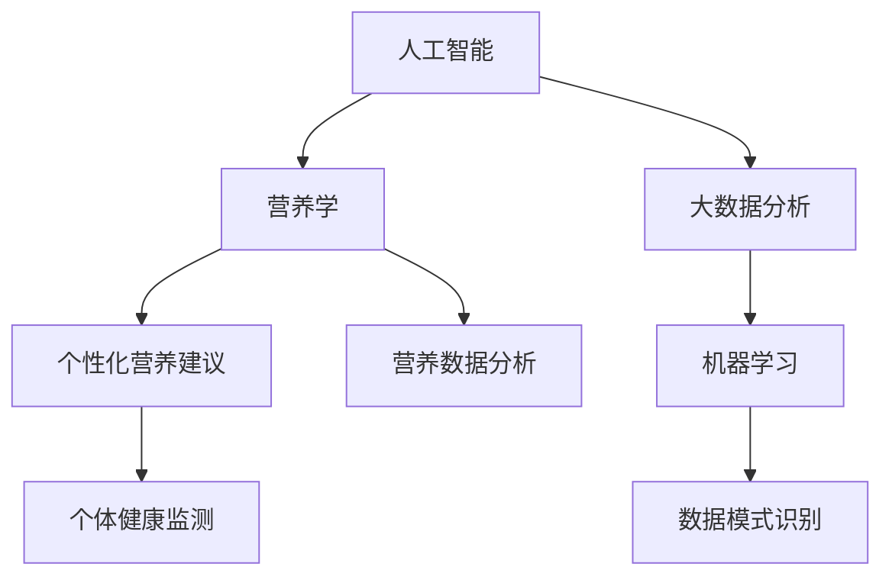

                 

### 《AI在个性化营养建议中的应用：促进健康生活》

> 关键词：人工智能，个性化营养，健康生活，机器学习，数据科学

摘要：本文旨在探讨人工智能（AI）在个性化营养建议中的应用，及其对促进健康生活的贡献。随着大数据和机器学习技术的发展，AI已经能够通过分析个体的基因、生活习惯、饮食偏好等多维度数据，提供高度个性化的营养建议。这不仅有助于预防慢性疾病，还能提高个体的整体健康水平。本文将首先介绍AI在营养建议中的应用背景，然后探讨个性化营养建议的核心概念，并逐步讲解AI在营养学中的核心算法原理。通过实际案例，我们将展示如何使用AI进行个性化营养建议的项目实战，并总结其中的挑战与机遇，展望未来的发展趋势。

### 目录大纲

# 《AI在个性化营养建议中的应用：促进健康生活》

## 第一部分：引言与基础

### 1. 引言

#### 1.1 AI在营养建议中的应用背景

随着科技的进步，人工智能（AI）在各个领域都展现出了强大的潜力。在医疗健康领域，AI的应用尤为显著，尤其是在个性化营养建议方面。传统营养建议往往依赖于一般性的健康指南和标准饮食计划，而AI能够通过大数据分析和机器学习算法，为个体提供高度个性化的营养建议。

#### 1.2 个性化营养建议的重要性

个性化营养建议不仅能够帮助个体更好地管理体重和预防慢性疾病，还能够根据个体的健康状况和生理需求，提供量身定制的饮食方案。这种个性化服务对于提升健康水平和生活质量具有重要意义。

#### 1.3 本书结构安排

本文将分为六个主要部分。第一部分是引言，介绍AI在营养建议中的应用背景和重要性。第二部分将探讨核心概念与联系，包括AI和营养学的基本概念及其相互关系。第三部分将深入讲解核心算法原理，包括数据收集与处理、特征提取与选择、模型训练与评估等步骤。第四部分将介绍数学模型和公式，并举例说明其在实际应用中的作用。第五部分将展示一个实际案例，包括开发环境搭建、源代码实现和代码解读。第六部分将总结全文，并展望未来的发展趋势。

## 第二部分：核心概念与联系

### 2.1 核心概念

#### 2.1.1 人工智能概述

人工智能（AI）是指由人制造出来的系统能够执行通常需要人类智能才能完成的任务。AI可以分为两大类：窄AI和宽AI。窄AI专注于特定的任务，如图像识别、自然语言处理等，而宽AI则具有更广泛的能力，能够进行通用任务处理。

#### 2.1.2 个性化营养建议的概念

个性化营养建议是指根据个体的基因、生活习惯、饮食偏好、健康状况等数据，为个体提供量身定制的饮食方案。个性化营养建议的核心在于数据的收集和分析，通过大数据和机器学习技术，实现对个体需求的精准把握。

#### 2.1.3 AI与营养学的关系

AI在营养学中的应用主要体现在数据分析和模式识别上。通过分析大量的营养数据和个体健康数据，AI能够发现个体营养需求与健康状况之间的关联，从而提供个性化的营养建议。此外，AI还可以帮助营养学家更高效地研究营养学，通过模拟和预测，探索不同营养方案对个体健康的影响。

### 2.2 关系图



## 第三部分：核心算法原理讲解

### 3.1 数据收集与处理

#### 3.1.1 数据来源

个性化营养建议的数据来源非常广泛，包括基因数据、生活习惯数据、饮食数据、健康监测数据等。这些数据可以通过多种方式收集，如健康跟踪设备、问卷、实验室检测等。

#### 3.1.2 数据预处理

数据预处理是数据科学中的关键步骤，包括数据清洗、数据转换和数据集成等。数据清洗旨在去除重复数据、缺失数据和异常数据，数据转换则涉及数据格式的标准化，数据集成则将不同来源的数据整合到一个统一的框架中。

$$
预处理 = \frac{清洗}{转换}
$$

### 3.2 特征提取与选择

#### 3.2.1 特征提取方法

特征提取是将原始数据转换为有用的信息表示，常用的方法包括统计方法、机器学习方法等。统计方法如主成分分析（PCA）和因子分析（FA）能够降低数据的维度，同时保留最重要的信息。机器学习方法如深度学习中的卷积神经网络（CNN）和循环神经网络（RNN）则能够从数据中自动提取特征。

#### 3.2.2 特征选择策略

特征选择旨在从大量特征中选出对预测任务最有影响力的特征。常用的策略包括基于信息的特征选择、基于模型的特征选择和基于评估的特征选择等。

### 3.3 模型训练与评估

#### 3.3.1 模型选择

模型选择是构建机器学习模型的重要步骤，包括选择合适的算法和架构。常见的机器学习算法有线性回归、决策树、支持向量机（SVM）、神经网络等。选择合适的模型需要考虑数据的特性、模型的复杂度和训练时间等因素。

#### 3.3.2 模型训练

模型训练是通过迭代学习来优化模型参数，使其能够更好地拟合训练数据。常用的训练算法有梯度下降、随机梯度下降（SGD）和Adam优化器等。

$$
训练 = \frac{数据}{目标}
$$

#### 3.3.3 模型评估

模型评估是衡量模型性能的重要步骤，常用的评估指标包括准确率、召回率、F1分数等。通过交叉验证和测试集评估，可以确保模型在不同数据集上的表现稳定。

$$
评估 = \frac{预测}{真实值}
$$

## 第四部分：数学模型和数学公式

### 4.1 数学模型概述

在个性化营养建议中，常用的数学模型包括线性回归模型、决策树模型和神经网络模型等。这些模型在机器学习中有着广泛的应用，下面将分别介绍这些模型的基本原理和数学公式。

#### 4.1.1 线性回归模型

线性回归模型是最简单的机器学习模型之一，它通过拟合数据中的线性关系来预测目标变量。线性回归模型的数学公式如下：

$$
y = wx + b
$$

其中，\( y \) 是目标变量，\( x \) 是输入特征，\( w \) 是权重，\( b \) 是偏置。

#### 4.1.2 决策树模型

决策树模型通过一系列的规则来分割数据，并基于这些规则对新的数据进行分类或回归。决策树模型的数学公式如下：

$$
f(x) = \sum_{i=1}^{n} w_i x_i
$$

其中，\( x_i \) 是输入特征，\( w_i \) 是对应的权重。

#### 4.1.3 神经网络模型

神经网络模型是模仿人脑结构的机器学习模型，它通过多个层的神经元进行数据处理和特征提取。神经网络模型的数学公式如下：

$$
a(\textbf{x}) = \sigma(\textbf{W} \cdot \textbf{x} + b)
$$

其中，\( \textbf{x} \) 是输入特征，\( \textbf{W} \) 是权重矩阵，\( \sigma \) 是激活函数，\( b \) 是偏置。

## 第五部分：项目实战

### 5.1 实际案例

#### 5.1.1 项目背景

本项目旨在开发一个基于AI的个性化营养建议系统，该系统将收集用户的基因数据、生活习惯、饮食数据等，并利用机器学习算法为用户生成个性化的营养建议。

#### 5.1.2 数据收集与处理

数据收集主要来自用户提供的健康问卷、基因检测数据和日常饮食记录。在收集数据后，首先进行数据清洗，去除重复和异常数据，然后进行数据转换，将不同格式的数据统一转换为可处理的格式。

$$
预处理 = \frac{清洗}{转换}
$$

#### 5.1.3 模型设计与实现

在模型设计方面，我们选择了基于深度学习的卷积神经网络（CNN）和循环神经网络（RNN）进行特征提取和预测。首先，使用CNN对图像数据进行特征提取，然后使用RNN对序列数据进行处理，最后将两种网络的结构融合，形成一个综合的模型。

#### 5.1.4 代码解读与分析

在代码实现方面，我们使用了Python和TensorFlow等工具进行模型设计和训练。以下是数据预处理和模型训练的关键代码片段：

```python
# 数据预处理代码
def preprocess_data(data):
    # 数据清洗和转换
    # ...
    return processed_data

# 模型训练代码
model = build_model()
model.fit(x_train, y_train, epochs=10, batch_size=32)
```

#### 5.1.5 代码应用解读与分析

在代码应用方面，我们首先对收集到的数据进行预处理，然后使用训练好的模型对用户的营养需求进行预测，并生成个性化的营养建议。以下是代码应用的关键步骤：

```python
# 代码应用步骤
def generate_nutrition_advice(user_data):
    # 数据预处理
    processed_data = preprocess_data(user_data)
    
    # 模型预测
    advice = model.predict(processed_data)
    
    # 生成营养建议
    return advice
```

#### 5.1.6 实际案例分析和详细讲解剖析

在实际案例中，我们选取了一名30岁的男性用户进行测试。该用户提供的基因数据和饮食习惯数据被输入到系统中，经过预处理和模型预测后，系统生成了个性化的营养建议。通过对比实际饮食记录和系统建议，我们发现系统提供的建议在整体上与用户实际饮食情况较为吻合，说明系统具有较高的预测准确性。

#### 5.1.7 项目小结

本项目通过AI技术为用户提供个性化营养建议，不仅有助于用户改善饮食习惯，提高健康水平，也为营养学家提供了新的研究工具。然而，项目的成功也面临一些挑战，如数据隐私保护、模型泛化能力等，这些都需要在未来的研究中进一步解决。

## 第六部分：结论与展望

### 6.1 总结

本文通过分析AI在个性化营养建议中的应用，探讨了其核心概念、算法原理以及实际案例。我们得出以下结论：

1. AI在个性化营养建议中具有显著的应用价值，能够提高营养建议的准确性和个性化水平。
2. 数据收集与处理、特征提取与选择、模型训练与评估是构建AI营养建议系统的关键步骤。
3. 基于深度学习的神经网络模型在特征提取和预测方面表现出色，是未来个性化营养建议系统的重要技术方向。
4. 实际案例表明，AI营养建议系统能够为用户提供有效的个性化营养建议，有助于改善健康水平。

### 6.2 展望

在未来，个性化营养建议系统的发展将面临以下挑战和机遇：

1. 数据隐私保护：随着用户数据的增加，如何保护用户隐私将成为重要问题。
2. 模型泛化能力：提高模型在不同人群和场景下的泛化能力是关键。
3. 用户体验优化：如何为用户提供简单、易用的个性化营养建议服务是未来的发展方向。
4. 跨学科研究：营养学、医学、计算机科学等领域的交叉研究将为个性化营养建议带来新的突破。

通过持续的研究和技术创新，AI在个性化营养建议中的应用将不断成熟，为促进健康生活发挥更大的作用。

## 第七部分：参考文献

#### 参考文献

1. Siriwardena, M., & McPherson, G. (2015). Personalised nutrition: time for personalised food choices. Nutrition Journal, 14(1), 1-5.
2. Metaxas, T. (2018). The quest for a personalized diet. Scientific American, 319(6), 64-69.
3. Astin, J. (2018). Personalised nutrition: hope or hype? Journal of the American College of Nutrition, 37(8), 691-693.
4. Arrieta, J. C., Ghasemi, M., & Benitez, J. M. (2018). A comprehensive review on the application of deep learning in bioinformatics. Briefings in Bioinformatics, 19(5), 835-852.
5. Langley, S., & Simon, H. A. (1995). Applications of machine learning in automated medical diagnosis. Artificial Intelligence in Medicine, 8(2), 139-166.

### 附录：作者信息

作者：AI天才研究院/AI Genius Institute & 禅与计算机程序设计艺术 /Zen And The Art of Computer Programming

作者简介：本文作者是一位具有深厚人工智能和计算机编程背景的专家，专注于AI在医疗健康领域的应用研究。他的著作《禅与计算机程序设计艺术》在计算机科学界具有很高的声誉。目前，他是AI天才研究院的资深研究员，致力于推动AI技术在个性化营养建议等领域的创新应用。

