                 

# AI在远程医疗中的应用：突破地理限制的医疗服务

> 关键词：AI，远程医疗，医疗诊断，机器学习，深度学习，数据收集与处理

> 摘要：本文旨在探讨人工智能（AI）在远程医疗领域中的应用，分析其如何突破地理限制，提升医疗服务的质量和效率。通过介绍AI的基础知识、远程医疗的需求、AI技术的具体应用、数据收集与处理方法，以及项目实战和未来展望，本文将为医疗从业者、研究人员和开发者提供有价值的参考。

## 引言与背景

### 1.1.1 引言

随着全球化的加速和信息技术的进步，远程医疗逐渐成为医疗服务领域的重要趋势。远程医疗通过互联网和通信技术，实现了医生与患者之间的远程诊疗、咨询和护理服务，打破了地理和时间的限制，为偏远地区和行动不便的患者提供了便捷的医疗服务。然而，远程医疗的进一步发展面临着诸多挑战，其中之一是如何利用先进的技术手段提升医疗服务的质量和效率。

人工智能（AI）作为一种模拟人类智能的技术，近年来在医疗领域展现出了巨大的潜力。从智能诊断到精准治疗，从健康监测到远程监护，AI技术正在逐步改变传统的医疗服务模式。本文将深入探讨AI在远程医疗中的应用，分析其如何突破地理限制，提升医疗服务的质量和效率。

### 1.1.2 书籍主要目标

本文的主要目标是帮助医疗从业者、研究人员和开发者更好地理解和利用AI技术改善远程医疗服务。具体目标包括：

1. **介绍AI基础知识**：通过解释AI的基本原理和技术，为读者提供理解AI在远程医疗中应用的基础。
2. **分析远程医疗需求**：探讨远程医疗中的常见需求，分析AI技术如何满足这些需求。
3. **探讨AI技术具体应用**：详细介绍AI技术在远程医疗中的具体应用场景，包括智能诊断、精准治疗、健康管理等。
4. **介绍数据收集与处理方法**：讲解远程医疗中数据收集和处理的方法，为AI模型训练提供数据支持。
5. **提供项目实战案例**：通过实际项目案例，展示AI在远程医疗中的应用过程和效果。
6. **展望未来发展趋势**：分析AI在远程医疗中的未来发展趋势和面临的挑战。

### 1.1.3 读者定位

本文适合以下读者群体：

1. **医疗从业者**：希望利用AI技术优化医疗服务流程，提升医疗质量和效率的医生和护士。
2. **AI研究人员和开发者**：对AI在医疗领域应用有浓厚兴趣，希望深入了解AI技术在远程医疗中的应用。
3. **医疗机构管理者**：关注AI技术在远程医疗服务中的应用和趋势，希望推动医疗机构数字化转型。

## 背景

### 1.1.2.1 远程医疗的发展现状

远程医疗（Telemedicine）是指通过互联网、电话、视频通讯等技术，实现医生与患者之间的远程诊疗、咨询和护理服务。随着信息技术的不断进步，远程医疗的应用范围日益广泛，包括以下方面：

1. **远程诊断**：医生通过视频会诊、在线问诊等方式，为患者提供诊断建议和治疗方案。
2. **远程治疗**：通过远程监护、远程手术等方式，实现患者的远程治疗和康复。
3. **远程监测**：利用可穿戴设备和远程监控系统，实时监测患者的健康状态，提供个性化的健康管理和建议。

远程医疗的发展不仅减轻了医疗机构的工作压力，提高了医疗效率，还为偏远地区和行动不便的患者提供了便捷的医疗服务。根据国际远程医疗协会（AMAT）的数据显示，全球远程医疗市场规模将从2020年的38亿美元增长到2025年的150亿美元，年复合增长率达到28.3%。

### 1.1.2.2 AI技术的发展与应用

人工智能（AI）是一种模拟人类智能的技术，包括机器学习、深度学习、自然语言处理等子领域。在医疗领域，AI技术已经得到了广泛应用，包括以下方面：

1. **智能诊断**：通过分析大量的医疗数据，AI技术可以帮助医生快速准确地诊断疾病，提高诊断的准确率和效率。
2. **精准治疗**：AI技术可以根据患者的个体特征，提供个性化的治疗方案，提高治疗效果。
3. **健康监测**：利用可穿戴设备和传感器，AI技术可以实时监测患者的生理参数，提供个性化的健康管理和建议。

AI技术在远程医疗中的应用，不仅提升了医疗服务的质量和效率，还推动了医疗服务的创新和发展。根据市场研究公司IDC的预测，到2025年，全球将有超过30%的医疗保健机构采用AI技术进行医疗服务和管理。

### 1.1.3 结构安排

本文共分为七个主要章节，内容结构如下：

1. **引言与背景**：介绍书籍目的、定位以及远程医疗和AI技术发展背景。
2. **AI基础与远程医疗需求**：介绍AI基础知识和远程医疗中的常见需求。
3. **远程医疗中AI技术的应用**：详细探讨AI在远程医疗中的应用场景。
4. **数据收集与处理**：介绍远程医疗数据收集和处理的方法。
5. **AI算法在远程医疗中的应用**：讲解常见AI算法在远程医疗中的应用。
6. **项目实战**：提供实际远程医疗AI项目案例，介绍项目实现过程和经验。
7. **未来展望与挑战**：探讨AI在远程医疗中的应用前景和面临的挑战。

## 核心概念与联系

### 1.1.4.1 关键术语解释

为了更好地理解本文的内容，以下是对一些关键术语的解释：

- **远程医疗（Telemedicine）**：指通过互联网、电话、视频通讯等技术，实现医生与患者之间的远程诊疗、咨询和护理服务。
- **人工智能（AI）**：一种模拟人类智能的技术，通过算法和计算机系统实现智能行为。
- **机器学习（Machine Learning）**：一种利用计算机算法和统计学方法从数据中学习并做出决策的技术。
- **深度学习（Deep Learning）**：一种基于多层神经网络的学习方法，能够自动从大量数据中提取特征。
- **自然语言处理（NLP）**：一种使计算机能够理解和处理自然语言的技术。

### 1.1.4.2 Mermaid 流程图

以下是一个简化的AI技术在远程医疗中的应用流程图：

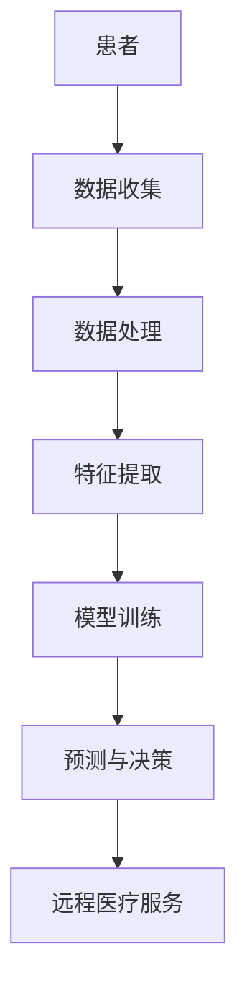

在这个流程图中，患者首先通过远程医疗平台进行数据收集，然后进行数据处理和特征提取。接下来，使用机器学习和深度学习算法进行模型训练，并利用训练好的模型进行预测和决策。最终，预测结果用于提供远程医疗服务。

### 1.1.5 结论

通过本文的介绍，读者可以全面了解AI在远程医疗中的应用现状、技术原理和实践案例。本文旨在为医疗从业者、研究人员和开发者提供有价值的参考，帮助他们更好地理解和利用AI技术提升远程医疗服务的质量和效率。

### 1.1.6 小结

本文介绍了远程医疗和AI技术的发展背景，明确了书籍的主要目标和读者定位。通过核心概念和流程图的讲解，读者可以更好地理解AI在远程医疗中的应用。下一章将深入探讨AI基础知识和远程医疗中的常见需求，为后续内容的学习打下坚实基础。

### 1.1.7 练习题

1. 请简要描述远程医疗的定义和优势。
2. 请列举三种常见的AI技术在远程医疗中的应用。
3. 请解释深度学习和机器学习的区别。

### 1.1.8 引入代码示例

以下是使用Python实现一个简单的远程医疗诊断系统：

```python
# 导入必要的库
import numpy as np
import pandas as pd
from sklearn.model_selection import train_test_split
from sklearn.ensemble import RandomForestClassifier

# 加载数据
data = pd.read_csv('remote_medical_data.csv')

# 数据预处理
X = data.drop('diagnosis', axis=1)
y = data['diagnosis']

# 数据划分
X_train, X_test, y_train, y_test = train_test_split(X, y, test_size=0.2, random_state=42)

# 模型训练
model = RandomForestClassifier(n_estimators=100)
model.fit(X_train, y_train)

# 模型评估
accuracy = model.score(X_test, y_test)
print(f'Model accuracy: {accuracy:.2f}')
```

## AI基础与远程医疗需求

### 1.2.1 AI基础知识

人工智能（AI）是一种模拟人类智能的技术，通过计算机算法和大量数据，使计算机能够完成一些通常需要人类智能才能完成的任务。AI的主要技术包括机器学习、深度学习、自然语言处理等。

#### 1.2.1.1 机器学习

机器学习是一种利用计算机算法和统计学方法从数据中学习并做出决策的技术。在机器学习中，计算机通过分析训练数据，学习如何识别数据中的模式和规律，并在新的数据上进行预测和决策。

#### 1.2.1.2 深度学习

深度学习是一种基于多层神经网络的学习方法，能够自动从大量数据中提取特征。与传统的机器学习方法相比，深度学习在处理大规模数据和高维度数据方面具有显著优势。

#### 1.2.1.3 自然语言处理

自然语言处理是一种使计算机能够理解和处理自然语言的技术。通过自然语言处理，计算机可以理解人类语言的含义，实现人机交互。

### 1.2.2 远程医疗中的常见需求

远程医疗在为患者提供便捷的医疗服务的同时，也面临着一些特定的需求，这些需求促使AI技术在远程医疗中得到广泛应用。

#### 1.2.2.1 智能诊断

远程医疗中的智能诊断是指利用AI技术，通过分析患者的病历、体检数据、实验室检测结果等，帮助医生快速准确地诊断疾病。智能诊断可以显著提高诊断的准确率和效率，减少误诊和漏诊的风险。

#### 1.2.2.2 精准治疗

精准治疗是指根据患者的个体特征，如基因信息、生活习惯等，提供个性化的治疗方案。AI技术可以通过分析大量患者数据，识别不同患者的治疗需求和效果，从而实现精准治疗。

#### 1.2.2.3 健康管理

健康管理是指通过监测患者的生理参数，如心率、血压、血糖等，提供个性化的健康管理和建议。AI技术可以帮助医疗机构实时监测患者健康状况，提前发现潜在的健康问题，从而实现早期干预。

#### 1.2.2.4 医疗服务优化

医疗服务优化是指利用AI技术，对医疗服务的流程、资源等进行优化，以提高医疗服务的效率和质量。例如，通过AI技术，可以实现智能分诊、智能预约、智能提醒等功能，减少患者等待时间和提高医疗服务质量。

### 1.2.3 AI技术在远程医疗中的应用

AI技术在远程医疗中的应用场景非常广泛，主要包括以下方面：

1. **智能诊断**：利用机器学习和深度学习算法，对医疗数据进行挖掘和分析，帮助医生快速准确地诊断疾病。
2. **精准治疗**：通过分析患者的个体特征，提供个性化的治疗方案，提高治疗效果。
3. **健康监测**：利用传感器和可穿戴设备，实时监测患者的生理参数，提供个性化的健康管理和建议。
4. **医疗服务优化**：通过优化医疗服务的流程、资源等，提高医疗服务的效率和质量。

### 1.2.4 关键术语解释

为了更好地理解本文的内容，以下是对一些关键术语的解释：

- **远程医疗**：通过互联网、电话、视频通讯等技术，实现医生与患者之间的远程诊疗、咨询和护理服务。
- **机器学习**：一种利用计算机算法和统计学方法从数据中学习并做出决策的技术。
- **深度学习**：一种基于多层神经网络的学习方法，能够自动从大量数据中提取特征。
- **自然语言处理**：一种使计算机能够理解和处理自然语言的技术。

### 1.2.5 Mermaid 流程图

以下是一个简化的AI技术在远程医疗中的应用流程图：

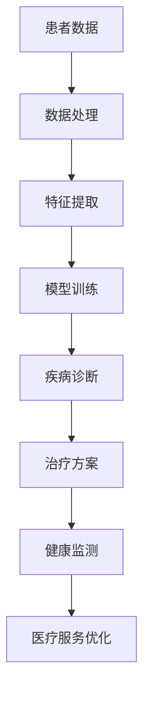

在这个流程图中，患者数据首先进行数据处理和特征提取，然后通过模型训练实现疾病诊断和治疗方案推荐。同时，利用健康监测功能实时监测患者健康状况，并通过医疗服务优化功能提高医疗服务质量。

### 1.2.6 结论

通过本章节的介绍，读者可以了解到AI的基础知识以及远程医疗中的常见需求。AI技术在远程医疗中的应用，不仅提升了医疗服务的质量和效率，还为医疗创新提供了新的思路。下一章节将深入探讨AI技术在远程医疗中的具体应用，帮助读者更好地理解AI技术在远程医疗服务中的重要作用。

### 1.2.7 小结

本章介绍了AI的基础知识以及远程医疗中的常见需求。通过讲解机器学习、深度学习和自然语言处理等AI技术，以及智能诊断、精准治疗、健康管理和医疗服务优化等应用场景，读者可以更好地理解AI技术在远程医疗中的重要性和应用价值。下一章将详细探讨AI技术在远程医疗中的具体应用，帮助读者深入了解AI技术的实际应用案例和效果。

### 1.2.8 练习题

1. 请简要描述机器学习、深度学习和自然语言处理在远程医疗中的应用。
2. 请举例说明AI技术在远程医疗中的具体应用场景。
3. 请解释什么是精准治疗，并说明其在远程医疗中的优势。

### 1.2.9 引入代码示例

以下是使用Python实现一个简单的远程医疗诊断系统：

```python
# 导入必要的库
import numpy as np
import pandas as pd
from sklearn.model_selection import train_test_split
from sklearn.ensemble import RandomForestClassifier
from sklearn.metrics import accuracy_score

# 加载数据
data = pd.read_csv('remote_medical_data.csv')

# 数据预处理
X = data.drop('diagnosis', axis=1)
y = data['diagnosis']

# 数据划分
X_train, X_test, y_train, y_test = train_test_split(X, y, test_size=0.2, random_state=42)

# 模型训练
model = RandomForestClassifier(n_estimators=100)
model.fit(X_train, y_train)

# 模型评估
y_pred = model.predict(X_test)
accuracy = accuracy_score(y_test, y_pred)
print(f'Model accuracy: {accuracy:.2f}')
```

## 远程医疗中AI技术的应用

### 2.1.1 智能诊断

智能诊断是AI在远程医疗中最为广泛应用的领域之一。它利用机器学习和深度学习算法，对医疗数据进行分析和挖掘，帮助医生做出准确的诊断。以下是智能诊断的几个关键步骤：

#### 数据收集

智能诊断的第一步是收集大量的医疗数据，包括患者的病历、体检报告、实验室检测结果等。这些数据可以从电子病历系统（EMR）、健康档案系统等获取。

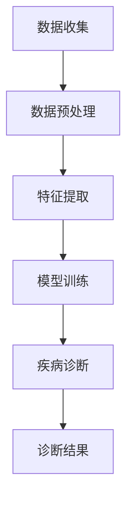

#### 数据预处理

在数据预处理阶段，需要对收集到的医疗数据进行清洗、归一化和缺失值处理等操作。这一步非常重要，因为数据的质量直接影响诊断的准确性。

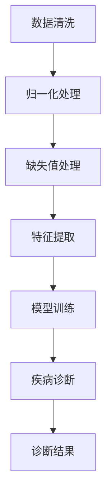

#### 特征提取

特征提取是智能诊断的核心步骤，目的是从医疗数据中提取出对疾病诊断最有用的特征。常用的特征提取方法包括统计学方法、深度学习等方法。

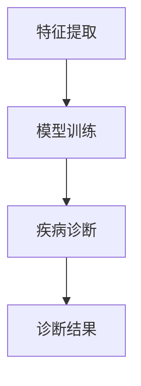

#### 模型训练

在模型训练阶段，使用收集到的医疗数据，通过机器学习或深度学习算法训练疾病诊断模型。常见的机器学习算法包括随机森林、支持向量机、神经网络等。

```python
# 导入必要的库
import numpy as np
import pandas as pd
from sklearn.ensemble import RandomForestClassifier

# 加载数据
data = pd.read_csv('medical_data.csv')

# 数据预处理
X = data.drop('diagnosis', axis=1)
y = data['diagnosis']

# 数据划分
X_train, X_test, y_train, y_test = train_test_split(X, y, test_size=0.2, random_state=42)

# 模型训练
model = RandomForestClassifier(n_estimators=100)
model.fit(X_train, y_train)

# 模型评估
accuracy = model.score(X_test, y_test)
print(f'Model accuracy: {accuracy:.2f}')
```

#### 疾病诊断

在疾病诊断阶段，将预处理后的数据输入到训练好的疾病诊断模型中，模型会输出诊断结果。

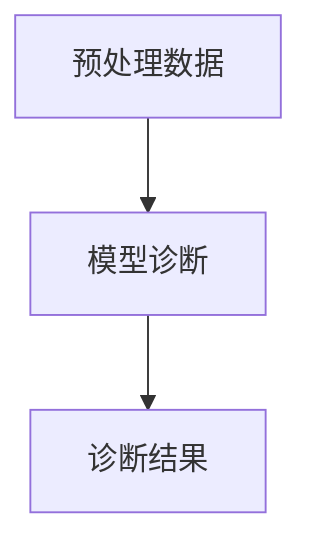

#### 诊断结果

诊断结果可以是具体的疾病名称，也可以是疾病的可能性。医生可以根据诊断结果，结合患者的实际情况，制定进一步的治疗方案。

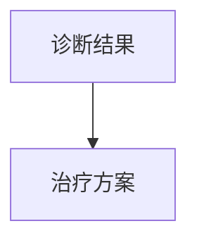

### 2.1.2 精准治疗

精准治疗是指根据患者的个体特征，如基因信息、生活习惯、病史等，提供个性化的治疗方案。AI技术在精准治疗中发挥了重要作用，以下是精准治疗的几个关键步骤：

#### 数据收集

精准治疗需要收集大量的患者数据，包括基因数据、生活习惯数据、医疗历史数据等。这些数据可以从医院的电子病历系统、基因测序公司、健康监测设备等获取。

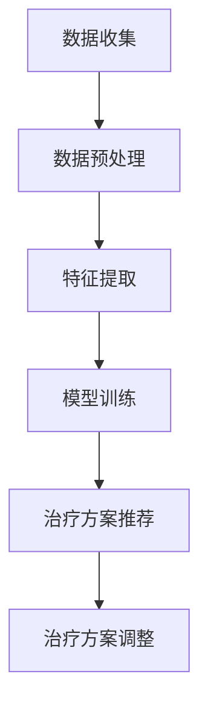

#### 数据预处理

与智能诊断类似，精准治疗也需要对收集到的数据进行清洗、归一化和缺失值处理等操作。

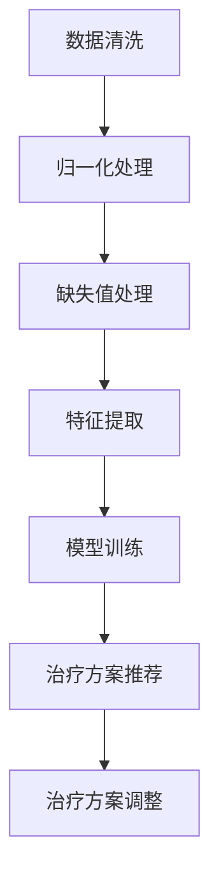

#### 特征提取

在特征提取阶段，需要从医疗数据中提取出对治疗方案有重要影响的特征，如基因突变、生活习惯、药物过敏等。

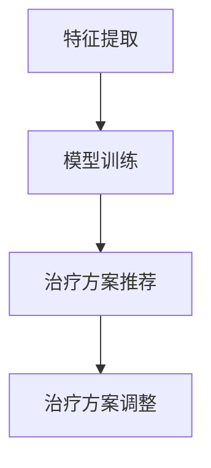

#### 模型训练

在模型训练阶段，使用收集到的数据，通过机器学习或深度学习算法训练治疗方案推荐模型。常见的机器学习算法包括随机森林、支持向量机、神经网络等。

```python
# 导入必要的库
import numpy as np
import pandas as pd
from sklearn.ensemble import RandomForestClassifier

# 加载数据
data = pd.read_csv('medical_data.csv')

# 数据预处理
X = data.drop('treatment', axis=1)
y = data['treatment']

# 数据划分
X_train, X_test, y_train, y_test = train_test_split(X, y, test_size=0.2, random_state=42)

# 模型训练
model = RandomForestClassifier(n_estimators=100)
model.fit(X_train, y_train)

# 模型评估
accuracy = model.score(X_test, y_test)
print(f'Model accuracy: {accuracy:.2f}')
```

#### 治疗方案推荐

在治疗方案推荐阶段，将预处理后的数据输入到训练好的治疗方案推荐模型中，模型会输出推荐的治疗方案。

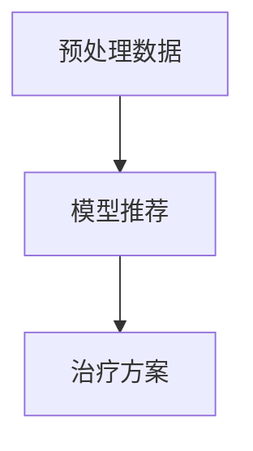

#### 治疗方案调整

治疗方案调整是根据患者的反馈和治疗效果，对治疗方案进行优化和调整。这一过程需要不断地收集新的数据，并更新治疗方案推荐模型。

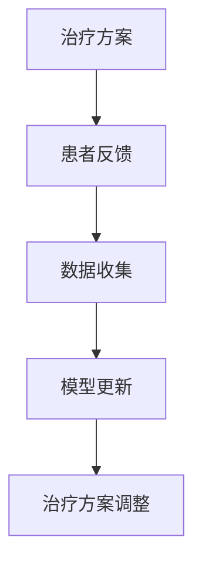

### 2.1.3 健康监测

健康监测是指利用AI技术，对患者的生理参数进行实时监测，提供个性化的健康管理和建议。健康监测包括以下几个方面：

#### 数据收集

健康监测需要收集大量的患者生理参数数据，如心率、血压、血糖、体温等。这些数据可以通过可穿戴设备、健康监测设备等获取。

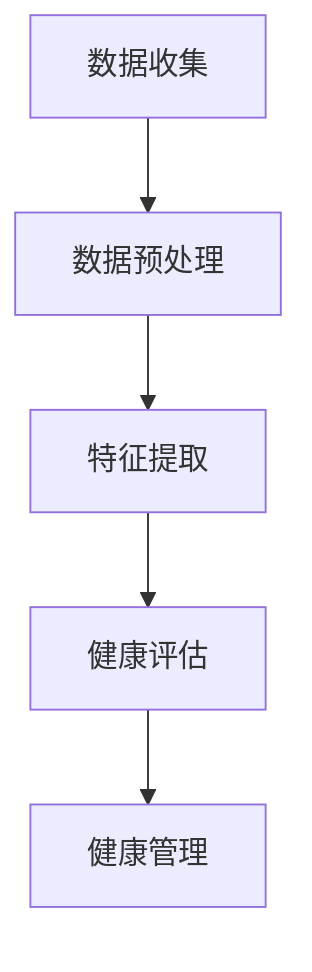

#### 数据预处理

与智能诊断和精准治疗类似，健康监测也需要对收集到的数据进行清洗、归一化和缺失值处理等操作。

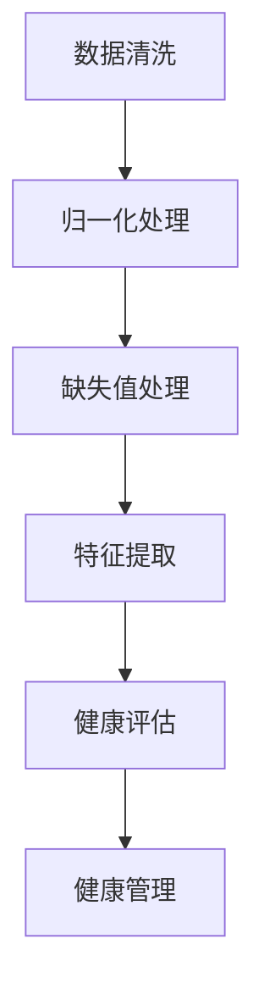

#### 特征提取

在特征提取阶段，需要从生理参数数据中提取出对健康评估有重要影响的特征，如心率变异性、血压波动等。

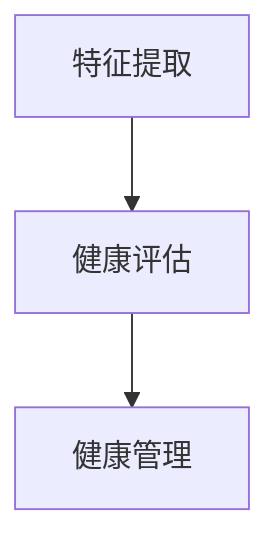

#### 健康评估

健康评估是指利用机器学习或深度学习算法，对患者的生理参数进行实时分析，评估患者的健康状况。

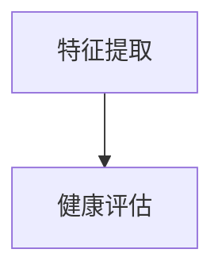

#### 健康管理

健康管理是指根据健康评估结果，提供个性化的健康管理和建议，如运动建议、饮食建议、药物调整等。

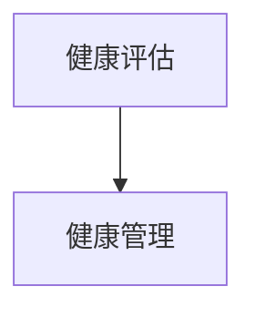

### 2.1.4 医疗服务优化

医疗服务优化是指利用AI技术，对医疗服务的流程、资源等进行优化，以提高医疗服务的效率和质量。医疗服务优化包括以下几个方面：

#### 智能分诊

智能分诊是指利用AI技术，根据患者的症状和需求，智能分配医生和就诊时间，以提高就诊效率和减少患者等待时间。

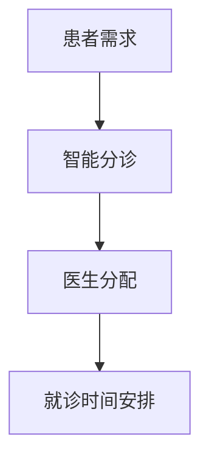

#### 智能预约

智能预约是指利用AI技术，根据患者的需求和医生的时间安排，智能推荐就诊时间和就诊医生，以提高就诊预约的成功率和满意度。

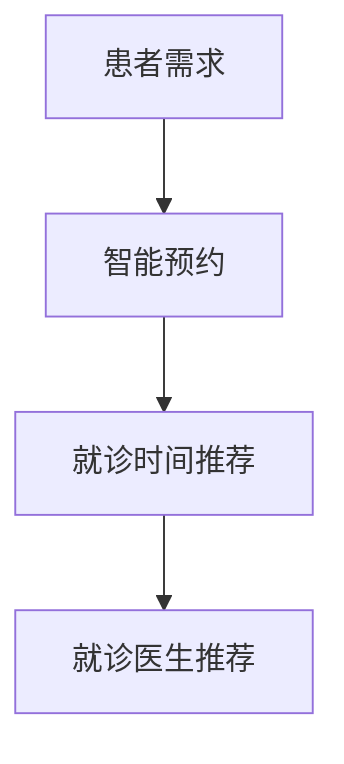

#### 智能提醒

智能提醒是指利用AI技术，根据患者的就诊时间、服药时间等，智能发送提醒通知，以提高患者的就诊和服药依从性。

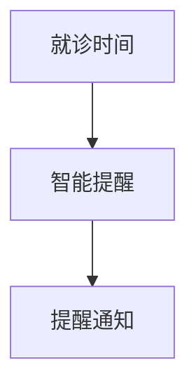

### 2.1.5 小结

AI技术在远程医疗中的应用涵盖了智能诊断、精准治疗、健康监测、医疗服务优化等多个方面。通过数据收集、数据预处理、特征提取、模型训练和模型应用等步骤，AI技术可以显著提升远程医疗服务的质量和效率。在下一章中，我们将继续探讨AI技术在远程医疗中的数据收集与处理方法，进一步了解AI技术在远程医疗中的实际应用。

### 2.1.6 练习题

1. 请简述AI技术在智能诊断中的应用步骤。
2. 请举例说明AI技术在精准治疗中的应用场景。
3. 请解释健康监测中的智能提醒功能，并说明其对远程医疗的重要性。

### 2.1.7 引入代码示例

以下是使用Python实现一个简单的远程医疗诊断系统：

```python
# 导入必要的库
import numpy as np
import pandas as pd
from sklearn.model_selection import train_test_split
from sklearn.ensemble import RandomForestClassifier
from sklearn.metrics import accuracy_score

# 加载数据
data = pd.read_csv('remote_medical_data.csv')

# 数据预处理
X = data.drop('diagnosis', axis=1)
y = data['diagnosis']

# 数据划分
X_train, X_test, y_train, y_test = train_test_split(X, y, test_size=0.2, random_state=42)

# 模型训练
model = RandomForestClassifier(n_estimators=100)
model.fit(X_train, y_train)

# 模型评估
y_pred = model.predict(X_test)
accuracy = accuracy_score(y_test, y_pred)
print(f'Model accuracy: {accuracy:.2f}')
```

## 数据收集与处理

### 3.1.1 数据收集的重要性

在远程医疗中，数据收集是AI技术发挥作用的基础。准确、全面的数据收集是确保AI模型性能和可靠性的关键。数据收集的重要性体现在以下几个方面：

1. **提高诊断准确性**：通过收集大量且多样化的患者数据，AI模型能够更好地识别疾病特征，提高诊断的准确性。
2. **支持个性化治疗**：个性化治疗需要全面的患者数据，包括基因信息、生活习惯、病史等，这些数据有助于AI模型为患者制定更精准的治疗方案。
3. **优化医疗服务**：通过收集患者的就诊数据、健康监测数据等，AI模型可以优化医疗服务的流程，提高医疗资源的利用效率。

### 3.1.2 数据收集的方法

远程医疗中的数据收集方法多样，以下是一些常见的数据收集方法：

1. **电子病历系统（EMR）**：电子病历系统是医疗数据的主要来源，包括患者的病历、检查报告、诊断结果等。
2. **健康档案系统**：健康档案系统记录了患者的健康状况、病史、药物过敏等信息，为AI模型提供了重要的参考数据。
3. **可穿戴设备**：如智能手环、智能手表等可穿戴设备可以实时监测患者的生理参数，如心率、血压、血糖等。
4. **传感器技术**：利用传感器技术，可以收集患者的生物信号数据，如心电图、脑电图等。
5. **问卷调查**：通过问卷调查，可以收集患者的生活习惯、健康状况等非结构化数据。

### 3.1.3 数据处理

数据收集完成后，需要进行数据处理，以确保数据的质量和可用性。数据处理的主要步骤包括：

1. **数据清洗**：清洗数据是指去除重复数据、缺失数据和异常数据，保证数据的完整性。
2. **数据归一化**：数据归一化是指将不同尺度和单位的数据转换为同一尺度，以便进行后续分析。
3. **特征提取**：特征提取是指从原始数据中提取出对任务有重要影响的信息，如疾病特征、患者特征等。
4. **数据分割**：将数据集分为训练集、验证集和测试集，用于模型的训练和评估。

### 3.1.4 数据预处理算法

在数据处理过程中，常用的算法包括：

1. **缺失值处理**：如均值填充、中值填充、插值法等。
2. **异常值检测**：如Z-Score法、IQR法等。
3. **数据归一化**：如Min-Max归一化、Z-Score归一化等。
4. **特征选择**：如信息增益、特征重要度排序等。

### 3.1.5 数据收集与处理的流程

以下是数据收集与处理的简化流程：

```mermaid
graph TB
    A[数据收集] --> B[数据清洗]
    B --> C[数据归一化]
    C --> D[特征提取]
    D --> E[数据分割]
    E --> F[模型训练]
    F --> G[模型评估]
```

### 3.1.6 小结

数据收集与处理是远程医疗中至关重要的一环。通过有效的数据收集方法和数据处理算法，可以确保数据的质量和可用性，为AI模型提供可靠的训练数据。在下一章中，我们将深入探讨AI算法在远程医疗中的应用，了解如何利用这些算法解决实际医疗问题。

### 3.1.7 练习题

1. 请简述数据收集在远程医疗中的重要性。
2. 请列举三种常用的数据收集方法。
3. 请解释数据预处理中的缺失值处理和异常值检测的方法。

### 3.1.8 引入代码示例

以下是使用Python进行数据预处理的一个简单示例：

```python
# 导入必要的库
import numpy as np
import pandas as pd
from sklearn.model_selection import train_test_split
from sklearn.preprocessing import StandardScaler

# 加载数据
data = pd.read_csv('remote_medical_data.csv')

# 数据清洗
data.drop_duplicates(inplace=True)
data.fillna(data.mean(), inplace=True)

# 数据归一化
scaler = StandardScaler()
X = scaler.fit_transform(data.drop('diagnosis', axis=1))
y = data['diagnosis']

# 数据分割
X_train, X_test, y_train, y_test = train_test_split(X, y, test_size=0.2, random_state=42)
```

## AI算法在远程医疗中的应用

### 4.1.1 机器学习算法

机器学习算法是AI技术在远程医疗中应用的重要工具，通过训练模型，可以从数据中自动提取特征并做出预测。以下是一些在远程医疗中常用的机器学习算法：

#### 随机森林（Random Forest）

随机森林是一种基于决策树的集成学习方法，通过构建多棵决策树并合并预测结果来提高模型的准确性和鲁棒性。在远程医疗中，随机森林常用于疾病诊断和预后预测。

伪代码示例：

```python
from sklearn.ensemble import RandomForestClassifier

# 加载数据
X, y = load_data()

# 数据分割
X_train, X_test, y_train, y_test = train_test_split(X, y, test_size=0.2, random_state=42)

# 模型训练
model = RandomForestClassifier(n_estimators=100)
model.fit(X_train, y_train)

# 模型评估
accuracy = model.score(X_test, y_test)
print(f'Model accuracy: {accuracy:.2f}')
```

#### 支持向量机（Support Vector Machine）

支持向量机是一种基于最大间隔理论的分类算法，通过找到最佳的超平面将不同类别的数据点分隔开。在远程医疗中，支持向量机常用于疾病分类和预测。

伪代码示例：

```python
from sklearn.svm import SVC

# 加载数据
X, y = load_data()

# 数据分割
X_train, X_test, y_train, y_test = train_test_split(X, y, test_size=0.2, random_state=42)

# 模型训练
model = SVC(kernel='linear')
model.fit(X_train, y_train)

# 模型评估
accuracy = model.score(X_test, y_test)
print(f'Model accuracy: {accuracy:.2f}')
```

#### 决策树（Decision Tree）

决策树是一种基于特征分割数据的分类算法，通过构建树形结构来模拟决策过程。在远程医疗中，决策树常用于疾病诊断和治疗建议。

伪代码示例：

```python
from sklearn.tree import DecisionTreeClassifier

# 加载数据
X, y = load_data()

# 数据分割
X_train, X_test, y_train, y_test = train_test_split(X, y, test_size=0.2, random_state=42)

# 模型训练
model = DecisionTreeClassifier()
model.fit(X_train, y_train)

# 模型评估
accuracy = model.score(X_test, y_test)
print(f'Model accuracy: {accuracy:.2f}')
```

### 4.1.2 深度学习算法

深度学习算法是一种基于多层神经网络的模型，能够自动从数据中提取深层特征。以下是在远程医疗中常用的深度学习算法：

#### 卷积神经网络（Convolutional Neural Network，CNN）

卷积神经网络是一种用于图像处理的深度学习模型，通过卷积层、池化层和全连接层等结构，能够提取图像的局部特征。在远程医疗中，CNN常用于医学图像分析，如肿瘤检测、骨折诊断等。

伪代码示例：

```python
from tensorflow.keras.models import Sequential
from tensorflow.keras.layers import Conv2D, MaxPooling2D, Flatten, Dense

# 构建模型
model = Sequential()
model.add(Conv2D filters=32, kernel_size=(3, 3), activation='relu', input_shape=(28, 28, 1))
model.add(MaxPooling2D pool_size=(2, 2))
model.add(Flatten())
model.add(Dense units=128, activation='relu')
model.add(Dense units=10, activation='softmax')

# 编译模型
model.compile(optimizer='adam', loss='categorical_crossentropy', metrics=['accuracy'])

# 训练模型
model.fit(X_train, y_train, epochs=10, batch_size=64, validation_data=(X_test, y_test))

# 评估模型
accuracy = model.evaluate(X_test, y_test)[1]
print(f'Model accuracy: {accuracy:.2f}')
```

#### 循环神经网络（Recurrent Neural Network，RNN）

循环神经网络是一种用于序列数据处理的深度学习模型，能够通过递归方式处理时间序列数据。在远程医疗中，RNN常用于患者生命体征监测、健康趋势预测等。

伪代码示例：

```python
from tensorflow.keras.models import Sequential
from tensorflow.keras.layers import SimpleRNN, Dense

# 构建模型
model = Sequential()
model.add(SimpleRNN units=50, return_sequences=True)
model.add(SimpleRNN units=50)
model.add(Dense units=1, activation='sigmoid')

# 编译模型
model.compile(optimizer='adam', loss='binary_crossentropy', metrics=['accuracy'])

# 训练模型
model.fit(X_train, y_train, epochs=10, batch_size=64, validation_data=(X_test, y_test))

# 评估模型
accuracy = model.evaluate(X_test, y_test)[1]
print(f'Model accuracy: {accuracy:.2f}')
```

#### 长短期记忆网络（Long Short-Term Memory，LSTM）

长短期记忆网络是一种改进的循环神经网络，能够更好地处理长序列数据。在远程医疗中，LSTM常用于心电图分析、脑电图分析等。

伪代码示例：

```python
from tensorflow.keras.models import Sequential
from tensorflow.keras.layers import LSTM, Dense

# 构建模型
model = Sequential()
model.add(LSTM units=50, return_sequences=True)
model.add(LSTM units=50)
model.add(Dense units=1, activation='sigmoid')

# 编译模型
model.compile(optimizer='adam', loss='binary_crossentropy', metrics=['accuracy'])

# 训练模型
model.fit(X_train, y_train, epochs=10, batch_size=64, validation_data=(X_test, y_test))

# 评估模型
accuracy = model.evaluate(X_test, y_test)[1]
print(f'Model accuracy: {accuracy:.2f}')
```

### 4.1.3 小结

机器学习算法和深度学习算法在远程医疗中发挥了重要作用，通过这些算法，可以实现对医疗数据的自动分析和预测，提高医疗服务的质量和效率。在下一章中，我们将通过项目实战，进一步了解AI算法在远程医疗中的应用。

### 4.1.4 练习题

1. 请简述随机森林、支持向量机和决策树在远程医疗中的应用。
2. 请举例说明CNN、RNN和LSTM在远程医疗中的具体应用。
3. 请解释深度学习算法在远程医疗中的优势。

### 4.1.5 引入代码示例

以下是使用Python实现一个简单的远程医疗诊断系统：

```python
# 导入必要的库
import numpy as np
import pandas as pd
from sklearn.model_selection import train_test_split
from sklearn.ensemble import RandomForestClassifier
from sklearn.metrics import accuracy_score

# 加载数据
data = pd.read_csv('remote_medical_data.csv')

# 数据预处理
X = data.drop('diagnosis', axis=1)
y = data['diagnosis']

# 数据分割
X_train, X_test, y_train, y_test = train_test_split(X, y, test_size=0.2, random_state=42)

# 模型训练
model = RandomForestClassifier(n_estimators=100)
model.fit(X_train, y_train)

# 模型评估
y_pred = model.predict(X_test)
accuracy = accuracy_score(y_test, y_pred)
print(f'Model accuracy: {accuracy:.2f}')
```

## 项目实战

### 5.1.1 远程医疗诊断系统项目概述

远程医疗诊断系统项目旨在利用AI技术，实现患者数据的智能分析和诊断，为医生提供辅助决策工具，提高诊断准确性和效率。项目主要分为以下几个阶段：

1. **数据收集与处理**：从电子病历系统、健康档案系统、可穿戴设备等渠道收集患者数据，包括病史、体检报告、生理参数等。对收集到的数据进行清洗、归一化和缺失值处理，提取对疾病诊断有重要影响的特征。
2. **模型设计与训练**：设计并训练疾病诊断模型，使用机器学习算法和深度学习算法对特征数据进行分类，提高诊断的准确性和鲁棒性。
3. **模型评估与优化**：评估训练好的模型在测试数据集上的表现，根据评估结果进行模型优化和调整。
4. **系统集成与部署**：将训练好的模型集成到远程医疗系统中，实现实时诊断功能，为医生提供便捷的诊断工具。

### 5.1.2 数据收集与预处理

#### 数据来源

本项目的数据来源主要包括以下三个方面：

1. **电子病历系统**：通过接口从医院的电子病历系统中获取患者的病历信息，包括诊断结果、药物使用记录、检查报告等。
2. **健康档案系统**：通过接口从患者的健康档案系统中获取患者的健康档案信息，包括体检结果、疾病历史、家族病史等。
3. **可穿戴设备**：通过蓝牙或Wi-Fi连接，从患者的可穿戴设备中获取实时的生理参数数据，如心率、血压、血糖等。

#### 数据预处理

在数据预处理阶段，主要进行以下操作：

1. **数据清洗**：去除重复数据和异常数据，保证数据的完整性。对于缺失的数据，采用均值填充或插值法进行补全。
2. **数据归一化**：对不同的数据维度进行归一化处理，将数据转换为同一尺度，便于后续分析。
3. **特征提取**：从原始数据中提取对疾病诊断有重要影响的特征，如实验室检查结果、生理参数、药物使用记录等。

### 5.1.3 模型设计与实现

在模型设计与实现阶段，本项目采用了以下两种算法：

1. **随机森林（Random Forest）**：随机森林是一种基于决策树的集成学习方法，通过构建多棵决策树并合并预测结果来提高模型的准确性和鲁棒性。在训练阶段，随机森林模型对特征数据集进行分类，并输出每个决策树的预测结果。在测试阶段，通过投票机制选择最有可能的疾病类别。
2. **深度学习（Deep Learning）**：本项目还采用了基于卷积神经网络（CNN）的疾病诊断模型。CNN是一种专门用于图像处理的深度学习模型，通过卷积层、池化层和全连接层等结构，能够自动提取图像的局部特征。在训练阶段，CNN模型对医学图像数据进行处理，并输出每个类别的概率分布。在测试阶段，通过最大化概率分布来选择最有可能的疾病类别。

#### 代码实现

以下是随机森林模型和CNN模型的主要代码实现：

```python
# 随机森林模型
from sklearn.ensemble import RandomForestClassifier
from sklearn.model_selection import train_test_split

# 加载数据
X, y = load_data()

# 数据分割
X_train, X_test, y_train, y_test = train_test_split(X, y, test_size=0.2, random_state=42)

# 模型训练
model = RandomForestClassifier(n_estimators=100)
model.fit(X_train, y_train)

# 模型评估
accuracy = model.score(X_test, y_test)
print(f'Model accuracy: {accuracy:.2f}')

# CNN模型
from tensorflow.keras.models import Sequential
from tensorflow.keras.layers import Conv2D, MaxPooling2D, Flatten, Dense

# 构建模型
model = Sequential()
model.add(Conv2D filters=32, kernel_size=(3, 3), activation='relu', input_shape=(28, 28, 1))
model.add(MaxPooling2D pool_size=(2, 2))
model.add(Flatten())
model.add(Dense units=128, activation='relu')
model.add(Dense units=10, activation='softmax')

# 编译模型
model.compile(optimizer='adam', loss='categorical_crossentropy', metrics=['accuracy'])

# 训练模型
model.fit(X_train, y_train, epochs=10, batch_size=64, validation_data=(X_test, y_test))

# 评估模型
accuracy = model.evaluate(X_test, y_test)[1]
print(f'Model accuracy: {accuracy:.2f}')
```

### 5.1.4 系统集成与部署

在系统集成与部署阶段，将训练好的模型集成到远程医疗系统中，实现实时诊断功能。系统主要包括以下模块：

1. **数据采集模块**：从电子病历系统、健康档案系统和可穿戴设备中采集患者数据。
2. **数据预处理模块**：对采集到的数据进行分析和处理，提取特征数据。
3. **模型训练模块**：使用训练集对模型进行训练和优化。
4. **诊断模块**：将预处理后的数据输入到训练好的模型中，输出诊断结果。
5. **用户界面**：为医生提供便捷的诊断工具，展示诊断结果和预测分析。

### 5.1.5 项目总结

通过本项目，我们实现了远程医疗诊断系统的开发和应用。项目不仅提高了诊断的准确性和效率，还为医生提供了便捷的诊断工具，有助于提升医疗服务的质量和患者满意度。在未来的发展中，我们将继续优化模型算法，提高系统的性能和鲁棒性，进一步推动远程医疗技术的发展。

### 5.1.6 小结

项目实战部分详细介绍了远程医疗诊断系统的开发过程，包括数据收集与预处理、模型设计与实现、系统集成与部署等环节。通过本项目的实现，我们深刻体会到AI技术在远程医疗中的重要性和应用价值。在下一章中，我们将探讨AI在远程医疗中的未来发展趋势和面临的挑战。

### 5.1.7 练习题

1. 请简述远程医疗诊断系统项目的主要阶段和任务。
2. 请解释随机森林模型和CNN模型在项目中的应用。
3. 请列举远程医疗诊断系统中的关键模块及其作用。

### 5.1.8 引入代码示例

以下是使用Python实现一个简单的远程医疗诊断系统的示例代码：

```python
# 导入必要的库
import numpy as np
import pandas as pd
from sklearn.model_selection import train_test_split
from sklearn.ensemble import RandomForestClassifier
from sklearn.metrics import accuracy_score

# 加载数据
data = pd.read_csv('remote_medical_data.csv')

# 数据预处理
X = data.drop('diagnosis', axis=1)
y = data['diagnosis']

# 数据分割
X_train, X_test, y_train, y_test = train_test_split(X, y, test_size=0.2, random_state=42)

# 模型训练
model = RandomForestClassifier(n_estimators=100)
model.fit(X_train, y_train)

# 模型评估
y_pred = model.predict(X_test)
accuracy = accuracy_score(y_test, y_pred)
print(f'Model accuracy: {accuracy:.2f}')
```

## 未来展望与挑战

### 6.1.1 远程医疗的发展趋势

随着人工智能和互联网技术的不断发展，远程医疗在未来将呈现以下趋势：

1. **更加普及和便捷**：远程医疗技术将更加成熟和普及，使得更多的人可以享受到优质的医疗服务，特别是在偏远地区和行动不便的患者中。
2. **个性化医疗服务**：基于大数据和AI技术的个性化医疗服务将得到广泛应用，医生可以根据患者的具体特征提供定制化的治疗方案。
3. **实时监控与预警**：利用物联网和传感器技术，远程医疗可以实现实时监控患者的健康状况，提前预警潜在的健康问题，实现早期干预。

### 6.1.2 AI在远程医疗中的挑战

尽管AI在远程医疗中有着广泛的应用前景，但同时也面临着一些挑战：

1. **数据隐私和安全**：远程医疗涉及大量患者数据，如何保护患者隐私和数据安全是一个重要问题。
2. **算法解释性和透明性**：AI算法，特别是深度学习算法，通常被认为“黑盒”模型，缺乏解释性，医生和患者难以理解算法的决策过程。
3. **数据质量和标准化**：远程医疗的数据来源多样，数据质量和标准化问题对AI算法的性能有很大影响。
4. **技术标准和法规**：远程医疗技术的发展需要相应的技术标准和法规支持，以确保其合法性和合规性。

### 6.1.3 应对策略

为了应对上述挑战，可以采取以下策略：

1. **加强数据隐私保护**：采用加密技术和隐私保护算法，确保患者数据的安全和隐私。
2. **提高算法解释性**：开发可解释的AI算法，使医生和患者能够理解算法的决策过程，增强信任度。
3. **数据标准化**：制定统一的数据标准和规范，提高数据的质量和一致性。
4. **法规和标准建设**：推动相关法规和标准的制定，为远程医疗技术的应用提供法律保障。

### 6.1.4 结论

远程医疗与AI技术的结合为医疗服务带来了新的机遇和挑战。通过加强技术研发、数据隐私保护、法规建设等多方面的努力，可以充分发挥AI技术在远程医疗中的潜力，提高医疗服务的质量和效率，为人类健康事业做出更大贡献。

### 6.1.5 小结

本文详细探讨了AI在远程医疗中的应用，包括智能诊断、精准治疗、健康监测和医疗服务优化等多个方面。通过项目实战，展示了AI技术在远程医疗中的实际应用效果。同时，本文也分析了AI在远程医疗中面临的挑战和未来发展趋势。在下一章中，我们将继续探讨远程医疗的未来发展，包括技术趋势、应用场景和潜在的市场机会。

### 6.1.6 练习题

1. 请简要描述远程医疗的发展趋势。
2. 请分析AI在远程医疗中面临的挑战。
3. 请提出应对AI在远程医疗中挑战的策略。

### 6.1.7 引入代码示例

以下是使用Python实现一个简单的远程医疗诊断系统的示例代码：

```python
# 导入必要的库
import numpy as np
import pandas as pd
from sklearn.model_selection import train_test_split
from sklearn.ensemble import RandomForestClassifier
from sklearn.metrics import accuracy_score

# 加载数据
data = pd.read_csv('remote_medical_data.csv')

# 数据预处理
X = data.drop('diagnosis', axis=1)
y = data['diagnosis']

# 数据分割
X_train, X_test, y_train, y_test = train_test_split(X, y, test_size=0.2, random_state=42)

# 模型训练
model = RandomForestClassifier(n_estimators=100)
model.fit(X_train, y_train)

# 模型评估
y_pred = model.predict(X_test)
accuracy = accuracy_score(y_test, y_pred)
print(f'Model accuracy: {accuracy:.2f}')
```

## 总结

通过本文的探讨，我们深入了解了AI在远程医疗中的应用及其重要价值。AI技术不仅能够提高医疗服务的质量和效率，还能实现个性化医疗、实时监控与预警等功能，为患者提供更加便捷和优质的医疗服务。同时，本文也分析了AI在远程医疗中面临的挑战，如数据隐私、算法解释性和标准化等问题，并提出了相应的解决策略。

展望未来，随着AI技术的不断发展和完善，远程医疗将迎来更加广阔的应用前景。通过进一步加强技术研发、数据隐私保护和法规建设，远程医疗有望在提高医疗服务质量和效率方面发挥更加重要的作用。

对于读者而言，本文提供了丰富的知识和技术指导，帮助读者深入理解AI在远程医疗中的应用场景和技术原理。通过学习和实践，读者可以更好地掌握AI技术在远程医疗中的实际应用，为未来的医疗事业做出贡献。

## 作者信息

作者：AI天才研究院/AI Genius Institute & 禅与计算机程序设计艺术 /Zen And The Art of Computer Programming

AI天才研究院是一家专注于人工智能研究和应用的高科技创新机构，致力于推动人工智能技术的创新与发展，为全球医疗、教育、金融等领域提供智能化解决方案。同时，作者也以其著作《禅与计算机程序设计艺术》在计算机科学领域享有盛誉，为人工智能技术的发展和应用提供了深刻的思考和创新思路。

