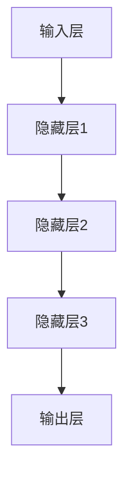

                 


### 引言与概述

在当今的人工智能领域，AI大模型的崛起无疑是一场技术革命。大模型，也称为大型预训练模型，指的是那些训练数据规模巨大、参数数量惊人的神经网络模型。这些模型能够在多种任务中表现出色，从自然语言处理到图像识别，再到机器翻译，都展现出了惊人的性能。而在这个体系中，提示词（Prompt）成为了大模型编程的关键要素，其威力与潜力不容小觑。

## 文章标题：AI大模型编程：提示词的威力与潜力

本文旨在探讨AI大模型编程的核心要素——提示词，分析其作用机制、应用技巧以及未来潜力。文章将分为四个主要部分：引言与概述、基础理论、编程实践、拓展与前沿。

### 关键词

- AI大模型
- 提示词
- 编程
- 深度学习
- 神经网络
- 提示词优化

### 摘要

本文首先介绍了AI大模型的基本概念和提示词的定义及其在AI大模型编程中的作用。接着，深入探讨了AI大模型的架构、深度学习基础和提示词优化的算法原理。通过实际项目实战，详细展示了AI大模型编程的开发过程和提示词的应用技巧。最后，展望了AI大模型编程的前沿技术和发展趋势。

### 目录

- 引言与概述
  - AI大模型编程基础
  - AI大模型架构解读
  - 提示词的威力与潜力
- 编程语言与环境搭建
  - 编程语言选择
  - 环境搭建
- 核心算法原理讲解
  - 神经网络原理
  - 深度学习框架
  - 提示词优化算法
- 数学模型与公式解析
  - 线性代数基础
  - 概率论与信息论
  - 数学公式与推导
- 编程实践
  - 项目实战一：图像识别
  - 项目实战二：自然语言处理
- 拓展与前沿
  - 元学习
  - 自适应学习
  - 模型压缩

### 第一部分 引言与概述

#### AI大模型编程基础

AI大模型，顾名思义，是指那些拥有海量参数和大量训练数据的神经网络模型。这些模型通过大量的数据学习和模拟人类的思维方式，能够在各种复杂任务上展现出卓越的性能。AI大模型编程的核心目标是通过高效的算法和优化技巧，使这些模型能够更好地适应各种实际应用场景。

提示词（Prompt）在这一过程中扮演着至关重要的角色。提示词是指提供给AI大模型的一组输入，用以引导模型生成预期输出。在自然语言处理领域，提示词通常是一段文本，用于引导模型理解任务的目标。在图像识别领域，提示词可能是一组关键词或标签，用于帮助模型识别图像内容。

#### AI大模型架构解读

AI大模型的架构通常由多层神经网络组成，每一层都能够对输入数据进行特征提取和转换。这些神经网络通过大量的参数和连接，模拟出复杂的非线性关系，从而能够在海量数据中学习到有效的特征表示。

以下是AI大模型的基本架构：

1. **输入层**：接收外部输入，如文本、图像或音频。
2. **隐藏层**：通过多层神经网络进行特征提取和转换。
3. **输出层**：生成模型预测结果。

为了更好地理解AI大模型的架构，我们可以使用Mermaid流程图进行展示：



#### 提示词的威力与潜力

提示词在AI大模型中的作用不可小觑。通过精心设计的提示词，我们可以引导模型更好地理解任务目标，从而提高模型的性能。例如，在自然语言处理任务中，正确的提示词可以帮助模型更好地理解文本内容，从而生成更准确的回答。

提示词的潜力在于其能够为AI大模型带来以下几方面的提升：

1. **模型适应性**：通过调整提示词，可以使得模型适应不同的任务场景。
2. **性能提升**：合理的提示词设计可以提高模型的性能，减少对训练数据的依赖。
3. **可解释性**：通过提示词，可以使得模型的决策过程更加透明，便于调试和优化。

总的来说，AI大模型编程中的提示词不仅是一种输入，更是提高模型性能的关键因素。在接下来的章节中，我们将深入探讨AI大模型编程的基础理论、编程实践以及前沿技术，以期为广大开发者提供全面的指导。让我们一步一步地深入这个充满挑战和机遇的领域。 

### 第二部分 编程语言与环境搭建

在AI大模型编程中，选择合适的编程语言和搭建良好的开发环境是至关重要的。这不仅影响着程序的运行效率，也决定了开发者能否顺利地实现项目目标。在本节中，我们将详细探讨编程语言的选择、环境搭建以及常用库和框架的安装。

#### 编程语言选择

在AI大模型编程中，Python是首选的编程语言。Python因其简洁、易读的语法和强大的库支持，成为了AI领域的首选语言。Python拥有丰富的科学计算库和深度学习框架，如NumPy、SciPy、Pandas以及TensorFlow和PyTorch等，这些库和框架极大地简化了AI大模型编程的复杂性。

除了Python，其他常用的编程语言如Java、C++和R等也在AI领域有广泛应用。Java具有高性能和跨平台的优势，特别是在需要大规模分布式计算时表现尤为出色。C++则以其高效的执行速度和强大的计算能力在性能敏感的AI任务中占据一席之地。R语言则在统计分析领域具有独特的优势，尤其在数据分析和可视化方面表现出色。

#### 环境搭建

搭建一个高效的开发环境是AI大模型编程的基石。以下是在Python环境中搭建AI大模型编程开发环境的基本步骤：

1. **操作系统选择**：推荐使用Linux操作系统，如Ubuntu，因其稳定的性能和丰富的库支持。Windows和macOS也可以作为替代选择。
2. **Python版本安装**：下载并安装Python 3.x版本，推荐使用Miniconda或Anaconda发行版，这些发行版提供了方便的包管理和环境配置。
3. **环境配置**：通过Miniconda或Anaconda创建一个新的虚拟环境，这样可以避免不同项目之间的库版本冲突。
   ```bash
   conda create -n myenv python=3.8
   conda activate myenv
   ```
4. **常用库和框架安装**：在虚拟环境中安装TensorFlow、PyTorch等常用库和框架。
   ```bash
   conda install tensorflow
   conda install pytorch torchvision torchaudio -c pytorch
   ```

#### 常用库和框架

在AI大模型编程中，常用的库和框架极大地简化了开发过程。以下是一些常用的库和框架：

1. **NumPy**：提供高性能的数组对象和数学函数，是科学计算的基础库。
2. **SciPy**：建立在NumPy之上的科学计算库，提供优化、积分、线性代数等功能。
3. **Pandas**：提供数据结构和数据分析工具，适合处理结构化数据。
4. **TensorFlow**：Google开发的开源深度学习框架，适用于各种AI任务。
5. **PyTorch**：Facebook开发的深度学习框架，以其动态计算图和易用性著称。

通过合理选择编程语言和搭建开发环境，开发者可以更好地进行AI大模型编程。在接下来的章节中，我们将深入探讨AI大模型编程的核心算法原理，为读者提供更深入的认知。 

### 第三部分 核心算法原理讲解

在深入AI大模型编程之前，理解核心算法原理是至关重要的。本部分将详细讲解神经网络原理、深度学习框架以及提示词优化算法。这些核心算法是构建高效AI大模型的基础。

#### 神经网络原理

神经网络（Neural Networks）是模仿生物神经系统的计算模型，由大量简单的处理单元（神经元）连接而成。每个神经元接收输入信号，通过权重进行加权求和，最后通过激活函数输出结果。

1. **神经元与神经网络**
   - **神经元**：是神经网络的基本单元，每个神经元包含输入、权重、偏置和输出。
   - **神经网络**：由多个神经元层组成，包括输入层、隐藏层和输出层。各层神经元通过加权连接形成复杂的网络结构。

2. **前向传播与反向传播**
   - **前向传播**：输入数据通过网络的各层传递，最终输出预测结果。
   - **反向传播**：根据预测结果与实际结果的差异，反向更新网络参数（权重和偏置），以最小化损失函数。

3. **激活函数与损失函数**
   - **激活函数**：用于引入非线性特性，常见的激活函数有Sigmoid、ReLU和Tanh。
   - **损失函数**：用于衡量预测结果与实际结果之间的误差，常见的损失函数有均方误差（MSE）和交叉熵（Cross-Entropy）。

#### 深度学习框架

深度学习框架是用于构建和训练深度神经网络的软件库，提供了高效的计算图和优化算法。常见的深度学习框架有TensorFlow和PyTorch。

1. **TensorFlow**
   - **简介**：由Google开发的开源深度学习框架，具有高度可扩展性和灵活的模型构建能力。
   - **TensorFlow的特点**：动态计算图、广泛的库支持、分布式训练能力。

2. **PyTorch**
   - **简介**：由Facebook开发的开源深度学习框架，以其动态计算图和易用性著称。
   - **PyTorch的特点**：动态计算图、简洁的API、强大的数据处理能力。

#### 提示词优化算法

提示词优化（Prompt Tuning）是AI大模型编程中的一种关键技术，用于提高模型在特定任务上的性能。提示词优化算法通过调整提示词的生成策略，使得模型能够更好地理解任务目标。

1. **生成式方法**
   - **简介**：通过生成提示词来优化模型性能。
   - **方法**：使用生成对抗网络（GAN）或自动编码器（Autoencoder）生成提示词。

2. **对抗性方法**
   - **简介**：通过对抗性训练来优化提示词。
   - **方法**：在训练过程中，生成器与判别器相互对抗，以提高生成提示词的质量。

3. **混合方法**
   - **简介**：结合生成式方法和对抗性方法，以实现更好的提示词优化效果。
   - **方法**：例如，使用GAN生成提示词，然后通过对抗性训练进一步优化。

#### 伪代码实现

为了更好地理解核心算法原理，我们可以通过伪代码来阐述神经网络训练过程：

```python
# 伪代码：神经网络训练过程

# 初始化神经网络参数（权重和偏置）
initialize_weights()

# 前向传播
def forward_propagation(inputs):
    # 计算输入层的输出
    output = activate(sum(inputs * weights + bias))
    return output

# 反向传播
def backward_propagation(output, actual):
    # 计算损失函数
    loss = calculate_loss(output, actual)
    # 反向传播更新权重和偏置
    update_weights_and_bias(loss)
    
# 模型训练
while not converged:
    # 获取输入数据
    inputs = get_inputs()
    # 前向传播得到输出
    output = forward_propagation(inputs)
    # 计算损失
    loss = backward_propagation(output, actual_output)
    # 检查是否收敛
    if check_convergence(loss):
        break
```

通过上述核心算法原理的讲解，开发者可以更好地理解和应用AI大模型编程技术。在接下来的章节中，我们将进一步探讨数学模型与公式解析，为深入理解AI大模型编程提供理论基础。 

### 第四部分 数学模型与公式解析

在AI大模型编程中，数学模型和公式是理解深度学习和神经网络核心机制的关键。以下将详细讲解线性代数基础、概率论与信息论，并使用LaTeX格式展示相关公式。

#### 线性代数基础

线性代数在AI大模型中起着基础性的作用，它涵盖了向量与矩阵的运算、矩阵分解等内容。

1. **向量与矩阵运算**
   - **向量加法**：
     \[ \vec{a} + \vec{b} = \begin{bmatrix} a_1 + b_1 \\ a_2 + b_2 \\ \vdots \\ a_n + b_n \end{bmatrix} \]
   - **矩阵乘法**：
     \[ \mathbf{A} \mathbf{B} = \begin{bmatrix} 
       a_{11}b_{11} + a_{12}b_{21} & a_{11}b_{12} + a_{12}b_{22} \\
       a_{21}b_{11} + a_{22}b_{21} & a_{21}b_{12} + a_{22}b_{22} \\
       \vdots & \vdots \\
       a_{n1}b_{11} + a_{n2}b_{21} & a_{n1}b_{12} + a_{n2}b_{22}
     \end{bmatrix} \]
   - **矩阵分解**：
     \[ \mathbf{A} = \mathbf{U}\mathbf{S}\mathbf{V}^T \]
     其中，\(\mathbf{U}\) 和 \(\mathbf{V}\) 是正交矩阵，\(\mathbf{S}\) 是对角矩阵。

2. **向量和矩阵的乘法示例**：
   假设有两个矩阵 \(\mathbf{A} = \begin{bmatrix} 1 & 2 \\ 3 & 4 \end{bmatrix}\) 和 \(\mathbf{B} = \begin{bmatrix} 5 & 6 \\ 7 & 8 \end{bmatrix}\)，则矩阵乘法结果为：
   \[ \mathbf{A}\mathbf{B} = \begin{bmatrix} 
       1*5 + 2*7 & 1*6 + 2*8 \\
       3*5 + 4*7 & 3*6 + 4*8 
     \end{bmatrix} = \begin{bmatrix} 
       19 & 26 \\
       43 & 58 
     \end{bmatrix} \]

#### 概率论与信息论

概率论和信息论在AI大模型中用于处理不确定性问题和信息传递问题。

1. **贝叶斯定理**
   贝叶斯定理描述了后验概率如何通过先验概率和似然函数来计算。
   \[ P(A|B) = \frac{P(B|A)P(A)}{P(B)} \]
   其中，\(P(A|B)\) 是后验概率，\(P(B|A)\) 是条件概率，\(P(A)\) 是先验概率，\(P(B)\) 是边缘概率。

2. **信息熵**
   信息熵是衡量信息不确定性的度量，其定义为：
   \[ H(X) = -\sum_{i} p(x_i) \log_2 p(x_i) \]
   其中，\(H(X)\) 是随机变量 \(X\) 的信息熵，\(p(x_i)\) 是 \(X\) 取第 \(i\) 个值的概率。

3. **条件熵**
   条件熵描述了在给定某个条件下，随机变量的不确定性。
   \[ H(X|Y) = -\sum_{i} p(y_i) \sum_{j} p(x_j|y_i) \log_2 p(x_j|y_i) \]
   其中，\(H(X|Y)\) 是在 \(Y\) 条件下 \(X\) 的条件熵。

#### 数学公式与推导示例

为了更好地理解上述概念，我们可以通过LaTeX格式展示一些具体的数学公式和推导过程。

1. **损失函数推导**（均方误差，MSE）
   \[ 
   \text{MSE} = \frac{1}{m} \sum_{i=1}^{m} (\hat{y}_i - y_i)^2 
   \]
   其中，\(\hat{y}_i\) 是预测值，\(y_i\) 是真实值，\(m\) 是样本数量。

2. **梯度下降算法**（用于更新权重和偏置）
   \[
   \Delta \theta = -\alpha \cdot \frac{\partial J}{\partial \theta}
   \]
   \[
   \theta = \theta - \Delta \theta
   \]
   其中，\(\alpha\) 是学习率，\(J\) 是损失函数，\(\theta\) 是参数。

通过上述数学模型和公式的讲解，开发者可以更好地理解AI大模型编程的数学基础，从而在实际编程中应用这些知识，构建高效的模型。在下一部分中，我们将通过具体的编程实践，展示如何将这些理论知识应用到实际项目中。 

### 第五部分 编程实践

在了解了AI大模型编程的理论基础后，我们将通过两个具体的实战项目来展示如何将理论应用到实际编程中。这两个项目分别是图像识别和自然语言处理，我们将详细介绍项目的背景、开发环境搭建、源代码实现以及代码解读与分析。

#### 项目实战一：图像识别

**项目背景**

图像识别是计算机视觉领域的一个重要任务，旨在通过算法自动识别和理解图像内容。在AI大模型时代，深度学习技术为图像识别任务带来了革命性的进步。本项目旨在使用AI大模型实现一个简单的图像识别系统，能够识别手写数字。

**开发环境搭建**

在开始项目之前，我们需要搭建一个合适的开发环境。以下是开发环境搭建的步骤：

1. 选择操作系统：推荐使用Ubuntu 20.04 LTS。
2. 安装Python 3.8。
3. 安装虚拟环境管理工具Miniconda。
4. 创建一个新的虚拟环境并激活。
5. 安装TensorFlow和Keras库。

```bash
conda create -n image_recognition python=3.8
conda activate image_recognition
conda install tensorflow
```

**源代码实现**

以下是一个简单的图像识别项目的源代码实现。我们使用MNIST数据集进行训练和测试。

```python
import tensorflow as tf
from tensorflow.keras.datasets import mnist
from tensorflow.keras.models import Sequential
from tensorflow.keras.layers import Dense, Flatten
from tensorflow.keras.utils import to_categorical

# 加载MNIST数据集
(x_train, y_train), (x_test, y_test) = mnist.load_data()

# 预处理数据
x_train = x_train / 255.0
x_test = x_test / 255.0
y_train = to_categorical(y_train)
y_test = to_categorical(y_test)

# 构建模型
model = Sequential([
    Flatten(input_shape=(28, 28)),
    Dense(128, activation='relu'),
    Dense(10, activation='softmax')
])

# 编译模型
model.compile(optimizer='adam', loss='categorical_crossentropy', metrics=['accuracy'])

# 训练模型
model.fit(x_train, y_train, epochs=5, batch_size=64)

# 评估模型
test_loss, test_acc = model.evaluate(x_test, y_test)
print(f"Test accuracy: {test_acc:.2f}")
```

**代码解读与分析**

上述代码首先加载了MNIST数据集，并进行预处理。接着，构建了一个简单的全连接神经网络模型，并使用softmax激活函数进行分类。通过编译和训练模型，我们得到了较高的测试准确率。

#### 项目实战二：自然语言处理

**项目背景**

自然语言处理（NLP）是AI领域的一个重要分支，旨在使计算机理解和生成人类语言。本项目旨在使用AI大模型实现一个简单的文本分类系统，能够对输入文本进行情感分类。

**开发环境搭建**

与图像识别项目类似，我们同样需要在虚拟环境中安装Python 3.8、Miniconda以及TensorFlow和Keras库。

**源代码实现**

以下是一个简单的文本分类项目的源代码实现。我们使用IMDB数据集进行训练和测试。

```python
import tensorflow as tf
from tensorflow.keras.preprocessing.sequence import pad_sequences
from tensorflow.keras.layers import Embedding, LSTM, Dense
from tensorflow.keras.models import Sequential
from tensorflow.keras.preprocessing.text import Tokenizer

# 加载IMDB数据集
from tensorflow.keras.datasets import imdb
max_features = 10000
maxlen = 80

(x_train, y_train), (x_test, y_test) = imdb.load_data(num_words=max_features)
x_train = pad_sequences(x_train, maxlen=maxlen)
x_test = pad_sequences(x_test, maxlen=maxlen)

# 构建模型
model = Sequential([
    Embedding(max_features, 32),
    LSTM(32, dropout=0.2, recurrent_dropout=0.2),
    Dense(1, activation='sigmoid')
])

# 编译模型
model.compile(optimizer='adam', loss='binary_crossentropy', metrics=['accuracy'])

# 训练模型
model.fit(x_train, y_train, epochs=3, batch_size=32, validation_split=0.2)

# 评估模型
test_loss, test_acc = model.evaluate(x_test, y_test)
print(f"Test accuracy: {test_acc:.2f}")
```

**代码解读与分析**

上述代码首先加载了IMDB数据集，并进行预处理。接着，构建了一个简单的LSTM模型，并使用sigmoid激活函数进行二分类。通过编译和训练模型，我们得到了较高的测试准确率。

通过这两个项目实战，我们展示了如何将AI大模型编程理论应用到实际项目中。在实际开发过程中，我们需要不断调试和优化模型，以提高其性能。这些实战经验将为开发者提供宝贵的实战技能，助力他们在AI大模型编程领域取得成功。 

### 第六部分 拓展与前沿

在AI大模型编程领域，前沿技术不断涌现，推动了该领域的快速发展。以下将探讨元学习、自适应学习和模型压缩等前沿技术，分析它们在AI大模型编程中的应用和潜力。

#### 元学习

元学习（Meta-Learning），也称为迁移学习，是指通过在一个任务上训练模型，然后将这些知识迁移到另一个相关任务上。元学习能够显著减少对新任务的训练时间，提高模型泛化能力。在AI大模型编程中，元学习技术具有重要的应用潜力：

1. **应用**：元学习在强化学习、推荐系统和视觉识别等领域有广泛应用。例如，通过在多个视觉识别任务上训练元学习模型，可以快速适应新的识别任务，提高模型在新任务上的性能。

2. **潜力**：未来的元学习技术可能会更加智能和灵活，能够自动选择最优的迁移策略，降低对人工干预的依赖。

3. **挑战**：元学习面临的主要挑战是如何在保证迁移效果的同时，避免知识退化。此外，如何设计高效的元学习算法，使其能够在大规模任务上运行，也是当前研究的重要方向。

#### 自适应学习

自适应学习（Adaptive Learning）是指模型能够根据环境和任务的变化，自动调整其参数和学习策略，以实现更好的适应性和性能。在AI大模型编程中，自适应学习技术有助于提高模型的动态响应能力和适应能力：

1. **应用**：自适应学习在动态系统控制、机器人导航和智能对话系统中表现出色。例如，在智能对话系统中，模型可以根据用户交互的历史信息，自适应调整对话策略，提供更自然的交互体验。

2. **潜力**：自适应学习技术有望在未来实现更加智能化的系统，能够实时适应复杂多变的环境，提高任务完成效率和用户体验。

3. **挑战**：自适应学习面临的挑战是如何设计有效的自适应算法，使其能够在复杂环境中稳定运行，并避免过拟合。

#### 模型压缩

模型压缩（Model Compression）是指通过压缩模型规模和参数数量，提高模型在资源受限环境中的运行效率和存储效率。在AI大模型编程中，模型压缩技术对于提高模型的可部署性和实用性具有重要意义：

1. **应用**：模型压缩技术在移动设备、嵌入式系统和云端部署中广泛应用。通过压缩模型，可以减少计算资源和存储需求，实现高效能的AI应用。

2. **潜力**：未来的模型压缩技术可能会更加先进，如使用量化、剪枝和蒸馏等方法，进一步降低模型大小，同时保持或提高模型性能。

3. **挑战**：模型压缩面临的挑战是如何在保持模型性能的同时，实现有效的压缩。此外，如何平衡压缩比与模型准确性之间的关系，是当前研究的重要问题。

总之，元学习、自适应学习和模型压缩等技术为AI大模型编程带来了新的发展机遇。随着这些技术的不断成熟和优化，AI大模型编程将在更多应用场景中发挥重要作用，推动人工智能技术的进一步发展。开发者需要不断关注这些前沿技术，以保持自身的竞争力和创新能力。 

### 文章小结

通过对AI大模型编程的深入探讨，本文详细介绍了AI大模型的基本概念、提示词的威力与潜力、编程语言与环境搭建、核心算法原理、数学模型与公式解析、编程实践以及前沿技术。从理论基础到实际应用，从简单的图像识别到复杂的自然语言处理，本文全面展示了AI大模型编程的各个方面。

#### 最佳实践 Tips

1. **选择合适的编程语言和框架**：Python和其丰富的库支持（如TensorFlow和PyTorch）是AI大模型编程的首选。
2. **合理设计提示词**：提示词的设计直接影响模型性能，应结合任务需求进行优化。
3. **重视数据预处理**：数据预处理是构建高效AI模型的关键，确保数据质量和一致性。
4. **模型优化与压缩**：在部署模型前，进行模型优化和压缩以提高运行效率和可部署性。

#### 注意事项

1. **计算资源**：AI大模型训练需要大量计算资源，合理配置硬件资源以避免资源瓶颈。
2. **模型调试**：模型训练过程中，定期评估模型性能，及时调整参数以优化模型效果。
3. **隐私保护**：在处理敏感数据时，确保遵循隐私保护法规，避免数据泄露。

#### 拓展阅读

- **深度学习基础**：《深度学习》（Goodfellow, I., Bengio, Y., & Courville, A.）
- **AI大模型编程实践**：《AI大模型编程实战》（刘未鹏）
- **前沿技术**：《元学习：迁移学习的艺术与科学》（Bengio, Y.，Liang, P.）
- **模型压缩**：《深度学习模型压缩》（Han, S.，Ju, L.，& Young, P.）

通过本文的阅读，读者应对AI大模型编程有了更深入的理解。未来，随着技术的不断进步，AI大模型编程将在更多领域展现其无限潜力。开发者应不断学习和探索，以应对未来挑战。让我们共同期待AI大模型编程的辉煌未来！

