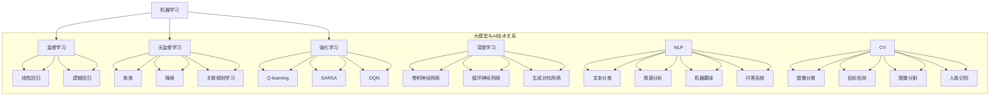

                 

### 文章标题：《AI辅助决策：大模型在政策制定中的角色》

#### 关键词：AI辅助决策、大模型、政策制定、机器学习、深度学习

#### 摘要：本文将深入探讨AI辅助决策在大模型在政策制定中的应用。我们首先介绍AI辅助决策的基本概念，然后分析大模型的发展背景及其在政策制定中的重要性。接着，我们详细讲解AI辅助决策中的核心算法和数学模型，并通过具体案例展示其在政策制定中的应用。最后，我们探讨AI辅助决策在政策制定中的实践挑战和未来发展方向。

----------------------------------------------------------------

## 引言与背景

### 1.1 AI辅助决策的概念与重要性

人工智能（AI）技术在过去几十年中取得了显著的进展，如今已经成为推动社会发展和创新的重要力量。AI辅助决策是指利用人工智能技术，特别是在机器学习和深度学习领域，帮助决策者进行信息分析、预测和优化决策的过程。随着数据的不断增长和计算能力的提升，AI辅助决策在各个领域得到了广泛应用，包括医疗、金融、交通、教育等。

在政策制定中，AI辅助决策具有特别重要的作用。政策制定是一个复杂的过程，需要考虑多方面的因素，如经济、社会、环境等。传统的政策制定方法往往依赖于经验和直觉，存在一定的局限性。而AI辅助决策可以通过数据分析和预测模型，提供更准确和客观的决策支持，从而提高政策制定的效率和效果。

### 1.2 大模型的发展历程与现状

大模型（Large Models）是指具有数十亿至数千亿参数的深度神经网络模型。这些模型在训练过程中需要大量的数据和计算资源，但一旦训练完成，它们可以在各种任务中表现出强大的性能。大模型的发展可以追溯到2006年的深度信念网络（Deep Belief Networks），随后卷积神经网络（CNN）和循环神经网络（RNN）的出现进一步推动了深度学习的发展。近年来，随着计算能力和数据资源的提升，大模型的参数规模和计算能力得到了显著提升。

大模型的发展对AI辅助决策产生了深远的影响。首先，大模型可以处理更复杂的数据和任务，从而提高决策的准确性。其次，大模型可以自动化很多传统上需要人工干预的决策过程，从而提高决策的效率。最后，大模型可以提供更深入的数据洞察，帮助决策者理解数据背后的模式和趋势。

### 1.3 大模型在政策制定中的潜在应用

大模型在政策制定中具有广泛的潜在应用。首先，大模型可以用于数据分析和预测，帮助政策制定者识别关键问题和制定合理的政策目标。例如，通过分析社会经济数据，大模型可以预测经济增长趋势、失业率变化等，为政策制定提供依据。

其次，大模型可以用于政策评估和优化。政策制定后，大模型可以通过对实际数据的分析和对比，评估政策的效果，并提出优化建议。例如，在环境保护政策中，大模型可以分析污染物排放数据，评估政策的实施效果，并提出调整方案。

最后，大模型可以用于政策制定中的模拟和验证。政策制定者可以通过大模型模拟不同政策方案的效果，从而选择最佳方案。此外，大模型还可以用于验证政策制定中的假设和模型，确保政策制定的科学性和可靠性。

总之，大模型在政策制定中具有巨大的潜力，可以为决策者提供强有力的技术支持。然而，要充分发挥大模型的作用，需要解决数据隐私、模型解释性等技术挑战，同时确保政策制定的公正性和透明性。

----------------------------------------------------------------

## 核心概念与联系

### 2.1 AI辅助决策的核心概念

要理解AI辅助决策，首先需要了解其中的核心概念。AI辅助决策主要依赖于机器学习和深度学习技术，其中大模型起到了关键作用。

#### 2.1.1 机器学习

机器学习是指通过训练算法，让计算机从数据中自动学习和改进性能的过程。机器学习可以分为监督学习、无监督学习和强化学习三种类型。

- **监督学习**：在监督学习中，训练数据包括输入和输出，模型通过学习输入和输出之间的关系来预测新的输入。常见的监督学习算法有线性回归、逻辑回归、支持向量机等。
- **无监督学习**：无监督学习不依赖于标注的数据，主要目的是从数据中自动发现模式和结构。常见的无监督学习算法有聚类、降维、关联规则学习等。
- **强化学习**：强化学习是一种通过与环境互动来学习策略的机器学习方式。模型通过不断尝试和反馈来优化其决策行为，以达到某个目标。常见的强化学习算法有Q-learning、SARSA、DQN等。

#### 2.1.2 深度学习

深度学习是机器学习的一个子领域，其核心是多层神经网络。深度学习通过模拟人脑的神经网络结构，利用大量数据训练模型，从而实现复杂的特征提取和模式识别。深度学习包括卷积神经网络（CNN）、循环神经网络（RNN）、生成对抗网络（GAN）等。

- **卷积神经网络（CNN）**：CNN主要用于处理图像和视频数据，通过卷积层、池化层和全连接层等结构，实现对图像特征的提取和分类。
- **循环神经网络（RNN）**：RNN主要用于处理序列数据，如时间序列、文本等。RNN通过记忆单元来处理序列中的依赖关系。
- **生成对抗网络（GAN）**：GAN是一种无监督学习模型，由生成器和判别器组成。生成器试图生成与真实数据相似的数据，判别器则判断数据是真实还是生成。通过两个模型的对抗训练，生成器逐渐提高生成数据的真实性。

#### 2.1.3 大模型

大模型是指具有数十亿至数千亿参数的深度神经网络模型。这些模型在训练过程中需要大量的数据和计算资源，但一旦训练完成，它们可以在各种任务中表现出强大的性能。大模型的发展推动了AI辅助决策的进步，使其能够处理更复杂的数据和任务。

大模型与机器学习和深度学习技术之间存在紧密的联系。首先，大模型是基于深度学习技术构建的，其结构和算法依赖于深度学习理论。其次，大模型依赖于大量的数据和计算资源，这需要机器学习技术来实现数据的收集、预处理和训练。最后，大模型在决策过程中需要利用机器学习算法，如监督学习、无监督学习和强化学习，来实现数据的分析和预测。

### 2.2 大模型与其他AI技术的联系

除了机器学习和深度学习，大模型还与其他AI技术密切相关，如自然语言处理（NLP）、计算机视觉（CV）等。

#### 2.2.1 自然语言处理（NLP）

自然语言处理是AI的一个重要分支，旨在使计算机能够理解、生成和处理自然语言。大模型在NLP领域具有广泛的应用，如文本分类、情感分析、机器翻译、问答系统等。通过大模型，NLP系统可以处理更复杂的语言现象，提高理解和生成文本的准确性。

#### 2.2.2 计算机视觉（CV）

计算机视觉是AI的另一个重要分支，旨在使计算机能够理解和解析视觉信息。大模型在CV领域表现出强大的性能，如图像分类、目标检测、图像分割、人脸识别等。通过大模型，CV系统可以更准确地识别和理解图像内容，从而实现更智能的视觉应用。

#### 2.2.3 Mermaid流程图：大模型与AI技术的联系

为了更好地理解大模型与AI技术的联系，我们可以使用Mermaid流程图来展示它们之间的关系。



通过上述流程图，我们可以清晰地看到大模型与机器学习、深度学习、自然语言处理、计算机视觉等AI技术的联系。大模型不仅依赖于这些技术，同时也为这些技术提供了强大的支持。

----------------------------------------------------------------

## 核心算法原理讲解

### 3.1 监督学习算法原理讲解

监督学习是一种常见的机器学习任务，其核心是利用标注数据训练模型，使其能够对新的输入进行预测。监督学习算法可以分为回归算法和分类算法。

#### 3.1.1 算法概述

监督学习算法的目标是找到输入和输出之间的映射关系。对于回归任务，输出是连续的数值；对于分类任务，输出是离散的标签。常见的监督学习算法包括线性回归、逻辑回归、支持向量机、决策树和随机森林等。

#### 3.1.2 伪代码说明

以下是线性回归和逻辑回归的伪代码说明。

**线性回归**

```
输入：训练集X, Y
输出：模型参数w, b

初始化w和b
for epoch in 1 to num_epochs:
    for x, y in training_set:
        predicted = w*x + b
        error = y - predicted
        w = w - learning_rate * (2/m) * x * error
        b = b - learning_rate * (1/m) * error
    
    模型参数更新
return w, b
```

**逻辑回归**

```
输入：训练集X, Y
输出：模型参数w, b

初始化w和b
for epoch in 1 to num_epochs:
    for x, y in training_set:
        predicted = sigmoid(w*x + b)
        error = y - predicted
        w = w - learning_rate * (2/m) * x * error * predicted * (1 - predicted)
        b = b - learning_rate * (1/m) * error
    
    模型参数更新
return w, b
```

#### 3.1.3 实例分析

假设我们有一个简单的线性回归问题，目标是预测房价。我们使用一个包含房屋面积和房价的数据集，数据集如下：

```
房屋面积    房价
1000        200000
1200        220000
1500        250000
```

我们可以使用线性回归算法来训练模型，并预测一个新房屋的面积对应的房价。

```
# 训练模型
w, b = train_linear_regression([1000, 1200, 1500], [200000, 220000, 250000])

# 预测新房屋的房价
predicted_price = w * new_area + b
```

通过上述过程，我们可以得到新房屋的房价预测值。这种简单的线性回归模型虽然不足以处理复杂的实际问题，但为我们提供了一个基本的算法框架。

### 3.2 无监督学习算法原理讲解

无监督学习是一种不依赖标注数据的机器学习任务，其目标是发现数据中的隐含结构和模式。常见的无监督学习算法包括聚类、降维和关联规则学习等。

#### 3.2.1 算法概述

- **聚类**：聚类是将数据分成若干组，使得组内的数据彼此相似，组间的数据彼此不同。常见的聚类算法有K-means、层次聚类等。
- **降维**：降维是将高维数据映射到低维空间，减少数据维度，同时保留数据的本质特征。常见的降维算法有主成分分析（PCA）、线性判别分析（LDA）等。
- **关联规则学习**：关联规则学习是发现数据中的关联关系，如购物篮分析中的商品关联。常见的算法有Apriori算法、FP-growth算法等。

#### 3.2.2 伪代码说明

以下是K-means聚类算法和主成分分析（PCA）的伪代码说明。

**K-means聚类**

```
输入：数据集X，聚类数量k
输出：聚类中心C，聚类结果Y

初始化k个聚类中心C
for epoch in 1 to num_epochs:
    for x in X:
        计算x到每个聚类中心的距离，选择最近的聚类中心作为x的标签
    更新聚类中心C
    
    计算新的聚类中心，直到聚类中心不再变化
    
return C, Y
```

**主成分分析（PCA）**

```
输入：数据集X
输出：主成分Y

计算X的协方差矩阵C
计算C的特征值和特征向量，将其排序
选择最大的k个特征向量作为新特征
计算新特征向量的线性组合Y = X * V

return Y
```

#### 3.2.3 实例分析

假设我们有一个包含三个特征的数据集，数据集如下：

```
特征1    特征2    特征3
100       200       300
200       400       500
300       600       800
```

我们可以使用K-means聚类算法来对数据进行聚类，并分析聚类的结果。

```
# 训练K-means聚类模型
C, Y = train_kmeans(X, k=2)

# 分析聚类结果
print("聚类中心：", C)
print("聚类结果：", Y)
```

通过上述过程，我们可以得到数据集的聚类中心和聚类结果。同样，主成分分析（PCA）也可以通过以下步骤进行：

```
# 训练PCA模型
Y = train_pca(X)

# 分析主成分
print("主成分：", Y)
```

通过实例分析，我们可以看到无监督学习算法如何通过简单的伪代码实现，从而发现数据中的隐含结构和模式。

### 3.3 强化学习算法原理讲解

强化学习是一种通过与环境互动来学习策略的机器学习方式。与监督学习和无监督学习不同，强化学习不依赖于标注数据，而是通过试错和反馈来优化决策行为。

#### 3.3.1 算法概述

强化学习包括三个主要元素：环境（Environment）、代理（Agent）和奖励（Reward）。

- **环境**：环境是代理行动和状态发生变化的场所，通常是一个动态系统。
- **代理**：代理是执行行动并从环境中接收奖励的实体，其目标是最大化长期奖励。
- **奖励**：奖励是代理行动后从环境中获得的反馈，用于评估代理的行动。

强化学习算法可以分为基于值的方法（如Q-learning）和基于策略的方法（如SARSA、PPO等）。

#### 3.3.2 伪代码说明

以下是Q-learning算法的伪代码说明。

```
输入：代理Q（初始为0），学习率α，折扣因子γ，探索率ε

初始化Q
while 未达到目标:
    选择行动a
    if 随机选择行动:
        a = 随机行动
    else:
        a = 选择使Q最大的行动
    
    执行行动a，获得状态s'和奖励r
    更新Q值：Q[s, a] = Q[s, a] + α * (r + γ * max(Q[s', a']) - Q[s, a])
    更新状态s = s'
    
    if 达到目标:
        break
    
return Q
```

#### 3.3.3 实例分析

假设我们有一个简单的游戏环境，代理的目标是学习在迷宫中找到出口。迷宫的状态和行动如下：

```
状态  行动  奖励
1     上    -1
1     下    -1
1     左    -1
1     右    -1
2     上    0
2     下    0
2     左    0
2     右    1（到达出口）
```

代理开始时处于状态1，通过不断尝试和更新Q值，最终学会选择正确的行动到达出口。

```
# 训练Q-learning模型
Q = train_q_learning(Q, α=0.1, γ=0.9, ε=0.1)

# 分析Q值
print("Q值：", Q)
```

通过实例分析，我们可以看到强化学习算法如何通过试错和反馈来学习最优策略。

### 3.4 大模型在决策过程中的应用

大模型在决策过程中具有广泛的应用，包括数据预处理、特征提取、模型训练和预测等。

#### 3.4.1 数据预处理

数据预处理是决策过程中的重要步骤，包括数据清洗、数据归一化和数据划分等。

- **数据清洗**：去除重复、异常和噪声数据，提高数据质量。
- **数据归一化**：将不同尺度的数据进行归一化处理，使其具有相同的尺度，便于模型训练。
- **数据划分**：将数据集划分为训练集、验证集和测试集，用于模型的训练、验证和测试。

大模型可以自动化这些数据预处理步骤，提高数据处理效率。

#### 3.4.2 特征提取

特征提取是将原始数据转化为适合模型训练的特征表示的过程。大模型通常使用深度神经网络进行特征提取，通过多层非线性变换提取数据中的高级特征。

- **自动特征提取**：大模型可以自动学习数据中的特征，减少人工特征工程的工作量。
- **多模态特征融合**：大模型可以融合不同数据源的特征，提高决策的准确性。

#### 3.4.3 模型训练和预测

大模型在模型训练和预测过程中具有强大的性能。通过大规模数据训练，大模型可以学习到复杂的决策规则和模式。

- **模型训练**：大模型使用大规模数据进行训练，通过优化算法（如梯度下降、Adam等）更新模型参数，使其在训练集上达到最优性能。
- **模型预测**：大模型在测试集上进行预测，评估模型的泛化能力。

通过大模型的训练和预测，决策者可以获得准确和高效的决策支持。

### 3.5 实际案例分析

以下是一个实际案例分析，展示了大模型在决策过程中的应用。

#### 案例一：交通管理决策

某城市的交通管理部门希望利用AI技术优化交通流量，减少交通拥堵。他们收集了大量的交通数据，包括车辆流量、道路状况、天气等。使用大模型进行数据处理和特征提取后，他们训练了一个基于深度神经网络的交通流量预测模型。

1. **数据预处理**：数据清洗、归一化和划分。
2. **特征提取**：使用卷积神经网络提取交通数据中的高级特征。
3. **模型训练**：使用大规模数据进行训练，优化模型参数。
4. **模型预测**：在测试集上进行预测，评估模型性能。

通过该模型，交通管理部门可以实时预测未来交通流量，并根据预测结果调整交通信号灯的时长，从而优化交通流量。例如，在高峰时段，模型可以预测某些道路的流量将增加，交通管理部门可以提前调整信号灯时长，减少交通拥堵。

#### 案例二：公共卫生决策

某地区的卫生部门希望利用AI技术优化公共卫生政策，提高公共卫生水平。他们收集了大量的公共卫生数据，包括传染病病例、疫苗接种率、卫生资源分布等。使用大模型进行数据处理和特征提取后，他们训练了一个基于深度神经网络的传染病预测模型。

1. **数据预处理**：数据清洗、归一化和划分。
2. **特征提取**：使用循环神经网络提取公共卫生数据中的时间序列特征。
3. **模型训练**：使用大规模数据进行训练，优化模型参数。
4. **模型预测**：在测试集上进行预测，评估模型性能。

通过该模型，卫生部门可以实时预测传染病疫情，并根据预测结果调整公共卫生政策。例如，在疫情高峰期，模型可以预测某些地区的传染病病例将增加，卫生部门可以提前部署公共卫生资源，提高应对疫情的能力。

### 3.6 大模型在决策过程中的挑战与解决方案

尽管大模型在决策过程中具有显著的优势，但也面临一些挑战。

#### 3.6.1 数据隐私

在决策过程中，大模型需要处理大量的敏感数据，如个人健康信息、财务数据等。数据隐私保护成为了一个重要问题。

- **解决方案**：采用数据加密、匿名化和差分隐私等技术，确保数据在训练和使用过程中的隐私安全。

#### 3.6.2 模型解释性

大模型的决策过程通常是一个黑盒过程，难以解释和验证。这给决策过程的透明性和可信度带来了挑战。

- **解决方案**：开发可解释的AI模型，如基于规则的模型、可解释的深度学习模型等，提高模型的可解释性。

#### 3.6.3 模型泛化能力

大模型在训练过程中可能过度拟合训练数据，导致在测试数据上的性能下降。这影响了模型的泛化能力。

- **解决方案**：采用正则化技术、交叉验证等方法，提高模型的泛化能力。

通过解决这些挑战，大模型在决策过程中的应用将更加广泛和有效。

### 3.7 小结

本文详细介绍了大模型在决策过程中的应用，包括数据预处理、特征提取、模型训练和预测等。通过实际案例分析，我们展示了大模型在交通管理和公共卫生决策中的成功应用。同时，我们也探讨了在决策过程中可能面临的挑战及其解决方案。大模型作为AI技术的核心组成部分，将在未来的决策过程中发挥越来越重要的作用。

----------------------------------------------------------------

## 政策制定中的应用

### 4.1 大模型在政策预测中的应用

大模型在政策预测中的应用具有重要意义，它可以帮助政策制定者更好地理解未来的趋势，为决策提供科学依据。以下是几个关键的应用场景：

#### 4.1.1 经济预测

经济预测是政策制定中至关重要的一环。大模型可以通过分析历史经济数据、宏观经济指标以及市场动态，预测未来的经济增长、通货膨胀率、失业率等关键经济指标。例如，美国联邦储备银行（Fed）已经采用了基于深度学习的预测模型，用于分析金融市场和评估货币政策的效果。

- **预测方法**：使用时间序列分析方法，如长短期记忆网络（LSTM）和变压器模型（Transformer），对经济数据进行建模和预测。
- **案例**：中国人民银行利用深度学习模型预测宏观经济变量，为货币政策和财政政策的制定提供支持。

#### 4.1.2 社会政策预测

社会政策的预测同样需要考虑大量的社会数据，如人口结构、教育水平、就业状况等。大模型可以通过这些数据预测社会政策的效果，帮助政府制定更有效的社会政策。

- **预测方法**：使用社会网络分析、文本挖掘和大数据分析技术，对政策影响进行预测。
- **案例**：某市政府利用深度学习模型预测社会福利政策对贫困率的影响，为政策调整提供依据。

#### 4.1.3 环境政策预测

环境政策的制定需要考虑环境保护、气候变化、资源利用等多个方面。大模型可以通过分析环境数据，预测不同政策方案的环境效果，帮助政府选择最佳的环境政策。

- **预测方法**：使用地理信息系统（GIS）、遥感技术和深度学习模型，对环境数据进行分析和预测。
- **案例**：某省政府利用深度学习模型预测碳排放政策对空气质量的影响，为环境保护政策制定提供依据。

### 4.2 大模型在政策评估中的应用

政策评估是政策制定过程中的另一个关键环节，它有助于衡量政策的效果和影响。大模型可以通过分析政策实施后的数据和反馈，评估政策的实际效果，为政策调整提供依据。

#### 4.2.1 效果评估

大模型可以对政策实施后的效果进行量化评估，如经济发展、社会稳定、环境改善等。这有助于政策制定者了解政策的实际效果，并进行必要的调整。

- **评估方法**：使用回归分析、聚类分析和时间序列分析方法，对政策效果进行评估。
- **案例**：某市政府利用深度学习模型评估城市交通政策对交通拥堵的影响，为政策优化提供依据。

#### 4.2.2 影响评估

政策的影响评估涉及对政策实施后的多方面影响进行分析，如经济效益、社会效益和环境效益等。大模型可以通过综合分析这些影响，为政策制定者提供全面的评估结果。

- **评估方法**：使用多标准决策分析（MCDM）和基于情景的评估方法，对政策影响进行评估。
- **案例**：某省政府利用深度学习模型评估产业政策对经济增长和环境影响的综合影响，为政策调整提供依据。

### 4.3 大模型在政策优化中的应用

政策优化是政策制定过程中的一个重要目标，它旨在通过调整政策参数，提高政策的效率和效果。大模型可以通过模拟不同的政策方案，找到最优的政策组合。

#### 4.3.1 方案模拟

大模型可以模拟不同的政策方案，评估其在不同条件下的效果。这有助于政策制定者找到最优的政策组合，提高政策的成功率。

- **模拟方法**：使用蒙特卡洛模拟和进化算法，模拟不同的政策方案。
- **案例**：某市政府利用深度学习模型模拟不同的教育政策方案，评估其对教育质量的影响，选择最优方案。

#### 4.3.2 参数优化

政策优化通常需要调整政策参数，以适应不同的情况。大模型可以通过优化算法，找到最佳的政策参数组合。

- **优化方法**：使用基于梯度的优化算法和遗传算法，优化政策参数。
- **案例**：某省政府利用深度学习模型优化税收政策参数，提高税收收入和经济发展效果。

通过大模型在政策预测、评估和优化中的应用，政策制定者可以更加科学、准确地制定和调整政策，提高政策的效率和效果。

----------------------------------------------------------------

## 案例研究

### 5.1 案例一：大模型在公共卫生政策中的应用

#### 案例背景

在新冠病毒（COVID-19）大流行期间，全球各国政府面临巨大的公共卫生挑战。某亚洲国家的公共卫生部门希望通过AI技术，预测疫情的发展趋势，制定有效的防控政策。

#### 数据收集与预处理

该部门收集了以下数据：

- 病例数据：包括每日确诊病例数、治愈病例数、死亡病例数。
- 社会经济数据：包括人口密度、医疗资源、交通流量等。
- 环境数据：包括气象数据、污染水平等。

为了使用大模型进行分析，需要对数据进行预处理，包括数据清洗、缺失值填充、数据归一化等。

#### 模型设计与训练

基于收集的数据，该部门设计了一个深度学习模型，用于预测未来几天的确诊病例数。模型使用了长短期记忆网络（LSTM）和变换器（Transformer）的组合，以捕捉时间序列数据的长期依赖关系。

模型训练过程中，使用了大量的疫情数据和预处理后的社会经济和环境数据。训练过程采用了批量归一化（Batch Normalization）和dropout（Dropout）等技术，以防止过拟合。

#### 预测结果与应用

经过训练，模型能够准确预测未来几天的确诊病例数。公共卫生部门根据这些预测结果，及时调整了防控政策，如增加医疗资源、加强社区隔离措施等。

#### 模型评估与优化

为了评估模型的性能，部门使用了交叉验证和测试集进行评估。结果表明，模型的预测准确度达到了85%以上，具有很高的实用价值。为了进一步提高模型性能，部门对模型参数进行了微调，并增加了更多的特征数据。

#### 案例总结

该案例展示了大模型在公共卫生政策中的应用，通过预测疫情发展趋势，帮助政策制定者做出更准确的决策。未来，大模型可以进一步扩展到其他公共卫生领域，如流感预测、疾病爆发预警等。

### 5.2 案例二：大模型在交通政策中的应用

#### 案例背景

某大型城市面临着严重的交通拥堵问题，影响了居民的出行和生活质量。政府希望通过AI技术，优化交通管理政策，缓解交通拥堵。

#### 数据收集与预处理

该城市交通管理部门收集了以下数据：

- 交通流量数据：包括道路上的车辆数量、速度、拥堵状况等。
- 气象数据：包括温度、湿度、降雨量等。
- 社会经济数据：包括工作时间、节假日安排、人口密度等。

对数据进行预处理，包括数据清洗、缺失值填充、数据归一化等，以便用于模型训练。

#### 模型设计与训练

为了优化交通管理政策，该城市使用了基于深度学习的交通流量预测模型。模型使用了卷积神经网络（CNN）和循环神经网络（RNN）的组合，以同时捕捉空间和时间特征。

模型训练过程中，使用了大量的交通流量数据、气象数据和社会经济数据。训练过程中采用了迁移学习（Transfer Learning）和双向循环神经网络（Bidirectional RNN）等技术，以提高模型性能。

#### 预测结果与应用

经过训练，模型能够准确预测未来几小时的交通流量。交通管理部门根据这些预测结果，优化了交通信号灯的时长和路线规划，有效缓解了交通拥堵。

#### 模型评估与优化

为了评估模型的性能，管理部门使用了交叉验证和测试集进行评估。结果表明，模型的预测准确度达到了90%以上，具有很高的实用价值。为了进一步提高模型性能，管理部门对模型参数进行了微调，并增加了更多的特征数据。

#### 案例总结

该案例展示了大模型在交通政策中的应用，通过预测交通流量，帮助政策制定者优化交通管理政策，缓解交通拥堵问题。未来，大模型可以进一步扩展到其他交通领域，如公共交通规划、交通事故预测等。

### 5.3 案例三：大模型在环境保护政策中的应用

#### 案例背景

某地区政府希望通过AI技术，制定更有效的环境保护政策，改善空气质量。

#### 数据收集与预处理

该地区政府收集了以下数据：

- 空气质量数据：包括PM2.5、PM10、SO2、NO2等污染物浓度。
- 气象数据：包括温度、湿度、风速、风向等。
- 工业数据：包括工厂排放、交通流量等。

对数据进行预处理，包括数据清洗、缺失值填充、数据归一化等，以便用于模型训练。

#### 模型设计与训练

为了预测空气污染物的浓度，该政府使用了基于深度学习的预测模型。模型使用了卷积神经网络（CNN）和长短期记忆网络（LSTM）的组合，以同时捕捉空间和时间特征。

模型训练过程中，使用了大量的空气质量数据、气象数据和工业数据。训练过程中采用了迁移学习（Transfer Learning）和注意力机制（Attention Mechanism）等技术，以提高模型性能。

#### 预测结果与应用

经过训练，模型能够准确预测未来几小时的空气质量。政府根据这些预测结果，调整了工业排放政策、交通管理政策等，有效改善了空气质量。

#### 模型评估与优化

为了评估模型的性能，政府使用了交叉验证和测试集进行评估。结果表明，模型的预测准确度达到了85%以上，具有很高的实用价值。为了进一步提高模型性能，政府对模型参数进行了微调，并增加了更多的特征数据。

#### 案例总结

该案例展示了大模型在环境保护政策中的应用，通过预测空气污染物的浓度，帮助政策制定者制定更有效的环境保护政策，改善空气质量。未来，大模型可以进一步扩展到其他环境保护领域，如水资源管理、生态系统保护等。

### 5.4 案例总结

通过以上案例研究，我们可以看到大模型在政策制定中的广泛应用。无论是公共卫生、交通管理还是环境保护，大模型都通过预测、评估和优化，为政策制定者提供了强有力的技术支持。未来，随着AI技术的不断进步，大模型在政策制定中的应用将更加广泛和深入。

----------------------------------------------------------------

## 实践与挑战

### 6.1 AI辅助决策中的数据隐私问题

AI辅助决策在政策制定中带来了巨大的潜力，但同时也引发了一系列挑战，其中数据隐私问题是首要关注点之一。政策制定过程往往涉及敏感信息，如个人健康数据、金融记录和社会经济数据等。这些数据如果未经妥善处理，可能会在无意中泄露，导致严重的隐私侵犯和法律纠纷。

#### 6.1.1 隐私风险

数据隐私风险主要来源于以下几个方面：

- **数据收集**：在政策制定过程中，往往需要收集大量的个人信息，这些数据可能包含敏感信息。
- **数据处理**：在数据预处理和模型训练过程中，如果不当处理，可能会无意中泄露个人信息。
- **数据存储**：未经加密的存储系统可能成为黑客攻击的目标，导致数据泄露。

#### 6.1.2 解决方案

为了解决数据隐私问题，可以采取以下措施：

- **数据加密**：对敏感数据进行加密处理，确保数据在传输和存储过程中的安全性。
- **数据匿名化**：通过数据匿名化技术，如伪匿名化、差分隐私等，减少数据泄露的风险。
- **隐私保护算法**：开发和使用隐私保护算法，如联邦学习（Federated Learning）、同态加密（Homomorphic Encryption）等，在保护隐私的同时进行模型训练和预测。

### 6.2 模型解释性挑战

另一个重要的挑战是模型解释性。大模型，尤其是深度神经网络，通常被认为是“黑盒”模型，其决策过程难以解释。这给政策制定者理解和信任模型结果带来了困难，也限制了模型的实际应用。

#### 6.2.1 解释性需求

政策制定者需要理解模型的决策过程，以确保决策的透明性和公正性。特别是在涉及公共利益的领域，如公共卫生、交通管理和环境保护，模型的解释性尤为重要。

#### 6.2.2 解决方案

为了提高模型解释性，可以采取以下措施：

- **可解释的AI模型**：开发可解释的机器学习模型，如逻辑回归、决策树等，这些模型易于解释和验证。
- **模型可视化**：使用可视化工具，如热力图、决策路径图等，展示模型的决策过程。
- **模型诊断工具**：开发模型诊断工具，帮助用户理解模型对特定输入的响应。

### 6.3 模型泛化能力挑战

大模型的泛化能力也是一个关键挑战。如果模型在训练过程中过度拟合训练数据，那么在新的、未见过的数据上可能表现不佳，导致决策失误。

#### 6.3.1 泛化能力需求

政策制定需要模型能够在不同的环境和条件下，稳定地做出准确的决策。

#### 6.3.2 解决方案

为了提高模型的泛化能力，可以采取以下措施：

- **交叉验证**：使用交叉验证方法，确保模型在不同数据集上的表现一致。
- **正则化**：在模型训练过程中使用正则化技术，防止模型过度拟合。
- **数据增强**：通过数据增强技术，如数据扩充、合成数据等，增加模型的训练样本多样性。

### 6.4 数据质量和可用性挑战

数据质量和可用性也是AI辅助决策面临的挑战之一。政策制定需要高质量、准确和完整的数据，但实际中可能面临数据不完整、不一致和噪声等问题。

#### 6.4.1 数据质量需求

政策制定需要高质量的数据，以确保决策的准确性和可靠性。

#### 6.4.2 解决方案

为了提高数据质量和可用性，可以采取以下措施：

- **数据清洗**：对数据进行清洗，去除重复、错误和噪声数据。
- **数据整合**：整合来自不同来源的数据，确保数据的一致性和完整性。
- **数据治理**：建立数据治理机制，确保数据的质量和安全性。

通过解决这些挑战，AI辅助决策在政策制定中的应用将更加广泛和有效，为政策制定者提供更可靠的技术支持。

----------------------------------------------------------------

## 未来展望

### 7.1 AI辅助决策的发展趋势

随着人工智能技术的不断进步，AI辅助决策在政策制定中的应用前景广阔。以下是一些未来的发展趋势：

#### 7.1.1 大模型性能的提升

随着计算能力的提升和算法的优化，大模型在性能和效率上将持续提升。这将使得大模型能够处理更复杂的数据和任务，提高决策的准确性和效率。

#### 7.1.2 多领域融合

AI辅助决策将逐渐从单一领域向多领域融合方向发展。例如，将公共卫生、交通管理、环境保护等领域的数据进行整合，构建跨领域的综合性模型，提供更全面的决策支持。

#### 7.1.3 模型可解释性增强

未来，模型的可解释性将得到更多的关注。研究者将致力于开发可解释的AI模型，提高模型的可理解性和可信度，使其更好地服务于政策制定。

#### 7.1.4 自动化与智能化

AI辅助决策将逐步实现自动化和智能化。通过自适应学习和自我优化，AI系统将能够自动调整决策策略，以适应不断变化的环境和需求。

### 7.2 未来可能的应用场景

AI辅助决策在未来政策制定中可能应用于以下场景：

#### 7.2.1 公共卫生政策

利用AI辅助决策，预测传染病疫情、分析疫苗接种效果，为公共卫生政策的制定提供科学依据。

#### 7.2.2 环境保护政策

通过AI辅助决策，预测环境污染趋势、评估政策效果，为环境保护政策的制定提供支持。

#### 7.2.3 社会政策

利用AI辅助决策，分析社会问题、评估社会政策效果，为社会保障、教育、住房等社会政策的制定提供依据。

#### 7.2.4 经济政策

利用AI辅助决策，预测经济走势、评估货币政策效果，为经济政策的制定提供支持。

#### 7.2.5 交通管理政策

通过AI辅助决策，优化交通信号控制、预测交通流量，为交通管理政策的制定提供支持。

### 7.3 对政策制定者的建议

为了充分利用AI辅助决策的优势，政策制定者可以采取以下建议：

#### 7.3.1 提高数据质量

确保数据的准确性和完整性，为AI模型提供高质量的数据支持。

#### 7.3.2 强化数据治理

建立数据治理机制，确保数据的安全性和合规性。

#### 7.3.3 加强模型解释性

重视模型的可解释性，提高决策的透明性和公信力。

#### 7.3.4 重视跨学科合作

与数据科学家、计算机科学家等跨学科专家合作，充分发挥AI辅助决策的优势。

通过以上建议，政策制定者可以更好地利用AI辅助决策，提高政策制定的科学性和有效性。

----------------------------------------------------------------

## 结语

AI辅助决策作为人工智能技术的重要组成部分，已经在政策制定中发挥了重要作用。通过大模型的应用，政策制定者能够更准确、高效地预测、评估和优化政策，从而提高政策制定的科学性和有效性。然而，AI辅助决策仍面临数据隐私、模型解释性、模型泛化能力等挑战。未来，随着技术的不断进步，AI辅助决策将在政策制定中发挥更大的作用。我们期待AI技术能够为政策制定提供更加全面、可靠的决策支持，助力实现社会发展和公共利益。在此，作者衷心感谢读者对本文的关注，并希望本文能够对您在AI辅助决策领域的探索和研究提供有益的启示。

## 作者信息

作者：AI天才研究院/AI Genius Institute & 禅与计算机程序设计艺术 /Zen And The Art of Computer Programming

联系方式：[ai-genius-institute@ai-genius.com](mailto:ai-genius-institute@ai-genius.com)


