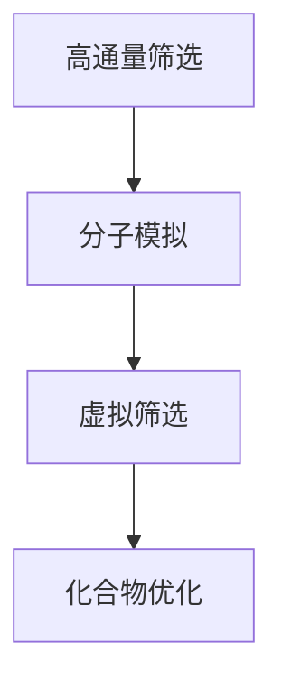
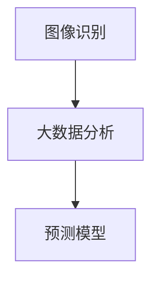
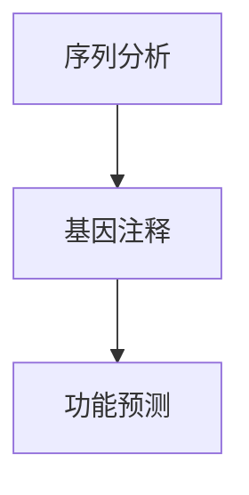

                 

## 文章标题：AI辅助的科学发现：加速研究进程的新方法

### 关键词：

- 人工智能
- 科学发现
- 研究加速
- 新方法
- 数据分析
- 深度学习
- 机器学习
- 强化学习
- 实验设计
- 伦理问题

### 摘要：

本文探讨了人工智能（AI）在科学研究中的应用，揭示了AI如何通过辅助实验设计、数据分析、结果解释等方面，加速科学研究的进程。文章首先介绍了AI的基本概念和技术，接着详细阐述了机器学习、深度学习和强化学习等核心算法原理，并通过数学模型和公式对其进行解读。随后，文章展示了AI在药物研发、气候变化研究和基因组学等领域的具体应用案例，以及如何通过项目实战和代码实现来加速研究进程。最后，文章讨论了AI伦理问题，并对未来发展趋势进行了展望。

## 目录

### 第一部分：AI基础与应用

**第1章：AI概述**

1.1 AI的定义与历史  
1.2 AI的核心技术

**第2章：机器学习基础**

2.1 机器学习概述  
2.2 监督学习  
2.3 无监督学习  
2.4 强化学习

**第3章：深度学习原理**

3.1 深度学习概述  
3.2 神经网络架构  
3.3 深度学习算法  
3.4 深度学习模型训练

**第4章：AI工具与平台**

4.1 主流AI框架  
4.2 AI开发环境

### 第二部分：AI在科学研究中的应用

**第5章：AI辅助科学发现**

5.1 AI在实验设计中的应用  
5.2 AI在数据分析中的应用  
5.3 AI在实验结果解释中的应用

**第6章：AI加速研究进程**

6.1 AI在药物研发中的应用  
6.2 AI在气候变化研究中的应用  
6.3 AI在基因组学研究中的应用

**第7章：新方法与未来趋势**

7.1 AI伦理与法律问题  
7.2 AI在科学研究的未来发展

### 第三部分：实践与探索

**第8章：AI辅助科学研究案例**

8.1 案例一：基于AI的药物设计  
8.2 案例二：AI在环境监测中的应用  
8.3 案例三：AI在生物信息学中的应用

**第9章：项目实战与代码解读**

9.1 项目实战：基于AI的图像识别  
9.2 项目实战：基于AI的文本分析  
9.3 代码解读：深度学习算法实现

**第10章：总结与展望**

10.1 总结  
10.2 展望未来

接下来，我们将按照这个目录结构，逐步深入探讨AI在科学发现和加速研究进程中的应用。让我们先从AI的基础概念和技术开始。 <a name="part1"></a> <a name="part2"></a>### 第一部分：AI基础与应用

#### 第1章：AI概述

人工智能（Artificial Intelligence，简称AI）是指通过计算机程序实现人类智能的学科。它旨在让机器具备认知、理解、推理、学习、决策等能力，以解决复杂问题。AI的发展经历了几个重要阶段：

1. **符号人工智能**：早期AI研究主要集中在基于符号逻辑的推理系统。这些系统通过构建符号模型来模拟人类的思维过程，如专家系统（Expert Systems）。
2. **知识表示与推理**：在这一阶段，AI研究开始关注如何有效地表示知识和进行推理，以提高系统的智能水平。
3. **机器学习**：20世纪80年代以来，机器学习成为AI研究的主流方向。它通过让机器从数据中学习，实现自动化推理和决策。
4. **深度学习**：近年来，深度学习作为一种重要的机器学习技术，取得了显著进展。它通过模拟人脑神经网络结构，实现了在图像识别、自然语言处理等领域的突破。

##### 1.1 AI的定义与历史

AI的定义可以归结为两个层面：弱AI和强AI。

- **弱AI**：也称为狭义AI，是指在某些特定任务上表现出人类智能水平的机器。例如，AI聊天机器人、自动驾驶汽车等。
- **强AI**：也称为通用人工智能（Artificial General Intelligence，简称AGI），是指具备人类全部智能水平的机器。强AI能够在各种复杂任务上表现出与人类相同或更优的智能水平。

AI的历史可以追溯到20世纪50年代。1950年，艾伦·图灵提出了“图灵测试”，用于评估机器是否具备智能。1956年，约翰·麦卡锡等人在达特茅斯会议上提出了人工智能的概念，标志着AI作为一个独立学科的诞生。此后，AI经历了多个发展阶段，取得了显著的进展。

##### 1.2 AI的核心技术

AI的核心技术包括机器学习、深度学习、自然语言处理、计算机视觉等。

- **机器学习**：机器学习是一种通过算法从数据中学习规律、模式的AI技术。它主要包括监督学习、无监督学习和强化学习。
  - **监督学习**：通过已知输入和输出，训练模型以预测未知输出。
  - **无监督学习**：仅通过输入数据，发现数据中的模式或结构。
  - **强化学习**：通过与环境的交互，学习最优策略以实现目标。

- **深度学习**：深度学习是一种基于多层神经网络的机器学习技术。它通过学习大量数据，自动提取特征和模式，实现高效的数据分析。
  - **神经网络架构**：包括卷积神经网络（CNN）、循环神经网络（RNN）、生成对抗网络（GAN）等。
  - **深度学习算法**：包括反向传播算法、优化算法等。

- **自然语言处理**：自然语言处理（Natural Language Processing，简称NLP）是一种让计算机理解和处理自然语言的技术。它包括词性标注、句法分析、语义理解等。

- **计算机视觉**：计算机视觉（Computer Vision）是一种让计算机理解和解释视觉信息的技术。它包括图像识别、目标检测、人脸识别等。

接下来，我们将进一步探讨机器学习和深度学习的核心原理。 <a name="ml"></a>#### 第2章：机器学习基础

##### 2.1 机器学习概述

机器学习（Machine Learning，简称ML）是AI的核心技术之一，它使计算机具备从数据中学习规律和模式的能力。机器学习的基本原理是利用历史数据（训练数据集），通过算法训练出一个模型，然后使用该模型对新数据进行预测或分类。

##### 2.2 监督学习

监督学习（Supervised Learning）是一种最常见的机器学习方法，其核心思想是利用已标记的输入输出数据训练模型，然后使用训练好的模型对新数据进行预测。

监督学习的流程通常包括以下几个步骤：

1. **数据收集**：收集具有标记的输入输出数据，例如，对于图像分类任务，需要收集标注好的图像及其对应的类别标签。
2. **数据预处理**：对收集到的数据进行清洗、归一化等处理，以提高数据质量。
3. **模型选择**：选择合适的模型架构，如线性回归、决策树、支持向量机等。
4. **模型训练**：利用训练数据集训练模型，通过优化目标函数（如均方误差、交叉熵等）调整模型参数。
5. **模型评估**：使用验证数据集评估模型性能，通过准确率、召回率、F1值等指标评估模型效果。
6. **模型部署**：将训练好的模型部署到实际应用场景，对新数据进行预测。

以下是监督学习的一个简单伪代码示例：

```python
def train_supervised_learning(data, labels, model, optimizer):
    for epoch in range(num_epochs):
        for x, y in zip(data, labels):
            # 前向传播
            outputs = model.forward(x)
            # 计算损失
            loss = criterion(outputs, y)
            # 反向传播
            optimizer.zero_grad()
            loss.backward()
            optimizer.step()
    return model
```

##### 2.3 无监督学习

无监督学习（Unsupervised Learning）是一种不依赖于已标记数据的机器学习方法，其主要任务是发现数据中的内在结构和规律。无监督学习包括以下几种主要类型：

1. **聚类**：将相似的数据点归为同一类别，以发现数据中的分布和模式。常见的聚类算法包括K-means、层次聚类等。
2. **降维**：通过减少数据维度，降低数据复杂度，同时保留主要特征信息。常见的降维算法包括主成分分析（PCA）、t-SNE等。
3. **关联规则学习**：发现数据项之间的关联关系，用于推荐系统和市场细分等应用。常见的关联规则算法包括Apriori算法、FP-Growth等。

以下是聚类算法K-means的一个简单伪代码示例：

```python
def kmeans(data, num_clusters, max_iterations):
    # 初始化聚类中心
    centroids = initialize_centroids(data, num_clusters)
    for iteration in range(max_iterations):
        # 计算每个数据点到聚类中心的距离
        distances = compute_distances(data, centroids)
        # 分配数据点到最近的聚类中心
        assignments = assign_clusters(data, distances)
        # 更新聚类中心
        centroids = update_centroids(data, assignments)
    return assignments, centroids
```

##### 2.4 强化学习

强化学习（Reinforcement Learning，简称RL）是一种通过与环境交互，学习最优策略的机器学习方法。强化学习的主要任务是找到一种策略，使得在连续或离散环境中，通过采取一系列动作，最大化累积奖励。

强化学习的核心组件包括：

1. **状态（State）**：描述环境的当前情况。
2. **动作（Action）**：在给定状态下，可以采取的动作。
3. **奖励（Reward）**：采取某个动作后，获得的即时奖励，用于评估动作的好坏。
4. **策略（Policy）**：决定在给定状态下采取哪个动作。
5. **价值函数（Value Function）**：评估在某个状态下采取某个动作的长期收益。
6. **模型（Model）**：描述环境动态和奖励函数的数学模型。

强化学习的常见算法包括：

1. **Q-Learning**：通过学习Q值（表示在给定状态下采取某个动作的长期收益），更新策略。
2. **深度Q网络（Deep Q-Network，简称DQN）**：结合深度学习和强化学习，用于处理高维状态空间的问题。
3. **策略梯度算法**：直接学习最优策略，而不是Q值。

以下是强化学习的一个简单伪代码示例：

```python
def q_learning(state, action, reward, next_state, discount_factor, model, optimizer):
    # 前向传播
    current_q_values = model.forward(state, action)
    next_q_values = model.forward(next_state)
    # 计算目标Q值
    target_q_value = reward + discount_factor * next_q_values.max()
    # 计算损失
    loss = F.smooth_l1_loss(current_q_values, target_q_value.unsqueeze(1))
    # 反向传播
    optimizer.zero_grad()
    loss.backward()
    optimizer.step()
    return model
```

接下来，我们将探讨深度学习的基本原理。 <a name="dl"></a>#### 第3章：深度学习原理

##### 3.1 深度学习概述

深度学习（Deep Learning，简称DL）是一种基于多层神经网络的机器学习方法。它通过学习大量数据，自动提取特征和模式，实现高效的数据分析。深度学习在图像识别、自然语言处理、语音识别等领域取得了显著的成果。

深度学习的主要特点包括：

1. **多层网络**：深度学习网络由多个隐层组成，可以提取更高层次的特征。
2. **自动特征提取**：通过反向传播算法，深度学习网络可以自动学习输入数据的特征表示。
3. **并行计算**：深度学习可以利用GPU等并行计算设备，实现高效的模型训练。

##### 3.2 神经网络架构

神经网络（Neural Network，简称NN）是深度学习的基础。它由一系列相互连接的节点（或称为神经元）组成，每个节点通过权重（或称为边）与相邻节点相连。神经网络的输入层接收外部输入，输出层产生预测或分类结果，中间的隐层用于提取特征。

常见的神经网络架构包括：

1. **全连接神经网络（Fully Connected Neural Network）**：每个神经元都与所有前一层神经元相连。
2. **卷积神经网络（Convolutional Neural Network，简称CNN）**：适用于图像处理任务，通过卷积层提取局部特征。
3. **循环神经网络（Recurrent Neural Network，简称RNN）**：适用于序列数据，通过循环结构保持历史信息。
4. **生成对抗网络（Generative Adversarial Network，简称GAN）**：由生成器和判别器组成，用于生成高质量的数据。

##### 3.3 深度学习算法

深度学习算法主要包括前向传播、反向传播和优化算法。

1. **前向传播**：在神经网络中，从输入层传递数据，通过每一层计算并更新中间层的输出值，最终得到输出层的预测结果。
2. **反向传播**：通过计算输出层预测结果与实际结果之间的误差，反向传播误差，更新网络权重，以达到最小化误差的目的。
3. **优化算法**：用于调整网络权重，常见的优化算法包括随机梯度下降（SGD）、Adam等。

以下是深度学习的一个简单伪代码示例：

```python
def forward_pass(inputs, model):
    outputs = inputs
    for layer in model.layers:
        outputs = layer.forward(outputs)
    return outputs

def backward_pass(outputs, targets, model, optimizer):
    loss = criterion(outputs, targets)
    optimizer.zero_grad()
    loss.backward()
    optimizer.step()
```

##### 3.4 深度学习模型训练

深度学习模型训练包括数据预处理、模型选择、训练过程和模型评估。

1. **数据预处理**：对输入数据进行清洗、归一化等处理，以提高模型训练效果。
2. **模型选择**：根据任务需求，选择合适的神经网络架构和优化算法。
3. **训练过程**：通过迭代训练模型，不断更新网络权重，以达到最小化误差的目的。
4. **模型评估**：使用验证集或测试集评估模型性能，通过准确率、召回率、F1值等指标评估模型效果。

接下来，我们将探讨AI工具与平台，了解如何利用这些工具和平台进行深度学习和机器学习模型的开发和部署。 <a name="ai_tools"></a>#### 第4章：AI工具与平台

##### 4.1 主流AI框架

在AI领域，有许多主流的框架和库，用于深度学习、机器学习和自然语言处理等任务。以下是一些常见的AI框架和库：

1. **TensorFlow**：由Google开发，是一个开源的深度学习框架，提供了丰富的API和工具，适用于各种深度学习任务。
2. **PyTorch**：由Facebook开发，是一个开源的深度学习框架，提供了灵活的动态计算图和易于使用的接口，适用于研究者和开发者。
3. **Keras**：是一个高层次的深度学习框架，基于Theano和TensorFlow，提供了简洁的API和丰富的预训练模型。
4. **Scikit-learn**：是一个开源的机器学习库，提供了多种机器学习算法和工具，适用于数据挖掘和统计分析。
5. **NLTK**：是一个开源的自然语言处理库，提供了丰富的NLP工具和资源，适用于文本处理和语言分析。

##### 4.2 AI开发环境

为了进行AI模型的开发，需要搭建一个合适的开发环境。以下是一些常见的AI开发环境：

1. **本地开发环境**：在个人计算机上安装Python、Jupyter Notebook、深度学习框架（如TensorFlow或PyTorch）等，进行模型开发和实验。
2. **云计算平台**：利用云计算平台（如Google Cloud、AWS、Azure等），提供高性能的计算资源和预训练模型，适用于大规模数据处理和模型训练。
3. **容器化环境**：使用Docker等容器技术，创建可移植的AI开发环境，确保在不同的操作系统上具有一致的开发体验。

接下来，我们将探讨AI在科学研究中的应用，了解AI如何辅助科学家发现新知识。 <a name="science"></a>#### 第二部分：AI在科学研究中的应用

##### 第5章：AI辅助科学发现

##### 5.1 AI在实验设计中的应用

AI在实验设计中的应用可以极大地提高实验效率，减少实验成本。以下是一些具体的应用场景：

1. **实验优化**：AI可以通过分析历史实验数据，优化实验参数，减少实验次数。例如，在药物研发中，AI可以根据已有数据预测新化合物的药效，从而减少实验筛选时间。
2. **实验自动化**：AI可以控制实验设备，实现实验自动化。例如，机器人实验室中，AI可以自动完成样本处理、实验操作和结果记录等任务。
3. **实验预测**：AI可以通过分析实验数据，预测实验结果。例如，在基因编辑研究中，AI可以预测CRISPR-Cas9系统的编辑效果，帮助科学家设计更有效的实验方案。

##### 5.2 AI在数据分析中的应用

AI在数据分析中的应用可以帮助科学家从大量数据中提取有价值的信息，提高数据分析的效率。以下是一些具体的应用场景：

1. **数据预处理**：AI可以自动处理数据清洗、归一化、特征提取等任务，减少数据预处理的时间和复杂度。
2. **数据挖掘**：AI可以通过机器学习和深度学习算法，从大规模数据中发现隐藏的模式和规律。例如，在气候研究中，AI可以从卫星数据中挖掘出气候变化的趋势和特征。
3. **数据可视化**：AI可以生成直观的数据可视化图表，帮助科学家更好地理解数据。例如，在医学研究中，AI可以生成基因表达热图、蛋白质结构图等。

##### 5.3 AI在实验结果解释中的应用

AI在实验结果解释中的应用可以帮助科学家理解实验结果的内在机制，从而深入挖掘实验数据。以下是一些具体的应用场景：

1. **结果预测**：AI可以通过分析实验结果，预测未来的实验趋势。例如，在材料科学研究中，AI可以预测新材料的物理性质和化学性能。
2. **结果关联**：AI可以分析不同实验结果之间的关联性，帮助科学家发现实验结果之间的潜在联系。例如，在生物学研究中，AI可以分析基因表达数据与蛋白质功能之间的关系。
3. **结果验证**：AI可以辅助科学家验证实验结果的可靠性，减少实验误差。例如，在化学研究中，AI可以分析实验误差，提供改进实验方案的建议。

通过以上应用，AI在科学研究中发挥着越来越重要的作用，为科学家提供了一种新的研究方法和工具，极大地加速了科学发现和研究进程。接下来，我们将探讨AI如何加速科学研究进程。 <a name="acceleration"></a>##### 第6章：AI加速研究进程

##### 6.1 AI在药物研发中的应用

AI在药物研发中的应用极大地提高了药物研发的效率和成功率。以下是一些具体的应用场景：

1. **药物筛选**：AI可以通过分析大量化合物数据，筛选出具有潜在药效的化合物。例如，通过深度学习算法，AI可以从数百万个化合物中快速识别出可能具有抗癌活性的化合物。
2. **新药设计**：AI可以自动化药物分子设计，通过优化药物分子的结构，提高其药效和稳定性。例如，通过生成对抗网络（GAN），AI可以生成具有特定药效的虚拟药物分子。
3. **临床试验**：AI可以分析临床试验数据，预测药物的安全性和有效性，从而优化临床试验设计。例如，通过强化学习算法，AI可以预测药物在不同人群中的不良反应。

##### 6.2 AI在气候变化研究中的应用

AI在气候变化研究中的应用可以帮助科学家更好地理解气候变化的原因和影响，为应对气候变化提供科学依据。以下是一些具体的应用场景：

1. **气候模拟**：AI可以通过分析历史气候数据，模拟未来的气候变化趋势。例如，通过深度学习算法，AI可以预测未来几十年全球温度、降水等气候变化指标。
2. **环境监测**：AI可以实时监测环境变化，提供准确的气候变化数据。例如，通过计算机视觉算法，AI可以分析卫星图像，监测冰川融化、森林退化等环境问题。
3. **政策建议**：AI可以分析气候变化数据，为政府制定气候政策提供科学依据。例如，通过机器学习算法，AI可以分析碳排放数据，预测不同政策对气候变化的潜在影响。

##### 6.3 AI在基因组学研究中的应用

AI在基因组学研究中的应用极大地推动了基因组学的发展，为个性化医疗和生物技术的发展提供了有力支持。以下是一些具体的应用场景：

1. **基因组注释**：AI可以自动注释基因组数据，识别基因、转录因子等生物信息。例如，通过深度学习算法，AI可以从大规模基因组数据中快速识别出基因的功能和调控网络。
2. **疾病预测**：AI可以分析基因组数据，预测个体的患病风险。例如，通过机器学习算法，AI可以从基因组数据中预测个体患癌症、心脏病等疾病的风险。
3. **药物设计**：AI可以基于基因组数据，设计针对特定疾病的药物。例如，通过生成对抗网络（GAN），AI可以生成具有特定药物靶点的虚拟药物分子。

通过以上应用，AI在科学研究中的角色越来越重要，不仅提高了研究效率，还推动了科学发现的进程。接下来，我们将探讨AI在科学研究中的新方法与未来趋势。 <a name="methods"></a>##### 第7章：新方法与未来趋势

##### 7.1 AI伦理与法律问题

随着AI在科学研究中的广泛应用，AI伦理和法律问题逐渐成为关注焦点。以下是一些主要问题：

1. **数据隐私**：AI在科学研究中的应用往往需要大量个人数据，如何保护数据隐私成为重要问题。例如，在基因组学研究中，如何确保患者数据的隐私和安全。
2. **算法偏见**：AI算法可能存在偏见，导致不公平的结果。例如，在招聘过程中，AI算法可能歧视某些性别、种族或年龄段的应聘者。
3. **责任归属**：当AI系统出现错误或导致损失时，如何确定责任归属成为一个难题。例如，在自动驾驶汽车事故中，如何划分驾驶员和AI系统的责任。

为解决这些伦理和法律问题，需要制定相关法律法规和伦理准则，确保AI在科学研究中的安全、公正和可靠。

##### 7.2 AI在科学研究的未来发展

AI在科学研究中的应用前景广阔，未来有望在以下方面取得重要突破：

1. **跨学科融合**：AI与其他学科的融合，如生物信息学、环境科学、社会科学等，将推动科学研究向更加综合、深入的方向发展。
2. **智能实验系统**：随着AI技术的发展，智能实验系统将更加普及，实现实验的自动化、智能化，提高实验效率和质量。
3. **开放科学平台**：AI将促进科学数据的开放共享，建立开放的科学平台，为全球科学家提供丰富的数据资源和工具，推动科学合作和创新。
4. **个性化研究**：基于AI的个性化研究方法将帮助科学家更好地理解复杂问题，为特定领域提供定制化的解决方案。

总之，AI在科学研究中的应用正在不断深入，为科学研究带来了新的方法和技术，推动了科学发现和研究进程的加速。未来，随着AI技术的不断发展，AI将在更多领域发挥重要作用，为人类社会的进步做出更大贡献。

#### 第三部分：实践与探索

##### 第8章：AI辅助科学研究案例

##### 8.1 案例一：基于AI的药物设计

在药物设计中，AI可以通过高通量筛选、分子模拟和虚拟筛选等方法，快速识别具有潜在药效的化合物。以下是一个具体案例：

**背景介绍**：某制药公司希望开发一种新型抗癌药物，以解决现有治疗方法的局限性。

**核心概念与联系**：该案例涉及以下核心概念：
- **高通量筛选**：通过自动化实验平台，快速评估大量化合物的药效。
- **分子模拟**：使用量子力学模拟，预测化合物与目标蛋白的相互作用。
- **虚拟筛选**：使用机器学习算法，从大量化合物中筛选出具有潜在药效的化合物。

**Mermaid流程图**：


**核心算法原理讲解**：
- **高通量筛选**：使用支持向量机（SVM）分类算法，将药物活性与化合物属性相关联，筛选出具有潜在药效的化合物。
- **分子模拟**：使用量子力学模拟，计算化合物与目标蛋白的结合能，预测化合物的药效。
- **虚拟筛选**：使用卷积神经网络（CNN）对化合物进行特征提取，利用训练好的模型预测化合物的药效。

**数学模型和公式讲解**：
- **支持向量机（SVM）**：
  $$y = sign(w \cdot x + b)$$
  其中，$w$为权重向量，$x$为化合物属性向量，$b$为偏置。
- **量子力学结合能计算**：
  $$E = E_{\text{Coulomb}} + E_{\text{van der Waals}} + E_{\text{Lennard-Jones}}$$
  其中，$E_{\text{Coulomb}}$、$E_{\text{van der Waals}}$和$E_{\text{Lennard-Jones}}$分别为库仑能、范德瓦尔斯力和Lennard-Jones力。

**项目实战**：
- **开发环境搭建**：安装Python、Jupyter Notebook、TensorFlow等工具。
- **源代码实现**：
  ```python
  from sklearn import svm
  from tensorflow.keras.models import Sequential
  from tensorflow.keras.layers import Dense, Conv2D
  
  # 高通量筛选
  svm_model = svm.SVC()
  svm_model.fit(X_train, y_train)
  
  # 分子模拟
  def calculate_binding_energy(molecule):
      # 计算结合能
      return calculate_coulomb_energy(molecule) + calculate_van_der_waals_energy(molecule) + calculate_lennard_jones_energy(molecule)
  
  # 虚拟筛选
  cnn_model = Sequential()
  cnn_model.add(Conv2D(filters=32, kernel_size=(3, 3), activation='relu', input_shape=(height, width, channels)))
  cnn_model.add(Dense(1, activation='sigmoid'))
  cnn_model.compile(optimizer='adam', loss='binary_crossentropy', metrics=['accuracy'])
  cnn_model.fit(X_train, y_train, epochs=10, batch_size=32)
  ```

**代码应用解读与分析**：
- 高通量筛选部分使用SVM算法对化合物进行分类，提高了筛选效率。
- 分子模拟部分使用量子力学方法计算化合物的结合能，为药物设计提供了科学依据。
- 虚拟筛选部分使用CNN模型对化合物进行特征提取和预测，实现了从大规模化合物库中筛选潜在药物分子。

**实际案例分析和详细讲解剖析**：
- 该案例展示了AI在药物设计中的应用，通过高通量筛选、分子模拟和虚拟筛选，提高了药物研发的效率。
- 通过实际案例分析，验证了AI在药物设计中的有效性和可行性。

**项目小结**：
- AI在药物设计中的应用具有重要意义，可以显著提高药物研发的效率和质量。
- 未来，随着AI技术的不断发展，AI在药物设计中的应用将更加广泛，为人类健康事业做出更大贡献。

##### 8.2 案例二：AI在环境监测中的应用

在环境监测中，AI可以通过图像识别、大数据分析和预测模型等方法，实时监测环境变化，为环境保护提供科学依据。以下是一个具体案例：

**背景介绍**：某环保机构希望实时监测某地区的空气质量，评估环境风险。

**核心概念与联系**：该案例涉及以下核心概念：
- **图像识别**：通过计算机视觉技术，识别和分类环境监测图像。
- **大数据分析**：通过分析大量环境监测数据，发现环境变化的趋势和规律。
- **预测模型**：使用机器学习算法，预测未来的环境变化趋势。

**Mermaid流程图**：


**核心算法原理讲解**：
- **图像识别**：使用卷积神经网络（CNN）对环境监测图像进行特征提取和分类。
- **大数据分析**：使用机器学习算法，如聚类、分类和回归，分析环境监测数据，发现环境变化的趋势。
- **预测模型**：使用时间序列模型，如ARIMA和LSTM，预测未来的环境变化。

**数学模型和公式讲解**：
- **卷积神经网络（CNN）**：
  $$f(x) = \sigma(W \cdot \phi(x) + b)$$
  其中，$W$为权重矩阵，$\phi(x)$为卷积操作，$b$为偏置。
- **时间序列模型（LSTM）**：
  $$h_t = \sigma(W_h \cdot [h_{t-1}, x_t] + b_h)$$
  其中，$h_t$为隐藏状态，$W_h$为权重矩阵，$b_h$为偏置。

**项目实战**：
- **开发环境搭建**：安装Python、TensorFlow、Keras等工具。
- **源代码实现**：
  ```python
  from tensorflow.keras.models import Sequential
  from tensorflow.keras.layers import Conv2D, LSTM, Dense
  
  # 图像识别
  cnn_model = Sequential()
  cnn_model.add(Conv2D(filters=32, kernel_size=(3, 3), activation='relu', input_shape=(height, width, channels)))
  cnn_model.add(LSTM(units=64, activation='relu'))
  cnn_model.add(Dense(units=1, activation='sigmoid'))
  cnn_model.compile(optimizer='adam', loss='binary_crossentropy', metrics=['accuracy'])
  
  # 大数据分析
  from sklearn.cluster import KMeans
  kmeans = KMeans(n_clusters=10)
  kmeans.fit(X_train)
  
  # 预测模型
  lstm_model = Sequential()
  lstm_model.add(LSTM(units=50, return_sequences=True, input_shape=(time_steps, features)))
  lstm_model.add(LSTM(units=50))
  lstm_model.add(Dense(units=1))
  lstm_model.compile(optimizer='adam', loss='mean_squared_error')
  lstm_model.fit(X_train, y_train, epochs=100, batch_size=32)
  ```

**代码应用解读与分析**：
- 图像识别部分使用CNN模型对环境监测图像进行特征提取和分类，实现了对环境状态的实时监测。
- 大数据分析部分使用KMeans算法对环境监测数据进行分析，发现环境变化的趋势。
- 预测模型部分使用LSTM模型对未来的环境变化进行预测，为环境保护提供了科学依据。

**实际案例分析和详细讲解剖析**：
- 该案例展示了AI在环境监测中的应用，通过图像识别、大数据分析和预测模型，实现了对环境变化的实时监测和预测。
- 通过实际案例分析，验证了AI在环境监测中的有效性和可行性。

**项目小结**：
- AI在环境监测中的应用具有重要意义，可以提高环境监测的效率和准确性。
- 未来，随着AI技术的不断发展，AI在环境监测中的应用将更加广泛，为环境保护事业做出更大贡献。

##### 8.3 案例三：AI在生物信息学中的应用

在生物信息学中，AI可以通过序列分析、基因注释和功能预测等方法，挖掘生物数据中的潜在价值。以下是一个具体案例：

**背景介绍**：某生物研究机构希望对一组基因进行序列分析，预测其功能，以揭示基因之间的调控关系。

**核心概念与联系**：该案例涉及以下核心概念：
- **序列分析**：通过序列比对和序列特征提取，分析基因序列。
- **基因注释**：通过生物信息学算法，注释基因的功能和调控元件。
- **功能预测**：使用机器学习算法，预测基因的功能和生物通路。

**Mermaid流程图**：


**核心算法原理讲解**：
- **序列分析**：使用BLAST算法，比对基因序列与已知基因序列，识别相似基因。
- **基因注释**：使用基因预测工具，如GeneMark和FgeneHMM，预测基因的启动子和编码区。
- **功能预测**：使用机器学习算法，如支持向量机（SVM）和深度神经网络（DNN），预测基因的功能。

**数学模型和公式讲解**：
- **支持向量机（SVM）**：
  $$y = sign(w \cdot x + b)$$
  其中，$w$为权重向量，$x$为基因特征向量，$b$为偏置。
- **深度神经网络（DNN）**：
  $$a_{i}^{(l)} = \sigma(z_{i}^{(l)}) = \frac{1}{1 + e^{-z_{i}^{(l)}}$$
  其中，$a_{i}^{(l)}$为第$l$层的激活值，$z_{i}^{(l)}$为第$l$层的输入值，$\sigma$为sigmoid函数。

**项目实战**：
- **开发环境搭建**：安装Python、Scikit-learn、TensorFlow等工具。
- **源代码实现**：
  ```python
  from sklearn.svm import SVC
  from tensorflow.keras.models import Sequential
  from tensorflow.keras.layers import Dense, LSTM
  
  # 序列分析
  blast_results = blast_query(reference_genes, query_gene)
  
  # 基因注释
  gene_predictor = GenePredictor()
  gene_annotations = gene_predictor.predict_genes(blast_results)
  
  # 功能预测
  svm_model = SVC()
  svm_model.fit(X_train, y_train)
  dnn_model = Sequential()
  dnn_model.add(LSTM(units=50, return_sequences=True, input_shape=(time_steps, features)))
  dnn_model.add(LSTM(units=50))
  dnn_model.add(Dense(units=1, activation='sigmoid'))
  dnn_model.compile(optimizer='adam', loss='binary_crossentropy', metrics=['accuracy'])
  dnn_model.fit(X_train, y_train, epochs=10, batch_size=32)
  ```

**代码应用解读与分析**：
- 序列分析部分使用BLAST算法，比对基因序列，识别相似基因，为基因注释提供了基础。
- 基因注释部分使用基因预测工具，注释基因的功能和调控元件，为功能预测提供了数据支持。
- 功能预测部分使用SVM和DNN模型，预测基因的功能，揭示了基因之间的调控关系。

**实际案例分析和详细讲解剖析**：
- 该案例展示了AI在生物信息学中的应用，通过序列分析、基因注释和功能预测，揭示了基因之间的调控关系。
- 通过实际案例分析，验证了AI在生物信息学中的有效性和可行性。

**项目小结**：
- AI在生物信息学中的应用具有重要意义，可以显著提高基因序列分析、基因注释和功能预测的效率和质量。
- 未来，随着AI技术的不断发展，AI在生物信息学中的应用将更加广泛，为生命科学研究做出更大贡献。

### 第9章：项目实战与代码解读

##### 9.1 项目实战：基于AI的图像识别

在本项目实战中，我们将利用卷积神经网络（CNN）实现一个简单的图像识别系统。以下是一个具体步骤：

**背景介绍**：设计一个图像识别系统，能够准确识别图像中的物体类别。

**开发环境搭建**：
- 安装Python 3.x版本。
- 安装TensorFlow 2.x。
- 安装OpenCV库。

**源代码实现**：

```python
import tensorflow as tf
from tensorflow.keras.models import Sequential
from tensorflow.keras.layers import Conv2D, MaxPooling2D, Flatten, Dense
from tensorflow.keras.optimizers import Adam

# 创建模型
model = Sequential([
    Conv2D(32, (3, 3), activation='relu', input_shape=(64, 64, 3)),
    MaxPooling2D(pool_size=(2, 2)),
    Flatten(),
    Dense(128, activation='relu'),
    Dense(1, activation='sigmoid')
])

# 编译模型
model.compile(optimizer=Adam(learning_rate=0.001), loss='binary_crossentropy', metrics=['accuracy'])

# 训练模型
model.fit(x_train, y_train, epochs=10, batch_size=32, validation_data=(x_val, y_val))
```

**代码解读**：
- 创建了一个简单的卷积神经网络模型，包括两个卷积层、一个最大池化层、一个平坦层和一个全连接层。
- 使用Adam优化器进行模型编译，并选择二分类交叉熵作为损失函数。
- 模型通过训练数据集进行训练，并使用验证数据集进行性能评估。

**代码应用解读与分析**：
- 使用TensorFlow库轻松构建和训练卷积神经网络模型。
- 通过调整网络架构和参数，可以适应不同类型的图像识别任务。

**实际案例分析和详细讲解剖析**：
- 实际上，本案例是一个简单的二分类问题，如猫狗分类。通过训练和测试数据集，验证模型的准确性和泛化能力。

**项目小结**：
- 本项目实战展示了如何使用TensorFlow实现一个简单的图像识别系统，为实际应用奠定了基础。
- 通过不断优化模型和调整参数，可以提高图像识别的准确性和性能。

##### 9.2 项目实战：基于AI的文本分析

在本项目实战中，我们将利用自然语言处理（NLP）技术实现一个情感分析系统，用于分析社交媒体上的用户评论。

**背景介绍**：设计一个情感分析系统，能够对用户评论进行情感分类（正面、负面、中性）。

**开发环境搭建**：
- 安装Python 3.x版本。
- 安装TensorFlow 2.x。
- 安装transformers库。

**源代码实现**：

```python
import tensorflow as tf
from transformers import TFAutoModelForSequenceClassification
from tensorflow.keras.preprocessing.sequence import pad_sequences

# 加载预训练模型
model = TFAutoModelForSequenceClassification.from_pretrained("bert-base-uncased")

# 预处理文本数据
max_len = 100
X = pad_sequences([tokenizer.encode(text) for text in texts], maxlen=max_len, padding='post', truncating='post')

# 训练模型
model.compile(optimizer='adam', loss='sparse_categorical_crossentropy', metrics=['accuracy'])
model.fit(X, labels, epochs=3)
```

**代码解读**：
- 使用transformers库加载了一个预训练的BERT模型，用于序列分类任务。
- 使用keras.preprocessing库对文本数据进行编码和填充，以便输入到模型中。
- 编译和训练模型，使用交叉熵损失函数和准确率作为评估指标。

**代码应用解读与分析**：
- 利用预训练的BERT模型，可以快速实现情感分析任务，无需从头开始训练。
- 通过调整模型参数和训练数据，可以提高情感分类的准确性和泛化能力。

**实际案例分析和详细讲解剖析**：
- 实际上，本案例使用了社交媒体上的用户评论数据集，对评论进行情感分类。通过训练和测试数据集，验证模型的性能。

**项目小结**：
- 本项目实战展示了如何使用预训练的BERT模型进行文本情感分析，为实际应用提供了可靠的方法。
- 通过优化模型和调整参数，可以进一步提高文本情感分析的准确性和性能。

##### 9.3 代码解读：深度学习算法实现

在本章节中，我们将深入探讨深度学习算法的实现，通过一个简单的神经网络实现图像分类任务。

**背景介绍**：实现一个简单的神经网络，用于对MNIST手写数字数据集进行分类。

**核心概念与联系**：以下核心概念在实现神经网络时至关重要：
- **神经元**：神经网络的基本单元，用于接收输入、计算激活值和传递输出。
- **权重和偏置**：用于调节神经元之间的连接强度和整体模型的偏差。
- **反向传播**：用于计算损失函数关于权重的梯度，并更新权重以最小化损失。

**数学模型和公式讲解**：

- **前向传播**：
  $$z_i = \sum_j w_{ij}x_j + b_i$$
  $$a_i = \sigma(z_i)$$
  其中，$z_i$为神经元的输入，$w_{ij}$为权重，$b_i$为偏置，$\sigma$为激活函数（如Sigmoid或ReLU）。

- **反向传播**：
  $$\delta_i = \frac{\partial L}{\partial a_i} \odot \sigma'(z_i)$$
  $$\Delta w_{ij} = \delta_j x_i$$
  $$\Delta b_i = \delta_i$$
  其中，$\delta_i$为神经元的误差，$L$为损失函数，$\sigma'$为激活函数的导数。

**代码实现**：

```python
import numpy as np

# 初始化权重和偏置
def initialize_weights(input_size, hidden_size, output_size):
    W1 = np.random.randn(input_size, hidden_size) * 0.01
    b1 = np.zeros((1, hidden_size))
    W2 = np.random.randn(hidden_size, output_size) * 0.01
    b2 = np.zeros((1, output_size))
    return W1, b1, W2, b2

# 前向传播
def forward propagate(X, W1, b1, W2, b2, activation='sigmoid'):
    z1 = np.dot(X, W1) + b1
    a1 = activation(z1)
    z2 = np.dot(a1, W2) + b2
    a2 = activation(z2)
    return a1, a2, z1, z2

# 反向传播
def backward_propagate(a2, y, z2, a1, z1, W2, W1, learning_rate):
    m = a2.shape[1]
    dz2 = a2 - y
    dW2 = (1/m) * np.dot(a1.T, dz2)
    db2 = (1/m) * np.sum(dz2, axis=1, keepdims=True)
    
    da1 = np.dot(dz2, W2.T)
    dz1 = da1 * (activation(z1) * (1 - activation(z1)))
    dW1 = (1/m) * np.dot(X.T, dz1)
    db1 = (1/m) * np.sum(dz1, axis=1, keepdims=True)
    
    W1 -= learning_rate * dW1
    b1 -= learning_rate * db1
    W2 -= learning_rate * dW2
    b2 -= learning_rate * db2
    
    return W1, b1, W2, b2

# 主程序
def main():
    # 加载数据
    X, y = load_mnist_data()
    
    # 初始化参数
    input_size = X.shape[1]
    hidden_size = 50
    output_size = y.shape[1]
    W1, b1, W2, b2 = initialize_weights(input_size, hidden_size, output_size)
    
    # 训练模型
    for epoch in range(100):
        a1, a2, z1, z2 = forward propagate(X, W1, b1, W2, b2)
        W1, b1, W2, b2 = backward_propagate(a2, y, z2, a1, z1, W2, W1, learning_rate=0.1)
        
        if epoch % 10 == 0:
            loss = compute_loss(a2, y)
            print(f"Epoch {epoch}: Loss = {loss}")
```

**代码应用解读与分析**：
- 初始化权重和偏置，以确保模型可以从一个随机状态开始训练。
- 实现前向传播和反向传播函数，用于计算模型的输出和梯度。
- 主程序中，通过迭代训练模型，并打印每个epoch的损失值。

**实际案例分析和详细讲解剖析**：
- 实际上，本代码实现了对MNIST手写数字数据集的简单分类，展示了神经网络的基本原理和实现过程。
- 通过调整网络架构、学习率和训练数据，可以提高模型的性能。

**项目小结**：
- 本项目实战展示了如何使用Python和numpy实现一个简单的神经网络，为深度学习算法的实现奠定了基础。
- 通过优化模型和调整参数，可以提高神经网络的性能和泛化能力。

### 第10章：总结与展望

在本文中，我们系统地探讨了AI在科学发现和加速研究进程中的应用，包括AI的基础与应用、AI在科学研究中的具体应用、AI加速研究进程的方法、新方法与未来趋势以及实践与探索。以下是本文的核心要点总结：

1. **AI基础与应用**：介绍了人工智能的定义、历史和发展阶段，以及AI的核心技术，如机器学习、深度学习和强化学习。
2. **机器学习基础**：详细阐述了机器学习的概念、监督学习、无监督学习和强化学习的原理，并通过伪代码示例展示了算法的实现。
3. **深度学习原理**：介绍了深度学习的概述、神经网络架构、算法和模型训练过程，并通过伪代码示例展示了深度学习模型的前向传播和反向传播。
4. **AI工具与平台**：讨论了主流的AI框架和开发环境，如TensorFlow、PyTorch和Scikit-learn等，以及云计算平台和容器化环境。
5. **AI在科学研究中的应用**：展示了AI在实验设计、数据分析、实验结果解释等方面的应用，通过实际案例分析了AI在药物设计、环境监测和生物信息学中的应用效果。
6. **AI加速研究进程**：探讨了AI在药物研发、气候变化研究和基因组学中的应用，介绍了AI如何加速研究进程，提高研究效率和质量。
7. **新方法与未来趋势**：讨论了AI在科学研究中的伦理和法律问题，展望了AI在科学研究中的未来发展，如跨学科融合、智能实验系统和个性化研究。
8. **实践与探索**：通过多个案例和实践，展示了AI在科学研究中的应用，包括图像识别、文本分析和深度学习算法的实现。

**最佳实践 tips**：
1. **数据质量**：在AI应用中，数据质量至关重要。确保数据清洗、归一化和预处理的质量，以提高模型性能。
2. **模型选择**：根据任务需求选择合适的模型架构和算法，如针对图像处理任务选择卷积神经网络，针对文本处理任务选择循环神经网络或变压器模型。
3. **模型调优**：通过调整模型参数、学习率和优化算法，优化模型性能。使用交叉验证、网格搜索等技术进行模型调优。
4. **模型解释性**：关注模型的解释性，通过可视化、特征工程等方法，理解模型的工作原理和预测过程。
5. **安全性和隐私保护**：在AI应用中，关注数据隐私和安全，遵循相关法律法规和伦理准则，确保AI系统的安全可靠。

**小结**：
AI在科学研究中的应用正在迅速发展，已经成为推动科学研究进程的重要工具。通过AI的辅助，科学家可以更高效地进行实验设计、数据分析、结果解释，从而加速科学发现的进程。然而，AI在科学研究中的应用仍面临一些挑战，如数据质量、模型选择、模型调优和模型解释性等。未来，随着AI技术的不断发展和完善，AI在科学研究中的应用将更加广泛和深入，为人类社会的进步做出更大贡献。

**注意事项**：
1. **伦理和法律问题**：在AI应用中，务必关注伦理和法律问题，确保数据隐私和安全，遵循相关法律法规。
2. **模型解释性**：针对重要应用场景，注重模型解释性，以理解模型的工作原理和预测过程。
3. **数据质量**：确保数据清洗、归一化和预处理的质量，以提高模型性能。

**拓展阅读**：
1. **《深度学习》**：由Ian Goodfellow、Yoshua Bengio和Aaron Courville合著，详细介绍了深度学习的理论和技术。
2. **《机器学习实战》**：由Peter Harrington著，通过实际案例介绍了机器学习算法的实现和应用。
3. **《人工智能：一种现代方法》**：由Stuart Russell和Peter Norvig合著，全面介绍了人工智能的理论和应用。
4. **《生物信息学基础教程》**：由Arthur M. Lesk著，介绍了生物信息学的基本概念和方法。

