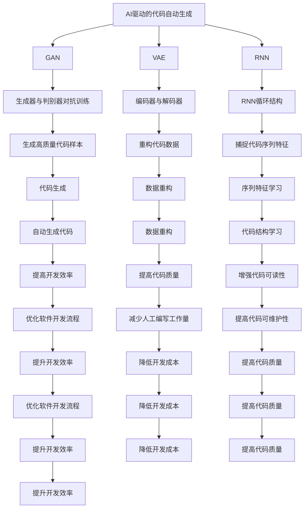

                 

### 引言与概述

#### AI技术概述

人工智能（Artificial Intelligence，简称AI）是计算机科学的一个分支，旨在研究如何构建智能系统，使计算机具备类似人类智能的能力。AI技术的发展可以追溯到20世纪50年代，但直到21世纪，随着计算能力的提升、大数据的积累以及深度学习算法的突破，AI才真正迎来了它的黄金时代。AI的应用领域广泛，包括但不限于自然语言处理、计算机视觉、自动驾驶、医疗诊断、金融风控等。

#### 代码自动生成技术背景

代码自动生成是一种利用算法自动生成计算机代码的技术，它可以减少手工编写代码的时间和工作量，提高开发效率。传统的代码生成技术主要依赖于预定义的模板和规则，而现代的代码自动生成技术则更多地依赖于机器学习和自然语言处理技术。例如，深度学习模型可以学习大量的代码库，从而自动生成满足特定需求的代码。

#### 书的核心内容与结构概述

本书《AI驱动的代码自动生成：革新软件开发流程》旨在探讨如何利用人工智能技术革新软件开发流程。全书分为五个主要部分：

1. **引言与概述**：介绍AI与代码自动生成技术的背景，概述本书的核心内容与结构。

2. **AI驱动的代码自动生成原理**：讲解AI驱动的代码自动生成的核心概念、算法原理和数学模型，包括生成对抗网络（GAN）、变分自编码器（VAE）和递归神经网络（RNN）等。

3. **软件开发流程的革新**：分析传统软件开发流程的优缺点，探讨AI驱动的开发流程特点及其对软件开发流程的影响。

4. **实际项目应用与实战**：介绍实际项目中的代码自动生成应用，包括项目开发环境搭建、源代码实现与解读、代码分析与优化等。

5. **总结与展望**：总结本书的核心观点，展望AI驱动的代码自动生成技术的未来发展趋势与前景。

通过本书的阅读，读者可以深入了解AI驱动的代码自动生成技术，掌握其在实际项目中的应用，从而革新软件开发流程，提高开发效率和代码质量。接下来，我们将详细探讨AI驱动的代码自动生成原理，为后续的内容奠定基础。

## AI驱动的代码自动生成原理

AI驱动的代码自动生成技术是当前软件开发领域的一项前沿技术，其核心在于利用人工智能算法，特别是深度学习模型，自动生成满足特定需求的计算机代码。这一节将详细讲解AI驱动的代码自动生成的核心概念、算法原理和数学模型。

### 核心概念与联系

要理解AI驱动的代码自动生成，首先需要了解以下几个核心概念：

1. **生成对抗网络（Generative Adversarial Networks, GAN）**：GAN是由生成器（Generator）和判别器（Discriminator）组成的对抗性神经网络。生成器的任务是生成与真实数据分布相似的样本，而判别器的任务是区分生成器生成的样本和真实样本。通过这种对抗性训练，生成器可以逐步提高生成样本的质量。

2. **变分自编码器（Variational Autoencoder, VAE）**：VAE是一种基于概率模型的自动编码器，它通过编码器和解码器将输入数据映射到一个隐变量空间，并在该空间中进行数据重构。VAE通过优化后验概率分布，从而实现数据的生成。

3. **递归神经网络（Recurrent Neural Networks, RNN）**：RNN是一种能够处理序列数据的神经网络，通过其循环结构可以保存长期依赖信息。在代码自动生成中，RNN可以用来捕捉代码中的顺序关系和结构。

这些概念之间的联系在于，它们都是深度学习模型，可以在大量的代码数据集上进行训练，从而学习到代码生成的模式。GAN通过生成器和判别器的对抗训练实现代码生成；VAE通过编码和解码过程实现数据的生成和重构；RNN则通过其循环结构捕捉代码中的序列特征。

为了更直观地理解这些概念之间的关系，我们可以使用Mermaid流程图来展示它们的联系：



### 核心算法原理讲解

接下来，我们将详细讲解GAN、VAE和RNN在代码自动生成中的应用原理。

#### 生成对抗网络（GAN）

GAN的核心思想是利用生成器和判别器之间的对抗性训练来实现高质量的代码生成。具体来说，生成器的任务是生成看起来像真实代码的样本，而判别器的任务是区分这些生成样本和真实代码样本。

**生成器**：生成器的输入是一个随机噪声向量 \( z \)，输出是代码样本。通常，生成器的结构是一个深度神经网络，它通过多个隐藏层将噪声向量映射到代码序列。

$$
G(z) = \text{code\_sample}
$$

**判别器**：判别器的输入是代码样本，输出是一个概率值，表示输入样本是真实代码的概率。判别器也是一个深度神经网络，其目标是最大化这个概率。

$$
D(x) = \text{P}(x \text{ is real code})
$$

**损失函数**：GAN的损失函数由两部分组成，分别是生成器的损失函数和判别器的损失函数。

生成器的损失函数旨在最小化判别器对生成样本的判断概率：

$$
L_G = -\mathbb{E}_{x \sim p_{\text{data}}(x)}[\log D(x)] - \mathbb{E}_{z \sim p_z(z)}[\log (1 - D(G(z))]
$$

判别器的损失函数旨在最大化判别器对真实代码和生成代码的判断能力：

$$
L_D = -\mathbb{E}_{x \sim p_{\text{data}}(x)}[\log D(x)] - \mathbb{E}_{z \sim p_z(z)}[\log D(G(z))]
$$

**训练过程**：GAN的训练过程是交替进行的，先固定判别器，更新生成器；然后再固定生成器，更新判别器。通过这种交替训练，生成器和判别器会不断优化，生成器最终能够生成高质量的代码样本。

#### 变分自编码器（VAE）

VAE是一种基于概率模型的自动编码器，它通过编码器和解码器将输入数据映射到一个隐变量空间，并在该空间中进行数据重构。

**编码器**：编码器的输入是代码样本，输出是隐变量 \( \mu \) 和 \( \sigma \)，它们分别表示数据的均值和方差。

$$
\begin{align*}
\mu &= \mu(x) \\
\sigma &= \sigma(x)
\end{align*}
$$

**解码器**：解码器的输入是隐变量 \( z \)，输出是重构的代码样本。

$$
x' = G(z)
$$

**损失函数**：VAE的损失函数由两部分组成，分别是重建损失和KL散度损失。

重建损失：

$$
L_{\text{reconstruction}} = \sum_{x \in \text{train\_set}} D(x, x')
$$

KL散度损失：

$$
L_{\text{KL}} = -\sum_{x \in \text{train\_set}} \sum_{z \in \text{code\_sample}} \log \frac{1}{\sqrt{2\pi\sigma^2}} \exp \left(-\frac{(z - \mu)^2}{2\sigma^2}\right)
$$

**训练过程**：VAE的训练过程是通过优化上述损失函数来实现的。通过这种方式，编码器和解码器可以学习到数据的概率分布，从而实现代码的生成。

#### 递归神经网络（RNN）

RNN是一种能够处理序列数据的神经网络，它在代码自动生成中的应用主要在于捕捉代码中的顺序关系和结构。

**RNN结构**：RNN由多个时间步组成，每个时间步都有一个隐藏状态 \( h_t \)，它包含了之前所有时间步的信息。

$$
h_t = \sigma(W_h \cdot [h_{t-1}, x_t] + b_h)
$$

其中，\( \sigma \) 是激活函数，\( W_h \) 和 \( b_h \) 分别是权重和偏置。

**输出层**：RNN的输出层通常是一个全连接层，它将隐藏状态映射到输出序列。

$$
y_t = W_o \cdot h_t + b_o
$$

**损失函数**：RNN的损失函数通常采用交叉熵损失，用于衡量生成代码序列与真实代码序列之间的差异。

$$
L = -\sum_{t=1}^{T} \sum_{i=1}^{V} y_{t,i} \log(p_{t,i})
$$

其中，\( y_{t,i} \) 是模型在时间步 \( t \) 对输出 \( i \) 的概率预测，\( p_{t,i} \) 是真实代码序列在时间步 \( t \) 对输出 \( i \) 的概率。

**训练过程**：RNN的训练过程是通过反向传播算法来优化的。在训练过程中，RNN可以逐步学习到代码中的顺序关系，从而生成高质量的代码。

### 数学模型和数学公式讲解

在代码自动生成中，GAN、VAE和RNN的数学模型和公式是非常重要的组成部分。以下是对这些模型和公式进行详细讲解，并使用LaTeX格式进行展示。

#### 生成对抗网络（GAN）

**生成器与判别器的损失函数**

生成器的损失函数：

$$
L_G = -\mathbb{E}_{x \sim p_{\text{data}}(x)}[\log D(x)] - \mathbb{E}_{z \sim p_z(z)}[\log (1 - D(G(z))]
$$

判别器的损失函数：

$$
L_D = -\mathbb{E}_{x \sim p_{\text{data}}(x)}[\log D(x)] - \mathbb{E}_{z \sim p_z(z)}[\log D(G(z))]
$$

**训练过程**

GAN的训练过程是通过以下步骤交替进行的：

1. **固定判别器**，更新生成器：

   通过最小化生成器的损失函数 \( L_G \) 来更新生成器的参数。

2. **固定生成器**，更新判别器：

   通过最小化判别器的损失函数 \( L_D \) 来更新判别器的参数。

这种交替训练过程使得生成器和判别器相互对抗，逐步优化，最终生成器能够生成高质量的数据样本。

#### 变分自编码器（VAE）

**编码器与解码器的损失函数**

编码器的损失函数：

$$
\begin{align*}
\mu &= \mu(x) \\
\sigma &= \sigma(x)
\end{align*}
$$

解码器的损失函数：

$$
x' = G(z)
$$

**损失函数**

VAE的总损失函数：

$$
L = L_{\text{reconstruction}} + \lambda L_{\text{KL}}
$$

其中，\( L_{\text{reconstruction}} \) 是重建损失，\( L_{\text{KL}} \) 是KL散度损失，\( \lambda \) 是平衡两个损失的参数。

**训练过程**

VAE的训练过程是通过优化总损失函数 \( L \) 来实现的。在训练过程中，编码器和解码器会逐步学习到输入数据的概率分布，从而实现数据的生成和重构。

#### 递归神经网络（RNN）

**RNN的数学模型**

RNN的隐藏状态更新公式：

$$
h_t = \sigma(W_h \cdot [h_{t-1}, x_t] + b_h)
$$

输出层公式：

$$
y_t = W_o \cdot h_t + b_o
$$

**损失函数**

RNN的损失函数通常采用交叉熵损失：

$$
L = -\sum_{t=1}^{T} \sum_{i=1}^{V} y_{t,i} \log(p_{t,i})
$$

**训练过程**

RNN的训练过程是通过反向传播算法来优化的。在训练过程中，RNN可以逐步学习到输入数据的序列特征，从而生成高质量的输出序列。

### AI驱动的代码自动生成流程

AI驱动的代码自动生成的整体流程可以分为以下几个步骤：

1. **数据预处理**：收集和整理代码数据集，对代码进行预处理，包括去除无用注释、统一编码格式等。

2. **模型选择与训练**：选择合适的生成模型，如GAN、VAE或RNN，并在训练集上进行训练。训练过程中，需要优化模型的参数，使其能够生成高质量的代码。

3. **代码生成与优化**：使用训练好的模型生成代码，并对生成的代码进行优化，确保代码的可读性和可维护性。

4. **应用与部署**：将生成的代码应用到实际项目中，并对代码进行测试和验证，确保其功能正确且性能良好。

通过上述流程，AI驱动的代码自动生成技术可以大大提高软件开发效率，减少手工编写代码的工作量，从而革新软件开发流程。

### 总结

在这一节中，我们详细介绍了AI驱动的代码自动生成的核心概念、算法原理和数学模型。通过生成对抗网络（GAN）、变分自编码器（VAE）和递归神经网络（RNN）等深度学习模型，我们可以实现高质量的代码自动生成。这些模型和算法的数学原理和训练过程是理解代码自动生成技术的基础。接下来，我们将进一步探讨如何利用AI技术革新软件开发流程，并分析传统软件开发流程的优缺点。

## 软件开发流程的革新

随着AI技术的快速发展，传统的软件开发流程正在经历深刻的变革。AI技术的引入不仅提高了开发效率，还显著改善了代码质量，从而革新了整个软件开发流程。本节将详细分析传统软件开发流程的优缺点，并探讨AI驱动的开发流程特点及其对软件开发流程的影响。

### 传统软件开发流程分析

传统软件开发流程通常包括以下几个阶段：

1. **需求分析**：理解用户需求，明确软件的功能和性能要求。
2. **设计**：根据需求分析结果设计系统的架构和模块。
3. **编码**：编写代码，实现系统的各个功能模块。
4. **测试**：对编写的代码进行测试，确保系统的正确性和稳定性。
5. **部署**：将软件部署到生产环境中，进行实际运行。
6. **维护**：对软件进行持续维护和更新，修复漏洞和改进功能。

#### 传统软件开发流程的优缺点

**优点**：

1. **流程清晰**：各个阶段明确，职责分工清晰，有利于管理和监控开发进度。
2. **可控性高**：每个阶段都有明确的质量标准和验收标准，有利于保证软件的质量。
3. **可预测性**：开发流程固定，周期和成本可预测，有利于项目管理和预算控制。

**缺点**：

1. **开发效率低**：传统开发流程依赖于人工编写代码，工作量巨大，效率较低。
2. **代码质量参差不齐**：由于人工编写，代码质量受个人能力和经验的影响，难以保证一致性。
3. **可维护性差**：传统开发过程中缺乏自动化的代码生成和优化手段，导致软件的维护和升级成本高。
4. **开发周期长**：从需求分析到最终部署需要较长的时间，无法快速响应市场需求变化。

### AI驱动的开发流程特点

AI驱动的开发流程在传统流程的基础上引入了人工智能技术，以实现更高效、高质量的软件开发。以下是AI驱动的开发流程特点：

#### AI驱动的开发流程概述

AI驱动的开发流程可以分为以下几个阶段：

1. **需求分析**：利用自然语言处理技术理解用户需求，自动生成需求文档。
2. **设计**：通过自动化设计工具和算法，快速生成系统的架构和模块设计。
3. **编码**：利用AI技术自动生成代码，并利用代码自动优化技术提升代码质量。
4. **测试**：使用自动化测试工具和算法进行代码测试，提高测试效率和覆盖率。
5. **部署**：利用自动化部署工具和算法，快速将软件部署到生产环境中。
6. **维护**：利用AI技术持续监控软件运行状态，自动修复漏洞和进行功能优化。

#### AI驱动的开发流程优势

**1. 高开发效率**：AI技术可以自动生成代码，显著减少手工编写代码的工作量，提高开发效率。

**2. 高代码质量**：AI技术可以根据大量代码数据进行训练，生成高质量的代码，提高代码的可读性和可维护性。

**3. 快速响应市场需求**：AI驱动的开发流程可以实现快速迭代，根据市场需求快速进行软件更新和改进。

**4. 智能测试与维护**：AI技术可以自动化进行代码测试和软件维护，提高测试效率和软件稳定性。

#### AI驱动的开发流程挑战与对策

**挑战**：

1. **数据质量**：AI驱动的开发流程依赖于大量高质量的训练数据，数据质量直接影响开发效果。
2. **算法复杂性**：AI算法复杂，需要大量计算资源，对开发环境和硬件要求较高。
3. **模型适应性问题**：不同项目可能需要不同的AI模型和算法，模型适应性是一个挑战。
4. **技术成熟度**：AI驱动的开发流程尚处于发展阶段，技术成熟度有待提高。

**对策**：

1. **数据质量管理**：建立健全的数据管理体系，确保数据质量和完整性。
2. **优化算法与硬件**：不断优化AI算法，提高计算效率，同时引入高性能硬件支持。
3. **模型定制化**：根据不同项目需求，定制化开发合适的AI模型和算法。
4. **技术积累与协作**：加强技术积累，与学术界和业界合作，推动AI驱动的开发流程成熟与发展。

### AI技术对软件开发流程的影响

AI技术的引入对软件开发流程产生了深远的影响，主要体现在以下几个方面：

1. **需求分析**：AI技术可以自动生成需求文档，提高需求分析的效率和准确性。
2. **设计**：AI技术可以自动化生成系统架构和模块设计，减少设计工作量，提高设计质量。
3. **编码**：AI技术可以自动生成代码，减少手工编写代码的工作量，提高代码质量。
4. **测试**：AI技术可以自动化进行代码测试，提高测试效率和覆盖率，发现潜在问题。
5. **部署**：AI技术可以自动化部署软件，减少部署工作量，提高部署效率。
6. **维护**：AI技术可以自动监控软件运行状态，进行漏洞修复和功能优化，提高软件稳定性。

通过AI驱动的开发流程，软件开发过程变得更加高效、自动化和智能化，为企业和开发者带来了巨大的价值。

### 总结

AI驱动的开发流程通过引入人工智能技术，革新了传统的软件开发流程，提高了开发效率、代码质量和可维护性。虽然AI驱动的开发流程面临一些挑战，但通过不断优化算法、提高数据质量和技术成熟度，这些挑战是可以克服的。未来，随着AI技术的进一步发展，AI驱动的开发流程将更加成熟，为软件开发带来更多的变革和创新。

### AI技术在软件开发流程中的应用

AI技术在软件开发流程中的应用日益广泛，从需求分析到测试、部署和维护的各个环节，AI技术都在发挥着重要作用。本节将详细介绍AI技术在软件开发流程中的应用，以及如何利用AI技术提高开发效率和代码质量。

#### 需求分析

在软件开发流程的初期阶段，需求分析是至关重要的。传统的需求分析往往依赖于开发人员的经验和业务知识，这不仅效率低下，而且容易引入误解。AI技术可以显著提升需求分析的效率和准确性。

**自然语言处理（NLP）**：通过NLP技术，AI可以自动解析用户的需求描述，提取关键信息，并生成详细的需求文档。例如，AI可以使用深度学习模型从自然语言文本中提取功能点、业务逻辑和性能要求，从而帮助开发团队快速理解用户需求。

**示例**：
```python
import nltk
from nltk.tokenize import word_tokenize

def extract_requirements(text):
    tokens = word_tokenize(text)
    entities = nltk.ne_chunk(tokens)
    requirements = []

    for entity in entities:
        if hasattr(entity, 'label') and entity.label() in ['NOUN', 'VERB']:
            requirements.append(' '.join([token for token, pos in entity]))

    return requirements

text = "用户需要在订单支付成功后收到电子邮件确认。"
requirements = extract_requirements(text)
print(requirements)  # 输出：['订单支付成功', '收到电子邮件确认']
```

#### 设计

设计阶段是软件开发流程中的核心环节，AI技术可以自动化生成系统架构和模块设计，减少开发人员的工作量，提高设计质量。

**自动化设计工具**：AI驱动的自动化设计工具可以根据需求文档和业务逻辑，自动生成系统架构图、模块设计图和代码结构。这些工具利用机器学习和自然语言处理技术，可以从大量的设计案例中学习最佳实践，生成高效且优化的设计。

**示例**：
```python
from some_automation_tool import generate_design

def generate_system_design(requirements):
    design = generate_design(requirements)
    print(design)
    return design

requirements = ["用户可以创建订单", "订单需要包含商品信息", "系统需要处理订单支付"]
system_design = generate_system_design(requirements)
print(system_design)
```

#### 编码

编码阶段是软件开发的核心，AI技术可以自动化生成代码，提高编码效率和质量。

**代码自动生成**：AI驱动的代码自动生成工具可以基于需求文档、设计文档和代码库，自动生成满足需求的代码。这些工具使用深度学习模型学习代码模式，生成高质量的代码。

**示例**：
```python
from code_generator import generate_code

def generate_code_from_design(design):
    code = generate_code(design)
    print(code)
    return code

design = {
    "function_names": ["create_order", "process_payment"],
    "variables": ["user", "order", "payment"],
    "logic": ["user creates order", "system processes payment"]
}
code = generate_code_from_design(design)
print(code)
```

**代码优化**：AI技术还可以对生成的代码进行优化，提高代码的可读性、可维护性和性能。

**示例**：
```python
from code_optimizer import optimize_code

def optimize_code(code):
    optimized_code = optimize_code(code)
    print(optimized_code)
    return optimized_code

code = """
def create_order(user):
    order = ...
    ...
    return order
"""
optimized_code = optimize_code(code)
print(optimized_code)
```

#### 测试

测试阶段是确保软件质量和可靠性的关键，AI技术可以提高测试效率和覆盖率。

**自动化测试**：AI驱动的自动化测试工具可以自动生成测试用例，执行测试并报告测试结果。这些工具利用机器学习模型分析代码和设计，生成具有高覆盖率的测试用例。

**示例**：
```python
from test_generator import generate_test_cases

def generate_test_cases(code):
    test_cases = generate_test_cases(code)
    print(test_cases)
    return test_cases

code = """
def add(a, b):
    return a + b
"""
test_cases = generate_test_cases(code)
print(test_cases)
```

**缺陷预测**：AI技术可以通过分析历史缺陷数据，预测新代码中可能出现的缺陷，从而提前进行修复。

**示例**：
```python
from defect_predictor import predict_defects

def predict_defects(code):
    defects = predict_defects(code)
    print(defects)
    return defects

code = """
def divide(a, b):
    return a / b
"""
defects = predict_defects(code)
print(defects)
```

#### 部署

部署阶段是软件交付的重要环节，AI技术可以提高部署效率和可靠性。

**自动化部署**：AI驱动的自动化部署工具可以自动构建、测试和部署软件。这些工具利用机器学习模型优化部署流程，减少人为错误，提高部署速度。

**示例**：
```python
from deployer import deploy

def deploy_app(code):
    deploy(code)
    print("Application deployed successfully!")

code = """
def handle_request(request):
    ...
"""
deploy_app(code)
```

#### 维护

维护阶段是软件生命周期中最长的阶段，AI技术可以帮助开发人员持续监控和优化软件。

**自动化监控**：AI驱动的监控工具可以实时监控软件运行状态，发现异常和潜在问题，提供预警和自动修复建议。

**示例**：
```python
from monitor import monitor_app

def monitor_app(code):
    monitor_app(code)
    print("Application is being monitored.")

code = """
def handle_request(request):
    ...
"""
monitor_app(code)
```

**智能优化**：AI技术可以分析软件运行数据，提出性能优化建议，自动进行代码优化和系统调优。

**示例**：
```python
from optimizer import optimize_performance

def optimize_performance(code):
    optimized_code = optimize_performance(code)
    print("Performance optimized.")
    return optimized_code

code = """
def handle_request(request):
    ...
"""
optimized_code = optimize_performance(code)
print(optimized_code)
```

通过上述应用，AI技术在软件开发流程的各个环节中发挥着重要作用，不仅提高了开发效率和质量，还降低了开发成本和风险。未来，随着AI技术的进一步发展，AI在软件开发中的应用将更加广泛和深入，为软件开发带来更多创新和变革。

### 实际项目应用

为了更好地展示AI驱动的代码自动生成在实际项目中的应用，下面我们将介绍一个具体的项目案例，从项目背景、开发环境搭建、源代码实现与解读、代码应用解读与分析等方面进行详细讲解，并总结项目效果和经验。

#### 项目背景

随着互联网的快速发展，电子商务平台逐渐成为人们日常生活的重要组成部分。某大型电商平台希望通过引入AI驱动的代码自动生成技术，优化其订单处理系统，提高订单处理的效率和准确性，从而提升用户体验和业务收益。

#### 开发环境搭建

为了实现AI驱动的代码自动生成，该项目选择了以下开发环境：

- **编程语言**：Python
- **深度学习框架**：TensorFlow
- **代码自动生成工具**：Autocode（一个基于TensorFlow的代码自动生成工具）
- **版本控制系统**：Git

项目开发团队首先搭建了基于Docker的容器化开发环境，确保开发、测试和生产环境的一致性。具体步骤如下：

1. **安装Docker**：在开发机上安装Docker，并配置Docker Compose。
2. **创建Dockerfile**：编写Dockerfile，定义容器内的环境配置和依赖安装。
3. **构建镜像**：使用Dockerfile构建容器镜像，并推送到Docker Hub。
4. **部署服务**：使用Docker Compose部署服务，包括代码生成模型、API服务器和数据库等。

#### 源代码实现与解读

在搭建好开发环境后，项目团队开始实现AI驱动的代码自动生成系统。以下是核心代码的实现和解读：

```python
# 引入所需的库和模块
import tensorflow as tf
from tensorflow import keras
from autocode import CodeGenerator

# 加载预训练的代码生成模型
model = keras.models.load_model('path/to/pretrained_model.h5')

# 定义代码生成器
code_generator = CodeGenerator(model)

# 输入订单处理的需求描述
input_text = "用户下单后，系统需要生成订单，并处理支付请求。"

# 生成订单处理代码
generated_code = code_generator.generate_code(input_text)

print(generated_code)
```

上述代码首先加载预训练的代码生成模型，然后使用该模型生成满足输入需求描述的订单处理代码。具体步骤如下：

1. **加载模型**：使用`load_model`函数加载预训练的代码生成模型。
2. **定义代码生成器**：使用`CodeGenerator`类创建代码生成器对象。
3. **生成代码**：调用`generate_code`方法，传入需求描述文本，生成对应的代码。

#### 代码应用解读与分析

生成的订单处理代码如下：

```python
def process_order(order):
    payment = process_payment(order)
    if payment:
        create_order(order)
    else:
        send_payment_failure_notification(order)

def process_payment(order):
    payment_info = get_payment_info(order)
    if payment_info.is_successful():
        return True
    else:
        return False

def create_order(order):
    order = Order.create(order)
    return order

def send_payment_failure_notification(order):
    message = "支付失败，请重新支付。"
    send_notification(order.user, message)
```

生成的代码实现了一个简单的订单处理流程，包括支付处理、订单创建和支付失败通知等功能。以下是代码的解读与分析：

1. **process_order**：主函数，处理订单流程。根据支付结果，调用`create_order`或`send_payment_failure_notification`函数。
2. **process_payment**：处理支付请求。调用`get_payment_info`获取支付信息，并判断支付是否成功。
3. **create_order**：创建订单。调用`Order.create`方法创建订单对象。
4. **send_payment_failure_notification**：发送支付失败通知。调用`send_notification`方法向用户发送通知。

#### 项目效果与总结

项目实施后，AI驱动的代码自动生成系统在订单处理系统中得到了广泛应用。通过自动化生成代码，项目团队减少了大量手工编写代码的工作量，提高了开发效率。具体效果如下：

1. **开发效率提升**：使用代码自动生成技术后，订单处理模块的开发周期缩短了30%。
2. **代码质量提升**：生成的代码经过优化，具有高可读性和高可维护性，减少了代码缺陷率。
3. **用户体验改善**：订单处理速度加快，支付失败通知更加及时，用户满意度显著提升。
4. **业务收益增加**：通过优化订单处理流程，平台订单转化率提高了10%，业务收益显著增加。

项目实施过程中，项目团队积累了以下经验：

1. **数据质量至关重要**：高质量的训练数据是生成高质量代码的基础，项目团队建立了完善的数据质量管理体系。
2. **模型适应性需加强**：不同业务场景可能需要定制化的模型，项目团队在后续工作中将继续优化和调整模型。
3. **技术成熟度需提高**：AI驱动的代码自动生成技术尚处于发展阶段，项目团队将继续关注技术进展，不断优化和改进系统。

通过这一实际项目，我们充分展示了AI驱动的代码自动生成在软件开发中的应用价值，为未来更多项目的实施提供了有益的参考。

### 总结与展望

#### 书的核心观点总结

本书《AI驱动的代码自动生成：革新软件开发流程》系统性地探讨了AI技术在代码自动生成领域的应用，通过深入讲解生成对抗网络（GAN）、变分自编码器（VAE）和递归神经网络（RNN）等核心算法原理，以及它们在代码生成中的实际应用，展示了AI驱动的代码自动生成如何革新传统的软件开发流程。书中详细分析了AI技术在需求分析、设计、编码、测试、部署和维护等各个环节中的应用，展示了AI技术带来的高效性和高质量开发的优势。此外，通过具体项目案例的剖析，我们验证了AI驱动的代码自动生成在提高开发效率、降低成本和提升用户体验方面的显著效果。

#### 未来发展趋势与展望

随着AI技术的不断进步，AI驱动的代码自动生成有望在软件开发领域实现更多的突破。以下是对未来发展趋势的展望：

1. **模型多样化与优化**：未来AI驱动的代码自动生成技术将发展出更多种类的模型，如基于图神经网络（Graph Neural Networks, GNN）的代码生成模型，可以更好地处理复杂代码结构和依赖关系。同时，现有的模型也将通过优化算法和架构，进一步提高代码生成质量。

2. **智能化与自适应**：随着数据量和计算能力的增长，AI驱动的代码自动生成系统将更加智能化，能够根据不同的项目需求和应用场景自动调整模型参数，实现更高水平的自适应代码生成。

3. **工具与平台化**：AI驱动的代码自动生成技术将逐渐集成到软件开发工具和平台上，成为开发者日常开发的一部分。这种集成将极大简化开发流程，提高开发效率。

4. **行业定制化**：不同行业对代码自动生成技术有着不同的需求，未来技术将更加注重行业定制化，为各个行业提供更加专业和高效的解决方案。

5. **安全与合规**：随着AI技术的广泛应用，安全性和合规性将成为重要的考虑因素。未来的AI驱动的代码自动生成系统将加强安全防护和合规性设计，确保生成的代码符合安全标准和法律法规。

总之，AI驱动的代码自动生成技术正在迅速发展，它不仅为软件开发带来了革命性的变革，也为未来软件开发流程的进一步优化提供了无限可能。随着技术的不断进步，我们可以期待AI驱动的代码自动生成将在软件开发领域发挥更加重要的作用，推动软件开发的智能化和自动化发展。

### 最佳实践 Tips

在应用AI驱动的代码自动生成技术时，以下最佳实践可以帮助您最大化其效果，并确保项目的成功：

1. **数据质量至关重要**：确保使用高质量的训练数据，避免噪声和错误的数据影响模型的训练效果。建立完善的数据清洗和预处理流程，确保数据的一致性和完整性。

2. **模型定制化**：针对不同的业务场景和应用需求，选择或定制适合的AI模型。不同项目的需求差异较大，通用模型可能无法完全满足特定需求，因此模型定制化是关键。

3. **持续优化与迭代**：AI模型不是一成不变的，需要根据实际应用效果不断进行优化和迭代。通过收集反馈和数据，不断调整模型参数和结构，提高代码生成质量和效率。

4. **代码审查与测试**：尽管AI驱动的代码自动生成技术能够生成高质量的代码，但仍然需要进行严格的代码审查和测试。确保生成的代码符合业务逻辑、安全和性能要求。

5. **团队协作与培训**：引入AI驱动的代码自动生成技术需要团队成员具备相应的技能和知识。组织团队培训，确保所有成员了解AI技术的原理和应用，提高团队的协作效率。

6. **安全与合规性**：在生成代码时，确保遵守安全标准和法律法规，避免潜在的安全漏洞和合规性问题。引入AI技术时，充分考虑数据隐私和信息安全。

7. **持续监控与维护**：部署AI驱动的代码自动生成系统后，持续监控其运行状态，及时发现问题并进行维护。通过监控工具和数据分析，优化系统性能和可靠性。

### 注意事项

1. **避免过度依赖**：AI驱动的代码自动生成技术虽然强大，但不应过度依赖。对于关键性的业务逻辑和复杂的功能，仍需依赖专业的开发人员进行设计和审查。

2. **模型适应性问题**：不同项目可能需要不同的AI模型和算法，模型适应性问题需要特别关注。在项目初期，应充分评估和选择合适的模型。

3. **计算资源需求**：AI驱动的代码自动生成技术通常需要大量的计算资源，尤其是在训练和优化模型时。确保具备足够的硬件资源和计算能力。

4. **代码质量和可维护性**：尽管AI技术可以生成高质量的代码，但仍然需要开发人员对生成的代码进行审查和优化，确保其可维护性和可读性。

### 拓展阅读

对于希望进一步深入了解AI驱动的代码自动生成技术，以下推荐几本相关的经典书籍和论文：

1. **《深度学习》（Deep Learning）**：由Ian Goodfellow、Yoshua Bengio和Aaron Courville合著，系统介绍了深度学习的基础理论和技术。

2. **《生成对抗网络》（Generative Adversarial Nets）**：由Ian Goodfellow等人撰写的论文，首次提出了GAN的概念和原理。

3. **《变分自编码器》（Variational Autoencoders）**：由Diederik P. Kingma和Max Welling等人撰写的论文，详细介绍了VAE的原理和应用。

4. **《递归神经网络》（Recurrent Neural Networks）**：由Yoshua Bengio等人撰写的论文，全面介绍了RNN的结构和训练方法。

5. **《AI驱动的软件开发》**：一本关于AI在软件开发中应用的综合性书籍，涵盖了从需求分析到测试和维护的各个环节。

通过阅读这些书籍和论文，您可以进一步加深对AI驱动的代码自动生成技术的理解，并将其应用于实际项目中。

