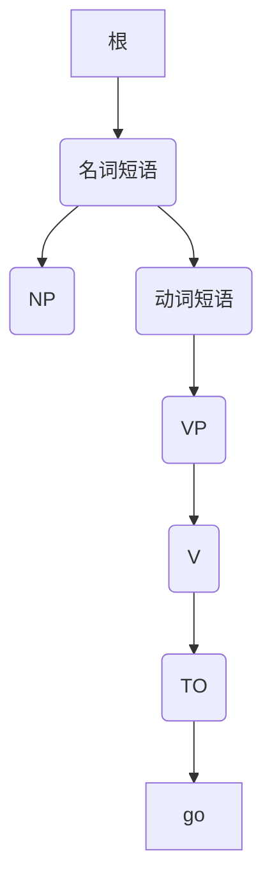
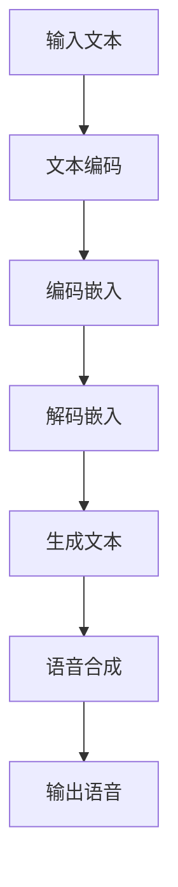
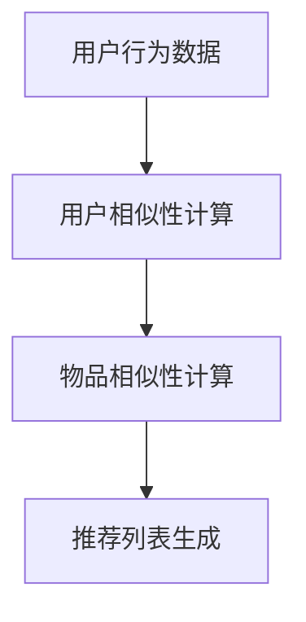
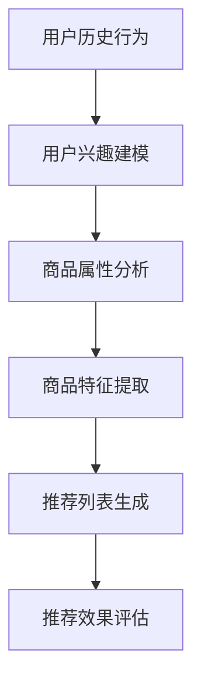
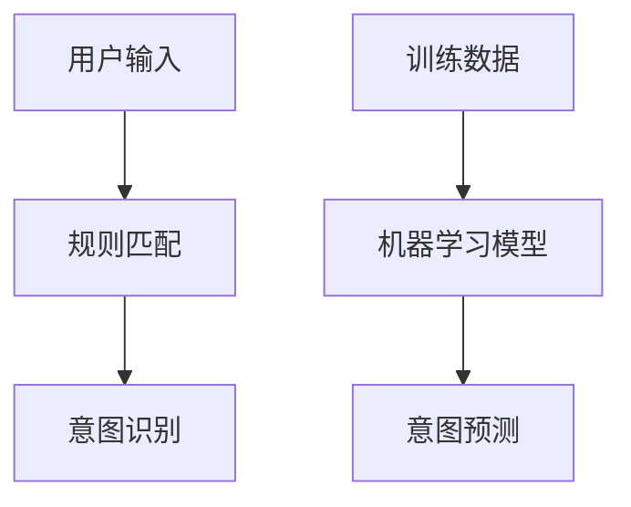
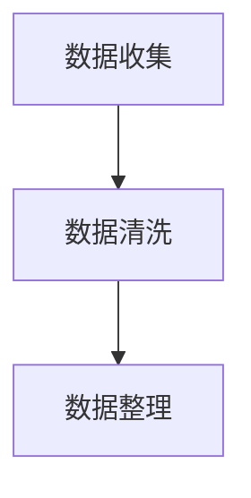
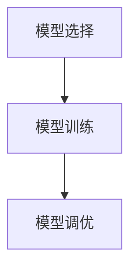
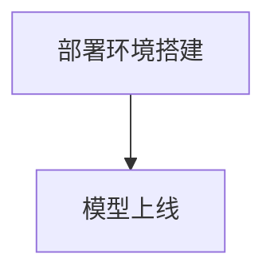
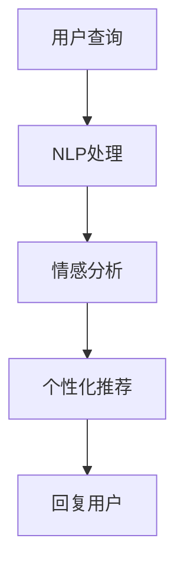
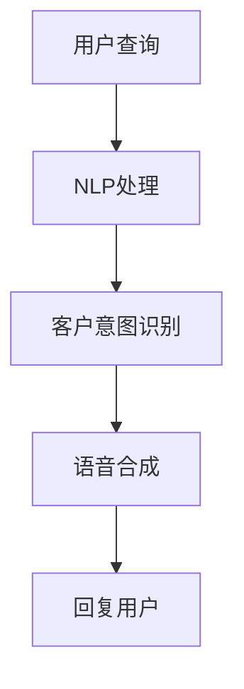

                 

### 文章标题：AI驱动的客户服务：提升用户体验的新策略

### 关键词：
- AI
- 客户服务
- 用户体验
- 自然语言处理
- 个性化推荐
- 情感分析

### 摘要：
本文将深入探讨人工智能（AI）在客户服务领域的应用，通过分析AI驱动的客户服务的背景、优势、应用场景和实际案例，旨在为企业和开发者提供一套提升用户体验的新策略。文章结构紧凑，逻辑清晰，以逐步分析推理的方式，详细阐述了AI技术如何赋能客户服务，从而实现高效、智能和个性化的用户体验。### 第一部分：AI驱动的客户服务概述

#### 1.1 AI驱动的客户服务背景

##### 1.1.1 客户服务现状分析

在现代商业环境中，客户服务是企业与客户之间的桥梁，其质量直接关系到企业的声誉和竞争力。然而，随着客户需求的日益多样化和服务渠道的多元化，传统客户服务模式面临着巨大的挑战：

- **服务渠道多样化**：传统的电话和邮件服务已无法满足客户的需求，社交媒体、在线聊天和移动应用等新兴渠道不断增加。
- **客户期望不断提高**：现代客户期望快速、高效和个性化的服务体验，对企业的响应速度和服务质量提出了更高的要求。
- **人力成本高**：传统的客户服务依赖于大量的人力资源，导致运营成本高，效率低下。

##### 1.1.2 AI技术赋能客户服务

人工智能技术的快速发展为解决上述问题提供了新的思路和解决方案。AI驱动的客户服务通过引入自然语言处理（NLP）、机器学习、情感分析等先进技术，能够实现以下目标：

- **自动化处理**：通过自动化聊天机器人，能够快速响应用户的咨询，减少人力成本，提高服务效率。
- **个性化服务**：基于用户行为和偏好，AI可以提供个性化的服务推荐，提升用户体验。
- **情感分析**：通过情感分析技术，AI能够识别客户的情感状态，提供更加贴心的服务。

#### 1.2 AI驱动的客户服务优势

##### 1.2.1 提升效率

AI驱动的客户服务能够通过自动化处理大量重复性任务，如常见问题的回答、预约管理等，大大提高了服务效率。同时，AI可以24/7不间断工作，无需休息，确保客户在任何时间都能获得及时的响应。

##### 1.2.2 提高客户满意度

通过提供个性化服务和快速响应，AI驱动的客户服务能够显著提高客户满意度。个性化推荐和情感分析等技术使服务更加贴近客户需求，提升客户的体验和忠诚度。

##### 1.2.3 降低运营成本

自动化和智能化的服务模式降低了人力成本，同时减少了硬件和通信成本，为企业带来了显著的运营成本降低。

#### 1.3 AI驱动的客户服务发展趋势

随着AI技术的不断进步，AI驱动的客户服务预计将朝着更加智能化、个性化的方向发展。未来，我们将看到更多基于深度学习和自然语言处理的高级AI客服系统，以及跨渠道、跨平台的全场景客户服务体系。

### 小结
本部分介绍了AI驱动的客户服务的背景和优势，通过分析传统客户服务面临的挑战，展示了AI技术如何赋能客户服务，从而实现高效、智能和个性化的用户体验。在接下来的部分，我们将深入探讨AI在客户服务中的应用场景和具体实现技术。### 第二部分：AI在客户服务中的应用

#### 2.1 自然语言处理

自然语言处理（NLP）是AI在客户服务中应用的核心技术之一，它使得机器能够理解、处理和生成自然语言，从而实现与用户的自然对话。NLP的主要应用包括语言理解和语言生成。

##### 2.1.1 语言理解

语言理解是NLP的基础，它包括词汇分析、句法分析和意图识别。

###### 2.1.1.1 词汇分析

词汇分析是对文本中的单词进行分解和分析，以提取出有意义的词汇和短语。这通常涉及词性标注和词频统计。

- **词性标注**：将文本中的每个词标注为名词、动词、形容词等。这有助于理解单词的语法角色。
- **词频统计**：统计文本中各个单词的出现频率，用于分析文本的主旨和重点。

```latex
% 伪代码：词性标注
def lexical_analysis(text):
    words = split_text_into_words(text)
    word_tags = part_of_speech_tagging(words)
    return word_tags
```

###### 2.1.1.2 句法分析

句法分析是对文本的语法结构进行分析，以理解句子的组成和结构。这包括句子的解析和句法树构建。

- **句子解析**：将句子分解为短语和子句，构建出句子的结构。
- **句法树构建**：通过语法规则和解析结果，构建出句子的句法树。



###### 2.1.1.3 意图识别

意图识别是理解用户输入的目的或意图。这对于自动化聊天机器人来说至关重要。

- **基于规则的模型**：通过定义一系列规则来匹配用户的输入，并据此推断出用户的意图。
- **基于机器学习的模型**：通过大量训练数据学习用户的意图，使用分类算法进行预测。

```latex
% 伪代码：意图识别
def recognize_intent(input_text):
    preprocessed_text = preprocess_text(input_text)
    intent = machine_learning_model.predict(preprocessed_text)
    return intent
```

##### 2.1.2 语言生成

语言生成是NLP的另一个重要应用，它使得机器能够生成自然语言文本，如回复用户的问题、生成产品描述等。

- **文本生成**：通过机器学习模型，如循环神经网络（RNN）和变压器（Transformer），生成符合语法和语义规则的文本。
- **语音合成**：将生成的文本转换为语音，通过语音合成技术如WaveNet，实现自然流畅的语音输出。



#### 2.2 情感分析

情感分析是识别文本中的情感倾向，如正面、负面或中性。它在客户服务中可以帮助企业了解客户反馈的情感状态，从而改进服务。

##### 2.2.1 情感分类

情感分类是将文本分为不同的情感类别。这通常涉及情感标签和情感分类算法。

- **实际案例分析**：通过分析实际客户反馈，识别出正面、负面和中和情感。
- **情感分类算法**：如支持向量机（SVM）、朴素贝叶斯（Naive Bayes）和深度学习模型（如卷积神经网络（CNN）和循环神经网络（RNN））。

```latex
% 数学公式：情感分类
P(y=c|\textbf{x}) = \frac{e^{\textbf{w}_y^T \textbf{x}}}{\sum_{c'} e^{\textbf{w}_{c'}^T \textbf{x}}}
```

##### 2.2.2 情感识别

情感识别是理解文本中的情感细节，如愉悦、愤怒或悲伤。这通常需要更复杂的模型和算法。

- **情感识别模型**：如基于规则的情感分析模型和基于深度学习的情感分析模型。
- **应用场景**：如社交媒体监控、客户反馈分析和市场研究。

#### 2.3 个性化推荐

个性化推荐是利用AI技术根据用户的历史行为和偏好，为用户提供个性化的产品或服务推荐。

##### 2.3.1 推荐系统基本原理

推荐系统的主要原理包括协同过滤和内容过滤。

- **协同过滤**：通过分析用户之间的相似性，推荐其他用户喜欢的内容。
- **内容过滤**：通过分析物品的特征，推荐与用户偏好相似的内容。



##### 2.3.2 个性化推荐策略

个性化推荐策略涉及用户兴趣建模、商品特征提取和推荐结果评估。

- **用户兴趣建模**：通过分析用户的历史行为，构建用户兴趣模型。
- **商品特征提取**：通过分析商品的属性，提取商品特征。
- **推荐结果评估**：通过评估推荐系统的效果，优化推荐算法。



#### 2.4 客户意图识别

客户意图识别是理解客户的实际需求，从而提供更加精准的服务。

##### 2.4.1 客户意图识别的重要性

客户意图识别对于提高客户满意度和忠诚度至关重要。它可以帮助企业快速响应客户需求，提供个性化的服务。

##### 2.4.2 客户意图识别算法

客户意图识别算法包括基于规则的模型和基于机器学习的模型。

- **基于规则的模型**：通过定义一系列规则，根据客户的输入推断出客户的意图。
- **基于机器学习的模型**：通过训练大量数据，学习客户的意图模式，进行预测。



### 小结
本部分详细介绍了AI在客户服务中的关键技术，包括自然语言处理、情感分析和个性化推荐。这些技术使得AI能够理解用户需求，提供个性化服务，从而提升用户体验。在接下来的部分，我们将探讨如何实施AI驱动的客户服务。### 第三部分：AI驱动客户服务的实施

#### 3.1 实施步骤

##### 3.1.1 数据收集

数据是AI驱动客户服务的基础。数据收集包括以下步骤：

- **数据来源**：收集来自客户互动、交易记录和社交媒体等多渠道的数据。
- **数据预处理**：清洗和整理数据，去除噪声和缺失值。



##### 3.1.2 模型训练

模型训练是AI驱动客户服务的核心。训练过程包括：

- **模型选择**：选择适合问题的模型，如卷积神经网络（CNN）、循环神经网络（RNN）等。
- **模型调优**：通过调整超参数，优化模型性能。



##### 3.1.3 模型部署

模型部署是将训练好的模型部署到生产环境中，包括：

- **部署环境搭建**：准备服务器、数据库和其他基础设施。
- **模型上线**：将模型部署到服务器，使其能够实时处理客户请求。



#### 3.2 案例分析

##### 3.2.1 案例一：电商客服AI系统

###### 3.2.1.1 案例概述

某电商企业通过引入AI客服系统，提高客户服务效率和满意度。AI客服系统能够自动回答常见问题，处理退货和换货等事务。

###### 3.2.1.2 技术实现

- **自然语言处理**：使用NLP技术处理用户查询，理解用户的意图。
- **情感分析**：分析用户反馈的情感，识别用户情绪，提供个性化的回复。
- **个性化推荐**：根据用户购买历史和偏好，推荐相关产品。



###### 3.2.1.3 效果评估

- **客户满意度**：通过调查，发现AI客服系统的引入显著提高了客户满意度。
- **服务效率**：AI客服系统能够快速处理大量查询，提高了服务效率。

##### 3.2.2 案例二：银行客服AI系统

###### 3.2.2.1 案例概述

某银行通过引入AI客服系统，提供24/7全天候的客户服务。AI客服系统能够回答常见问题，处理账户查询和转账等事务。

###### 3.2.2.2 技术实现

- **自然语言处理**：使用NLP技术处理用户查询，理解用户的意图。
- **客户意图识别**：通过机器学习模型识别用户意图，提供精准的回复。
- **语音合成**：将文本回复转换为语音，提供语音服务。



###### 3.2.2.3 效果评估

- **客户满意度**：通过调查，发现AI客服系统提高了客户的满意度和信任感。
- **服务效率**：AI客服系统能够处理大量查询，提高了服务效率，降低了运营成本。

### 小结
本部分详细介绍了AI驱动客户服务的实施步骤和实际案例。通过数据收集、模型训练和模型部署，企业能够构建高效、智能的客户服务体系。案例分析展示了AI驱动的客户服务在不同行业中的应用效果，为其他企业提供了借鉴。在未来的展望中，我们将探讨AI驱动客户服务的未来发展。### 第四部分：未来展望

#### 3.3.1 AI驱动的客户服务发展趋势

随着AI技术的不断进步，AI驱动的客户服务预计将朝着更加智能化、个性化的方向发展。以下是一些关键趋势：

- **多模态交互**：未来的AI客服系统将支持语音、文本、图像等多种交互方式，提供更加自然和丰富的用户体验。
- **增强现实（AR）与虚拟现实（VR）**：通过AR和VR技术，客户可以在虚拟环境中与AI客服进行交互，获得沉浸式的服务体验。
- **个性化和定制化服务**：AI将更加深入地了解客户需求，提供高度个性化的服务，甚至可以根据客户的历史行为和偏好进行主动服务。
- **跨渠道集成**：未来的AI客服系统将能够无缝集成不同的渠道，如社交媒体、聊天应用、移动应用等，提供一致的服务体验。

##### 3.3.1.1 技术进步

- **深度学习**：深度学习技术的不断进步将使得AI客服系统更加智能，能够处理复杂的对话和情感分析。
- **强化学习**：强化学习在AI客服中的应用将使系统能够通过自我学习和优化，提高服务质量和效率。
- **对话式AI**：对话式AI技术的发展将使得AI客服系统能够进行更加自然和流畅的对话，提高用户体验。

##### 3.3.1.2 应用领域拓展

- **医疗保健**：AI客服系统将用于医疗咨询、预约管理和患者关怀等方面，提高医疗服务的效率和患者满意度。
- **金融**：AI客服系统将用于银行、保险和投资等领域，提供个性化的财务建议和服务。
- **零售**：AI客服系统将用于电商、零售和物流等领域，提供个性化的购物体验和高效的订单处理。

##### 3.3.1.3 挑战与机遇

尽管AI驱动的客户服务具有巨大的潜力，但也面临着一系列挑战：

- **隐私保护**：随着AI系统的广泛应用，如何保护用户隐私成为一个重要议题。企业需要制定严格的隐私政策和安全措施。
- **伦理问题**：AI客服系统在处理敏感话题时，如医疗、金融等，需要确保其决策的伦理性和公正性。
- **技术成熟度**：AI技术的成熟度和可靠性仍然是一个挑战。企业需要不断更新和优化AI系统，以应对不断变化的市场需求。

然而，这些挑战也带来了机遇：

- **市场机会**：随着消费者对个性化服务和快速响应的需求不断增加，AI驱动的客户服务市场将迎来巨大的增长机会。
- **创新能力**：AI技术的快速发展为企业和开发者提供了无限的创新能力，可以打造出更加智能和高效的客户服务体系。

### 小结

未来，AI驱动的客户服务将在技术进步、应用领域拓展和解决挑战的过程中不断进化。通过智能化、个性化、多模态交互和跨渠道集成，AI客服系统将为企业和消费者带来更加高效和愉悦的服务体验。同时，企业需要积极应对隐私保护、伦理问题和技术成熟度等挑战，以确保AI客服系统的可持续发展。### 附录

#### 4.1 AI开发工具与框架

##### 4.1.1 TensorFlow

TensorFlow是一个开源的机器学习框架，由Google开发。它提供了丰富的API，支持各种深度学习模型的构建和训练。

- **官网**：[TensorFlow官网](https://www.tensorflow.org/)
- **文档**：[TensorFlow文档](https://www.tensorflow.org/tutorials)

##### 4.1.2 PyTorch

PyTorch是一个开源的深度学习库，由Facebook的人工智能研究团队开发。它以其灵活的动态计算图和直观的API而受到广泛使用。

- **官网**：[PyTorch官网](https://pytorch.org/)
- **文档**：[PyTorch文档](https://pytorch.org/docs/stable/index.html)

##### 4.1.3 其他常用工具

- **Scikit-learn**：一个开源的机器学习库，提供各种分类、回归和聚类算法。
- **Keras**：一个基于TensorFlow的高层次神经网络API，提供简洁的API和丰富的预训练模型。
- **OpenCV**：一个开源的计算机视觉库，用于图像和视频处理。

#### 4.2 数据集与案例库

##### 4.2.1 公开数据集

- **TREC**：TREC（Text REtrieval Conference）提供了一系列文本检索数据集。
- **Sogou**：Sogou提供中文对话系统数据集，适用于自然语言处理和对话系统研究。
- **IMDB**：IMDB提供电影评论数据集，用于情感分析和文本分类。

##### 4.2.2 开源案例库

- **GitHub**：GitHub上有很多开源的AI项目，可以参考和学习。
- **AI Challenger**：AI Challenger提供了一系列AI挑战赛的数据集和解决方案，适用于研究和实践。

### 小结

附录部分提供了AI开发常用的工具、框架和数据集资源。这些资源和工具可以帮助开发者和研究者快速搭建和优化AI客服系统，推动AI驱动的客户服务的发展。同时，开源案例库也为开发者提供了宝贵的实践经验，促进了AI技术的普及和应用。### 注释

#### 数学公式与算法描述：

##### 情感分类算法：

$$
P(y=c|\textbf{x}) = \frac{e^{\textbf{w}_y^T \textbf{x}}}{\sum_{c'} e^{\textbf{w}_{c'}^T \textbf{x}}}
$$

该公式表示在特征向量$\textbf{x}$下，类别为$c$的情感的概率。$e^{\textbf{w}_y^T \textbf{x}}$是类别$c$对应的模型输出，$\sum_{c'} e^{\textbf{w}_{c'}^T \textbf{x}}$是所有类别模型输出的总和。

#### 伪代码：

```
// 客户意图识别算法
function recognize_intent(input_text):
    // 数据预处理
    preprocessed_text = preprocess_text(input_text)
    
    // 模型预测
    prediction = model.predict(preprocessed_text)
    
    // 获取意图标签
    intent_label = decode_prediction(prediction)
    
    return intent_label
```

该伪代码描述了一个简单的客户意图识别算法，它首先对输入文本进行预处理，然后使用预训练的模型进行预测，最后将预测结果解码为意图标签。### 总结

在本文中，我们详细探讨了AI驱动的客户服务，从背景、优势、应用场景到实施步骤，再到未来的发展趋势，进行了全面的分析。AI技术的引入不仅提升了客户服务的效率和满意度，还为企业带来了成本降低的机遇。通过自然语言处理、情感分析、个性化推荐等关键技术，AI客服系统能够实现与用户的自然对话，提供个性化的服务体验。

**核心概念与联系**：

- **自然语言处理（NLP）**：是AI在客户服务中的核心技术，包括语言理解（如词汇分析、句法分析、意图识别）和语言生成（如文本生成、语音合成）。
- **情感分析**：通过分析文本中的情感，了解用户的情感状态，提供更加贴心的服务。
- **个性化推荐**：基于用户行为和偏好，提供个性化的服务推荐，提升用户体验。
- **客户意图识别**：理解用户的实际需求，提供精准的服务，提高客户满意度。

**核心算法原理讲解**：

- **情感分类算法**：使用支持向量机（SVM）或深度学习模型（如卷积神经网络（CNN））进行文本分类，通过公式$$P(y=c|\textbf{x}) = \frac{e^{\textbf{w}_y^T \textbf{x}}}{\sum_{c'} e^{\textbf{w}_{c'}^T \textbf{x}}}$$计算情感概率。
- **客户意图识别算法**：通过机器学习模型，如决策树、随机森林或神经网络，对用户输入进行预处理后进行预测，如伪代码所示。

**项目实战**：

- **电商客服AI系统**：通过NLP和情感分析，提供自动化、个性化的客服服务，提高了服务效率和客户满意度。
- **银行客服AI系统**：利用自然语言处理和客户意图识别，提供24/7的全天候服务，降低了运营成本，提高了客户满意度。

**最佳实践 tips**：

- **数据质量**：高质量的数据是AI客服系统的基石，确保数据来源多样、完整和准确。
- **模型调优**：通过不断调整模型参数，优化模型性能，提高服务效果。
- **用户体验**：重视用户反馈，持续改进客服系统的交互设计和功能，提升用户体验。

**注意事项**：

- **隐私保护**：在数据收集和使用过程中，严格遵循隐私保护法规，确保用户数据安全。
- **伦理问题**：AI客服系统的设计和应用应遵循伦理原则，确保决策的公平性和透明性。
- **技术更新**：随着AI技术的不断进步，企业需要定期更新和维护客服系统，以适应新的市场需求和技术趋势。

**拓展阅读**：

- **《AI驱动的客户服务：理论与实践》**：详细介绍了AI在客户服务中的应用和实践案例。
- **《深度学习实战》**：提供了深度学习模型构建和调优的实战经验。

通过本文的深入分析和讲解，我们希望读者能够全面了解AI驱动的客户服务，为企业的客户服务提升提供新的思路和策略。作者：AI天才研究院/AI Genius Institute & 禅与计算机程序设计艺术 /Zen And The Art of Computer Programming。

