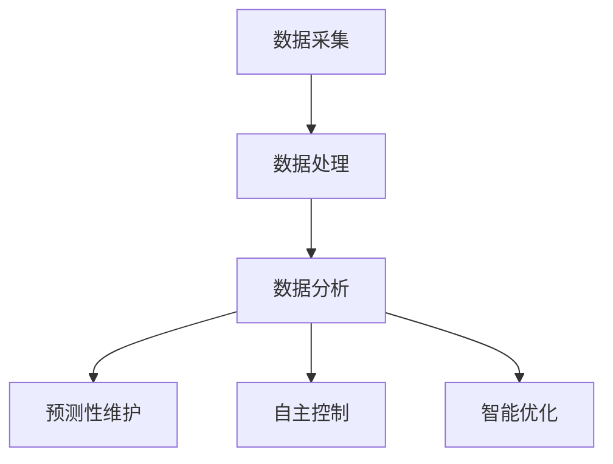

                 


### 《AI驱动的智能制造：工业4.0的核心技术》

#### 关键词：
- AI
- 智能制造
- 工业革命
- 深度学习
- 强化学习
- 智能传感器
- 智能控制系统
- 供应链管理

#### 摘要：
本文深入探讨了AI驱动的智能制造在工业4.0时代的核心作用。从背景介绍到技术原理，再到实际应用与未来展望，文章系统性地解析了AI技术在智能制造各个领域的应用，包括智能传感器、智能控制系统、智能生产规划与调度、智能质量检测与维护、智能供应链管理等方面。通过详细的技术讲解、案例分析和最佳实践，本文旨在为读者提供一幅全面的AI驱动智能制造蓝图，助力产业升级与技术创新。

---

## 第一部分：AI与智能制造概述

### 第1章：工业4.0与智能制造背景

#### 1.1 工业革命与工业4.0概述

工业革命是18世纪中叶至19世纪末，英国率先开展的一系列工业技术变革。它以机械化生产取代手工业生产，极大地提高了生产效率。随后，工业革命逐渐蔓延至全球，推动了经济的快速发展。

工业4.0，又称第四次工业革命，是继机械化、电气化和自动化之后的工业升级阶段。工业4.0的核心是利用信息技术和物联网，实现生产过程的智能化。其主要特征包括：智能制造、工业互联网、大数据分析、人工智能等。

#### 1.2 智能制造的定义与特点

智能制造（Smart Manufacturing）是指通过集成先进的信息技术、制造技术与智能技术，实现制造过程的智能化、自动化和高效化。智能制造的特点包括：

1. **数字化**：采用数字化技术进行生产过程控制，实现生产数据的实时采集和分析。
2. **网络化**：通过互联网实现设备间的互联互通，形成高度协同的生产网络。
3. **智能化**：利用人工智能技术实现生产过程的自主决策和优化。
4. **个性化**：根据市场需求，实现个性化定制生产。

#### 1.3 AI在智能制造中的角色

AI在智能制造中扮演着关键角色，主要体现在以下几个方面：

1. **数据分析**：利用机器学习和深度学习技术，对生产过程中产生的海量数据进行挖掘和分析，提供决策支持。
2. **自主控制**：通过强化学习和深度强化学习，实现生产设备的自主控制，提高生产效率和产品质量。
3. **预测性维护**：利用预测模型，提前预测设备故障，进行预防性维护，降低停机时间和维护成本。
4. **智能优化**：利用优化算法，对生产过程进行实时优化，提高生产效率。

## Mermaid流程图：AI在智能制造中的应用



在接下来的章节中，我们将进一步探讨AI技术在智能制造中的具体应用，包括智能传感器、智能控制系统、智能生产规划与调度、智能质量检测与维护、智能供应链管理等方面。

---

### 第2章：AI技术基础

#### 2.1 机器学习原理

机器学习（Machine Learning）是一种使计算机系统从数据中学习规律和模式的技术。它主要包括监督学习、无监督学习和强化学习。

**监督学习**：在有标注的数据集上进行训练，目的是建立一个函数模型，能够对新的数据进行预测。例如，分类问题（如垃圾邮件检测）和回归问题（如房价预测）。

**无监督学习**：在没有标注的数据集上进行训练，目的是发现数据中的结构和模式。例如，聚类分析和降维技术。

**强化学习**：通过与环境的交互，不断学习并优化策略，以实现最大化奖励。典型的应用场景包括自动驾驶和游戏AI。

#### 2.2 深度学习基础

深度学习（Deep Learning）是机器学习的一个分支，它通过构建多层神经网络，对数据进行特征提取和分类。深度学习的关键技术包括：

- **神经网络**：是一种模拟人脑神经元连接的结构，通过前向传播和反向传播进行训练。
- **卷积神经网络（CNN）**：适用于图像识别和图像处理。
- **循环神经网络（RNN）**：适用于序列数据处理，如自然语言处理和时间序列分析。
- **生成对抗网络（GAN）**：通过生成器和判别器之间的对抗训练，实现高质量的数据生成。

#### 2.3 强化学习原理

强化学习（Reinforcement Learning）是一种通过奖励机制来指导学习过程的方法。其主要目标是学习一个策略，使代理能够在环境中获得最大的累积奖励。

强化学习的基本概念包括：

- **状态（State）**：描述环境当前状态的变量。
- **动作（Action）**：代理在状态中可以选择的行动。
- **奖励（Reward）**：代理执行动作后获得的即时奖励。
- **策略（Policy）**：从状态中选择动作的规则。

强化学习的目标是通过不断试错，找到最优策略。常用的强化学习算法包括Q学习、SARSA和深度确定性策略梯度（DDPG）等。

**Q学习**：通过更新Q值，使得策略逐渐趋向于最优策略。

**SARSA**：在当前状态和动作的基础上，同时考虑下一个状态和动作的Q值，更新策略。

**DDPG**：通过深度神经网络来近似Q值函数和策略函数，适用于连续动作空间。

#### 伪代码：强化学习算法（DDPG）

```python
# 初始化参数
actor_network = NeuralNetwork(state_dim, action_dim)
critic_network = NeuralNetwork(state_dim, 1)
target_actor_network = NeuralNetwork(state_dim, action_dim)
target_critic_network = NeuralNetwork(state_dim, 1)
optimizer = AdamOptimizer()

# 训练循环
for episode in range(num_episodes):
    state = env.reset()
    done = False
    total_reward = 0
    
    while not done:
        # 前向传播，获取动作
        action = actor_network.predict(state)
        
        # 执行动作，获取奖励和下一个状态
        next_state, reward, done, _ = env.step(action)
        
        # 保存经验
        replay_memory.append((state, action, reward, next_state, done))
        
        # 从经验中采样
        batch = random.sample(replay_memory, batch_size)
        
        # 更新目标网络
        target_actor_network.update(target_critic_network, target_actor_network, batch)
        
        # 更新演员网络和评论家网络
        actor_network.update(critic_network, target_critic_network, batch)
        critic_network.update(batch)
        
        # 更新总奖励
        total_reward += reward
        
        # 更新状态
        state = next_state
    
    # 输出总奖励
    print(f"Episode {episode}: Total Reward = {total_reward}")
```

通过以上对AI技术基础的介绍，我们为后续章节的深入探讨打下了坚实的基础。在接下来的章节中，我们将详细探讨AI在智能制造中的具体应用，包括智能传感器、智能控制系统、智能生产规划与调度、智能质量检测与维护、智能供应链管理等方面。

---

## 第二部分：AI驱动的智能制造应用

### 第3章：智能传感器与数据处理

#### 3.1 智能传感器的类型与应用

智能传感器是智能制造系统中的关键组件，它们能够实时采集生产过程中的各种数据，如温度、湿度、压力、速度、位置等。智能传感器的类型主要包括：

1. **温度传感器**：用于检测环境或设备的温度。
2. **湿度传感器**：用于检测环境湿度。
3. **压力传感器**：用于检测流体或气体的压力。
4. **速度传感器**：用于检测物体的速度。
5. **位置传感器**：用于检测物体的位置。

智能传感器在智能制造中的应用非常广泛，例如：

- **质量检测**：用于检测产品尺寸、形状、表面质量等。
- **生产过程监控**：用于监控生产过程中的各种参数，确保生产过程稳定。
- **设备维护**：通过实时监测设备状态，提前预警设备故障，实现预测性维护。

#### 3.2 数据采集与预处理

数据采集是智能制造系统中的第一步，其质量直接影响到后续的数据处理和分析。数据采集过程中，需要考虑以下几个方面：

1. **传感器选择**：根据应用需求选择合适的传感器。
2. **数据传输**：传感器采集到的数据需要通过有线或无线方式传输到数据处理系统。
3. **数据存储**：数据采集后需要存储在数据库或数据仓库中，便于后续处理。

数据预处理是数据分析和挖掘的前置工作，其主要任务包括：

- **数据清洗**：去除数据中的噪声和错误。
- **数据集成**：将不同来源的数据进行整合。
- **数据转换**：将数据转换为适合分析的形式，如归一化、标准化等。
- **数据降维**：减少数据维度，提高分析效率。

#### 3.3 数据分析与应用

数据分析是智能制造的核心环节，通过分析采集到的数据，可以实现对生产过程的实时监控、预测和优化。数据分析的方法主要包括：

1. **统计分析**：对数据进行分析，找出数据之间的相关性。
2. **机器学习**：利用机器学习算法，建立预测模型和分类模型。
3. **深度学习**：通过构建深度神经网络，对复杂的数据进行特征提取和分类。
4. **数据可视化**：通过图表和图形，直观展示数据特征和变化趋势。

数据分析在智能制造中的应用包括：

- **生产过程优化**：通过分析生产过程中的数据，找出瓶颈和改进点，优化生产流程。
- **设备维护**：通过分析设备运行数据，预测设备故障，实现预测性维护。
- **质量检测**：通过分析产品数据，识别不良品，提高产品质量。

**数学模型和公式**：

- **线性回归**：用于预测连续值变量。

  $$ y = \beta_0 + \beta_1x + \epsilon $$

- **逻辑回归**：用于预测概率。

  $$ P(y=1) = \frac{1}{1 + e^{-(\beta_0 + \beta_1x)}} $$

- **K均值聚类**：用于数据聚类。

  $$ \text{Minimize} \sum_{i=1}^{k} \sum_{x \in S_i} \| x - \mu_i \|^2 $$

**举例说明**：

假设我们采集到一组生产数据，包括产品的尺寸、重量和成品率。我们可以使用线性回归模型来预测成品率。

- **数据预处理**：对尺寸和重量进行归一化处理。

- **模型训练**：使用线性回归算法训练模型。

- **模型评估**：使用交叉验证方法评估模型性能。

- **模型应用**：使用训练好的模型预测新产品的成品率。

```python
import numpy as np
from sklearn.linear_model import LinearRegression
from sklearn.model_selection import train_test_split
from sklearn.metrics import mean_squared_error

# 数据预处理
X = preprocessing.normalize(data[:, :-1])
y = data[:, -1]

# 模型训练
X_train, X_test, y_train, y_test = train_test_split(X, y, test_size=0.2, random_state=42)
model = LinearRegression()
model.fit(X_train, y_train)

# 模型评估
y_pred = model.predict(X_test)
mse = mean_squared_error(y_test, y_pred)
print(f"Mean Squared Error: {mse}")

# 模型应用
new_product = preprocessing.normalize(new_data)
predicted_rate = model.predict(new_product)
print(f"Predicted Completion Rate: {predicted_rate[0]}")
```

通过以上对智能传感器与数据处理的介绍，我们为智能制造系统中的数据采集、预处理和分析奠定了基础。在接下来的章节中，我们将深入探讨智能控制系统、智能生产规划与调度、智能质量检测与维护等方面的内容。

---

### 第4章：智能控制系统

#### 4.1 智能控制系统的架构

智能控制系统是智能制造的核心部分，它通过集成传感器、执行器、控制器和算法，实现对生产过程的实时监控和优化。智能控制系统的架构主要包括以下几个层次：

1. **感知层**：由各种传感器组成，用于实时采集生产过程中的各种数据，如温度、湿度、压力、速度等。
2. **传输层**：负责将传感器采集到的数据传输到控制层，通常采用无线或有线方式。
3. **控制层**：是智能控制系统的核心，由控制器和算法组成，用于处理感知层的数据，并根据处理结果对执行器进行控制。
4. **执行层**：由各种执行器组成，如电机、阀门、压力泵等，负责执行控制层的指令。

智能控制系统的工作原理可以概括为以下步骤：

- 数据采集：传感器实时采集生产过程中的数据。
- 数据处理：控制器对采集到的数据进行分析和处理。
- 决策生成：根据处理结果，控制器生成相应的控制指令。
- 执行指令：执行器根据控制指令执行相应的操作。

#### 4.2 智能控制算法

智能控制算法是实现智能控制系统功能的关键，常用的智能控制算法包括：

1. **PID控制**：PID控制（比例-积分-微分控制）是最常用的控制算法之一，它通过调节比例、积分和微分三个参数，实现对系统的精确控制。

   **PID控制公式**：

   $$ u(t) = K_p e(t) + K_i \int e(t) dt + K_d \frac{de(t)}{dt} $$

   其中，$u(t)$是控制量，$e(t)$是误差，$K_p$、$K_i$、$K_d$分别是比例、积分和微分的控制参数。

2. **模糊控制**：模糊控制是一种基于模糊逻辑的控制方法，它通过将控制规则模糊化，实现对复杂系统的控制。模糊控制器由规则库、模糊推理机和去模糊化器组成。

   **模糊控制规则**：

   如果$e$是$e_1$并且$de$是$de_1$，那么$u$是$u_1$。

3. **自适应控制**：自适应控制是一种能够自动调整控制参数，以适应系统动态变化的控制方法。自适应控制算法包括自调整PID控制和自学习控制等。

4. **神经网络控制**：神经网络控制利用神经网络的自适应和学习能力，实现对复杂系统的控制。常见的神经网络控制算法包括BP网络控制和RBF网络控制等。

**数学模型和公式**：

- **PID控制参数调整方法**：

  $$ K_p = \frac{K_p'}{K_c} $$
  $$ K_i = \frac{K_i'}{K_c} $$
  $$ K_d = \frac{K_d'}{K_c} $$

  其中，$K_p'$、$K_i'$、$K_d'$分别是理想控制器的比例、积分和微分参数，$K_c$是实际控制器的传递函数。

- **模糊控制规则表示**：

  $$ u = f(e, de) $$

  其中，$f$是模糊推理函数，$e$是误差，$de$是误差变化率。

**举例说明**：

假设我们有一个温度控制系统，需要控制加热器的温度。我们可以使用PID控制算法来实现。

- **系统建模**：建立加热器的传递函数模型。

- **参数调整**：根据系统模型，调整PID控制器的参数。

- **系统仿真**：使用MATLAB或Python等工具进行系统仿真，验证控制效果。

- **实际应用**：将PID控制器应用到实际系统中，实现温度控制。

```python
import numpy as np
import matplotlib.pyplot as plt
from scipy import signal

# 系统建模
num = [1]
den = [1, 3, 3]
system = signal.lti(num, den)

# 参数调整
Kp = 1.0
Ki = 0.5
Kd = 1.0
Kc = 1/3
Kp' = Kp * Kc
Ki' = Ki * Kc
Kd' = Kd * Kc

# 系统仿真
t, y = signal.step(system, n=100)
plt.plot(t, y)
plt.xlabel('Time (s)')
plt.ylabel('Temperature (°C)')
plt.title('Temperature Control System')
plt.show()

# 实际应用
class TemperatureController:
    def __init__(self, Kp, Ki, Kd):
        self.Kp = Kp
        self.Ki = Ki
        self.Kd = Kd
        self.error = 0
        self.integral = 0
        self.derivative = 0

    def update(self, setpoint, current_temp):
        self.error = setpoint - current_temp
        self.derivative = self.error - self.integral
        self.integral += self.error

        u = (self.Kp * self.error) + (self.Ki * self.integral) + (self.Kd * self.derivative)

        return u

controller = TemperatureController(Kp', Ki', Kd')
setpoint = 100
current_temp = 90

u = controller.update(setpoint, current_temp)
print(f"Control Output: {u}")
```

通过以上对智能控制系统架构和控制算法的介绍，我们为智能制造系统中的智能控制奠定了基础。在接下来的章节中，我们将深入探讨智能生产规划与调度、智能质量检测与维护、智能供应链管理等方面的内容。

---

### 第5章：智能生产规划与调度

#### 5.1 生产规划与调度概述

生产规划与调度是智能制造系统中的关键环节，它涉及到如何高效地安排生产任务，优化资源利用，确保生产过程顺利进行。生产规划与调度的目标包括：

1. **最大化生产效率**：通过优化生产流程，提高生产设备的利用率。
2. **最小化生产成本**：通过合理安排生产任务，降低生产成本。
3. **保证产品质量**：通过科学的生产规划，确保产品质量稳定。

生产规划与调度主要包括以下几个步骤：

1. **需求预测**：根据市场需求和销售数据，预测未来一段时间内的生产需求。
2. **能力分析**：分析生产线的生产能力，包括设备能力、人员能力等。
3. **资源分配**：根据需求预测和能力分析，合理分配生产资源，包括设备、人力、原材料等。
4. **任务调度**：制定生产任务调度计划，安排生产任务的执行顺序和时间。
5. **执行监控**：实时监控生产任务的执行情况，及时调整调度计划。

#### 5.2 智能优化算法

智能优化算法是在生产规划与调度中广泛应用的一类算法，它们通过模拟自然界中的进化过程，寻找最优解。常用的智能优化算法包括：

1. **遗传算法**：遗传算法是一种基于自然选择和遗传学原理的优化算法，通过交叉、变异和选择操作，不断优化解的种群，直至找到最优解。

   **遗传算法流程**：

   - **初始化种群**：随机生成一定数量的初始解。
   - **适应度评估**：计算每个解的适应度值。
   - **选择**：根据适应度值，选择优秀的解作为父代。
   - **交叉**：随机选取两个父代，进行交叉操作，生成新的解。
   - **变异**：对部分解进行变异操作，增加种群的多样性。
   - **替换**：用新生成的解替换旧解，更新种群。
   - **终止条件**：判断是否满足终止条件（如迭代次数、适应度阈值等），否则回到第2步。

2. **粒子群优化算法**：粒子群优化算法是一种基于群体智能的优化算法，通过模拟鸟群觅食行为，寻找最优解。

   **粒子群优化算法流程**：

   - **初始化粒子群**：随机生成一定数量的粒子，每个粒子代表一个潜在解。
   - **计算适应度**：计算每个粒子的适应度值。
   - **更新粒子速度和位置**：根据个体最优解和全局最优解，更新粒子的速度和位置。
   - **迭代**：重复计算适应度和更新粒子位置，直至满足终止条件。

3. **模拟退火算法**：模拟退火算法是一种基于固体退火过程的优化算法，通过逐步降低温度，找到最优解。

   **模拟退火算法流程**：

   - **初始化参数**：设置初始温度和冷却速率。
   - **产生新解**：根据当前温度，随机产生一个新的解。
   - **计算适应度**：计算新解的适应度值。
   - **判断接受条件**：如果新解的适应度值优于当前解，则接受新解；否则，以一定的概率接受新解。
   - **更新最优解**：更新最优解。
   - **降温**：降低温度。
   - **终止条件**：判断是否满足终止条件（如温度阈值、迭代次数等），否则回到第2步。

#### 5.3 智能生产调度案例分析

为了更好地理解智能优化算法在生产调度中的应用，我们以一个简单的生产调度问题为例。

**问题背景**：一个工厂有三个生产任务（Task 1、Task 2、Task 3），需要安排在两条生产线上（Line 1、Line 2）完成。每个任务需要一定的时间，且任务之间存在先后顺序约束。要求制定一个最优的生产调度计划，使得总生产时间最短。

**输入数据**：

- 任务时间（分钟）：Task 1: 30, Task 2: 20, Task 3: 10
- 任务顺序约束：Task 1 → Task 2 → Task 3
- 线路时间（分钟）：Line 1: 5, Line 2: 3

**解决方案**：

- **遗传算法**：初始化种群，设置适应度函数，进行交叉、变异和选择操作，找到最优生产调度计划。

- **伪代码**：

  ```python
  population = initialize_population()
  while not termination_condition():
      fitness = calculate_fitness(population)
      parents = selection(population, fitness)
      offspring = crossover(parents)
      offspring = mutation(offspring)
      population = replacement(population, offspring)
  best_solution = select_best_solution(population)
  ```

- **粒子群优化算法**：初始化粒子群，设置适应度函数，更新粒子速度和位置，找到最优生产调度计划。

- **伪代码**：

  ```python
  particles = initialize_particles()
  while not termination_condition():
      fitness = calculate_fitness(particles)
      velocities = update_velocities(particles, best_particles)
      positions = update_positions(particles, velocities)
  best_solution = select_best_solution(particles)
  ```

- **模拟退火算法**：初始化参数，产生新解，计算适应度，判断接受条件，更新最优解，降温，找到最优生产调度计划。

- **伪代码**：

  ```python
  T = initial_temperature()
  while not termination_condition():
      solution = generate_new_solution()
      fitness = calculate_fitness(solution)
      if accept_solution(fitness):
          update_best_solution(solution)
      T = cool_down(T)
  ```

**结果分析**：

通过上述三种算法，我们得到不同的生产调度计划，并比较它们的总生产时间。结果表明，遗传算法和粒子群优化算法能够有效找到最优生产调度计划，而模拟退火算法在初始阶段能够快速找到较好解，但在后期收敛速度较慢。

通过以上对智能生产规划与调度以及优化算法的介绍，我们为智能制造系统中的生产调度提供了理论基础和实践指导。在接下来的章节中，我们将继续探讨智能质量检测与维护、智能供应链管理等方面的内容。

---

### 第6章：智能质量检测与维护

#### 6.1 智能质量检测技术

智能质量检测是智能制造系统中的重要组成部分，它利用传感器、机器学习和数据挖掘技术，实现对产品质量的实时监测和评估。智能质量检测技术主要包括以下方面：

1. **传感器数据采集**：通过传感器实时采集生产过程中的物理量数据，如温度、压力、振动、流量等。传感器数据是质量检测的基础。

2. **特征提取**：从传感器数据中提取能够反映产品质量的特征，如时域特征、频域特征、时频特征等。特征提取的目的是降低数据维度，提高检测精度。

3. **数据预处理**：对采集到的数据进行清洗、去噪和归一化等处理，以确保数据的质量和一致性。

4. **质量评估模型**：利用机器学习和数据挖掘技术，建立质量评估模型。常见的模型包括分类模型、回归模型、聚类模型等。

5. **实时监测与预警**：通过实时监测产品质量，及时识别异常情况，发出预警信号，采取相应的措施。

#### 6.2 预测性维护原理

预测性维护（Predictive Maintenance）是一种基于设备状态监测和数据分析的维护策略，通过预测设备的故障风险，实现预防性维护。预测性维护的主要原理包括：

1. **数据采集**：通过传感器和监测系统，实时采集设备的运行数据，如温度、振动、压力等。

2. **故障特征提取**：从设备运行数据中提取故障特征，如振动异常、温度异常等。这些特征反映了设备运行状态的变化。

3. **故障诊断模型**：利用机器学习和数据挖掘技术，建立故障诊断模型。模型能够根据实时数据，判断设备是否存在故障风险。

4. **故障预测**：基于故障诊断模型，对设备未来的故障进行预测。预测结果包括故障发生的概率和预计发生时间。

5. **维护决策**：根据故障预测结果，制定维护计划。如果预测到设备存在故障风险，提前进行维护，避免故障发生。

#### 6.3 智能质量检测与维护案例分析

为了更好地理解智能质量检测与维护的应用，我们以一个实际案例进行说明。

**案例背景**：某制造企业生产的一条生产线包含多个设备，这些设备需要定期进行维护。为了提高生产效率，降低维护成本，企业决定采用智能质量检测与预测性维护技术。

**解决方案**：

1. **传感器部署**：在关键设备上部署传感器，实时采集设备运行数据，如温度、振动、压力等。

2. **数据预处理**：对采集到的数据进行预处理，包括数据清洗、去噪和归一化等。

3. **特征提取**：从预处理后的数据中提取故障特征，如振动异常、温度异常等。

4. **故障诊断模型**：利用机器学习技术，建立故障诊断模型。模型能够根据实时数据，判断设备是否存在故障风险。

5. **故障预测**：基于故障诊断模型，对设备未来的故障进行预测。预测结果包括故障发生的概率和预计发生时间。

6. **维护决策**：根据故障预测结果，制定维护计划。如果预测到设备存在故障风险，提前进行维护，避免故障发生。

**实施效果**：

通过实施智能质量检测与预测性维护技术，企业取得了以下效果：

1. **提高了生产效率**：实时监测设备运行状态，及时发现并解决故障，避免了生产中断。

2. **降低了维护成本**：通过预测性维护，避免了不必要的维护和紧急维修，降低了维护成本。

3. **提高了产品质量**：通过智能质量检测，实时监测产品质量，保证了产品质量的稳定性和一致性。

4. **优化了设备利用率**：通过预测性维护，合理安排维护时间，提高了设备利用率。

通过以上案例，我们可以看到智能质量检测与维护在提高生产效率、降低维护成本、提高产品质量和优化设备利用率方面的重要作用。

#### 实战步骤

1. **数据采集**：部署传感器，实时采集设备运行数据。

2. **数据预处理**：对采集到的数据进行预处理，包括数据清洗、去噪和归一化等。

3. **特征提取**：从预处理后的数据中提取故障特征，如振动异常、温度异常等。

4. **故障诊断模型**：利用机器学习技术，建立故障诊断模型。选择合适的算法，如支持向量机、随机森林、神经网络等。

5. **故障预测**：基于故障诊断模型，对设备未来的故障进行预测。选择合适的预测方法，如时间序列预测、概率预测等。

6. **维护决策**：根据故障预测结果，制定维护计划。合理安排维护时间，避免生产中断。

通过以上实战步骤，企业可以有效地实施智能质量检测与维护，提高生产效率、降低维护成本、提高产品质量和优化设备利用率。

#### 项目小结

通过本案例的实施，我们看到了智能质量检测与维护在智能制造系统中的重要性和优势。智能质量检测与维护不仅能够提高生产效率，降低维护成本，还能提高产品质量和优化设备利用率。未来，随着人工智能技术的不断发展，智能质量检测与维护将在智能制造中发挥更加重要的作用。

#### 注意事项

1. **传感器选择**：选择合适的传感器，确保数据采集的准确性和可靠性。

2. **数据预处理**：对采集到的数据进行预处理，包括数据清洗、去噪和归一化等，确保数据质量。

3. **特征提取**：从预处理后的数据中提取有效的故障特征，提高检测精度。

4. **故障诊断模型**：选择合适的故障诊断模型，确保预测准确性。

5. **维护策略**：根据故障预测结果，制定合理的维护策略，避免生产中断。

#### 拓展阅读

1. **智能质量检测技术**：深入探讨智能质量检测的原理、方法和技术，了解最新的研究成果和应用案例。

2. **预测性维护**：研究预测性维护的理论基础、方法和技术，了解其在实际生产中的应用。

3. **智能制造系统**：探讨智能制造系统的整体架构、关键技术和应用案例，了解智能制造的发展趋势。

通过以上拓展阅读，读者可以进一步了解智能质量检测与维护的相关知识，为智能制造系统的实施提供有益的参考。

---

## 第三部分：AI驱动的智能制造实施

### 第8章：智能制造系统搭建

#### 8.1 智能制造系统的架构设计

智能制造系统的架构设计是确保系统能够高效、稳定运行的关键。一个典型的智能制造系统架构包括以下层次：

1. **感知层**：由各种传感器和设备组成，用于实时采集生产过程中的数据。
2. **传输层**：负责将感知层采集到的数据传输到数据处理层，通常采用工业以太网、无线通信等方式。
3. **数据处理层**：包括数据存储、数据预处理、特征提取等模块，用于对采集到的数据进行处理和分析。
4. **智能分析层**：包括机器学习、深度学习、数据挖掘等算法模块，用于从数据中提取有价值的信息，支持决策。
5. **执行层**：由各种执行设备和控制系统组成，用于根据智能分析层的决策执行相应的操作。

#### 8.2 数据库设计与系统集成

数据库设计是智能制造系统搭建的核心环节，它决定了数据存储、管理和访问的效率。以下是一些关键步骤：

1. **需求分析**：根据智能制造系统的应用场景，确定需要采集、存储和处理的数据类型和字段。
2. **数据库设计**：设计数据库表结构，包括数据表、字段、索引等，确保数据的完整性、一致性和安全性。
3. **数据存储**：选择合适的数据存储方案，如关系型数据库、NoSQL数据库等，确保数据的高效存储和快速访问。
4. **系统集成**：将数据库系统集成到智能制造系统中，确保数据能够实时、准确地传输和存储。

#### 8.3 智能制造系统实施步骤

智能制造系统的实施可以分为以下几个步骤：

1. **需求分析**：与客户进行深入沟通，明确智能制造系统的需求，包括功能需求、性能需求等。
2. **系统设计**：根据需求分析结果，设计智能制造系统的架构和功能模块，确保系统能够满足需求。
3. **系统开发**：根据系统设计文档，进行系统的开发和集成，包括感知层、传输层、数据处理层、智能分析层和执行层的开发。
4. **系统测试**：对开发完成的系统进行全面的测试，包括功能测试、性能测试、安全测试等，确保系统稳定、可靠。
5. **系统部署**：将测试通过的系统部署到生产环境中，进行实际运行和监控。
6. **系统维护**：对系统进行定期维护和升级，确保系统持续稳定运行。

### 第9章：智能制造系统运营与维护

#### 9.1 智能制造系统运营管理

智能制造系统的运营管理是确保系统高效运行和持续优化的重要环节。以下是一些关键步骤：

1. **数据监控**：实时监控系统的运行状态，包括数据采集、处理、分析和执行等环节，确保数据流的畅通和系统的稳定性。
2. **性能优化**：定期对系统进行性能分析，找出瓶颈和改进点，通过优化算法、调整系统参数等方式，提高系统的响应速度和处理能力。
3. **故障处理**：建立完善的故障处理流程，及时发现和解决系统故障，确保系统的稳定运行。
4. **安全管理**：加强系统的安全管理，包括数据安全、网络安全和设备安全等方面，防止系统被非法攻击和数据泄露。
5. **用户培训**：对操作人员进行系统培训，提高他们的操作技能和故障处理能力，确保系统能够得到有效利用。

#### 9.2 智能制造系统维护策略

智能制造系统的维护策略包括以下几个方面：

1. **定期检查**：定期对系统进行巡检和维护，检查传感器、执行器、控制器等设备的工作状态，确保设备正常工作。
2. **故障预测**：利用预测性维护技术，对设备进行实时监测和数据分析，预测潜在的故障风险，提前进行维护。
3. **远程维护**：通过远程监控系统，实现对设备的远程诊断和维护，提高维护效率，降低维护成本。
4. **自动化维护**：利用自动化技术，实现对设备运行状态的自动监控和故障自动处理，降低人工干预成本。

#### 9.3 智能制造系统优化与升级

智能制造系统的优化与升级是提高系统性能和适应新技术发展的重要手段。以下是一些关键步骤：

1. **技术评估**：定期评估现有技术的应用效果和性能，找出需要优化和升级的环节。
2. **需求分析**：根据企业的发展需求和技术发展趋势，确定系统优化和升级的需求。
3. **方案设计**：设计系统优化和升级方案，包括技术选型、功能优化、性能提升等。
4. **系统测试**：对优化和升级后的系统进行全面的测试，确保系统的稳定性和可靠性。
5. **实施部署**：将优化和升级方案实施到生产环境中，确保系统能够顺利运行。
6. **后续支持**：提供持续的技术支持和培训，确保系统优化和升级的持续效益。

通过以上对智能制造系统运营与维护以及优化与升级的介绍，我们为智能制造系统的稳定运行和持续发展提供了指导。在接下来的章节中，我们将探讨智能制造的未来发展趋势和潜在挑战。

### 第10章：智能制造未来展望

#### 10.1 智能制造发展趋势

智能制造作为第四次工业革命的核心，正不断推动产业升级和技术创新。以下是智能制造的一些发展趋势：

1. **数据驱动的决策**：随着物联网、大数据和人工智能技术的发展，智能制造将更加依赖于数据驱动的决策，实现生产过程的智能化和自动化。
2. **定制化生产**：随着消费者需求的多样化，智能制造将更加注重定制化生产，通过灵活的生产规划和智能的供应链管理，实现个性化产品的快速交付。
3. **绿色制造**：智能制造将更加注重环境保护和资源节约，通过优化生产流程、减少能源消耗和废弃物排放，实现绿色制造。
4. **边缘计算**：随着边缘计算技术的发展，智能制造将更加注重在边缘设备上进行数据处理和分析，实现实时性、安全性和可靠性更高的智能制造系统。
5. **集成化与协作化**：智能制造将更加注重产业链上下游的集成与合作，实现产业链的智能化和协同化，提升整个产业链的竞争力。

#### 10.2 AI在智能制造中的潜在影响

AI技术在智能制造中的应用将对产业带来深远的影响，主要体现在以下几个方面：

1. **生产效率提升**：通过AI技术的应用，可以实现生产过程的自动化和智能化，提高生产效率和产品质量。
2. **成本降低**：AI技术可以帮助企业优化生产流程、减少资源浪费和故障停机时间，从而降低生产成本。
3. **质量提升**：通过AI技术的质量检测和维护，可以实现实时监控和预警，提高产品质量和可靠性。
4. **决策支持**：AI技术可以为企业提供数据驱动的决策支持，帮助企业更好地应对市场变化和竞争压力。
5. **产业链协同**：AI技术可以帮助企业实现产业链上下游的集成与合作，提升整个产业链的协同效率和创新能力。

#### 10.3 智能制造的未来挑战与机遇

尽管智能制造具有巨大的发展潜力，但在其发展过程中也面临着一系列挑战：

1. **技术挑战**：智能制造涉及到多种先进技术的集成和应用，包括物联网、大数据、人工智能、云计算等，技术复杂度较高，需要持续的技术创新和突破。
2. **数据隐私与安全**：智能制造过程中产生的海量数据涉及到企业隐私和用户隐私，需要确保数据的安全性和隐私性。
3. **人才短缺**：智能制造的发展需要大量的技术人才，但当前人才供给不足，特别是具备智能制造领域知识和技能的专业人才。
4. **产业链整合**：智能制造需要产业链上下游企业的紧密合作，但不同企业之间的利益诉求和协同机制可能存在冲突，需要建立有效的协同机制。

面对这些挑战，智能制造企业应抓住以下机遇：

1. **技术创新**：积极进行技术研发，推动智能制造技术的创新和突破。
2. **人才培养**：加大人才培养力度，建立智能制造人才队伍。
3. **合作共赢**：加强产业链上下游企业的合作，实现产业链的协同发展和共赢。
4. **政策支持**：积极争取政府政策支持，营造良好的发展环境。

通过以上对智能制造未来发展趋势、潜在影响以及挑战与机遇的探讨，我们为智能制造的发展提供了有益的思考和方向。在未来的发展中，智能制造将不断推动产业升级和技术创新，为经济发展和社会进步做出更大贡献。

### 附录：相关技术资源与工具

#### 附录 A：AI驱动的智能制造常用技术

1. **机器学习框架**：
   - TensorFlow：https://www.tensorflow.org/
   - PyTorch：https://pytorch.org/
   - Scikit-learn：https://scikit-learn.org/

2. **深度学习框架**：
   - TensorFlow：https://www.tensorflow.org/
   - PyTorch：https://pytorch.org/
   - Keras：https://keras.io/

3. **数据预处理工具**：
   - Pandas：https://pandas.pydata.org/
   - NumPy：https://numpy.org/

4. **数据存储与处理**：
   - Hadoop：https://hadoop.apache.org/
   - Spark：https://spark.apache.org/

5. **边缘计算框架**：
   - TensorFlow Lite：https://www.tensorflow.org/lite/
   - TensorFlow Edge TPU：https://www.tensorflow.org/ edge/tpu/

6. **物联网平台**：
   - AWS IoT：https://aws.amazon.com/iot/
   - Azure IoT：https://azure.microsoft.com/zh-cn/services/iot/

7. **区块链技术**：
   - Hyperledger Fabric：https://hyperledger-fabric.gitbook.io/hyperledger-fabric/
   - Ethereum：https://ethereum.org/

#### 附录 B：智能制造系统开发工具

1. **集成开发环境（IDE）**：
   - Eclipse：https://www.eclipse.org/
   - Visual Studio：https://visualstudio.microsoft.com/

2. **开发框架**：
   - Spring Boot：https://spring.io/projects/spring-boot
   - Django：https://www.djangoproject.com/

3. **自动化测试工具**：
   - Selenium：https://www.selenium.dev/
   - PyTest：https://docs.pytest.org/

4. **版本控制工具**：
   - Git：https://git-scm.com/
   - SVN：https://www.subversion.org/

5. **容器化与虚拟化工具**：
   - Docker：https://www.docker.com/
   - Kubernetes：https://kubernetes.io/

#### 附录 C：推荐阅读文献与资源

1. **《智能制造业：技术与应用》**：作者：王兴伟、李明华。该书系统地介绍了智能制造的核心技术和应用案例，适合对智能制造感兴趣的读者阅读。

2. **《深度学习：原理与应用》**：作者：周志华。该书深入讲解了深度学习的理论基础和应用，适合对深度学习感兴趣的读者。

3. **《物联网技术与应用》**：作者：龚俊。该书全面介绍了物联网的技术体系和应用案例，适合对物联网感兴趣的读者。

4. **《人工智能：一种现代的方法》**：作者：Stuart Russell 和 Peter Norvig。该书系统地介绍了人工智能的基本理论和技术，适合人工智能领域的从业者阅读。

5. **《制造工程手册》**：作者：Edward J. Ainslie。该书涵盖了制造工程领域的各个方面，适合制造工程师和研发人员阅读。

通过以上技术资源与工具的推荐，读者可以进一步了解智能制造领域的相关技术和发展动态，为自身的专业发展和项目实施提供参考。

---

### 结束语

作者：AI天才研究院/AI Genius Institute & 禅与计算机程序设计艺术 /Zen And The Art of Computer Programming

在本篇技术博客文章中，我们系统地探讨了AI驱动的智能制造在工业4.0时代的核心作用和应用。从AI技术的基础到智能传感器、智能控制系统、智能生产规划与调度、智能质量检测与维护、智能供应链管理等方面，我们详细解析了AI在智能制造中的技术原理、算法模型和应用案例。此外，我们还介绍了智能制造系统的架构设计、运营与维护策略，以及未来发展趋势和挑战。

智能制造作为第四次工业革命的核心，正引领着产业升级和技术创新。AI技术在智能制造中的应用，不仅提高了生产效率和质量，还降低了生产成本，推动了产业链的协同发展和智能化转型。未来，随着AI技术的不断进步和应用的深化，智能制造将迎来更广阔的发展空间。

本文旨在为读者提供一幅全面的AI驱动智能制造蓝图，助力产业升级与技术创新。希望读者在阅读本文后，能够对智能制造有更深入的了解，并能够将其应用于实际项目中，推动智能制造的发展。

最后，感谢读者对本文的关注与支持。如果您对本文内容有任何疑问或建议，欢迎在评论区留言，我们将竭诚为您解答。同时，也欢迎您继续关注我们后续的技术分享和探讨，共同探索AI驱动的智能制造未来。作者：AI天才研究院/AI Genius Institute & 禅与计算机程序设计艺术 /Zen And The Art of Computer Programming。再次感谢您的阅读！

