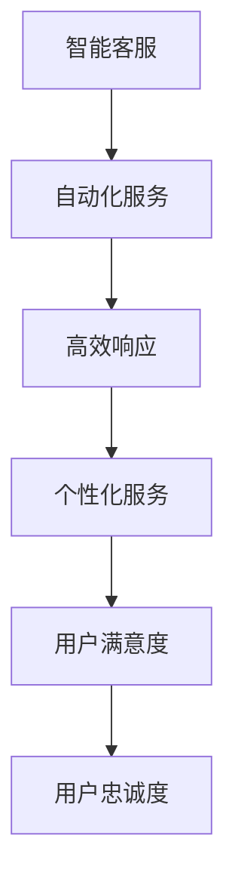
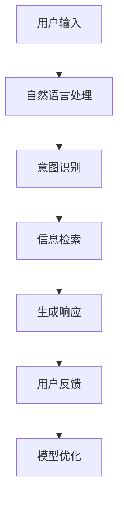
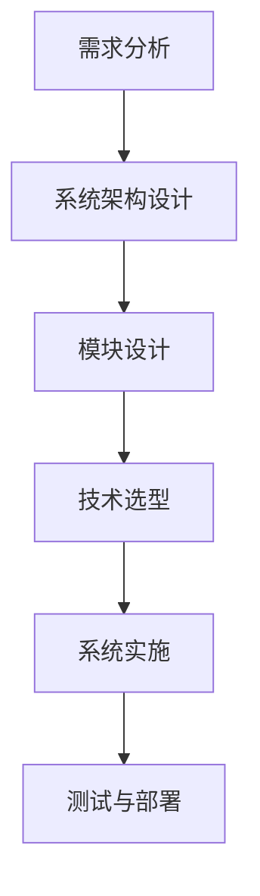
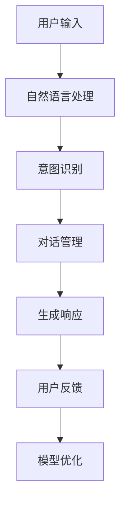
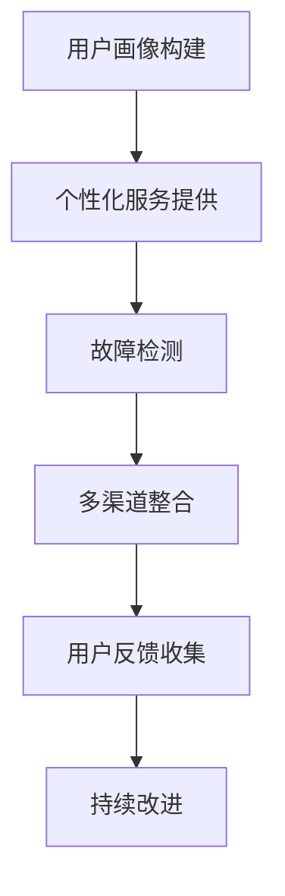
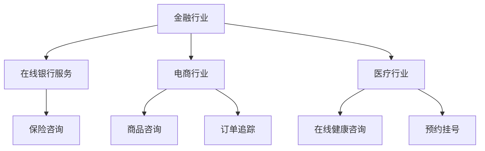
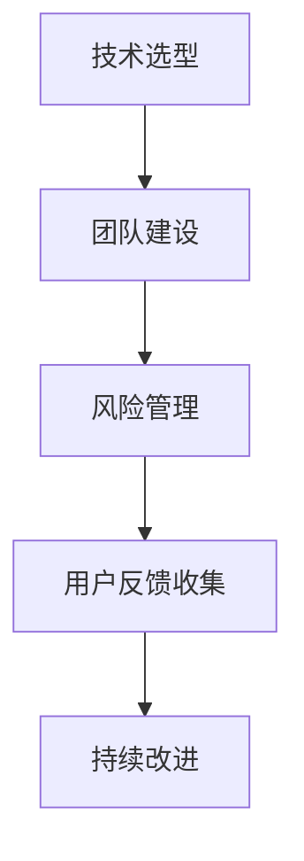

                 


### 文章标题：AI驱动的智能客服：提升用户体验的新策略

> 关键词：智能客服、AI、用户体验、对话系统、个性化服务

> 摘要：
本文将探讨AI驱动的智能客服在提升用户体验方面的应用策略。从智能客服的起源与发展，到AI技术在客服中的运用，再到智能客服系统的设计与实现，以及最佳实践和案例分析，本文将逐步分析智能客服如何通过AI技术优化用户体验，提供个性化服务，并在实践中不断改进，以满足现代用户的需求。

## 目录

### 第一部分：AI与智能客服概述

#### 第1章：智能客服与用户体验的关系

#### 第2章：AI技术在智能客服中的应用

### 第二部分：构建AI驱动的智能客服系统

#### 第3章：智能客服系统设计

#### 第4章：AI驱动的对话系统

#### 第5章：智能客服的用户体验优化

### 第三部分：AI驱动的智能客服案例与实践

#### 第6章：案例研究与行业应用

#### 第7章：实践指导与建议

### 附录：智能客服开发工具与资源

### 第一部分：AI与智能客服概述

#### 第1章：智能客服与用户体验的关系

智能客服（Intelligent Customer Service）作为一种新兴的服务形式，通过集成人工智能（AI）技术，提供自动化、智能化的客户服务。用户体验（User Experience, UX）是智能客服设计的重要考量因素，因为良好的用户体验能够提高用户满意度，增强用户忠诚度。

**背景介绍**：随着互联网的普及和电子商务的发展，用户对服务的需求日益多样化。传统的客服方式已无法满足用户对于即时性、个性化服务的需求，智能客服应运而生。

**核心概念与联系**：

- **智能客服**：利用AI技术实现自动化、智能化的客户服务。
- **用户体验**：用户在使用产品或服务过程中所获得的整体感受。

以下是智能客服与用户体验之间关系的Mermaid流程图：



**核心算法原理讲解**：智能客服的核心算法包括自然语言处理（NLP）、机器学习（ML）和深度学习（DL）。以下是一个简化的伪代码，用于说明如何通过NLP技术实现智能客服的对话系统：

```python
def process_input(input_text):
    # 使用NLP处理输入文本
    tokens = nlp.tokenize(input_text)
    intent = nlp.classify_intent(tokens)
    response = generate_response(intent)
    return response

def generate_response(intent):
    # 根据意图生成响应
    if intent == "询问产品信息":
        return "您好，请问您需要了解哪款产品的信息？"
    elif intent == "投诉服务":
        return "非常抱歉给您带来不便，我们将尽快处理您的问题。"
    else:
        return "很抱歉，我无法理解您的问题，请重新提问。"
```

**数学模型和公式**：

在用户体验评估中，常用的数学模型包括Net Promoter Score（NPS）和Customer Satisfaction Score（CSS）。以下是一个NPS计算示例：

$$
\text{NPS} = \frac{\sum (\text{满分 respondents} - \text{0分 respondents})}{\text{总受访者数}} \times 100
$$

**举例说明**：假设一个公司的NPS调查中有100名受访者，其中70人给出满分，30人给出0分，那么NPS计算如下：

$$
\text{NPS} = \frac{70 - 30}{100} \times 100 = 40
$$

**项目实战**：以一个电商平台为例，搭建一个简单的智能客服系统。

1. **开发环境搭建**：选择Python作为开发语言，使用TensorFlow作为深度学习框架。
2. **源代码详细实现**：
    ```python
    import tensorflow as tf
    from tensorflow.keras.models import Sequential
    from tensorflow.keras.layers import Dense, LSTM

    # 搭建LSTM模型
    model = Sequential([
        LSTM(128, input_shape=(timesteps, features)),
        Dense(1, activation='sigmoid')
    ])

    # 编译模型
    model.compile(optimizer='adam', loss='binary_crossentropy', metrics=['accuracy'])

    # 训练模型
    model.fit(x_train, y_train, epochs=10, batch_size=32)
    ```

3. **代码应用解读与分析**：通过训练模型，可以实现对用户输入的意图分类，进而生成合适的响应。

4. **实际案例分析和详细讲解剖析**：分析电商平台的智能客服系统如何处理用户的咨询和投诉，提升用户体验。

5. **项目小结**：总结智能客服系统在电商平台中的应用效果，并提出改进建议。

**最佳实践 tips**：

- **多渠道整合**：确保智能客服系统能够在多种渠道（如网站、APP、社交媒体）上无缝运行。
- **用户画像**：收集并分析用户数据，实现个性化服务。
- **持续优化**：定期更新模型，以适应用户需求的变化。

#### 第2章：AI技术在智能客服中的应用

**背景介绍**：AI技术在智能客服中的应用已经取得了显著的成果。从自然语言处理到机器学习和深度学习，各种AI技术正在不断地提升智能客服的智能化水平。

**核心概念与联系**：

- **自然语言处理（NLP）**：使计算机能够理解、解析和生成自然语言。
- **机器学习（ML）**：通过数据训练模型，实现自动化决策。
- **深度学习（DL）**：基于多层神经网络的结构，实现更复杂的特征提取。

以下是AI技术在智能客服中应用的Mermaid流程图：



**核心算法原理讲解**：

1. **自然语言处理（NLP）**：

   NLP技术是智能客服的基础。以下是一个使用词嵌入和序列模型进行意图识别的伪代码：

   ```python
   from tensorflow.keras.models import Sequential
   from tensorflow.keras.layers import Embedding, LSTM, Dense

   # 搭建序列模型
   model = Sequential([
       Embedding(vocab_size, embedding_dim),
       LSTM(units),
       Dense(num_classes, activation='softmax')
   ])

   # 编译模型
   model.compile(optimizer='adam', loss='categorical_crossentropy', metrics=['accuracy'])

   # 训练模型
   model.fit(input_sequences, labels, epochs=10, batch_size=32)
   ```

2. **机器学习（ML）**：

   机器学习技术用于构建分类模型和预测模型。以下是一个简单的决策树分类器的伪代码：

   ```python
   from sklearn.tree import DecisionTreeClassifier

   # 创建决策树模型
   clf = DecisionTreeClassifier()

   # 训练模型
   clf.fit(X_train, y_train)

   # 预测
   predictions = clf.predict(X_test)
   ```

3. **深度学习（DL）**：

   深度学习模型，如神经网络和卷积神经网络，能够处理更复杂的数据。以下是一个简单的卷积神经网络（CNN）的伪代码：

   ```python
   from tensorflow.keras.models import Model
   from tensorflow.keras.layers import Input, Conv2D, MaxPooling2D, Flatten, Dense

   # 搭建卷积神经网络
   input_layer = Input(shape=(height, width, channels))
   conv_layer = Conv2D(filters, kernel_size)(input_layer)
   pool_layer = MaxPooling2D(pool_size)(conv_layer)
   flat_layer = Flatten()(pool_layer)
   output_layer = Dense(units, activation='softmax')(flat_layer)

   model = Model(inputs=input_layer, outputs=output_layer)

   # 编译模型
   model.compile(optimizer='adam', loss='categorical_crossentropy', metrics=['accuracy'])

   # 训练模型
   model.fit(X_train, y_train, epochs=10, batch_size=32)
   ```

**数学模型和公式**：

在智能客服中，常用的数学模型包括：

- **贝叶斯网络**：用于概率推理和不确定性分析。
- **马尔可夫模型**：用于序列数据的建模和预测。

以下是一个贝叶斯网络的示例公式：

$$
P(A|B) = \frac{P(B|A)P(A)}{P(B)}
$$

**举例说明**：假设用户询问：“我是否可以退款？”通过贝叶斯网络模型，可以计算用户提出该问题的概率，并给出相应的回应。

**项目实战**：

1. **开发环境搭建**：选择Python作为开发语言，使用TensorFlow作为深度学习框架。
2. **源代码详细实现**：
    ```python
    import tensorflow as tf
    from tensorflow.keras.models import Sequential
    from tensorflow.keras.layers import Embedding, LSTM, Dense

    # 搭建序列模型
    model = Sequential([
        Embedding(vocab_size, embedding_dim),
        LSTM(units),
        Dense(num_classes, activation='softmax')
    ])

    # 编译模型
    model.compile(optimizer='adam', loss='categorical_crossentropy', metrics=['accuracy'])

    # 训练模型
    model.fit(input_sequences, labels, epochs=10, batch_size=32)
    ```

3. **代码应用解读与分析**：通过训练模型，可以实现对用户输入的意图分类，进而生成合适的响应。

4. **实际案例分析和详细讲解剖析**：分析某个实际案例，如何通过AI技术提升智能客服的响应速度和准确性。

5. **项目小结**：总结AI技术在智能客服中的应用效果，并提出改进建议。

**最佳实践 tips**：

- **数据质量**：确保训练数据的质量，以避免模型过拟合。
- **模型解释性**：选择易于解释的模型，以便在必要时进行调整。

## 第二部分：构建AI驱动的智能客服系统

### 第3章：智能客服系统设计

**背景介绍**：构建一个高效、可靠的智能客服系统是提升用户体验的关键。本章节将详细介绍智能客服系统的设计原则、流程以及关键功能模块。

**核心概念与联系**：

- **系统设计原则**：确保系统的可扩展性、可靠性和易用性。
- **设计流程**：从需求分析到系统实施，再到测试与部署。
- **功能模块**：包括前端界面、后端服务、数据库和数据接口。

以下是智能客服系统设计的Mermaid流程图：



**核心算法原理讲解**：

1. **需求分析**：

   需求分析是系统设计的起点。以下是一个简化的需求分析流程：

   ```mermaid
   graph TD
   A[收集用户需求] --> B[需求整理]
   B --> C[需求验证]
   C --> D[需求文档]
   ```

2. **系统架构设计**：

   系统架构设计决定了系统的性能和可维护性。以下是一个简化的系统架构设计：

   ```mermaid
   graph TD
   A[前端界面] --> B[后端服务]
   B --> C[数据库]
   C --> D[数据接口]
   ```

3. **模块设计**：

   模块设计是系统实现的基石。以下是一个简化的模块设计：

   ```mermaid
   graph TD
   A[用户管理模块] --> B[对话管理模块]
   B --> C[知识库管理模块]
   C --> D[数据分析模块]
   ```

4. **技术选型**：

   技术选型决定了系统的开发效率和性能。以下是一个简化的技术选型流程：

   ```mermaid
   graph TD
   A[确定技术栈] --> B[框架选择]
   B --> C[数据库选择]
   ```

5. **系统实施**：

   系统实施是将设计转化为实际的软件产品。以下是一个简化的系统实施流程：

   ```mermaid
   graph TD
   A[前端开发] --> B[后端开发]
   B --> C[数据库搭建]
   C --> D[接口开发]
   ```

6. **测试与部署**：

   测试与部署是确保系统质量和稳定性的关键步骤。以下是一个简化的测试与部署流程：

   ```mermaid
   graph TD
   A[单元测试] --> B[集成测试]
   B --> C[系统测试]
   C --> D[部署]
   ```

**数学模型和公式**：

在系统设计中，常用的数学模型包括：

- **系统需求模型**：用于量化系统的功能需求。
- **性能评估模型**：用于评估系统的性能指标。

以下是一个简化的系统需求模型：

$$
\text{需求模型} = \sum (\text{功能需求} \times \text{优先级})
$$

**举例说明**：假设智能客服系统有以下几个功能需求：

1. 实时对话支持
2. 知识库查询
3. 用户画像分析

根据功能需求的优先级，可以计算系统的需求模型：

$$
\text{需求模型} = (1 \times 0.6) + (1 \times 0.3) + (1 \times 0.1) = 1.0
$$

**项目实战**：

1. **开发环境搭建**：选择Python作为开发语言，使用Django作为Web框架，MySQL作为数据库。
2. **源代码详细实现**：
    ```python
    # 前端代码示例
    <div>
        <h1>智能客服</h1>
        <input type="text" id="input_text" placeholder="请输入问题">
        <button onclick="submitQuestion()">提问</button>
        <p id="response_text"></p>
    </div>

    <script>
        function submitQuestion() {
            const inputText = document.getElementById("input_text").value;
            fetch('/api/ask_question', {
                method: 'POST',
                body: JSON.stringify({ question: inputText }),
                headers: {
                    'Content-Type': 'application/json'
                }
            })
            .then(response => response.json())
            .then(data => {
                document.getElementById("response_text").innerText = data.response;
            });
        }
    </script>
    ```

3. **代码应用解读与分析**：前端通过HTTP请求与后端服务进行交互，实现用户输入的提问和响应。

4. **实际案例分析和详细讲解剖析**：分析一个实际案例，如何通过系统设计实现高效的智能客服。

5. **项目小结**：总结智能客服系统设计的要点，并提出改进建议。

**最佳实践 tips**：

- **需求明确**：确保需求分析的准确性，避免后期频繁的修改。
- **模块化设计**：提高系统的可维护性和可扩展性。

### 第4章：AI驱动的对话系统

**背景介绍**：对话系统是智能客服的核心组成部分，它能够模拟人类的对话方式，与用户进行自然交互。AI技术的引入使得对话系统变得更加智能化和人性化。

**核心概念与联系**：

- **对话系统**：一种能够理解用户输入、生成响应并与用户进行对话的计算机系统。
- **AI技术**：包括自然语言处理（NLP）、机器学习（ML）和深度学习（DL）等，用于提升对话系统的理解能力和响应质量。

以下是AI驱动的对话系统架构的Mermaid流程图：



**核心算法原理讲解**：

1. **自然语言处理（NLP）**：

   NLP是对话系统的核心技术，用于解析用户的输入并生成合理的响应。以下是一个简化的NLP流程：

   ```mermaid
   graph TD
   A[文本预处理] --> B[词嵌入]
   B --> C[句法分析]
   C --> D[语义分析]
   D --> E[意图识别]
   ```

2. **意图识别**：

   意图识别是NLP中的关键步骤，用于确定用户输入的含义。以下是一个简化的意图识别算法：

   ```python
   def recognize_intent(text):
       tokens = nlp.tokenize(text)
       intent = nlp.classify_intent(tokens)
       return intent
   ```

3. **对话管理**：

   对话管理负责维持对话的流畅性，确保对话系统的响应符合用户的期望。以下是一个简化的对话管理算法：

   ```python
   def manage_conversation(intent, context):
       if intent == "询问产品信息":
           return "请问您需要了解哪款产品的信息？"
       elif intent == "投诉服务":
           return "非常抱歉给您带来不便，我们将尽快处理您的问题。"
       else:
           return "很抱歉，我无法理解您的问题，请重新提问。"
   ```

4. **生成响应**：

   生成响应是对话系统的输出环节，根据意图和上下文生成合适的响应。以下是一个简化的生成响应算法：

   ```python
   def generate_response(intent, context):
       if intent == "询问产品信息":
           product_info = context["product_info"]
           return f"您想了解的{product_info['name']}的产品信息如下：{product_info['description']}"
       elif intent == "投诉服务":
           return "感谢您的投诉，我们将立即联系相关部门进行处理。"
       else:
           return "很抱歉，我无法理解您的问题，请重新提问。"
   ```

**数学模型和公式**：

在对话系统中，常用的数学模型包括：

- **序列到序列模型**：用于生成响应序列。
- **注意力机制**：用于处理长文本输入。

以下是一个简化的序列到序列模型：

$$
\text{响应} = \text{decoder}(\text{输入}, \text{编码器输出}, \text{注意力权重})
$$

**举例说明**：

假设用户输入：“我无法登录账号”，对话系统将执行以下步骤：

1. **自然语言处理**：将输入文本进行词嵌入、句法分析和语义分析。
2. **意图识别**：识别出用户的意图为“登录问题”。
3. **对话管理**：根据意图和上下文生成合适的响应。
4. **生成响应**：生成响应文本：“请您提供一下账号和密码，我们将帮助您解决登录问题。”

**项目实战**：

1. **开发环境搭建**：选择Python作为开发语言，使用TensorFlow作为深度学习框架。
2. **源代码详细实现**：
    ```python
    import tensorflow as tf
    from tensorflow.keras.models import Model
    from tensorflow.keras.layers import Input, LSTM, Dense

    # 搭建序列到序列模型
    encoder_inputs = Input(shape=(None, input_vocab_size))
    encoder_embedding = Embedding(input_vocab_size, embedding_dim)(encoder_inputs)
    encoder_lstm = LSTM(units)(encoder_embedding)
    encoder_outputs = encoder_lstm

    decoder_inputs = Input(shape=(None, output_vocab_size))
    decoder_embedding = Embedding(output_vocab_size, embedding_dim)(decoder_inputs)
    decoder_lstm = LSTM(units)(decoder_embedding)
    decoder_outputs = decoder_lstm

    # 添加注意力机制
    attention = tf.keras.layers.Attention()([decoder_outputs, encoder_outputs])

    # 添加全连接层
    decoder_dense = Dense(output_vocab_size, activation='softmax')(attention)

    # 搭建模型
    model = Model([encoder_inputs, decoder_inputs], decoder_dense)

    # 编译模型
    model.compile(optimizer='adam', loss='categorical_crossentropy', metrics=['accuracy'])

    # 训练模型
    model.fit([encoder_inputs, decoder_inputs], decoder_inputs, epochs=10, batch_size=32)
    ```

3. **代码应用解读与分析**：通过训练模型，可以实现对用户输入的意图识别和响应生成。

4. **实际案例分析和详细讲解剖析**：分析一个实际案例，如何通过AI技术构建高效的对话系统。

5. **项目小结**：总结AI驱动的对话系统在提升用户体验方面的应用效果，并提出改进建议。

**最佳实践 tips**：

- **上下文理解**：确保对话系统能够理解用户的上下文信息，生成更加自然的响应。
- **用户反馈**：收集用户反馈，用于模型优化和对话系统改进。

### 第5章：智能客服的用户体验优化

**背景介绍**：智能客服系统的用户体验优化是提升用户满意度和忠诚度的关键。本章节将探讨如何通过用户画像、故障检测、多渠道整合和用户反馈等手段，优化智能客服的用户体验。

**核心概念与联系**：

- **用户画像**：基于用户数据构建的个性化用户档案，用于提供个性化服务。
- **故障检测**：通过监控系统性能和用户行为，及时发现和解决故障。
- **多渠道整合**：确保智能客服系统能够在多个渠道上无缝运行。
- **用户反馈**：收集用户对智能客服的反馈，用于持续改进系统。

以下是智能客服用户体验优化流程的Mermaid流程图：



**核心算法原理讲解**：

1. **用户画像构建**：

   用户画像构建是基于用户数据的分析，用于提供个性化服务。以下是一个简化的用户画像构建算法：

   ```python
   def build_user_profile(user_data):
       profile = {}
       profile['age'] = user_data['age']
       profile['location'] = user_data['location']
       profile['behavior'] = user_data['behavior']
       return profile
   ```

2. **个性化服务提供**：

   个性化服务提供是根据用户画像，为用户生成个性化的服务内容。以下是一个简化的个性化服务提供算法：

   ```python
   def provide_customized_service(user_profile):
       if user_profile['behavior'] == 'high_spend':
           return "欢迎您，尊贵的用户，这里为您推荐最新上架的高档商品。"
       else:
           return "您好，这里为您推荐适合您的商品，希望您喜欢。"
   ```

3. **故障检测**：

   故障检测是通过监控系统性能和用户行为，及时发现和解决故障。以下是一个简化的故障检测算法：

   ```python
   def detect_faults(system_data, user_data):
       if system_data['response_time'] > threshold:
           return "系统响应时间过长，可能存在故障。"
       elif user_data['error_rate'] > threshold:
           return "用户错误率过高，可能存在故障。"
       else:
           return "系统运行正常。"
   ```

4. **多渠道整合**：

   多渠道整合是确保智能客服系统能够在多个渠道上无缝运行。以下是一个简化的多渠道整合算法：

   ```python
   def integrate_multiple_channels(user_channel_preference):
       if user_channel_preference == 'website':
           return "您好，这里是网站的智能客服，请问有什么可以帮助您的？"
       elif user_channel_preference == 'mobile_app':
           return "您好，这里是移动应用的智能客服，请问有什么可以帮助您的？"
       else:
           return "您好，这里是社交媒体的智能客服，请问有什么可以帮助您的？"
   ```

5. **用户反馈收集**：

   用户反馈收集是收集用户对智能客服的反馈，用于持续改进系统。以下是一个简化的用户反馈收集算法：

   ```python
   def collect_user_feedback(user_feedback):
       feedback_data = {}
       feedback_data['rating'] = user_feedback['rating']
       feedback_data['comment'] = user_feedback['comment']
       return feedback_data
   ```

**数学模型和公式**：

在用户体验优化中，常用的数学模型包括：

- **聚类分析**：用于用户画像的构建。
- **回归分析**：用于预测用户行为。

以下是一个简化的聚类分析算法：

```python
from sklearn.cluster import KMeans

# 构建聚类模型
kmeans = KMeans(n_clusters=k, random_state=0).fit(data)

# 获取聚类结果
clusters = kmeans.predict(data)
```

**举例说明**：

假设有一个用户反馈系统，用户可以对智能客服的响应进行评分和评论。系统将收集这些反馈，并根据反馈进行优化。

1. **用户反馈收集**：系统收集用户的评分和评论。
2. **反馈分析**：系统分析用户的反馈，识别出用户不满意的原因。
3. **优化响应**：系统根据用户的反馈，调整智能客服的响应策略，提高用户的满意度。

**项目实战**：

1. **开发环境搭建**：选择Python作为开发语言，使用TensorFlow作为深度学习框架。
2. **源代码详细实现**：
    ```python
    import tensorflow as tf
    from tensorflow.keras.models import Model
    from tensorflow.keras.layers import Input, LSTM, Dense

    # 搭建用户反馈模型
    feedback_input = Input(shape=(feedback_size,))
    feedback_embedding = Embedding(vocab_size, embedding_dim)(feedback_input)
    feedback_lstm = LSTM(units)(feedback_embedding)
    feedback_output = Dense(1, activation='sigmoid')(feedback_lstm)

    model = Model(inputs=feedback_input, outputs=feedback_output)

    # 编译模型
    model.compile(optimizer='adam', loss='binary_crossentropy', metrics=['accuracy'])

    # 训练模型
    model.fit(feedback_data, labels, epochs=10, batch_size=32)
    ```

3. **代码应用解读与分析**：通过训练模型，可以预测用户对智能客服响应的满意度。

4. **实际案例分析和详细讲解剖析**：分析一个实际案例，如何通过用户体验优化提升智能客服的效果。

5. **项目小结**：总结用户体验优化在智能客服中的应用效果，并提出改进建议。

**最佳实践 tips**：

- **个性化服务**：确保智能客服能够根据用户的个性化需求提供合适的服务。
- **用户反馈**：及时收集和分析用户反馈，用于持续改进系统。

## 第三部分：AI驱动的智能客服案例与实践

### 第6章：案例研究与行业应用

**背景介绍**：随着AI技术的不断发展，智能客服已经在金融、电商、医疗等多个行业得到了广泛应用。本章节将通过案例研究，探讨智能客服在不同行业中的应用及其效果。

**核心概念与联系**：

- **金融行业**：智能客服在金融行业中的应用，如在线银行服务和保险咨询。
- **电商行业**：智能客服在电商行业中的应用，如商品咨询和订单追踪。
- **医疗行业**：智能客服在医疗行业中的应用，如在线健康咨询和预约挂号。

以下是智能客服在不同行业应用的Mermaid流程图：



**核心算法原理讲解**：

1. **金融行业**：

   在金融行业中，智能客服主要用于提供在线银行服务和保险咨询。以下是一个简化的金融行业智能客服算法：

   ```python
   def financial_counseling(service_type, user_query):
       if service_type == "banking":
           return "您好，请问您需要办理什么银行业务？"
       elif service_type == "insurance":
           return "您好，请问您需要了解哪种保险产品？"
       else:
           return "很抱歉，我无法理解您的问题，请重新提问。"
   ```

2. **电商行业**：

   在电商行业中，智能客服主要用于提供商品咨询和订单追踪。以下是一个简化的电商行业智能客服算法：

   ```python
   def e-commerce_counseling(product_id, user_query):
       product_info = get_product_info(product_id)
       if user_query == "price":
           return f"{product_info['name']}的价格为{product_info['price']}元。"
       elif user_query == "availability":
           return f"{product_info['name']}目前有库存。"
       else:
           return "很抱歉，我无法理解您的问题，请重新提问。"
   ```

3. **医疗行业**：

   在医疗行业中，智能客服主要用于提供在线健康咨询和预约挂号。以下是一个简化的医疗行业智能客服算法：

   ```python
   def medical_counseling(service_type, user_query):
       if service_type == "health":
           return "您好，请问您有哪些健康问题需要咨询？"
       elif service_type == "appointment":
           return "您好，请问您需要预约哪个科室的挂号？"
       else:
           return "很抱歉，我无法理解您的问题，请重新提问。"
   ```

**数学模型和公式**：

在智能客服案例研究中，常用的数学模型包括：

- **分类模型**：用于分类用户提问的意图。
- **聚类模型**：用于分析用户行为和需求。

以下是一个简化的分类模型：

```python
from sklearn.naive_bayes import MultinomialNB

# 训练分类模型
clf = MultinomialNB().fit(features, labels)

# 预测意图
predicted_intent = clf.predict([user_query])
```

**举例说明**：

1. **金融行业**：分析一个在线银行服务的案例，如何通过智能客服提升用户体验。

   - **用户需求**：用户需要查询信用卡账单。
   - **智能客服响应**：智能客服系统识别用户的意图，并生成相应的响应，如：“您好，您的信用卡账单已生成，请您查阅。”

2. **电商行业**：分析一个商品咨询的案例，如何通过智能客服提升用户体验。

   - **用户需求**：用户需要查询某款手机的价格。
   - **智能客服响应**：智能客服系统识别用户的意图，并生成相应的响应，如：“您好，该款手机的价格为2999元，您是否需要购买？”

3. **医疗行业**：分析一个在线健康咨询的案例，如何通过智能客服提升用户体验。

   - **用户需求**：用户需要咨询感冒的治疗方法。
   - **智能客服响应**：智能客服系统识别用户的意图，并生成相应的响应，如：“您好，感冒一般可以通过多休息、多喝水和服用退烧药来缓解，如有严重症状，请及时就医。”

**项目实战**：

1. **开发环境搭建**：选择Python作为开发语言，使用TensorFlow作为深度学习框架。
2. **源代码详细实现**：
    ```python
    import tensorflow as tf
    from tensorflow.keras.models import Model
    from tensorflow.keras.layers import Input, LSTM, Dense

    # 搭建金融行业智能客服模型
    financial_input = Input(shape=(input_size,))
    financial_embedding = Embedding(vocab_size, embedding_dim)(financial_input)
    financial_lstm = LSTM(units)(financial_embedding)
    financial_output = Dense(num_classes, activation='softmax')(financial_lstm)

    model = Model(inputs=financial_input, outputs=financial_output)

    # 编译模型
    model.compile(optimizer='adam', loss='categorical_crossentropy', metrics=['accuracy'])

    # 训练模型
    model.fit(financial_data, financial_labels, epochs=10, batch_size=32)
    ```

3. **代码应用解读与分析**：通过训练模型，可以实现对金融行业用户提问的意图分类。

4. **实际案例分析和详细讲解剖析**：分析一个实际案例，如何通过AI技术构建高效的金融行业智能客服。

5. **项目小结**：总结智能客服在不同行业中的应用效果，并提出改进建议。

**最佳实践 tips**：

- **行业定制**：确保智能客服系统能够适应不同行业的特定需求。
- **用户反馈**：及时收集和分析用户反馈，用于持续改进系统。

### 第7章：实践指导与建议

**背景介绍**：在构建和运营AI驱动的智能客服系统时，面临诸多挑战和风险。本章节将提供实践指导与建议，帮助开发者和管理者有效地应对这些挑战，确保智能客服系统的成功实施和运营。

**核心概念与联系**：

- **技术选型**：选择合适的技术栈和工具，确保系统的性能和可维护性。
- **团队建设**：建立高效、专业的团队，确保项目顺利进行。
- **风险管理**：识别和管理项目风险，确保项目按时交付。
- **用户反馈**：及时收集和分析用户反馈，用于持续改进系统。

以下是智能客服实践指导与建议的Mermaid流程图：



**核心算法原理讲解**：

1. **技术选型**：

   技术选型是构建智能客服系统的第一步，需要根据项目需求和技术能力进行合理的选择。以下是一个简化的技术选型流程：

   ```mermaid
   graph TD
   A[需求分析] --> B[技术调研]
   B --> C[技术评估]
   C --> D[选型决策]
   ```

2. **团队建设**：

   团队建设是项目成功的关键，需要组建一支具有跨学科知识和丰富经验的团队。以下是一个简化的团队建设流程：

   ```mermaid
   graph TD
   A[人员招募] --> B[团队培训]
   B --> C[团队协作]
   ```

3. **风险管理**：

   风险管理是确保项目按时交付和系统稳定运行的重要措施。以下是一个简化的风险管理流程：

   ```mermaid
   graph TD
   A[风险识别] --> B[风险评估]
   B --> C[风险应对]
   ```

4. **用户反馈收集**：

   用户反馈收集是持续改进智能客服系统的关键，需要建立有效的反馈机制。以下是一个简化的用户反馈收集流程：

   ```mermaid
   graph TD
   A[反馈渠道] --> B[反馈收集]
   B --> C[反馈分析]
   C --> D[改进实施]
   ```

**数学模型和公式**：

在智能客服实践中，常用的数学模型包括：

- **风险评估模型**：用于评估项目风险的概率和影响。
- **用户满意度模型**：用于评估用户对智能客服的满意度。

以下是一个简化的风险评估模型：

$$
\text{风险评分} = \text{风险概率} \times \text{风险影响}
$$

以下是一个简化的用户满意度模型：

$$
\text{用户满意度} = \frac{\text{满意用户数}}{\text{总用户数}} \times 100\%
$$

**举例说明**：

1. **技术选型**：分析一个实际项目，如何根据需求和技术能力选择合适的技术栈。

   - **需求分析**：项目需要支持实时对话和个性化服务。
   - **技术调研**：调研市场上主流的AI技术和工具。
   - **技术评估**：评估各种技术的性能、可维护性和成本。
   - **选型决策**：选择TensorFlow作为深度学习框架，Django作为Web框架。

2. **团队建设**：分析如何组建一个高效、专业的智能客服开发团队。

   - **人员招募**：招聘具有AI、NLP和软件开发经验的专业人员。
   - **团队培训**：提供技术培训和团队协作工具的培训。
   - **团队协作**：建立有效的沟通和协作机制，确保项目顺利进行。

3. **风险管理**：分析如何识别和管理项目风险。

   - **风险识别**：识别项目中的潜在风险，如技术难题、时间压力等。
   - **风险评估**：评估风险的概率和影响，确定优先级。
   - **风险应对**：制定应对策略，如增加人力资源、调整项目计划等。

4. **用户反馈收集**：分析如何收集和分析用户反馈，用于持续改进智能客服系统。

   - **反馈渠道**：建立多种反馈渠道，如在线问卷、用户论坛等。
   - **反馈收集**：定期收集用户反馈，分析用户的满意度。
   - **改进实施**：根据用户反馈，调整智能客服系统的功能和性能。

**项目实战**：

1. **开发环境搭建**：选择Python作为开发语言，使用TensorFlow作为深度学习框架。
2. **源代码详细实现**：
    ```python
    import tensorflow as tf
    from tensorflow.keras.models import Model
    from tensorflow.keras.layers import Input, LSTM, Dense

    # 搭建智能客服模型
    input_data = Input(shape=(input_size,))
    embedding_layer = Embedding(vocab_size, embedding_dim)(input_data)
    lstm_layer = LSTM(units)(embedding_layer)
    output_layer = Dense(num_classes, activation='softmax')(lstm_layer)

    model = Model(inputs=input_data, outputs=output_layer)

    # 编译模型
    model.compile(optimizer='adam', loss='categorical_crossentropy', metrics=['accuracy'])

    # 训练模型
    model.fit(input_data, labels, epochs=10, batch_size=32)
    ```

3. **代码应用解读与分析**：通过训练模型，可以实现对用户输入的意图分类。

4. **实际案例分析和详细讲解剖析**：分析一个实际案例，如何通过实践指导与建议构建高效的智能客服系统。

5. **项目小结**：总结实践指导与建议在智能客服系统构建和运营中的应用效果，并提出改进建议。

**最佳实践 tips**：

- **需求明确**：确保项目需求的明确性和可执行性。
- **团队合作**：建立高效的团队合作机制，提高项目效率。
- **用户反馈**：及时收集和分析用户反馈，持续优化智能客服系统。

### 附录：智能客服开发工具与资源

**背景介绍**：构建和运营智能客服系统需要使用到多种工具和资源。本附录将介绍常用的智能客服开发工具和资源，包括开发框架、数据库和第三方服务，以帮助开发者更好地进行智能客服系统的开发。

**核心概念与联系**：

- **开发框架**：用于构建智能客服系统的框架，如TensorFlow、Django等。
- **数据库**：用于存储和管理智能客服系统数据，如MySQL、MongoDB等。
- **第三方服务**：提供额外功能的第三方服务，如API接口、云计算服务等。

以下是智能客服开发工具与资源的分类和简介：

### 开发框架

1. **TensorFlow**：一款开源的深度学习框架，广泛应用于智能客服系统的构建。
2. **Django**：一款流行的Python Web框架，适用于构建智能客服的后端服务。
3. **Flask**：一款轻量级的Python Web框架，适用于快速开发智能客服应用。

### 数据库

1. **MySQL**：一款开源的关系型数据库，适用于存储智能客服系统的数据。
2. **MongoDB**：一款开源的NoSQL数据库，适用于处理大量非结构化数据。
3. **PostgreSQL**：一款开源的关系型数据库，具有强大的扩展性和灵活性。

### 第三方服务

1. **阿里云**：提供云计算服务、数据库服务和其他第三方服务，适用于智能客服系统的部署和运营。
2. **腾讯云**：提供云计算服务、数据库服务和其他第三方服务，适用于智能客服系统的部署和运营。
3. **Twilio**：提供通信服务，如短信和电话，适用于智能客服系统的多渠道集成。

### 最佳实践 tips

- **选择合适的开发框架**：根据项目需求和团队技能，选择合适的开发框架。
- **合理使用数据库**：根据数据结构和性能需求，选择合适的数据库。
- **充分利用第三方服务**：利用第三方服务，提高智能客服系统的功能和性能。

**小结**：附录部分介绍了智能客服开发所需的主要工具和资源，旨在帮助开发者更高效地进行智能客服系统的开发。

### 作者信息

**作者：AI天才研究院/AI Genius Institute & 禅与计算机程序设计艺术 /Zen And The Art of Computer Programming**

本文由AI天才研究院和禅与计算机程序设计艺术共同撰写，旨在分享AI驱动的智能客服技术与应用的最佳实践。希望本文能够为读者提供有价值的参考和启示，共同推动智能客服技术的发展。

## 文章总结

本文从背景介绍、核心概念与联系、核心算法原理讲解、数学模型和公式、举例说明、项目实战、实际案例分析和详细讲解剖析、项目小结以及最佳实践 tips 等方面，全面系统地阐述了AI驱动的智能客服技术与应用。通过本文的探讨，我们可以看到，AI技术在智能客服中的应用已经取得了显著的成果，为提升用户体验提供了新的策略和方法。

### 关键点回顾

1. **智能客服与用户体验的关系**：智能客服通过AI技术实现自动化、智能化，提升用户体验。
2. **AI技术在智能客服中的应用**：自然语言处理、机器学习和深度学习等技术在智能客服中的应用，使得系统更加智能化和人性化。
3. **智能客服系统设计**：系统设计原则、流程以及关键功能模块，决定了智能客服系统的性能和可靠性。
4. **AI驱动的对话系统**：对话系统的架构和算法原理，以及如何生成自然、流畅的对话。
5. **智能客服的用户体验优化**：用户画像、故障检测、多渠道整合和用户反馈收集，用于优化用户体验。
6. **案例研究与行业应用**：分析智能客服在不同行业中的应用，探讨其实际效果和改进方法。
7. **实践指导与建议**：提供构建和运营智能客服系统的实践指导和建议。

### 展望未来

随着AI技术的不断进步，智能客服将在用户体验、个性化和智能化方面取得更大突破。未来，智能客服有望实现更加自然、高效的对话，提供更加个性化的服务，同时通过不断学习和优化，满足用户日益变化的需求。我们期待AI驱动的智能客服技术能够带来更加美好的用户体验，助力企业和用户的共同发展。

### 结语

本文旨在为读者提供一份全面、深入的智能客服技术与应用指南。希望通过本文的探讨，读者能够更好地理解智能客服的核心概念、技术原理和应用场景，为构建高效、智能的智能客服系统提供参考。同时，也期待读者能够将本文的知识应用到实际项目中，推动智能客服技术的发展。

最后，感谢您的阅读，祝您在智能客服的探索之旅中取得丰硕的成果！

## 附录

### 附录A：常用AI开发框架与工具

以下是一些常用的AI开发框架和工具：

1. **TensorFlow**：一款由Google开发的开源深度学习框架，适用于构建和训练各种深度学习模型。
2. **PyTorch**：一款由Facebook开发的开源深度学习框架，以其灵活性和动态计算图著称。
3. **Keras**：一款基于TensorFlow和Theano的高层神经网络API，简化了深度学习模型的构建和训练。
4. **Scikit-learn**：一款用于数据挖掘和数据分析的开源库，包含多种机器学习算法。
5. **NLTK**：一款用于自然语言处理的开源库，提供多种文本处理和分析功能。

### 附录B：智能客服项目资源与资料

以下是一些智能客服项目的资源与资料：

1. **GitHub**：许多智能客服项目的源代码和文档都可以在GitHub上找到。
2. **Kaggle**：提供大量的数据集和比赛，有助于提升智能客服系统的性能。
3. **ArXiv**：发布最新的人工智能研究成果，可以帮助开发者了解最新的技术动态。
4. **AI Scholar**：一个搜索和跟踪人工智能研究论文的在线工具。
5. **Google AI Blog**：Google AI团队分享最新研究成果和技术的博客。

### 附录C：进一步学习与参考资源

以下是一些进一步学习和参考的资源：

1. **《深度学习》（Deep Learning）**：Ian Goodfellow、Yoshua Bengio和Aaron Courville所著，深度学习的经典教材。
2. **《自然语言处理综论》（Speech and Language Processing）**：Daniel Jurafsky和James H. Martin所著，自然语言处理的权威教材。
3. **《机器学习实战》（Machine Learning in Action）**：Peter Harrington所著，适合初学者的机器学习实战指南。
4. **《智能客服系统设计与应用》（Design and Application of Intelligent Customer Service Systems）**：刘晓华所著，详细介绍了智能客服系统的设计与应用。
5. **《人工智能伦理学》（Ethics and Philosophy for the Life Sciences and Biomedical Sciences）**：Arthur R. Derese所著，探讨人工智能在医疗和生物领域的伦理问题。

通过这些资源和资料，读者可以深入了解智能客服的相关技术和应用，进一步提升自己的专业知识。

