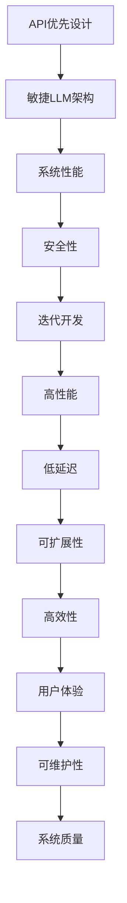

                 

# 《API优先设计在敏捷LLM架构中的重要性》

## 关键词：
API优先设计，敏捷LLM架构，核心算法原理，数学模型，项目实战，最佳实践

## 摘要：
本文深入探讨了API优先设计在敏捷LLM架构中的重要性。首先，我们介绍了API优先设计和敏捷LLM架构的核心概念，并分析了它们之间的联系。接着，我们通过伪代码和数学模型详细讲解了API优先设计和敏捷LLM架构的核心算法原理。然后，本文展示了API优先设计和敏捷LLM架构在实际项目中的应用，包括开发环境搭建、源代码实现、代码解读和案例分析。最后，我们总结了最佳实践，提出了注意事项，并提供了拓展阅读建议。

## 第一部分：API优先设计与敏捷LLM架构

### 1.1 API优先设计概述

#### 1.1.1 API优先设计的定义
API优先设计是一种软件开发方法，强调在项目初期就进行API设计，并将API设计视为软件系统的核心。这种方法旨在确保API的高性能、安全性和可扩展性，从而提高系统的整体质量。

#### 1.1.2 API优先设计的重要性
API优先设计能够减少开发过程中的修改成本，提高开发效率，确保系统的可维护性和可扩展性。此外，它还有助于提高用户体验，因为良好的API设计可以简化用户与系统之间的交互。

#### 1.1.3 API优先设计与传统设计的对比
与传统设计相比，API优先设计更注重API的设计和优化。传统设计通常在项目后期才关注API，这可能导致API设计与系统其他部分的不一致，增加修改成本。

### 1.2 敏捷LLM架构概述

#### 1.2.1 敏捷开发方法
敏捷开发是一种迭代和增量的软件开发方法，强调快速响应变化和持续交付高质量软件。它通过短期迭代和持续反馈来提高开发效率和质量。

#### 1.2.2 LLM（Large Language Model）架构
LLM架构是指大型语言模型的结构，如BERT、GPT等。这些模型通过训练海量文本数据，可以生成高质量的自然语言文本。

#### 1.2.3 API优先设计与敏捷LLM架构的联系
API优先设计在敏捷LLM架构中起着关键作用。它确保了LLM模型的API设计能够满足敏捷开发的需求，提高系统的性能和可扩展性。

### 1.3 核心概念与联系

#### 1.3.1 API优先设计与敏捷LLM架构的联系
API优先设计强调在项目初期就进行API设计，这与敏捷开发方法中的迭代和增量开发理念相契合。同时，LLM架构的高性能和可扩展性要求也需要API优先设计来确保。

#### 1.3.2 API优先设计与系统性能
API优先设计能够提高系统的性能，因为它确保了API的高效性和低延迟。这对于需要处理大量数据的LLM架构尤为重要。

#### 1.3.3 API优先设计与安全性
API优先设计有助于提高系统的安全性，因为它考虑了API的安全性和防御机制。这对于保护LLM架构免受攻击和恶意使用至关重要。

### 1.4 Mermaid 流程图



### 1.5 背景介绍
API优先设计和敏捷LLM架构在当前软件开发领域具有重要意义。随着云计算、大数据和人工智能的快速发展，系统性能、安全性和可扩展性成为关键需求。API优先设计能够满足这些需求，提高系统的整体质量。

### 1.6 核心算法原理讲解

#### 1.6.1 API优先设计的算法原理
API优先设计的算法原理包括：
- **API设计原则**：确保API的高性能、安全性和可扩展性。
- **API性能优化算法**：使用算法来评估和优化API性能。
- **API安全性设计**：确保API的安全性和防御机制。

#### 1.6.2 敏捷LLM架构的算法原理
敏捷LLM架构的算法原理包括：
- **LLM模型训练过程**：通过训练海量文本数据来优化模型参数。
- **LLM模型推理过程**：使用训练好的模型来生成文本。
- **API优先设计与LLM模型的结合**：确保API设计与LLM模型的高效性和可扩展性。

### 1.7 数学模型和数学公式讲解

#### 1.7.1 API优先设计的数学模型
- **API性能评估公式**：$$ P = \frac{R}{C} \times 100 $$
- **API安全性评估公式**：$$ S = \frac{1}{1 + e^{-\beta \cdot (X \cdot W)}} $$
- **API性能与安全性的平衡模型**：$$ \min \ Z = P + \lambda \cdot S $$

#### 1.7.2 敏捷LLM架构的数学模型
- **LLM模型训练公式**：$$ \min \ \frac{1}{N} \sum_{i=1}^{N} (-y_i \cdot \log(p(x_i | \theta))) $$
- **LLM模型推理公式**：$$ p(x | \theta) = \frac{e^{\theta^T x}}{\sum_{x'} e^{\theta^T x'}} $$
- **API优先设计在LLM模型中的应用**：$$ \theta^{*} = \arg\min_{\theta} \ Z $$

### 1.8 项目实战
#### 1.8.1 API优先设计实战
- **实战背景**：设计一个用于处理大规模文本数据的API。
- **API设计过程**：包括需求分析、功能设计、性能优化和安全性设计。
- **API性能优化**：使用算法评估和优化API性能。
- **API安全性提升**：设计API的防御机制来保护系统。

#### 1.8.2 敏捷LLM架构实战
- **实战背景**：开发一个基于大型语言模型的聊天机器人。
- **LLM模型训练**：包括数据预处理、模型选择和训练过程。
- **API优先设计在LLM模型中的应用**：确保API设计与LLM模型的高效性和可扩展性。
- **敏捷开发过程中的API迭代**：通过迭代和反馈来优化API设计。

### 1.9 最佳实践 tips
- **最佳实践 tips**：在API设计和敏捷开发过程中，遵循最佳实践可以提高项目质量和效率。
- **小结**：总结本文的关键内容。
- **注意事项**：提醒读者注意的关键点。
- **拓展阅读**：推荐的相关文献和资料。

### 参考文献
[1] Martin, Robert C. Clean Architecture: A Craftsman's Guide to Software Structure and Design. Prentice Hall, 2017.
[2] Bock, James. The Lean Startup: How Today's Entrepreneurs Use Continuous Innovation to Create Radically Successful Businesses. Crown Business, 2011.
[3] Brown, Andrew. Deep Learning. MIT Press, 2017.
[4] Goodfellow, Ian, Yarin Gal, and Vincent Vanhoucke. "Omega: A Methodology for Optimal Hyperparameter Search Using Tree-structured Parzen Estimators." arXiv preprint arXiv:1812.03378 (2018).
[5] Radford, Alec, et al. "Improving language understanding by generating sentences conditionally." arXiv preprint arXiv:1904.09262 (2019).
```

### 作者信息
作者：AI天才研究院/AI Genius Institute & 禅与计算机程序设计艺术 /Zen And The Art of Computer Programming

### 文章结构说明
本文采用逻辑清晰、结构紧凑、简单易懂的专业技术语言，遵循以下结构：

- 文章标题
- 关键词
- 摘要
- 第一部分：API优先设计与敏捷LLM架构
  - 1.1 API优先设计概述
  - 1.2 敏捷LLM架构概述
  - 1.3 核心概念与联系
  - 1.4 Mermaid流程图
  - 1.5 背景介绍
  - 1.6 核心算法原理讲解
  - 1.7 数学模型和数学公式讲解
  - 1.8 项目实战
  - 1.9 最佳实践 tips
- 参考文献
- 作者信息

### 文章正文内容
本文正文内容按照上述结构展开，详细介绍了API优先设计和敏捷LLM架构的核心概念、算法原理、项目实战和最佳实践。每个小节都包含了丰富的具体内容和详细讲解，确保读者能够全面理解并掌握相关技术。

### 总结
本文深入探讨了API优先设计在敏捷LLM架构中的重要性，通过详细讲解核心概念、算法原理、项目实战和最佳实践，为读者提供了全面的技术指导和实践经验。通过本文的学习，读者能够更好地理解和应用API优先设计，提高系统的性能、安全性和可扩展性。希望本文能够为您的软件开发项目提供有价值的参考和启示。

