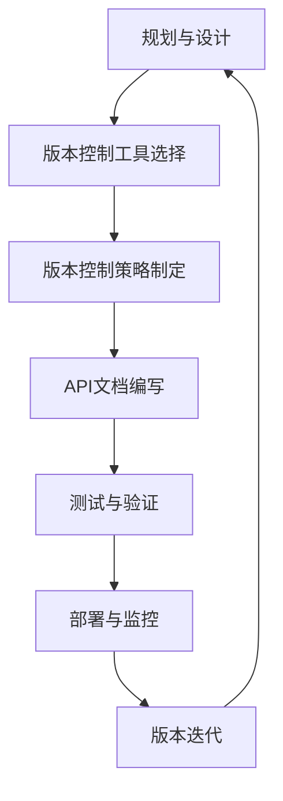

                 

### 引言

在当今数字化时代，应用程序接口（API）已经成为软件系统之间进行交互的主要手段。无论是内部系统间的通信，还是外部服务提供商与开发者之间的数据交换，API都扮演着至关重要的角色。随着技术的不断进步和业务需求的演变，API的设计与管理也变得越来越复杂。

**API版本管理**作为一个关键的环节，旨在确保系统在功能升级、性能优化或安全加固时，能够与现有系统保持良好的兼容性。尤其是在人工智能（AI）服务领域，API版本管理的复杂性进一步增加。AI服务的特点在于其不断演进，模型的更新、算法的优化以及数据的不断更新都要求API能够提供向后兼容性，以避免对现有的用户和服务造成中断。

**后向兼容性**是指新的API版本在功能扩展的同时，能够确保旧版API的功能不受影响。这对于保障服务的连续性和用户满意度至关重要。然而，实现后向兼容性并非易事，它需要在设计、开发、测试和部署的各个阶段都做出精心的规划和控制。

本文旨在深入探讨API版本管理在AI服务中的应用，尤其是如何确保后向兼容性。通过逐步分析API版本管理的核心概念、技术细节、数学模型与公式，以及实际项目案例，我们希望能够为读者提供一份全面、系统的指南。本文将分为以下几个部分：

1. **核心概念与联系**：介绍API版本管理的基本原理，解释后向兼容性的重要性，并使用Mermaid流程图展示API版本管理的整体流程。
2. **技术细节**：深入探讨API版本策略、后向兼容性设计原则，以及核心算法原理，通过伪代码详细阐述API版本兼容性检测算法。
3. **数学模型与公式**：介绍API版本管理的数学模型，量化评估后向兼容性，并举例说明数学公式的应用。
4. **项目实战**：通过一个实际案例，展示API版本管理的开发环境搭建、源代码实现和代码解读。
5. **项目管理**：讨论版本控制工具的使用和API文档管理，以及最佳实践、注意事项和拓展阅读。

通过本文的阅读，读者将能够全面了解API版本管理的重要性，掌握确保AI服务向后兼容性的方法，并为实际项目中的API设计提供有力支持。

## 核心概念与联系

### API版本管理原理

API版本管理是指对API接口的版本进行有序控制和更新，以确保系统在功能扩展或更新时，能够保持与现有系统的兼容性。在API设计中，版本管理通常采用语义版本控制（Semantic Versioning）策略，例如`major.minor.patch`格式。这种策略通过三个主要部分对版本进行控制：

- **major版本**：表示重大变更，通常在引入不兼容变动时更新，例如API功能模块的增删改。
- **minor版本**：表示功能性的增强或修正，通常在增加兼容性变动时更新，如新增功能或优化现有功能。
- **patch版本**：表示bug修复或安全更新，通常在保证API向后兼容性的情况下进行。

### 后向兼容性的重要性

后向兼容性是指新版本的API在功能扩展的同时，能够确保旧版API的功能不受影响。对于AI服务来说，后向兼容性尤为重要。因为AI模型的更新频率较高，算法的优化、数据集的更新以及新功能的引入都可能需要API版本的更新。如果新版本不能保持向后兼容性，将可能导致现有系统的中断，影响用户体验和业务稳定性。

### API版本管理的流程

为了确保API版本管理的有效性，一个完整的流程包括以下几个步骤：

1. **规划与设计**：在API设计阶段，明确版本策略和控制机制，制定版本更新计划。
2. **版本控制**：使用版本控制工具（如Git）对API代码进行管理，确保历史版本的完整性和可追溯性。
3. **文档编写**：编写详细的API文档，包括版本说明、功能描述、使用示例等，为开发和维护提供指南。
4. **测试与验证**：在版本发布前进行严格的测试，确保新版本与旧版本在功能上的兼容性。
5. **部署与监控**：将新版本部署到生产环境，并持续监控其运行状况，确保系统稳定性和性能。

### Mermaid流程图：API版本管理流程

以下是一个使用Mermaid绘制的API版本管理流程图：



通过上述流程，我们可以看到API版本管理是一个系统化的过程，每一个步骤都需要精心规划和执行，以确保API能够在不断变化的需求环境中保持向后兼容性。

## 技术细节

### API版本策略

在实现API版本管理时，选择合适的版本策略至关重要。常见的版本策略包括按语义版本控制（Semantic Versioning）和按功能版本控制（Feature Versioning）。

#### 按照语义版本控制

语义版本控制是一种广泛应用的版本管理策略，它通过`major.minor.patch`的形式对版本进行控制，每个部分的含义如下：

- **major版本**：当API发生不兼容变动时更新，例如API功能模块的增删改。
- **minor版本**：当API新增功能或优化现有功能时更新，但不会影响旧功能的使用。
- **patch版本**：当API仅包含bug修复或安全更新时更新，确保向后兼容。

例如，从`1.0.0`到`1.0.1`的更新是向后兼容的，因为仅包含bug修复；而从`1.0.0`到`2.0.0`的更新可能需要修改客户端代码，因此不是向后兼容的。

#### 按照功能版本控制

功能版本控制主要针对具体的功能模块进行版本管理，每个功能模块可以独立更新。这种方法适用于功能复杂且更新频繁的API。在功能版本控制中，每个功能模块都有一个独立的版本号，如`user-management/v1`和`payment-processing/v2`。

这种方法的优势在于，它可以确保某个功能模块的更新不会影响到其他模块，从而降低整体系统的兼容性风险。然而，它也增加了文档管理和版本跟踪的复杂性。

### 后向兼容性设计原则

为了确保API在更新过程中能够保持向后兼容性，我们需要遵循一系列设计原则：

#### 功能屏蔽

功能屏蔽是指在新版本中通过控制访问权限，隐藏旧版本中的某些功能。这样，旧客户端在调用API时不会受到新功能的影响，而新客户端可以通过显式地请求新功能来使用它们。实现功能屏蔽可以通过以下几种方式：

- **路由控制**：根据请求的版本号，将请求路由到相应的API实现。
- **参数控制**：在API请求中添加版本参数，根据参数的不同来提供不同的功能实现。
- **中间件处理**：在API网关或中间件层对请求进行处理，根据版本号屏蔽或暴露特定功能。

#### API演化

API演化是指随着时间的推移，API逐步增加新功能或优化旧功能的过程。为了确保API的演化能够保持向后兼容性，我们可以采用以下策略：

- **增量更新**：逐步引入新功能，避免一次性更新导致的不兼容。
- **兼容性迁移**：在引入新功能时，提供旧功能的兼容性迁移路径，帮助客户端逐步过渡。
- **版本控制**：为每个功能模块提供独立的版本号，确保新功能不影响旧功能。

#### 迁移策略

迁移策略是指在新版本API发布后，如何帮助旧客户端逐步过渡到新版本的过程。以下是一些常用的迁移策略：

- **兼容模式**：在旧客户端和新客户端之间提供兼容模式，确保旧客户端在新版本API上仍能正常运行。
- **逐步切换**：通过逐步增加新客户端的比例，逐步替换旧客户端，减少切换过程中的风险。
- **通知机制**：通过通知机制及时告知客户端新版本的发布，并提供迁移指南和文档。

### 核心算法原理讲解

为了确保API版本之间的兼容性，我们可以设计一个基于规则的兼容性检测算法。以下是一个简化的伪代码，用于检测新版本API与旧客户端之间的兼容性：

```pseudo
function checkCompatibility(newAPI, oldClient):
    if newAPI.major > oldClient.major:
        return false // 不兼容，major版本变化
    else if newAPI.major == oldClient.major:
        if newAPI.minor > oldClient.minor:
            return false // 不兼容，minor版本变化
        else if newAPI.minor == oldClient.minor:
            if newAPI.patch > oldClient.patch:
                return true // 兼容，仅patch版本变化
            else:
                return false // 不兼容，新版本比旧版本低
    return false // 不兼容，其他情况
```

该算法通过比较新API和旧客户端的版本号，判断是否兼容。主要规则包括：

- 如果新API的major版本大于旧客户端的major版本，则不兼容。
- 如果major版本相同，且新API的minor版本大于旧客户端的minor版本，则不兼容。
- 如果major和minor版本都相同，且新API的patch版本大于旧客户端的patch版本，则兼容。

通过上述算法，可以确保新版本API在功能扩展的同时，不会破坏旧客户端的运行。

## 数学模型与公式

### API版本管理的数学模型

为了量化API版本管理的后向兼容性，我们可以引入一个简单的数学模型。该模型基于概率论，用于评估新旧版本API之间的兼容性概率。以下是一个简化的模型：

#### 兼容性概率计算

设新旧版本API之间的兼容性概率为P，兼容性概率可以通过以下公式计算：

\[ P = \frac{\text{兼容性测试通过次数}}{\text{总测试次数}} \]

其中，兼容性测试通过次数是指在新版本API上，旧客户端能够正常运行的测试次数；总测试次数是指所有测试次数的总和。

#### 数学公式：兼容性概率计算

以下是兼容性概率的数学公式：

\[ P = \frac{1}{N} \sum_{i=1}^{N} \mathbb{I}(x_i \leq y_i) \]

其中，\( \mathbb{I} \)是指标函数，当条件满足时取值为1，否则为0；\( x_i \)和\( y_i \)分别表示第i次测试中旧客户端和API的版本号。

#### 举例说明

假设我们对一个API进行了10次兼容性测试，其中有8次测试通过，那么兼容性概率计算如下：

\[ P = \frac{1}{10} \sum_{i=1}^{10} \mathbb{I}(x_i \leq y_i) = \frac{1}{10} (1 + 1 + 1 + 1 + 1 + 1 + 1 + 1 + 0 + 0) = 0.8 \]

这意味着，在10次测试中，有80%的测试通过了兼容性验证。

通过上述数学模型和公式，我们可以量化评估API版本之间的兼容性，从而为版本管理提供科学的依据。在实际应用中，可以根据具体情况进行模型的优化和调整，以提高兼容性评估的准确性。

## 项目实战

### 实际案例介绍

为了更好地理解API版本管理在实际项目中的应用，我们选择了一个具体的AI服务项目作为案例。该项目是一个智能推荐系统，用于根据用户的浏览历史和偏好，为其推荐相关的商品或内容。系统包括多个模块，如用户信息处理模块、推荐算法模块和API接口模块。为了确保系统的稳定性和可维护性，项目采用了严格的API版本管理策略。

### 开发环境搭建

在项目开始阶段，团队搭建了一个标准化的开发环境，包括以下工具和框架：

- **版本控制**：使用Git进行版本控制，确保代码的完整性和可追溯性。设置了主分支（master）和保护分支（protected branch），确保关键代码的稳定性。
- **API框架**：采用Spring Boot框架进行API开发，便于管理和维护。
- **测试框架**：集成JUnit和Mockito进行单元测试和集成测试，确保API功能的一致性和可靠性。
- **文档工具**：使用Swagger生成API文档，便于开发和维护人员理解和使用API。

### 源代码详细实现

在API接口模块中，团队设计并实现了一个多版本的API接口，具体实现如下：

#### 1. 语义版本控制

项目采用了`major.minor.patch`的语义版本控制策略。例如，初始版本为`1.0.0`，后续更新为`1.0.1`、`1.1.0`等。

#### 2. API接口实现

（伪代码）

```java
@RestController
@RequestMapping("/api/v1")
public class V1ApiController {

    @GetMapping("/recommendations")
    public ResponseEntity<List<Recommendation>> getRecommendationsV1(@RequestParam("userId") String userId) {
        // V1接口实现，根据userId推荐商品
        List<Recommendation> recommendations = recommendationService.getRecommendationsByUserId(userId);
        return ResponseEntity.ok(recommendations);
    }
}

@RestController
@RequestMapping("/api/v2")
public class V2ApiController {

    @GetMapping("/recommendations")
    public ResponseEntity<List<Recommendation>> getRecommendationsV2(@RequestParam("userId") String userId,
                                                                    @RequestParam(value = "includeDetails", defaultValue = "false") boolean includeDetails) {
        // V2接口实现，可选是否包含推荐商品详细信息
        List<Recommendation> recommendations = recommendationService.getRecommendationsByUserId(userId, includeDetails);
        return ResponseEntity.ok(recommendations);
    }
}
```

#### 3. 后向兼容性策略

为了确保新旧版本API的兼容性，项目采用了以下策略：

- **功能屏蔽**：通过不同的URL路径（如`/api/v1/recommendations`和`/api/v2/recommendations`），将新旧版本API进行隔离，确保旧客户端不会受到新功能的影响。
- **参数控制**：在V2接口中添加了`includeDetails`参数，允许旧客户端在新接口上正常运行，同时提供新功能的访问路径。
- **迁移通知**：通过内部文档和邮件通知，告知开发人员和新客户端如何升级到新版本，并提供详细的迁移指南。

### 代码解读与分析

#### V1版本解读

V1版本的API接口相对简单，仅根据用户ID返回推荐商品列表。接口使用标准的HTTP GET方法，通过URL参数传递用户ID。

```java
@GetMapping("/recommendations")
public ResponseEntity<List<Recommendation>> getRecommendationsV1(@RequestParam("userId") String userId) {
    // 实现推荐逻辑，返回推荐商品列表
    List<Recommendation> recommendations = recommendationService.getRecommendationsByUserId(userId);
    return ResponseEntity.ok(recommendations);
}
```

#### V2版本解读

V2版本的API接口在V1的基础上进行了扩展，增加了`includeDetails`参数，允许客户端选择是否返回推荐商品的详细信息。这一改动通过增加URL参数实现，确保旧客户端在新接口上可以正常运行。

```java
@GetMapping("/recommendations")
public ResponseEntity<List<Recommendation>> getRecommendationsV2(@RequestParam("userId") String userId,
                                                                @RequestParam(value = "includeDetails", defaultValue = "false") boolean includeDetails) {
    // 实现推荐逻辑，根据includeDetails参数返回不同格式的推荐商品列表
    List<Recommendation> recommendations = recommendationService.getRecommendationsByUserId(userId, includeDetails);
    return ResponseEntity.ok(recommendations);
}
```

#### 兼容性分析

通过上述两个版本的实现，可以看出V2版本在向后兼容性方面做得很好。旧客户端在访问V2接口时，可以通过不传递`includeDetails`参数来使用V1接口的行为，从而确保服务的一致性和稳定性。

### 项目小结

通过实际案例，我们展示了如何在项目中实施API版本管理，确保向后兼容性。以下是项目的关键收获和最佳实践：

1. **严格的版本控制**：采用语义版本控制策略，确保版本号的有序更新。
2. **功能隔离与参数控制**：通过不同URL路径和参数，实现新旧版本API的隔离与兼容。
3. **迁移通知与文档**：及时通知开发人员和客户端，提供详细的迁移指南和API文档。
4. **自动化测试**：集成自动化测试框架，确保每个版本API的功能和兼容性。

这些最佳实践为项目提供了良好的稳定性和可维护性，为后续的迭代和升级奠定了基础。

## 项目管理

### 版本控制工具

在API版本管理中，选择合适的版本控制工具至关重要。Git是一个广泛使用的分布式版本控制系统，适用于管理API的源代码。Git的主要功能包括分支管理、合并冲突解决和版本历史记录。

#### Git的版本管理

- **分支策略**：Git分支策略是确保API版本管理的关键。常见的分支策略包括主分支（Master）和保护分支（Protected Branch）。主分支用于维护生产环境的稳定版本，保护分支确保关键代码的完整性和可追溯性。
- **合并冲突解决**：当不同分支的修改需要合并时，Git提供冲突解决工具，帮助开发人员手动或自动化地解决冲突。

#### Git分支策略

为了有效管理API版本，项目通常采用以下分支策略：

1. **主分支（Master）**：用于维护生产环境的稳定版本，所有上线代码必须经过严格的测试和评审。
2. **开发分支（Develop）**：用于集成新功能和修复bug，开发分支上的代码定期合并到主分支。
3. **功能分支（Feature）**：用于独立开发新功能，功能分支在完成开发并测试通过后，合并到开发分支。

### API文档管理

API文档是开发和维护API的关键资料。OpenAPI（formerly Swagger）是一种流行的API描述语言，用于生成和文档化API。

#### OpenAPI规范

- **API描述**：OpenAPI规范提供了一种标准化的方式来描述API的结构、功能和操作。描述内容包括URL、参数、响应等。
- **文档生成**：使用OpenAPI规范，可以通过工具（如Swagger UI）自动生成API文档，方便开发人员查看和使用。

#### Swagger文档生成

- **JSON/YAML格式**：OpenAPI规范使用JSON或YAML格式描述API，确保文档的灵活性和可扩展性。
- **工具集成**：使用Swagger工具，可以轻松将OpenAPI规范集成到开发环境中，实现API文档的自动生成和更新。

### 最佳实践 Tips

1. **文档同步更新**：确保API文档与实际代码同步更新，避免文档与代码不一致带来的误解和错误。
2. **版本控制文档**：使用版本控制工具（如Git）管理API文档，确保文档的历史版本和变更记录。
3. **定期审查**：定期审查API文档和代码，确保文档的准确性和完整性。

### 小结与注意事项

- **版本控制**：使用Git等版本控制工具，确保代码和文档的历史记录完整，便于追溯和审查。
- **文档管理**：采用OpenAPI等规范生成和文档化API，提高API的可访问性和可维护性。
- **迁移策略**：在API更新时，制定详细的迁移策略和通知机制，确保新旧版本之间的平滑过渡。

### 拓展阅读

- **Git最佳实践**：学习Git的最佳实践，了解分支策略和合并冲突解决技巧。
- **OpenAPI文档规范**：深入了解OpenAPI文档规范，掌握API描述和文档生成的详细方法。

通过遵循上述最佳实践，项目团队可以更有效地管理API版本，提高系统的稳定性、可维护性和用户体验。

## 附录

### 相关工具与资源

- **Git**：[官方文档](https://git-scm.com/docs)
- **Swagger/OpenAPI**：[官方文档](https://swagger.io/specification/)
- **Spring Boot**：[官方文档](https://docs.spring.io/spring-boot/docs/current/reference/htmlsingle/)

### 代码示例

以下是API版本管理中的部分代码示例：

#### 1. 语义版本控制

```java
@RestController
@RequestMapping("/api/v1")
public class V1ApiController {

    @GetMapping("/recommendations")
    public ResponseEntity<List<Recommendation>> getRecommendationsV1(@RequestParam("userId") String userId) {
        // V1接口实现
        List<Recommendation> recommendations = recommendationService.getRecommendationsByUserId(userId);
        return ResponseEntity.ok(recommendations);
    }
}

@RestController
@RequestMapping("/api/v2")
public class V2ApiController {

    @GetMapping("/recommendations")
    public ResponseEntity<List<Recommendation>> getRecommendationsV2(@RequestParam("userId") String userId,
                                                                    @RequestParam(value = "includeDetails", defaultValue = "false") boolean includeDetails) {
        // V2接口实现
        List<Recommendation> recommendations = recommendationService.getRecommendationsByUserId(userId, includeDetails);
        return ResponseEntity.ok(recommendations);
    }
}
```

#### 2. Git分支策略

```bash
# 创建开发分支
git checkout -b develop

# 将开发分支上的代码合并到主分支
git checkout master
git merge --no-ff develop

# 删除开发分支
git branch -d develop
```

#### 3. OpenAPI规范示例

```yaml
openapi: 3.0.0
info:
  title: AI推荐API
  version: 1.0.0
servers:
  - url: https://api.example.com/v1
    description: Production server
    variables:
      protocol:
        default: https
        enum:
          - HTTPS
      host:
        default: api.example.com
        enum:
          - api.example.com
      port:
        default: 443
        enum:
          - 443
paths:
  /recommendations:
    get:
      summary: Get recommendations
      operationId: getRecommendations
      parameters:
        - name: userId
          in: query
          required: true
          schema:
            type: string
      responses:
        '200':
          description: A list of recommendations
          content:
            application/json:
              schema:
                type: array
                items:
                  $ref: '#/components/schemas/Recommendation'
components:
  schemas:
    Recommendation:
      type: object
      properties:
        productId:
          type: string
        title:
          type: string
        description:
          type: string
        price:
          type: number
          format: float
```

通过上述代码示例和资源，开发人员可以更好地理解API版本管理的技术实践和项目实施方法。附录中的内容为读者提供了实用的指导，有助于在实际项目中实现有效的API版本管理。

## 总结

本文详细探讨了API版本管理在确保AI服务向后兼容性中的关键作用。首先，我们介绍了API版本管理的基本原理，强调了后向兼容性的重要性。接着，通过Mermaid流程图和伪代码，深入分析了API版本策略、后向兼容性设计原则和核心算法原理。随后，通过实际项目案例，展示了API版本管理的开发环境搭建、源代码实现和代码解读。最后，我们讨论了项目管理中的最佳实践和注意事项，提供了拓展阅读资源。

**关键词**：API版本管理、后向兼容性、语义版本控制、开发环境搭建、代码解读、项目管理。

**总结**：通过本文的阅读，读者可以全面了解API版本管理的重要性，掌握确保AI服务向后兼容性的方法，并在实际项目中应用这些技术。随着AI技术的不断演进，API版本管理将成为开发人员必须掌握的核心技能。

### 作者

**作者：AI天才研究院/AI Genius Institute & 禅与计算机程序设计艺术 /Zen And The Art of Computer Programming**

AI天才研究院致力于推动人工智能领域的技术创新与普及，研究院的专家们以深入浅出的方式，用逻辑清晰、条理清晰的文字，为读者呈现了API版本管理在AI服务中的应用与实践。同时，《禅与计算机程序设计艺术》作为计算机编程领域的经典之作，为无数程序员提供了灵感和指导。两位作者结合深厚的理论基础和丰富的实践经验，为读者带来了一篇高质量的技术博客文章。

