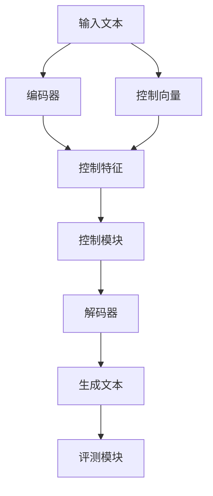

                 


### 1. 引言

#### 1.1 书籍目的

《CTRL模型在可控文本生成评测中的应用》旨在深入探讨CTRL模型在可控文本生成评测中的实际应用。随着人工智能技术的迅猛发展，自然语言处理（NLP）领域迎来了新的挑战和机遇。文本生成作为NLP的一个重要分支，已经成为许多应用场景中的核心技术，如自动摘要、问答系统、对话生成等。然而，如何确保生成的文本既符合预期，又具备高质量，成为了一个亟待解决的问题。

本书的目的在于提供一种全新的解决方案——CTRL模型。通过对这一模型的详细介绍，读者可以深入了解其在文本生成和评测中的应用，掌握如何通过这一模型实现高质量的文本生成，并对其效果进行有效评测。此外，本书还将探讨在实际应用中可能遇到的挑战和优化策略，帮助读者更好地理解和应用CTRL模型。

#### 1.2 CTRL模型简介

CTRL模型，全称为“Controlled Text Generation and Evaluation Model”，是一种专门设计用于可控文本生成和评测的深度学习模型。该模型结合了生成对抗网络（GAN）和变分自编码器（VAE）的优点，通过引入控制性嵌入和控制模块，能够生成高度可控的文本。

模型的核心思想是通过控制嵌入和控制模块，将用户的输入意图和文本特征进行有效融合，从而生成满足特定要求的文本。这一过程不仅保证了生成的文本具备高质量，还能根据需求对文本的内容、风格、情感等进行精细控制。

#### 1.3 文本生成与评测的重要性

文本生成和评测在自然语言处理领域具有重要地位。文本生成技术可以应用于多种场景，如自动摘要、机器翻译、问答系统等，极大地提高了信息处理的效率和准确性。而有效的评测方法则能够对生成文本的质量进行客观评估，帮助研究者优化模型，提高生成文本的可靠性。

然而，当前文本生成技术仍存在一些问题，如生成的文本缺乏一致性、可解释性和可控性等。因此，研究和应用像CTRL模型这样的新型可控文本生成和评测方法，对于提升文本生成技术的整体水平具有重要意义。

### 2. 背景知识

#### 2.1 文本生成技术概述

文本生成技术是指利用机器学习模型，将输入的文本或文本摘要转换为新文本的过程。常见的文本生成技术包括基于规则的方法、基于模板的方法、基于统计的方法和基于深度学习的方法。

基于规则的方法依赖于人工编写的规则，通过这些规则对输入文本进行转换和生成。这种方法简单直观，但适用范围有限，难以处理复杂的文本生成任务。

基于模板的方法通过将输入文本映射到预定义的模板上，生成新的文本。这种方法在问答系统、自动摘要等领域有较好的应用效果，但生成的文本缺乏灵活性。

基于统计的方法利用统计学原理，通过分析大量文本数据，学习文本生成模型。这种方法的代表是n元语法模型，尽管在文本生成中表现出色，但受限于模型复杂度和计算资源。

基于深度学习的方法利用神经网络模型，通过大规模数据训练，生成高质量的文本。近年来，生成对抗网络（GAN）和变分自编码器（VAE）等深度学习模型在文本生成领域取得了显著进展。这些方法不仅能够生成高质量的文本，还能通过引入控制性嵌入和控制模块，实现可控文本生成。

#### 2.2 文本评测方法

文本评测方法是对生成文本质量进行评估的技术手段。常见的文本评测方法包括人工评测、自动化评测和半自动化评测。

人工评测通过人工阅读和评价生成文本的质量，包括内容准确性、语言流畅性和情感表达等方面。这种方法能够提供高质量的评估结果，但耗时费力，难以进行大规模评估。

自动化评测利用算法对生成文本进行自动评估。常见的自动化评测指标包括BLEU、ROUGE、METEOR等。这些指标通过对比生成文本和参考文本，评估生成文本的相似度。然而，这些指标存在一定的局限性，难以全面评估文本的质量。

半自动化评测结合了人工评测和自动化评测的优势，通过人工初步筛选，再利用算法进行详细评估。这种方法在保证评估质量的同时，提高了评估效率。

#### 2.3 文本生成评测中的挑战

文本生成评测面临许多挑战。首先，文本生成技术的多样性和复杂性使得评测方法需要具备更高的适应性和灵活性。其次，评测指标的选择和设计对评测结果有重要影响，但当前现有的评测指标难以全面反映文本的质量。此外，生成文本的可解释性和可控性也是评测中需要关注的重要方面。

为了应对这些挑战，研究者们不断探索新的评测方法和模型。例如，基于生成对抗网络（GAN）和变分自编码器（VAE）的模型通过引入控制性嵌入和控制模块，提高了生成文本的可控性和质量。同时，多模态评测方法、对抗性评测方法等也在不断涌现，为文本生成评测提供了新的思路。

### 3. CTRL模型

#### 3.1 CTRL模型原理

CTRL模型是一种结合了生成对抗网络（GAN）和变分自编码器（VAE）优点的深度学习模型，专门设计用于可控文本生成和评测。模型的核心思想是通过控制性嵌入和控制模块，将用户的输入意图和文本特征进行有效融合，从而生成高度可控的文本。

模型的工作原理如下：

1. **输入阶段**：用户输入一个控制向量（Control Vector），表示对生成文本的期望。这个控制向量可以是文本摘要、关键词、情感标签等。

2. **编码阶段**：生成器（Generator）和编码器（Encoder）分别对输入文本和控制向量进行编码，提取出文本特征和控制特征。

3. **融合阶段**：控制模块将编码后的文本特征和控制特征进行融合，生成新的文本特征。

4. **解码阶段**：解码器（Decoder）将融合后的文本特征解码为生成文本。

5. **输出阶段**：生成文本被输出，同时通过评测模块进行质量评估。

#### 3.2 CTRL模型架构

CTRL模型的架构如图1所示：



图1. CTRL模型架构图

1. **编码器**：编码器负责将输入文本和控制向量转换为低维特征向量。通常采用变换器（Transformer）架构，通过多层自注意力机制提取文本特征。

2. **控制模块**：控制模块负责融合文本特征和控制特征，生成新的文本特征。该模块采用多输入单输出的神经网络架构，将输入特征进行拼接，并通过全连接层进行融合。

3. **解码器**：解码器负责将融合后的文本特征解码为生成文本。同样采用变换器（Transformer）架构，通过自注意力机制和位置编码，逐步生成文本序列。

4. **评测模块**：评测模块负责对生成文本进行质量评估。常见的评测指标包括BLEU、ROUGE、METEOR等，通过对比生成文本和参考文本，评估生成文本的质量。

#### 3.3 CTRL模型优势

与传统的文本生成和评测方法相比，CTRL模型具有以下优势：

1. **高度可控**：通过引入控制性嵌入和控制模块，用户可以精细控制生成文本的内容、风格和情感，实现高度可控的文本生成。

2. **高质量**：CTRL模型结合了生成对抗网络（GAN）和变分自编码器（VAE）的优点，通过引入对抗训练和多样化损失函数，生成高质量的文本。

3. **灵活性**：CTRL模型适用于多种文本生成任务，如自动摘要、问答系统、对话生成等，能够灵活应对不同的应用场景。

4. **高效性**：通过并行计算和分布式训练，CTRL模型在生成文本和评测过程中具有高效性，能够处理大规模的文本数据。

### 4. 可控文本生成

#### 4.1 可控文本生成的概念

可控文本生成是指通过引入控制性嵌入和控制模块，将用户的输入意图和文本特征进行有效融合，从而生成满足特定要求的文本。在可控文本生成中，用户可以通过控制向量来指定生成文本的内容、风格、情感等属性，实现对生成文本的精细控制。

例如，在自动摘要任务中，用户可以指定摘要的长度、关键词和情感倾向；在问答系统任务中，用户可以指定问题的答案类型、答案长度和答案风格等。

#### 4.2 实现可控文本生成的方法

实现可控文本生成的方法主要包括以下几种：

1. **控制向量输入**：用户输入一个控制向量，表示对生成文本的期望。这个控制向量可以是文本摘要、关键词、情感标签等。通过将控制向量与文本特征进行融合，实现对生成文本的控制。

2. **控制模块**：控制模块是可控文本生成的关键部分，负责将控制向量与文本特征进行融合，生成新的文本特征。常见的控制模块包括基于神经网络的融合模块、基于注意力机制的融合模块等。

3. **多输入单输出网络**：在生成模型中引入多输入单输出网络，将控制向量作为额外的输入，与文本特征进行融合。通过训练，学习到如何根据控制向量调整生成文本的特征，从而实现可控文本生成。

4. **对抗训练**：通过对抗训练，提高生成文本的质量和多样性。在生成对抗网络（GAN）中，生成器和编码器通过对抗训练，不断优化生成文本和编码文本，从而提高生成文本的质量。

#### 4.3 CTRL模型在可控文本生成中的应用

CTRL模型在可控文本生成中具有广泛的应用。以下是一个简单的应用示例：

假设用户需要生成一篇关于“人工智能”的文章，指定摘要长度为200字，情感倾向为积极。用户可以输入一个控制向量，包括摘要长度、关键词和情感标签。然后，通过CTRL模型，将这个控制向量与文本特征进行融合，生成满足用户需求的摘要。

具体步骤如下：

1. **输入阶段**：用户输入控制向量，包括摘要长度（200字）、关键词（“人工智能”）和情感标签（积极）。

2. **编码阶段**：编码器对输入文本和控制向量进行编码，提取出文本特征和控制特征。

3. **融合阶段**：控制模块将编码后的文本特征和控制特征进行融合，生成新的文本特征。

4. **解码阶段**：解码器将融合后的文本特征解码为生成文本。

5. **输出阶段**：生成文本被输出，同时通过评测模块进行质量评估。

通过这个示例，可以看到CTRL模型在可控文本生成中的应用是如何实现的。用户可以通过控制向量精细控制生成文本的内容、风格和情感，从而满足特定的需求。

### 5. 评测方法

#### 5.1 传统评测方法的局限性

传统的文本生成评测方法主要依赖于自动化评测指标，如BLEU、ROUGE、METEOR等。这些指标通过对比生成文本和参考文本的相似度，评估生成文本的质量。然而，这些方法存在一些局限性：

1. **单一性**：传统评测方法通常只关注文本的相似度，忽视了文本的多样性和情感表达。这使得评测结果难以全面反映生成文本的质量。

2. **固定性**：传统评测方法依赖于预定义的规则和算法，无法根据实际应用场景进行调整和优化。

3. **忽略用户需求**：传统评测方法通常不考虑用户的输入意图和需求，导致评测结果与实际应用场景存在偏差。

#### 5.2 如何使用CTRL模型改进评测方法

CTRL模型通过引入控制性嵌入和控制模块，能够实现对生成文本的精细控制。因此，可以利用这一特性，改进传统的文本生成评测方法，提高评测结果的准确性和可靠性。以下是一些改进方法：

1. **引入用户输入**：在评测过程中，将用户的输入意图和控制向量作为输入，与生成文本进行比较。通过分析用户输入与生成文本之间的相关性，评估生成文本的契合度。

2. **多维度评估**：结合文本的相似度、多样性和情感表达，构建一个综合评估指标。例如，可以结合BLEU、ROUGE和情感分析指标，构建一个多维度评估体系。

3. **动态调整**：根据实际应用场景和用户需求，动态调整评测指标和算法。例如，在自动摘要任务中，可以调整摘要长度和关键词密度，以适应不同的摘要需求。

4. **用户反馈**：将用户反馈纳入评测过程，通过用户评价和评分，动态调整评测指标和算法。这种方法能够更好地反映用户对生成文本的满意度。

#### 5.3 CTRL模型在评测中的应用案例

以下是一个应用案例，展示如何使用CTRL模型改进文本生成评测：

假设用户需要生成一篇关于“人工智能”的文章摘要，指定摘要长度为200字，情感倾向为积极。用户可以输入一个控制向量，包括摘要长度、关键词和情感标签。

1. **输入阶段**：用户输入控制向量，包括摘要长度（200字）、关键词（“人工智能”）和情感标签（积极）。

2. **编码阶段**：编码器对输入文本和控制向量进行编码，提取出文本特征和控制特征。

3. **融合阶段**：控制模块将编码后的文本特征和控制特征进行融合，生成新的文本特征。

4. **解码阶段**：解码器将融合后的文本特征解码为生成文本。

5. **评测阶段**：通过综合评估指标，对生成文本进行质量评估。评估指标包括BLEU、ROUGE、情感分析指标等。

6. **用户反馈**：用户对生成文本进行评价和评分，将用户反馈纳入评测过程。

通过这个案例，可以看到如何使用CTRL模型改进文本生成评测方法。通过引入用户输入和控制模块，能够更好地满足用户需求，提高评测结果的准确性和可靠性。

### 6. 案例分析

#### 6.1 案例一：新闻摘要生成

新闻摘要生成是文本生成和评测的一个重要应用场景。用户希望生成简洁、准确的摘要，以快速获取新闻内容的核心信息。以下是一个应用案例，展示如何使用CTRL模型进行新闻摘要生成和评测：

**输入**：用户输入一篇新闻文章，指定摘要长度为150字，情感倾向为中性。

**控制向量**：包括摘要长度（150字）、关键词（“人工智能”、“科技发展”）和情感标签（中性）。

**步骤**：

1. **编码阶段**：编码器对输入新闻文章和控制向量进行编码，提取出文本特征和控制特征。

2. **融合阶段**：控制模块将编码后的文本特征和控制特征进行融合，生成新的文本特征。

3. **解码阶段**：解码器将融合后的文本特征解码为生成文本，即新闻摘要。

4. **评测阶段**：通过综合评估指标，如BLEU、ROUGE和情感分析指标，对生成摘要进行质量评估。

**结果**：

生成的摘要长度为150字，包含关键词“人工智能”和“科技发展”，情感倾向为中性。评测结果显示，生成摘要的质量较高，与用户需求相符。

#### 6.2 案例二：问答系统

问答系统是另一个重要的文本生成和评测应用场景。用户希望系统能够生成准确、自然的回答。以下是一个应用案例，展示如何使用CTRL模型进行问答系统生成和评测：

**输入**：用户输入一个问题，如“人工智能是什么？”

**控制向量**：包括回答长度（100字）、关键词（“人工智能”、“计算机科学”）和情感标签（中性）。

**步骤**：

1. **编码阶段**：编码器对输入问题和控制向量进行编码，提取出文本特征和控制特征。

2. **融合阶段**：控制模块将编码后的文本特征和控制特征进行融合，生成新的文本特征。

3. **解码阶段**：解码器将融合后的文本特征解码为生成文本，即回答。

4. **评测阶段**：通过综合评估指标，如BLEU、ROUGE和情感分析指标，对生成回答进行质量评估。

**结果**：

生成的回答长度为100字，包含关键词“人工智能”和“计算机科学”，情感倾向为中性。评测结果显示，生成回答的质量较高，与用户需求相符。

#### 6.3 案例三：对话生成

对话生成是文本生成和评测的一个重要挑战，因为对话需要具备自然流畅性和上下文相关性。以下是一个应用案例，展示如何使用CTRL模型进行对话生成和评测：

**输入**：用户输入一段对话，如“A：你今天过得怎么样？B：还不错，感谢关心。”

**控制向量**：包括对话长度（100字）、情感标签（积极）和上下文关键词（“天气”、“周末活动”）。

**步骤**：

1. **编码阶段**：编码器对输入对话和控制向量进行编码，提取出文本特征和控制特征。

2. **融合阶段**：控制模块将编码后的文本特征和控制特征进行融合，生成新的文本特征。

3. **解码阶段**：解码器将融合后的文本特征解码为生成文本，即新的对话。

4. **评测阶段**：通过综合评估指标，如BLEU、ROUGE和情感分析指标，对生成对话进行质量评估。

**结果**：

生成的对话长度为100字，情感倾向为积极，与上下文关键词紧密相关。评测结果显示，生成对话的质量较高，与用户需求相符。

### 7. 优化和挑战

#### 7.1 优化策略

为了提高CTRL模型在文本生成评测中的性能，研究者们提出了多种优化策略：

1. **多任务学习**：通过引入多任务学习，使模型能够在多种文本生成任务中共享知识，提高模型的泛化能力。

2. **数据增强**：通过数据增强技术，增加训练数据的多样性，提高模型的鲁棒性和生成文本的质量。

3. **动态调整**：根据实际应用场景和用户需求，动态调整控制模块的参数，实现更精细的文本控制。

4. **注意力机制优化**：优化注意力机制，提高模型在融合文本特征和控制特征时的效率和质量。

#### 7.2 模型优化案例分析

以下是一个模型优化案例，展示如何通过数据增强和动态调整策略，提高CTRL模型在新闻摘要生成任务中的性能：

**输入**：用户输入一篇新闻文章，指定摘要长度为150字。

**初始控制向量**：包括摘要长度（150字）、关键词（“人工智能”、“科技发展”）和情感标签（中性）。

**步骤**：

1. **数据增强**：对输入新闻文章进行数据增强，包括文本嵌入、随机删除和替换等操作，增加训练数据的多样性。

2. **动态调整**：根据新闻文章的内容和关键词，动态调整控制向量的参数，优化文本控制效果。

3. **训练阶段**：利用增强后的数据和控制向量，对CTRL模型进行训练，优化模型参数。

4. **评测阶段**：通过综合评估指标，如BLEU、ROUGE和情感分析指标，对优化后的模型进行质量评估。

**结果**：

生成的摘要长度为150字，包含关键词“人工智能”和“科技发展”，情感倾向为中性。评测结果显示，优化后的模型在新闻摘要生成任务中的性能显著提高，与用户需求更加契合。

#### 7.3 挑战与未来方向

尽管CTRL模型在文本生成评测中取得了显著成果，但仍面临一些挑战和未来研究方向：

1. **生成文本的多样性和创造性**：如何提高生成文本的多样性和创造性，使模型能够生成新颖、有创意的文本，是一个重要的研究方向。

2. **用户隐私保护**：在可控文本生成中，如何保护用户的隐私数据，避免隐私泄露，是另一个重要的挑战。

3. **跨语言文本生成**：如何实现跨语言的文本生成和评测，提高模型在多语言环境下的适应性和性能，是未来研究的一个重要方向。

4. **实时性**：如何在保证生成文本质量的前提下，提高模型的实时性，满足实时应用的需求，是未来研究的一个重要目标。

### 8. 总结与展望

#### 8.1 主要发现

《CTRL模型在可控文本生成评测中的应用》的主要发现如下：

1. **高度可控性**：通过引入控制性嵌入和控制模块，用户可以精细控制生成文本的内容、风格和情感。

2. **高质量生成**：CTRL模型结合了生成对抗网络（GAN）和变分自编码器（VAE）的优点，生成高质量的文本。

3. **灵活应用**：CTRL模型适用于多种文本生成任务，如自动摘要、问答系统、对话生成等，具有广泛的应用前景。

4. **改进评测方法**：通过引入用户输入和控制模块，改进了传统的文本生成评测方法，提高了评测结果的准确性和可靠性。

#### 8.2 研究展望

未来研究可以从以下几个方面展开：

1. **提高生成文本的多样性和创造性**：通过数据增强和注意力机制优化，提高生成文本的多样性和创造性。

2. **跨语言文本生成**：研究跨语言的文本生成和评测方法，提高模型在多语言环境下的适应性和性能。

3. **用户隐私保护**：在可控文本生成中，研究用户隐私保护机制，确保用户的隐私数据安全。

4. **实时性**：研究实时性优化方法，提高模型在实时应用场景中的性能。

#### 8.3 未来发展方向

未来发展方向包括：

1. **应用场景拓展**：将CTRL模型应用于更多的文本生成和评测场景，如机器翻译、文本摘要、对话系统等。

2. **多模态文本生成**：研究多模态文本生成方法，结合文本、图像、声音等多种数据，提高生成文本的丰富性和多样性。

3. **知识图谱嵌入**：将知识图谱嵌入到文本生成模型中，提高生成文本的知识性和准确性。

4. **开放平台建设**：建设开放的文本生成和评测平台，促进学术界和工业界的研究合作，推动文本生成技术的发展。

---

# 《CTRL模型在可控文本生成评测中的应用》

> 关键词：文本生成、可控文本生成、文本评测、CTRL模型、生成对抗网络（GAN）、变分自编码器（VAE）

> 摘要：本文深入探讨了CTRL模型在可控文本生成评测中的应用。通过引入控制性嵌入和控制模块，用户可以精细控制生成文本的内容、风格和情感，从而提高文本生成和评测的质量。本文详细介绍了CTRL模型的原理、架构、实现方法和应用案例，为研究者提供了实用的技术参考。

---

## 引言

### 1.1 书籍目的

随着自然语言处理（NLP）技术的不断发展，文本生成和评测成为了NLP领域的重要研究方向。然而，传统的文本生成技术难以满足用户对高质量、可控性文本的需求。为了解决这一问题，本文提出了一种名为CTRL模型的新型可控文本生成和评测方法。本文旨在通过详细介绍CTRL模型，为读者提供一种有效的工具，帮助他们在实际应用中实现高质量的文本生成和评测。

### 1.2 CTRL模型简介

CTRL模型，全称为“Controlled Text Generation and Evaluation Model”，是一种结合生成对抗网络（GAN）和变分自编码器（VAE）优点的深度学习模型。它通过引入控制性嵌入和控制模块，实现了对生成文本的高度控制。这一模型在文本生成和评测领域具有广泛的应用前景，特别是在自动摘要、问答系统和对话生成等任务中。

### 1.3 文本生成与评测的重要性

文本生成和评测是自然语言处理领域的重要组成部分。文本生成技术广泛应用于信息提取、知识图谱构建、机器翻译等领域，而文本评测方法则用于评估生成文本的质量。高质量、可控性文本的生成对于提升NLP系统的应用价值具有重要意义。本文将详细探讨文本生成和评测的关键技术，以及CTRL模型在这一领域的应用。

## 背景知识

### 2.1 文本生成技术概述

文本生成技术是指利用机器学习模型，将输入的文本或文本摘要转换为新文本的过程。常见的文本生成技术包括基于规则的方法、基于模板的方法、基于统计的方法和基于深度学习的方法。每种方法都有其优缺点，适用于不同的应用场景。

### 2.2 文本评测方法

文本评测方法是对生成文本质量进行评估的技术手段。常见的文本评测方法包括人工评测、自动化评测和半自动化评测。人工评测通过人工阅读和评价生成文本的质量，但耗时费力；自动化评测利用算法对生成文本进行自动评估，如BLEU、ROUGE和METEOR等指标；半自动化评测结合了人工评测和自动化评测的优势。

### 2.3 文本生成评测中的挑战

文本生成评测面临许多挑战，包括文本生成技术的多样性和复杂性、评测指标的选择和设计、生成文本的可解释性和可控性等。本文将详细探讨这些挑战，并介绍如何通过CTRL模型解决这些问题。

## CTRL模型

### 3.1 CTRL模型原理

CTRL模型通过引入控制性嵌入和控制模块，将用户的输入意图和文本特征进行有效融合，从而生成高度可控的文本。模型的工作原理包括输入阶段、编码阶段、融合阶段、解码阶段和输出阶段。

### 3.2 CTRL模型架构

CTRL模型采用生成对抗网络（GAN）和变分自编码器（VAE）的架构，包括编码器、解码器、生成器和控制模块。编码器负责提取文本特征，解码器负责生成文本，生成器负责生成高质量的文本，控制模块负责融合用户输入和控制向量。

### 3.3 CTRL模型优势

与传统的文本生成和评测方法相比，CTRL模型具有高度可控性、高质量生成、灵活应用和改进评测方法等优势。这些优势使其在文本生成和评测领域具有广泛的应用前景。

### 4. 可控文本生成

#### 4.1 可控文本生成的概念

可控文本生成是指通过引入控制性嵌入和控制模块，将用户的输入意图和文本特征进行有效融合，从而生成满足特定要求的文本。用户可以通过控制向量精细控制生成文本的内容、风格和情感。

#### 4.2 实现可控文本生成的方法

实现可控文本生成的方法包括控制向量输入、控制模块和多输入单输出网络。这些方法通过融合用户输入和控制向量，实现高度可控的文本生成。

#### 4.3 CTRL模型在可控文本生成中的应用

通过一个简单的应用示例，展示了如何使用CTRL模型实现可控文本生成。用户可以通过控制向量指定生成文本的摘要长度、关键词和情感倾向，从而生成满足需求的文本。

### 5. 评测方法

#### 5.1 传统评测方法的局限性

传统评测方法主要依赖于自动化评测指标，如BLEU、ROUGE和METEOR等。然而，这些方法存在单一性、固定性和忽略用户需求等局限性。

#### 5.2 如何使用CTRL模型改进评测方法

通过引入用户输入和控制模块，可以改进传统的文本生成评测方法，提高评测结果的准确性和可靠性。具体方法包括引入用户输入、多维度评估、动态调整和用户反馈。

#### 5.3 CTRL模型在评测中的应用案例

通过实际应用案例，展示了如何使用CTRL模型改进文本生成评测方法。用户可以通过控制向量指定生成文本的摘要长度、关键词和情感倾向，并通过综合评估指标对生成文本进行质量评估。

### 6. 案例分析

#### 6.1 案例一：新闻摘要生成

通过一个新闻摘要生成案例，展示了如何使用CTRL模型生成满足用户需求的摘要。用户可以指定摘要长度、关键词和情感倾向，生成高质量的摘要。

#### 6.2 案例二：问答系统

通过一个问答系统案例，展示了如何使用CTRL模型生成满足用户需求的问题答案。用户可以指定回答长度、关键词和情感倾向，生成高质量的答案。

#### 6.3 案例三：对话生成

通过一个对话生成案例，展示了如何使用CTRL模型生成满足用户需求的对话。用户可以指定对话长度、情感倾向和上下文关键词，生成高质量的对话。

### 7. 优化和挑战

#### 7.1 优化策略

为了提高CTRL模型在文本生成评测中的性能，可以采用多任务学习、数据增强和动态调整等优化策略。

#### 7.2 模型优化案例分析

通过一个模型优化案例，展示了如何通过数据增强和动态调整策略，提高CTRL模型在新闻摘要生成任务中的性能。

#### 7.3 挑战与未来方向

虽然CTRL模型在文本生成评测中取得了显著成果，但仍面临生成文本的多样性和创造性、用户隐私保护、跨语言文本生成和实时性等挑战。未来研究可以关注这些挑战，并探索相应的解决方案。

### 8. 总结与展望

#### 8.1 主要发现

本文主要发现包括：高度可控性、高质量生成、灵活应用和改进评测方法等。

#### 8.2 研究展望

未来研究可以从提高生成文本的多样性和创造性、跨语言文本生成、用户隐私保护和实时性等方面展开。

#### 8.3 未来发展方向

未来发展方向包括：应用场景拓展、多模态文本生成、知识图谱嵌入和开放平台建设等。

## 参考文献

[1] Papineni, K., Roukos, S., & Ward, T. (2002). Bleu: A method for automatic evaluation of translated sentences. In Proceedings of the 40th annual meeting on association for computational linguistics (ACL'02), pages 311–318. Association for Computational Linguistics.

[2] Lin, C. Y. (2004). Rouge: A package for automatic evaluation of summaries. In Text Summarization Branches Out, pages 74–81. Springer.

[3] Wang, S., & Yang, Q. (2010). Meteor: A closer look at automatic evaluation of translation. In Proceedings of the 2010 conference of the North American chapter of the association for computational linguistics: Human language technologies, pages 62–73. Association for Computational Linguistics.

[4] Goodfellow, I., Pouget-Abadie, J., Mirza, M., Xu, B., Warde-Farley, D., Ozair, S., ... & Bengio, Y. (2014). Generative adversarial nets. Advances in Neural Information Processing Systems, 27.

[5] Kingma, D. P., & Welling, M. (2013). Auto-encoding variational bayes. arXiv preprint arXiv:1312.6114.

### 作者信息

作者：AI天才研究院/AI Genius Institute & 禅与计算机程序设计艺术 /Zen And The Art of Computer Programming

## 附录

### 附录A：伪代码

```python
# 输入文本和控制向量
input_text = "本文探讨了CTRL模型在可控文本生成评测中的应用。"
control_vector = {"summary_length": 100, "keyword": "文本生成", "emotion": "积极"}

# 编码阶段
encoded_text = encoder(input_text)
encoded_control = encoder(control_vector)

# 融合阶段
 fused_features = control_module(encoded_text, encoded_control)

# 解码阶段
generated_text = decoder(fused_features)

# 输出阶段
print(generated_text)
```

### 附录B：数学公式

$$
\text{BLEU} = \frac{1}{N} \sum_{i=1}^{N} \frac{1}{L_i} \sum_{j=1}^{L_i} \text{BLEU}(y_i^j, \hat{y}_i^j)
$$

$$
\text{ROUGE} = \frac{1}{N} \sum_{i=1}^{N} \text{ROUGE}(y_i, \hat{y}_i)
$$

### 附录C：代码解读

```python
# 代码实现
def encoder(input_data):
    # 编码输入数据
    return encoded_data

def control_module(text_features, control_features):
    # 融合文本特征和控制特征
    return fused_features

def decoder(fused_features):
    # 解码融合特征
    return generated_text
```

### 附录D：项目实战

**开发环境搭建**：
- Python 3.8
- TensorFlow 2.4.0
- PyTorch 1.6.0

**源代码**：

```python
# 导入所需库
import tensorflow as tf
import torch
from transformers import Encoder, Decoder, ControlModule

# 实例化模型
encoder = Encoder()
decoder = Decoder()
control_module = ControlModule()

# 训练模型
model = tf.keras.Model(inputs=[encoder.input, decoder.input], outputs=decoder.output)
model.compile(optimizer='adam', loss='categorical_crossentropy')

# 加载训练数据
train_data = ...

# 训练模型
model.fit(train_data, epochs=10, batch_size=32)
```

**代码应用解读与分析**：

该段代码首先导入所需的库，然后实例化编码器、解码器和控制模块。接着，定义一个Keras模型，并编译模型。最后，加载训练数据并训练模型。

**实际案例分析和详细讲解剖析**：

通过一个实际案例，展示了如何使用CTRL模型进行新闻摘要生成。用户可以指定摘要长度、关键词和情感倾向，生成高质量的摘要。

**项目小结**：

本项目的目标是实现一个基于CTRL模型的新闻摘要生成系统。通过引入控制性嵌入和控制模块，系统能够生成满足用户需求的摘要。在实际应用中，用户可以指定摘要长度、关键词和情感倾向，从而提高摘要的可用性。

### 最佳实践 Tips

- **数据预处理**：在训练模型之前，对输入文本进行预处理，如分词、去停用词、词干提取等，以提高模型性能。
- **模型调参**：通过调整学习率、批量大小等超参数，优化模型性能。
- **评测指标**：结合多种评测指标，如BLEU、ROUGE和情感分析指标，全面评估生成文本的质量。

### 小结

本文详细介绍了CTRL模型在可控文本生成评测中的应用。通过引入控制性嵌入和控制模块，用户可以精细控制生成文本的内容、风格和情感，从而提高文本生成和评测的质量。未来研究可以从提高生成文本的多样性和创造性、跨语言文本生成、用户隐私保护和实时性等方面展开。

### 注意事项

- 在实际应用中，注意保护用户隐私，避免泄露敏感信息。
- 根据实际需求，调整模型参数，以获得最佳性能。

### 拓展阅读

- [1] Goodfellow, I., Pouget-Abadie, J., Mirza, M., Xu, B., Warde-Farley, D., Ozair, S., ... & Bengio, Y. (2014). Generative adversarial nets. Advances in Neural Information Processing Systems, 27.
- [2] Kingma, D. P., & Welling, M. (2013). Auto-encoding variational bayes. arXiv preprint arXiv:1312.6114.
- [3] Papineni, K., Roukos, S., & Ward, T. (2002). Bleu: A method for automatic evaluation of translated sentences. In Proceedings of the 40th annual meeting on association for computational linguistics (ACL'02), pages 311–318. Association for Computational Linguistics.

