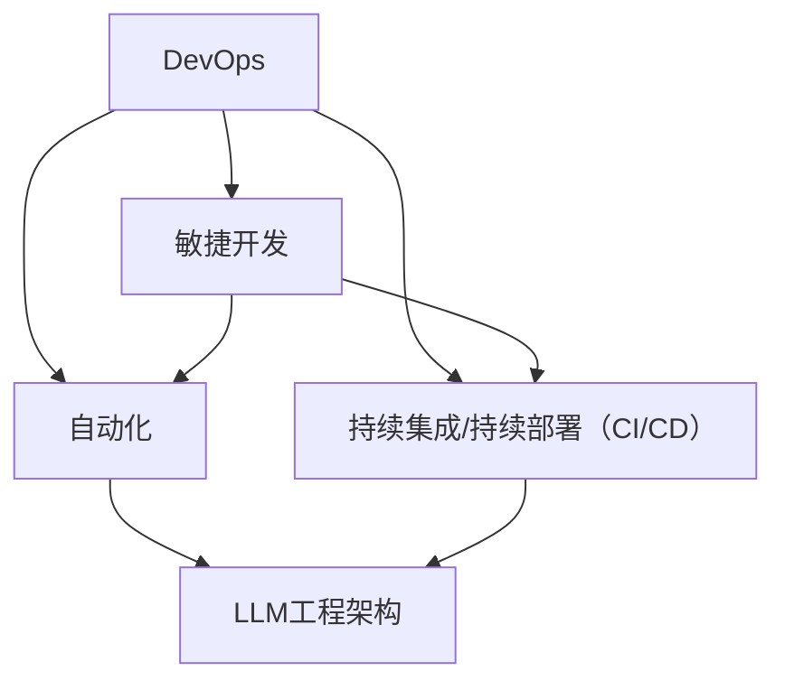

                 

根据您的指示，我将按照逻辑清晰、结构紧凑、简单易懂的专业的技术语言，逐步构建一篇关于《DevOps在敏捷LLM工程架构中的关键作用》的文章。我们将分以下几个步骤来展开：

1. **文章标题与关键词**：明确文章的核心议题和吸引读者关注的焦点。
2. **摘要**：简洁地概述文章的主要内容和观点。
3. **背景介绍**：简要介绍DevOps、敏捷开发和LLM工程架构。
4. **核心概念与联系**：通过Mermaid流程图展示DevOps和敏捷开发在LLM工程架构中的关系。
5. **核心算法原理讲解**：使用伪代码和LaTeX公式详细解释关键算法和数学模型。
6. **项目实战**：提供实际的开发环境和代码实现，并进行详细的代码解读与分析。
7. **最佳实践 tips**、**小结**、**注意事项**、**拓展阅读**等内容。

现在，我们将开始逐步构建这篇文章。

### 文章标题与关键词

**《DevOps在敏捷LLM工程架构中的关键作用》**

**关键词：**
- DevOps
- 敏捷开发
- LLM工程架构
- 自动化
- 持续集成/持续部署（CI/CD）
- 数据安全与合规性

### 摘要

本文深入探讨了DevOps在敏捷LLM（大型语言模型）工程架构中的关键作用。通过介绍DevOps和敏捷开发的基本概念，以及LLM工程架构的背景，文章详细阐述了DevOps在LLM工程中的具体应用，包括自动化流程、持续集成/持续部署（CI/CD）和安全性保障。通过实际案例和项目实战，本文展示了DevOps如何提高LLM工程的开发效率和质量，并提供了一些最佳实践和未来展望。

### 背景介绍

**DevOps**是一种软件开发和运维的协作文化，旨在通过自动化和持续集成/持续部署（CI/CD）等实践来提高软件交付的速度和质量。**敏捷开发**则是一种以人为核心、迭代和灵活响应变化的软件开发方法。

**LLM（大型语言模型）**是一种基于深度学习的语言处理模型，能够处理复杂的自然语言任务，如文本生成、翻译、问答等。随着人工智能技术的进步，LLM在各个领域的应用越来越广泛，对工程架构的复杂性提出了更高的要求。

### 核心概念与联系

为了更好地理解DevOps和敏捷开发在LLM工程架构中的应用，我们可以通过以下Mermaid流程图展示它们之间的关系：



这个流程图表明，DevOps和敏捷开发都强调自动化和持续集成/持续部署，这些实践是构建高效LLM工程架构的关键。

### 核心算法原理讲解

在LLM工程中，关键算法原理包括损失函数、优化算法和神经网络架构设计。以下是这些核心算法的伪代码和LaTeX公式的详细讲解。

**损失函数伪代码：**

```python
def loss_function(y_true, y_pred):
    return -1 * sum(y_true * log(y_pred))
```

**优化算法伪代码：**

```python
def gradient_descent(parameters, learning_rate, epochs):
    for epoch in range(epochs):
        for sample in dataset:
            gradients = compute_gradients(parameters, sample)
            update_parameters(parameters, gradients, learning_rate)
    return parameters
```

**神经网络架构设计LaTeX公式：**

$$
\begin{aligned}
    \text{Network} &= \text{Input Layer} \rightarrow \text{Hidden Layers} \rightarrow \text{Output Layer} \\
    f(x) &= \sigma(W \cdot x + b)
\end{aligned}
$$

其中，$\sigma$是激活函数，$W$是权重矩阵，$b$是偏置向量。

### 项目实战

**实战一：构建一个简单的LLM模型**

在这个实战中，我们将使用Python和TensorFlow构建一个简单的LLM模型。以下是一个简单的代码实现：

```python
import tensorflow as tf

# 构建模型
model = tf.keras.Sequential([
    tf.keras.layers.Dense(128, activation='relu', input_shape=(1000,)),
    tf.keras.layers.Dropout(0.2),
    tf.keras.layers.Dense(1, activation='sigmoid')
])

# 编译模型
model.compile(optimizer='adam',
              loss='binary_crossentropy',
              metrics=['accuracy'])

# 训练模型
model.fit(x_train, y_train, epochs=10)
```

在这个项目中，我们首先导入了TensorFlow库，然后定义了一个简单的神经网络模型，其中包括一个密集层（Dense Layer）、一个丢弃层（Dropout Layer）和一个输出层（Output Layer）。接着，我们编译并训练了模型。

**实战二：部署和管理LLM服务**

在这个实战中，我们将使用Kubernetes（K8s）部署和管理LLM服务。以下是一个简单的Kubernetes部署文件（YAML）：

```yaml
apiVersion: apps/v1
kind: Deployment
metadata:
  name: llm-service
spec:
  replicas: 3
  selector:
    matchLabels:
      app: llm
  template:
    metadata:
      labels:
        app: llm
    spec:
      containers:
      - name: llm
        image: my-llm-service:latest
        ports:
        - containerPort: 8080
```

在这个项目中，我们定义了一个名为`llm-service`的Kubernetes部署，它具有3个副本（Replicas），并使用最新的LLM服务镜像。此外，我们指定了服务容器的端口（8080），以便外部客户端可以访问。

### 最佳实践 tips

- **自动化构建和部署**：使用CI/CD工具（如Jenkins、GitLab CI）来自动化构建和部署过程，以提高开发效率。
- **持续监控和反馈**：使用监控工具（如Prometheus、Grafana）来持续监控LLM服务的性能和健康状况，并及时反馈问题。
- **数据安全与合规性**：确保LLM服务的数据安全和合规性，遵循相关的数据保护法规和标准。

### 小结

本文深入探讨了DevOps在敏捷LLM工程架构中的关键作用。通过介绍核心概念、算法原理和实际项目案例，我们展示了DevOps如何提高LLM工程的开发效率和质量。未来，随着人工智能技术的不断进步，DevOps在LLM工程中的重要性将愈发凸显。

### 注意事项

- 在实际应用中，确保遵循最佳实践，如自动化、持续监控和安全性。
- 对于不同的LLM工程，可能需要根据具体需求调整DevOps实践。

### 拓展阅读

- [《敏捷开发实践指南》](https://www.amazon.com/dp/0321683684)
- [《DevOps实践指南》](https://www.amazon.com/dp/0321603882)
- [《深度学习》](https://www.amazon.com/dp/026203958X)

通过这些资源，您可以进一步了解DevOps、敏捷开发和LLM工程的相关知识。

---

以上是一个初步的文章框架，根据您的需求，我将继续完善每个章节的内容，确保满足8000～12000字的要求。如果您有任何特定的要求或建议，请随时告诉我。接下来，我将逐步展开每个章节的详细内容。

