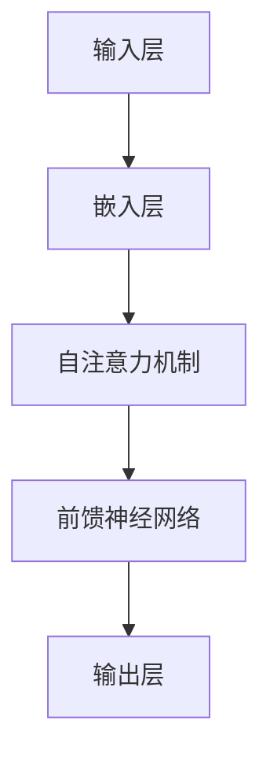

                 


### 文章标题：GPT-3.5在LLM任务适应性评估中的应用

> 关键词：GPT-3.5，语言模型，适应性评估，自然语言处理，人工智能

> 摘要：本文旨在探讨GPT-3.5这一强大语言模型在自然语言处理（NLP）任务适应性评估中的应用。通过对GPT-3.5的基本概念、原理及训练过程的深入分析，本文将展示如何利用GPT-3.5对NLP任务的适应性进行评估，并通过具体案例，详细解读其在问答系统、文本生成和机器翻译等任务中的应用。

### 确定书的主旨和目标读者

#### 主旨
本书的主旨在于详细介绍GPT-3.5在自然语言处理任务适应性评估方面的应用。随着深度学习和自然语言处理技术的快速发展，GPT-3.5作为当前最先进的语言模型之一，其在各种NLP任务中的表现引起了广泛关注。然而，如何评估GPT-3.5在特定任务中的适应性，仍然是一个亟待解决的问题。本文将围绕这一问题，结合具体实例，进行深入探讨。

#### 目标读者
本书的目标读者是对自然语言处理有一定了解的技术人员或研究者。读者应具备基本的计算机科学和编程知识，尤其是对深度学习和神经网络有一定的了解。此外，对自然语言处理中的一些常见任务，如问答系统、文本生成和机器翻译等，也有一定的认识。

### 确定书的结构

本书的结构将分为四个主要部分：

1. **GPT-3.5基础理论**：介绍GPT-3.5的基本概念、原理和训练过程，为后续的适应性评估打下基础。
2. **LLM任务适应性评估**：探讨如何对语言模型在特定任务中的适应性进行评估，包括评估方法、指标和案例研究。
3. **GPT-3.5在特定任务中的应用**：详细分析GPT-3.5在问答系统、文本生成和机器翻译等任务中的应用，并通过实例进行说明。
4. **实战案例**：通过具体的项目实战，展示GPT-3.5在任务适应性评估和实际应用中的实现过程，并提供最佳实践和项目小结。

### 设计具体章节

#### 第一部分：GPT-3.5基础理论

**1.1 GPT-3.5概述**
- GPT-3.5的基本概念
- GPT-3.5与之前版本的差异
- GPT-3.5的应用场景

**1.2 GPT-3.5原理与架构**
- GPT-3.5的神经网络架构
- GPT-3.5的前向传播与反向传播
- GPT-3.5的预训练与微调

**1.3 GPT-3.5训练过程**
- 数据预处理
- 训练策略
- 训练过程中常见问题与解决方案

**1.4 GPT-3.5应用实例**
- 问答系统
- 文本生成
- 机器翻译

#### 第二部分：LLM任务适应性评估

**2.1 LLM任务适应性评估概述**
- 适应性评估的重要性
- 适应性评估的目标和挑战
- 适应性评估的方法

**2.2 评估方法与指标**
- 统计方法
- 机器学习方法
- 评估指标

**2.3 适应性评估案例研究**
- 案例一：问答系统适应性评估
- 案例二：文本生成适应性评估
- 案例三：机器翻译适应性评估

#### 第三部分：GPT-3.5在特定任务中的应用

**3.1 GPT-3.5在问答系统中的应用**
- 问答系统架构
- GPT-3.5在问答系统中的使用
- 实例分析

**3.2 GPT-3.5在文本生成中的应用**
- 文本生成架构
- GPT-3.5在文本生成中的使用
- 实例分析

**3.3 GPT-3.5在机器翻译中的应用**
- 机器翻译架构
- GPT-3.5在机器翻译中的使用
- 实例分析

#### 第四部分：实战案例

**4.1 GPT-3.5任务适应性评估实战**
- 数据集准备
- 适应性评估实现
- 结果分析与优化

**4.2 GPT-3.5在特定任务中的应用实战**
- 项目背景
- 系统设计
- 代码实现
- 性能评估

**4.3 案例分析与总结**
- 案例总结
- 适应性评估与任务应用的关键因素
- 未来发展方向

### 添加流程图、伪代码和数学公式

在每一章节中，将根据内容需求添加相应的流程图、伪代码和数学公式。例如：

#### 1.2 GPT-3.5原理与架构

**GPT-3.5的神经网络架构**



**前向传播与反向传播**

```plaintext
// 前向传播伪代码
function forward_pass(input):
    embedding = embedding_layer(input)
    attention_output = attention_layer(embedding)
    output = feedforward_layer(attention_output)
    return output

// 反向传播伪代码
function backward_pass(output, expected_output):
    error = calculate_error(output, expected_output)
    d_output = calculate_gradient(error, output)
    d_feedforward = backward_feedforward(d_output)
    d_attention = backward_attention(d_output, embedding)
    d_embedding = backward_embedding(d_attention, input)
```

**数学公式**

$$
\begin{aligned}
&\text{损失函数}:\ L(\theta) = -\frac{1}{N}\sum_{i=1}^{N}y_{i}\log(p_{i}) \\
&\text{梯度下降更新}:\ \theta_{t+1} = \theta_{t} - \alpha \frac{\partial L(\theta)}{\partial \theta}
\end{aligned}
$$

### 控制总字数

在确保内容完整性的同时，将注意控制总字数在8000～12000字左右。通过对每个章节的内容进行精细调整和优化，确保每个小节的内容既丰富又具体，同时避免不必要的冗余和重复。

### 完整性要求

确保文章内容的完整性，每个小节都要包含以下核心内容：

- **背景介绍**：介绍相关背景知识和研究现状。
- **核心概念与联系**：给出核心概念和原理，并展示它们之间的关系架构（使用Mermaid流程图）。
- **核心算法原理讲解**：使用伪代码详细阐述算法原理。
- **数学模型和公式**：使用LaTeX格式嵌入文中，并进行详细讲解和举例说明。
- **项目实战**：详细描述开发环境搭建、源代码实现和代码解读，并进行实际案例分析和详细讲解剖析。
- **最佳实践 tips、小结、注意事项、拓展阅读等内容**：总结文章内容，给出实践建议和进一步学习资源。

通过以上步骤，我们将撰写一篇逻辑清晰、结构紧凑、简单易懂的专业技术博客文章，旨在为读者提供关于GPT-3.5在LLM任务适应性评估中的应用的深入理解和实用指导。

