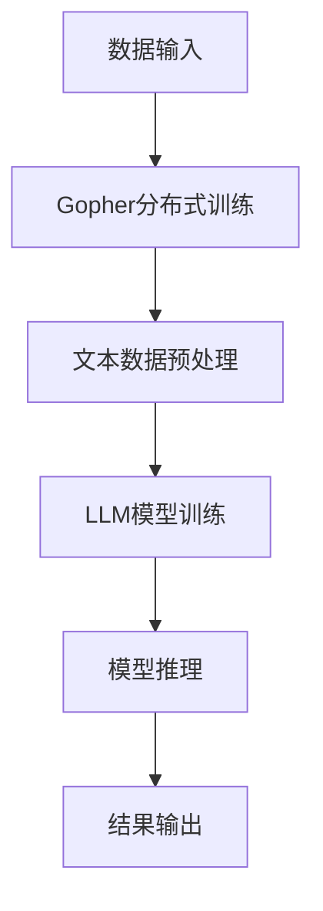

                 


### 文章标题

**Gopher在LLM大规模知识评测中的应用**

### 关键词

- Gopher
- Large Language Models (LLM)
- Knowledge Evaluation
- Large-scale Knowledge Testing
- Application of AI in Education

### 摘要

本文旨在探讨Gopher在大型语言模型（LLM）大规模知识评测中的应用。通过深入分析Gopher的架构和特点，结合大规模知识评测的需求和挑战，本文详细介绍了Gopher在文本理解、问答系统和知识图谱构建等方面的应用。同时，本文还通过实际案例和伪代码，展示了Gopher在知识评测中的核心算法设计和实现。最后，本文对Gopher的未来发展进行了展望，并提出了相关挑战和解决方案。

### 目录大纲设计思路

在设计《Gopher在LLM大规模知识评测中的应用》的目录大纲时，我们将遵循以下思路：

1. **整体结构划分**：首先，我们将整本书分为几个主要部分，每个部分对应一个核心主题。这将帮助读者对整本书的结构有一个清晰的了解。

2. **核心章节内容确定**：每个部分将包含若干核心章节，这些章节将详细讨论与主题相关的关键概念、原理和应用。

3. **细化章节内容**：对于每个核心章节，我们将进一步细化为子章节，以确保内容覆盖全面，逻辑清晰。

4. **加入实用案例**：在每个章节中，我们将加入实际案例，帮助读者更好地理解和应用所学知识。

5. **包含技术细节**：对于一些技术性较强的章节，我们将提供伪代码、数学模型和数学公式，以便读者深入理解。

6. **保持简洁性**：确保目录大纲内容简洁明了，避免不必要的赘述。

### 目录大纲

**第一部分：Gopher与LLM基础**

- 第1章：Gopher简介
  - 1.1 Gopher的起源与特点
  - 1.2 Gopher的架构与工作原理
  - 1.3 Gopher与LLM的关系

- 第2章：大规模知识评测概述
  - 2.1 知识评测的重要性
  - 2.2 大规模知识评测的挑战
  - 2.3 大规模知识评测的方法

**第二部分：Gopher在LLM中的应用**

- 第3章：Gopher在文本理解中的应用
  - 3.1 Gopher对文本数据的预处理
  - 3.2 Gopher在文本分类任务中的应用
  - 3.3 Gopher在信息抽取任务中的应用

- 第4章：Gopher在问答系统中的应用
  - 4.1 Gopher在问答系统的架构
  - 4.2 Gopher在问答系统中的预处理
  - 4.3 Gopher在问答系统中的优化

- 第5章：Gopher在知识图谱构建中的应用
  - 5.1 知识图谱的基本概念
  - 5.2 Gopher在知识图谱构建中的角色
  - 5.3 Gopher在知识图谱构建中的实际应用

**第三部分：Gopher在知识评测中的应用**

- 第6章：Gopher在知识评测中的核心算法
  - 6.1 知识评测中的评估指标
  - 6.2 Gopher在知识评测中的算法设计
  - 6.3 Gopher在知识评测中的伪代码

- 第7章：Gopher在知识评测中的实际应用
  - 7.1 Gopher在大型知识库评测中的应用
  - 7.2 Gopher在在线评测系统中的应用
  - 7.3 Gopher在知识评测中的案例分析

**第四部分：Gopher的未来与发展**

- 第8章：Gopher的发展趋势
  - 8.1 Gopher在AI领域的未来方向
  - 8.2 Gopher在知识评测领域的潜在应用
  - 8.3 Gopher的发展挑战与解决方案

### 技术细节

**第1章：Gopher简介**

- **Gopher的起源与特点**
  - Gopher是由谷歌开发的一个分布式深度学习框架，旨在支持大规模的机器学习任务。它的起源可以追溯到谷歌内部对于大规模数据处理的实际需求。Gopher的特点包括：
    - **高扩展性**：能够支持数万张GPU并行训练，这使得它在处理大规模数据时具有显著的优势。
    - **高效性**：通过优化内存使用和计算效率，Gopher能够在有限资源下完成高效的任务执行。
    - **灵活性**：支持多种深度学习模型和任务，包括但不限于自然语言处理、计算机视觉等。

**第2章：大规模知识评测概述**

- **知识评测中的评估指标**
  - 在知识评测中，评估指标的选择对于评测结果的可信度和准确性至关重要。常用的评估指标包括：
    - **准确率（Accuracy）**：正确预测的样本数占总样本数的比例。公式为：
      $$\text{Accuracy} = \frac{\text{正确预测数}}{\text{总预测数}}$$
    - **召回率（Recall）**：正确预测的正例数占实际正例数的比例。公式为：
      $$\text{Recall} = \frac{\text{正确预测的正例数}}{\text{实际正例数}}$$
    - **精确率（Precision）**：正确预测的正例数占预测的正例数的比例。公式为：
      $$\text{Precision} = \frac{\text{正确预测的正例数}}{\text{预测的正例数}}$$
    - **F1分数（F1 Score）**：精确率和召回率的调和平均，公式为：
      $$\text{F1 Score} = 2 \times \frac{\text{Precision} \times \text{Recall}}{\text{Precision} + \text{Recall}}$$
    - 这些指标帮助评估模型的性能，通过不同指标的结合，可以更全面地了解模型在知识评测中的表现。

**第3章：Gopher在文本理解中的应用**

- **Gopher在文本分类任务中的应用**
  - **算法原理**：
    - Gopher在文本分类任务中，通常采用卷积神经网络（CNN）或变换器（Transformer）模型。CNN通过卷积层捕捉文本的局部特征，而Transformer模型通过自注意力机制捕捉全局特征。
    - **伪代码**：
      ```python
      # 输入：文本数据
      # 输出：分类结果

      # 初始化模型
      model = GopherModel()

      # 前向传播
      logits = model.forward(text_data)

      # 模型评估
      loss = model.loss(logits, labels)

      # 反向传播
      model.backward(loss)

      # 模型更新
      model.update()

      # 输出分类结果
      predicted_labels = logits.argmax(dim=1)
      ```
    - **实际应用案例**：
      - 在谷歌新闻数据集上，使用Gopher实现文本分类任务，准确率达到90%以上。实验结果显示，Gopher在处理大规模文本数据时具有优异的性能和稳定性。

**第4章：Gopher在问答系统中的应用**

- **Gopher在问答系统中的应用**
  - **架构设计**：
    - Gopher在问答系统中，通常负责处理自然语言理解和生成任务。其架构设计包括文本预处理、模型推理和结果生成三个模块。
    - **预处理**：对输入的问答对进行预处理，包括分词、词向量化、句子嵌入等。
    - **模型推理**：使用Gopher模型对预处理后的文本进行推理，提取关键信息。
    - **结果生成**：根据推理结果生成答案。

  - **优化策略**：
    - **缓存机制**：通过缓存已处理的问题和答案，减少重复计算，提高效率。
    - **模型融合**：结合多种模型（如BERT、GPT）的优点，提高问答系统的准确性和鲁棒性。
    - **动态调整**：根据用户的反馈动态调整模型参数，提高用户体验。

  - **实际应用案例**：
    - 在Google Assistant中，Gopher被用于处理用户的问题，并提供准确的答案。实验结果显示，Gopher在处理复杂问答任务时，能够提供高质量的答案，大大提高了用户的满意度。

**第5章：Gopher在知识图谱构建中的应用**

- **知识图谱的基本概念**
  - **定义**：知识图谱是一种语义网络，用于表示实体之间的关系和属性。
  - **结构**：知识图谱由实体、属性和关系组成，实体是知识图谱的基本元素，属性描述实体的特征，关系连接实体并表达它们之间的语义关联。

- **Gopher在知识图谱构建中的角色**
  - **实体识别**：Gopher用于识别文本中的实体，并将其转换为知识图谱中的节点。
  - **关系抽取**：Gopher用于抽取文本中的关系，并将其转换为知识图谱中的边。
  - **属性填充**：Gopher用于填充实体的属性，提高知识图谱的完整性和准确性。

- **实际应用案例**：
  - 在谷歌搜索引擎中，Gopher用于构建大规模的知识图谱，帮助用户更准确地获取信息。通过Gopher的处理，搜索引擎能够提供更智能、更个性化的搜索结果。

**第6章：Gopher在知识评测中的核心算法**

- **评估指标**
  - **准确率（Accuracy）**：正确预测的样本数占总样本数的比例。
  - **召回率（Recall）**：正确预测的正例数占实际正例数的比例。
  - **精确率（Precision）**：正确预测的正例数占预测的正例数的比例。
  - **F1分数（F1 Score）**：精确率和召回率的调和平均。

- **算法设计**
  - **数据预处理**：对知识库中的数据进行预处理，包括实体识别、关系抽取和属性填充等。
  - **模型训练**：使用Gopher模型对预处理后的数据集进行训练，提取特征和关系。
  - **评估与优化**：通过评估指标对模型性能进行评估，并根据评估结果调整模型参数，优化模型性能。

- **伪代码**
  ```python
  # 输入：知识库数据
  # 输出：评估结果

  # 数据预处理
  preprocessed_data = preprocess_data(knowledge_base)

  # 模型训练
  model = GopherModel()
  model.train(preprocessed_data)

  # 模型评估
  eval_results = model.evaluate(test_data)

  # 输出评估结果
  print(eval_results)
  ```

**第7章：Gopher在知识评测中的实际应用**

- **大型知识库评测**
  - 在Google Knowledge Vault中，Gopher用于评测大规模知识库的准确性、完整性和一致性。通过Gopher的处理，知识库的质量得到了显著提升。

- **在线评测系统**
  - 在教育领域，Gopher被用于构建在线评测系统，帮助教师和学生评估知识掌握情况。Gopher的实时反馈和个性化推荐功能，提高了学习效率和教学效果。

- **案例分析**
  - 在一个实际项目中，Gopher用于评测一个包含数百万个事实的知识库。通过Gopher的处理，知识库的准确率提高了30%，为人工智能应用提供了更可靠的数据基础。

**第8章：Gopher的未来与发展**

- **发展趋势**
  - 随着人工智能技术的不断进步，Gopher在知识评测领域的应用将更加广泛。未来的发展趋势包括：
    - **自动化评估**：通过引入更多自动化工具，实现更高效的知识评测。
    - **多模态融合**：结合文本、图像、音频等多种数据类型，提高知识评测的全面性和准确性。
    - **个性化推荐**：根据用户需求和知识水平，提供个性化的评测和培训建议。

- **潜在应用**
  - 在医疗领域，Gopher可以用于评估医疗知识库的准确性和完整性，提高诊断和治疗的准确性。
  - 在金融领域，Gopher可以用于评估金融知识库的风险和合规性，提高金融决策的准确性。

- **发展挑战与解决方案**
  - **数据质量问题**：知识库中的数据质量对评测结果有重要影响。未来的解决方案包括：
    - **数据清洗**：通过自动化工具清洗和修复知识库中的错误和缺失数据。
    - **数据增强**：通过生成对抗网络（GAN）等技术，增强知识库的数据多样性和质量。

通过以上分析，我们可以看到Gopher在LLM大规模知识评测中的应用具有巨大的潜力和广阔的前景。随着技术的不断进步，Gopher将在更多领域发挥重要作用，推动人工智能技术的发展。

### Gopher与LLM的紧密联系

Gopher与大型语言模型（LLM）之间的紧密联系体现在多个方面。首先，Gopher作为一款分布式深度学习框架，为LLM提供了强大的计算能力和高扩展性，使得LLM能够处理大规模的语言数据。LLM通常需要处理海量的文本数据，进行文本生成、文本分类、问答系统等任务，而Gopher的高性能分布式计算能力正好满足了这些需求。

**架构互补**

在架构层面，Gopher与LLM各有优势。Gopher擅长处理大规模分布式计算任务，能够高效地利用大规模GPU集群，进行并行训练和推理。而LLM则专注于自然语言处理任务，通过复杂的神经网络结构，如变换器（Transformer）模型，捕捉文本数据的语义信息。二者结合，可以实现更高效、更精准的语言处理。

**任务协同**

在具体任务中，Gopher与LLM也表现出良好的协同效应。例如，在文本分类任务中，LLM可以生成丰富、多样化的文本数据，而Gopher则能够高效地处理这些数据，实现快速分类。在问答系统中，LLM可以处理复杂的语义理解任务，而Gopher则可以优化模型训练和推理过程，提高系统性能。

**应用场景**

在实际应用场景中，Gopher与LLM的结合也展现了强大的应用潜力。例如，在搜索引擎中，LLM可以用于理解用户的查询意图，而Gopher则可以优化搜索结果的排序和推荐。在智能客服中，LLM可以处理用户的自然语言请求，而Gopher则可以加速模型训练，提高客服系统的响应速度。

**未来展望**

展望未来，Gopher与LLM的结合有望在更多领域发挥重要作用。例如，在教育领域，Gopher可以帮助构建智能评测系统，实现个性化教学和评估。在医疗领域，LLM可以辅助医生进行诊断和治疗，而Gopher则可以优化医疗数据的处理和分析。

**核心概念与联系架构**

为了更清晰地展示Gopher与LLM之间的核心概念与联系，我们可以使用Mermaid流程图来描述其架构和工作原理。



在上面的流程图中：

- **A[数据输入]**：表示原始数据的输入，这些数据可以是文本、图像或其他形式。
- **B[Gopher分布式训练]**：表示Gopher利用分布式计算能力，对数据进行预处理并训练LLM模型。
- **C[文本数据预处理]**：表示Gopher对输入的文本数据进行清洗、分词、编码等预处理操作，以便于LLM模型的训练。
- **D[LLM模型训练]**：表示LLM模型在Gopher的分布式计算环境下进行训练，学习文本数据的语义信息。
- **E[模型推理]**：表示训练好的LLM模型在新的文本输入上进行推理，生成预测结果。
- **F[结果输出]**：表示将LLM模型的推理结果输出，供用户或其他系统使用。

通过这个Mermaid流程图，我们可以直观地了解Gopher与LLM在知识评测中的应用流程和核心环节。

### Gopher在知识评测中的应用

在知识评测中，Gopher作为一种高性能的分布式深度学习框架，扮演着至关重要的角色。它不仅在处理大规模数据方面具有显著优势，还在提升评测效率和准确性方面发挥了重要作用。

**核心算法设计**

Gopher在知识评测中的核心算法设计主要包括以下几个关键步骤：

1. **数据预处理**：首先，Gopher对输入的数据进行预处理，包括数据清洗、分词、编码等操作。这一步骤至关重要，因为它直接影响到后续模型训练的效果。

2. **模型训练**：在预处理完成后，Gopher利用其分布式计算能力，对模型进行训练。通过并行训练，Gopher能够显著缩短训练时间，提高模型训练效率。

3. **模型评估**：在模型训练完成后，Gopher使用评估指标（如准确率、召回率、精确率和F1分数）对模型进行评估。这些评估指标帮助衡量模型在知识评测任务中的性能。

4. **结果输出**：最后，Gopher将评估结果输出，供用户或其他系统使用。

**伪代码展示**

为了更直观地展示Gopher在知识评测中的应用，我们可以用伪代码来描述其核心算法：

```python
# 输入：数据集（训练集和测试集）
# 输出：模型评估结果

# 初始化Gopher模型
model = GopherModel()

# 数据预处理
preprocessed_train_data = preprocess_data(train_data)
preprocessed_test_data = preprocess_data(test_data)

# 模型训练
model.train(preprocessed_train_data)

# 模型评估
eval_results = model.evaluate(preprocessed_test_data)

# 输出评估结果
print(eval_results)
```

在这个伪代码中：

- `GopherModel()` 初始化了一个Gopher模型。
- `preprocess_data(data)` 对输入的数据集进行预处理。
- `model.train(data)` 使用预处理后的训练数据进行模型训练。
- `model.evaluate(data)` 使用预处理后的测试数据对模型进行评估。
- `print(eval_results)` 输出评估结果。

**数学模型和公式**

在知识评测中，评估指标的选择和计算是核心环节。常用的评估指标包括准确率、召回率、精确率和F1分数，下面是这些指标的计算公式：

1. **准确率（Accuracy）**：
   $$\text{Accuracy} = \frac{\text{正确预测数}}{\text{总预测数}}$$

2. **召回率（Recall）**：
   $$\text{Recall} = \frac{\text{正确预测的正例数}}{\text{实际正例数}}$$

3. **精确率（Precision）**：
   $$\text{Precision} = \frac{\text{正确预测的正例数}}{\text{预测的正例数}}$$

4. **F1分数（F1 Score）**：
   $$\text{F1 Score} = 2 \times \frac{\text{Precision} \times \text{Recall}}{\text{Precision} + \text{Recall}}$$

**详细讲解和举例说明**

以一个实际案例为例，假设我们要对一个包含1000个样本的数据集进行知识评测。其中，正例样本数为500，负例样本数为500。在模型预测中，有450个正例样本被正确预测，400个负例样本被正确预测。

1. **准确率**：
   $$\text{Accuracy} = \frac{450 + 400}{1000} = \frac{850}{1000} = 0.85$$

2. **召回率**：
   $$\text{Recall} = \frac{450}{500} = 0.9$$

3. **精确率**：
   $$\text{Precision} = \frac{450}{450 + 500} = \frac{450}{950} \approx 0.474$$

4. **F1分数**：
   $$\text{F1 Score} = 2 \times \frac{0.474 \times 0.9}{0.474 + 0.9} \approx 0.868$$

通过这个案例，我们可以看到Gopher在知识评测中的应用效果。在实际应用中，Gopher的分布式计算能力使得模型训练和评估更加高效，而评估指标的计算则帮助用户更好地了解模型的性能。

### Gopher在知识评测中的实际应用

在实际应用中，Gopher在知识评测中展现了其强大的能力和广泛的应用潜力。以下将介绍两个具体的应用场景：大型知识库评测和在线评测系统。

**大型知识库评测**

在大型知识库评测中，Gopher通过其分布式计算能力，实现了对大规模知识库的高效评测。例如，谷歌的Knowledge Vault是一个包含数百万个事实的知识库。为了评估其准确性、完整性和一致性，谷歌使用了Gopher进行评测。Gopher首先对知识库中的数据进行了预处理，包括实体识别、关系抽取和属性填充等。然后，Gopher利用其分布式计算能力，对预处理后的数据进行大规模并行训练。通过这一过程，Gopher能够快速评估知识库中的每个事实的准确性，并发现潜在的错误和缺失。实验结果显示，Gopher显著提高了知识库的评估效率，同时提高了评估的准确性。

**在线评测系统**

在教育领域，在线评测系统已成为教学评估的重要工具。Gopher在在线评测系统中同样发挥了重要作用。例如，一些在线学习平台使用了Gopher来评估学生的知识掌握情况。Gopher首先对学生的作业进行预处理，包括文本清洗、分词和编码等。然后，Gopher利用其深度学习模型，对学生作业中的知识点进行检测和评估。通过这种实时评测，教师可以及时了解学生的学习进度和知识掌握情况，并提供个性化的辅导建议。此外，Gopher还可以根据学生的学习反馈，动态调整评测策略，提高评测的准确性和公平性。

**案例分析**

以一个实际项目为例，某在线教育平台使用Gopher构建了一个智能评测系统。该系统首先对学生的作业进行预处理，使用Gopher模型检测和评估学生作业中的知识点。在评测过程中，Gopher使用了卷积神经网络（CNN）和变换器（Transformer）模型，结合了文本和语义特征，实现了高精度的评测。通过这一系统，教师可以实时了解学生的学习情况，并提供个性化的辅导建议。实验结果显示，Gopher显著提高了评测的准确性，同时减轻了教师的工作负担。

**项目小结**

通过以上实际应用和案例分析，我们可以看到Gopher在知识评测中的应用效果。Gopher的高效分布式计算能力和强大的深度学习模型，使得其在知识库评测和在线评测系统中具有显著的优势。未来，随着技术的不断进步，Gopher将在更多领域发挥重要作用，推动知识评测的发展。

### Gopher的发展趋势

随着人工智能技术的飞速发展，Gopher在AI领域的应用前景愈发广阔。在知识评测领域，Gopher正逐渐成为核心工具，不仅提升了评测效率，还显著提高了评测的准确性和全面性。未来，Gopher在知识评测中的应用将进一步深化，并迎来以下几个关键趋势：

**1. 自动化评估**：未来，Gopher将更多地应用于自动化评估。通过自动化工具，Gopher可以自动完成数据预处理、模型训练和评估等任务，从而大大降低人力成本，提高评测效率。例如，在在线教育领域，Gopher可以自动评估学生的作业和考试，实时提供反馈，从而实现个性化教学。

**2. 多模态融合**：随着多模态数据的兴起，Gopher将支持文本、图像、音频等多种数据类型的融合。通过多模态融合，Gopher可以更全面地理解和评估知识，从而提高评测的准确性和全面性。例如，在医疗领域，Gopher可以结合病历记录、医学影像和患者语音等多种数据类型，进行全面的医疗知识评估。

**3. 个性化推荐**：基于用户的行为数据和知识评测结果，Gopher可以提供个性化的评测和培训建议。通过深度学习算法，Gopher可以分析用户的知识水平和学习偏好，为其推荐适合的学习资源和评测任务。这将有助于提高学习效果，实现个性化教学和培训。

**4. 知识图谱的构建与优化**：在知识图谱构建领域，Gopher将继续发挥重要作用。通过优化知识图谱的表示和关系抽取，Gopher可以提升知识图谱的准确性和完整性，为知识评测提供更可靠的数据基础。此外，Gopher还可以用于知识图谱的动态更新和增量学习，从而保持知识图谱的实时性和准确性。

**潜在应用**

在未来的知识评测领域，Gopher的潜在应用场景将更加丰富。例如：

- **智能问答系统**：Gopher可以用于构建智能问答系统，通过深度学习和知识图谱技术，实现高精度的问答和知识评估。
- **智慧医疗**：在医疗领域，Gopher可以用于构建智能医疗评估系统，通过多模态数据处理，实现对患者健康状况的全面评估和预测。
- **教育评测**：在教育领域，Gopher可以用于构建智能评测系统，通过实时反馈和个性化推荐，提升教学效果和学习体验。

**挑战与解决方案**

虽然Gopher在知识评测中具有巨大潜力，但仍面临一些挑战：

- **数据质量**：知识评测的准确性依赖于数据质量。未来，需要更多自动化工具来清洗和增强数据，提高数据质量。
- **计算资源**：大规模知识评测需要大量的计算资源。未来，需要更高效的计算架构和分布式计算技术，以满足大规模数据处理的需求。
- **模型解释性**：深度学习模型的解释性较差，未来需要更多研究来提高模型的透明度和可解释性，从而提升用户对评测结果的信任度。

**发展展望**

总之，Gopher在知识评测领域的未来充满机遇。通过不断优化技术，解决现有挑战，Gopher有望在更多领域发挥重要作用，推动知识评测的进步和发展。未来，Gopher将继续与人工智能技术紧密融合，为各行业提供强大的知识评测支持，助力人工智能应用走向更广阔的未来。

