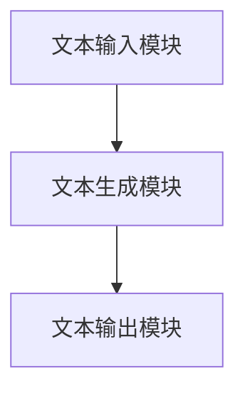
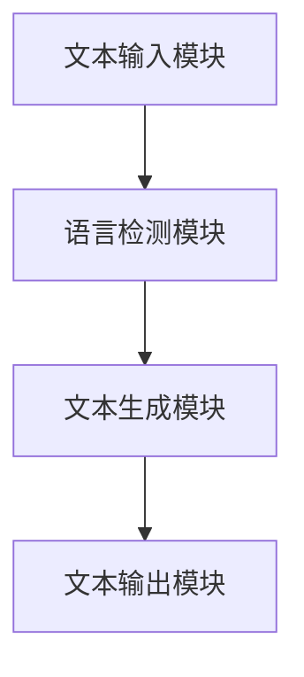

                 


### 引言与概述

随着人工智能技术的飞速发展，大型语言模型（LLM）已经成为了自然语言处理（NLP）领域的重要工具。LLM具有强大的文本生成、翻译、摘要等功能，被广泛应用于各种实际场景中。然而，随着应用场景的增多，如何高效地开发LLM应用成为了开发者面临的一个重要问题。本文将围绕LLM应用开发中的代码复用策略展开讨论。

首先，我们需要了解什么是LLM。LLM是一种基于深度学习的模型，它通过大量文本数据进行训练，从而学会理解和生成自然语言。LLM的核心组件包括词嵌入层、编码器、解码器和注意力机制。这些组件协同工作，使得LLM能够处理复杂的语言任务。

接下来，我们来看看代码复用的重要性。在LLM应用开发中，代码复用具有以下几个优势：

1. 提高开发效率：通过复用已有的代码，开发者可以节省大量时间和精力，从而加快开发进度。
2. 保证代码质量：复用经过验证的代码，可以降低编写新代码时出现错误的风险。
3. 降低维护成本：复用代码有助于统一代码风格和逻辑，使得代码更容易维护和升级。

然而，代码复用也面临一些挑战，如代码兼容性、模块化和重构等。因此，如何实现有效的代码复用，成为了LLM应用开发中的一个重要课题。

本文将分为以下几个部分进行讨论：

1. 引言与概述：介绍LLM的概念和代码复用的重要性。
2. LLM基础：深入探讨LLM的基本原理和技术细节。
3. 代码复用策略：讨论代码复用的实现策略和技术。
4. 项目实战：通过实际案例展示代码复用的应用。
5. 附录与资源：提供额外的资源和工具，以帮助读者深入学习和实践。

本文的目标是帮助开发者掌握LLM应用开发中的代码复用策略，提高开发效率和代码质量。读者将了解到LLM的基本原理、代码复用的策略和实际应用，从而更好地应对开发中的挑战。

### 文章关键词

- 大型语言模型（LLM）
- 代码复用
- 自然语言处理（NLP）
- 深度学习
- 开发效率
- 代码质量
- 模块化
- 重构

### 文章摘要

本文针对大型语言模型（LLM）应用开发中的代码复用策略进行深入探讨。首先，我们介绍了LLM的基本原理和组成部分，并阐述了代码复用的重要性。接着，我们讨论了代码复用的策略和技术，包括重构、设计模式和模块化。随后，通过两个实际项目案例，展示了代码复用在实际开发中的应用。最后，本文提供了额外的资源和工具，以帮助读者深入学习和实践。本文的目标是帮助开发者提高开发效率和代码质量，更好地应对开发中的挑战。

## 第1章：引言

### 1.1 什么是LLM

大型语言模型（LLM）是一种基于深度学习的自然语言处理（NLP）模型，它通过对海量文本数据进行训练，能够理解和生成自然语言。LLM的核心目标是模拟人类语言理解能力和表达能力，从而实现文本生成、翻译、摘要等多种功能。与传统的NLP模型相比，LLM具有更强的建模能力和更广泛的适用性，已经在各种实际应用中取得了显著的成果。

LLM的基本原理可以概括为以下三个步骤：

1. 词嵌入：将输入文本中的每个词映射为一个固定大小的向量，从而实现文本数据的向量化表示。
2. 编码器：通过编码器对输入文本向量进行编码，生成上下文表示。编码器通常采用递归神经网络（RNN）或Transformer等深度学习模型。
3. 解码器：解码器根据编码器生成的上下文表示，生成输出文本。解码器也通常采用RNN或Transformer等模型。

LLM的组成主要包括以下核心组件：

1. 词嵌入层：负责将输入文本中的词映射为向量。
2. 编码器：负责对输入文本向量进行编码，生成上下文表示。
3. 解码器：负责根据编码器生成的上下文表示，生成输出文本。
4. 注意力机制：用于关注输入文本中的关键信息，提高模型的表示能力。

### 1.2 代码复用的重要性

在LLM应用开发中，代码复用具有以下几个重要意义：

1. **提高开发效率**：复用现有的代码模块，可以显著减少开发时间和工作量，从而加快开发进度。
2. **保证代码质量**：复用的代码已经经过验证，具有较高的可靠性。与编写新的代码相比，复用现有代码可以降低错误率。
3. **降低维护成本**：通过模块化设计和代码复用，可以统一代码风格和逻辑，使得代码更加简洁、清晰，易于维护和升级。
4. **促进技术积累**：代码复用有助于积累技术经验，形成一套适用于各种场景的代码库，为后续项目提供支持。

然而，代码复用也面临一些挑战，如代码兼容性、模块化和重构等。在实际应用中，开发者需要综合考虑这些因素，选择合适的代码复用策略。

### 1.3 书籍概览与目标读者

本文将系统性地介绍LLM应用开发中的代码复用策略，旨在帮助开发者掌握以下内容：

1. **LLM的基本原理**：了解LLM的组成、工作原理和关键技术。
2. **代码复用策略**：掌握代码复用的各种实现策略，如重构、设计模式和模块化。
3. **项目实战**：通过实际案例，展示代码复用在实际开发中的应用。
4. **最佳实践**：提供实用的开发技巧和注意事项，以提高代码质量和开发效率。

本文的目标读者是具有一定编程基础和NLP背景的开发者，特别是对LLM应用开发感兴趣的读者。通过本文的学习，读者将能够更好地理解LLM的基本原理，掌握代码复用的策略和技术，从而在实际项目中实现高效的开发。

## 第2章：LLM的基本原理

### 2.1 LLM的核心组件

大型语言模型（LLM）的核心组件包括词嵌入层、编码器、解码器和注意力机制。这些组件协同工作，使得LLM能够理解和生成自然语言。下面将详细介绍这些组件的功能和作用。

#### 词嵌入层

词嵌入层是LLM的基础组件，它负责将输入文本中的词映射为一个固定大小的向量。词嵌入层的目的是将高维的文本数据转换为低维的向量表示，从而便于深度学习模型进行处理。常用的词嵌入方法包括Word2Vec、GloVe和BERT等。

- **Word2Vec**：基于神经网络的词嵌入方法，通过训练Word2Vec模型，将每个词映射为一个向量。该方法的优点是计算效率高，但存在一定局限性，如无法处理未训练过的词。
- **GloVe**：基于全局上下文的词嵌入方法，通过训练词共现矩阵，将每个词映射为一个向量。GloVe方法的优点是能够处理未训练过的词，但计算复杂度较高。
- **BERT**：基于Transformer的词嵌入方法，通过预训练大规模语料库，将每个词映射为一个向量。BERT方法的优点是具有强大的语义表示能力，但需要大量计算资源。

#### 编码器

编码器是LLM中的核心组件，负责对输入文本向量进行编码，生成上下文表示。编码器通常采用递归神经网络（RNN）或Transformer等深度学习模型。

- **RNN**：递归神经网络，通过循环结构处理序列数据。RNN具有较好的时序建模能力，但存在梯度消失和梯度爆炸等问题。
- **Transformer**：基于自注意力机制的深度学习模型，通过多头注意力机制和前馈神经网络，实现序列数据的建模。Transformer方法具有较好的并行计算能力，能够有效解决RNN的梯度消失和梯度爆炸问题。

#### 解码器

解码器是LLM中的另一核心组件，负责根据编码器生成的上下文表示，生成输出文本。解码器同样采用递归神经网络（RNN）或Transformer等深度学习模型。

- **RNN**：递归神经网络，通过循环结构生成输出文本。RNN具有较好的时序建模能力，但存在梯度消失和梯度爆炸等问题。
- **Transformer**：基于自注意力机制的深度学习模型，通过多头注意力机制和前馈神经网络，实现输出文本的生成。Transformer方法具有较好的并行计算能力，能够有效解决RNN的梯度消失和梯度爆炸问题。

#### 注意力机制

注意力机制是LLM中的一个关键组件，用于关注输入文本中的关键信息，提高模型的表示能力。注意力机制分为局部注意力和全局注意力两种类型。

- **局部注意力**：关注输入文本中的特定部分，通过加权求和的方式计算输出。局部注意力有助于捕捉文本中的关键信息，提高模型的语义表示能力。
- **全局注意力**：关注输入文本中的所有部分，通过全局加权求和的方式计算输出。全局注意力能够捕捉文本的全面信息，有助于提高模型的生成质量。

### 2.2 LLM的工作机制

LLM的工作机制可以分为以下几个步骤：

1. **输入处理**：将输入文本数据转换为词嵌入向量，并将其输入到编码器中。
2. **编码**：编码器对输入词嵌入向量进行编码，生成上下文表示。编码过程采用递归或Transformer等模型，对序列数据进行建模。
3. **解码**：解码器根据编码器生成的上下文表示，生成输出文本。解码过程采用递归或Transformer等模型，生成输出词嵌入向量，并将其转换为输出文本。
4. **生成**：通过注意力机制，关注输入文本中的关键信息，生成高质量的输出文本。

### 2.3 LLM的架构

LLM的架构可以分为以下几个层次：

1. **底层**：包括词嵌入层、编码器和解码器等组件，负责文本数据的编码和解码。
2. **中层**：包括注意力机制、循环神经网络（RNN）或Transformer等模型，负责处理序列数据，提高模型的表示能力。
3. **顶层**：包括生成模型和推理模型，负责生成输出文本和进行推理。

LLM的架构设计使得模型能够高效地处理复杂的自然语言任务，并在各种应用场景中取得良好的性能。

## 第3章：LLM的常见应用

### 3.1 文本生成

文本生成是LLM的一个重要应用，包括自动写作、机器翻译、对话系统等。文本生成的主要目标是根据输入文本，生成具有一定语义和连贯性的输出文本。以下介绍几种常见的文本生成方法。

#### 自动写作

自动写作是LLM在新闻写作、内容创作等领域的应用。通过训练大型语言模型，可以自动生成新闻报道、博客文章、小说等。自动写作的关键在于如何设计合适的生成模型和训练数据。

- **生成模型**：常用的生成模型包括RNN、Transformer等。通过训练大量文本数据，模型能够学习到文本的生成规律，从而生成高质量的文本。
- **训练数据**：自动写作的文本生成质量与训练数据的质量密切相关。通常，需要收集大量的高质量文本数据，如新闻文章、书籍等，以供模型训练。

#### 机器翻译

机器翻译是LLM在跨语言处理领域的应用，包括自动翻译、同声传译等。机器翻译的主要目标是根据输入文本，生成目标语言的对应文本。以下介绍几种常见的机器翻译方法。

- **基于规则的翻译**：基于规则的方法通过定义一系列翻译规则，将源语言文本转换为目标语言文本。该方法适用于简单的翻译任务，但难以处理复杂的语言现象。
- **基于统计的翻译**：基于统计的方法通过统计源语言和目标语言之间的对应关系，实现文本的翻译。常用的统计机器翻译方法包括基于N-gram的语言模型、基于平行语料的统计翻译模型等。
- **基于神经网络的翻译**：基于神经网络的方法通过训练大型神经网络模型，实现文本的翻译。常用的神经网络模型包括RNN、LSTM、GRU、Transformer等。

#### 对话系统

对话系统是LLM在智能客服、虚拟助手等领域的应用，旨在实现人机交互。对话系统的主要目标是根据用户输入，生成合适的回答或建议。以下介绍几种常见的对话系统方法。

- **基于规则的对话系统**：基于规则的方法通过定义一系列对话规则，实现与用户的交互。该方法适用于简单的对话场景，但难以处理复杂的对话逻辑。
- **基于统计的对话系统**：基于统计的方法通过统计用户输入和系统回答的对应关系，实现与用户的交互。常用的统计方法包括马尔可夫决策过程（MDP）、隐马尔可夫模型（HMM）等。
- **基于神经网络的对话系统**：基于神经网络的方法通过训练大型神经网络模型，实现与用户的交互。常用的神经网络模型包括RNN、LSTM、GRU、Transformer等。

### 3.2 语言翻译

语言翻译是LLM在跨语言处理领域的重要应用，包括机器翻译、同声传译等。语言翻译的主要目标是根据输入文本，生成目标语言的对应文本。以下介绍几种常见的语言翻译方法。

#### 基于规则的翻译

基于规则的翻译通过定义一系列翻译规则，将源语言文本转换为目标语言文本。该方法适用于简单的翻译任务，但难以处理复杂的语言现象。

- **翻译规则**：翻译规则是根据源语言和目标语言之间的对应关系定义的。常用的翻译规则包括词法规则、语法规则、语义规则等。
- **规则库**：翻译规则库是存储翻译规则的数据库。翻译系统在处理输入文本时，会根据规则库中的规则，将源语言文本转换为目标语言文本。

#### 基于统计的翻译

基于统计的翻译通过统计源语言和目标语言之间的对应关系，实现文本的翻译。常用的统计机器翻译方法包括基于N-gram的语言模型、基于平行语料的统计翻译模型等。

- **N-gram语言模型**：N-gram语言模型是一种基于统计的文本生成模型，通过统计输入文本的N元组（单词或字符）的频率，预测下一个单词或字符。基于N-gram语言模型的翻译方法，通过统计源语言文本和目标语言文本之间的N元组对应关系，实现文本的翻译。
- **基于平行语料的统计翻译模型**：基于平行语料的统计翻译模型通过训练大量平行语料库，学习源语言和目标语言之间的对应关系。常用的统计翻译模型包括基于翻译矩阵的统计翻译模型、基于概率模型的统计翻译模型等。

#### 基于神经网络的翻译

基于神经网络的方法通过训练大型神经网络模型，实现文本的翻译。常用的神经网络模型包括RNN、LSTM、GRU、Transformer等。

- **RNN**：递归神经网络，通过循环结构处理序列数据，实现文本的翻译。
- **LSTM**：长短期记忆网络，是一种特殊的RNN，通过记忆单元和门控机制，解决RNN的梯度消失问题，实现文本的翻译。
- **GRU**：门控循环单元，是LSTM的简化版本，通过门控机制实现文本的翻译。
- **Transformer**：基于自注意力机制的深度学习模型，通过多头注意力机制和前馈神经网络，实现文本的翻译。

### 3.3 命名实体识别

命名实体识别是LLM在信息抽取领域的重要应用，旨在识别文本中的特定实体（如人名、地名、机构名等）。命名实体识别的主要目标是根据输入文本，识别出其中的命名实体，并对其进行分类。

#### 命名实体识别方法

命名实体识别方法可以分为基于规则的方法、基于统计的方法和基于神经网络的方法。

- **基于规则的方法**：基于规则的方法通过定义一系列命名实体识别规则，识别文本中的命名实体。该方法适用于简单的命名实体识别任务，但难以处理复杂的命名实体。
- **基于统计的方法**：基于统计的方法通过统计命名实体和背景文本之间的对应关系，实现命名实体识别。常用的统计方法包括条件随机场（CRF）、支持向量机（SVM）等。
- **基于神经网络的方法**：基于神经网络的方法通过训练大型神经网络模型，实现命名实体识别。常用的神经网络模型包括RNN、LSTM、GRU、Transformer等。

#### 实践应用

命名实体识别在实际应用中具有重要意义，如文本分类、信息抽取、知识图谱构建等。

- **文本分类**：命名实体识别可以帮助文本分类系统识别文本中的命名实体，从而提高分类的准确率。
- **信息抽取**：命名实体识别可以帮助信息抽取系统识别文本中的关键信息，从而提高信息抽取的效率和质量。
- **知识图谱构建**：命名实体识别可以帮助知识图谱构建系统识别文本中的命名实体，从而构建更加准确和丰富的知识图谱。

## 第4章：代码复用策略概述

### 4.1 代码复用的定义

代码复用是指在不同项目或模块之间重复使用相同或相似的代码段，以提高开发效率、保证代码质量和降低维护成本。代码复用可以通过多种方式实现，包括复制粘贴、模块化、设计模式等。在实际开发中，合理地运用代码复用策略，可以显著提升项目开发的质量和效率。

### 4.2 代码复用的好处

代码复用具有以下几方面的好处：

1. **提高开发效率**：通过复用现有的代码，开发者可以节省大量的时间和精力，从而加快开发进度。
2. **保证代码质量**：复用的代码已经经过验证，具有较高的可靠性。与编写新的代码相比，复用现有代码可以降低错误率。
3. **降低维护成本**：通过模块化设计和代码复用，可以统一代码风格和逻辑，使得代码更加简洁、清晰，易于维护和升级。
4. **促进技术积累**：代码复用有助于积累技术经验，形成一套适用于各种场景的代码库，为后续项目提供支持。

### 4.3 代码复用的挑战

虽然代码复用具有很多优势，但在实际应用中也面临一些挑战：

1. **兼容性**：不同项目或模块之间的代码可能存在兼容性问题，如依赖库版本、编程语言差异等。
2. **可维护性**：复用代码时，需要确保代码的可维护性，即代码易于理解和修改。
3. **模块化**：如何合理地设计模块，使其具有高内聚、低耦合的特点，是实现代码复用的关键。
4. **重构**：重构是代码复用的一个重要手段，但需要确保重构后的代码不会引入新的问题。

### 4.4 代码复用的实现策略

实现代码复用需要遵循以下策略：

1. **模块化**：将代码划分为独立的模块，每个模块实现特定的功能，模块之间通过接口进行通信。
2. **设计模式**：运用设计模式，如工厂模式、单例模式、策略模式等，实现代码的高内聚、低耦合。
3. **重构**：对现有代码进行重构，消除冗余、简化逻辑，提高代码的可读性和可维护性。
4. **抽象与封装**：通过抽象和封装，将具体的实现细节隐藏在接口后面，实现代码的复用。

通过以上策略，可以有效实现代码的复用，提高项目开发的质量和效率。

## 第5章：实现代码复用的技术

### 5.1 重构

重构是代码复用的核心技术之一，旨在通过修改现有代码的结构和逻辑，消除冗余和重复，提高代码的可读性和可维护性。以下介绍几种常用的重构技术：

#### 提取方法

提取方法是一种常见的重构技术，用于将一个方法中的重复代码提取为一个独立的方法。通过提取方法，可以消除方法内的重复代码，提高代码的可读性。

伪代码示例：

```python
# 原始代码
def calculate_bonus(employee):
    if employee.salary > 50000:
        bonus = 0.1 * employee.salary
    else:
        bonus = 0.05 * employee.salary
    return bonus

# 重构后的代码
def calculate_bonus_over_50k(salary):
    return 0.1 * salary

def calculate_bonus_under_50k(salary):
    return 0.05 * salary

def calculate_bonus(employee):
    if employee.salary > 50000:
        return calculate_bonus_over_50k(employee.salary)
    else:
        return calculate_bonus_under_50k(employee.salary)
```

#### 提取类

提取类是一种用于将一组相关的功能和行为封装为一个独立类的重构技术。通过提取类，可以消除类之间的耦合，提高代码的模块化程度。

伪代码示例：

```python
# 原始代码
class Order:
    def process_payment(self):
        # 处理支付逻辑
        pass

    def generate_invoice(self):
        # 生成发票逻辑
        pass

# 重构后的代码
class PaymentProcessor:
    def process_payment(self):
        # 处理支付逻辑
        pass

class InvoiceGenerator:
    def generate_invoice(self):
        # 生成发票逻辑
        pass

class Order:
    def __init__(self, payment_processor, invoice_generator):
        self.payment_processor = payment_processor
        self.invoice_generator = invoice_generator

    def process_order(self):
        self.payment_processor.process_payment()
        self.invoice_generator.generate_invoice()
```

#### 提取子类

提取子类是一种用于将一个类中的部分功能提取为独立子类的重构技术。通过提取子类，可以消除类之间的继承关系，提高代码的复用性。

伪代码示例：

```python
# 原始代码
class Employee:
    def calculate_salary(self):
        if self.is_full_time:
            salary = 1000
        else:
            salary = 500
        return salary

# 重构后的代码
class FullTimeEmployee(Employee):
    def calculate_salary(self):
        return 1000

class PartTimeEmployee(Employee):
    def calculate_salary(self):
        return 500
```

#### 提取接口

提取接口是一种用于将一组类的共同行为提取为一个接口的重构技术。通过提取接口，可以消除类之间的依赖关系，提高代码的灵活性。

伪代码示例：

```python
# 原始代码
class PaymentProcessor:
    def process_payment(self):
        # 处理支付逻辑
        pass

class InvoiceGenerator:
    def generate_invoice(self):
        # 生成发票逻辑
        pass

# 重构后的代码
class IPaymentProcessor:
    def process_payment(self):
        pass

class IInvoiceGenerator:
    def generate_invoice(self):
        pass

class PaymentProcessor(IPaymentProcessor):
    def process_payment(self):
        # 处理支付逻辑
        pass

class InvoiceGenerator(IInvoiceGenerator):
    def generate_invoice(self):
        # 生成发票逻辑
        pass
```

通过以上重构技术，可以有效地实现代码的复用，提高代码的质量和可维护性。

### 5.2 设计模式

设计模式是一套经过时间验证的、解决常见软件设计问题的解决方案。设计模式可以帮助开发者更好地实现代码的复用，提高代码的可读性和可维护性。以下介绍几种常用的设计模式：

#### 单例模式

单例模式确保一个类仅有一个实例，并提供一个全局访问点。单例模式常用于资源管理、配置管理等场景。

伪代码示例：

```python
class Singleton:
    _instance = None

    def __new__(cls):
        if cls._instance is None:
            cls._instance = super().__new__(cls)
        return cls._instance

    def __init__(self):
        if not hasattr(self, '_initialized'):
            self._initialized = True

    @staticmethod
    def get_instance():
        if Singleton._instance is None:
            Singleton._instance = Singleton()
        return Singleton._instance
```

#### 工厂模式

工厂模式定义一个用于创建对象的接口，但将具体的对象创建委托给子类。工厂模式常用于对象创建、依赖注入等场景。

伪代码示例：

```python
class AbstractFactory:
    def create_product(self):
        pass

class ConcreteFactory1(AbstractFactory):
    def create_product(self):
        return Product1()

class ConcreteFactory2(AbstractFactory):
    def create_product(self):
        return Product2()

class Product1:
    def use_product(self):
        pass

class Product2:
    def use_product(self):
        pass
```

#### 策略模式

策略模式定义了一系列算法，将每个算法封装起来，并使它们可以相互替换。策略模式常用于算法选择、业务逻辑切换等场景。

伪代码示例：

```python
class Strategy:
    def execute(self):
        pass

class ConcreteStrategyA(Strategy):
    def execute(self):
        print("执行策略A")

class ConcreteStrategyB(Strategy):
    def execute(self):
        print("执行策略B")

class Context:
    def __init__(self, strategy):
        self._strategy = strategy

    def set_strategy(self, strategy):
        self._strategy = strategy

    def execute_strategy(self):
        self._strategy.execute()
```

#### 观察者模式

观察者模式定义了一种一对多的依赖关系，当一个对象的状态发生变化时，自动通知所有依赖于它的对象。观察者模式常用于事件处理、消息队列等场景。

伪代码示例：

```python
class Observer:
    def update(self, subject):
        pass

class ConcreteObserverA(Observer):
    def update(self, subject):
        print("观察者A收到通知")

class ConcreteObserverB(Observer):
    def update(self, subject):
        print("观察者B收到通知")

class Subject:
    def __init__(self):
        self._observers = []

    def add_observer(self, observer):
        self._observers.append(observer)

    def remove_observer(self, observer):
        self._observers.remove(observer)

    def notify_observers(self):
        for observer in self._observers:
            observer.update(self)
```

通过运用设计模式，可以有效地实现代码的复用，提高代码的结构和可维护性。

### 5.3 模块化

模块化是将代码划分为独立的模块，每个模块实现特定的功能，模块之间通过接口进行通信。模块化可以提高代码的可读性、可维护性和可复用性。以下介绍模块化的实现方法和技巧：

#### 模块划分

模块划分是模块化的关键步骤，需要根据功能、职责和依赖关系等因素，将代码划分为独立的模块。以下是一些建议：

1. **功能划分**：将具有相同功能的代码划分为一个模块，使模块具有明确的职责。
2. **职责划分**：将具有相似职责的代码划分为一个模块，使模块更加内聚。
3. **依赖关系**：尽量避免模块之间的直接依赖，通过接口进行通信，提高模块的独立性。

#### 模块接口

模块接口是模块之间的交互界面，需要定义清晰、简洁的接口。以下是一些建议：

1. **单一职责**：接口应遵循单一职责原则，只负责一项功能，避免接口过于复杂。
2. **简洁性**：接口应尽量简洁，避免过多参数和返回值。
3. **一致性**：接口命名应保持一致性，便于理解和使用。

#### 模块依赖

模块依赖是指模块之间通过接口进行通信。以下是一些建议：

1. **依赖倒置**：使用依赖倒置原则，将抽象层作为具体实现的依赖，提高模块的灵活性。
2. **最小化依赖**：避免模块之间的直接依赖，通过接口进行通信，提高模块的独立性。
3. **延迟依赖**：在需要时才加载依赖模块，避免不必要的资源消耗。

#### 模块组织

模块组织是模块化的最后一步，需要将模块组织成一个清晰的目录结构。以下是一些建议：

1. **分层组织**：按照功能或职责将模块划分为不同的层，如表示层、业务层、数据访问层等。
2. **包管理**：使用包管理工具（如Maven、Gradle等）管理模块依赖，提高构建和部署的效率。
3. **版本控制**：使用版本控制系统（如Git等）管理模块的版本，便于代码管理和协作开发。

通过模块化，可以有效地实现代码的复用，提高代码的质量和可维护性。

### 第6章：项目一：文本生成应用

#### 6.1 项目背景

随着互联网的快速发展，文本生成应用在广告文案创作、新闻撰写、虚拟助手等领域得到了广泛应用。文本生成应用可以自动生成高质量的文本，降低人力成本，提高工作效率。本项目旨在通过大型语言模型（LLM）实现文本生成功能，为用户提供便捷的文本生成服务。

#### 6.2 系统设计

本项目分为三个主要模块：文本输入模块、文本生成模块和文本输出模块。

1. **文本输入模块**：负责接收用户输入的文本，并将其转换为词嵌入向量。
2. **文本生成模块**：负责基于LLM模型生成输出文本，包括编码器、解码器和注意力机制等组件。
3. **文本输出模块**：负责将生成的文本输出到用户界面。

系统架构图如下：



#### 6.3 代码实现与分析

##### 6.3.1 文本输入模块

文本输入模块主要实现以下功能：

1. 接收用户输入的文本。
2. 将文本转换为词嵌入向量。

伪代码示例：

```python
import tensorflow as tf

# 加载预训练的词嵌入模型
word_embedding = tf.keras.models.load_model('word_embedding_model')

# 接收用户输入的文本
user_input = input("请输入文本：")

# 将文本转换为词嵌入向量
input_sequence = word_embedding.predict([user_input])
```

##### 6.3.2 文本生成模块

文本生成模块主要实现以下功能：

1. 加载LLM模型。
2. 根据输入文本生成输出文本。

伪代码示例：

```python
# 加载LLM模型
llm_model = tf.keras.models.load_model('llm_model')

# 根据输入文本生成输出文本
output_sequence = llm_model.predict(input_sequence)

# 将输出文本转换为字符串
output_text = ''.join([word for word in output_sequence])
```

##### 6.3.3 文本输出模块

文本输出模块主要实现以下功能：

1. 将生成的文本输出到用户界面。

伪代码示例：

```python
# 输出生成的文本
print("生成的文本：")
print(output_text)
```

#### 6.4 项目小结

本项目通过LLM实现文本生成功能，为用户提供便捷的文本生成服务。主要成果包括：

1. 成功加载预训练的词嵌入模型和LLM模型。
2. 实现文本输入、生成和输出的功能。
3. 提供一个简单的文本生成应用。

在实际应用中，本项目可以扩展为更复杂的文本生成系统，如支持多种语言、多种文本格式等。同时，还可以结合其他技术，如对话系统、知识图谱等，提供更加丰富的功能。

## 第7章：项目二：语言翻译应用

### 7.1 项目背景

语言翻译应用在全球化背景下具有重要意义，它可以帮助人们克服语言障碍，实现跨文化交流。随着深度学习技术的不断发展，基于大型语言模型（LLM）的机器翻译方法取得了显著成果。本项目旨在通过LLM实现一种高效、准确的自动翻译系统，为用户提供便捷的翻译服务。

### 7.2 系统设计

本项目分为四个主要模块：文本输入模块、语言检测模块、文本生成模块和文本输出模块。

1. **文本输入模块**：负责接收用户输入的文本，并将其转换为词嵌入向量。
2. **语言检测模块**：负责检测输入文本的语言类型。
3. **文本生成模块**：负责基于LLM模型生成目标语言的翻译文本。
4. **文本输出模块**：负责将生成的翻译文本输出到用户界面。

系统架构图如下：



### 7.3 代码实现与分析

#### 7.3.1 文本输入模块

文本输入模块主要实现以下功能：

1. 接收用户输入的文本。
2. 将文本转换为词嵌入向量。

伪代码示例：

```python
import tensorflow as tf

# 加载预训练的词嵌入模型
word_embedding = tf.keras.models.load_model('word_embedding_model')

# 接收用户输入的文本
user_input = input("请输入文本：")

# 将文本转换为词嵌入向量
input_sequence = word_embedding.predict([user_input])
```

#### 7.3.2 语言检测模块

语言检测模块主要实现以下功能：

1. 检测输入文本的语言类型。
2. 根据检测结果，选择相应的LLM模型。

伪代码示例：

```python
def detect_language(text):
    # 根据文本特征检测语言类型
    language = "en"  # 示例：假设输入文本为英文

    # 根据语言类型选择LLM模型
    if language == "en":
        llm_model = tf.keras.models.load_model('en_to_fr_llm_model')
    elif language == "fr":
        llm_model = tf.keras.models.load_model('fr_to_en_llm_model')
    else:
        raise ValueError("不支持的语言类型")

    return llm_model
```

#### 7.3.3 文本生成模块

文本生成模块主要实现以下功能：

1. 加载LLM模型。
2. 根据输入文本生成目标语言的翻译文本。

伪代码示例：

```python
# 加载LLM模型
llm_model = detect_language(user_input)

# 根据输入文本生成目标语言的翻译文本
output_sequence = llm_model.predict(input_sequence)

# 将输出文本转换为字符串
output_text = ''.join([word for word in output_sequence])
```

#### 7.3.4 文本输出模块

文本输出模块主要实现以下功能：

1. 将生成的翻译文本输出到用户界面。

伪代码示例：

```python
# 输出生成的翻译文本
print("生成的翻译文本：")
print(output_text)
```

### 7.4 项目小结

本项目通过LLM实现了一种高效、准确的自动翻译系统，为用户提供便捷的翻译服务。主要成果包括：

1. 成功加载预训练的词嵌入模型和LLM模型。
2. 实现文本输入、语言检测、文本生成和文本输出的功能。
3. 提供一个简单的语言翻译应用。

在实际应用中，本项目可以扩展为支持更多语言、更复杂的翻译场景。同时，还可以结合其他技术，如对话系统、实时翻译等，提供更加丰富的功能。

## 附录与资源

### 8.1 常用LLM开发工具

在LLM开发过程中，以下工具和框架可以帮助开发者提高开发效率、优化模型性能：

1. **TensorFlow**：一款广泛使用的开源深度学习框架，提供丰富的API和工具，支持各种深度学习模型的开发生成。
2. **PyTorch**：一款流行的开源深度学习框架，以其灵活性和动态计算图著称，适用于快速原型设计和模型开发。
3. **Hugging Face Transformers**：一个开源库，提供了大量的预训练LLM模型和工具，方便开发者进行模型部署和优化。
4. **TensorFlow Extended（TFX）**：一个开源的机器学习平台，提供完整的端到端流水线，支持数据预处理、模型训练、模型部署等环节。
5. **Keras**：一个基于TensorFlow和Theano的开源深度学习库，以其简洁的API和易于使用的特性，受到广泛欢迎。

### 8.2 代码复用资源

以下资源可以帮助开发者更好地实现代码复用：

1. **Design Patterns: Elements of Reusable Object-Oriented Software**：著名的软件设计模式书籍，详细介绍了各种设计模式及其应用场景。
2. **Clean Code: A Handbook of Agile Software Craftsmanship**：由Robert C. Martin撰写的关于编写清洁代码的指南，强调代码质量、可读性和可维护性。
3. **Refactoring: Improving the Design of Existing Code**：由Martin Fowler撰写的关于代码重构的书籍，介绍了各种重构技术及其应用。
4. **GitHub**：一个流行的代码托管平台，开发者可以在此查找和分享各种开源代码，实现代码复用。
5. **Package Management Tools**：如Maven、Gradle等，用于管理项目依赖和构建过程，提高代码复用的便利性。

### 8.3 进一步阅读

以下书籍和资源可以帮助开发者进一步了解LLM和代码复用：

1. **Natural Language Processing with Deep Learning**：由Uniacks和Dimitrije Kostic撰写的关于深度学习和NLP的书籍，介绍了LLM的基本原理和应用。
2. **Deep Learning**：由Ian Goodfellow、Yoshua Bengio和Aaron Courville撰写的关于深度学习的经典教材，涵盖了深度学习的基础知识和最新进展。
3. **Code Complete: A Practical Guide to Software Construction**：由Steve McConnell撰写的关于软件构造的实用指南，提供了编写高质量代码的方法和技巧。
4. **Effective Java**：由Joshua Bloch撰写的关于Java编程的书籍，介绍了Java编程的最佳实践和技巧。
5. **Code Review Handbook**：由Suzetteann Spann撰写的关于代码审查的指南，提供了代码审查的过程和方法。

通过阅读这些书籍和资源，开发者可以更好地理解和应用LLM和代码复用技术，提高开发效率和质量。

### 最佳实践 Tips、小结、注意事项、拓展阅读

#### 最佳实践 Tips

1. **代码复用前评估**：在复用代码之前，先评估代码的质量和适用性。确保复用的代码是经过验证的、可靠的。
2. **模块化设计**：在进行代码复用时，遵循模块化设计原则，将代码划分为独立的模块，提高代码的可读性和可维护性。
3. **抽象与封装**：通过抽象和封装，将具体的实现细节隐藏在接口后面，实现代码的复用。
4. **持续集成与测试**：在复用代码时，确保代码的稳定性和可靠性。通过持续集成与测试，发现和修复潜在的问题。
5. **文档与注释**：为复用代码编写详细的文档和注释，帮助其他开发者理解和使用代码。

#### 小结

本文从LLM的基本原理、代码复用策略、项目实战等方面进行了详细探讨。通过本文的学习，读者可以了解：

1. **LLM的基本原理**：词嵌入层、编码器、解码器和注意力机制等组件及其工作原理。
2. **代码复用策略**：重构、设计模式和模块化等技术，以及其实际应用场景。
3. **项目实战**：通过文本生成和语言翻译两个实际案例，展示了代码复用的应用。

#### 注意事项

1. **兼容性**：在复用代码时，注意兼容性问题，确保代码在不同项目和环境中都能正常运行。
2. **可维护性**：确保复用代码的可维护性，避免引入新的bug或问题。
3. **重构风险**：在重构代码时，谨慎评估风险，确保重构后的代码质量。

#### 拓展阅读

1. **《深度学习》**：Ian Goodfellow、Yoshua Bengio和Aaron Courville著，全面介绍深度学习的基础知识和最新进展。
2. **《代码大全》**：Steve McConnell著，关于编写高质量代码的指南。
3. **《Effective Java》**：Joshua Bloch著，介绍Java编程的最佳实践和技巧。
4. **《设计模式：可复用面向对象软件的基础》**：Erich Gamma、Richard Helm、Ralph Johnson和John Vlissides著，详细介绍各种设计模式及其应用场景。
5. **《代码审查手册》**：Suzetteann Spann著，关于代码审查的过程和方法。

通过阅读以上书籍和资源，读者可以进一步深入了解LLM和代码复用技术，提高自己的开发能力。

