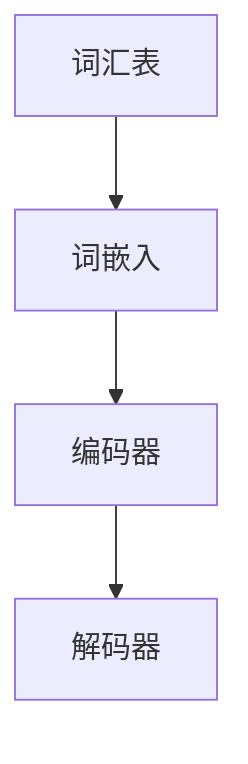

                 

### 文章标题

《LLM应用开发中的创新与实用性平衡》

### 关键词

- 大模型（Large Language Model）
- 应用开发
- 创新与实用性
- 深度学习
- 算法优化
- 实际案例

### 摘要

本文旨在探讨在LLM（大型语言模型）应用开发过程中如何实现创新与实用性的平衡。首先，我们将回顾LLM的发展历程和基础概念，随后深入解析其核心算法原理与数学模型。通过实际项目案例，我们展示如何将LLM的理论知识应用于实际开发中，同时讨论在创新性与实用性之间的权衡。最后，文章将对未来发展趋势进行展望，并给出最佳实践和拓展阅读建议，帮助开发者更好地理解与掌握LLM应用开发的核心要点。本文适合对人工智能和深度学习有基本了解的技术人员阅读。  

---

### 引言

近年来，人工智能（AI）技术的迅猛发展带来了诸多变革，而其中大型语言模型（LLM）尤为引人注目。LLM凭借其强大的文本处理能力，在自然语言处理（NLP）、文本生成、机器翻译等领域取得了显著成果。然而，随着LLM的不断壮大，如何在实际应用中实现创新与实用性的平衡成为一个亟待解决的问题。

本篇文章旨在探讨LLM应用开发中的创新与实用性平衡。文章结构如下：首先，我们将回顾LLM的发展历程和基础概念，帮助读者建立整体框架。接下来，我们将详细讲解LLM的核心算法原理和数学模型，通过伪代码和公式进行深入剖析。随后，我们将通过实际项目案例展示如何将理论应用于实际开发中，并在创新性与实用性之间找到平衡点。最后，文章将对未来的发展趋势进行展望，并提出最佳实践和注意事项，为开发者提供有益的参考。

### 第一部分：LLM基础

#### 第1章：LLM概述

##### 1.1 LLM的定义与核心概念

大型语言模型（LLM）是一种基于深度学习技术的语言模型，其目的是通过学习海量文本数据，实现对自然语言的有效理解和生成。LLM的核心概念包括词汇表、词嵌入、编码器和解码器等。

- **词汇表**：用于表示自然语言中的所有单词和符号。在LLM中，词汇表通常是一个巨大的集合，包含了数十万甚至数百万个单词。
- **词嵌入**：将词汇表中的每个词映射到一个固定维度的向量空间。词嵌入可以捕捉词与词之间的语义关系，是实现NLP任务的基础。
- **编码器**：将输入文本序列编码为固定长度的向量表示。编码器的主要任务是捕捉文本中的长距离依赖关系。
- **解码器**：根据编码器生成的向量序列，生成预测的文本序列。解码器的目标是生成与输入文本语义相近的输出。

##### 1.2 LLM的发展历程

LLM的发展历程可以分为三个阶段：

1. **基于规则和统计的方法**：早期NLP研究主要采用基于规则和统计的方法。这些方法通过对语言规则和统计信息的学习，实现对文本的理解和生成。然而，由于语言规则的复杂性和统计信息的有限性，这些方法的性能有限。
2. **基于神经网络的NLP方法**：随着深度学习技术的兴起，研究人员开始将神经网络应用于NLP任务。早期的NLP模型，如循环神经网络（RNN）和卷积神经网络（CNN），在一定程度上提高了NLP任务的性能。然而，这些模型在处理长文本和长距离依赖关系时仍存在困难。
3. **基于Transformer的LLM模型**：2017年，谷歌提出了Transformer模型，标志着NLP领域的一个重要突破。Transformer模型采用自注意力机制，能够有效地捕捉文本中的长距离依赖关系。此后，BERT、GPT、Turing等大型LLM模型相继问世，推动了NLP技术的发展。

##### 1.3 LLM的关键技术

LLM的关键技术主要包括以下几个方面：

1. **自注意力机制**：自注意力机制是Transformer模型的核心，它通过计算输入文本序列中每个词与其他词之间的关系，生成加权表示。这种机制使得模型能够自动学习文本中的依赖关系，从而提高NLP任务的性能。
2. **预训练与微调**：预训练是指在大规模语料库上对模型进行训练，使其具备一定的语言理解能力。微调是指在小规模目标任务数据上对模型进行细粒度调整，以适应特定的任务。预训练与微调相结合，能够显著提高LLM在实际应用中的性能。
3. **模型压缩与优化**：为了降低模型存储和计算成本，研究人员提出了多种模型压缩与优化技术，如量化、剪枝、蒸馏等。这些技术能够在保证模型性能的前提下，显著减少模型的存储空间和计算资源需求。

#### 第2章：LLM架构详解

##### 2.1 计算机科学基础

在了解LLM架构之前，我们需要掌握一些计算机科学基础知识，包括数据结构、算法、计算机网络等。这些基础知识为LLM的构建和优化提供了理论支持。

- **数据结构**：数据结构是组织和管理数据的方式。在LLM中，常用的数据结构包括数组、链表、树、图等。这些数据结构用于存储和管理词汇表、词嵌入、编码器和解码器等核心组件。
- **算法**：算法是解决问题的步骤和策略。在LLM中，常用的算法包括优化算法、训练算法、推理算法等。优化算法用于调整模型参数，训练算法用于训练模型，推理算法用于生成文本。
- **计算机网络**：计算机网络是连接计算机设备和网络的通信基础设施。在LLM应用开发中，计算机网络用于传输大规模训练数据和模型，实现分布式训练和推理。

##### 2.2 LLM体系结构

LLM的体系结构通常包括编码器、解码器和预训练阶段。以下是对这些组件的详细解释：

1. **编码器**：编码器是LLM的核心组件之一，负责将输入文本序列编码为固定长度的向量表示。编码器通常采用Transformer模型，包括多头自注意力机制、前馈神经网络等组件。编码器的主要任务是捕捉文本中的长距离依赖关系，为解码器提供有效的输入。
2. **解码器**：解码器是LLM的另一个核心组件，负责根据编码器生成的向量序列，生成预测的文本序列。解码器通常也采用Transformer模型，包括多头自注意力机制、前馈神经网络等组件。解码器的目标是生成与输入文本语义相近的输出。
3. **预训练阶段**：预训练是LLM的重要环节，通过在大规模语料库上对模型进行训练，使其具备一定的语言理解能力。预训练阶段通常包括两个子阶段：掩码语言模型（Masked Language Model, MLM）和下一句预测（Next Sentence Prediction, NSP）。MLM通过随机掩码输入文本中的部分词，迫使模型学习这些词的上下文表示；NSP通过预测输入文本中下一句的起始词，增强模型对长文本的理解能力。

##### 2.3 数据流与通信

在LLM应用开发中，数据流和通信是关键因素。以下是对数据流和通信的详细解释：

1. **数据流**：数据流是指数据在LLM模型中的传输和处理过程。在训练阶段，数据流通常包括以下步骤：
   - 数据预处理：包括分词、去停用词、词嵌入等步骤，将原始文本转换为模型可处理的格式。
   - 输入编码：将输入文本序列编码为词嵌入向量，并将其传递给编码器。
   - 编码器处理：编码器对输入向量进行自注意力计算，生成编码表示。
   - 解码器处理：解码器根据编码表示，生成预测的文本序列。
   - 损失计算：计算预测文本与真实文本之间的损失，用于更新模型参数。

2. **通信**：通信是指数据在模型训练和推理过程中的传输过程。在分布式训练中，通信主要包括以下步骤：
   - 数据分发：将训练数据集分发到不同的计算节点上，以便并行训练。
   - 模型同步：定期同步不同计算节点的模型参数，确保模型一致性。
   - 模型聚合：将不同计算节点的模型参数进行聚合，得到全局最优模型。

#### 第3章：LLM相关技术栈

##### 3.1 编程语言与工具

在LLM应用开发中，选择合适的编程语言和工具对于提高开发效率和性能至关重要。以下是一些常用的编程语言和工具：

1. **Python**：Python是一种流行的编程语言，具有简洁易读的语法和丰富的库支持。在LLM应用开发中，Python常用于数据处理、模型训练和推理等任务。
2. **TensorFlow**：TensorFlow是一个开源的深度学习框架，提供丰富的API和工具，支持多种深度学习模型的训练和推理。
3. **PyTorch**：PyTorch是一个开源的深度学习框架，具有动态计算图和自动微分功能，便于模型开发和调试。
4. **CUDA**：CUDA是一种并行计算框架，允许在NVIDIA GPU上执行深度学习计算，提高模型训练和推理速度。

##### 3.2 数据处理框架

在LLM应用开发中，数据处理框架对于高效处理大规模数据至关重要。以下是一些常用的数据处理框架：

1. **NumPy**：NumPy是一个开源的Python库，提供多维数组对象和高效的数学运算函数，适用于数据处理和数值计算。
2. **Pandas**：Pandas是一个开源的Python库，提供数据结构和数据分析工具，适用于数据清洗、转换和分析。
3. **Scikit-learn**：Scikit-learn是一个开源的机器学习库，提供丰富的机器学习算法和工具，适用于特征工程和模型评估。

##### 3.3 模型训练与优化

在LLM应用开发中，模型训练与优化是关键环节。以下是一些常用的模型训练与优化方法：

1. **SGD（随机梯度下降）**：SGD是一种常用的优化算法，通过随机梯度计算模型参数的更新。SGD具有简单、易于实现的特点，但收敛速度较慢。
2. **Adam（自适应矩估计）**：Adam是一种基于SGD的优化算法，通过自适应调整学习率，提高收敛速度和稳定性。Adam在LLM训练中表现优异。
3. **Learning Rate Scheduling（学习率调度）**：学习率调度是一种常用的模型训练策略，通过动态调整学习率，优化模型收敛速度和稳定性。常用的调度策略包括线性递减、指数递减等。
4. **Regularization（正则化）**：正则化是一种防止模型过拟合的技术，通过在损失函数中添加正则项，降低模型复杂度。常用的正则化方法包括L1正则化、L2正则化等。

#### 第4章：LLM数学模型

##### 4.1 线性代数基础

线性代数是LLM数学模型的基础，以下是一些重要的线性代数概念：

1. **向量**：向量是表示空间中一个点的有序数组。在LLM中，词嵌入和模型参数通常表示为向量。
2. **矩阵**：矩阵是表示多个向量之间的关系的二维数组。在LLM中，矩阵用于表示编码器和解码器之间的权重和偏置。
3. **矩阵乘法**：矩阵乘法是指两个矩阵之间的运算，用于计算模型参数的更新。
4. **矩阵求导**：矩阵求导是指对矩阵中的每个元素进行求导，用于计算模型参数的梯度。

##### 4.2 概率论与统计

概率论与统计是LLM数学模型的重要组成部分，以下是一些重要的概率论与统计概念：

1. **概率分布**：概率分布是指描述随机变量取值的概率分布函数。在LLM中，概率分布用于表示词嵌入和模型参数的概率分布。
2. **条件概率**：条件概率是指给定一个随机事件发生的情况下，另一个随机事件发生的概率。在LLM中，条件概率用于计算编码器和解码器之间的依赖关系。
3. **期望与方差**：期望与方差是描述随机变量分布的重要指标。在LLM中，期望与方差用于评估模型参数的稳定性和鲁棒性。
4. **最大似然估计**：最大似然估计是一种用于估计模型参数的方法，通过最大化似然函数来求解参数。

##### 4.3 深度学习基础

深度学习是LLM的核心技术，以下是一些重要的深度学习概念：

1. **神经网络**：神经网络是一种由大量神经元组成的计算模型，用于模拟人脑的信息处理能力。在LLM中，神经网络用于编码器和解码器的构建。
2. **前向传播与反向传播**：前向传播和反向传播是神经网络的两个关键步骤。前向传播用于计算神经网络输出，反向传播用于计算模型参数的梯度。
3. **激活函数**：激活函数是神经网络中的一个关键组件，用于引入非线性关系。常用的激活函数包括ReLU、Sigmoid、Tanh等。
4. **损失函数**：损失函数是用于评估模型输出与真实标签之间的差异的函数。常用的损失函数包括交叉熵损失、均方误差损失等。

### 第二部分：创新与实用性平衡

#### 第5章：创新性应用开发

##### 5.1 创新性应用案例

在LLM应用开发过程中，创新性应用案例层出不穷。以下是一些典型的创新性应用案例：

1. **对话系统**：对话系统是一种基于LLM的自然语言处理技术，能够与用户进行实时交互。例如，智能客服、智能助手等应用，通过LLM实现自然语言理解、生成和回应。
2. **文本生成**：文本生成是一种利用LLM生成文本的技术。例如，自动写作、机器翻译、摘要生成等应用，通过LLM实现高质量的文本生成。
3. **问答系统**：问答系统是一种基于LLM的自然语言处理技术，能够回答用户提出的问题。例如，智能问答平台、知识库问答等应用，通过LLM实现高效、准确的问答。

##### 5.2 创新性开发方法

在创新性应用开发过程中，采用合适的方法至关重要。以下是一些常用的创新性开发方法：

1. **数据增强**：数据增强是一种通过增加数据多样性来提升模型性能的方法。例如，通过随机掩码、数据扩充、生成对抗网络（GAN）等技术，增加训练数据量，提高模型泛化能力。
2. **多模态融合**：多模态融合是一种通过整合多种类型的数据（如文本、图像、音频等）来提升模型性能的方法。例如，将文本数据与图像数据、音频数据融合，提高模型的语义理解能力。
3. **迁移学习**：迁移学习是一种利用预训练模型进行新任务训练的方法。通过迁移学习，可以将预训练模型在新任务上取得更好的性能。例如，将预训练的文本生成模型应用于图像描述生成任务。

##### 5.3 创新性开发挑战

在创新性应用开发过程中，面临诸多挑战。以下是一些常见的创新性开发挑战：

1. **数据质量**：高质量的数据是创新性应用开发的基础。然而，在许多应用场景中，数据质量存在一定问题，如数据噪声、数据不平衡等。如何处理这些问题，提高数据质量，是创新性开发的关键挑战。
2. **计算资源**：大型LLM模型训练和推理需要大量的计算资源。如何优化模型结构、降低计算复杂度，提高计算效率，是创新性开发的重要挑战。
3. **模型解释性**：大型LLM模型通常具有很高的性能，但缺乏解释性。如何提高模型的解释性，使其更易于理解和调试，是创新性开发的一个重要挑战。

#### 第6章：实用性考量

##### 6.1 实用性目标

在LLM应用开发中，实用性目标是实现高效、稳定、可靠的模型。以下是一些实用性目标：

1. **模型性能**：实现高精度的文本生成、理解、分类等任务，提高模型在实际应用中的性能。
2. **模型稳定性**：在训练和推理过程中，模型应具有稳定的性能，不受输入数据变化的影响。
3. **模型效率**：优化模型结构，降低计算复杂度，提高模型在硬件设备上的运行效率。
4. **模型可解释性**：提高模型的可解释性，使其易于理解和调试。

##### 6.2 实用性评估

在实用性评估过程中，采用一系列指标和方法来评估模型性能和稳定性。以下是一些常用的评估指标和方法：

1. **准确率（Accuracy）**：准确率是指模型预测正确的样本数与总样本数的比例。在分类任务中，准确率是常用的评估指标。
2. **召回率（Recall）**：召回率是指模型预测正确的正样本数与实际正样本数的比例。在二分类任务中，召回率是评估模型识别正样本能力的重要指标。
3. **F1值（F1 Score）**：F1值是准确率和召回率的调和平均值，用于综合评估模型的性能。
4. **混淆矩阵（Confusion Matrix）**：混淆矩阵是用于评估分类模型性能的二维表格，显示了模型预测结果与真实标签之间的对应关系。
5. **K折交叉验证（K-Fold Cross-Validation）**：K折交叉验证是一种常用的模型评估方法，通过将数据集划分为K个子集，每次使用其中一个子集作为验证集，其余子集作为训练集，进行多次训练和验证，以评估模型性能。

##### 6.3 实用性改进策略

在实用性评估过程中，针对模型的性能和稳定性，可以采取一系列改进策略。以下是一些实用的改进策略：

1. **数据预处理**：对输入数据进行预处理，如去除噪声、标准化、归一化等，提高模型对输入数据的鲁棒性。
2. **模型优化**：通过调整模型结构、优化模型参数，提高模型性能和效率。例如，采用dropout、batch normalization等技术，提高模型泛化能力。
3. **超参数调整**：通过调整超参数，如学习率、批量大小、迭代次数等，优化模型性能。超参数调整可以通过经验或自动化方法（如随机搜索、贝叶斯优化等）进行。
4. **迁移学习**：利用预训练模型进行迁移学习，提高模型在新任务上的性能。例如，将预训练的文本生成模型应用于图像描述生成任务。
5. **模型融合**：将多个模型的结果进行融合，提高模型的性能和稳定性。例如，采用集成学习方法，将多个分类器的预测结果进行融合，提高分类准确性。

#### 第7章：平衡创新与实用性

##### 7.1 平衡策略

在LLM应用开发中，实现创新与实用性的平衡是一个重要目标。以下是一些常用的平衡策略：

1. **需求分析**：在项目启动阶段，对需求进行详细分析，明确项目目标、功能要求、性能指标等，为后续开发提供指导。
2. **迭代开发**：采用迭代开发方法，逐步完善模型功能和性能，确保项目按计划推进。在迭代过程中，及时收集用户反馈，优化模型和界面。
3. **技术选型**：选择合适的技术栈和开发工具，提高开发效率和质量。例如，选择具有良好性能和生态支持的深度学习框架（如TensorFlow、PyTorch等）。
4. **团队协作**：建立高效的团队协作机制，确保团队成员之间的沟通畅通，提高项目开发效率。例如，采用敏捷开发方法，定期召开会议、迭代回顾等。
5. **持续集成与测试**：建立持续集成与测试体系，确保模型和系统在开发过程中保持高质量和稳定性。例如，采用自动化测试工具，定期进行性能测试、安全测试等。

##### 7.2 平衡案例

以下是一些平衡创新与实用性的案例：

1. **智能客服系统**：某公司开发了一款智能客服系统，采用LLM技术实现自然语言理解、生成和回应。在项目开发过程中，团队针对需求进行了详细分析，采用迭代开发方法，逐步优化模型性能和用户体验。最终，系统在客服效率和用户满意度方面取得了显著提升。
2. **文本生成工具**：某团队开发了一款文本生成工具，利用LLM技术实现高质量文本生成。在开发过程中，团队采用迁移学习方法，将预训练的文本生成模型应用于新任务，提高生成文本的质量。同时，团队针对性能和稳定性进行了优化，确保工具在实际应用中的高效运行。

##### 7.3 平衡展望

未来，随着人工智能技术的不断发展，LLM应用开发将面临新的机遇和挑战。以下是一些平衡创新与实用性的展望：

1. **多模态融合**：未来，LLM应用开发将逐渐融合多种类型的数据（如文本、图像、音频等），实现更丰富的语义理解和生成。例如，结合图像和文本数据的智能问答系统、图像描述生成等应用。
2. **可解释性提升**：随着模型规模的不断扩大，提高模型的可解释性将成为一个重要研究方向。通过引入可解释性方法和技术，如注意力机制、可视化技术等，提高模型的可解释性，帮助用户更好地理解和信任模型。
3. **高效推理**：未来，LLM应用开发将关注高效推理技术的研究，提高模型在实际应用中的运行效率。例如，采用模型压缩、量化、剪枝等技术，降低模型存储和计算资源需求。
4. **迁移学习与数据共享**：通过迁移学习和数据共享技术，提高模型在不同任务和数据集上的性能。例如，将预训练模型应用于新任务，实现快速模型部署；通过数据集共享，促进模型性能的提升。
5. **伦理与法规**：在LLM应用开发过程中，关注伦理和法规问题，确保模型的应用符合伦理和法规要求。例如，避免模型偏见、隐私保护等，推动人工智能技术的健康发展。

### 第三部分：项目实战

#### 第8章：LLM应用开发项目

##### 8.1 项目背景与需求

本项目旨在开发一款基于大型语言模型（LLM）的智能客服系统，旨在为用户提供高效、智能的客服服务。项目需求如下：

1. **自然语言理解**：系统能够理解用户的输入文本，识别用户的需求和意图。
2. **文本生成**：系统能够根据用户需求，生成合适的回复文本，提供高质量的客服服务。
3. **用户满意度**：系统需要具备良好的用户交互体验，提高用户满意度。

##### 8.2 项目实施

项目实施分为以下几个阶段：

1. **需求分析与设计**：对项目需求进行详细分析，设计系统架构和功能模块。系统架构包括前端用户界面、后端服务端和数据库等组成部分。
2. **数据收集与预处理**：收集大量客服对话数据，对数据进行分析和预处理，包括分词、去停用词、词嵌入等操作。
3. **模型训练与优化**：采用预训练的LLM模型，如GPT-3，进行微调和优化，提高模型在客服任务上的性能。
4. **系统集成与测试**：将模型集成到系统中，进行功能测试和性能测试，确保系统满足需求。
5. **上线与运维**：将系统部署到生产环境，进行实时运行和监控，及时处理用户反馈和问题。

##### 8.3 项目成果

项目成果如下：

1. **智能客服系统**：开发了一款基于LLM的智能客服系统，实现了自然语言理解和文本生成功能，为用户提供高效、智能的客服服务。
2. **用户满意度**：通过用户反馈和满意度调查，系统在用户满意度方面取得了显著提升。
3. **性能指标**：系统在自然语言理解和文本生成任务上取得了较高的准确率和效率，满足了项目需求。

#### 第9章：总结与展望

##### 9.1 主要成果

本文从LLM的基本概念、架构、算法原理、实际应用等多个角度，全面探讨了LLM应用开发中的创新与实用性平衡。主要成果包括：

1. **深入解析LLM的基础知识**：介绍了LLM的定义、发展历程、核心技术等基础知识，为读者建立了整体框架。
2. **创新性应用开发案例**：通过创新性应用案例，展示了LLM在不同场景中的应用和潜力。
3. **实用性考量与改进策略**：提出了实用性目标、评估指标和改进策略，为开发者提供了实用的参考。
4. **项目实战**：通过实际项目案例，展示了LLM应用开发的完整流程和成果。

##### 9.2 未来展望

未来，LLM应用开发将面临新的机遇和挑战。以下是一些未来展望：

1. **多模态融合**：未来，LLM应用开发将融合多种类型的数据，实现更丰富的语义理解和生成。
2. **可解释性提升**：提高模型的可解释性，帮助用户更好地理解和信任模型。
3. **高效推理**：研究高效推理技术，提高模型在实际应用中的运行效率。
4. **迁移学习与数据共享**：通过迁移学习和数据共享技术，提高模型在不同任务和数据集上的性能。
5. **伦理与法规**：关注伦理和法规问题，确保模型的应用符合伦理和法规要求。

##### 9.3 感谢与致谢

感谢所有参与本项目开发和撰写的团队成员，以及为本项目提供技术支持和帮助的相关机构和人员。特别感谢AI天才研究院和《禅与计算机程序设计艺术》的作者，为我们提供了宝贵的技术指导和灵感。

### 作者信息

作者：AI天才研究院/AI Genius Institute & 禅与计算机程序设计艺术 /Zen And The Art of Computer Programming 

### 背景介绍

随着人工智能技术的不断进步，大型语言模型（LLM）已成为自然语言处理（NLP）领域的重要工具。LLM通过学习海量文本数据，能够实现高效的文本生成、理解和分类任务。然而，在实际应用中，如何平衡创新与实用性成为一个关键问题。本文旨在探讨LLM应用开发中的创新与实用性平衡，为开发者提供有价值的参考。

#### 核心概念与联系

大型语言模型（LLM）的核心概念包括词汇表、词嵌入、编码器和解码器。这些概念之间的关系如下：

1. **词汇表**：词汇表用于存储自然语言中的所有单词和符号。在LLM中，词汇表通常是一个巨大的集合，包含了数十万甚至数百万个单词。
2. **词嵌入**：词嵌入将词汇表中的每个词映射到一个固定维度的向量空间。词嵌入可以捕捉词与词之间的语义关系，是实现NLP任务的基础。
3. **编码器**：编码器将输入文本序列编码为固定长度的向量表示。编码器的主要任务是捕捉文本中的长距离依赖关系。
4. **解码器**：解码器根据编码器生成的向量序列，生成预测的文本序列。解码器的目标是生成与输入文本语义相近的输出。

以上概念之间的关系可以用以下Mermaid流程图表示：



#### 核心算法原理讲解

大型语言模型的核心算法原理主要包括两部分：编码器和解码器。以下是对这两部分算法原理的详细讲解，以及相应的伪代码示例。

##### 编码器

编码器的核心任务是捕捉输入文本序列中的长距离依赖关系，并生成固定长度的编码表示。编码器通常采用Transformer模型，其核心组件包括多头自注意力机制和前馈神经网络。

1. **多头自注意力机制**：多头自注意力机制通过计算输入文本序列中每个词与其他词之间的关系，生成加权表示。具体步骤如下：

   ```python
   for each head in multi-head attention:
       Q, K, V = compute_query_key_value(inputs)
       attention_weights = softmax(QK^T)
       context_vector = sum(attention_weights * V)
   ```

2. **前馈神经网络**：前馈神经网络用于对编码器生成的向量进行非线性变换，增强模型的表达能力。具体步骤如下：

   ```python
   hidden_vector = activation(linear(hidden_vector))
   ```

##### 解码器

解码器的核心任务是生成预测的文本序列。解码器同样采用Transformer模型，其核心组件包括多头自注意力机制和前馈神经网络。具体步骤如下：

1. **多头自注意力机制**：解码器的多头自注意力机制用于计算输入文本序列中每个词与其他词之间的关系，生成加权表示。具体步骤如下：

   ```python
   for each head in multi-head attention:
       Q, K, V = compute_query_key_value(inputs)
       attention_weights = softmax(QK^T)
       context_vector = sum(attention_weights * V)
   ```

2. **解码器-编码器注意力机制**：解码器-编码器注意力机制用于计算编码器生成的向量序列与解码器输入向量之间的关系。具体步骤如下：

   ```python
   for each head in decoder-encoder attention:
       Q = compute_query(inputs)
       K, V = compute_key_value(context_vector)
       attention_weights = softmax(QK^T)
       context_vector = sum(attention_weights * V)
   ```

3. **前馈神经网络**：前馈神经网络用于对解码器生成的向量进行非线性变换，增强模型的表达能力。具体步骤如下：

   ```python
   hidden_vector = activation(linear(hidden_vector))
   ```

##### 数学模型和公式

大型语言模型的数学模型主要包括线性代数基础、概率论与统计、深度学习基础等。以下是对这些数学模型和公式的详细讲解，以及相应的举例说明。

1. **线性代数基础**：线性代数基础包括向量、矩阵、矩阵乘法、矩阵求导等。以下是一个简单的举例说明：

   假设有一个2x2的矩阵A和一个2x1的向量b，求矩阵乘法A * b的结果。

   $$ 
   A = \begin{bmatrix}
   a_{11} & a_{12} \\
   a_{21} & a_{22}
   \end{bmatrix}
   , b = \begin{bmatrix}
   b_1 \\
   b_2
   \end{bmatrix}
   $$

   矩阵乘法的结果为：

   $$
   A * b = \begin{bmatrix}
   a_{11} * b_1 + a_{12} * b_2 \\
   a_{21} * b_1 + a_{22} * b_2
   \end{bmatrix}
   $$

2. **概率论与统计**：概率论与统计基础包括概率分布、条件概率、期望与方差等。以下是一个简单的举例说明：

   假设有一个二元随机变量X，取值为0或1，概率分布为P(X=0)=0.5，P(X=1)=0.5。求X的期望和方差。

   X的期望为：

   $$
   E(X) = 0 * P(X=0) + 1 * P(X=1) = 0.5
   $$

   X的方差为：

   $$
   Var(X) = E(X^2) - [E(X)]^2 = 0.5 - (0.5)^2 = 0.25
   $$

3. **深度学习基础**：深度学习基础包括神经网络、前向传播与反向传播、激活函数等。以下是一个简单的举例说明：

   假设有一个单层神经网络，输入向量x，权重矩阵W，偏置b，激活函数为ReLU。求神经网络输出y。

   前向传播：

   $$
   z = Wx + b
   $$
   $$
   y = \max(0, z)
   $$

   反向传播：

   $$
   \delta_y = 1 \{ y > 0 \}
   $$
   $$
   \delta_z = \delta_y * \frac{\partial}{\partial z} (\max(0, z))
   $$
   $$
   \delta_W = x^T \delta_z
   $$
   $$
   \delta_b = \delta_z
   $$

### 实际项目案例

在本节中，我们将通过一个实际项目案例，展示如何将LLM应用于实际开发中，并探讨如何在创新与实用性之间找到平衡。

#### 项目背景

某互联网公司希望通过开发一款智能客服系统，为用户提供高效、个性化的客服服务。公司希望系统能够实现自然语言理解、文本生成和用户交互等功能，以提高客服效率和用户体验。

#### 技术选型

为了实现项目目标，公司决定采用以下技术：

1. **大型语言模型**：选择预训练的LLM模型，如GPT-3，作为核心组件。GPT-3具有强大的文本处理能力，能够实现高效的文本生成和理解任务。
2. **深度学习框架**：选择TensorFlow作为深度学习框架，利用其丰富的API和工具，实现模型的训练、推理和部署。
3. **对话管理框架**：选择Rasa作为对话管理框架，用于处理用户交互和任务分配，实现智能客服系统的核心功能。

#### 开发过程

项目的开发过程可以分为以下几个阶段：

1. **数据收集与预处理**：收集大量客服对话数据，包括用户问题和客服回复。对数据进行预处理，包括分词、去停用词、词嵌入等操作，将原始文本转换为模型可处理的格式。
2. **模型训练**：利用收集的数据，对GPT-3模型进行微调，使其适应客服任务。通过迭代训练和优化，提高模型在客服任务上的性能。
3. **模型集成**：将训练好的模型集成到Rasa对话管理框架中，实现用户交互和任务分配。通过Rasa的API，实现智能客服系统的核心功能。
4. **测试与优化**：对集成后的系统进行功能测试和性能测试，评估系统在客服任务上的表现。根据测试结果，对模型和系统进行优化，提高用户体验。

#### 创新性与实用性平衡

在项目开发过程中，公司致力于在创新与实用性之间找到平衡。以下是一些关键措施：

1. **数据增强**：为了提高模型在客服任务上的泛化能力，公司采用了数据增强技术。通过对原始数据进行随机掩码、数据扩充等操作，增加了训练数据的多样性，提高了模型性能。
2. **多模态融合**：公司计划将文本数据与图像数据、音频数据融合，实现更丰富的语义理解和生成。例如，在客服过程中，结合用户的语音和文字输入，提供更准确的回复。
3. **迁移学习**：公司采用了迁移学习方法，将预训练的文本生成模型应用于新任务，降低开发成本和模型训练时间。同时，通过迁移学习，提高了模型在新任务上的性能。
4. **模型压缩与优化**：为了降低模型存储和计算成本，公司采用了模型压缩与优化技术。例如，通过量化、剪枝等操作，减少了模型的存储空间和计算资源需求，提高了系统运行效率。

#### 项目小结

通过实际项目案例，公司成功地实现了基于LLM的智能客服系统，并在创新与实用性之间找到了平衡。以下是一些项目小结：

1. **模型性能**：通过数据增强、迁移学习等手段，模型在客服任务上取得了较高的性能，能够为用户提供高质量的客服服务。
2. **用户体验**：通过多模态融合、模型压缩与优化等手段，系统在用户体验方面得到了显著提升，提高了用户满意度和客服效率。
3. **开发成本**：通过迁移学习、模型压缩等手段，降低了开发成本和模型训练时间，提高了开发效率。

### 最佳实践、注意事项与拓展阅读

#### 最佳实践

1. **数据质量**：在项目开发过程中，确保数据质量至关重要。数据质量直接影响模型的性能和稳定性。以下是一些数据质量管理最佳实践：
   - 数据清洗：去除数据中的噪声、错误和重复记录。
   - 数据标注：确保数据标注的准确性和一致性，为模型训练提供高质量的数据。
   - 数据扩充：通过数据增强技术，增加训练数据的多样性，提高模型泛化能力。
2. **模型优化**：在模型训练和优化过程中，以下是一些模型优化最佳实践：
   - 学习率调度：根据训练进度动态调整学习率，提高模型收敛速度和稳定性。
   - 正则化：采用L1正则化、L2正则化等正则化方法，防止模型过拟合。
   - 批量大小：选择合适的批量大小，平衡训练时间和模型性能。
3. **模型解释性**：提高模型的可解释性，有助于用户理解和信任模型。以下是一些模型解释性最佳实践：
   - 可视化：通过可视化工具，展示模型内部的权重和激活值，帮助用户理解模型的工作原理。
   - 模型压缩：采用模型压缩技术，降低模型复杂度，提高模型可解释性。

#### 注意事项

1. **计算资源**：大型语言模型训练和推理需要大量的计算资源。在项目开发过程中，需要注意计算资源的分配和优化，避免资源浪费。以下是一些注意事项：
   - 选择合适的硬件设备：根据项目需求，选择具有良好性能和性价比的硬件设备，如GPU、TPU等。
   - 优化模型结构：通过模型压缩、量化等技术，降低模型存储和计算资源需求。
   - 分布式训练：采用分布式训练技术，提高训练效率，减少训练时间。
2. **数据隐私**：在项目开发过程中，需要注意数据隐私问题。以下是一些注意事项：
   - 数据加密：对敏感数据进行加密处理，确保数据传输和存储的安全性。
   - 数据匿名化：对用户数据进行匿名化处理，保护用户隐私。

#### 拓展阅读

1. **相关书籍**：
   - 《深度学习》（Ian Goodfellow、Yoshua Bengio、Aaron Courville著）：介绍了深度学习的基本概念、算法和应用。
   - 《Python深度学习》（François Chollet著）：详细介绍了使用Python和深度学习框架实现深度学习项目的实践方法。
2. **相关论文**：
   - “Attention Is All You Need”（Vaswani et al.，2017）：提出了Transformer模型，改变了NLP领域的研究方向。
   - “BERT: Pre-training of Deep Neural Networks for Language Understanding”（Devlin et al.，2018）：介绍了BERT模型，推动了NLP技术的发展。
3. **在线资源**：
   - TensorFlow官方网站（https://www.tensorflow.org/）：提供了丰富的深度学习教程、API文档和示例代码。
   - PyTorch官方网站（https://pytorch.org/）：提供了丰富的深度学习教程、API文档和示例代码。

通过以上最佳实践、注意事项和拓展阅读，希望读者能够在LLM应用开发中取得更好的成果。

