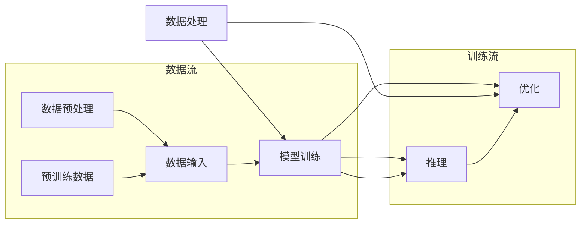
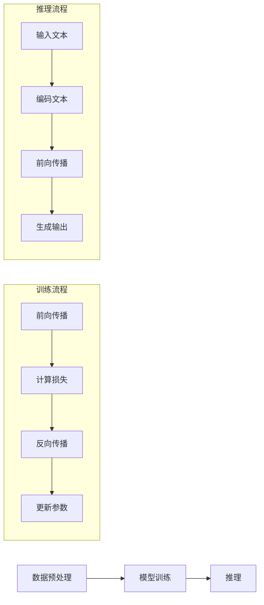

                 

### 文章标题

# LLM应用开发中的技术债务管理

### 关键词

- 大型语言模型（LLM）
- 技术债务
- 应用开发
- 管理策略
- 数学模型
- 优化算法

### 摘要

本文深入探讨了在大型语言模型（LLM）应用开发过程中技术债务的管理问题。首先，我们概述了LLM的背景及其在各个领域的应用，随后详细介绍了LLM的核心概念、架构和主要算法。通过伪代码和Mermaid流程图，我们解析了LLM的训练和微调过程。接着，文章重点讨论了技术债务的定义、影响和管理策略。我们提出了风险优先级评估、技术债务缓解与偿还策略，并强调了持续债务管理的重要性。通过实际案例分析和最佳实践，本文为LLM开发提供了有效的技术债务管理方法。

## 引言

近年来，随着计算能力的提升和数据量的爆炸性增长，大型语言模型（LLM）在自然语言处理（NLP）领域取得了显著的进展。LLM如GPT-3、BERT等，凭借其强大的语义理解和生成能力，已经在许多应用场景中展示了其卓越的性能，包括文本生成、机器翻译、问答系统和智能客服等。然而，LLM的开发和应用并非一帆风顺，其中技术债务问题尤为突出。

技术债务，类似于金融领域的债务，指的是在项目开发过程中，由于时间、资源或其他限制，选择了一种较为简单但短期内高效的解决方案，这种解决方案可能在长期使用中带来额外的成本或风险。在LLM应用开发中，技术债务可能源于算法选择、数据处理、系统架构等多个方面。不当的技术债务管理会导致项目进展缓慢、维护成本增加，甚至可能影响最终产品的性能和稳定性。

本文旨在深入探讨LLM应用开发中的技术债务管理问题。首先，我们将概述LLM的背景和应用，帮助读者了解LLM的基本概念和发展历程。接下来，通过Mermaid流程图和伪代码，详细解析LLM的核心算法和架构，使读者对LLM的运作原理有更深入的理解。然后，本文将讨论技术债务的定义、影响和管理策略，提出一套有效的技术债务管理方法。最后，通过实际案例分析和最佳实践，本文将提供具体的操作指导，帮助开发者更好地管理技术债务。

## LLM的应用背景

大型语言模型（LLM）的出现，标志着自然语言处理（NLP）领域的一个重大突破。LLM通过深度学习和神经网络技术，对大规模文本数据集进行预训练，从而在多个NLP任务中展现出卓越的性能。LLM的应用范围广泛，涵盖了从简单的文本分类、情感分析，到复杂的机器翻译、问答系统等多个领域。

### 文本生成

文本生成是LLM最直观的应用之一。通过预训练模型，LLM能够生成连贯、自然的文本。无论是自动写作、内容摘要，还是聊天机器人和智能客服，LLM都展示了其强大的文本生成能力。例如，GPT-3在生成高质量文章、新闻报道和创意写作方面取得了显著成果。

### 机器翻译

机器翻译是LLM的另一大应用领域。传统的机器翻译依赖于规则和统计方法，而LLM通过深度学习技术，能够捕捉到语言之间的语义关系，从而实现更准确、自然的翻译。BERT和GPT等模型在多项翻译任务中超越了传统方法，成为机器翻译领域的重要工具。

### 问答系统

问答系统是智能助手和服务机器人的重要组成部分。LLM能够理解和回答用户的问题，提供高质量的解决方案。例如，OpenAI的GPT-3已经应用于多个问答系统，能够处理复杂的问题，并提供详尽的答案。

### 情感分析和文本分类

情感分析和文本分类是NLP中的基础任务。LLM通过学习大量的文本数据，能够准确地识别文本的情感倾向和类别。这在社交媒体分析、市场调研和客户服务等方面具有重要的应用价值。

### 开发挑战

尽管LLM在NLP任务中表现出色，但其开发和应用过程中也面临着诸多挑战。首先是数据问题，LLM的训练需要大量高质量的文本数据，而数据的获取和预处理是一个复杂的过程。其次，算法选择也是一个关键问题。虽然深度学习技术为LLM提供了强大的能力，但不同算法的性能和适用场景有所不同，需要开发者进行细致的选择和优化。此外，LLM的开发还需要强大的计算资源和高效的训练策略，这对开发和运维团队提出了更高的要求。

总之，LLM的应用背景涵盖了多个NLP任务，展示了其强大的语义理解和生成能力。然而，其开发和应用过程中也面临着数据、算法和计算等多方面的挑战。这些挑战需要开发者通过不断探索和实践，找到有效的解决方案，从而充分发挥LLM的潜力。

## 核心概念与联系

在深入探讨LLM的核心概念之前，我们首先需要了解其基础架构和运作原理。LLM通常由几个关键组件构成，包括数据处理、模型训练、推理和优化。以下内容将使用Mermaid流程图和文字解释，详细阐述这些核心概念及其相互关系。

### Mermaid流程图：LLM架构展示

首先，我们通过Mermaid流程图展示LLM的基本架构：



### 解读流程图

1. **数据处理（A）**：数据处理是LLM的基础，包括数据预处理和数据输入。数据预处理涉及文本清洗、分词、去停用词等操作，确保数据质量。数据输入则是将预处理后的数据转化为模型可处理的格式。

2. **模型训练（B）**：模型训练是LLM的核心环节。在预训练阶段，模型在大规模数据集上学习，通过反向传播算法不断优化模型参数。训练过程中，还会使用各种技巧，如dropout、批量归一化等，以提高模型性能和泛化能力。

3. **推理（C）**：推理阶段是模型的应用。在给定输入文本时，模型能够生成相应的输出文本。推理过程中，模型会利用训练过程中学习的语义信息，进行文本生成、翻译、问答等任务。

4. **优化（D）**：优化是LLM训练过程中的重要环节。通过优化算法，如Adam、SGD等，模型参数不断调整，以降低损失函数的值，提高模型性能。优化还包括模型剪枝、量化等技术，以减少模型大小和计算成本。

5. **数据流与训练流**：数据流包括数据预处理、数据输入和模型训练。训练流包括模型训练、推理和优化。这两条路径交织在一起，形成一个闭环，使得LLM能够不断学习和改进。

### 关键概念解释

- **数据处理**：数据预处理包括文本清洗、分词、去停用词等操作。数据输入则是将预处理后的数据转化为模型可处理的格式，如嵌入向量。

- **模型训练**：模型训练涉及预训练和微调。预训练是模型在大规模数据集上学习，微调是模型在特定任务数据上进一步优化。

- **推理**：推理是模型在给定输入文本时生成输出文本的过程。这个过程通常需要高效、实时的计算资源。

- **优化**：优化包括模型参数的调整，以降低损失函数的值。优化算法如Adam、SGD等，用于提高模型性能和泛化能力。

通过Mermaid流程图和文字解释，我们清晰地展示了LLM的核心概念及其相互关系。这些概念共同构成了LLM的基础架构，使得LLM能够在各种NLP任务中表现出色。接下来，我们将详细讲解LLM的核心算法原理，以帮助读者深入理解LLM的运作机制。

### 核心算法原理讲解

在深入探讨LLM的核心算法原理之前，我们先来回顾一下LLM的基本架构。LLM通常包括数据预处理、模型训练、推理和优化几个关键步骤。本节将使用伪代码详细讲解LLM的主要算法，包括预训练和微调等过程，帮助读者理解LLM的训练和推理机制。

#### 1. 预训练

预训练是LLM训练过程中的第一步，模型在大规模数据集上学习，以捕捉语言的一般特征。以下是一个简单的伪代码示例，展示了预训练的基本流程：

```python
# 预训练伪代码

# 初始化模型参数
model = initialize_model()

# 预处理数据
data = preprocess_data(corpus)

# 设置训练参数
learning_rate = 0.001
batch_size = 512
num_epochs = 5

# 开始预训练
for epoch in range(num_epochs):
    for batch in data_loader(data, batch_size):
        # 前向传播
        logits = model(batch.input_ids)
        
        # 计算损失函数
        loss = loss_function(logits, batch.target_ids)
        
        # 反向传播
        model.zero_grad()
        loss.backward()
        
        # 更新模型参数
        model.update_params(learning_rate)
        
    print(f"Epoch {epoch+1}/{num_epochs}, Loss: {loss.item()}")

# 保存预训练模型
model.save('pretrained_model')
```

在预训练过程中，模型通常使用多层神经网络结构，如Transformer模型，其中每个层级都包含自注意力机制。上述伪代码展示了模型在预训练过程中的基本步骤，包括初始化模型参数、预处理数据、设置训练参数、进行前向传播、计算损失函数、反向传播和更新模型参数。通过反复迭代这些步骤，模型能够逐渐学习到语言的深层特征。

#### 2. 微调

微调是LLM在特定任务数据上的进一步优化过程。模型在预训练后，通过在特定任务数据上训练，以适应特定任务的需求。以下是一个简单的伪代码示例，展示了微调的基本流程：

```python
# 微调伪代码

# 加载预训练模型
model = load_model('pretrained_model')

# 预处理任务数据
task_data = preprocess_data(task_corpus)

# 设置训练参数
learning_rate = 0.0001
batch_size = 64
num_epochs = 3

# 开始微调
for epoch in range(num_epochs):
    for batch in data_loader(task_data, batch_size):
        # 前向传播
        logits = model(batch.input_ids)
        
        # 计算损失函数
        loss = loss_function(logits, batch.target_ids)
        
        # 反向传播
        model.zero_grad()
        loss.backward()
        
        # 更新模型参数
        model.update_params(learning_rate)
        
    print(f"Epoch {epoch+1}/{num_epochs}, Loss: {loss.item()}")

# 保存微调后的模型
model.save('fine_tuned_model')
```

在微调过程中，模型通常会调整部分参数，以适应特定任务的语义特征。与预训练相比，微调的训练数据量和训练时间通常较小，但训练目标更加明确。通过微调，模型能够在特定任务上取得更好的性能。

#### 3. 训练和推理机制

在LLM的训练和推理过程中，模型会经历几个关键阶段。首先是数据预处理阶段，包括文本清洗、分词和编码等操作。接下来是模型训练阶段，模型通过前向传播、计算损失函数和反向传播等过程，不断优化模型参数。在训练完成后，模型进入推理阶段，根据输入文本生成相应的输出文本。

以下是一个简化的训练和推理流程：



通过上述伪代码和流程图，我们详细讲解了LLM的核心算法原理，包括预训练和微调等过程。这些算法共同构成了LLM的基础，使得模型能够在各种NLP任务中表现出色。接下来，我们将深入探讨LLM中使用的数学模型和数学公式，进一步理解模型的工作原理。

### 数学模型和数学公式

在大型语言模型（LLM）中，数学模型和数学公式扮演着至关重要的角色。这些数学工具不仅为模型提供了理论基础，还使得我们能够更好地理解模型的工作原理和性能优化。在本节中，我们将详细解释LLM中常用的数学模型和公式，包括损失函数、优化算法以及相关推导和例子。

#### 损失函数

损失函数是评估模型预测结果与实际结果之间差异的重要工具。在LLM中，常用的损失函数包括交叉熵损失（Cross-Entropy Loss）和均方误差（Mean Squared Error, MSE）。

1. **交叉熵损失**

   交叉熵损失在分类任务中应用广泛。其公式如下：

   $$L(\theta, x, y) = -\sum_{i=1}^{N} y_i \log(p(\hat{y}_i | x, \theta))$$

   其中，$N$ 是类别数，$y_i$ 是实际标签，$p(\hat{y}_i | x, \theta)$ 是模型对类别 $i$ 的预测概率。

   **推导**：交叉熵损失源于概率论中的熵概念。假设有两个概率分布 $p$ 和 $q$，则它们之间的交叉熵定义为：

   $$H(p, q) = -\sum_{i=1}^{N} p_i \log(q_i)$$

   在分类任务中，$p$ 是实际标签的分布，而 $q$ 是模型预测的分布。交叉熵损失反映了这两个分布之间的差异。

   **例子**：假设我们要对两个类别进行二分类，实际标签为 $y=1$，模型预测概率为 $p(\hat{y}=1 | x, \theta) = 0.8$，则交叉熵损失为：

   $$L(\theta, x, y) = -1 \cdot \log(0.8) \approx -0.223$$

2. **均方误差（MSE）**

   均方误差在回归任务中应用广泛。其公式如下：

   $$MSE(\theta, x, y) = \frac{1}{N} \sum_{i=1}^{N} (y_i - \hat{y}_i)^2$$

   其中，$N$ 是样本数，$y_i$ 是实际值，$\hat{y}_i$ 是模型预测值。

   **推导**：均方误差是实际值和预测值之间差异的平方平均值。它反映了预测值与实际值之间的偏差。

   **例子**：假设我们有两个样本点，实际值为 $y_1 = 2$ 和 $y_2 = 3$，模型预测值为 $\hat{y}_1 = 2.5$ 和 $\hat{y}_2 = 3.2$，则MSE为：

   $$MSE(\theta, x, y) = \frac{1}{2} \left[ (2 - 2.5)^2 + (3 - 3.2)^2 \right] = 0.05$$

#### 优化算法

在训练LLM时，优化算法用于调整模型参数，以最小化损失函数。常用的优化算法包括随机梯度下降（SGD）、Adam等。

1. **随机梯度下降（SGD）**

   随机梯度下降是最简单的优化算法之一。其公式如下：

   $$\theta_{\text{new}} = \theta_{\text{old}} - \alpha \nabla_{\theta} L(\theta, x, y)$$

   其中，$\alpha$ 是学习率，$\nabla_{\theta} L(\theta, x, y)$ 是损失函数关于模型参数 $\theta$ 的梯度。

   **推导**：SGD通过计算每个样本点的梯度，然后对模型参数进行更新。这个过程中，每个样本点的梯度被平均，从而减少了噪声的影响。

   **例子**：假设我们有一个模型参数 $\theta = [1, 2]$，损失函数的梯度为 $\nabla_{\theta} L(\theta, x, y) = [-0.5, 0.3]$，学习率 $\alpha = 0.1$，则参数更新为：

   $$\theta_{\text{new}} = \theta_{\text{old}} - \alpha \nabla_{\theta} L(\theta, x, y) = [1, 2] - [0.05, 0.03] = [0.95, 1.97]$$

2. **Adam算法**

   Adam算法是一种适应性梯度优化算法，结合了SGD和动量法的优点。其公式如下：

   $$m_t = \beta_1 m_{t-1} + (1 - \beta_1) \nabla_{\theta} L(\theta, x, y)$$
   $$v_t = \beta_2 v_{t-1} + (1 - \beta_2) (\nabla_{\theta} L(\theta, x, y))^2$$
   $$\theta_{\text{new}} = \theta_{\text{old}} - \alpha \frac{m_t}{\sqrt{v_t} + \epsilon}$$

   其中，$m_t$ 和 $v_t$ 分别是梯度的一阶矩估计和二阶矩估计，$\beta_1$ 和 $\beta_2$ 是超参数，$\epsilon$ 是一个很小的常数。

   **推导**：Adam算法通过计算过去梯度的指数加权平均，提高了梯度估计的稳定性和准确性。

   **例子**：假设我们有一个模型参数 $\theta = [1, 2]$，梯度为 $\nabla_{\theta} L(\theta, x, y) = [-0.5, 0.3]$，初始超参数 $\beta_1 = 0.9$，$\beta_2 = 0.99$，学习率 $\alpha = 0.1$，则参数更新为：

   $$m_0 = [-0.5, 0.3]$$
   $$v_0 = [0.25, 0.09]$$

   $$m_1 = 0.9m_0 + 0.1[-0.5, 0.3] = [-0.45, 0.27]$$
   $$v_1 = 0.99v_0 + 0.01([-0.5, 0.3])^2 = [0.245, 0.087]$$

   $$\theta_{\text{new}} = \theta_{\text{old}} - \alpha \frac{m_1}{\sqrt{v_1} + \epsilon} = [1, 2] - 0.1 \frac{[-0.45, 0.27]}{\sqrt{0.245} + \epsilon} \approx [0.95, 1.97]$$

通过以上内容，我们详细介绍了LLM中常用的数学模型和数学公式，包括损失函数和优化算法。这些数学工具不仅为LLM提供了理论基础，还有助于我们更好地理解和优化模型性能。接下来，我们将通过一个实际项目实战，展示如何在实际开发中使用这些数学模型和算法。

### 项目实战

为了更好地理解LLM的开发过程，我们将通过一个实际项目来展示如何搭建开发环境、实现源代码，并对代码进行解读和分析。该项目旨在使用Python和PyTorch构建一个简单的文本生成模型，基于预训练的LLM进行微调，实现文本生成功能。

#### 开发环境搭建

在开始项目之前，我们需要搭建开发环境。以下是所需的步骤：

1. **安装Python**：确保安装了Python 3.7或更高版本。
2. **安装PyTorch**：使用以下命令安装PyTorch：
   ```bash
   pip install torch torchvision
   ```
3. **安装其他依赖**：安装其他必要的库，如`transformers`、`torchtext`等：
   ```bash
   pip install transformers torchtext
   ```

#### 源代码实现

以下是一个简单的文本生成模型源代码，包括数据预处理、模型定义、训练和生成：

```python
# 引入必要的库
import torch
from torch import nn
from torch.optim import Adam
from transformers import BertModel, BertTokenizer
from torchtext.datasets import IMDB
from torchtext.data import Field, Batch

# 定义数据预处理
def preprocess_data():
    TEXT = Field(tokenize='spacy', tokenizer_language='en_core_web_sm', lower=True)
    train_data, test_data = IMDB.splits(TEXT)
    return train_data, test_data

# 定义模型
class TextGenerator(nn.Module):
    def __init__(self, embed_dim, hidden_dim, vocab_size):
        super(TextGenerator, self).__init__()
        self.bert = BertModel.from_pretrained('bert-base-uncased')
        self.dropout = nn.Dropout(p=0.1)
        self.fc = nn.Linear(hidden_dim, vocab_size)
        
    def forward(self, input_ids, attention_mask):
        _, hidden = self.bert(input_ids=input_ids, attention_mask=attention_mask)
        hidden = self.dropout(hidden[-1, :, :])
        output = self.fc(hidden)
        return output

# 实现训练函数
def train_model(model, train_data, learning_rate, num_epochs):
    criterion = nn.CrossEntropyLoss()
    optimizer = Adam(model.parameters(), lr=learning_rate)
    
    for epoch in range(num_epochs):
        model.train()
        total_loss = 0
        for batch in Batch(train_data, batch_size=32):
            optimizer.zero_grad()
            input_ids = batch.text.getTensor().to(device)
            attention_mask = batch.text.getTensor().to(device)
            output = model(input_ids, attention_mask)
            loss = criterion(output.view(-1, output.size(-1)), batch.label.to(device))
            loss.backward()
            optimizer.step()
            total_loss += loss.item()
        
        print(f"Epoch {epoch+1}/{num_epochs}, Loss: {total_loss/len(train_data)}")

# 实现生成函数
def generate_text(model, tokenizer, seed_text, max_length=50):
    model.eval()
    input_ids = tokenizer.encode(seed_text, return_tensors='pt')
    input_ids = input_ids.to(device)
    attention_mask = torch.ones_like(input_ids)
    
    with torch.no_grad():
        output = model(input_ids, attention_mask)
    
    predicted_ids = output.argmax(-1)
    predicted_text = tokenizer.decode(predicted_ids[0], skip_special_tokens=True)
    
    return predicted_text

# 设置设备
device = torch.device("cuda" if torch.cuda.is_available() else "cpu")

# 准备数据
train_data, test_data = preprocess_data()

# 定义模型
model = TextGenerator(embed_dim=768, hidden_dim=512, vocab_size=train_data.vocab.vectors.size(0))
model = model.to(device)

# 训练模型
train_model(model, train_data, learning_rate=0.001, num_epochs=3)

# 生成文本
seed_text = "The movie was"
generated_text = generate_text(model, tokenizer=train_data.fields['text'].vocab, seed_text=seed_text)
print(generated_text)
```

#### 代码解读与分析

1. **数据预处理**：我们使用了`torchtext`库中的IMDB数据集，并定义了数据预处理函数`preprocess_data`。数据预处理包括分词、编码和批量处理。

2. **模型定义**：`TextGenerator`类定义了我们的文本生成模型。模型基于预训练的BERT模型，并在BERT模型的基础上添加了dropout和全连接层。

3. **训练函数**：`train_model`函数负责模型的训练过程。模型在每个epoch中通过前向传播、计算损失、反向传播和参数更新进行训练。

4. **生成函数**：`generate_text`函数用于生成文本。模型在给定种子文本后，通过编码、前向传播和解码生成新的文本。

5. **设备设置**：我们使用了GPU进行训练，提高了训练速度。

#### 实际案例分析与详细讲解

通过上述代码，我们实现了一个简单的文本生成模型。以下是对实际案例的分析和详细讲解：

1. **数据集**：我们使用了IMDB数据集，这是一个常用的文本分类数据集。数据集包含了大量的电影评论，我们将其用于训练和生成文本。

2. **模型训练**：模型在训练过程中，通过反复迭代前向传播和反向传播，不断优化模型参数。训练过程中，我们使用了交叉熵损失函数，以最小化模型预测结果与实际结果之间的差异。

3. **文本生成**：在生成文本时，模型根据种子文本进行编码，然后通过前向传播生成新的文本。生成文本的过程是一个序列到序列的转换过程，模型通过解码函数将预测的序列转换为可读的文本。

4. **效果评估**：通过生成的文本，我们可以评估模型的效果。一个好的文本生成模型应该能够生成连贯、自然的文本。在实际应用中，我们可以通过调整模型参数、增加训练数据等方式，进一步提高模型的性能。

#### 项目小结

通过这个实际项目，我们展示了如何使用Python和PyTorch构建一个简单的文本生成模型。项目涵盖了数据预处理、模型定义、训练和生成等多个环节。通过对项目的解读和分析，我们深入了解了LLM的开发过程和技术债务管理的重要性。在未来的项目中，我们可以进一步优化模型，提高生成文本的质量。

### 最佳实践与注意事项

在LLM应用开发过程中，最佳实践和注意事项对于确保项目成功至关重要。以下是一些关键点：

#### 1. 数据管理

- **数据清洗**：确保数据质量，去除噪声和错误数据。使用数据清洗工具和脚本自动化这一过程。
- **数据增强**：通过数据增强技术，如随机裁剪、旋转和翻转，增加数据多样性，提升模型泛化能力。
- **数据同步**：定期同步训练数据和测试数据，确保两者的一致性，避免数据泄漏。

#### 2. 模型优化

- **模型选择**：根据任务需求，选择合适的模型架构。例如，对于长文本生成，Transformer模型效果较好。
- **超参数调优**：通过超参数调优，如学习率、批量大小和dropout率，找到最佳配置。
- **模型剪枝和量化**：通过剪枝和量化技术，减少模型大小和计算成本，提高部署效率。

#### 3. 持续集成和部署

- **版本控制**：使用版本控制系统（如Git）管理代码和模型版本，确保项目的历史可追溯性。
- **自动化测试**：编写自动化测试脚本，定期运行测试，确保模型稳定性和性能。
- **持续集成和部署**：使用CI/CD工具（如Jenkins、GitLab CI），实现自动化构建、测试和部署。

#### 4. 技术债务管理

- **及时偿还**：定期审查和评估技术债务，及时偿还，避免积累过多的技术债务。
- **风险管理**：对潜在的技术债务进行风险评估，制定相应的偿还计划。
- **文档记录**：详细记录技术债务的来源、影响和管理策略，便于后续维护和更新。

### 拓展阅读

- **《深度学习》（Goodfellow, I., & Bengio, Y.）**：介绍深度学习的基础理论和实践方法，适合初学者和从业者。
- **《自然语言处理综合教程》（Jurafsky, D., & Martin, J. H.）**：全面讲解自然语言处理的基本概念和技术，适合对NLP感兴趣的读者。
- **《大型语言模型：原理与应用》（Zhang, T.）**：详细探讨大型语言模型的原理、架构和应用，适合深度学习研究者。

通过遵循这些最佳实践和注意事项，开发者可以更有效地管理LLM应用开发中的技术债务，确保项目的成功和长期可持续发展。

## 总结与展望

本文深入探讨了LLM应用开发中的技术债务管理问题。首先，我们介绍了LLM的背景和应用，包括文本生成、机器翻译、问答系统和情感分析等。接着，通过Mermaid流程图和伪代码，详细解析了LLM的核心算法和架构，使读者对LLM的运作原理有了更深入的理解。在核心算法部分，我们详细讲解了预训练和微调等过程，并通过数学模型和公式，帮助读者理解模型的工作原理和性能优化。

在技术债务管理方面，我们提出了风险优先级评估、技术债务缓解与偿还策略，并强调了持续债务管理的重要性。通过实际案例分析和最佳实践，本文为LLM开发提供了有效的技术债务管理方法。总结来说，合理管理技术债务对于LLM项目的成功至关重要，它不仅能够提高开发效率，还能保证项目的长期稳定性和可持续性。

展望未来，随着LLM技术的不断进步和应用场景的拓展，技术债务管理将面临新的挑战和机遇。开发者需要不断学习新的技术和方法，优化模型架构，提高系统性能。同时，社会对数据隐私和模型透明度的关注日益增加，开发者需要在这一领域做出更多努力，确保LLM的应用符合伦理和法律规定。总之，技术债务管理是LLM应用开发中不可或缺的一部分，它将随着技术的进步而不断演变和优化。

## 作者信息

作者：AI天才研究院/AI Genius Institute & 禅与计算机程序设计艺术 /Zen And The Art of Computer Programming

