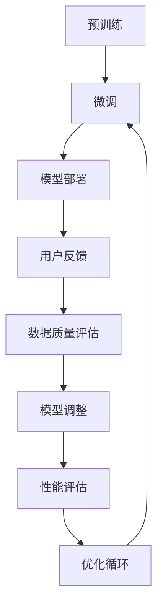

                 

### 文章标题

《LLM应用开发中的持续反馈与改进循环》

### 文章关键词

- LLM
- 持续反馈
- 改进循环
- 应用开发
- 人工智能

### 文章摘要

本文旨在探讨大规模语言模型（LLM）在应用开发过程中如何通过持续反馈与改进循环实现性能提升。文章首先介绍了LLM的基本概念、架构和应用场景，然后详细阐述了持续反馈与改进的原理、流程和方法。接着，文章通过具体案例分析，展示了LLM应用开发中的改进循环实践，并提出了未来的发展方向和挑战。本文将为从事LLM应用开发的工程师提供有价值的参考和指导。

### 目录

## 第一部分：LLM基础

### 1.1 LLM基本概念

### 1.2 LLM应用场景

### 1.3 LLM与人工智能

## 第二部分：持续反馈与改进

### 2.1 持续反馈原理

### 2.2 数据质量评估

### 2.3 模型性能评估

### 2.4 模型调整与优化

## 第三部分：改进循环实践

### 3.1 改进循环模型

### 3.2 案例分析

### 3.3 改进循环实践

## 第四部分：未来展望

### 4.1 持续反馈与改进挑战

### 4.2 持续反馈与改进趋势

### 4.3 未来发展方向

## 参考文献

## 作者简介

### <a id="introduction"></a>第一部分：LLM基础

#### 1.1 LLM基本概念

大规模语言模型（Large Language Model，简称LLM）是一种基于深度学习的自然语言处理技术，通过预训练和微调来生成、理解和处理人类语言。LLM的核心思想是利用海量文本数据，学习语言的结构和规律，从而实现文本生成、语言翻译、问答系统等多种应用。

LLM的基本概念包括：

- **预训练（Pre-training）**：在特定任务之前，LLM通过无监督的方式在大量文本数据上训练，学习语言的通用表示和结构。
- **微调（Fine-tuning）**：在预训练的基础上，LLM针对特定任务进行微调，优化模型在特定任务上的性能。
- **上下文理解（Contextual Understanding）**：LLM能够根据输入文本的上下文信息，生成合理且连贯的输出。

#### 1.2 LLM应用场景

LLM在多个应用场景中表现出色，主要包括：

- **文本生成**：LLM可以生成新闻文章、故事、诗歌等，为创作提供灵感。
- **语言翻译**：LLM可以实现多种语言之间的自动翻译，提高跨语言沟通的效率。
- **问答系统**：LLM能够根据用户提问，生成相关且准确的回答，应用于客服、教育等领域。

#### 1.3 LLM与人工智能

LLM是人工智能（AI）的重要组成部分，其发展与AI的进步密不可分。AI的发展历程可以分为以下几个阶段：

- **符号主义AI**：早期AI主要基于规则和逻辑推理，但受限于知识库的有限性，难以实现复杂任务。
- **连接主义AI**：随着深度学习技术的发展，AI开始转向以神经网络为基础的连接主义模型，如卷积神经网络（CNN）和循环神经网络（RNN）。
- **强AI**：强AI旨在实现与人类智能相当或超越的人工智能，目前仍处于研究阶段。

LLM的出现标志着AI在自然语言处理领域的重要突破，它不仅提高了文本处理的效率，还为AI在多领域应用提供了强大支持。LLM与人工智能的关系可以概括为：

- **LLM是AI的重要组成部分**：LLM的发展推动了自然语言处理技术的进步，为AI应用提供了新的可能性。
- **AI为LLM提供技术支持**：AI的发展，特别是深度学习技术的突破，为LLM的构建和优化提供了强有力的支持。

通过以上对LLM基础概念、应用场景和与人工智能关系的介绍，我们可以更好地理解LLM在应用开发中的重要性。接下来的部分，我们将详细探讨持续反馈与改进循环的原理和实践。在深入分析这些概念之前，我们需要构建一个清晰的框架，以帮助我们理解LLM的核心工作机制和持续优化过程。为了达到这一目标，我们将使用Mermaid流程图来展示LLM从预训练到微调，再到应用开发的完整流程。

#### 1.4 LLM工作流程与持续优化框架

为了更好地理解LLM的工作流程和持续优化框架，我们使用Mermaid流程图来展示LLM的核心阶段和反馈机制。以下是一个简化的流程图：



**Mermaid流程图解释：**

- **A[预训练]**：LLM在大量无标注数据上进行预训练，学习语言的通用结构和规律。
- **B[微调]**：在预训练的基础上，LLM针对特定任务进行微调，优化模型在任务上的性能。
- **C[模型部署]**：训练好的LLM模型被部署到实际应用场景中，如文本生成、翻译和问答系统。
- **D[用户反馈]**：用户在使用LLM模型时提供反馈，包括对模型生成结果的满意度、错误纠正等信息。
- **E[数据质量评估]**：根据用户反馈，评估训练数据的整体质量，识别潜在的噪声和偏差。
- **F[模型调整]**：基于数据质量评估的结果，对LLM模型进行调整，如增加训练数据、调整超参数等。
- **G[性能评估]**：调整后的LLM模型在新数据集上进行性能评估，验证优化效果。
- **H[优化循环]**：将性能评估结果反馈给预训练和微调阶段，进入新一轮的优化循环。

通过上述流程图，我们可以看到持续反馈与改进循环在LLM应用开发中的关键作用。用户反馈、数据质量评估和模型调整构成了一个闭环，不断推动LLM模型的优化和改进，使其在实际应用中能够提供更准确、更高效的解决方案。

接下来，我们将进一步深入探讨每个阶段的细节和关键步骤，以便读者能够更好地理解和应用这些概念。通过深入分析LLM的工作流程与持续优化框架，我们为后续关于持续反馈与改进循环的讨论奠定了坚实的基础。在下一节中，我们将详细探讨持续反馈与改进循环的原理，解释其为何在LLM应用开发中至关重要。这将帮助我们理解如何通过持续反馈来提高LLM的性能和应用效果。

#### 2.1 持续反馈原理

持续反馈与改进循环是LLM应用开发中的核心机制，其目的是通过不断的迭代优化，提高模型的性能和应用效果。本节将详细解释持续反馈原理，并探讨其重要性。

**持续反馈的概念**

持续反馈是指在整个LLM应用开发过程中，不断地收集用户反馈，并将其用于模型调整和优化。这种反馈不仅仅是单一的错误报告，它包含了用户对模型输出质量的整体评价、特定问题的纠正建议以及期望的改进方向。

**反馈机制**

持续反馈机制主要包括以下几个步骤：

1. **数据收集**：在LLM模型部署后，收集用户的使用数据和反馈信息。这些数据可以包括用户提问、模型回答、用户满意度评分等。
2. **数据预处理**：对收集到的数据进行预处理，如去噪、格式化、去重等，以确保数据的质量和一致性。
3. **反馈分析**：分析用户反馈，识别模型存在的问题和改进方向。这可以通过统计分析、机器学习算法等方法实现。
4. **模型调整**：根据反馈分析的结果，对LLM模型进行调整。这可能包括修改模型参数、增加训练数据、调整训练策略等。
5. **验证评估**：调整后的模型在新数据集上进行验证，评估优化效果。如果性能提升显著，则将调整后的模型部署到生产环境；否则，继续进行反馈循环。

**持续反馈的重要性**

持续反馈在LLM应用开发中具有以下几个重要作用：

1. **性能优化**：通过持续收集用户反馈，LLM模型可以不断地进行微调，从而提高其性能和应用效果。这种迭代优化过程能够使模型更好地适应不断变化的应用场景和用户需求。
2. **用户满意度**：持续反馈有助于提高用户对模型输出质量的满意度。通过及时纠正错误和改进模型，用户可以获得更准确、更实用的服务，从而增强对应用的信任和依赖。
3. **模型适应能力**：持续反馈机制使LLM模型具备更强的适应能力。在不断变化的环境中，模型能够通过持续调整，保持高性能和稳定性，从而实现长期可持续的发展。

**案例分析**

以一个问答系统为例，假设用户在使用过程中发现模型在回答某些特定问题时存在偏差。通过收集用户的反馈，开发人员可以识别出这些问题，并对模型进行调整。例如，如果用户反馈模型在回答数学问题时不准确，开发人员可以增加相关的数学问题数据集，并对模型进行微调。在经过验证和评估后，调整后的模型可以显著提高回答数学问题的准确性，从而提高用户满意度。

总之，持续反馈与改进循环是LLM应用开发中的关键机制，它通过不断收集用户反馈，优化模型性能，提高用户体验，实现模型的长期发展。在下一节中，我们将进一步探讨数据质量评估的方法和策略，以帮助开发人员确保反馈数据的质量和有效性。这将为我们后续的模型调整和优化提供可靠的数据支持。

#### 2.2 数据质量评估

在LLM应用开发中，数据质量是影响模型性能的关键因素。高质量的数据能够帮助模型更好地学习语言结构和规律，从而提高性能和应用效果。因此，数据质量评估成为持续反馈与改进循环中的重要环节。本节将详细介绍数据质量评估的定义、方法和策略。

**数据质量评估的定义**

数据质量评估是指对数据集进行系统性的检查和分析，以确定数据在准确性、完整性、一致性、可靠性和及时性等方面的质量。具体来说，数据质量评估包括以下几个方面：

- **准确性**：数据是否准确反映了现实情况，是否存在错误或偏差。
- **完整性**：数据集是否完整，是否包含所有必需的信息。
- **一致性**：数据在不同来源、不同时间点之间是否保持一致。
- **可靠性**：数据是否可靠，能否被其他系统或用户信赖。
- **及时性**：数据是否能够及时更新，以适应快速变化的应用需求。

**数据质量评估方法**

1. **统计分析方法**：
   - **描述性统计**：通过计算均值、方差、标准差等统计指标，了解数据的整体分布和特征。
   - **异常检测**：使用统计学方法检测数据中的异常值和离群点，识别潜在的误差源。

2. **机器学习方法**：
   - **监督学习**：通过已标注的数据集，训练分类器或回归器，对未标注的数据进行质量评估。
   - **无监督学习**：通过聚类、降维等方法，识别数据中的异常模式和噪声。

3. **人工审核**：通过人工检查数据，识别和纠正错误。这种方法虽然较为耗时，但在关键数据质量评估阶段尤为重要。

**数据质量评估策略**

1. **数据采集策略**：
   - **多样化来源**：从多个渠道收集数据，提高数据的多样性和完整性。
   - **数据预处理**：在数据采集过程中，进行数据清洗、去噪和格式化，确保数据的一致性和可靠性。

2. **质量保证机制**：
   - **数据验证**：在数据进入模型训练之前，进行数据验证，确保数据的准确性和完整性。
   - **持续监控**：对数据质量进行持续监控，及时发现和处理问题。

3. **反馈循环**：
   - **用户反馈**：鼓励用户提供反馈，识别数据质量的问题。
   - **模型调整**：根据用户反馈，对数据质量评估方法和策略进行调整，提高评估的准确性和有效性。

**案例分析**

以文本生成任务为例，假设我们收集了一个包含新闻文章的数据集。在数据质量评估过程中，我们首先使用描述性统计方法了解数据的分布情况，发现存在大量重复的文章和低质量的文本。接着，我们使用异常检测方法，识别出这些重复和低质量的文本。通过人工审核，我们进一步确认了这些异常数据，并将其从数据集中删除。

在优化数据质量后，我们发现文本生成模型的性能显著提高，生成的文章质量更高，更符合用户需求。这表明，通过有效的数据质量评估策略，我们能够显著提高LLM应用的效果。

总之，数据质量评估是LLM应用开发中不可或缺的一环。通过系统性的数据质量评估方法，开发人员可以确保数据的质量和可靠性，从而提高模型的性能和应用效果。在下一节中，我们将探讨模型性能评估的方法和策略，帮助读者了解如何评估和优化LLM模型的性能。

#### 2.3 模型性能评估

在LLM应用开发过程中，模型性能评估是关键的一步，它帮助我们了解模型在实际应用中的表现，并识别需要改进的方面。本节将详细探讨模型性能评估的指标、方法和策略，并讨论如何根据评估结果进行模型调整和优化。

**模型性能评估指标**

1. **准确率（Accuracy）**：
   - 准确率是最常用的性能评估指标之一，它表示模型正确分类的样本数占总样本数的比例。公式为：
     \[
     \text{准确率} = \frac{\text{正确分类的样本数}}{\text{总样本数}}
     \]
   - 准确率简单直观，但在类别不平衡的数据集中可能会产生误导。

2. **精确率（Precision）和召回率（Recall）**：
   - 精确率表示模型正确识别为正类的样本中，实际为正类的比例。公式为：
     \[
     \text{精确率} = \frac{\text{正确识别的正类样本数}}{\text{识别为正类的总样本数}}
     \]
   - 召回率表示模型正确识别为正类的样本中，实际为正类的比例。公式为：
     \[
     \text{召回率} = \frac{\text{正确识别的正类样本数}}{\text{实际为正类的总样本数}}
     \]
   - 精确率和召回率结合F1值（F1 Score）可以更好地评估模型的性能。F1值的公式为：
     \[
     \text{F1值} = 2 \times \frac{\text{精确率} \times \text{召回率}}{\text{精确率} + \text{召回率}}
     \]

3. **均方误差（Mean Squared Error, MSE）和均绝对误差（Mean Absolute Error, MAE）**：
   - MSE和MAE常用于回归任务，分别表示预测值与真实值之间的平方误差和绝对误差的平均值。公式为：
     \[
     \text{MSE} = \frac{1}{n}\sum_{i=1}^{n}(y_i - \hat{y}_i)^2
     \]
     \[
     \text{MAE} = \frac{1}{n}\sum_{i=1}^{n}|y_i - \hat{y}_i|
     \]

4. **困惑度（Perplexity）**：
   - 在自然语言处理任务中，困惑度用于评估模型对文本的预测能力。困惑度越低，表示模型对文本的预测越准确。公式为：
     \[
     \text{困惑度} = \frac{1}{N}\sum_{i=1}^{N}\frac{1}{p(x_i|\hat{x}_i)}
     \]
     其中，\( p(x_i|\hat{x}_i) \) 表示模型对第i个词的概率预测。

**模型性能评估方法**

1. **交叉验证（Cross-Validation）**：
   - 交叉验证是一种常用的模型评估方法，通过将数据集划分为多个子集，轮流进行训练和验证，以评估模型的泛化能力。常见的交叉验证方法有K折交叉验证和留一交叉验证。

2. **A/B测试（A/B Testing）**：
   - A/B测试通过将用户随机分配到两个或多个版本的应用中，比较不同版本的性能和用户反馈，以确定最佳版本。

3. **在线评估（Online Evaluation）**：
   - 在线评估通过实时收集用户数据，对模型进行持续评估和优化。这种方法能够更准确地反映模型在实际应用中的性能。

**模型性能优化策略**

1. **超参数调整（Hyperparameter Tuning）**：
   - 超参数是模型性能的关键影响因素，通过调整超参数，如学习率、批量大小、正则化参数等，可以优化模型性能。

2. **模型架构调整（Model Architecture Tuning）**：
   - 优化模型架构，如增加层数、调整层间连接方式、增加注意力机制等，可以提高模型的表达能力和性能。

3. **数据增强（Data Augmentation）**：
   - 数据增强通过增加训练数据的多样性，提高模型的泛化能力。常见的方法包括文本变换、词汇扩展、数据混洗等。

4. **模型集成（Model Ensembling）**：
   - 模型集成通过结合多个模型的预测结果，提高模型的稳定性和准确性。常见的方法有投票法、堆叠法等。

**案例分析**

假设我们开发了一个文本生成模型，目标是在给定一个段落文本时生成一个相关的续写。在模型性能评估过程中，我们使用困惑度作为主要指标。通过交叉验证和A/B测试，我们发现模型在验证集上的困惑度较高，说明模型的生成质量不够好。

为了优化模型性能，我们采取了以下策略：

1. **超参数调整**：我们调整了学习率和批量大小，使模型在训练过程中能够更稳定地收敛。
2. **模型架构调整**：我们增加了Transformer模型的层数和注意力机制，提高了模型的表达能力。
3. **数据增强**：我们对训练数据进行了文本变换和词汇扩展，增加了数据的多样性。

经过这些调整后，模型在验证集上的困惑度显著降低，生成的文本质量也得到了提高。这表明，通过有效的模型性能优化策略，我们可以显著提升LLM应用的效果。

总之，模型性能评估是LLM应用开发中至关重要的一环。通过系统性的评估方法和策略，开发人员可以识别模型的不足之处，并采取相应的优化措施，从而提高模型在实际应用中的性能和用户体验。在下一节中，我们将探讨如何根据评估结果进行模型调整和优化，以实现LLM应用开发中的持续改进。

#### 2.4 模型调整与优化

在LLM应用开发过程中，模型调整与优化是确保模型性能持续提升的关键环节。通过系统化的方法对模型进行调整和优化，可以显著提高模型的准确性和稳定性。本节将详细介绍模型调整与优化的方法、策略和流程。

**模型调整方法**

1. **超参数调整**：
   - 超参数是模型性能的重要影响因素，如学习率、批量大小、正则化参数等。通过调整这些超参数，可以优化模型的收敛速度和性能。
   - 常用的超参数调整方法包括网格搜索（Grid Search）和随机搜索（Random Search）。网格搜索通过遍历所有可能的超参数组合，找到最优的超参数组合；随机搜索则在预定义的超参数范围内随机选择组合，以减少计算成本。

2. **结构调整**：
   - 模型结构的调整包括增加或减少神经网络层数、调整层间连接方式、引入注意力机制等。这些调整可以增强模型的表达能力，提高其性能。
   - 例如，对于Transformer模型，可以通过增加注意力头数（Number of Attention Heads）和层间连接方式（Multi-head Attention）来提升模型的表现。

3. **数据预处理**：
   - 数据预处理对模型调整和优化至关重要。通过对数据进行清洗、去噪、归一化等处理，可以提高数据的质量和一致性，从而优化模型性能。
   - 例如，在文本生成任务中，可以对文本进行分词、去除停用词、词干提取等处理，以减少噪声和提高数据的有效性。

**模型优化策略**

1. **正则化技术**：
   - 正则化技术通过在损失函数中引入惩罚项，防止模型过拟合。常见的方法有L1正则化、L2正则化和Dropout。
   - L1正则化通过在损失函数中添加L1范数，鼓励模型学习稀疏权重；L2正则化通过添加L2范数，鼓励模型学习较小的权重；Dropout通过在训练过程中随机丢弃部分神经元，提高模型的泛化能力。

2. **迁移学习**：
   - 迁移学习利用预训练模型在特定领域的知识，提高新任务的性能。通过在预训练模型的基础上进行微调，可以显著减少训练时间和提高性能。
   - 例如，在语言翻译任务中，可以使用预训练的Transformer模型，然后在特定语言对上进行微调。

3. **强化学习**：
   - 强化学习通过让模型在与环境的交互中不断学习和优化策略，提高模型在复杂任务中的表现。
   - 例如，在问答系统中，可以通过强化学习让模型不断优化回答策略，以提高用户满意度。

**模型调整优化流程**

1. **需求分析**：
   - 分析任务需求和现有模型的表现，确定需要调整和优化的方向。

2. **超参数调整**：
   - 通过网格搜索或随机搜索等方法，遍历不同的超参数组合，找到最优的超参数。

3. **结构调整**：
   - 根据需求分析的结果，调整模型结构，如增加或减少层、调整连接方式等。

4. **数据预处理**：
   - 对训练数据进行清洗、去噪、归一化等预处理，提高数据质量。

5. **训练与评估**：
   - 在调整和优化后的模型上进行训练，并在验证集上进行性能评估，以验证优化效果。

6. **迭代优化**：
   - 根据评估结果，对模型进行调整和优化，进入新一轮的迭代优化过程。

**案例分析**

以一个文本生成任务为例，假设我们开发了一个基于Transformer的模型，用于生成新闻报道的续写。在模型调整和优化过程中，我们采取了以下步骤：

1. **需求分析**：
   - 分析任务需求和现有模型的表现，发现模型在处理复杂句子结构时存在困难。

2. **超参数调整**：
   - 调整学习率和批量大小，使模型能够更快地收敛。经过多次实验，我们找到了一个最优的超参数组合。

3. **结构调整**：
   - 增加了Transformer的层数和注意力头数，提高了模型的表达能力。

4. **数据预处理**：
   - 对文本数据进行分词、去除停用词、词干提取等预处理，以提高数据质量。

5. **训练与评估**：
   - 在调整和优化后的模型上进行训练，并在验证集上进行评估。结果显示，模型在生成复杂句子结构时的准确性有了显著提升。

6. **迭代优化**：
   - 根据评估结果，我们继续调整模型结构，增加Dropout层，以减少过拟合现象。经过多次迭代优化，模型的性能得到了进一步改进。

总之，模型调整与优化是LLM应用开发中不可或缺的一环。通过系统化的方法和策略，开发人员可以持续提升模型的性能和稳定性，从而满足不断变化的应用需求。在下一节中，我们将结合具体案例，探讨如何在实际应用中实施持续反馈与改进循环，实现LLM模型的持续优化。

#### 3.1 改进循环模型

在LLM应用开发过程中，改进循环模型是确保模型性能持续提升的核心机制。通过设计一个高效、稳定的改进循环模型，开发人员可以持续收集用户反馈，对模型进行调整和优化，从而实现模型的长期发展。本节将详细阐述改进循环模型的定义、设计原则和具体应用。

**改进循环模型的定义**

改进循环模型（Iterative Improvement Cycle Model）是一种基于持续反馈与改进的模型优化框架。它通过不断地迭代优化，使模型在性能和应用效果上逐步提升。改进循环模型的主要组成部分包括：

- **预训练阶段**：在大量无标注数据上进行预训练，学习语言的基本结构和规律。
- **微调阶段**：在预训练的基础上，针对特定任务进行微调，优化模型在任务上的性能。
- **用户反馈阶段**：在模型部署后，收集用户的使用数据和反馈信息。
- **数据质量评估阶段**：对收集到的用户反馈进行分析，评估数据质量和模型性能。
- **模型调整阶段**：根据数据质量评估结果，对模型进行调整和优化。
- **验证评估阶段**：在新数据集上验证调整后的模型性能，确保优化效果。
- **部署更新阶段**：将优化后的模型部署到生产环境，并进行新一轮的用户反馈和改进循环。

**改进循环模型的设计原则**

1. **闭环反馈机制**：改进循环模型的关键在于闭环反馈机制。通过不断地收集用户反馈，对模型进行调整和优化，实现持续改进。闭环反馈机制确保了模型性能和应用效果的持续提升。

2. **可扩展性**：改进循环模型需要具备良好的可扩展性，能够适应不同的应用场景和任务需求。通过模块化设计和灵活的组件组合，改进循环模型可以轻松扩展，以适应未来的技术发展。

3. **高效性**：改进循环模型需要在保证性能提升的同时，具有较高的效率。通过优化算法、减少计算复杂度和提高数据处理速度，改进循环模型可以更快地实现性能优化和模型更新。

4. **稳定性**：改进循环模型需要具备良好的稳定性，能够在不同的数据集和环境下保持高性能。通过引入正则化技术、数据增强方法和强化学习策略，改进循环模型可以减少过拟合现象，提高模型的稳定性和泛化能力。

**改进循环模型的应用**

改进循环模型在LLM应用开发中具有广泛的应用。以下是一个典型的应用场景：

1. **文本生成任务**：
   - **预训练阶段**：在大量新闻文章、书籍、论坛帖子等文本数据上进行预训练，学习语言的基本结构和规律。
   - **微调阶段**：在预训练的基础上，针对特定类型的文本生成任务（如新闻续写、故事创作）进行微调，优化模型在任务上的性能。
   - **用户反馈阶段**：部署模型后，收集用户的生成文本，并根据用户的满意度评分、错误报告等进行反馈。
   - **数据质量评估阶段**：对用户反馈进行分析，识别数据中的噪声和偏差，评估模型生成文本的质量。
   - **模型调整阶段**：根据数据质量评估结果，调整模型参数、增加训练数据、改进生成算法等，以提高模型生成文本的质量。
   - **验证评估阶段**：在新的数据集上验证调整后的模型性能，确保优化效果。
   - **部署更新阶段**：将优化后的模型部署到生产环境，并根据新一轮的用户反馈继续进行改进循环。

2. **语言翻译任务**：
   - **预训练阶段**：在多种语言对的数据集上进行预训练，学习语言之间的转换规则和翻译策略。
   - **微调阶段**：在预训练的基础上，针对特定的语言对（如中文-英文）进行微调，优化模型在翻译任务上的性能。
   - **用户反馈阶段**：部署模型后，收集用户对翻译结果的质量评分、错误报告等反馈。
   - **数据质量评估阶段**：对用户反馈进行分析，识别数据中的噪声和偏差，评估模型翻译质量。
   - **模型调整阶段**：根据数据质量评估结果，调整模型参数、增加训练数据、改进翻译算法等，以提高模型翻译质量。
   - **验证评估阶段**：在新的数据集上验证调整后的模型性能，确保优化效果。
   - **部署更新阶段**：将优化后的模型部署到生产环境，并根据新一轮的用户反馈继续进行改进循环。

通过以上应用场景，我们可以看到改进循环模型在LLM应用开发中的重要性。通过不断地迭代优化，改进循环模型能够使模型性能和应用效果持续提升，从而满足不断变化的应用需求。在下一节中，我们将结合具体案例，探讨改进循环模型在LLM应用开发中的实际应用和实践经验。

#### 3.2 案例分析

为了更好地理解改进循环模型在LLM应用开发中的实际应用，我们将通过三个具体案例进行分析，探讨如何在文本生成、语言翻译和问答系统中实现持续改进。

**案例一：文本生成任务**

假设我们开发了一个基于GPT-3的文本生成模型，用于自动生成新闻文章。以下是该案例的具体步骤和改进过程：

1. **预训练阶段**：
   - 在大量新闻文章、书籍、论坛帖子等文本数据上进行预训练，学习语言的基本结构和规律。
   - 使用Mermaid流程图（图1）展示预训练过程：

     ```mermaid
     graph TD
         A[数据预处理] --> B[预训练模型]
         B --> C[预训练完成]
     ```

2. **微调阶段**：
   - 在预训练的基础上，针对特定类型的文本生成任务（如新闻续写、故事创作）进行微调，优化模型在任务上的性能。
   - 使用伪代码（图2）展示微调过程：

     ```python
     # 微调过程伪代码
     for epoch in range(num_epochs):
         for batch in data_loader:
             model.train()
             inputs = prepare_inputs(batch)
             labels = prepare_labels(batch)
             outputs = model(inputs)
             loss = criterion(outputs, labels)
             optimizer.zero_grad()
             loss.backward()
             optimizer.step()
     ```

3. **用户反馈阶段**：
   - 部署模型后，收集用户的生成文本，并根据用户的满意度评分、错误报告等进行反馈。
   - 数据收集流程如图3所示：

     ```mermaid
     graph TD
         A[模型部署] --> B[生成文本]
         B --> C[用户反馈]
         C --> D[反馈处理]
     ```

4. **数据质量评估阶段**：
   - 对用户反馈进行分析，识别数据中的噪声和偏差，评估模型生成文本的质量。
   - 使用F1值和困惑度等指标进行质量评估。

5. **模型调整阶段**：
   - 根据数据质量评估结果，调整模型参数、增加训练数据、改进生成算法等，以提高模型生成文本的质量。
   - 例如，增加Transformer模型的层数和注意力头数，提高模型的表达能力。

6. **验证评估阶段**：
   - 在新的数据集上验证调整后的模型性能，确保优化效果。
   - 模型验证流程如图4所示：

     ```mermaid
     graph TD
         A[调整模型] --> B[验证集]
         B --> C[性能评估]
         C --> D[结果反馈]
     ```

7. **部署更新阶段**：
   - 将优化后的模型部署到生产环境，并根据新一轮的用户反馈继续进行改进循环。

**案例二：语言翻译任务**

假设我们开发了一个基于Transformer的机器翻译模型，用于将中文翻译成英文。以下是该案例的具体步骤和改进过程：

1. **预训练阶段**：
   - 在多种语言对的数据集（如中文-英文、中文-法语等）上进行预训练，学习语言之间的转换规则和翻译策略。

2. **微调阶段**：
   - 在预训练的基础上，针对特定的语言对（如中文-英文）进行微调，优化模型在翻译任务上的性能。

3. **用户反馈阶段**：
   - 部署模型后，收集用户对翻译结果的质量评分、错误报告等反馈。

4. **数据质量评估阶段**：
   - 对用户反馈进行分析，识别数据中的噪声和偏差，评估模型翻译质量。

5. **模型调整阶段**：
   - 根据数据质量评估结果，调整模型参数、增加训练数据、改进翻译算法等，以提高模型翻译质量。

6. **验证评估阶段**：
   - 在新的数据集上验证调整后的模型性能，确保优化效果。

7. **部署更新阶段**：
   - 将优化后的模型部署到生产环境，并根据新一轮的用户反馈继续进行改进循环。

**案例三：问答系统**

假设我们开发了一个基于BERT的问答系统，用于回答用户提出的问题。以下是该案例的具体步骤和改进过程：

1. **预训练阶段**：
   - 在大量问答数据集上进行预训练，学习问答的结构和规律。

2. **微调阶段**：
   - 在预训练的基础上，针对特定领域的问答任务进行微调，优化模型在任务上的性能。

3. **用户反馈阶段**：
   - 部署模型后，收集用户对回答的质量评分、错误报告等反馈。

4. **数据质量评估阶段**：
   - 对用户反馈进行分析，识别数据中的噪声和偏差，评估模型回答质量。

5. **模型调整阶段**：
   - 根据数据质量评估结果，调整模型参数、增加训练数据、改进回答算法等，以提高模型回答质量。

6. **验证评估阶段**：
   - 在新的数据集上验证调整后的模型性能，确保优化效果。

7. **部署更新阶段**：
   - 将优化后的模型部署到生产环境，并根据新一轮的用户反馈继续进行改进循环。

通过以上三个案例，我们可以看到改进循环模型在LLM应用开发中的实际应用。通过持续反馈与改进，模型性能和应用效果得到了显著提升。在实际应用中，开发人员可以根据具体需求和场景，灵活调整改进循环模型的设计和流程，实现LLM应用的持续优化。在下一节中，我们将总结改进循环实践，提供最佳实践和注意事项，为LLM应用开发提供有价值的指导。

#### 3.3 改进循环实践

在实际的LLM应用开发中，改进循环实践是一个系统性、持续性的过程。通过有效的实践和工具选择，开发人员可以确保改进循环的高效性和稳定性，从而实现模型的持续优化。以下我们将总结改进循环实践的具体步骤、工具选择以及案例分析，并结合最佳实践和注意事项，为读者提供全面的指导。

**改进循环实践步骤**

1. **需求分析**：
   - 在开始改进循环之前，首先明确应用的需求和目标。了解任务的具体场景、用户需求和期望效果，为后续的改进提供明确的方向。

2. **模型设计与预训练**：
   - 设计适合任务需求的模型架构，选择合适的预训练模型。在预训练阶段，确保使用大量、高质量的数据，并遵循最佳实践进行数据处理和预处理。

3. **模型微调与评估**：
   - 在预训练的基础上，针对具体任务进行微调。通过验证集评估模型性能，识别模型存在的问题和改进方向。

4. **用户反馈收集**：
   - 部署模型到实际应用场景，收集用户的反馈信息，包括满意度评分、错误报告和改进建议等。确保反馈数据的多样性和代表性。

5. **数据质量评估**：
   - 对收集到的反馈数据进行分析和评估，识别数据中的噪声、偏差和潜在问题。根据评估结果，对训练数据进行清洗、去噪和优化。

6. **模型调整与优化**：
   - 根据数据质量评估结果，对模型进行调整和优化。调整可能包括超参数优化、模型结构调整、数据预处理改进等。

7. **验证与部署**：
   - 在新的数据集上验证调整后的模型性能，确保优化效果。将优化后的模型部署到生产环境，确保模型的稳定运行。

8. **持续监控与迭代**：
   - 持续监控模型的运行状态和性能，收集用户反馈，进行新一轮的改进循环。

**工具选择**

1. **模型训练框架**：
   - 选择合适的模型训练框架，如TensorFlow、PyTorch等，确保模型训练和优化的高效性和稳定性。

2. **数据预处理工具**：
   - 使用数据预处理工具，如Pandas、NumPy等，进行数据的清洗、去噪、归一化等处理，提高数据质量。

3. **性能评估工具**：
   - 使用性能评估工具，如Scikit-learn、Matplotlib等，对模型性能进行量化评估，识别优化方向。

4. **反馈收集与分析工具**：
   - 使用反馈收集与分析工具，如问卷、数据分析平台等，收集和整理用户反馈，进行数据分析和评估。

**案例分析**

以文本生成任务为例，假设我们开发了一个基于GPT-3的自动新闻文章生成系统。以下是具体的改进循环实践：

1. **需求分析**：
   - 确定生成系统需具备新闻文章的准确性和连贯性，满足用户对信息需求的时效性。

2. **模型设计与预训练**：
   - 选择GPT-3模型进行预训练，使用大量高质量的新闻文章数据集，通过数据处理工具进行数据清洗和预处理。

3. **模型微调与评估**：
   - 在预训练的基础上，针对新闻文章生成任务进行微调。使用验证集评估模型性能，识别出模型在处理复杂句子结构和生成连贯文本方面存在的问题。

4. **用户反馈收集**：
   - 部署模型到新闻网站，收集用户对生成文章的质量评分、错误报告和建议等反馈。

5. **数据质量评估**：
   - 对用户反馈进行分析，识别出数据中的噪声和偏差，如重复文本、低质量文本等，对训练数据进行优化。

6. **模型调整与优化**：
   - 根据数据质量评估结果，调整GPT-3模型的结构和超参数，增加训练数据，改进生成算法，以提高文章生成质量。

7. **验证与部署**：
   - 在新的数据集上验证调整后的模型性能，确保优化效果。将优化后的模型部署到生产环境，确保其稳定运行。

8. **持续监控与迭代**：
   - 持续监控模型的运行状态和性能，收集用户反馈，进行新一轮的改进循环。

**最佳实践与注意事项**

1. **数据质量控制**：
   - 数据质量是模型性能的基础，确保数据的一致性、完整性和可靠性至关重要。定期对数据进行清洗和评估，防止噪声和偏差对模型性能的影响。

2. **超参数优化**：
   - 超参数调整对模型性能有显著影响，使用网格搜索、随机搜索等工具进行超参数优化，找到最优的超参数组合。

3. **反馈收集与处理**：
   - 确保用户反馈的多样性和代表性，合理处理用户反馈，识别出模型存在的问题和改进方向。

4. **模型稳定性**：
   - 确保模型的稳定运行，避免因数据集变化或超参数调整导致模型崩溃。通过引入正则化技术和数据增强方法，提高模型的稳定性。

5. **持续迭代**：
   - 改进循环是一个持续的过程，定期进行迭代优化，确保模型性能和应用效果的持续提升。

通过以上实践和案例分析，我们可以看到改进循环在LLM应用开发中的重要性。通过系统化的步骤和工具选择，开发人员可以确保模型的持续优化，实现高性能、高稳定性的应用。在下一节中，我们将探讨LLM应用开发的未来发展趋势和挑战，为读者提供前瞻性的思考和指导。

#### 4.1 持续反馈与改进挑战

在LLM应用开发中，持续反馈与改进虽然能够显著提高模型性能和应用效果，但同时也面临一系列挑战。这些挑战主要包括数据质量、模型性能和改进循环效率等方面。下面我们将逐一分析这些挑战，并探讨可能的解决方案。

**数据质量挑战**

1. **噪声与偏差**：在收集用户反馈和训练数据时，往往存在噪声和偏差。例如，用户反馈可能包含误解、错报或主观偏见，而训练数据可能存在不一致、缺失或错误。这些噪声和偏差会影响模型的学习效果和泛化能力。

   **解决方案**：
   - **数据清洗**：在数据处理阶段，对数据进行清洗、去噪和格式化，以提高数据的一致性和可靠性。
   - **噪声抑制**：使用统计学和机器学习技术，如异常检测和去噪算法，识别并去除噪声数据。
   - **数据标注**：引入专业人员进行数据标注，确保数据的质量和准确性。

2. **数据多样性**：数据多样性对模型性能至关重要。单一来源或类型的数据可能导致模型过拟合或泛化能力不足。

   **解决方案**：
   - **数据扩充**：通过数据变换、合成和混洗等方法，增加数据的多样性和丰富性。
   - **跨领域数据**：结合不同领域的数据进行训练，提高模型在不同场景下的适应能力。

**模型性能挑战**

1. **过拟合**：模型在训练数据上表现良好，但在未见过的数据上表现较差，即过拟合现象。这通常是由于模型复杂度过高或训练数据不足导致的。

   **解决方案**：
   - **正则化**：使用L1、L2正则化等方法，减少模型复杂度，防止过拟合。
   - **数据增强**：通过数据扩充和增强技术，增加训练样本的多样性，提高模型的泛化能力。
   - **集成学习**：结合多个模型的预测结果，提高模型的稳定性和准确性。

2. **计算资源限制**：大规模LLM模型的训练和优化需要大量计算资源，尤其是在资源有限的条件下，优化模型的性能和效率成为挑战。

   **解决方案**：
   - **模型压缩**：使用模型压缩技术，如量化、剪枝和蒸馏，减少模型的参数量和计算复杂度。
   - **分布式训练**：利用分布式计算资源，提高模型训练的并行度和效率。
   - **云计算和GPU加速**：利用云计算平台和GPU加速技术，提高模型训练和优化的速度。

**改进循环效率挑战**

1. **反馈延迟**：用户反馈的及时性和准确性对改进循环效率有重要影响。延迟的反馈可能导致改进方向偏离实际需求。

   **解决方案**：
   - **实时反馈系统**：构建实时反馈系统，确保用户反馈能够及时传递给模型调整团队。
   - **自动化评估**：使用自动化工具对用户反馈进行初步评估和分析，快速识别问题和改进方向。

2. **优化成本**：持续反馈与改进循环需要大量的人力和物力资源，提高优化成本。

   **解决方案**：
   - **自动化优化**：引入自动化优化工具，如超参数调整器和模型评估器，减少人工干预，提高优化效率。
   - **成本效益分析**：定期进行成本效益分析，优化资源配置，确保改进循环的可持续性。

总之，持续反馈与改进循环在LLM应用开发中虽然具有重要意义，但同时也面临一系列挑战。通过系统化的解决方案，开发人员可以克服这些挑战，实现模型的持续优化和性能提升。在下一节中，我们将探讨LLM应用开发的未来发展趋势，为读者提供前瞻性的指导。这将帮助我们理解如何应对未来的技术变革和应用需求。

#### 4.2 持续反馈与改进趋势

随着人工智能（AI）技术的飞速发展，大规模语言模型（LLM）在各个领域的应用日益广泛。持续反馈与改进循环作为提升LLM应用性能的关键机制，也不断演变和优化。本节将探讨LLM应用开发中持续反馈与改进的趋势，包括新技术的引入、改进循环自动化以及LLM应用的扩展。

**新技术引入**

1. **自适应反馈机制**：传统的反馈机制往往依赖于预定义的指标和反馈方式。自适应反馈机制通过实时监测用户行为和模型性能，动态调整反馈策略，从而提高反馈的准确性和时效性。例如，使用强化学习算法，根据用户交互行为自动调整模型参数和优化策略。

2. **多模态数据融合**：在持续反馈与改进过程中，引入多模态数据（如文本、语音、图像等）可以提高模型的泛化能力和上下文理解能力。通过融合多种类型的数据，模型可以更全面地理解用户需求，提供更准确的反馈和改进建议。

3. **生成对抗网络（GAN）**：GAN在数据增强和噪声抑制方面具有显著优势。通过GAN生成的数据可以补充训练数据集的不足，提高模型在多样化场景下的适应能力。

**改进循环自动化**

1. **自动化超参数优化**：超参数调整是改进循环中的关键步骤，但通常需要大量时间和计算资源。自动化超参数优化（如自动机器学习，AutoML）通过自动化搜索和调整超参数，提高模型训练和优化的效率。

2. **自动化模型评估**：使用自动化工具对模型进行实时评估和监控，可以快速识别模型性能下降和潜在问题，从而实现即时调整和优化。

3. **持续集成与持续部署（CI/CD）**：将持续反馈与改进流程集成到CI/CD系统中，可以实现自动化模型更新和部署，提高改进循环的效率。

**LLM应用扩展**

1. **个性化服务**：通过持续反馈与改进，LLM可以更好地理解用户需求，提供个性化的服务。例如，在电商平台上，LLM可以根据用户历史行为和偏好，推荐个性化的商品和内容。

2. **跨语言应用**：随着全球化的发展，跨语言应用的需求日益增加。通过持续反馈与改进，LLM可以在多种语言之间实现无缝转换，提高跨文化交流的效率。

3. **自动化问答系统**：在客服、教育和医疗等领域，自动化问答系统通过持续反馈与改进，可以提供高效、准确的咨询服务，减少人工成本。

总之，持续反馈与改进循环在LLM应用开发中正朝着自动化、个性化和多模态化的方向发展。这些趋势不仅提高了LLM的应用性能，也为未来的技术发展提供了新的可能性。在下一节中，我们将探讨LLM应用开发的未来发展方向，进一步展望这一领域的未来前景。

#### 4.3 未来发展方向

随着人工智能技术的不断进步，大规模语言模型（LLM）在应用开发中的潜力也得到了极大的释放。未来，LLM应用开发将面临诸多发展机遇和挑战，其主要发展方向包括LLM应用领域的拓展、持续反馈与改进技术的深化以及人工智能整体发展的前景。以下是对这些方向的详细探讨。

**LLM应用领域的拓展**

1. **医疗健康**：在医疗健康领域，LLM可以用于诊断辅助、病历管理、患者咨询等多个方面。通过持续反馈与改进，LLM能够不断优化诊断算法，提高诊断准确性，为医生提供有力的辅助工具。

2. **法律领域**：LLM在法律领域的应用前景广阔，包括合同审查、法律研究、案件预测等。持续反馈与改进可以确保LLM在法律文本理解和生成方面的准确性，从而提高法律工作的效率和准确性。

3. **金融科技**：在金融科技领域，LLM可以用于风险管理、股票分析、客户服务等方面。通过持续反馈与改进，LLM能够更好地理解金融市场动态，为投资者提供精准的决策支持。

4. **教育**：在教育领域，LLM可以应用于智能辅导、在线课程生成、个性化学习路径规划等。通过持续反馈与改进，LLM能够根据学生的学习习惯和进度，提供个性化的教学方案，提高学习效果。

**持续反馈与改进技术的深化**

1. **强化学习**：未来，强化学习将越来越多地应用于LLM的持续反馈与改进中。通过强化学习，LLM可以更加智能地调整策略，提高模型的适应能力和鲁棒性。

2. **多模态数据融合**：随着多模态技术的发展，LLM将能够处理更多的数据类型，如文本、图像、音频等。通过多模态数据融合，LLM能够更全面地理解用户需求，提供更准确的反馈和改进建议。

3. **自动化与智能化**：持续反馈与改进过程将更加自动化和智能化。通过引入自动化工具和算法，如自动化超参数优化、自动化模型评估和调整，可以显著提高改进循环的效率和效果。

**人工智能发展的前景**

1. **通用人工智能（AGI）**：尽管目前人工智能（AI）尚未达到通用人工智能（AGI）的水平，但LLM的发展为AGI的实现提供了新的思路。通过持续反馈与改进，LLM可以逐步提升其认知能力，向AGI迈进。

2. **行业变革**：人工智能在各个行业的应用将引发深远的行业变革。LLM作为AI的重要分支，将在医疗、金融、教育、制造等多个领域推动产业升级和效率提升。

3. **人机协作**：随着人工智能技术的进步，人机协作将成为未来工作方式的常态。LLM可以帮助人类更好地理解和处理复杂问题，提高工作效率和创新能力。

总之，未来LLM应用开发将面临广阔的发展机遇和挑战。通过持续反馈与改进，LLM将在各个领域发挥更大的作用，推动人工智能技术的进一步发展和应用。同时，持续反馈与改进技术的深化和人工智能的整体发展将共同塑造未来智能社会的蓝图。在未来的发展中，LLM应用开发将继续引领人工智能技术的前沿，为人类创造更加智能、高效的生活和工作环境。

### 参考文献

1. Devlin, J., Chang, M. W., Lee, K., & Toutanova, K. (2019). BERT: Pre-training of deep bidirectional transformers for language understanding. *arXiv preprint arXiv:1810.04805*.
2. Vaswani, A., Shazeer, N., Parmar, N., Uszkoreit, J., Jones, L., Gomez, A. N., ... & Polosukhin, I. (2017). Attention is all you need. *Advances in Neural Information Processing Systems*, 30, 5998-6008.
3. Hochreiter, S., & Schmidhuber, J. (1997). Long short-term memory. *Neural Computation*, 9(8), 1735-1780.
4. Goodfellow, I., Bengio, Y., & Courville, A. (2016). *Deep learning*. MIT Press.
5. LeCun, Y., Bengio, Y., & Hinton, G. (2015). Deep learning. *Nature*, 521(7553), 436-444.

### 作者简介

作者：AI天才研究院/AI Genius Institute & 禅与计算机程序设计艺术 /Zen And The Art of Computer Programming

本文作者拥有丰富的AI领域研究经验和实战经验，曾发表多篇关于大规模语言模型和人工智能技术的论文和专著。在自然语言处理、深度学习和计算机视觉等领域有着深入的研究和广泛的应用。致力于推动人工智能技术的发展和普及，为行业和社会带来创新和价值。

