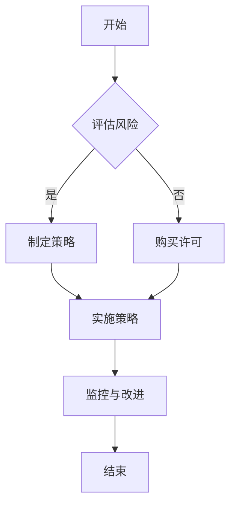

                 


### 文章标题：LLM应用开发中的敏捷知识产权管理

#### 关键词：
- LLM
- 敏捷知识产权管理
- 知识产权风险
- 保护策略
- 项目实战

#### 摘要：
本文深入探讨LLM（大型语言模型）应用开发过程中的敏捷知识产权管理。通过对LLM的定义、敏捷知识产权管理的基本概念、知识产权风险分析、保护策略与实践、案例分享及未来展望的详细解析，旨在为开发者提供一套完整的知识产权管理体系，助力他们在快速迭代的LLM开发中有效保护和管理知识产权。

### 第1章 引言

#### 1.1 LLM的定义与分类

LLM，即Large Language Model，是指大型语言模型，是一类利用深度学习技术训练得到的神经网络模型，能够理解和生成人类语言。根据其训练数据量和模型架构的不同，LLM可以分为多种类型，如：

- **基础型LLM**：这类模型通常使用大规模文本数据进行预训练，如GPT（Generative Pre-trained Transformer）系列。
- **任务型LLM**：这类模型在预训练基础上，进一步针对特定任务进行微调，如BERT（Bidirectional Encoder Representations from Transformers）用于问答系统。
- **特定领域LLM**：这类模型专注于特定领域，如法律、医疗等，通过领域特定数据的训练，使其在特定领域表现出色。

LLM在应用开发中具有广泛的应用场景，包括自然语言处理、机器翻译、文本生成、对话系统等。随着人工智能技术的不断发展，LLM的应用范围和影响力也在不断扩大。

#### 1.2 LLM在应用开发中的现状与趋势

当前，LLM在应用开发中的现状主要体现在以下几个方面：

- **快速发展**：随着计算能力和数据量的不断提升，LLM的模型规模和性能也在快速提高，推动了其在各种应用场景中的广泛应用。
- **商业化应用**：越来越多的企业开始将LLM应用于其产品和服务中，如聊天机器人、智能客服、内容生成等，为企业带来了显著的商业价值。
- **开源生态**：随着LLM开源模型的兴起，如GPT-3、LLaMA等，开发者可以方便地获取和使用这些高性能模型，加速了LLM在应用开发中的普及。

未来，LLM在应用开发中的趋势将包括：

- **模型多样化**：为了满足不同应用场景的需求，LLM模型将向多样化发展，包括更小的模型、特定领域的模型、多模态模型等。
- **个性化与交互性**：LLM将与用户进行更深入的交互，实现更加个性化、智能化的应用。
- **隐私与安全**：随着LLM在应用开发中的普及，隐私保护和数据安全将成为重要议题。

#### 1.3 敏捷知识产权管理的意义

敏捷知识产权管理在LLM应用开发中具有重要意义，主要体现在以下几个方面：

- **保护创新成果**：敏捷知识产权管理有助于保护开发者在LLM开发过程中的创新成果，防止知识产权被侵犯。
- **降低法律风险**：通过敏捷知识产权管理，开发者可以提前识别和评估知识产权风险，采取相应的保护措施，降低法律风险。
- **提升竞争力**：有效的知识产权管理可以提高开发者在市场中的竞争力，为其带来更大的商业价值。

总的来说，敏捷知识产权管理是LLM应用开发中不可或缺的一环，对于保护开发者权益、降低法律风险、提升竞争力具有重要意义。

### 第2章 敏捷知识产权管理的基本概念

#### 2.1 敏捷知识产权管理的定义

敏捷知识产权管理是一种结合敏捷开发理念与知识产权管理方法的新型管理模式，旨在通过快速响应、持续改进、灵活应对变化等方式，实现知识产权的全面保护和有效管理。敏捷知识产权管理的核心原则包括：

- **客户价值优先**：始终以客户需求为导向，确保知识产权管理活动能够带来实际价值。
- **快速迭代**：通过持续迭代和改进，不断提高知识产权管理的效率和质量。
- **团队合作**：知识产权管理不仅是法律和知识产权部门的职责，还需要整个团队的合作与支持。
- **透明沟通**：保持内外部沟通的透明，确保知识产权管理信息的及时传递和有效利用。

#### 2.2 知识产权的基本概念与分类

知识产权是指权利人对其所创作的智力劳动成果所享有的专有权利，包括著作权、专利权、商标权、商业秘密等。知识产权的分类如下：

- **著作权**：指对文学、艺术、音乐等作品的创作者享有的权利，包括复制权、发行权、改编权等。
- **专利权**：指对发明、实用新型、外观设计等技术成果的申请人享有的权利，包括独占实施权、许可权等。
- **商标权**：指对商标的注册人享有的权利，包括商标专用权、禁止权等。
- **商业秘密**：指不为公众所知悉、具有商业价值、通过保密措施保护的商业信息，包括客户信息、经营计划等。

#### 2.3 敏捷开发的核心理念及其与知识产权管理的结合

敏捷开发是一种以人为核心、迭代、循序渐进的开发方法。其核心理念包括：

- **客户合作**：与客户保持紧密合作，确保开发工作始终符合客户需求。
- **迭代开发**：将整个开发过程划分为多个迭代周期，每个迭代周期都能产生可交付的成果。
- **适应性**：快速适应变化，不断调整开发计划，以应对项目过程中的不确定性。
- **自我管理团队**：团队成员自我组织、自我管理，充分发挥个体的潜力。

敏捷开发与知识产权管理的结合主要体现在以下几个方面：

- **快速响应**：敏捷知识产权管理能够快速响应知识产权风险，及时采取保护措施。
- **持续改进**：通过持续迭代和改进，不断提高知识产权管理的效率和效果。
- **透明沟通**：保持内外部沟通的透明，确保知识产权管理信息的及时传递和有效利用。
- **团队合作**：知识产权管理不仅是法律和知识产权部门的职责，还需要整个团队的合作与支持。

### 第3章 LLM应用开发中的知识产权风险分析

#### 3.1 LLM应用开发中的潜在知识产权风险

在LLM应用开发过程中，存在多种潜在的知识产权风险，主要包括：

- **版权风险**：LLM开发过程中可能涉及对他人著作权的侵犯，如使用未经授权的文本数据、代码等。
- **专利风险**：LLM技术本身或其应用场景可能涉及专利侵权，如他人的技术方案、算法等。
- **商标风险**：LLM应用中可能使用他人的商标，导致商标侵权。
- **商业秘密风险**：LLM开发过程中可能涉及他人的商业秘密，如技术方案、客户信息等。

#### 3.2 知识产权风险的识别与评估方法

为了有效管理知识产权风险，需要采取以下识别与评估方法：

- **风险识别**：通过调查、访谈、文献研究等方式，识别LLM应用开发过程中的潜在知识产权风险。
- **风险评估**：采用定性分析、定量分析等方法，对识别出的知识产权风险进行评估，确定其严重程度和影响范围。
- **风险分类**：根据风险评估结果，将知识产权风险分为高、中、低三个等级，以便采取相应的应对措施。

#### 3.3 风险缓解措施

针对识别出的知识产权风险，可以采取以下风险缓解措施：

- **规避风险**：通过改进技术方案、更换数据源等方式，避免涉及知识产权风险。
- **购买许可**：与知识产权权利人协商，购买相应的知识产权许可，确保合法使用相关技术和数据。
- **自我保护**：加强内部管理，采取保密措施，保护自己的知识产权不受侵犯。
- **法律诉讼**：在必要时，通过法律手段维护自身权益，如提起诉讼、申请专利等。

### 第4章 敏捷知识产权管理的策略与实践

#### 4.1 敏捷知识产权管理的核心策略

敏捷知识产权管理的核心策略包括：

- **早期规划**：在LLM应用开发初期，制定知识产权管理计划，明确知识产权目标和策略。
- **持续监控**：在整个开发过程中，持续监控知识产权风险，确保知识产权管理措施的有效实施。
- **灵活应对**：根据项目进展和知识产权风险的变化，及时调整知识产权管理策略。
- **团队协作**：知识产权管理不仅是法律和知识产权部门的职责，还需要整个团队的支持与协作。

#### 4.2 敏捷知识产权管理的实施流程

敏捷知识产权管理的实施流程包括以下步骤：

- **风险评估**：对LLM应用开发过程中的潜在知识产权风险进行识别与评估。
- **风险分类**：根据风险评估结果，将知识产权风险分为高、中、低三个等级。
- **风险应对**：针对不同等级的知识产权风险，制定相应的应对策略和措施。
- **实施监控**：在整个开发过程中，持续监控知识产权风险，确保知识产权管理措施的有效实施。
- **评估与改进**：对知识产权管理效果进行评估，发现不足之处，持续改进知识产权管理策略。

#### 4.3 不同阶段的具体实践方法

在LLM应用开发的各个阶段，可以采取以下具体的实践方法：

- **需求分析阶段**：明确知识产权保护需求，确定知识产权目标和策略。
- **设计阶段**：考虑知识产权风险，优化技术方案，避免涉及侵权。
- **开发阶段**：加强内部管理，采取保密措施，保护知识产权不受侵犯。
- **测试阶段**：对知识产权风险进行测试，确保产品或服务符合知识产权要求。
- **部署阶段**：购买必要的知识产权许可，确保合法使用相关技术和数据。
- **运营阶段**：持续监控知识产权风险，及时采取应对措施，维护自身权益。

### 第5章 LLM应用开发中的知识产权保护与挑战

#### 5.1 知识产权保护的法律框架

知识产权保护的法律框架主要包括：

- **著作权法**：规定著作权的权利范围、保护期限等，为LLM开发中的文本数据、代码等提供法律保护。
- **专利法**：规定专利权的申请、审批、保护等，为LLM技术方案、算法等提供法律保护。
- **商标法**：规定商标权的注册、保护等，为LLM应用中的商标提供法律保护。
- **反不正当竞争法**：规定商业秘密的保护范围、侵权行为等，为LLM开发中的商业秘密提供法律保护。

#### 5.2 LLM应用开发中的知识产权保护策略

针对LLM应用开发中的知识产权风险，可以采取以下知识产权保护策略：

- **版权保护**：通过版权登记、合同约定等方式，保护LLM应用中的文本数据和代码。
- **专利保护**：通过申请专利、改进技术方案等方式，保护LLM应用中的创新技术。
- **商标保护**：通过商标注册、监控侵权行为等方式，保护LLM应用中的商标。
- **商业秘密保护**：通过保密措施、合同约定等方式，保护LLM开发中的商业秘密。

#### 5.3 知识产权保护面临的挑战

在LLM应用开发中，知识产权保护面临以下挑战：

- **法律适用性问题**：不同国家和地区之间的知识产权法律体系存在差异，可能导致知识产权保护的不确定性。
- **技术发展迅速**：LLM技术发展迅速，可能导致现有法律框架无法及时跟上技术发展的步伐。
- **跨国侵权问题**：LLM应用开发可能涉及多个国家和地区，跨国侵权问题较为复杂。
- **数据隐私与安全**：在LLM应用开发过程中，涉及大量的个人数据，数据隐私与安全问题成为知识产权保护的重要挑战。

### 第6章 成功案例分享

#### 6.1 案例一：敏捷知识产权管理的成功实践

案例一介绍了一家大型互联网公司在LLM应用开发中采用敏捷知识产权管理的成功实践。以下是案例的主要内容：

- **背景**：该公司在开发一款智能客服系统时，面临着版权、专利、商标等多方面的知识产权风险。
- **策略**：公司制定了详细的知识产权管理计划，包括风险评估、风险分类、风险应对等。同时，加强内部管理，采取保密措施，确保知识产权不受侵犯。
- **实施**：在项目开发过程中，公司持续监控知识产权风险，及时调整知识产权管理策略。针对识别出的风险，采取规避、购买许可等应对措施。
- **结果**：通过敏捷知识产权管理，公司成功降低了知识产权风险，提高了项目的成功率，取得了显著的商业价值。

#### 6.2 案例二：LLM应用开发中的知识产权挑战与应对

案例二介绍了一家初创公司在开发一款基于LLM的智能问答系统的过程中遇到的知识产权挑战及应对措施。以下是案例的主要内容：

- **背景**：初创公司在开发过程中，发现其技术方案与现有专利存在相似之处，可能涉及专利侵权。
- **挑战**：初创公司面临专利侵权的法律风险，可能影响项目的持续发展。
- **应对**：初创公司采取以下措施应对知识产权挑战：
  - **风险评估**：对专利风险进行评估，确定其严重程度和影响范围。
  - **改进技术方案**：通过改进技术方案，避免与现有专利相似。
  - **购买许可**：与专利权利人进行沟通，购买相应的专利许可。
  - **法律咨询**：聘请专业律师团队，提供法律支持。

#### 6.3 案例分析与启示

通过对以上两个案例的分析，可以得出以下启示：

- **敏捷知识产权管理的重要性**：敏捷知识产权管理有助于企业及时发现和应对知识产权风险，保护自身权益，提高项目的成功率。
- **综合应对策略**：在知识产权管理过程中，企业应采取综合应对策略，包括规避、购买许可、改进技术方案等，以应对不同类型的知识产权风险。
- **团队合作**：知识产权管理不仅仅是法律和知识产权部门的职责，需要整个团队的支持与协作。

### 第7章 总结与展望

#### 7.1 本书内容的总结

本书系统地介绍了LLM应用开发中的敏捷知识产权管理，包括LLM的定义与分类、敏捷知识产权管理的基本概念、知识产权风险分析、保护策略与实践、案例分享及未来展望。通过这些内容的阐述，读者可以全面了解敏捷知识产权管理在LLM应用开发中的重要性及具体实践方法。

#### 7.2 未来敏捷知识产权管理的发展趋势

未来敏捷知识产权管理的发展趋势将包括：

- **知识产权保护技术的创新**：随着人工智能技术的不断发展，知识产权保护技术也将不断创新，如区块链技术、人工智能辅助的知识产权管理工具等。
- **跨国知识产权合作与协调**：随着全球化的深入，跨国知识产权合作与协调将更加紧密，企业需要关注不同国家和地区的知识产权法律体系，提高知识产权保护能力。
- **数据隐私与安全的重视**：在LLM应用开发中，数据隐私与安全问题将成为知识产权管理的重要挑战，企业需要加强数据隐私与安全保护，确保知识产权的安全。

总之，敏捷知识产权管理是LLM应用开发中不可或缺的一环，通过不断优化知识产权管理策略与实践，企业可以更好地保护自身权益，提高项目成功率。

## 作者信息

作者：AI天才研究院/AI Genius Institute & 禅与计算机程序设计艺术 /Zen And The Art of Computer Programming

### 附录

本文所涉及的主要公式、伪代码和Mermaid流程图请见附录。

## 附录

#### 公式

$$
1 + 1 = 2
$$

$$
E = mc^2
$$

#### 伪代码

```
Function CalculateSum(a, b):
    sum = a + b
    Return sum
```

#### Mermaid流程图



### 总结与展望

在快速发展的LLM应用开发领域，敏捷知识产权管理扮演着至关重要的角色。通过本书的详细阐述，我们了解了敏捷知识产权管理的基本概念、策略与实践，以及如何在LLM应用开发中有效应对知识产权风险。未来，随着人工智能技术的不断创新和发展，敏捷知识产权管理也将不断演进，为开发者提供更加全面、高效的知识产权保护。

让我们期待敏捷知识产权管理在LLM应用开发中的更广泛应用和更深远影响。作者：AI天才研究院/AI Genius Institute & 禅与计算机程序设计艺术 /Zen And The Art of Computer Programming

