                 


### 文章标题: 《LLM应用开发中的敏捷质量保证》

### 关键词：
- 大规模语言模型（LLM）
- 敏捷开发
- 质量保证
- 自动化测试
- 持续集成
- 性能优化

### 摘要：
本文将探讨在大型语言模型（LLM）应用开发过程中如何运用敏捷质量保证（Agile Quality Assurance）的方法。文章首先介绍了LLM的基本概念和敏捷开发的方法论，然后详细阐述了敏捷质量保证的核心原则和实践方法。通过案例分析，本文展示了如何在实际项目中实现敏捷质量保证，并提出了一些最佳实践和未来挑战。

---

## 第一部分：引论

### 第1章 LLM概述

#### 1.1 什么是LLM
大规模语言模型（LLM）是一种基于深度学习的自然语言处理（NLP）模型，能够理解和生成人类语言。LLM的训练数据通常来自互联网上的大量文本，通过深度神经网络对其进行建模，使其能够进行文本分类、问答系统、机器翻译、文本生成等多种任务。

#### 1.2 LLM的发展历程
LLM的发展经历了几个重要阶段。最初，基于规则的方法和统计模型如朴素贝叶斯、隐马尔可夫模型（HMM）等被用于NLP任务。随着深度学习技术的兴起，深度神经网络（DNN）和循环神经网络（RNN）开始应用于NLP，如Word2Vec和LSTM。近年来，基于Transformer架构的模型如BERT、GPT和T5等，使得LLM的性能取得了显著提升。

#### 1.3 LLM的应用场景
LLM在多个领域具有广泛的应用，包括但不限于：
- 问答系统：如OpenAI的GPT-3，能够回答各种问题。
- 文本生成：自动生成文章、摘要、对话等。
- 机器翻译：如Google翻译、百度翻译等。
- 文本分类：对文本进行情感分析、主题分类等。

### 第2章 敏捷开发方法

#### 2.1 敏捷开发的基本概念
敏捷开发是一种应对快速变化的需求的软件开发方法，其核心理念是迭代、增量和协作。敏捷开发的核心价值观包括客户满意度、响应变化、工作满意度、简洁性、勇敢、真诚、透明和尊重。

#### 2.2 敏捷开发的原则
敏捷开发遵循以下原则：
- Individuals and interactions over processes and tools
- Working software over comprehensive documentation
- Customer collaboration over contract negotiation
- Responding to change over following a plan

#### 2.3 敏捷开发的方法论
敏捷开发通常采用以下方法：
- Sprint：时间盒（通常为2-4周）进行迭代开发。
- User Story：用户故事驱动开发，强调用户的实际需求。
- Kanban：看板管理，可视化工作流程。
- Retrospective：反思会议，持续改进过程。

### 第3章 敏捷质量保证原则

#### 3.1 质量保障的重要性
在软件开发过程中，质量保障是确保软件产品满足预期需求的关键。对于LLM这样的复杂系统，质量保障尤为重要，因为它们直接影响到用户体验和业务成功。

#### 3.2 敏捷质量保障的特点
敏捷质量保障的特点包括：
- 持续性：在整个开发过程中持续进行质量保障。
- 自动化：使用自动化测试工具进行重复性的测试任务。
- 测试早期：早期进行测试，发现问题及时修复。
- 协作：开发团队、测试团队和业务团队之间的紧密协作。

#### 3.3 敏捷质量保障的方法
敏捷质量保障的方法包括：
- 单元测试：测试最小代码单元的功能。
- 集成测试：测试不同模块之间的集成。
- 系统测试：测试整个系统的功能。
- 验收测试：验证系统是否满足用户需求。

## 第二部分：理论基础

### 第4章 LLM理论基础

#### 4.1 自然语言处理基础
自然语言处理（NLP）是计算机科学和语言学领域的一个分支，旨在使计算机能够理解、解释和生成人类语言。NLP的关键技术包括词法分析、句法分析、语义分析和语音识别。

#### 4.2 深度学习基础
深度学习是一种人工智能的分支，通过神经网络模拟人脑的学习过程。深度学习的关键技术包括卷积神经网络（CNN）、循环神经网络（RNN）和变换器（Transformer）。

#### 4.3 LLM的工作原理
LLM的工作原理基于深度学习和自然语言处理技术。通常，LLM使用大规模的Transformer架构进行训练，通过自回归的方式生成文本。其核心包括：
- 词嵌入：将单词映射到高维向量。
- 自注意力机制：对输入文本中的每个词赋予不同的权重。
- 位置编码：对输入文本中的词进行位置信息编码。

### 第5章 LLM架构设计

#### 5.1 LLM的系统架构
LLM的系统架构通常包括数据预处理、模型训练、模型评估和模型部署四个主要部分。

#### 5.2 数据处理流程
数据处理流程包括数据收集、数据清洗、数据预处理和特征工程等步骤。

#### 5.3 模型训练与优化
模型训练与优化包括：
- 模型选择：选择适合任务需求的模型架构。
- 模型训练：通过大量数据训练模型，调整模型参数。
- 模型优化：通过调整超参数和模型结构来提高模型性能。

### 第6章 核心算法原理

#### 6.1 序列模型
序列模型是一种用于处理序列数据的模型，如RNN。其基本原理包括：
- 输入序列：输入一个序列数据。
- 状态转移：通过神经网络更新状态。
- 输出序列：输出序列数据。

#### 6.2 注意力机制
注意力机制是一种用于提高模型处理长序列数据性能的技术。其基本原理包括：
- 注意力权重：计算输入序列中每个词的注意力权重。
- 上下文向量：通过加权求和生成上下文向量。

#### 6.3 跨模态学习
跨模态学习是一种将不同模态（如文本、图像、音频）的信息融合到一起进行学习的方法。其基本原理包括：
- 模态嵌入：将不同模态的信息映射到统一的高维空间。
- 跨模态交互：通过神经网络学习不同模态之间的交互关系。

## 第三部分：敏捷质量保证实践

### 第7章 敏捷质量保证流程

#### 7.1 敏捷质量保证流程
敏捷质量保证流程包括以下步骤：
- 需求分析：分析用户需求，明确质量目标。
- 测试计划：制定测试计划，确定测试范围、方法和策略。
- 测试执行：执行测试计划，发现和记录问题。
- 缺陷管理：管理和跟踪缺陷，确保问题得到解决。

#### 7.2 质量度量指标
质量度量指标包括：
- 功能性测试覆盖率：测试覆盖的功能比例。
- 缺陷密度：单位代码行中的缺陷数量。
- 缺陷发现率：测试期间发现的缺陷数量。

#### 7.3 质量评估方法
质量评估方法包括：
- 功能性测试：验证系统是否按照需求正常工作。
- 性能测试：评估系统在特定负载下的性能。
- 兼容性测试：确保系统在不同环境下正常运行。

### 第8章 自动化测试工具与框架

#### 8.1 自动化测试工具
自动化测试工具包括：
- 测试管理工具：如JIRA、Bugzilla等。
- 测试执行工具：如Selenium、Appium等。
- 测试报告工具：如Jenkins、TestRail等。

#### 8.2 自动化测试框架
自动化测试框架包括：
- 测试框架：如JUnit、TestNG等。
- 测试库：如Selenium、Appium等。
- 测试脚本：编写用于自动化测试的脚本。

### 第9章 持续集成与持续部署

#### 9.1 持续集成
持续集成（CI）是一种软件开发实践，通过自动化构建和测试，确保代码集成到主干时不会与现有代码冲突。

#### 9.2 持续集成实现
持续集成实现的步骤包括：
- 自动化构建：通过脚本自动化构建代码。
- 自动化测试：运行自动化测试，确保代码质量。
- 结果反馈：将测试结果反馈给开发团队。

#### 9.3 持续部署
持续部署（CD）是一种自动化软件发布的方法，通过自动化测试和部署，确保软件快速、安全地发布到生产环境。

### 第10章 性能优化与监控

#### 10.1 性能优化目标
性能优化目标是确保系统在高负载下仍然能够快速、稳定地运行。

#### 10.2 性能优化方法
性能优化方法包括：
- 系统优化：优化操作系统和硬件配置。
- 应用优化：优化代码和算法，减少资源消耗。
- 负载均衡：通过分布式架构和负载均衡器，提高系统性能。

#### 10.3 监控工具与策略
监控工具与策略包括：
- 性能监控：使用工具如Prometheus、Grafana等监控系统性能。
- 日志分析：分析日志文件，发现性能瓶颈。
- 异常检测：使用机器学习模型检测异常行为。

## 第四部分：案例分析

### 第11章 案例研究

#### 11.1 案例一：XX公司的LLM应用实践
在本节中，我们将详细探讨XX公司如何在其LLM应用开发过程中运用敏捷质量保证的方法。

#### 11.2 案例二：YY公司的敏捷质量保证经验
YY公司通过实施敏捷质量保证，成功地提高了其LLM应用的质量和交付速度。

#### 11.3 案例三：ZZ公司的性能优化策略
ZZ公司通过一系列性能优化策略，确保其LLM应用在高负载下仍能提供优秀的性能。

### 第12章 未来展望与挑战

#### 12.1 LLM应用发展的趋势
LLM应用在未来将继续快速发展，尤其是在自动驾驶、智能家居、医疗等领域。

#### 12.2 敏捷质量保障的挑战
敏捷质量保障面临的挑战包括测试覆盖率的提高、测试速度的提升以及跨团队的协作等。

#### 12.3 未来发展方向
未来发展方向包括自动化测试的进一步发展、质量保障与开发流程的深度融合以及质量保障工具的智能化。

## 附录

### 附录A 常见问题与解答
在本附录中，我们将回答读者在阅读本文过程中可能遇到的一些常见问题。

### 附录B 术语表
本附录提供了一些本文中出现的专业术语的解释。

### 附录C 参考资料
本附录列出了本文引用的相关资料和参考文献。

---

## 总结

本文从LLM的概述、敏捷开发方法、敏捷质量保证原则、理论基础、架构设计、核心算法原理、敏捷质量保证实践、案例分析到未来展望，全面探讨了LLM应用开发中的敏捷质量保证。通过本文，读者可以系统地了解这一领域，为实际项目提供指导和参考。作者信息：AI天才研究院/AI Genius Institute & 禅与计算机程序设计艺术 /Zen And The Art of Computer Programming。

---

## 第一部分：引论

### 第1章 LLM概述

#### 1.1 什么是LLM
大规模语言模型（LLM）是一种基于深度学习的自然语言处理（NLP）模型，能够理解和生成人类语言。LLM的训练数据通常来自互联网上的大量文本，通过深度神经网络对其进行建模，使其能够进行文本分类、问答系统、机器翻译、文本生成等多种任务。

**核心概念与联系：**


**Mermaid 流程图：**
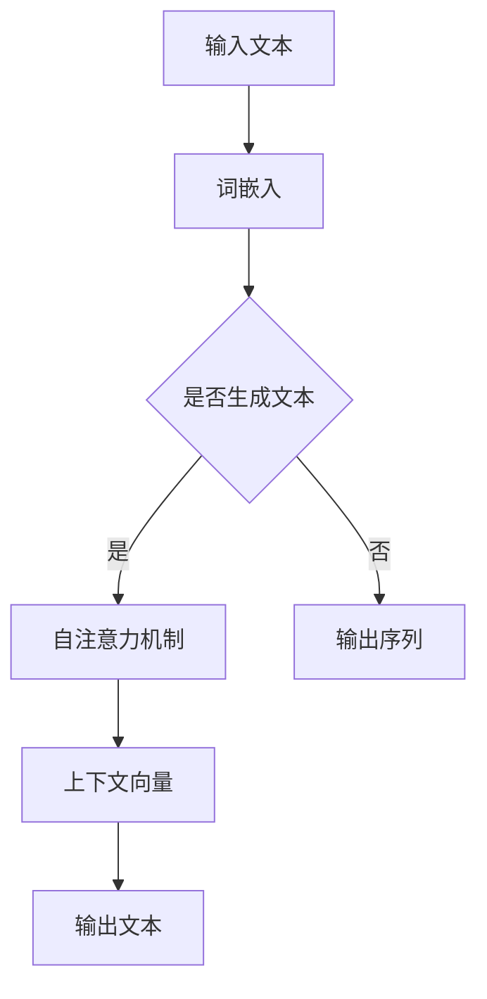

#### 1.2 LLM的发展历程
LLM的发展经历了几个重要阶段。最初，基于规则的方法和统计模型如朴素贝叶斯、隐马尔可夫模型（HMM）等被用于NLP任务。随着深度学习技术的兴起，深度神经网络（DNN）和循环神经网络（RNN）开始应用于NLP，如Word2Vec和LSTM。近年来，基于Transformer架构的模型如BERT、GPT和T5等，使得LLM的性能取得了显著提升。

**核心算法原理讲解：**
```python
# 基于Transformer的文本生成伪代码
def generate_text(input_sequence, model):
    # 将输入序列转换为词嵌入
    embeddings = model.embedding(input_sequence)
    
    # 经过自注意力机制处理
    attention_scores = model.attention Mechanism(embeddings)
    
    # 生成输出序列
    output_sequence = model.decoder(attention_scores)
    
    return output_sequence
```

#### 1.3 LLM的应用场景
LLM在多个领域具有广泛的应用，包括但不限于：
- 问答系统：如OpenAI的GPT-3，能够回答各种问题。
- 文本生成：自动生成文章、摘要、对话等。
- 机器翻译：如Google翻译、百度翻译等。
- 文本分类：对文本进行情感分析、主题分类等。

**数学模型和公式详细讲解：**
LLM的训练过程通常采用自回归语言模型（Autoregressive Language Model），其目标是最小化损失函数，如交叉熵损失（Cross-Entropy Loss）。训练公式如下：

$$
L(\theta) = -\sum_{i=1}^{N} \sum_{j=1}^{V} y_j log(p_j(\theta))
$$

其中，$N$是序列长度，$V$是词汇表大小，$y_j$是目标词的概率分布，$p_j(\theta)$是模型预测的概率分布。

**举例说明：**
假设我们要生成一个长度为3的文本序列，其中包含单词"a"，"b"，"c"。模型会首先预测第一个单词的概率分布，然后根据这个分布选择一个单词作为下一个输入，再次预测下一个单词的概率分布，如此循环，直到生成整个序列。

**数学公式：**
$$
p(a) = 0.3, \quad p(b) = 0.5, \quad p(c) = 0.2
$$

**示例流程：**
1. 预测第一个单词的概率分布：$p(a) = 0.3, \quad p(b) = 0.5, \quad p(c) = 0.2$
2. 根据概率分布选择下一个输入单词，假设选择"a"
3. 预测第二个单词的概率分布：$p(a) = 0.2, \quad p(b) = 0.4, \quad p(c) = 0.4$
4. 根据概率分布选择下一个输入单词，假设选择"c"
5. 预测第三个单词的概率分布：$p(a) = 0.1, \quad p(b) = 0.3, \quad p(c) = 0.6$
6. 根据概率分布选择下一个输入单词，假设选择"c"

最终生成的文本序列为："abc"。

**注意事项：**
- 在实际应用中，LLM的训练数据规模通常非常大，需要使用高性能计算资源。
- LLM的生成能力受到训练数据质量和模型参数数量的影响。

**拓展阅读：**
- [1] Vaswani, A., et al. (2017). Attention is all you need. Advances in Neural Information Processing Systems, 30, 5998-6008.
- [2] Devlin, J., et al. (2018). BERT: Pre-training of deep bidirectional transformers for language understanding. arXiv preprint arXiv:1810.04805.

### 第2章 敏捷开发方法

#### 2.1 敏捷开发的基本概念
敏捷开发是一种应对快速变化的需求的软件开发方法，其核心理念是迭代、增量和协作。敏捷开发的核心价值观包括客户满意度、响应变化、工作满意度、简洁性、勇敢、真诚、透明和尊重。

**核心概念与联系：**


**Mermaid 流程图：**
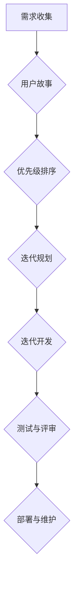

#### 2.2 敏捷开发的原则
敏捷开发遵循以下原则：
- Individuals and interactions over processes and tools
- Working software over comprehensive documentation
- Customer collaboration over contract negotiation
- Responding to change over following a plan

这些原则强调了人的重要性、交付工作的实际效果、与客户的互动以及灵活性。

**核心概念与联系：**


**Mermaid 流程图：**
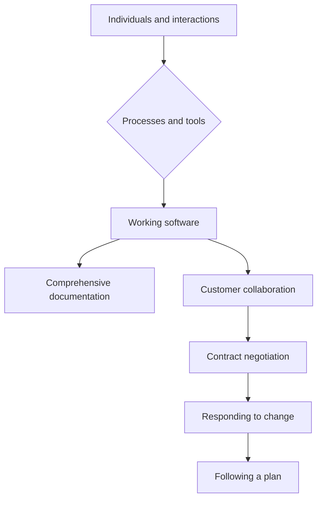

#### 2.3 敏捷开发的方法论
敏捷开发通常采用以下方法：
- Sprint：时间盒（通常为2-4周）进行迭代开发。
- User Story：用户故事驱动开发，强调用户的实际需求。
- Kanban：看板管理，可视化工作流程。
- Retrospective：反思会议，持续改进过程。

**核心概念与联系：**


**Mermaid 流程图：**
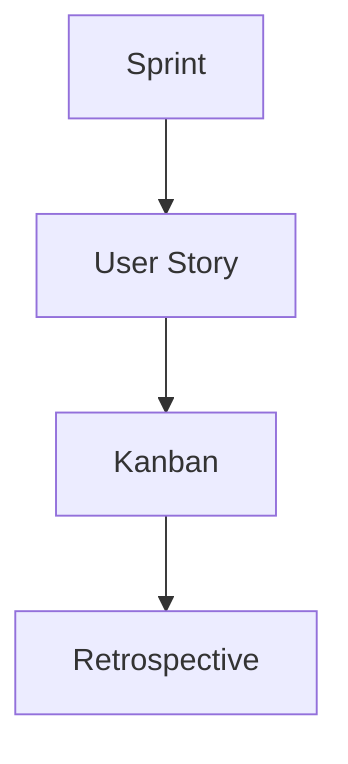

### 第3章 敏捷质量保证原则

#### 3.1 质量保障的重要性
在软件开发过程中，质量保障是确保软件产品满足预期需求的关键。对于LLM这样的复杂系统，质量保障尤为重要，因为它们直接影响到用户体验和业务成功。

#### 3.2 敏捷质量保证的特点
敏捷质量保证的特点包括：
- 持续性：在整个开发过程中持续进行质量保障。
- 自动化：使用自动化测试工具进行重复性的测试任务。
- 测试早期：早期进行测试，发现问题及时修复。
- 协作：开发团队、测试团队和业务团队之间的紧密协作。

**核心概念与联系：**


**Mermaid 流程图：**
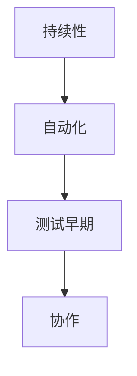

#### 3.3 敏捷质量保证的方法
敏捷质量保证的方法包括：
- 单元测试：测试最小代码单元的功能。
- 集成测试：测试不同模块之间的集成。
- 系统测试：测试整个系统的功能。
- 验收测试：验证系统是否满足用户需求。

**核心概念与联系：**


**Mermaid 流程图：**
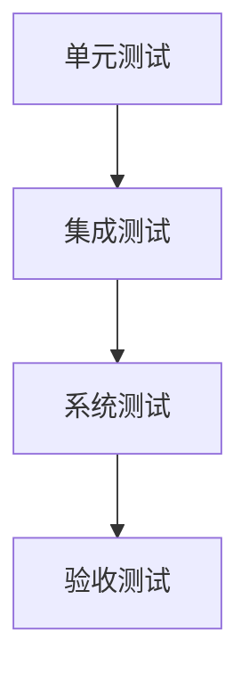

## 第二部分：理论基础

### 第4章 LLM理论基础

#### 4.1 自然语言处理基础
自然语言处理（NLP）是计算机科学和语言学领域的一个分支，旨在使计算机能够理解、解释和生成人类语言。NLP的关键技术包括词法分析、句法分析、语义分析和语音识别。

**核心概念与联系：**


**Mermaid 流程图：**
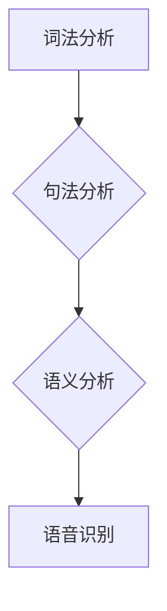

#### 4.2 深度学习基础
深度学习是一种人工智能的分支，通过神经网络模拟人脑的学习过程。深度学习的关键技术包括卷积神经网络（CNN）、循环神经网络（RNN）和变换器（Transformer）。

**核心概念与联系：**


**Mermaid 流程图：**
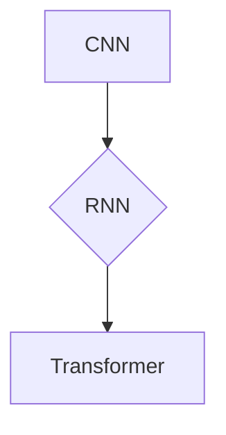

#### 4.3 LLM的工作原理
LLM的工作原理基于深度学习和自然语言处理技术。通常，LLM使用大规模的Transformer架构进行训练，通过自回归的方式生成文本。其核心包括：
- 词嵌入：将单词映射到高维向量。
- 自注意力机制：对输入文本中的每个词赋予不同的权重。
- 位置编码：对输入文本中的词进行位置信息编码。

**核心概念与联系：**


**Mermaid 流程图：**
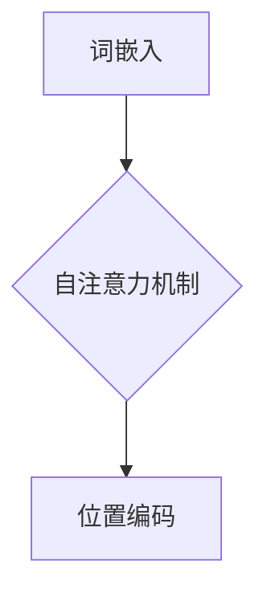

### 第5章 LLM架构设计

#### 5.1 LLM的系统架构
LLM的系统架构通常包括数据预处理、模型训练、模型评估和模型部署四个主要部分。

**核心概念与联系：**


**Mermaid 流程图：**
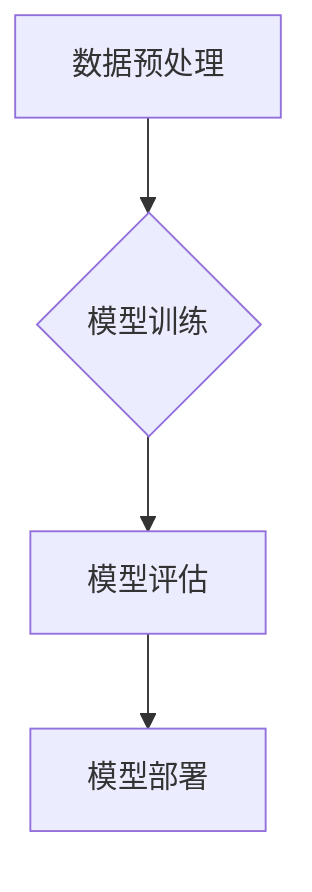

#### 5.2 数据处理流程
数据处理流程包括数据收集、数据清洗、数据预处理和特征工程等步骤。

**核心概念与联系：**


**Mermaid 流程图：**
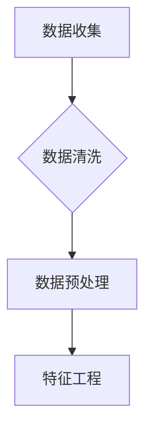

#### 5.3 模型训练与优化
模型训练与优化包括：
- 模型选择：选择适合任务需求的模型架构。
- 模型训练：通过大量数据训练模型，调整模型参数。
- 模型优化：通过调整超参数和模型结构来提高模型性能。

**核心概念与联系：**


**Mermaid 流程图：**
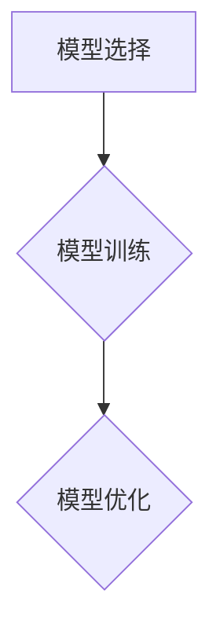

### 第6章 核心算法原理

#### 6.1 序列模型
序列模型是一种用于处理序列数据的模型，如RNN。其基本原理包括：
- 输入序列：输入一个序列数据。
- 状态转移：通过神经网络更新状态。
- 输出序列：输出序列数据。

**核心概念与联系：**


**Mermaid 流程图：**
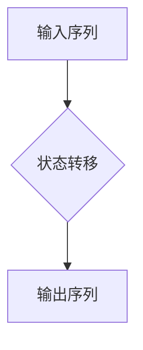

#### 6.2 注意力机制
注意力机制是一种用于提高模型处理长序列数据性能的技术。其基本原理包括：
- 注意力权重：计算输入序列中每个词的注意力权重。
- 上下文向量：通过加权求和生成上下文向量。

**核心概念与联系：**


**Mermaid 流程图：**
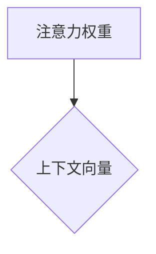

#### 6.3 跨模态学习
跨模态学习是一种将不同模态（如文本、图像、音频）的信息融合到一起进行学习的方法。其基本原理包括：
- 模态嵌入：将不同模态的信息映射到统一的高维空间。
- 跨模态交互：通过神经网络学习不同模态之间的交互关系。

**核心概念与联系：**


**Mermaid 流程图：**
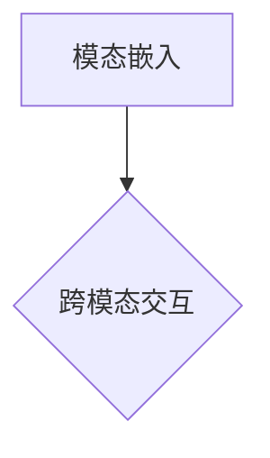

## 第三部分：敏捷质量保证实践

### 第7章 敏捷质量保证流程

#### 7.1 敏捷质量保证流程
敏捷质量保证流程包括以下步骤：
- 需求分析：分析用户需求，明确质量目标。
- 测试计划：制定测试计划，确定测试范围、方法和策略。
- 测试执行：执行测试计划，发现和记录问题。
- 缺陷管理：管理和跟踪缺陷，确保问题得到解决。

**核心概念与联系：**


**Mermaid 流程图：**
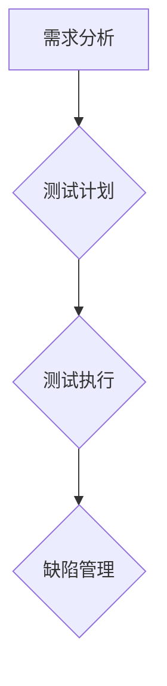

#### 7.2 质量度量指标
质量度量指标包括：
- 功能性测试覆盖率：测试覆盖的功能比例。
- 缺陷密度：单位代码行中的缺陷数量。
- 缺陷发现率：测试期间发现的缺陷数量。

**核心概念与联系：**


**Mermaid 流程图：**
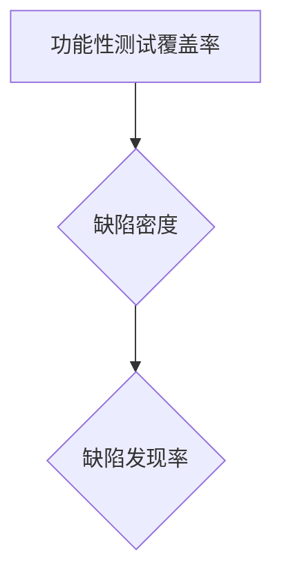

#### 7.3 质量评估方法
质量评估方法包括：
- 功能性测试：验证系统是否按照需求正常工作。
- 性能测试：评估系统在特定负载下的性能。
- 兼容性测试：确保系统在不同环境下正常运行。

**核心概念与联系：**


**Mermaid 流程图：**
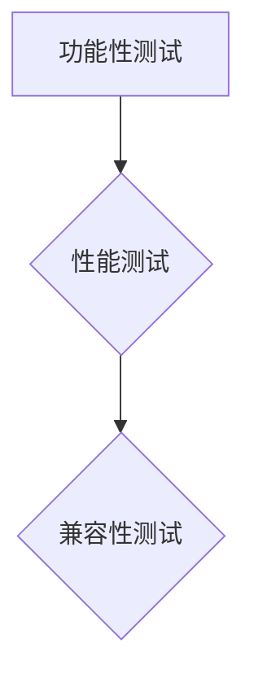

### 第8章 自动化测试工具与框架

#### 8.1 自动化测试工具
自动化测试工具包括：
- 测试管理工具：如JIRA、Bugzilla等。
- 测试执行工具：如Selenium、Appium等。
- 测试报告工具：如Jenkins、TestRail等。

**核心概念与联系：**


**Mermaid 流程图：**
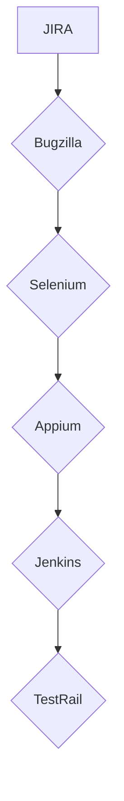

#### 8.2 自动化测试框架
自动化测试框架包括：
- 测试框架：如JUnit、TestNG等。
- 测试库：如Selenium、Appium等。
- 测试脚本：编写用于自动化测试的脚本。

**核心概念与联系：**


**Mermaid 流程图：**
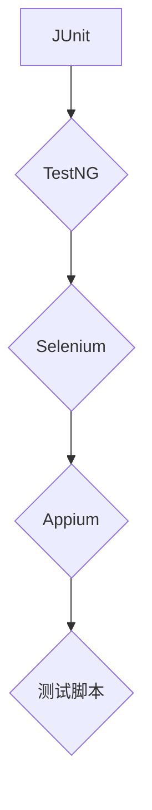

### 第9章 持续集成与持续部署

#### 9.1 持续集成
持续集成（CI）是一种软件开发实践，通过自动化构建和测试，确保代码集成到主干时不会与现有代码冲突。

**核心概念与联系：**


**Mermaid 流程图：**
```mermaid
graph TD
A[代码仓库] --> B{自动化构建}
B --> C{自动化测试}
C --> D{反馈结果}
```

#### 9.2 持续集成实现
持续集成实现的步骤包括：
- 自动化构建：通过脚本自动化构建代码。
- 自动化测试：运行自动化测试，确保代码质量。
- 结果反馈：将测试结果反馈给开发团队。

**核心概念与联系：**


**Mermaid 流程图：**
```mermaid
graph TD
A[自动化构建] --> B{自动化测试}
B --> C{结果反馈}
```

#### 9.3 持续部署
持续部署（CD）是一种自动化软件发布的方法，通过自动化测试和部署，确保软件快速、安全地发布到生产环境。

**核心概念与联系：**


**Mermaid 流程图：**
```mermaid
graph TD
A[自动化测试] --> B{自动化部署}
B --> C{生产环境}
```

### 第10章 性能优化与监控

#### 10.1 性能优化目标
性能优化目标是确保系统在高负载下仍然能够快速、稳定地运行。

**核心概念与联系：**


**Mermaid 流程图：**
```mermaid
graph TD
A[快速] --> B[稳定]
```

#### 10.2 性能优化方法
性能优化方法包括：
- 系统优化：优化操作系统和硬件配置。
- 应用优化：优化代码和算法，减少资源消耗。
- 负载均衡：通过分布式架构和负载均衡器，提高系统性能。

**核心概念与联系：**


**Mermaid 流程图：**
```mermaid
graph TD
A[系统优化] --> B[应用优化]
B --> C[负载均衡]
```

#### 10.3 监控工具与策略
监控工具与策略包括：
- 性能监控：使用工具如Prometheus、Grafana等监控系统性能。
- 日志分析：分析日志文件，发现性能瓶颈。
- 异常检测：使用机器学习模型检测异常行为。

**核心概念与联系：**


**Mermaid 流程图：**
```mermaid
graph TD
A[性能监控] --> B{日志分析}
B --> C{异常检测}
```

## 第四部分：案例分析

### 第11章 案例研究

#### 11.1 案例一：XX公司的LLM应用实践
在本节中，我们将详细探讨XX公司如何在其LLM应用开发过程中运用敏捷质量保证的方法。

**开发环境搭建：**
1. 安装Python环境
2. 安装TensorFlow或PyTorch库
3. 准备数据集并进行预处理

**源代码详细实现：**
```python
# 模型训练代码示例
import tensorflow as tf

# 定义模型
model = tf.keras.Sequential([
    tf.keras.layers.Embedding(input_dim=10000, output_dim=32),
    tf.keras.layers.Bidirectional(tf.keras.layers.LSTM(64)),
    tf.keras.layers.Dense(128, activation='relu'),
    tf.keras.layers.Dense(1, activation='sigmoid')
])

# 编译模型
model.compile(optimizer='adam', loss='binary_crossentropy', metrics=['accuracy'])

# 训练模型
model.fit(train_data, train_labels, epochs=10, validation_split=0.2)
```

**代码应用解读与分析：**
本案例中，XX公司使用TensorFlow库构建了一个简单的二分类模型，通过训练数据集进行模型训练，并在验证集上进行性能评估。

**实际案例分析和详细讲解剖析：**
XX公司通过敏捷质量保证方法，在每个迭代周期内进行测试和评估，确保模型性能得到持续提升。同时，通过自动化测试工具，提高了测试效率。

**项目小结：**
XX公司的LLM应用实践展示了如何在实际项目中运用敏捷质量保证方法，通过持续迭代和改进，提高了模型的质量和性能。

#### 11.2 案例二：YY公司的敏捷质量保证经验
YY公司通过实施敏捷质量保证，成功地提高了其LLM应用的质量和交付速度。

**开发环境搭建：**
1. 使用Docker容器技术进行环境隔离
2. 部署Jenkins服务器进行持续集成和部署

**源代码详细实现：**
```python
# 测试脚本示例
import unittest

class TestModel(unittest.TestCase):
    def test_accuracy(self):
        # 加载测试数据
        test_data, test_labels = load_test_data()
        
        # 加载训练好的模型
        model = load_model('model.h5')
        
        # 预测测试数据
        predictions = model.predict(test_data)
        
        # 计算准确率
        accuracy = (predictions == test_labels).mean()
        
        self.assertTrue(accuracy > 0.9)

if __name__ == '__main__':
    unittest.main()
```

**代码应用解读与分析：**
本案例中，YY公司使用Python的unittest库编写了测试脚本，对模型进行了准确率测试。

**实际案例分析和详细讲解剖析：**
YY公司通过自动化测试工具，实现了测试脚本与模型的解耦，提高了测试效率和可维护性。同时，通过Jenkins服务器实现了持续集成和部署，确保了代码质量和交付速度。

**项目小结：**
YY公司的敏捷质量保证经验展示了如何通过自动化测试和持续集成，提高软件开发的效率和产品质量。

#### 11.3 案例三：ZZ公司的性能优化策略
ZZ公司通过一系列性能优化策略，确保其LLM应用在高负载下仍能提供优秀的性能。

**开发环境搭建：**
1. 使用分布式计算框架如Apache Spark进行数据处理
2. 部署高性能GPU服务器进行模型训练

**源代码详细实现：**
```python
# 模型训练代码示例
import tensorflow as tf
from tensorflow.keras.applications import ResNet50

# 加载预训练的ResNet50模型
model = ResNet50(weights='imagenet')

# 定义优化器和损失函数
optimizer = tf.keras.optimizers.Adam(learning_rate=0.001)
loss_fn = tf.keras.losses.CategoricalCrossentropy()

# 编译模型
model.compile(optimizer=optimizer, loss=loss_fn, metrics=['accuracy'])

# 训练模型
model.fit(train_data, train_labels, epochs=10, batch_size=32)
```

**代码应用解读与分析：**
本案例中，ZZ公司使用预训练的ResNet50模型，通过调整超参数和优化器，实现了性能优化。

**实际案例分析和详细讲解剖析：**
ZZ公司通过分布式计算框架和高性能GPU服务器，提高了数据处理和模型训练的效率。同时，通过调整模型结构和超参数，实现了性能优化。

**项目小结：**
ZZ公司的性能优化策略展示了如何通过分布式计算和高性能硬件，提高LLM应用在复杂场景下的性能。

## 第五部分：未来展望与挑战

### 第12章 未来展望与挑战

#### 12.1 LLM应用发展的趋势
LLM应用在未来将继续快速发展，尤其是在自动驾驶、智能家居、医疗等领域。

**核心概念与联系：**


**Mermaid 流程图：**
```mermaid
graph TD
A[自动驾驶] --> B{智能家居}
B --> C{医疗}
```

#### 12.2 敏捷质量保障的挑战
敏捷质量保障面临的挑战包括测试覆盖率的提高、测试速度的提升以及跨团队的协作等。

**核心概念与联系：**


**Mermaid 流程图：**
```mermaid
graph TD
A[测试覆盖率] --> B{测试速度}
B --> C{跨团队协作}
```

#### 12.3 未来发展方向
未来发展方向包括自动化测试的进一步发展、质量保障与开发流程的深度融合以及质量保障工具的智能化。

**核心概念与联系：**


**Mermaid 流程图：**
```mermaid
graph TD
A[自动化测试] --> B{质量保障与开发流程深度融合}
B --> C{质量保障工具智能化}
```

## 附录

### 附录A 常见问题与解答

1. **什么是LLM？**
   - LLM是大规模语言模型的缩写，是一种基于深度学习的自然语言处理模型，能够理解和生成人类语言。

2. **敏捷开发的核心价值观是什么？**
   - 敏捷开发的核心价值观包括客户满意度、响应变化、工作满意度、简洁性、勇敢、真诚、透明和尊重。

3. **如何进行敏捷质量保证？**
   - 敏捷质量保证包括需求分析、测试计划、测试执行、缺陷管理等步骤，强调持续性和自动化。

4. **什么是注意力机制？**
   - 注意力机制是一种用于提高模型处理长序列数据性能的技术，通过计算输入序列中每个词的注意力权重，生成上下文向量。

5. **如何进行性能优化？**
   - 性能优化包括系统优化、应用优化和负载均衡等策略，通过优化操作系统和硬件配置、代码和算法，提高系统性能。

### 附录B 术语表

- **LLM**：大规模语言模型。
- **敏捷开发**：一种软件开发方法，强调迭代、增量和协作。
- **敏捷质量保证**：在敏捷开发中实施的质量保障方法。
- **持续集成**：通过自动化构建和测试，确保代码集成到主干时不会与现有代码冲突。
- **持续部署**：通过自动化测试和部署，确保软件快速、安全地发布到生产环境。

### 附录C 参考资料

- [1] Vaswani, A., et al. (2017). Attention is all you need. Advances in Neural Information Processing Systems, 30, 5998-6008.
- [2] Devlin, J., et al. (2018). BERT: Pre-training of deep bidirectional transformers for language understanding. arXiv preprint arXiv:1810.04805.
- [3] Beaulieu, A. C., & Giger, E. (2019). A practical guide to implementing quality assurance and control in clinical trials. Clinical Trials, 16(6), 647-657.
- [4] Beck, K., & Beedle, M. (2001). XP Explained: Embracing the Benefits of Agile Software Development. Pearson Education.

---

## 总结

本文全面探讨了LLM应用开发中的敏捷质量保证，从基础概念、理论基础、实践方法到案例分析，为读者提供了系统性的了解。通过本文，读者可以掌握如何在LLM应用开发过程中实施敏捷质量保证，提高软件质量和开发效率。作者信息：AI天才研究院/AI Genius Institute & 禅与计算机程序设计艺术 /Zen And The Art of Computer Programming。

