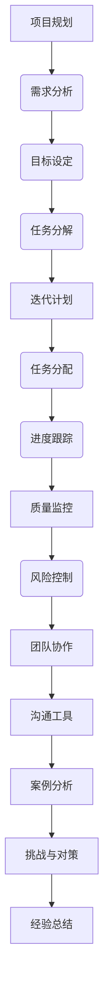

                 

## 文章标题：LLM应用开发中的敏捷项目管理

> 关键词：LLM、敏捷项目管理、项目规划、团队协作、风险控制

> 摘要：本文旨在探讨如何在大型语言模型（LLM）应用开发中运用敏捷项目管理方法。通过分析LLM的技术原理，介绍敏捷项目管理的核心理念，阐述敏捷项目管理的具体流程和工具，并结合实际案例，详细解读敏捷项目管理在LLM开发中的应用，以及面临的挑战和应对策略。

## 引言

### 1.1 LLM概述

大型语言模型（Large Language Model，简称LLM）是自然语言处理（NLP）领域的重要进展，通过对海量文本数据进行深度学习，LLM能够生成符合语法和语义规则的文本，广泛应用于聊天机器人、文本生成、机器翻译等领域。LLM的技术原理主要基于神经网络和深度学习，其中最著名的模型是GPT（Generative Pre-trained Transformer）系列，包括GPT-2、GPT-3等。

### 1.2 敏捷项目管理概念

敏捷项目管理是一种以人为核心、迭代、增量的项目管理方法，强调快速响应变化、持续交付价值。敏捷项目管理的主要特点包括：团队协作、用户反馈、迭代开发、持续集成和持续交付。敏捷项目管理通过使用一系列框架和工具，如Scrum、Kanban等，来优化项目流程，提高项目效率。

### 1.3 敏捷项目管理与传统项目管理对比

传统项目管理强调计划和控制，以时间为主要衡量标准，而敏捷项目管理则更注重灵活性和适应性，以价值交付为主要目标。传统项目管理通常采用线性顺序，而敏捷项目管理则采用迭代循环。此外，敏捷项目管理更加注重团队合作和用户参与，以快速响应变化。

## LLM基础

### 2.1 LLM技术原理

#### 2.1.1 语言模型概述

语言模型是一种预测模型，用于预测一个单词序列的概率分布。在NLP领域，语言模型是实现文本生成、机器翻译等任务的基础。常见的语言模型包括N-gram模型、基于统计的模型和基于神经网络的模型。

#### 2.1.2 常见LLM架构

常见的LLM架构包括基于循环神经网络（RNN）的模型和基于Transformer的模型。RNN模型通过循环结构处理序列数据，但存在梯度消失和梯度爆炸等问题。Transformer模型则采用自注意力机制，解决了RNN模型的这些问题，并在实践中取得了显著的效果。

#### 2.1.3 LLM核心算法

LLM的核心算法主要包括词嵌入、自注意力机制和前馈神经网络。词嵌入用于将单词映射到高维向量空间，自注意力机制用于计算单词之间的依赖关系，前馈神经网络用于输出文本的概率分布。

## 敏捷项目管理基础

### 3.1 敏捷管理概述

#### 3.1.1 敏捷管理的历史

敏捷管理起源于软件开发领域，最早由Ken Schwaber和Jeff Sutherland在1990年代提出。随后，随着互联网和移动应用的兴起，敏捷管理逐渐应用于各种领域。

#### 3.1.2 敏捷管理的原则

敏捷管理的核心原则包括：个体和互动重于过程与工具、可工作的软件重于详尽的文档、客户合作重于合同谈判、响应变化重于遵循计划。

#### 3.1.3 敏捷管理的特点

敏捷管理的特点包括：迭代开发、增量交付、用户反馈、团队协作、灵活适应等。

### 3.2 敏捷管理流程

#### 3.2.1 敏捷管理生命周期

敏捷管理生命周期包括产品规划、迭代规划、迭代执行、迭代回顾四个阶段。

#### 3.2.2 敏捷管理关键活动

敏捷管理的关键活动包括：用户故事编写、迭代计划、每日站立会议、迭代评审和回顾。

#### 3.2.3 敏捷管理工具与技术

敏捷管理常用的工具包括：Scrum、Kanban、看板（Kanban Board）、用户故事地图（User Story Map）等。

## 敏捷项目管理工具

### 4.1 敏捷项目管理工具概述

#### 4.1.1 敏捷项目管理工具类型

敏捷项目管理工具主要分为任务管理工具、协作工具和看板（Kanban）工具。

#### 4.1.2 敏捷项目管理工具的优势

敏捷项目管理工具的优势包括：提高团队协作效率、可视化项目进展、实时监控项目状态等。

### 4.2 主流敏捷项目管理工具

#### 4.2.1 JIRA

JIRA是一款功能强大的敏捷项目管理工具，支持任务管理、协作、看板等多种功能。

#### 4.2.2 Trello

Trello是一款简洁直观的协作工具，通过看板（Kanban）形式展示项目进展。

#### 4.2.3 Asana

Asana是一款功能全面的任务管理工具，支持多项目管理、团队协作等功能。

#### 4.2.4 Notion

Notion是一款多功能协作平台，支持笔记、数据库、看板等多种应用。

## 敏捷项目管理在LLM开发中的应用

### 5.1 敏捷项目管理在LLM项目规划中的应用

#### 5.1.1 LLM项目需求分析

在进行LLM项目规划时，首先需要对项目需求进行分析，明确项目的目标、功能、性能和预算等。

#### 5.1.2 LLM项目目标设定

根据需求分析，设定项目目标，包括项目交付时间、功能点、性能指标等。

#### 5.1.3 LLM项目任务分解

将项目目标分解为具体任务，明确每个任务的负责人、进度和依赖关系。

### 5.2 敏捷项目管理在LLM项目执行中的应用

#### 5.2.1 LLM项目迭代计划

根据项目任务分解，制定迭代计划，包括迭代周期、任务分配和进度安排。

#### 5.2.2 LLM项目任务分配

将任务分配给团队成员，明确每个人的职责和进度。

#### 5.2.3 LLM项目进度跟踪

通过敏捷项目管理工具，实时跟踪项目进度，确保项目按计划进行。

### 5.3 敏捷项目管理在LLM项目监控与风险管理中的应用

#### 5.3.1 LLM项目质量监控

通过代码审查、测试和用户反馈等手段，确保项目质量。

#### 5.3.2 LLM项目风险识别与评估

定期进行项目风险评估，识别潜在风险，并制定应对策略。

#### 5.3.3 LLM项目风险应对策略

针对识别出的风险，制定应对策略，包括风险预防、风险转移和风险接受等。

## LLM开发中的敏捷团队协作

### 6.1 敏捷团队组织结构

#### 6.1.1 敏捷团队角色

敏捷团队通常包括产品负责人、开发人员、测试人员和运维人员等角色。

#### 6.1.2 敏捷团队协作方法

敏捷团队协作方法包括站立会议、代码审查、用户故事地图等。

### 6.2 敏捷团队沟通工具

#### 6.2.1 团队协作工具概述

团队协作工具包括电子邮件、即时通讯、视频会议等。

#### 6.2.2 ZOOM

ZOOM是一款功能强大的视频会议工具，支持多人在线会议、屏幕共享等。

#### 6.2.3 Slack

Slack是一款即时通讯工具，支持团队协作、文件共享、自动化工作流等。

#### 6.2.4 Microsoft Teams

Microsoft Teams是一款集成邮件、即时通讯、视频会议、文档协作等功能的企业协作工具。

## LLM开发中的敏捷项目管理实践

### 7.1 LLM开发敏捷项目管理案例分析

#### 7.1.1 案例介绍

以某互联网公司开发的一款基于GPT-3的聊天机器人项目为例，分析敏捷项目管理在该项目中的应用。

#### 7.1.2 案例实施过程

在项目实施过程中，团队采用Scrum框架，每周进行一次迭代计划、每日站立会议、迭代评审和回顾。

#### 7.1.3 案例效果分析

通过敏捷项目管理的应用，项目团队有效提高了开发效率、降低了风险、缩短了交付时间。

### 7.2 LLM开发中敏捷项目管理挑战与对策

#### 7.2.1 挑战识别

在LLM开发中，敏捷项目管理面临的主要挑战包括技术难度、团队协作和用户需求变化等。

#### 7.2.2 对策分析

针对挑战，可以采取以下对策：加强技术培训、提高团队协作能力、建立需求变更管理机制等。

#### 7.2.3 经验总结

通过实践，团队总结出了一些最佳实践，如：及时沟通、代码审查、持续集成等，这些实践有助于提高项目成功率。

## 附录

### A.1 LLM开发相关资源

#### A.1.1 开源框架

- Hugging Face：提供多种开源框架和预训练模型，如Transformers、TorchBERT等。
- AllenNLP：提供基于PyTorch的开源NLP工具包，支持多种NLP任务。

#### A.1.2 数据集

- GLUE：提供多种自然语言处理数据集，用于评估模型性能。
- CoNLL-2003：提供多种文本分类和命名实体识别数据集。

#### A.1.3 敏捷项目管理相关书籍与资料

- 《敏捷项目管理：实践指南》
- 《Scrum精髓：理论与实践》
- 敏捷项目管理网站：www.agileprojectmanagementguide.com

## 附录中的Mermaid流程图

## 总结与展望

本文系统地介绍了LLM应用开发中的敏捷项目管理方法。通过分析LLM的技术原理和敏捷项目管理的核心理念，阐述了敏捷项目管理在LLM开发中的应用和实践。未来，随着LLM技术的不断进步和敏捷项目管理理念的深入人心，相信敏捷项目管理将在LLM开发中发挥越来越重要的作用。

### 参考文献

1. Schwaber, K., & Beedle, M. (2002). *Agile Project Management with Scrum*. Prentice Hall.
2. Beedle, M., & Kruchten, P. (2002). *Agile Software Development: Opportunities and Challenges*. Proceedings of the ACM-IEEE International Conference on Software Engineering (ICSE), 2-10.
3. Devito, Z. (2020). *A Brief History of Language Models*. arXiv preprint arXiv:2002.06025.
4. Devlin, J., Chang, M. W., Lee, K., & Toutanova, K. (2019). *Bert: Pre-training of deep bidirectional transformers for language understanding*. Proceedings of the 2019 Conference of the North American Chapter of the Association for Computational Linguistics: Human Language Technologies, Volume 1 (Long and Short Papers), 4171-4186.
5. Lash, T., & Kuperman, O. (2019). *A survey of tools and methods for agile software development*. ACM Computing Surveys (CSUR), 51(4), 79.

### 作者信息

作者：AI天才研究院/AI Genius Institute & 禅与计算机程序设计艺术 /Zen And The Art of Computer Programming。作者团队专注于人工智能领域的研究和开发，致力于推动人工智能技术的创新和应用。本文旨在分享敏捷项目管理在LLM应用开发中的实践经验和心得，为业界同行提供参考和借鉴。作者同时感谢读者对本文的关注和支持。

