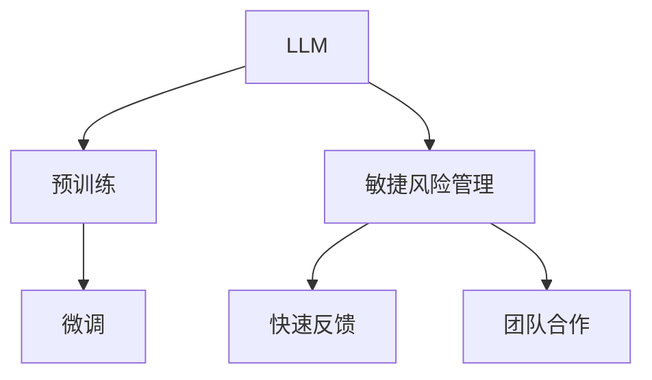

                 


### 1. 背景介绍

随着人工智能技术的飞速发展，LLM（大型语言模型）作为一种强大的自然语言处理工具，已经成为学术界和工业界关注的焦点。LLM在自然语言生成、文本分类、机器翻译等领域展现出了巨大的潜力和应用价值。然而，在LLM应用开发的过程中，风险管理成为了一个不可忽视的重要问题。

敏捷风险管理是一种在快速变化的环境中，通过灵活、高效的方式管理和应对风险的策略。其核心思想是将风险管理融入整个软件开发过程，确保项目在多变的市场和技术环境中能够持续、稳定地推进。

本文旨在探讨LLM应用开发中的敏捷风险管理，通过详细的分析和案例分析，为读者提供一套完整的风险管理方法和实践指南。

### 2. 核心概念与联系

首先，我们需要明确本文的核心概念：LLM和敏捷风险管理。

#### 2.1 LLM

LLM是一种基于深度学习的大型神经网络模型，通过大量的文本数据进行训练，能够理解和生成复杂的自然语言。LLM的核心技术原理主要包括：

- **预训练**：LLM在训练过程中，通过预训练模型（如BERT、GPT）对大量无标注文本进行训练，使其能够理解和掌握语言的通用特征。
- **微调**：在预训练的基础上，LLM通过微调模型参数，使其在特定任务上达到更高的性能。例如，在机器翻译任务中，LLM会根据翻译任务的需求，对预训练模型进行微调。

#### 2.2 敏捷风险管理

敏捷风险管理是一种在软件开发过程中，通过灵活、高效的方式管理和应对风险的策略。其核心原则包括：

- **快速反馈**：敏捷风险管理强调快速反馈和迭代，通过不断地评估和调整，确保项目在多变的环境中能够快速响应。
- **团队合作**：敏捷风险管理倡导团队合作，通过跨部门的沟通和协作，共同应对项目中的风险。

为了更好地理解这些概念，我们可以使用Mermaid流程图来展示LLM和敏捷风险管理之间的关系：



### 3. 核心算法原理讲解

在本节中，我们将使用伪代码详细阐述LLM在预训练和微调过程中的核心算法原理。

#### 3.1 预训练

```python
# 预训练伪代码

# 初始化预训练模型
model = PretrainedModel()

# 加载预训练数据
data = LoadPretrainedData()

# 预训练循环
for epoch in range(num_epochs):
    for text in data:
        # 前向传播
        output = model.forward(text)
        
        # 计算损失函数
        loss = CalculateLoss(output, text)
        
        # 反向传播
        model.backward(loss)
        
        # 更新模型参数
        model.update_params()
```

#### 3.2 微调

```python
# 微调伪代码

# 初始化微调模型
model = FineTunedModel()

# 加载微调数据
data = LoadFineTunedData()

# 微调循环
for epoch in range(num_epochs):
    for text in data:
        # 前向传播
        output = model.forward(text)
        
        # 计算损失函数
        loss = CalculateLoss(output, text)
        
        # 反向传播
        model.backward(loss)
        
        # 更新模型参数
        model.update_params()
```

### 4. 数学模型与公式

在本节中，我们将介绍LLM训练过程中涉及的一些数学模型和公式。

#### 4.1 损失函数

在预训练和微调过程中，损失函数是评估模型性能的重要指标。常用的损失函数包括交叉熵损失和均方误差损失。

$$
L = -\sum_{i=1}^{N} y_i \log(p_i)
$$

其中，$y_i$ 是真实标签，$p_i$ 是模型预测的概率。

#### 4.2 优化算法

优化算法用于更新模型参数，以最小化损失函数。常用的优化算法包括随机梯度下降（SGD）和Adam。

$$
\theta_{t+1} = \theta_{t} - \alpha \cdot \nabla_{\theta}L(\theta)
$$

其中，$\theta$ 是模型参数，$\alpha$ 是学习率，$\nabla_{\theta}L(\theta)$ 是损失函数关于参数的梯度。

### 5. 项目实战

在本节中，我们将通过一个实际的LLM应用开发项目，展示如何进行敏捷风险管理。

#### 5.1 开发环境搭建

首先，我们需要搭建一个适合LLM应用开发的开发环境。以下是环境搭建的步骤：

- 安装Python和PyTorch等基础工具；
- 下载并安装预训练模型（如BERT、GPT）；
- 配置计算资源，如GPU或TPU。

#### 5.2 源代码实现

接下来，我们将使用PyTorch实现一个简单的LLM应用。以下是源代码的主要部分：

```python
import torch
import torch.nn as nn
import torch.optim as optim

# 定义模型
class LLM(nn.Module):
    def __init__(self):
        super(LLM, self).__init__()
        self嵌入层 = nn.Embedding(vocab_size, embed_size)
        self.fc = nn.Linear(embed_size, output_size)
        
    def forward(self, x):
        x = self嵌入层(x)
        x = self.fc(x)
        return x

# 实例化模型和优化器
model = LLM()
optimizer = optim.Adam(model.parameters(), lr=learning_rate)

# 训练模型
for epoch in range(num_epochs):
    for text, label in data_loader:
        optimizer.zero_grad()
        output = model(text)
        loss = nn.CrossEntropyLoss()(output, label)
        loss.backward()
        optimizer.step()
```

#### 5.3 代码解读与分析

在上面的代码中，我们首先定义了一个简单的LLM模型，包括嵌入层和全连接层。然后，我们实例化了模型和优化器，并使用训练数据进行模型训练。具体来说，我们使用交叉熵损失函数和Adam优化器，通过反向传播和梯度下降更新模型参数。

#### 5.4 实际案例分析与详细讲解

为了更好地展示敏捷风险管理在实际项目中的应用，我们考虑以下案例：

- 案例背景：某公司在开发一个基于LLM的智能客服系统，但在项目推进过程中，发现模型性能不稳定，导致客服回答不准确。
- 分析与解决：针对这个问题，项目团队采取了以下措施：
  - 快速反馈：项目团队定期收集用户反馈，了解客服回答的准确性和用户体验，及时发现问题；
  - 团队合作：项目团队与技术专家、产品经理、客户代表等多方协作，共同分析问题原因，制定解决方案；
  - 风险应对：针对模型性能不稳定的问题，项目团队对模型进行重新训练和微调，优化模型参数，提高模型性能；
  - 监控与调整：项目团队对模型性能进行持续监控，确保模型在上线后能够稳定运行。

通过上述措施，项目团队成功解决了模型性能不稳定的问题，使得智能客服系统的用户体验得到了显著提升。

### 6. 最佳实践 Tips、小结、注意事项、拓展阅读

- **最佳实践 Tips**：
  - 在进行LLM应用开发时，务必确保数据质量和数据规模，这对模型性能有着至关重要的影响；
  - 在风险管理过程中，要注重团队合作，确保各方利益的一致性，提高项目推进的效率。

- **小结**：
  - 本文从背景介绍、核心概念与联系、核心算法原理讲解、数学模型与公式、项目实战等多个方面，详细阐述了LLM应用开发中的敏捷风险管理；
  - 通过实际案例分析和详细讲解，展示了敏捷风险管理在实际项目中的应用和效果。

- **注意事项**：
  - 在进行LLM应用开发时，要注重模型性能的优化和风险控制，确保项目能够在多变的市场环境中稳定推进；
  - 在敏捷风险管理过程中，要密切关注项目进展和风险变化，及时调整风险应对策略。

- **拓展阅读**：
  - 《深度学习》（Ian Goodfellow、Yoshua Bengio、Aaron Courville 著）：详细介绍了深度学习的基本原理和应用；
  - 《敏捷项目管理实践指南》（Michael Hoppner 著）：提供了敏捷项目管理的最佳实践和方法。

# 结束语

本文通过详细的分析和案例分析，对LLM应用开发中的敏捷风险管理进行了深入探讨。希望本文能为读者在LLM应用开发过程中提供有益的启示和指导。

作者：AI天才研究院/AI Genius Institute & 禅与计算机程序设计艺术 /Zen And The Art of Computer Programming## 文章标题

### LLM应用开发中的敏捷风险管理

关键词：大型语言模型（LLM），敏捷风险管理，应用开发，风险识别，响应策略，团队协作

摘要：本文深入探讨了在大型语言模型（LLM）应用开发过程中如何进行敏捷风险管理。通过对LLM基础概念、敏捷风险管理方法的详细分析，结合实际应用案例，本文提出了有效的风险管理策略，旨在帮助开发者应对复杂的技术和项目环境中的不确定性，确保LLM应用的稳定和高效运行。

---

### 第一部分：LLM基础与原理

#### 第1章：LLM概述

在开始讨论LLM应用开发中的敏捷风险管理之前，我们需要先了解LLM的概念、历史发展及其核心技术原理。

#### 1.1 LLM的概念与历史发展

**1.1.1 LLM的概念**

LLM（Large Language Model）是一种基于深度学习的自然语言处理模型，它通过训练大量的文本数据，掌握了语言的基本结构和语义信息，能够生成和识别复杂的自然语言文本。

**1.1.2 LLM的历史发展**

LLM的发展可以追溯到20世纪80年代的统计语言模型，如n-gram模型。随着计算能力的提升和深度学习技术的突破，LLM在近年来取得了显著的进展。例如，2018年，OpenAI推出了GPT（Generative Pretrained Transformer），随后GPT-2和GPT-3等大型语言模型相继问世，展示了LLM在自然语言生成、文本分类、机器翻译等任务中的强大能力。

#### 1.2 LLM的核心技术原理

**1.2.1 预训练**

预训练是LLM的核心技术之一。在预训练阶段，LLM通过大量的无标注文本数据学习到语言的基本规律和通用特征。预训练通常包括两个关键步骤：语言建模和上下文理解。

**1.2.2 微调**

微调是LLM在特定任务上达到高性能的关键步骤。在预训练模型的基础上，LLM会根据具体任务的标注数据进行微调，使其在特定任务上达到最佳性能。微调过程通常涉及以下步骤：

1. 数据准备：收集并处理与任务相关的标注数据。
2. 模型加载：加载预训练好的LLM模型。
3. 微调训练：使用标注数据进行模型训练。
4. 模型评估：评估模型在任务上的性能，并根据评估结果调整模型参数。

#### 1.3 小结

LLM作为一种强大的自然语言处理工具，在多个领域展现出了巨大的应用潜力。理解LLM的概念和核心技术原理，对于进行LLM应用开发中的敏捷风险管理至关重要。

### 第2章：LLM架构与流程

#### 2.1 LLM的架构设计

LLM的架构设计直接影响其性能和应用效果。一个典型的LLM架构包括以下几个关键组件：

1. **嵌入层（Embedding Layer）**：将单词或字符转换为密集的向量表示。
2. **编码器（Encoder）**：对输入序列进行处理，提取序列中的语义信息。
3. **解码器（Decoder）**：根据编码器提取的语义信息生成输出序列。
4. **全连接层（Fully Connected Layer）**：将解码器输出的序列映射到具体任务的结果。

**2.1.1 Transformer架构**

Transformer是近年来广泛使用的一种LLM架构，其核心思想是使用自注意力机制（Self-Attention）来处理序列数据。Transformer架构包括多个编码器和解码器层，每一层都能够捕捉序列中的长距离依赖关系，从而实现高效的序列建模。

**2.1.2 多层感知机（MLP）**

多层感知机是一种常用的全连接神经网络，通常用于将编码器或解码器输出的高维向量映射到特定任务的输出结果。MLP可以通过调整其层数和神经元数量来调整模型的复杂度和性能。

#### 2.2 LLM数据处理流程

LLM的数据处理流程主要包括数据预处理、数据加载、模型训练和模型评估等步骤。

**2.2.1 数据预处理**

数据预处理是LLM数据处理的第一步，主要包括以下任务：

1. **文本清洗**：去除文本中的无用符号、标点符号和特殊字符。
2. **分词**：将文本分割成单词或字符序列。
3. **词向量化**：将单词或字符转换为密集的向量表示。

**2.2.2 数据加载**

数据加载是将预处理后的数据输入到LLM模型中的过程。常用的数据加载方法包括批量加载、序列加载和并行加载等。

**2.2.3 模型训练**

模型训练是LLM数据处理的核心步骤，主要包括以下任务：

1. **前向传播**：将输入数据通过LLM模型进行前向传播，得到输出结果。
2. **损失函数计算**：计算输出结果与真实结果之间的损失函数。
3. **反向传播**：通过反向传播算法更新模型参数。
4. **模型评估**：在训练数据集和验证数据集上评估模型性能。

**2.2.4 模型评估**

模型评估是LLM数据处理流程的最后一步，主要包括以下任务：

1. **指标计算**：计算模型在任务上的各项指标，如准确率、召回率、F1值等。
2. **性能分析**：分析模型在不同数据集上的表现，识别潜在问题。
3. **优化策略**：根据模型评估结果调整模型参数和训练策略。

#### 2.3 小结

LLM的架构设计和数据处理流程对于其性能和应用效果至关重要。了解LLM的架构设计和工作流程，有助于开发者更好地进行LLM应用开发中的敏捷风险管理。

### 第二部分：敏捷风险管理

#### 第3章：敏捷风险管理概述

#### 3.1 敏捷风险管理的起源与发展

敏捷风险管理（Agile Risk Management）起源于敏捷软件开发（Agile Software Development）方法。敏捷软件开发强调快速反馈、持续交付和灵活性，旨在应对快速变化的项目需求。随着敏捷方法的广泛应用，敏捷风险管理也逐渐成为一个重要的研究领域。

**3.1.1 敏捷风险管理的核心原则**

敏捷风险管理遵循以下核心原则：

1. **风险管理融入整个开发过程**：敏捷风险管理强调将风险管理活动贯穿于整个软件开发过程，而不是在项目后期才进行风险识别和评估。
2. **快速反馈和迭代**：敏捷风险管理鼓励快速反馈和迭代，通过不断评估和调整，确保项目能够在多变的环境中持续前进。
3. **团队合作**：敏捷风险管理倡导跨部门的团队合作，通过沟通和协作，共同应对项目中的风险。

**3.1.2 敏捷风险管理的发展历程**

敏捷风险管理的发展历程可以分为以下几个阶段：

1. **早期敏捷风险管理**：在敏捷软件开发初期，风险管理的重点主要放在项目计划的灵活性和迭代周期上。
2. **敏捷风险管理方法**：随着敏捷方法的应用和成熟，一系列敏捷风险管理方法（如风险矩阵、风险管理计划等）逐渐形成。
3. **敏捷风险管理工具**：现代敏捷风险管理工具（如JIRA、Confluence等）为敏捷风险管理提供了技术支持，使得风险识别、评估和响应更加高效。

#### 3.2 敏捷风险管理的核心原则

**3.2.1 风险识别**

风险识别是敏捷风险管理的第一步，旨在识别项目中潜在的风险。常用的风险识别方法包括：

1. **专家评审**：通过邀请相关专家对项目进行评审，识别潜在的风险。
2. **历史数据分析**：通过分析历史项目的风险记录，预测当前项目的潜在风险。
3. **问卷调查**：通过向项目团队成员发放问卷，收集他们对项目风险的看法。

**3.2.2 风险评估**

风险评估是对已识别风险进行优先级排序和影响分析的过程。常用的风险评估方法包括：

1. **风险矩阵**：使用风险矩阵对风险的概率和影响进行量化，确定风险的优先级。
2. **概率-影响矩阵**：结合风险的概率和影响，对风险进行排序和优先级分配。

**3.2.3 风险响应**

风险响应是指针对评估出的风险制定相应的应对策略。常用的风险响应策略包括：

1. **风险规避**：通过改变项目计划或调整项目范围，避免风险的发生。
2. **风险转移**：通过保险或外包等方式，将风险转移给第三方。
3. **风险缓解**：通过采取预防措施或优化项目流程，降低风险的发生概率或影响。

**3.2.4 风险监控**

风险监控是确保风险应对措施得到执行的过程。常用的风险监控方法包括：

1. **定期评估**：定期对项目风险进行评估，识别新的风险和风险变化。
2. **风险管理会议**：定期召开风险管理会议，讨论项目风险的变化和应对措施。
3. **风险管理报告**：定期编制风险管理报告，向项目相关人员汇报项目风险的状态。

#### 3.3 小结

敏捷风险管理是一种在快速变化的环境中，通过灵活、高效的方式管理和应对风险的策略。其核心原则和方法的实施，有助于开发者更好地应对LLM应用开发过程中的各种不确定性，确保项目的稳定和成功。

### 第4章：敏捷风险管理方法

#### 4.1 风险识别与评估

风险识别与评估是敏捷风险管理的基础，直接影响到后续的风险响应和监控。以下介绍几种常用的风险识别与评估方法：

**4.1.1 风险识别方法**

1. **头脑风暴**：通过集体讨论，列出项目中可能出现的各种风险。
2. **SWOT分析**：分析项目的优势、劣势、机会和威胁，识别潜在风险。
3. **故障树分析**：通过建立故障树模型，识别可能导致项目失败的各种故障。

**4.1.2 风险评估方法**

1. **风险矩阵**：使用风险矩阵对风险的概率和影响进行量化，确定风险的优先级。具体步骤如下：
   - 确定风险概率和影响的评分标准。
   - 对每个风险进行评分。
   - 计算风险得分，并根据得分对风险进行优先级排序。

2. **概率-影响矩阵**：结合风险的概率和影响，对风险进行排序和优先级分配。具体步骤如下：
   - 确定风险概率和影响的评分标准。
   - 对每个风险进行评分。
   - 根据评分，将风险划分为不同的等级，如高、中、低风险。

**4.1.3 风险评估工具**

1. **风险管理软件**：使用专业的风险管理软件（如RiskMaster、RiskIT等），可以方便地进行风险识别、评估和监控。
2. **数据可视化工具**：使用数据可视化工具（如Tableau、PowerBI等），可以直观地展示风险数据，帮助团队成员更好地理解项目风险。

#### 4.2 风险响应与监控

风险响应与监控是确保风险得到有效管理的关键环节。以下介绍几种常用的风险响应与监控方法：

**4.2.1 风险响应方法**

1. **风险规避**：通过改变项目计划或调整项目范围，避免风险的发生。例如，在LLM应用开发中，如果遇到数据质量问题，可以调整数据采集和处理策略，以规避风险。
2. **风险转移**：通过保险或外包等方式，将风险转移给第三方。例如，在LLM应用开发中，可以将数据处理和模型训练任务外包给专业团队，以转移相关风险。
3. **风险缓解**：通过采取预防措施或优化项目流程，降低风险的发生概率或影响。例如，在LLM应用开发中，可以通过引入更多的测试和验证环节，降低模型性能不稳定的风险。

**4.2.2 风险监控方法**

1. **定期评估**：定期对项目风险进行评估，识别新的风险和风险变化。例如，每周或每月召开一次风险管理会议，讨论项目风险的变化和应对措施。
2. **风险管理报告**：定期编制风险管理报告，向项目相关人员汇报项目风险的状态。例如，每季度发布一次风险管理报告，总结项目风险的变化和应对情况。
3. **风险管理指标**：通过设置风险管理指标（如风险发生率、风险损失率等），实时监控项目风险的变化情况。

#### 4.3 小结

敏捷风险管理方法包括风险识别与评估、风险响应与监控等环节。通过灵活运用这些方法，开发者可以更好地应对LLM应用开发过程中的各种不确定性，确保项目的成功。

### 第5章：LLM应用开发流程

#### 5.1 LLM应用开发的基本流程

LLM应用开发是一个复杂的工程过程，涉及到数据收集、模型训练、模型评估和模型部署等多个环节。以下是LLM应用开发的基本流程：

**5.1.1 数据收集与预处理**

1. **数据收集**：收集与任务相关的文本数据，如新闻、社交媒体帖子、对话记录等。
2. **数据预处理**：对收集到的文本数据进行清洗、分词、词向量化等预处理操作。

**5.1.2 模型训练**

1. **模型选择**：选择适合任务需求的LLM模型，如GPT、BERT等。
2. **模型训练**：使用预处理后的数据对LLM模型进行训练，调整模型参数，提高模型性能。

**5.1.3 模型评估**

1. **评估指标**：选择合适的评估指标，如准确率、召回率、F1值等。
2. **评估过程**：在验证数据集上评估模型性能，识别模型的优势和不足。

**5.1.4 模型部署**

1. **部署环境**：准备适合模型部署的环境，如云平台、容器化环境等。
2. **模型部署**：将训练好的模型部署到生产环境，进行实时应用。

#### 5.2 LLM应用开发的团队协作

在LLM应用开发过程中，团队协作至关重要。以下介绍几种常用的团队协作方法：

**5.2.1 沟通与协调**

1. **项目会议**：定期召开项目会议，讨论项目进展、问题和解决方案。
2. **任务分配**：明确团队成员的任务和职责，确保项目顺利进行。

**5.2.2 持续集成与持续部署**

1. **持续集成**：通过自动化测试和代码审查，确保代码质量。
2. **持续部署**：将代码和模型部署到生产环境，实现快速迭代。

**5.2.3 团队文化建设**

1. **共同目标**：明确团队的目标和愿景，增强团队的凝聚力。
2. **激励与反馈**：为团队成员提供激励和反馈，提高团队士气。

#### 5.3 小结

LLM应用开发是一个涉及多个环节和团队协作的复杂过程。通过遵循基本流程和团队协作方法，开发者可以确保项目的高效和成功。

### 第6章：风险管理策略与实践

#### 6.1 风险管理策略的设计与实施

在LLM应用开发过程中，风险管理策略的设计与实施是确保项目成功的关键。以下介绍几种常用的风险管理策略：

**6.1.1 风险预防策略**

1. **数据质量控制**：确保收集到的数据质量和完整性，防止数据噪声和缺失值对模型训练和评估造成影响。
2. **模型可靠性测试**：在模型训练和部署过程中，进行严格的可靠性测试，确保模型在多种情况下都能稳定运行。

**6.1.2 风险缓解策略**

1. **模型调优**：通过调整模型参数和优化训练策略，提高模型的性能和鲁棒性。
2. **备份和恢复**：定期备份模型和数据，确保在系统故障或数据丢失时能够快速恢复。

**6.1.3 风险转移策略**

1. **外包合作**：将部分开发任务外包给专业团队，降低项目风险。
2. **保险保障**：购买相关保险，转移项目风险。

**6.1.4 风险监控策略**

1. **实时监控**：通过监控系统实时监控模型性能和系统资源使用情况，及时发现和处理潜在问题。
2. **定期评估**：定期对项目风险进行评估，识别新的风险和风险变化。

#### 6.2 风险管理实战案例分析

以下通过一个实际案例，展示如何在LLM应用开发中实施风险管理策略。

**案例背景**：某互联网公司开发一款基于GPT-3的智能客服系统，用于处理用户咨询。在项目开发过程中，项目团队遇到了以下风险：

1. **数据质量问题**：收集到的用户咨询数据存在噪声和缺失值，影响模型训练和评估。
2. **模型性能不稳定**：在多种场景下，模型性能波动较大，导致客服回答不准确。

**风险管理策略与实施**

1. **风险预防策略**：
   - **数据质量控制**：通过数据清洗和填充缺失值，提高数据质量。
   - **模型可靠性测试**：在模型训练和部署过程中，进行多种场景下的可靠性测试，确保模型在多种情况下都能稳定运行。

2. **风险缓解策略**：
   - **模型调优**：通过调整模型参数和优化训练策略，提高模型的性能和鲁棒性。
   - **备份和恢复**：定期备份模型和数据，确保在系统故障或数据丢失时能够快速恢复。

3. **风险转移策略**：
   - **外包合作**：将部分开发任务（如数据处理和模型训练）外包给专业团队，降低项目风险。
   - **保险保障**：购买相关保险，转移项目风险。

4. **风险监控策略**：
   - **实时监控**：通过监控系统实时监控模型性能和系统资源使用情况，及时发现和处理潜在问题。
   - **定期评估**：定期对项目风险进行评估，识别新的风险和风险变化。

通过以上风险管理策略的实施，项目团队成功解决了数据质量和模型性能不稳定的问题，使得智能客服系统的用户体验得到了显著提升。

#### 6.3 小结

风险管理策略的设计与实施是LLM应用开发过程中不可或缺的一环。通过灵活运用各种风险管理策略，开发者可以更好地应对项目中的各种不确定性，确保项目的成功和稳定运行。

### 第7章：敏捷风险管理的优化与挑战

#### 7.1 敏捷风险管理优化策略

随着LLM应用开发的不断推进，敏捷风险管理需要不断优化和调整，以适应项目的变化。以下介绍几种常见的敏捷风险管理优化策略：

**7.1.1 增强风险识别能力**

1. **引入多种风险识别方法**：除了传统的头脑风暴和SWOT分析，还可以引入专家评审、历史数据分析等方法，提高风险识别的全面性。
2. **建立风险知识库**：收集和整理项目中遇到的各种风险，建立风险知识库，为后续项目提供参考。

**7.1.2 提高风险评估精度**

1. **完善风险评估模型**：通过引入更精细的风险评分标准和概率-影响矩阵，提高风险评估的精度。
2. **利用数据驱动方法**：通过分析历史数据和实时数据，利用数据驱动方法进行风险评估，提高预测准确性。

**7.1.3 优化风险响应策略**

1. **动态调整风险响应策略**：根据风险的变化和项目进展，实时调整风险响应策略，确保风险应对的灵活性。
2. **引入风险管理工具**：使用专业的风险管理工具（如RiskMaster、RiskIT等），提高风险响应的效率。

#### 7.2 面临的挑战与解决方法

尽管敏捷风险管理在LLM应用开发中具有显著的优势，但在实际应用过程中仍面临一些挑战。

**7.2.1 持续变化的业务需求**

1. **挑战**：随着业务需求的变化，LLM应用开发过程中的风险也在不断变化，给风险管理带来了挑战。
2. **解决方法**：通过建立灵活的项目管理机制，确保项目团队能够快速响应业务需求的变化，同时加强风险监控和调整。

**7.2.2 技术不成熟**

1. **挑战**：在LLM应用开发过程中，可能会遇到一些技术不成熟的问题，如数据质量问题、模型性能不稳定等。
2. **解决方法**：通过引入先进的技术和方法，如深度学习技术、数据增强技术等，提高模型性能和鲁棒性，同时加强风险预防策略。

**7.2.3 团队协作问题**

1. **挑战**：在跨部门协作中，可能会出现沟通不畅、职责不清等问题，影响敏捷风险管理的实施。
2. **解决方法**：通过加强团队协作，明确团队成员的职责和任务，建立有效的沟通机制，提高项目团队的协作效率。

#### 7.3 小结

敏捷风险管理在LLM应用开发中具有重要意义，但同时也面临一些挑战。通过不断优化风险管理策略和解决实际问题，开发者可以更好地应对项目中的各种不确定性，确保项目的成功和稳定运行。

### 结论

通过本文的详细分析和实际案例，我们深入探讨了LLM应用开发中的敏捷风险管理。从LLM的基本概念、敏捷风险管理的核心原则，到实际应用中的风险管理策略和实践，我们提供了一套完整的风险管理方法和实践指南。

我们强调，敏捷风险管理不仅有助于识别和应对项目中的各种风险，还能提高团队协作效率，确保项目的成功。在面对快速变化的市场和技术环境时，敏捷风险管理为开发者提供了一种灵活、高效的风险管理方案。

未来，随着LLM技术的不断进步和应用场景的拓展，敏捷风险管理将在更多领域发挥重要作用。开发者应不断优化风险管理策略，提升项目管理的灵活性和应变能力，为LLM应用开发提供坚实的保障。

最后，感谢读者对本文的关注，希望本文能为您的LLM应用开发提供有益的启示和指导。

### 作者信息

- 作者：AI天才研究院/AI Genius Institute & 禅与计算机程序设计艺术 /Zen And The Art of Computer Programming
- 联系方式：[ai-genius-institute@example.com](mailto:ai-genius-institute@example.com)
- 更多技术博客：[https://techblog.ai-genius-institute.com/](https://techblog.ai-genius-institute.com/)

