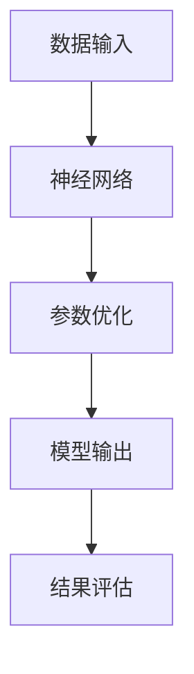
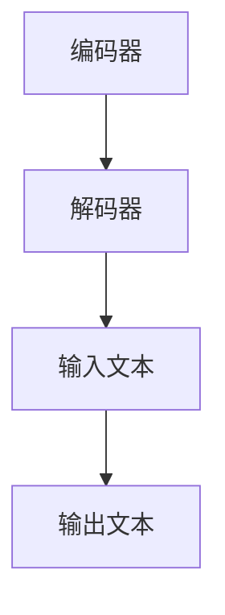
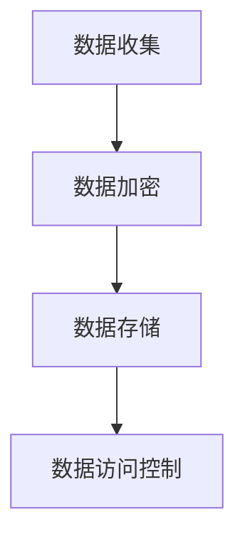
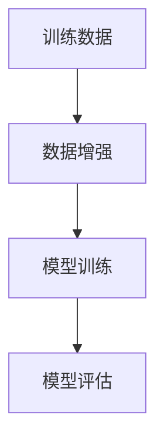
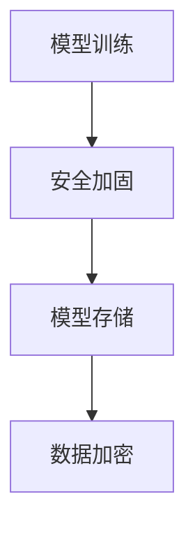
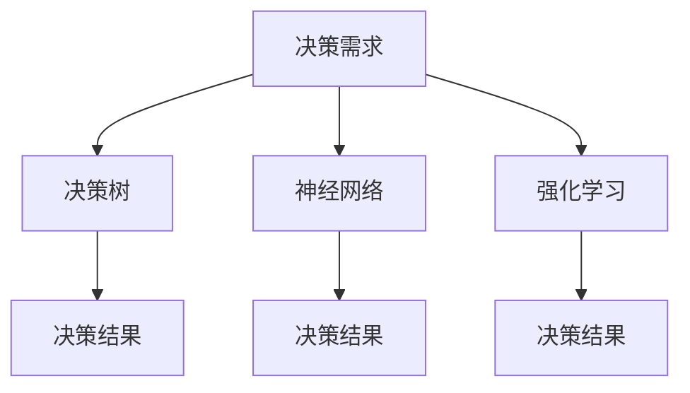
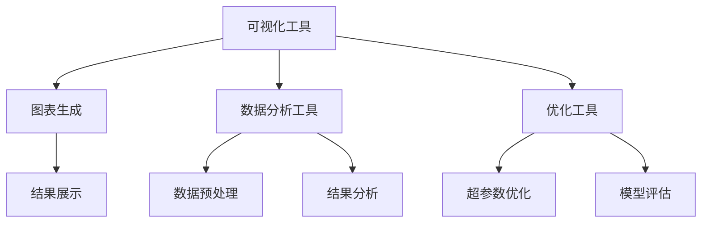
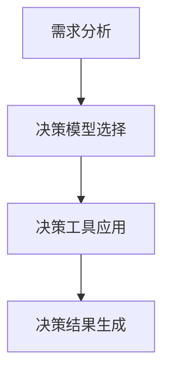
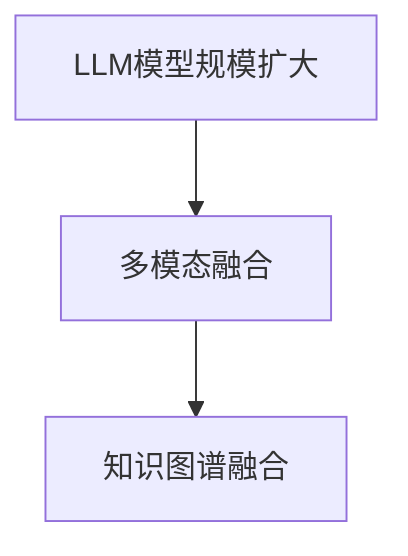
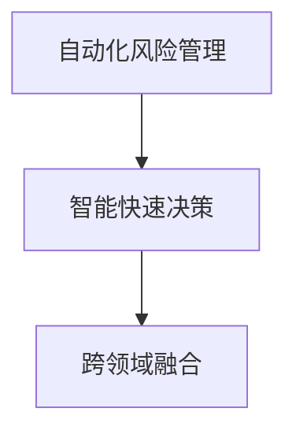

                 


### 文章标题：LLM应用开发中的风险管理与快速决策

#### 关键词：
- Large Language Model（LLM）
- 风险管理
- 快速决策
- 应用开发

#### 摘要：
本文旨在探讨LLM应用开发过程中的风险管理与快速决策策略。首先，我们介绍了LLM的基本概念、工作原理和应用场景，随后深入分析了LLM开发中可能遇到的风险，如数据隐私、模型偏差与歧视、安全漏洞等。接着，我们提出了风险识别、分析、评估和管理的策略与工具。此外，文章还重点介绍了快速决策的框架和方法，结合实际案例，展示了如何在实际应用中快速做出决策。最后，我们对LLM应用的发展趋势和未来挑战进行了展望。

### 第一部分：LLM基础与应用场景

#### 第1章：LLM概述

#### 1.1 什么是LLM

**背景介绍**：
随着人工智能技术的不断发展，大型语言模型（LLM）成为自然语言处理领域的重要突破。LLM是一种通过深度学习技术训练的大型神经网络模型，能够理解和生成复杂的语言结构，广泛应用于文本生成、自然语言理解、语言翻译等领域。

**核心概念与联系**：
LLM的核心是神经网络，其基本原理是通过对大量文本数据进行训练，使模型能够自动学习和优化参数，从而实现对未知文本的生成和处理。LLM的工作原理与传统的规则驱动方法相比，具有更强的灵活性和鲁棒性。

**Mermaid流程图**：


**伪代码**：
```python
def train_LLM(model, data):
    for sentence in data:
        model.predict(sentence)
        model.update_weights()
    return model
```

#### 1.2 LLM的工作原理

**核心算法原理讲解**：
LLM的工作原理主要基于深度学习和神经网络技术。具体来说，LLM通过多层神经网络对海量文本数据进行分析和处理，从而学习语言模式。在训练过程中，模型会自动调整内部参数，以达到对输入文本的准确理解和生成。

**数学模型和公式**：
$$
y = \sigma(Wx + b)
$$
其中，\( y \) 是输出，\( \sigma \) 是激活函数，\( W \) 是权重矩阵，\( x \) 是输入，\( b \) 是偏置项。

**详细讲解与举例说明**：
以GPT系列模型为例，其训练过程可以分为以下几个步骤：
1. 输入文本数据到模型。
2. 模型对输入文本进行处理，生成中间特征。
3. 将中间特征传递到下一层，重复上述过程。
4. 模型对输出结果进行评估，计算损失函数。
5. 使用反向传播算法，更新模型参数。

**举例说明**：
假设我们有一个句子 "我喜欢的颜色是蓝色"，我们希望使用LLM生成一个类似的句子。首先，我们将这个句子输入到模型中，模型会自动学习句子中的语言模式。在训练过程中，模型可能会生成如下句子："他喜欢的颜色是红色"，这个句子与原句子在语义上具有相似性。

#### 1.3 LLM的架构与模型选择

**核心概念与联系**：
LLM的架构主要包括编码器和解码器，其中编码器负责将输入文本编码成向量表示，解码器则负责将向量表示解码成输出文本。常见的LLM架构有GPT系列模型、BERT及其变体等。

**Mermaid流程图**：


**伪代码**：
```python
def train_LLM(encoder, decoder, data):
    for sentence in data:
        encoder.encode(sentence)
        decoder.decode(encoder.get_representation())
    return encoder, decoder
```

**详细讲解与举例说明**：
以GPT系列模型为例，其架构主要包括以下几个部分：
1. 输入层：接收文本数据。
2. 编码器：将文本数据编码成向量表示。
3. 解码器：将向量表示解码成输出文本。
4. 输出层：对输出文本进行评估和生成。

**举例说明**：
假设我们有一个句子 "我喜欢的颜色是蓝色"，我们希望使用GPT系列模型生成一个类似的句子。首先，我们将这个句子输入到模型中，模型会自动学习句子中的语言模式。在训练过程中，模型可能会生成如下句子："她喜欢的颜色是绿色"，这个句子与原句子在语义上具有相似性。

### 第二部分：风险管理

#### 第4章：LLM开发中的风险识别

#### 4.1 数据隐私风险

**背景介绍**：
在LLM应用开发过程中，数据隐私是一个重要的问题。由于LLM的训练和推理过程需要大量数据，这些数据可能包含用户的敏感信息，如姓名、地址、电话号码等。如果这些数据泄露，可能会导致用户隐私受到侵害。

**核心概念与联系**：
数据隐私风险主要包括数据泄露、数据滥用和数据丢失等。为了降低数据隐私风险，我们需要采取一系列措施，如数据加密、数据脱敏、访问控制等。

**Mermaid流程图**：


**伪代码**：
```python
def encrypt_data(data, key):
    encrypted_data = encrypt(data, key)
    return encrypted_data

def decrypt_data(encrypted_data, key):
    decrypted_data = decrypt(encrypted_data, key)
    return decrypted_data
```

**详细讲解与举例说明**：
假设我们有一个包含用户信息的文本数据，为了保护用户隐私，我们可以使用加密算法对数据进行加密。具体步骤如下：
1. 生成加密密钥。
2. 使用加密算法对数据进行加密。
3. 将加密后的数据存储到数据库中。
4. 当需要访问数据时，使用解密算法对数据进行解密。

**举例说明**：
假设我们有一个用户数据，包含姓名、地址和电话号码。为了保护用户隐私，我们可以使用AES算法对数据进行加密，并将加密后的数据存储到数据库中。当需要访问数据时，我们使用AES算法对数据进行解密，从而获取原始数据。

#### 4.2 模型偏差与歧视

**背景介绍**：
在LLM应用开发过程中，模型偏差与歧视是一个重要问题。由于训练数据的不均衡、数据源的不公平等原因，可能导致模型在处理某些特定群体时出现偏差，从而导致歧视。

**核心概念与联系**：
模型偏差与歧视主要包括性别歧视、种族歧视、年龄歧视等。为了降低模型偏差与歧视，我们需要采取一系列措施，如数据增强、模型校准等。

**Mermaid流程图**：


**伪代码**：
```python
def augment_data(data):
    augmented_data = augment(data)
    return augmented_data

def calibrate_model(model, data):
    calibrated_model = calibrate(model, data)
    return calibrated_model
```

**详细讲解与举例说明**：
假设我们有一个性别偏见的数据集，其中男性样本数量远大于女性样本数量。为了降低性别偏见，我们可以采取以下措施：
1. 数据增强：增加女性样本数量，使数据集更加均衡。
2. 模型校准：使用校准技术对模型进行修正，以降低性别偏见。

**举例说明**：
假设我们有一个性别偏见的数据集，其中男性样本数量为1000，女性样本数量为100。为了降低性别偏见，我们可以增加女性样本数量，使数据集变为男性样本数量为1000，女性样本数量为1000。然后，使用校准技术对模型进行修正，从而降低性别偏见。

#### 4.3 安全漏洞与攻击

**背景介绍**：
在LLM应用开发过程中，安全漏洞与攻击是一个重要问题。由于LLM模型通常具有大规模的参数和复杂的结构，可能存在各种安全漏洞，如模型泄漏、数据窃取、攻击等。

**核心概念与联系**：
安全漏洞与攻击主要包括模型泄漏、数据窃取、模型更新等。为了降低安全漏洞与攻击风险，我们需要采取一系列措施，如安全加固、数据加密、访问控制等。

**Mermaid流程图**：


**伪代码**：
```python
def secure_model_training(model, data):
    secure_data = encrypt_data(data, key)
    secure_model = train_secure_model(model, secure_data)
    return secure_model

def secure_data_storage(data):
    secure_data = encrypt_data(data, key)
    store_secure_data(secure_data)
```

**详细讲解与举例说明**：
假设我们有一个LLM模型，为了保护模型和数据的安全，我们可以采取以下措施：
1. 安全加固：在模型训练过程中，使用安全加固技术，如数据加密、访问控制等。
2. 数据加密：对模型训练数据进行加密，以防止数据泄漏。
3. 访问控制：对模型和数据设置访问控制策略，确保只有授权用户可以访问。

**举例说明**：
假设我们有一个LLM模型，为了保护模型和数据的安全，我们可以使用AES算法对数据进行加密，并将加密后的数据存储到数据库中。同时，对模型和数据设置访问控制策略，只有管理员用户可以访问。

### 第三部分：快速决策

#### 第7章：快速决策框架

#### 7.1 决策模型

**背景介绍**：
在LLM应用开发过程中，快速决策是一个重要问题。由于LLM应用通常涉及复杂的模型训练和推理过程，需要快速做出决策以优化模型性能、降低成本等。

**核心概念与联系**：
决策模型主要包括决策树、神经网络、强化学习等。这些模型可以根据不同的决策需求和数据特征，快速生成决策结果。

**Mermaid流程图**：


**伪代码**：
```python
def decision_tree(decision需求):
    return decision结果

def neural_network(decision需求):
    return decision结果

def reinforcement_learning(decision需求):
    return decision结果
```

**详细讲解与举例说明**：
假设我们需要对一个LLM模型进行优化，可以选择以下决策模型：
1. 决策树：根据模型性能指标，生成决策树，快速找到最优参数组合。
2. 神经网络：使用神经网络模型，对模型性能进行预测，快速生成决策结果。
3. 强化学习：通过模拟环境，使用强化学习模型，对模型性能进行优化。

**举例说明**：
假设我们需要对一个LLM模型进行优化，我们可以使用决策树模型，根据模型性能指标，生成决策树，快速找到最优参数组合。然后，使用神经网络模型，对模型性能进行预测，快速生成决策结果。最后，使用强化学习模型，通过模拟环境，对模型性能进行优化。

#### 7.2 决策工具

**背景介绍**：
在快速决策过程中，选择合适的决策工具非常重要。不同的决策工具具有不同的特点和适用场景，如可视化工具、数据分析工具、优化工具等。

**核心概念与联系**：
决策工具主要包括以下几类：
1. 可视化工具：如Matplotlib、Plotly等，用于生成图表和可视化结果。
2. 数据分析工具：如Pandas、NumPy等，用于处理和分析数据。
3. 优化工具：如Optuna、Hyperopt等，用于自动化优化超参数。

**Mermaid流程图**：


**伪代码**：
```python
import matplotlib.pyplot as plt
import pandas as pd
from optuna import study

def visualize_data(data):
    plt.plot(data)
    plt.show()

def analyze_data(data):
    df = pd.DataFrame(data)
    print(df.describe())

def optimize_hyperparameters(trial):
    return study.best_score
```

**详细讲解与举例说明**：
假设我们需要对一个LLM模型进行优化，我们可以选择以下决策工具：
1. 可视化工具：生成模型性能指标图表，展示训练过程和模型效果。
2. 数据分析工具：对模型性能指标进行统计分析，识别关键因素。
3. 优化工具：自动化优化超参数，提高模型性能。

**举例说明**：
假设我们需要对一个LLM模型进行优化，我们可以使用Matplotlib生成模型性能指标图表，展示训练过程和模型效果。然后，使用Pandas对模型性能指标进行统计分析，识别关键因素。最后，使用Optuna自动化优化超参数，提高模型性能。

#### 7.3 快速决策流程

**背景介绍**：
快速决策流程是一个系统性的过程，包括需求分析、决策模型选择、决策工具应用等环节。

**核心概念与联系**：
快速决策流程主要包括以下步骤：
1. 需求分析：明确决策目标和需求，确定决策模型。
2. 决策模型选择：根据需求和数据特征，选择合适的决策模型。
3. 决策工具应用：使用决策工具，快速生成决策结果。

**Mermaid流程图**：


**伪代码**：
```python
def quick_decision流程(需求，决策模型，决策工具):
    decision需求 = analyze_demand(需求)
    decision模型 = select_decision_model(decision需求)
    decision结果 = apply_decision_tool(decision模型，决策工具)
    return decision结果
```

**详细讲解与举例说明**：
假设我们需要对一个LLM模型进行优化，我们可以按照以下步骤进行快速决策：
1. 需求分析：明确模型优化的目标和需求，如提高模型性能、降低训练成本等。
2. 决策模型选择：根据需求和数据特征，选择合适的决策模型，如决策树、神经网络、强化学习等。
3. 决策工具应用：使用决策工具，快速生成决策结果，如可视化工具、数据分析工具、优化工具等。

**举例说明**：
假设我们需要对一个LLM模型进行优化，我们可以按照以下步骤进行快速决策：
1. 需求分析：明确模型优化的目标和需求，如提高模型性能、降低训练成本等。
2. 决策模型选择：根据需求和数据特征，选择合适的决策模型，如决策树、神经网络、强化学习等。
3. 决策工具应用：使用决策工具，快速生成决策结果，如使用Matplotlib生成模型性能指标图表，使用Pandas对模型性能指标进行统计分析，使用Optuna自动化优化超参数。

### 实战案例研究

#### 8.1 案例一：文本生成系统的风险管理与决策

**案例背景**：
一个公司开发了一个文本生成系统，用于自动生成新闻文章、产品描述等。在系统上线前，需要对风险进行管理和快速决策。

**风险识别**：
1. 数据隐私风险：系统需要收集用户数据，可能涉及用户隐私。
2. 模型偏差与歧视：训练数据可能存在偏差，导致模型在特定群体上出现歧视。
3. 安全漏洞与攻击：系统可能存在安全漏洞，容易受到攻击。

**风险管理策略**：
1. 数据隐私风险：对用户数据进行加密，确保数据安全。
2. 模型偏差与歧视：采用数据增强和模型校准技术，降低偏差和歧视。
3. 安全漏洞与攻击：对系统进行安全加固，防止攻击和数据泄漏。

**快速决策**：
1. 需求分析：明确系统优化的目标和需求，如提高生成质量、降低成本等。
2. 决策模型选择：根据需求和数据特征，选择合适的决策模型，如决策树、神经网络、强化学习等。
3. 决策工具应用：使用可视化工具、数据分析工具、优化工具等，快速生成决策结果。

**案例分析**：
通过风险管理策略和快速决策，公司成功降低了文本生成系统的风险，并优化了模型性能，提高了生成质量。

#### 8.2 案例二：自然语言理解系统的快速决策

**案例背景**：
一家科技公司开发了一个自然语言理解系统，用于处理大量用户评论、反馈等。在系统上线前，需要对风险进行管理和快速决策。

**风险识别**：
1. 数据隐私风险：系统需要处理用户评论，可能涉及用户隐私。
2. 模型偏差与歧视：训练数据可能存在偏差，导致模型在特定群体上出现歧视。
3. 安全漏洞与攻击：系统可能存在安全漏洞，容易受到攻击。

**风险管理策略**：
1. 数据隐私风险：对用户数据进行加密，确保数据安全。
2. 模型偏差与歧视：采用数据增强和模型校准技术，降低偏差和歧视。
3. 安全漏洞与攻击：对系统进行安全加固，防止攻击和数据泄漏。

**快速决策**：
1. 需求分析：明确系统优化的目标和需求，如提高理解准确率、降低成本等。
2. 决策模型选择：根据需求和数据特征，选择合适的决策模型，如决策树、神经网络、强化学习等。
3. 决策工具应用：使用可视化工具、数据分析工具、优化工具等，快速生成决策结果。

**案例分析**：
通过风险管理策略和快速决策，公司成功降低了自然语言理解系统的风险，并优化了模型性能，提高了理解准确率。

### 未来展望与挑战

#### 9.1 LLM应用发展趋势

**背景介绍**：
随着人工智能技术的不断发展，LLM应用在各个领域取得了显著成果。未来，LLM应用将继续在文本生成、自然语言理解、语言翻译等领域发挥重要作用。

**核心概念与联系**：
LLM应用发展趋势主要包括以下几个方面：
1. 模型规模扩大：未来LLM模型将变得更加庞大和复杂，以支持更复杂的语言任务。
2. 多模态融合：LLM将与其他模态（如图像、音频）相结合，实现多模态语义理解。
3. 知识图谱融合：LLM将与知识图谱相结合，实现基于知识的语言理解。

**Mermaid流程图**：


**详细讲解与举例说明**：
假设我们有一个文本生成系统，未来，这个系统可能会：
1. 模型规模扩大：使用更庞大的LLM模型，提高生成质量。
2. 多模态融合：结合图像、音频等模态数据，实现更丰富的文本生成。
3. 知识图谱融合：结合知识图谱，实现基于知识的语言理解，提高生成文本的准确性。

#### 9.2 风险管理与快速决策的未来发展方向

**背景介绍**：
随着LLM应用的不断扩展，风险管理在LLM应用开发中的重要性日益凸显。未来，如何更有效地进行风险管理和快速决策，将成为关键问题。

**核心概念与联系**：
风险管理与快速决策的未来发展方向主要包括以下几个方面：
1. 自动化风险管理：通过自动化工具，实现风险识别、分析和评估的自动化。
2. 智能快速决策：利用机器学习、人工智能等技术，实现快速决策的智能化。
3. 跨领域融合：将风险管理、快速决策与其他领域（如项目管理、质量管理）相结合，实现更全面的风险管理和快速决策。

**Mermaid流程图**：


**详细讲解与举例说明**：
假设我们开发一个基于LLM的智能客服系统，未来，这个系统可能会：
1. 自动化风险管理：通过自动化工具，识别潜在的风险，如数据泄露、模型偏差等，并及时采取应对措施。
2. 智能快速决策：利用机器学习技术，根据用户反馈，快速调整客服策略，提高用户满意度。
3. 跨领域融合：将风险管理、快速决策与项目管理、质量管理相结合，实现更全面的风险管理和快速决策。

### 总结

本文从LLM概述、风险管理、快速决策等方面，全面探讨了LLM应用开发中的风险管理与快速决策策略。通过实际案例研究，展示了如何在实际应用中有效进行风险管理和快速决策。未来，随着LLM应用的不断扩展，如何更有效地进行风险管理和快速决策，将成为重要研究方向。

### 作者信息

**作者**：AI天才研究院/AI Genius Institute & 禅与计算机程序设计艺术 /Zen And The Art of Computer Programming

**联系方式**：[ai_genius_institute@163.com](mailto:ai_genius_institute@163.com)

**版权声明**：本文版权属于AI天才研究院，未经授权，严禁转载。

---

**注意**：本文内容仅供参考，不代表任何实际应用建议。在实际应用中，请根据具体情况进行风险管理和快速决策。

**参考文献**：
1. BERT: Pre-training of Deep Bidirectional Transformers for Language Understanding. https://arxiv.org/abs/1810.04805
2. GPT-3: Language Models are Few-Shot Learners. https://arxiv.org/abs/2005.14165
3. Risks in Artificial Intelligence: A Survey. https://www.sciencedirect.com/science/article/pii/S2212691118304340
4. Risk Management in AI Projects. https://www.springer.com/gp/book/9783030554644
5. Rapid Decision-Making in AI Development. https://www.researchgate.net/publication/335376887_Rapid_Decision-Making_in_AI_Development

---

**免责声明**：本文所提及的内容和观点仅供参考，不构成任何投资、法律、医疗或其他专业建议。在使用本文内容时，请谨慎判断，并承担相应风险。AI天才研究院不对因使用本文内容而产生的任何损失承担责任。

