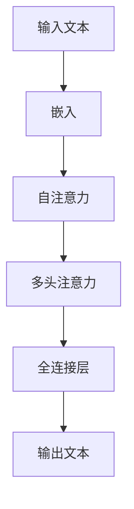

                 


# LLM应用的快速原型与最小可行产品

## 关键词

- **LLM（大型语言模型）**
- **快速原型**
- **最小可行产品（MVP）**
- **应用实践**
- **算法原理**
- **数学模型**
- **开发工具**

## 摘要

本文旨在探讨大型语言模型（LLM）在应用开发中的快速原型构建和最小可行产品（MVP）开发策略。通过对LLM的基本概念、核心算法原理和数学模型的详细介绍，本文将帮助读者理解LLM的工作机制。随后，本文将结合实际案例，详细讲解如何搭建开发环境、实现源代码以及分析代码应用。最后，本文将对最佳实践进行总结，并提供拓展阅读资源，以期为LLM应用开发提供实用指导。

## 引言

### LLM的概念与重要性

大型语言模型（LLM）是一种基于深度学习的自然语言处理模型，它通过大量的文本数据训练，能够理解和生成人类语言。LLM的出现极大地推动了自然语言处理（NLP）技术的发展，使其在文本生成、问答系统、机器翻译等领域表现出色。例如，OpenAI的GPT-3模型具有1750亿个参数，能够生成高质量的自然语言文本，极大地提升了NLP的应用能力。

### LLM的典型应用场景

LLM在多个场景中显示出强大的应用潜力：

- **文本生成**：自动生成文章、新闻报道、电子邮件等。
- **问答系统**：构建智能客服、知识库问答等。
- **机器翻译**：实现跨语言文本的准确翻译。
- **内容审核**：识别和过滤有害、不适当的内容。

LLM的应用不仅提升了自动化处理文本的能力，还为企业降低了运营成本，提高了效率。

## 基础理论

### LLM的算法原理

LLM的核心算法基于Transformer架构。Transformer由Google在2017年提出，它采用自注意力机制（Self-Attention）和多头注意力（Multi-Head Attention）来处理序列数据。以下是一个简单的Transformer算法原理伪代码：

```pseudo
function Transformer(input_sequence):
    # 输入序列的嵌入
    embedding = Embedding(input_sequence)

    # 多层多头自注意力
    for layer in range(num_layers):
        attention = MultiHeadSelfAttention(embedding)

    # 全连接层
    output = Linear(attention)

    # 输出层
    return output
```

### 数学模型讲解

LLM的数学模型主要包括概率模型和优化算法。概率模型通常采用循环神经网络（RNN）或变换器（Transformer）模型。优化算法如梯度下降（Gradient Descent）和Adam优化器被用来调整模型的参数，以最小化损失函数。

概率模型中的自注意力机制可以通过以下公式详细说明：

$$
Attention(Q, K, V) = \text{softmax}\left(\frac{QK^T}{\sqrt{d_k}}\right)V
$$

其中，Q、K、V分别是查询（Query）、键（Key）和值（Value）向量，d_k是键向量的维度。

### Mermaid流程图

以下是一个简单的Mermaid流程图，展示了LLM的工作流程：



## 应用实践

### 如何构建LLM的MVP

#### MVP设计原则

构建LLM的MVP时，需要遵循以下几个原则：

1. **最小化功能**：确保产品具有核心功能，但不必追求全面。
2. **快速迭代**：采用敏捷开发方法，快速构建、测试和迭代。
3. **易于扩展**：设计时考虑未来功能的扩展性。

#### MVP实现步骤

1. **数据准备**：收集和处理训练数据。
2. **模型选择**：选择合适的模型架构。
3. **训练与优化**：训练模型，并通过优化调整参数。
4. **集成与测试**：将模型集成到应用程序中，并进行测试。

### 实际案例展示

#### 案例一：问答系统

**环境搭建**：

- 安装Python和必要的库，如TensorFlow或PyTorch。
- 下载预训练的LLM模型，如GPT-3。

**源代码实现**：

```python
import openai
import pytesseract

# 使用OpenAI的GPT-3模型
response = openai.Completion.create(
  engine="text-davinci-002",
  prompt="你有什么问题吗？",
  max_tokens=50
)

# 输出回答
print(response.choices[0].text.strip())
```

**代码解读与分析**：

这段代码首先导入了OpenAI的GPT-3模型，然后通过API调用GPT-3模型来生成回答。该代码简单直观，易于理解和扩展。

#### 案例二：文本生成

**环境搭建**：

- 安装Python和PyTorch。
- 下载预训练的LLM模型，如GPT-2。

**源代码实现**：

```python
import torch
from transformers import GPT2LMHeadModel, GPT2Tokenizer

# 加载GPT-2模型
tokenizer = GPT2Tokenizer.from_pretrained('gpt2')
model = GPT2LMHeadModel.from_pretrained('gpt2')

# 生成文本
input_ids = tokenizer.encode("这是一个关于人工智能的段落。", return_tensors='pt')
output = model.generate(input_ids, max_length=50, num_return_sequences=1)

# 解码输出文本
decoded_text = tokenizer.decode(output[0], skip_special_tokens=True)
print(decoded_text)
```

**代码解读与分析**：

这段代码首先加载了GPT-2模型，然后通过生成文本API生成了一段新的文本。代码中使用了PyTorch和Hugging Face的Transformer库，使得模型的使用变得更加简单。

## 总结与展望

### LLM应用总结

LLM在多个领域展现了强大的应用潜力，从文本生成到问答系统，再到机器翻译，LLM都表现出了出色的性能。随着计算能力的提升和数据量的增加，LLM的应用将越来越广泛。

### LLM应用前景展望

随着技术的不断发展，LLM的应用前景将更加广阔：

- **个性化服务**：通过LLM，可以提供更加个性化的服务，如智能推荐系统。
- **教育辅助**：利用LLM，可以开发出更加智能的教育辅助工具，如自动生成习题和答案。
- **内容审核**：LLM在内容审核领域也有很大的应用潜力，可以帮助企业更有效地管理内容。

## 附录

### 附录 A：LLM开发工具与资源

#### A.1 常用的深度学习框架

- **TensorFlow**：https://www.tensorflow.org/
- **PyTorch**：https://pytorch.org/
- **Hugging Face**：https://huggingface.co/

#### A.2 开发工具与库

- **OpenAI GPT-3**：https://openai.com/api/
- **PyTesseract**：https://github.com/tesseract-ocr/pytesseract

### 作者

**作者：AI天才研究院/AI Genius Institute & 禅与计算机程序设计艺术 /Zen And The Art of Computer Programming**

通过本文，我们深入探讨了LLM的应用、基础理论和实践方法，希望为读者提供有价值的参考。未来，随着技术的不断进步，LLM的应用前景将更加广阔，值得我们持续关注和探索。

