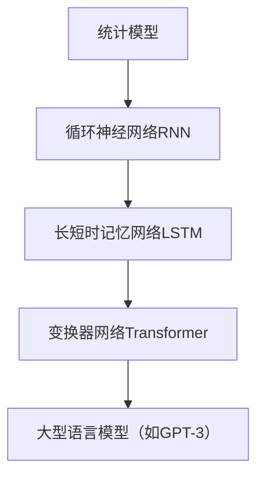

                 

好的，我们将按照您提供的大纲和约束条件，逐步构建文章内容。以下是我们构建文章的第一步，包括文章标题、关键词和摘要：

# 文章标题
LLM应用的快速部署与回滚策略

> 关键词：大型语言模型（LLM），快速部署，回滚策略，人工智能，机器学习，深度学习

> 摘要：
本文将探讨大型语言模型（LLM）的快速部署与回滚策略。首先，我们将介绍LLM的基础理论，包括概念、历史背景、架构和数学基础。接着，我们通过案例分析，展示LLM在不同领域的应用实例。随后，我们将详细阐述LLM的快速部署流程、部署策略和性能优化方法。最后，本文将探讨回滚策略的概念、实施方法及其优化，并提供全流程部署与回滚实践案例。通过本文，读者将能够深入了解LLM的部署与回滚策略，掌握其在实际应用中的最佳实践。

接下来，我们将按照大纲逐步细化每一部分的内容。由于字数限制，我们将每个章节的详细内容分为几个小节来编写。在每个小节中，我们将涵盖背景介绍、核心概念与联系、核心算法原理讲解、数学模型与公式、举例说明、项目实战、最佳实践 tips、小结和注意事项等内容。

**第一部分：基础理论**

## 第1章：LLM概述与背景

### 1.1 LLM的概念与历史

在构建第1章的1.1小节内容时，我们将介绍LLM的基本概念，包括其定义、起源和发展历程。我们将简要回顾LLM的发展历史，从最初的统计模型到现代深度学习模型的演变过程。

**核心概念与联系：**
我们将使用Mermaid流程图展示LLM的发展历程，包括各个阶段的主要模型和算法。

### 1.2 LLM的优势与挑战

在这一小节中，我们将讨论LLM的优势，例如其在自然语言处理（NLP）任务中的强大能力，以及其在生成文本、翻译、问答系统等方面的应用。同时，我们也将探讨LLM面临的挑战，如计算资源需求、数据偏见和模型可解释性等问题。

### 1.3 LLM在行业中的应用现状

我们将简要介绍LLM在各个行业中的应用现状，包括但不限于金融、医疗、教育、娱乐和客服等领域。通过案例分析，我们将展示LLM如何帮助企业提升效率、降低成本和改善用户体验。

接下来，我们将继续细化第1章的剩余部分，并逐步扩展到其他章节。请随时提供反馈，以便我们在构建过程中进行调整和优化。

**第二部分：快速部署**

## 第5章：部署前准备

### 5.1 硬件与软件需求

在这一小节中，我们将讨论部署LLM所需的硬件和软件环境。我们将介绍常见的硬件配置，如CPU、GPU和TPU，以及相应的软件环境，包括操作系统、编程语言和深度学习框架。

### 5.2 数据集准备与处理

我们将详细讲解如何准备和预处理用于训练和部署LLM的数据集。这包括数据收集、清洗、标注和分割等步骤。我们将提供一些常用的数据处理工具和库，如Pandas、NumPy和Scikit-learn。

### 5.3 环境配置与调试

在这一小节中，我们将介绍如何配置和调试LLM的部署环境。我们将涵盖环境搭建的步骤，如安装深度学习框架、配置网络和调整超参数。此外，我们还将讨论如何解决常见的配置问题，以提高部署效率。

**第三部分：回滚策略**

## 第8章：回滚策略概述

### 8.1 回滚的概念与目的

我们将定义回滚策略的概念，解释其在LLM部署中的作用。我们将讨论回滚的目的，包括纠正错误、优化性能和降低风险等。

### 8.2 回滚的挑战与策略

在这一小节中，我们将探讨回滚策略面临的挑战，如数据一致性、事务管理和版本控制。我们将介绍一些常见的回滚策略，如基于日志的回滚、基于快照的回滚和增量回滚。

### 8.3 回滚流程

我们将详细描述回滚策略的实施流程，包括预检查、执行回滚和验证回滚效果等步骤。我们将提供具体的实施方法和实践指导，以帮助读者在实际部署中应用回滚策略。

**第四部分：综合应用**

## 第11章：全流程部署与回滚实践

### 11.1 快速部署案例

在这一节中，我们将通过一个实际案例，展示如何快速部署LLM。我们将详细介绍部署流程、所需资源和关键步骤，以及如何优化部署效率。

### 11.2 回滚案例

我们将通过另一个实际案例，展示如何在LLM部署中实施回滚策略。我们将详细介绍回滚的动机、实施步骤和效果评估，以帮助读者理解回滚策略的实际应用。

### 11.3 实践总结与展望

最后，我们将对全流程部署与回滚实践进行总结，讨论所遇到的挑战和解决方案。我们将展望LLM部署与回滚策略的未来发展方向，并提供一些最佳实践和建议。

在完成以上内容的构建后，我们将对整篇文章进行审核和优化，确保其内容完整、逻辑清晰且具有实际应用价值。如果您有任何具体的修改意见或要求，请随时告知，我们将根据您的反馈进行调整。

**下一步行动计划：**

1. 继续细化第1章剩余部分，包括第2节和第3节。
2. 开始构建第2部分的内容，特别是第5章。
3. 撰写第3部分的内容，重点是第8章。
4. 开始撰写第4部分的内容，特别是第11章。

我们将确保在每个小节中包含必要的背景介绍、核心概念与联系、核心算法原理讲解、数学模型与公式、举例说明、项目实战、最佳实践 tips、小结和注意事项等内容。同时，我们将确保文章结构清晰、逻辑连贯，以帮助读者更好地理解和应用相关知识。如果您对当前的进度有任何反馈，请随时告知，以便我们及时调整计划。

