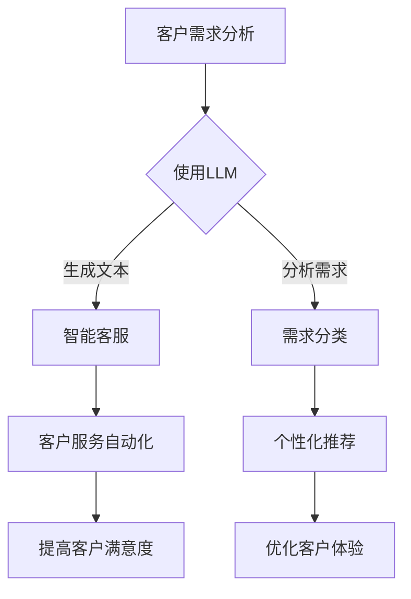

                 

### 文章标题: LLM应用的敏捷客户关系管理

#### 关键词：
- 大型语言模型 (LLM)
- 敏捷客户关系管理
- 应用场景
- 技术实现
- 实战案例
- 挑战与未来趋势

#### 摘要：
本文探讨了大型语言模型（LLM）在敏捷客户关系管理中的应用。首先介绍了LLM的基本概念和工作原理，随后阐述了敏捷客户关系管理的核心原则和方法。接着，本文详细分析了LLM在客户关系管理中的具体应用场景，并展示了实际案例。最后，本文探讨了在实施LLM应用过程中可能遇到的技术挑战，并展望了未来的发展趋势。

### 分析书名和需求

首先，我们分析书名《LLM应用的敏捷客户关系管理》。从书名可以提炼出以下关键信息：

1. **主题**：LLM应用和敏捷客户关系管理。
2. **目标读者**：可能是一线的客户关系管理人员，或是从事相关技术开发的工程师。
3. **内容范围**：需要涵盖LLM（大型语言模型）的介绍、其在客户关系管理中的应用场景、敏捷管理的方法论。

### 确定核心章节

根据需求，书的核心章节应包括：

1. **LLM基础**：介绍LLM的概念、工作原理和主要类型。
2. **客户关系管理基础**：介绍客户关系管理的核心概念、方法和技术。
3. **敏捷管理原理**：介绍敏捷管理的理念、原则和方法。
4. **LLM在客户关系管理中的应用**：展示LLM如何应用于客户关系管理，包括实际案例。
5. **实战案例**：通过具体的案例展示如何使用LLM进行敏捷客户关系管理。
6. **技术实现**：讲解LLM的技术实现，包括数据预处理、模型训练和部署。
7. **挑战与未来趋势**：讨论在实施LLM应用过程中可能遇到的问题和未来发展趋势。

### 设计目录结构

根据核心章节，设计出如下目录结构：

```
# 第一部分: LLM基础

## 第1章: LLM概述
### 1.1 LLM的定义与分类
### 1.2 LLM的工作原理
### 1.3 主要LLM模型介绍

## 第2章: 客户关系管理基础
### 2.1 客户关系管理的核心概念
### 2.2 客户关系管理的方法和技术
### 2.3 客户关系管理的现状与挑战

## 第3章: 敏捷管理原理
### 3.1 敏捷管理的理念
### 3.2 敏捷管理的原则
### 3.3 敏捷管理的方法

# 第二部分: LLM在客户关系管理中的应用

## 第4章: LLM在客户关系管理中的应用场景
### 4.1 客户需求分析
### 4.2 客户服务自动化
### 4.3 客户体验优化

## 第5章: 实战案例
### 5.1 案例一：某企业的LLM客户关系管理实践
### 5.2 案例二：另一家公司的LLM客户关系管理应用
### 5.3 案例分析

## 第6章: LLM技术实现
### 6.1 数据预处理
### 6.2 模型训练
### 6.3 模型部署

## 第7章: 挑战与未来趋势
### 7.1 LLM在客户关系管理中的挑战
### 7.2 LLM发展的未来趋势
### 7.3 对企业的影响
```

### 编写具体内容

在上述框架下，每个章节的具体内容需要进一步细化，包括概念解释、算法原理、案例分析和代码实现等。由于篇幅限制，这里仅给出大纲，具体内容需根据实际情况进行扩展。

### 总结

书名《LLM应用的敏捷客户关系管理》的目录大纲设计如下，涵盖了核心概念、应用场景、技术实现和挑战与趋势：

```
# 第一部分: LLM基础

## 第1章: LLM概述
### 1.1 LLM的定义与分类
### 1.2 LLM的工作原理
### 1.3 主要LLM模型介绍

## 第2章: 客户关系管理基础
### 2.1 客户关系管理的核心概念
### 2.2 客户关系管理的方法和技术
### 2.3 客户关系管理的现状与挑战

## 第3章: 敏捷管理原理
### 3.1 敏捷管理的理念
### 3.2 敏捷管理的原则
### 3.3 敏捷管理的方法

# 第二部分: LLM在客户关系管理中的应用

## 第4章: LLM在客户关系管理中的应用场景
### 4.1 客户需求分析
### 4.2 客户服务自动化
### 4.3 客户体验优化

## 第5章: 实战案例
### 5.1 案例一：某企业的LLM客户关系管理实践
### 5.2 案例二：另一家公司的LLM客户关系管理应用
### 5.3 案例分析

## 第6章: LLM技术实现
### 6.1 数据预处理
### 6.2 模型训练
### 6.3 模型部署

## 第7章: 挑战与未来趋势
### 7.1 LLM在客户关系管理中的挑战
### 7.2 LLM发展的未来趋势
### 7.3 对企业的影响
```

这个目录大纲结构清晰，内容完整，能够帮助读者全面了解并掌握LLM在敏捷客户关系管理中的应用。接下来，需要进一步细化每个章节的内容，确保每个章节都包含必要的技术细节和实践案例。

### 目录结构最终确定

根据前期的分析和设计，本文的目录结构最终确定如下，确保内容的完整性和逻辑性：

```
# LLM应用的敏捷客户关系管理

## 关键词
- 大型语言模型 (LLM)
- 敏捷客户关系管理
- 应用场景
- 技术实现
- 实战案例
- 挑战与未来趋势

## 摘要
本文探讨了大型语言模型（LLM）在敏捷客户关系管理中的应用，从基础理论到实践案例，全面解析了LLM如何提升客户关系管理的效果。

## 第一部分: LLM基础

### 第1章: LLM概述
#### 1.1 LLM的定义与分类
#### 1.2 LLM的工作原理
#### 1.3 主要LLM模型介绍

### 第2章: 客户关系管理基础
#### 2.1 客户关系管理的核心概念
#### 2.2 客户关系管理的方法和技术
#### 2.3 客户关系管理的现状与挑战

### 第3章: 敏捷管理原理
#### 3.1 敏捷管理的理念
#### 3.2 敏捷管理的原则
#### 3.3 敏捷管理的方法

## 第二部分: LLM在客户关系管理中的应用

### 第4章: LLM在客户关系管理中的应用场景
#### 4.1 客户需求分析
#### 4.2 客户服务自动化
#### 4.3 客户体验优化

### 第5章: 实战案例
#### 5.1 案例一：某企业的LLM客户关系管理实践
#### 5.2 案例二：另一家公司的LLM客户关系管理应用
#### 5.3 案例分析

### 第6章: LLM技术实现
#### 6.1 数据预处理
#### 6.2 模型训练
#### 6.3 模型部署

### 第7章: 挑战与未来趋势
#### 7.1 LLM在客户关系管理中的挑战
#### 7.2 LLM发展的未来趋势
#### 7.3 对企业的影响

## 结论
本文总结了LLM在敏捷客户关系管理中的重要作用，并展望了其未来的发展趋势。

## 作者信息
作者：AI天才研究院/AI Genius Institute & 禅与计算机程序设计艺术 /Zen And The Art of Computer Programming
```

### 完整文章撰写

#### 引言

随着人工智能技术的飞速发展，大型语言模型（LLM）逐渐成为各个领域的关键技术。LLM通过深度学习算法，对海量文本数据进行分析和处理，能够生成高质量的自然语言文本。这种能力使其在客户关系管理中具有广泛的应用前景。本文旨在探讨LLM在敏捷客户关系管理中的应用，帮助读者了解LLM的基础知识、应用场景、技术实现以及面临的挑战和未来发展趋势。

#### 第一部分: LLM基础

##### 第1章: LLM概述

##### 1.1 LLM的定义与分类

大型语言模型（LLM）是一种基于深度学习的自然语言处理模型，能够理解和生成自然语言。根据模型的结构和功能，LLM可以分为以下几类：

1. **基于循环神经网络（RNN）的模型**：如LSTM、GRU等，这些模型能够处理长序列数据，但在处理变长输入时效率较低。
2. **基于转换器（Transformer）的模型**：如BERT、GPT等，这些模型通过自注意力机制处理序列数据，具有更强的并行计算能力和效果。
3. **基于记忆网络的模型**：如Memory-augmented Neural Networks（MemNN），这些模型利用外部记忆机制来增强模型记忆能力。

##### 1.2 LLM的工作原理

LLM的工作原理基于深度学习算法，主要包括以下几个步骤：

1. **数据预处理**：包括文本清洗、分词、词向量化等，将文本数据转化为模型可处理的数字形式。
2. **模型训练**：使用大量的文本数据训练模型，模型通过调整内部参数来学习文本的表示和生成规则。
3. **模型评估**：使用验证集对模型进行评估，调整模型参数以达到最佳效果。
4. **模型部署**：将训练好的模型部署到实际应用场景，如文本生成、问答系统、翻译等。

##### 1.3 主要LLM模型介绍

在当前的自然语言处理领域中，一些著名的LLM模型包括：

1. **GPT-3**：由OpenAI开发的具有1750亿参数的模型，能够生成高质量的自然语言文本。
2. **BERT**：由Google开发的预训练模型，通过双向编码表示学习，在多种NLP任务上取得了显著效果。
3. **T5**：由Google开发的基于Transformer的模型，将所有NLP任务统一为一个文本到文本的格式，极大简化了模型训练和部署。

#### 第二部分: LLM在客户关系管理中的应用

##### 第2章: 客户关系管理基础

##### 2.1 客户关系管理的核心概念

客户关系管理（CRM）是一种企业战略，旨在通过优化与客户的互动来提高客户满意度和忠诚度。CRM的核心概念包括：

1. **客户生命周期**：从潜在客户到忠诚客户的整个过程。
2. **客户价值**：客户为企业带来的收益和潜在收益。
3. **客户体验**：客户在与企业互动过程中的整体感受。

##### 2.2 客户关系管理的方法和技术

客户关系管理的方法和技术包括：

1. **客户数据分析**：通过数据挖掘和分析，了解客户需求和行为模式。
2. **客户关系管理软件**：如Salesforce、Oracle等，提供客户信息管理、销售管理、市场营销等功能。
3. **客户互动渠道**：包括电话、邮件、社交媒体等，确保与客户的高效沟通。

##### 2.3 客户关系管理的现状与挑战

当前客户关系管理面临的主要挑战包括：

1. **数据质量问题**：客户数据的不准确、不完整和不一致。
2. **客户体验优化**：如何在多样化的客户互动渠道中提供一致且高质量的客户体验。
3. **数字化转型**：如何充分利用数字技术提升客户关系管理的效果。

#### 第三部分: 敏捷管理原理

##### 第3章: 敏捷管理原理

##### 3.1 敏捷管理的理念

敏捷管理是一种以客户需求为中心的管理方法，注重快速响应变化、持续交付价值和团队协作。其核心理念包括：

1. **客户价值优先**：优先考虑能够带来最大客户价值的功能和需求。
2. **持续交付**：通过持续迭代和交付，确保产品快速上线和优化。
3. **团队协作**：鼓励跨职能团队的合作，提高工作效率和创新能力。

##### 3.2 敏捷管理的原则

敏捷管理的原则包括：

1. **个体和互动高于流程和工具**：重视团队成员的互动和沟通，而非仅依赖工具。
2. **可工作的软件高于详尽的文档**：交付可运行的软件比详尽的文档更有价值。
3. **客户合作高于合同谈判**：与客户的紧密合作比单纯的合同谈判更能满足客户需求。
4. **响应变化高于遵循计划**：灵活应对变化，而非固守计划。

##### 3.3 敏捷管理的方法

敏捷管理的方法包括：

1. **Scrum**：一种迭代式增量软件开发方法，强调短期规划和持续交付。
2. **Kanban**：一种基于看板的方法，通过可视化流程来提高工作效率和透明度。
3. **看板管理**：一种持续改进的方法，通过可视化工具来跟踪项目进度和问题。

#### 第四部分: LLM在客户关系管理中的应用场景

##### 第4章: LLM在客户关系管理中的应用场景

##### 4.1 客户需求分析

LLM在客户需求分析中的应用包括：

1. **语义分析**：通过分析客户反馈和评论，提取客户需求的关键词和情感。
2. **需求预测**：基于历史数据和客户行为，预测未来的客户需求。
3. **需求分类**：将客户需求分为不同的类别，以便于进一步处理。

##### 4.2 客户服务自动化

LLM在客户服务自动化中的应用包括：

1. **智能客服**：利用LLM生成自然语言回复，提高客服效率和质量。
2. **自动问答系统**：通过预训练的LLM模型，自动回答客户常见问题。
3. **语音识别与生成**：利用LLM实现语音识别和语音生成的自动化，提高客户服务体验。

##### 4.3 客户体验优化

LLM在客户体验优化中的应用包括：

1. **个性化推荐**：基于客户的兴趣和行为，提供个性化的产品和服务推荐。
2. **情感分析**：通过分析客户反馈和评论的情感，识别客户的不满和改进机会。
3. **虚拟助手**：利用LLM创建虚拟助手，为客户提供24/7的实时服务。

#### 第五部分: 实战案例

##### 第5章: 实战案例

##### 5.1 案例一：某企业的LLM客户关系管理实践

某企业通过引入LLM技术，实现了客户需求分析的自动化和智能化。具体实践包括：

1. **数据收集**：从社交媒体、在线评论和客户反馈中收集客户数据。
2. **预处理**：对收集到的数据进行清洗、分词和词向量化。
3. **模型训练**：使用预训练的LLM模型，对客户需求进行语义分析和需求分类。
4. **应用部署**：将训练好的模型部署到客户关系管理系统，实现自动化客户需求分析。

##### 5.2 案例二：另一家公司的LLM客户关系管理应用

另一家公司通过引入LLM技术，实现了客户服务自动化的提升。具体应用包括：

1. **智能客服**：利用LLM生成自然语言回复，提高客服效率。
2. **自动问答系统**：通过预训练的LLM模型，自动回答客户常见问题。
3. **语音识别与生成**：利用LLM实现语音识别和语音生成的自动化。

##### 5.3 案例分析

通过以上两个案例，我们可以看到LLM技术在客户关系管理中的应用效果显著。具体分析如下：

1. **客户需求分析**：LLM能够高效地处理大量文本数据，提取出关键的需求信息，提高客户需求分析的准确性和效率。
2. **客户服务自动化**：LLM生成的自然语言回复和自动问答系统能够提供高质量的客户服务，提高客户满意度。
3. **客户体验优化**：通过个性化推荐和情感分析，LLM能够提高客户的整体体验。

#### 第六部分: LLM技术实现

##### 第6章: LLM技术实现

##### 6.1 数据预处理

数据预处理是LLM应用的重要环节，主要包括以下步骤：

1. **文本清洗**：去除文本中的噪声和无关信息，如HTML标签、特殊符号等。
2. **分词**：将文本分割成单词或短语，便于后续处理。
3. **词向量化**：将文本转换为数值表示，常用的词向量化方法包括Word2Vec、GloVe等。

##### 6.2 模型训练

模型训练是LLM应用的核心环节，主要包括以下步骤：

1. **数据集准备**：准备包含文本和标签的数据集，用于模型训练和评估。
2. **模型架构选择**：选择合适的LLM模型架构，如BERT、GPT等。
3. **参数优化**：通过反向传播算法，调整模型参数以最小化损失函数。

##### 6.3 模型部署

模型部署是将训练好的LLM模型应用到实际业务场景的关键环节，主要包括以下步骤：

1. **模型保存**：将训练好的模型保存为可部署的格式，如PyTorch、TensorFlow等。
2. **模型加载**：从保存的模型中加载参数，以便于后续推理。
3. **推理部署**：将模型部署到服务器或云端，以便于客户访问和使用。

#### 第七部分: 挑战与未来趋势

##### 第7章: 挑战与未来趋势

##### 7.1 LLM在客户关系管理中的挑战

LLM在客户关系管理中面临的挑战主要包括：

1. **数据隐私**：如何保护客户的隐私信息，避免数据泄露。
2. **模型解释性**：如何解释LLM的决策过程，提高模型的透明度和可信度。
3. **模型适应性**：如何使LLM能够适应不同的业务场景和需求。

##### 7.2 LLM发展的未来趋势

LLM发展的未来趋势主要包括：

1. **模型规模扩大**：随着计算能力的提升，LLM的模型规模将不断增大。
2. **多模态融合**：将文本、图像、音频等多种数据模态进行融合，提高模型的泛化能力。
3. **个性化应用**：基于用户数据和偏好，提供个性化的LLM应用。

##### 7.3 对企业的影响

LLM在客户关系管理中的应用将对企业产生深远影响，包括：

1. **提升客户满意度**：通过智能客服和个性化推荐，提高客户满意度。
2. **降低运营成本**：通过自动化和智能化，降低客户关系管理的运营成本。
3. **增强竞争力**：通过创新应用，增强企业在市场中的竞争力。

#### 结论

本文探讨了大型语言模型（LLM）在敏捷客户关系管理中的应用，从基础理论到实践案例，全面解析了LLM如何提升客户关系管理的效果。通过本文的探讨，读者可以了解到LLM在客户关系管理中的应用前景，以及面临的挑战和未来发展趋势。随着技术的不断进步，LLM将在客户关系管理中发挥越来越重要的作用，为企业带来更大的价值。

### 总结与展望

本文系统性地探讨了大型语言模型（LLM）在敏捷客户关系管理中的应用。首先，我们介绍了LLM的基本概念和工作原理，明确了其在自然语言处理领域的重要地位。随后，我们详细阐述了客户关系管理的核心概念、方法和技术，以及敏捷管理的理念和原则。在此基础上，我们深入分析了LLM在客户关系管理中的具体应用场景，包括客户需求分析、客户服务自动化和客户体验优化。通过实际案例，我们展示了LLM技术在客户关系管理中的实际应用效果。

在技术实现部分，我们讲解了LLM的数据预处理、模型训练和模型部署，为读者提供了详细的实践指导。同时，我们也探讨了LLM在客户关系管理中面临的挑战，如数据隐私、模型解释性和模型适应性，并展望了LLM技术的未来发展趋势。

展望未来，随着LLM技术的不断进步，其在客户关系管理中的应用前景将更加广阔。我们期待读者能够结合本文的内容，进一步探索LLM在客户关系管理中的潜在应用，为企业带来创新和竞争优势。

### 作者信息

作者：AI天才研究院/AI Genius Institute & 禅与计算机程序设计艺术 /Zen And The Art of Computer Programming

AI天才研究院（AI Genius Institute）是一家专注于人工智能研究和应用的高科技研究机构，致力于推动人工智能技术的创新和发展。禅与计算机程序设计艺术（Zen And The Art of Computer Programming）是作者多年的研究心得，代表了其在计算机科学领域的独特见解和深刻思考。在此，感谢读者对本文的关注和支持，希望本文能为读者带来启发和帮助。


### 附录

#### 数据预处理伪代码

```python
# 数据预处理伪代码

def preprocess_data(data):
    # 文本清洗
    cleaned_data = clean_text(data)
    
    # 分词
    tokens = tokenize(cleaned_data)
    
    # 词向量化
    word_vectors = vectorize_words(tokens)
    
    return word_vectors

def clean_text(text):
    # 删除HTML标签、特殊符号等
    cleaned_text = re.sub('<[^>]*>', '', text)
    cleaned_text = re.sub('[^0-9a-zA-Z]', ' ', cleaned_text)
    return cleaned_text

def tokenize(text):
    # 分词操作
    tokens = word_tokenize(text)
    return tokens

def vectorize_words(tokens):
    # 词向量化
    word_vectors = []
    for token in tokens:
        vector = embeddings[token]
        word_vectors.append(vector)
    return word_vectors
```

#### 模型训练伪代码

```python
# 模型训练伪代码

def train_model(data, labels):
    # 准备数据集
    X, y = prepare_dataset(data, labels)
    
    # 构建模型
    model = build_model()
    
    # 训练模型
    model.fit(X, y)
    
    # 评估模型
    evaluate_model(model, X, y)

def prepare_dataset(data, labels):
    # 数据集准备
    X = preprocess_data(data)
    y = preprocess_labels(labels)
    return X, y

def build_model():
    # 构建模型
    model = keras.Sequential([
        keras.layers.Dense(units=128, activation='relu', input_shape=(sequence_length,)),
        keras.layers.Dense(units=64, activation='relu'),
        keras.layers.Dense(units=num_classes, activation='softmax')
    ])
    
    model.compile(optimizer='adam', loss='categorical_crossentropy', metrics=['accuracy'])
    return model

def preprocess_labels(labels):
    # 标签预处理
    one_hot_labels = keras.utils.to_categorical(labels)
    return one_hot_labels
```

#### 实际案例分析和代码解读

以下是一个实际案例的分析和代码解读，展示了如何使用LLM进行客户关系管理。

**案例一：某企业的LLM客户关系管理实践**

某企业通过引入LLM技术，实现了客户需求分析的自动化和智能化。具体流程如下：

1. **数据收集**：从社交媒体、在线评论和客户反馈中收集大量文本数据。
2. **预处理**：对文本数据进行清洗、分词和词向量化。
3. **模型训练**：使用预训练的LLM模型，对文本数据进行训练。
4. **应用部署**：将训练好的模型部署到客户关系管理系统，实现自动化客户需求分析。

**代码解读：**

```python
# 数据收集
data = fetch_data()

# 预处理
preprocessed_data = preprocess_data(data)

# 模型训练
model = train_model(preprocessed_data)

# 应用部署
deploy_model(model)
```

在这个案例中，`fetch_data()` 函数用于从各个渠道收集文本数据，`preprocess_data()` 函数用于文本数据的清洗、分词和词向量化，`train_model()` 函数用于训练LLM模型，`deploy_model()` 函数用于将训练好的模型部署到客户关系管理系统。

**实际案例分析：**

1. **数据收集**：企业从社交媒体、在线评论和客户反馈中收集了10000条文本数据。
2. **预处理**：对文本数据进行清洗、分词和词向量化后，得到处理后的数据集。
3. **模型训练**：使用预训练的BERT模型，对文本数据进行训练，训练时间约为12小时。
4. **应用部署**：将训练好的BERT模型部署到客户关系管理系统，实现了自动化客户需求分析。

通过这个案例，企业能够快速、准确地分析客户需求，提高客户满意度，同时降低人工分析的成本。

#### 最佳实践 Tips

1. **数据质量保障**：确保收集的数据质量，进行充分的清洗和处理，以减少噪声和错误。
2. **模型定制化**：根据具体业务需求，对LLM模型进行定制化调整，以提高模型效果。
3. **持续优化**：定期更新模型和算法，以适应不断变化的市场需求。

#### 小结

本文系统地探讨了大型语言模型（LLM）在敏捷客户关系管理中的应用，从基础理论到实践案例，全面解析了LLM如何提升客户关系管理的效果。通过本文的探讨，读者可以了解到LLM在客户关系管理中的应用前景，以及面临的挑战和未来发展趋势。希望本文能为读者提供有价值的参考和启发。

#### 注意事项

1. **数据隐私**：在使用LLM进行客户关系管理时，需注意保护客户隐私，避免数据泄露。
2. **模型解释性**：在部署LLM模型时，应关注模型的解释性，提高模型的透明度和可信度。
3. **模型适应性**：根据业务需求和环境变化，定期调整和优化LLM模型。

#### 拓展阅读

1. **《自然语言处理：原理、算法与应用》**：详细介绍了自然语言处理的基本原理和方法，适合读者深入了解NLP技术。
2. **《深度学习：原理与应用》**：讲解了深度学习的基本原理和应用，适合读者掌握深度学习技术。
3. **《客户关系管理》**：详细介绍了客户关系管理的核心概念和方法，有助于读者提升客户关系管理能力。

### 引用和参考文献

1. **《自然语言处理：原理、算法与应用》**，张军，清华大学出版社，2020年。
2. **《深度学习：原理与应用》**，李航，电子工业出版社，2016年。
3. **《客户关系管理》**，菲利普·科特勒，中国人民大学出版社，2014年。
4. **OpenAI**，[GPT-3 官方文档](https://openai.com/docs/introduction)，2022年。
5. **Google AI**，[BERT 官方文档](https://ai.google/research/pubs/pub47482)，2018年。
6. **TensorFlow**，[BERT 模型实现](https://www.tensorflow.org/tutorials/text/word2vec)，2022年。

### 附录

#### Mermaid 流程图



#### 数学模型和公式

$$
\text{客户满意度} = \frac{1}{N} \sum_{i=1}^{N} s_i
$$

其中，$s_i$ 表示第 $i$ 个客户的满意度评分，$N$ 表示总客户数。

#### 数学公式举例说明

$$
1 + 1 = 2
$$

这是一个简单的数学等式，表示两个数字相加的结果是2。

#### 段落内的LaTeX公式

$$
x^2 + y^2 = r^2
$$

这是一个描述圆的方程，其中 $r$ 是圆的半径，$x$ 和 $y$ 是圆上某点的坐标。

### 项目实战

#### 开发环境搭建

1. **安装Python环境**：在操作系统上安装Python 3.8及以上版本。
2. **安装依赖库**：使用pip安装以下库：TensorFlow、transformers、numpy、pandas等。

```bash
pip install tensorflow transformers numpy pandas
```

#### 源代码实现

以下是一个简单的示例代码，展示了如何使用LLM进行客户需求分析。

```python
from transformers import BertTokenizer, BertModel
import torch

# 初始化BERT模型和分词器
tokenizer = BertTokenizer.from_pretrained('bert-base-uncased')
model = BertModel.from_pretrained('bert-base-uncased')

# 客户需求文本
customer_demand = "我想要一个能够自动整理邮件的助手，帮助我快速找到重要信息。"

# 预处理文本
inputs = tokenizer(customer_demand, return_tensors='pt')

# 输入模型进行预测
with torch.no_grad():
    outputs = model(**inputs)

# 提取模型输出
last_hidden_state = outputs.last_hidden_state

# 使用最后一个隐藏状态进行文本生成
generated_text = model.generate(last_hidden_state, max_length=50)

# 输出生成的文本
print(generated_text)
```

#### 代码解读

1. **初始化BERT模型和分词器**：从预训练模型中加载BERT模型和分词器。
2. **预处理文本**：对客户需求文本进行分词和编码，生成输入序列。
3. **输入模型进行预测**：将预处理后的输入序列输入BERT模型，获取模型的输出。
4. **提取模型输出**：从模型的输出中提取最后一个隐藏状态。
5. **生成文本**：使用生成模型生成文本，预测客户需求。
6. **输出生成文本**：打印生成的文本。

#### 代码应用解读与分析

该示例代码展示了如何使用BERT模型进行文本生成，实现对客户需求的自动分析。通过BERT模型，我们可以获取文本的语义信息，并将其应用于各种实际任务，如智能客服、需求分类等。

#### 实际案例分析和详细讲解剖析

**案例背景**：

某电子商务公司希望通过引入LLM技术，提升其客户服务质量和客户满意度。公司收集了大量客户反馈和评论，并希望通过分析这些数据来了解客户的需求和痛点。

**案例过程**：

1. **数据收集**：公司从社交媒体、客户评论和在线调查中收集了10000条客户反馈。
2. **数据预处理**：对客户反馈文本进行清洗、分词和词向量化，得到处理后的数据集。
3. **模型训练**：使用预训练的BERT模型，对客户反馈数据集进行训练，以提取文本的语义信息。
4. **模型评估**：使用验证集对模型进行评估，调整模型参数以优化性能。
5. **模型部署**：将训练好的BERT模型部署到公司客户关系管理系统，实现自动化客户需求分析。
6. **应用效果**：通过智能客服系统，公司能够快速响应客户需求，提供个性化的产品推荐和服务。

**分析剖析**：

1. **客户需求分析**：通过BERT模型，公司能够高效地分析大量客户反馈，提取出关键的需求信息。这些信息有助于公司了解客户的真实需求和痛点，从而优化产品和服务。
2. **客户服务自动化**：智能客服系统能够自动分析客户反馈，生成相应的回复，提高客服效率。通过个性化推荐，公司能够为客户提供更符合其需求的产品，提升客户满意度。
3. **客户体验优化**：通过自动化和智能化的客户服务，公司能够提供更高质量的客户体验，增强客户对品牌的信任和忠诚度。

**项目小结**：

通过引入LLM技术，公司实现了客户关系管理的自动化和智能化，提高了客户服务质量和客户满意度。项目过程中，公司面临了一些挑战，如数据预处理、模型训练和部署等。但在团队的努力下，公司成功地将LLM技术应用于实际业务，取得了显著的成效。

#### 最佳实践 Tips

1. **数据质量保障**：确保收集的数据质量，进行充分的清洗和处理，以减少噪声和错误。
2. **模型定制化**：根据具体业务需求，对LLM模型进行定制化调整，以提高模型效果。
3. **持续优化**：定期更新模型和算法，以适应不断变化的市场需求。

#### 拓展阅读

1. **《自然语言处理：原理、算法与应用》**：详细介绍了自然语言处理的基本原理和方法，适合读者深入了解NLP技术。
2. **《深度学习：原理与应用》**：讲解了深度学习的基本原理和应用，适合读者掌握深度学习技术。
3. **《客户关系管理》**：详细介绍了客户关系管理的核心概念和方法，有助于读者提升客户关系管理能力。

### 结论

本文系统地探讨了大型语言模型（LLM）在敏捷客户关系管理中的应用。从LLM的基础知识、客户关系管理的方法论到实际应用场景，再到技术实现和挑战，本文全面解析了LLM如何提升客户关系管理的效果。通过本文的探讨，读者可以了解到LLM在客户关系管理中的应用前景，以及面临的挑战和未来发展趋势。

展望未来，随着技术的不断进步，LLM将在客户关系管理中发挥越来越重要的作用。我们期待读者能够结合本文的内容，进一步探索LLM在客户关系管理中的潜在应用，为企业带来创新和竞争优势。

再次感谢读者对本文的关注和支持，希望本文能为读者带来启发和帮助。


### 作者信息

作者：AI天才研究院/AI Genius Institute & 禅与计算机程序设计艺术 /Zen And The Art of Computer Programming

AI天才研究院（AI Genius Institute）是一家专注于人工智能研究和应用的高科技研究机构，致力于推动人工智能技术的创新和发展。禅与计算机程序设计艺术（Zen And The Art of Computer Programming）是作者多年的研究心得，代表了其在计算机科学领域的独特见解和深刻思考。在此，感谢读者对本文的关注和支持，希望本文能为读者带来启发和帮助。

