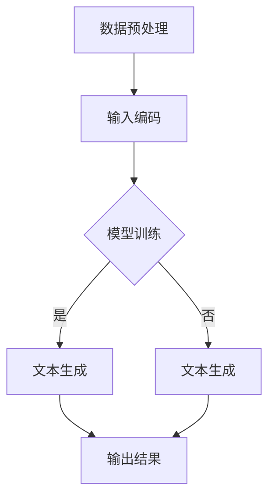
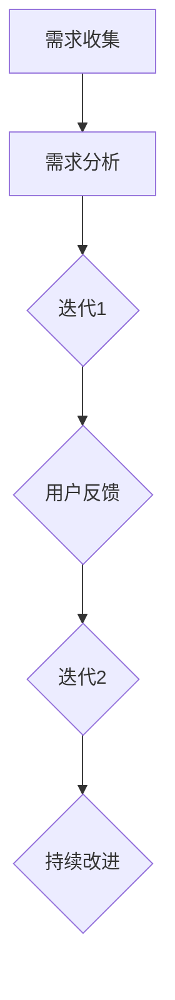

                 

### 文章标题

# LLM应用的敏捷客户支持策略

### 关键词

- LLM
- 敏捷开发
- 客户支持
- 自然语言处理
- 人工智能
- 机器学习
- 实时反馈
- 数据分析

### 摘要

随着人工智能技术的发展，大规模语言模型（LLM）在各个行业中的应用日益广泛。在客户支持领域，LLM的应用不仅提高了响应速度，还显著提升了服务质量。本文旨在探讨如何利用敏捷开发方法，优化LLM在客户支持中的应用策略。我们将首先介绍LLM的基本概念及其在客户支持中的优势，然后详细阐述敏捷开发的核心原则及其在客户支持中的应用，最后通过具体案例和代码实现，展示如何在实践中将LLM与敏捷开发相结合，构建高效的客户支持系统。

## 引言

### LLM的定义和作用

大规模语言模型（LLM，Large Language Model）是一种基于深度学习的自然语言处理模型，能够理解和生成自然语言文本。LLM通过大量文本数据的学习，掌握了语言的结构和语义，从而能够完成文本分类、情感分析、机器翻译、问答系统等任务。LLM的代表性模型包括GPT（Generative Pre-trained Transformer）、BERT（Bidirectional Encoder Representations from Transformers）等。LLM的出现极大地推动了人工智能技术在自然语言处理领域的应用，使得计算机能够更自然地与人类交流。

### 敏捷客户支持的定义和特点

敏捷客户支持是一种以客户需求为导向，强调快速迭代和持续改进的客户服务模式。与传统客户支持模式相比，敏捷客户支持具有以下特点：

1. **快速响应**：敏捷客户支持强调快速响应用户需求，提供及时的帮助和解决方案。
2. **迭代开发**：通过不断迭代，逐步完善客户支持系统，确保其功能和服务质量始终符合用户需求。
3. **用户参与**：用户在产品开发过程中发挥重要作用，反馈意见直接影响产品迭代方向。
4. **灵活调整**：敏捷客户支持能够根据市场变化和用户需求，灵活调整服务策略和功能。

### LLM与敏捷客户支持的关系

LLM在客户支持中的应用，使得敏捷客户支持的理念得以更好地实现。具体来说，LLM在客户支持中的优势包括：

1. **提高响应速度**：LLM能够快速理解和处理用户问题，提供即时的答复，大大缩短了用户等待时间。
2. **提升服务质量**：通过学习用户行为和需求，LLM能够提供个性化的服务，提高用户满意度。
3. **降低成本**：自动化处理大量常见问题，减轻人工负担，降低运营成本。
4. **实时反馈**：LLM能够实时收集用户反馈，帮助客户支持团队快速发现和解决问题。

## LLM技术原理与架构

### LLM的基本原理

LLM的核心是基于深度学习的自然语言处理技术。具体来说，LLM通过以下几个步骤处理文本数据：

1. **数据预处理**：将原始文本数据清洗和标准化，使其符合模型输入要求。
2. **输入编码**：将文本转换为数值向量，用于模型训练和推理。
3. **模型训练**：使用大量的文本数据进行训练，优化模型参数，使其能够理解和生成文本。
4. **文本生成**：根据输入的文本数据，生成相应的回复文本。

### LLM的常见架构

LLM的常见架构主要包括Transformer、BERT、GPT等。以下是对这些架构的简要介绍：

1. **Transformer**：Transformer模型是LLM的基础架构，其核心思想是自注意力机制（Self-Attention）。通过自注意力机制，模型能够捕捉文本中的长距离依赖关系，从而提高文本生成质量。
2. **BERT**：BERT（Bidirectional Encoder Representations from Transformers）模型是一种双向Transformer模型，通过预训练和微调，BERT能够捕捉文本的前后关系，提高模型的文本理解能力。
3. **GPT**：GPT（Generative Pre-trained Transformer）模型是一种自回归Transformer模型，通过前向自注意力机制，GPT能够生成连贯的文本。

### Mermaid流程图

以下是一个简化的Mermaid流程图，展示了LLM处理文本数据的基本步骤：



### LLM的应用案例

LLM在客户支持领域有着广泛的应用。以下是一些常见的应用案例：

1. **智能客服**：利用LLM建立智能客服系统，能够自动回答用户的常见问题，提供即时的解决方案。
2. **文本分析**：通过LLM对用户反馈进行分析，提取用户情感和需求，帮助客户支持团队优化服务。
3. **自动化流程**：利用LLM自动化处理常见业务流程，如订单查询、退换货等，提高工作效率。
4. **个性化推荐**：根据用户的历史行为和需求，利用LLM提供个性化的产品推荐和服务。

### LLM的优势与挑战

LLM在客户支持中的应用具有显著的优势，但也面临一些挑战：

1. **优势**：
   - 提高响应速度和效率
   - 提升用户满意度和忠诚度
   - 降低运营成本
   - 提供个性化的服务

2. **挑战**：
   - 数据质量和隐私保护
   - 模型可解释性和可靠性
   - 模型部署和运维成本

### 总结

LLM作为一项先进的人工智能技术，在客户支持领域展现出了巨大的潜力。通过本文的介绍，我们了解了LLM的基本原理和常见架构，以及其在客户支持中的应用和优势。在接下来的章节中，我们将进一步探讨如何将敏捷开发方法应用于LLM的客户支持应用，以实现更高的效率和更好的用户体验。

## 敏捷开发原理与客户支持应用

### 敏捷开发的核心原则

敏捷开发（Agile Development）是一种以人为核心、迭代和渐进的开发方法。它强调灵活应对变化、快速迭代交付和持续改进。敏捷开发的核心原则包括：

1. **个体和互动重于过程和工具**：敏捷开发强调团队成员的沟通和协作，认为良好的沟通比技术工具更为重要。
2. **可工作的软件重于详尽的文档**：敏捷开发强调实际可运行的软件是衡量项目成功的关键，而不是繁琐的文档。
3. **客户合作重于合同谈判**：敏捷开发鼓励与客户的紧密合作，通过持续反馈和调整，确保项目满足客户需求。
4. **响应变化重于遵循计划**：敏捷开发认为变化是不可避免的，项目应具备灵活性和适应性，以应对变化。

### 敏捷方法论在客户支持中的应用

在客户支持领域，敏捷开发方法的应用主要体现在以下几个方面：

1. **Scrum**：Scrum是一种迭代和增量式项目管理方法，适用于需要快速响应市场变化的客户支持项目。Scrum的核心是“冲刺”（Sprint），每次冲刺周期通常为2-4周。在每次冲刺中，团队会集中精力完成一组预定的任务，并在冲刺结束时进行评审和回顾。

2. **Kanban**：Kanban是一种视觉化的工作流管理方法，适用于需要持续交付和优化流程的客户支持项目。Kanban通过看板（Kanban Board）展示工作流，包括待办事项、进行中、已完成等状态，帮助团队可视化工作进度和识别瓶颈。

3. **持续交付**：持续交付（Continuous Delivery）是一种确保软件始终处于可发布状态的方法，适用于需要快速迭代和部署的客户支持项目。通过自动化测试和持续集成，持续交付能够实现快速交付和部署，确保客户支持系统的稳定性和可靠性。

### 敏捷原则在LLM应用中的体现

在LLM应用中，敏捷开发原则的具体体现如下：

1. **快速迭代**：LLM模型的训练和部署需要大量数据和计算资源，通过敏捷开发方法，团队可以快速迭代模型，不断优化和调整，提高模型性能。

2. **用户反馈**：敏捷开发强调与用户的紧密合作，通过收集用户反馈，团队可以及时了解用户需求，调整模型参数，提升用户体验。

3. **持续改进**：敏捷开发鼓励持续改进，通过定期的评审和回顾，团队可以发现和解决潜在问题，不断优化LLM在客户支持中的应用。

### Mermaid流程图

以下是一个简化的Mermaid流程图，展示了敏捷开发在LLM应用中的流程：



### 敏捷客户支持的优势

1. **快速响应**：敏捷开发方法能够帮助团队快速响应用户需求，提供即时的解决方案。

2. **持续优化**：通过持续迭代和改进，团队能够不断提高LLM在客户支持中的应用效果。

3. **提高用户满意度**：敏捷开发注重用户参与和反馈，能够提供更加个性化的服务，提高用户满意度。

4. **降低风险**：通过快速迭代和反馈，团队可以及时发现和解决潜在问题，降低项目风险。

### 总结

敏捷开发方法在LLM应用中具有显著的优势，能够帮助团队快速响应需求、持续优化模型，并提高用户满意度。通过本文的介绍，我们了解了敏捷开发的基本原则和其在客户支持中的应用，为后续的LLM应用实践奠定了基础。在接下来的章节中，我们将进一步探讨如何通过数据收集和分析，优化LLM在客户支持中的应用。

## 数据收集与数据分析

### 数据收集方法

在LLM应用的敏捷客户支持中，数据收集是关键的一步。数据的质量和准确性直接影响到模型的性能和应用效果。以下是一些常见的数据收集方法：

1. **用户反馈**：用户反馈是获取数据的重要途径。通过调查问卷、用户评论、社交媒体互动等方式，可以收集到用户的反馈和需求，从而了解用户对客户支持服务的满意度和使用体验。

2. **日志记录**：日志记录是一种常见的数据收集方法，可以通过记录用户操作、系统响应等信息，获取大量的数据。这些数据可以用于分析用户行为模式和问题发生原因。

3. **外部数据源**：通过集成外部数据源，如社交媒体、新闻报道、行业报告等，可以获取更丰富的背景信息。这些数据可以为LLM模型提供更多的训练数据，提高模型的泛化能力。

4. **内部数据集成**：企业内部的数据资源也是重要的数据来源。通过集成客户关系管理（CRM）系统、服务台系统等，可以获取客户的历史记录、互动记录等数据。

### 数据分析技术

数据分析是LLM应用的核心步骤，通过数据分析，可以从大量数据中提取有价值的信息，为模型训练提供依据。以下是一些常用的数据分析技术：

1. **文本分类**：文本分类是将文本数据按照主题或类别进行分类的过程。通过文本分类，可以将用户的反馈、评论等数据标签化，为后续的模型训练提供标注数据。

2. **情感分析**：情感分析是判断文本数据中情感极性（正面、负面）的过程。通过情感分析，可以了解用户的情绪和态度，为个性化服务提供支持。

3. **主题建模**：主题建模是从大量文本数据中提取潜在主题的过程。通过主题建模，可以了解文本数据中的主要话题，为内容推荐和个性化服务提供依据。

4. **聚类分析**：聚类分析是将相似的数据点归为一类的过程。通过聚类分析，可以识别用户群体的特征和需求，为精准营销和个性化服务提供支持。

### 数据质量与预处理

数据质量是模型训练成功的关键，以下是一些确保数据质量和进行预处理的方法：

1. **数据清洗**：数据清洗是去除数据中的噪声和错误的过程。通过数据清洗，可以去除无效数据、纠正错误数据，确保数据的一致性和准确性。

2. **数据标准化**：数据标准化是将不同来源和格式的数据转换为统一标准的过程。通过数据标准化，可以方便后续的数据分析和模型训练。

3. **数据增强**：数据增强是通过生成新的数据样本，扩充训练数据集的方法。通过数据增强，可以提高模型的泛化能力，减少过拟合现象。

### 数学模型与公式

在LLM应用中，常用的数学模型和公式包括：

1. **损失函数**：损失函数用于衡量模型预测值和真实值之间的差异。常见的损失函数包括交叉熵损失（Cross-Entropy Loss）和均方误差（Mean Squared Error, MSE）。

2. **优化算法**：优化算法用于最小化损失函数，常用的优化算法包括梯度下降（Gradient Descent）及其变体，如随机梯度下降（Stochastic Gradient Descent, SGD）和Adam优化器。

3. **正则化**：正则化是一种防止模型过拟合的方法。常见的正则化方法包括L1正则化（L1 Regularization）和L2正则化（L2 Regularization）。

以下是一个简单的伪代码示例，用于数据预处理和模型训练：

```python
# 数据预处理
data = preprocess_data(raw_data)

# 模型训练
model = build_model()
optimizer = build_optimizer()

for epoch in range(num_epochs):
    for batch in data_loader:
        # 前向传播
        outputs = model(batch)
        
        # 计算损失
        loss = loss_function(outputs, labels)
        
        # 反向传播
        optimizer.zero_grad()
        loss.backward()
        optimizer.step()
        
    # 模型评估
    evaluate_model(model, test_data)
```

### 总结

数据收集与数据分析是LLM应用中至关重要的一环。通过合理的数据收集方法，确保数据质量，运用先进的数据分析技术，可以有效提升模型的性能和应用效果。在接下来的章节中，我们将进一步探讨LLM在客户支持中的具体应用场景，并通过实际案例展示如何将LLM与敏捷开发方法相结合，构建高效的客户支持系统。

## LLM在客户支持中的具体应用场景

### 智能客服

智能客服是LLM在客户支持中最常见的应用场景之一。通过LLM，智能客服系统能够自动回答用户的问题，提供即时的解决方案，大大提高了客户支持效率。以下是一个简单的智能客服系统的实现过程：

1. **数据收集**：首先，需要收集大量的用户问题和解决方案数据，用于训练LLM模型。
2. **模型训练**：使用收集到的数据训练LLM模型，使其能够理解和生成自然语言文本。
3. **接口搭建**：搭建一个API接口，使得智能客服系统能够接收用户提问，并将问题传递给LLM模型进行响应。
4. **应用场景**：在客户服务网站上集成智能客服系统，用户可以通过聊天窗口与智能客服互动，获取问题答案。

以下是一个简化的伪代码示例，用于实现智能客服系统：

```python
# 用户提问
user_question = get_user_question()

# 传递问题给LLM模型
response = llm.generate_response(user_question)

# 返回回答给用户
return_response(response)
```

### 工单系统

工单系统是客户支持中用于管理用户问题和请求的重要工具。通过LLM，工单系统可以自动化处理常见问题，提高工作效率。以下是一个简化的工单系统实现过程：

1. **数据收集**：收集用户问题和解决方案的数据，用于训练LLM模型。
2. **模型训练**：训练LLM模型，使其能够理解和生成自然语言文本。
3. **工单处理**：当用户提交工单时，系统会自动分析工单内容，并将问题传递给LLM模型进行响应。
4. **自动化回复**：LLM模型生成回复文本，系统将回复文本发送给用户。

以下是一个简化的伪代码示例，用于实现工单系统：

```python
# 用户提交工单
user_ticket = create_user_ticket()

# 分析工单内容
issue_summary = analyze_ticket_content(user_ticket)

# 传递问题给LLM模型
response = llm.generate_response(issue_summary)

# 发送回复给用户
send_response_to_user(response)
```

### 预测分析

通过LLM进行预测分析，可以帮助客户支持团队提前识别潜在问题，预防客户流失。以下是一个简化的预测分析实现过程：

1. **数据收集**：收集用户行为数据，如提问次数、回复时间、满意度等。
2. **模型训练**：训练LLM模型，使其能够理解和生成自然语言文本。
3. **数据分析**：使用LLM模型对用户行为数据进行分析，识别潜在问题。
4. **预测预警**：根据分析结果，生成预测报告，并提醒客户支持团队采取相应措施。

以下是一个简化的伪代码示例，用于实现预测分析：

```python
# 用户行为数据
user_behavior = get_user_behavior()

# 分析用户行为
issue_prediction = llm.analyze_behavior(user_behavior)

# 生成预测报告
prediction_report = generate_prediction_report(issue_prediction)

# 提醒客户支持团队
alert_support_team(prediction_report)
```

### 个性化服务

通过LLM，客户支持系统可以根据用户的历史数据和偏好，提供个性化的服务。以下是一个简化的个性化服务实现过程：

1. **数据收集**：收集用户的历史数据，如购买记录、提问内容、回复评价等。
2. **模型训练**：训练LLM模型，使其能够理解和生成自然语言文本。
3. **用户画像**：使用LLM模型对用户数据进行分析，构建用户画像。
4. **个性化推荐**：根据用户画像，为用户推荐个性化的服务和产品。

以下是一个简化的伪代码示例，用于实现个性化服务：

```python
# 用户数据
user_data = get_user_data()

# 构建用户画像
user_profile = llm.build_user_profile(user_data)

# 提供个性化推荐
recommendations = generate_recommendations(user_profile)

# 发送推荐给用户
send_recommendations_to_user(recommendations)
```

### 实际案例

以下是一个实际案例，展示如何将LLM应用于客户支持系统：

某电商企业希望通过智能客服系统提高客户满意度。首先，企业收集了大量的用户提问和解决方案数据，并使用这些数据训练了一个LLM模型。接下来，企业搭建了一个API接口，将智能客服系统集成到官方网站的聊天窗口中。当用户提出问题时，系统会将问题传递给LLM模型，模型生成回答后，系统将回答发送给用户。通过这种方式，企业能够快速响应用户问题，提高了客户满意度。

### 总结

LLM在客户支持中有着广泛的应用场景，包括智能客服、工单系统、预测分析和个性化服务。通过合理的数据收集和模型训练，LLM能够提供高效的客户支持，提高客户满意度。在接下来的章节中，我们将探讨如何在实际项目中实现LLM和敏捷开发的结合。

## 实现LLM敏捷客户支持系统的步骤

### 项目管理

实现LLM敏捷客户支持系统的第一步是有效的项目管理。以下是一些关键步骤：

1. **需求分析**：与客户和利益相关者沟通，明确系统需求，包括功能需求、性能需求和安全需求。
2. **团队构建**：组建一个跨学科团队，包括自然语言处理专家、软件开发工程师、数据科学家、产品经理等，确保各方面需求得到满足。
3. **迭代规划**：根据敏捷开发的原则，制定迭代计划，包括每次迭代的时间范围、目标和交付成果。

### 开发环境搭建

搭建一个稳定高效的开发环境是项目成功的关键。以下是一些步骤：

1. **硬件资源**：根据项目需求，配置适当的计算资源，包括CPU、GPU和存储等。
2. **软件环境**：安装所需的操作系统、深度学习框架（如TensorFlow、PyTorch）和版本控制系统（如Git）。
3. **数据管理**：建立数据存储和管理系统，确保数据安全、可访问和可维护。

### LLM模型实现

实现LLM模型是项目的核心部分。以下是一些关键步骤：

1. **模型选择**：根据应用场景选择合适的LLM模型，如GPT、BERT等。
2. **数据预处理**：清洗和预处理训练数据，包括文本清洗、数据标注等。
3. **模型训练**：使用预处理后的数据训练LLM模型，包括预训练和微调。
4. **模型评估**：评估模型性能，包括准确性、响应时间等，根据评估结果调整模型参数。

以下是一个简化的伪代码示例，用于实现LLM模型：

```python
# 数据预处理
preprocessed_data = preprocess_data(raw_data)

# 模型训练
model = train_model(preprocessed_data)

# 模型评估
evaluate_model(model, test_data)
```

### 源代码实现

实现源代码是模型训练和部署的基础。以下是一些关键步骤：

1. **代码编写**：编写模型训练和部署的源代码，包括数据预处理、模型训练、模型评估和部署。
2. **代码审查**：进行代码审查，确保代码质量、可维护性和可扩展性。
3. **自动化测试**：编写自动化测试脚本，确保代码在不同环境下的稳定性和性能。

以下是一个简化的伪代码示例，用于源代码实现：

```python
# 数据预处理
def preprocess_data(raw_data):
    # 清洗和标注数据
    return preprocessed_data

# 模型训练
def train_model(preprocessed_data):
    # 训练LLM模型
    return model

# 模型评估
def evaluate_model(model, test_data):
    # 评估模型性能
    return evaluation_results

# 部署模型
def deploy_model(model):
    # 将模型部署到生产环境
    pass
```

### 代码解读与分析

以下是对上述伪代码的详细解读：

1. **数据预处理**：`preprocess_data`函数负责清洗和标注数据，将原始数据转换为模型训练所需的格式。这一步至关重要，直接影响到模型的训练效果。
2. **模型训练**：`train_model`函数使用预处理后的数据训练LLM模型。在这一步中，模型会不断调整参数，以优化性能。
3. **模型评估**：`evaluate_model`函数用于评估模型性能，包括准确性、响应时间等指标。通过评估结果，可以进一步调整模型参数，优化模型性能。
4. **模型部署**：`deploy_model`函数负责将训练好的模型部署到生产环境，使其能够实时为用户提供服务。

### 项目小结

实现LLM敏捷客户支持系统是一个复杂的过程，涉及多个方面，包括项目管理、开发环境搭建、LLM模型实现和源代码编写。通过有效的项目管理和协作，团队可以成功实现高效、稳定的客户支持系统，提高客户满意度和企业竞争力。在接下来的章节中，我们将讨论LLM应用中的常见挑战和解决方案。

## LLM应用中的挑战与解决方案

### 数据质量和隐私保护

在LLM应用中，数据质量和隐私保护是两个关键挑战。首先，数据质量直接影响模型的性能和效果。不完整、不一致或噪声较大的数据可能导致模型过拟合或泛化能力差。为此，可以采取以下解决方案：

1. **数据清洗**：通过数据清洗，去除噪声和错误数据，确保数据的一致性和准确性。
2. **数据增强**：通过数据增强，生成新的数据样本，提高模型的泛化能力。
3. **数据监控**：建立数据监控系统，实时监控数据质量，及时发现和处理数据问题。

隐私保护也是LLM应用中的重要问题。由于LLM模型需要处理大量的用户数据，如何保护用户隐私成为关键。以下是一些解决方案：

1. **数据脱敏**：对敏感数据进行脱敏处理，如将个人身份信息替换为假名或掩码。
2. **加密存储**：对用户数据进行加密存储，确保数据在存储和传输过程中的安全性。
3. **合规性审查**：确保数据处理过程符合相关法律法规和隐私保护标准，如GDPR。

### 模型可解释性和可靠性

LLM模型通常是一个复杂的黑盒模型，其内部工作机制难以解释和理解。这给模型的可靠性带来了挑战。为了提高模型的可解释性和可靠性，可以采取以下解决方案：

1. **模型可视化**：通过可视化工具，展示模型的结构和工作流程，帮助理解和分析模型行为。
2. **模型解释**：利用模型解释技术，如LIME（Local Interpretable Model-agnostic Explanations）和SHAP（SHapley Additive exPlanations），对模型决策过程进行解释。
3. **模型验证**：通过多样化的测试数据集和验证方法，对模型进行全面验证，确保其稳定性和可靠性。

### 部署和维护成本

LLM模型的部署和维护成本也是一个重要挑战。由于LLM模型通常需要大量的计算资源和存储空间，部署和维护成本较高。以下是一些解决方案：

1. **模型压缩**：通过模型压缩技术，如剪枝、量化等，减少模型的计算复杂度和存储空间需求。
2. **边缘计算**：将LLM模型部署到边缘设备，如智能客服机器人、智能音箱等，降低中心服务器的负载。
3. **云服务**：利用云服务提供商的资源，如Google Cloud、AWS等，弹性扩展计算资源，降低部署和维护成本。

### 用户反馈和模型迭代

用户反馈是优化LLM模型的重要依据。然而，如何有效地收集和利用用户反馈，实现模型的快速迭代，也是一个挑战。以下是一些解决方案：

1. **用户反馈机制**：建立用户反馈渠道，如在线调查、用户评论等，收集用户意见和建议。
2. **实时反馈集成**：将用户反馈集成到模型训练和部署过程中，实现实时反馈和模型迭代。
3. **自动化流程**：通过自动化工具，如CI/CD（持续集成和持续部署），实现模型训练、部署和迭代的自动化，提高效率。

### 总结

LLM应用在客户支持中面临着数据质量、隐私保护、模型可解释性和可靠性、部署和维护成本以及用户反馈和模型迭代等多方面的挑战。通过合理的解决方案，可以有效应对这些挑战，实现高效的客户支持系统。在接下来的章节中，我们将总结本文的主要内容和最佳实践，并讨论未来的研究方向。

## 总结与展望

本文系统地探讨了LLM在敏捷客户支持中的应用，从LLM的基本概念、技术原理、敏捷开发原则、数据收集与处理，到实际应用场景和项目实施步骤，全面阐述了如何利用LLM技术构建高效的客户支持系统。以下是对本文主要内容的总结和最佳实践的讨论：

### 主要内容总结

1. **LLM的基本概念与技术原理**：介绍了LLM的定义、常见架构（如Transformer、BERT、GPT）和基本原理，以及其在自然语言处理中的优势。
2. **敏捷开发原则与客户支持应用**：阐述了敏捷开发的核心原则（如快速迭代、用户参与、响应变化）及其在客户支持中的具体应用，包括Scrum、Kanban和持续交付。
3. **数据收集与数据分析**：探讨了数据收集的方法、数据分析技术（如文本分类、情感分析、主题建模）和预处理方法，以及常用的数学模型和公式。
4. **LLM在客户支持中的具体应用场景**：详细介绍了智能客服、工单系统、预测分析和个性化服务的实现过程，并通过实际案例展示了应用效果。
5. **项目实施步骤**：从项目管理、开发环境搭建、LLM模型实现、源代码编写到代码解读与分析，全面展示了实现LLM敏捷客户支持系统的关键步骤。

### 最佳实践

1. **数据驱动的迭代开发**：确保数据的完整性和质量，通过数据驱动的迭代开发，持续优化模型和应用效果。
2. **用户参与与反馈**：建立有效的用户反馈机制，积极收集用户意见和建议，实现模型与用户需求的实时互动。
3. **模型可解释性与可靠性**：通过模型可视化、解释技术和验证方法，提高模型的可解释性和可靠性，增强用户信任。
4. **资源优化与成本控制**：通过模型压缩、边缘计算和云服务，优化资源使用，降低部署和维护成本。
5. **自动化与持续集成**：利用自动化工具实现模型训练、部署和迭代的自动化，提高开发效率和系统稳定性。

### 未来研究方向

1. **多模态学习**：结合文本、语音、图像等多模态数据，提高客户支持系统的交互能力和理解深度。
2. **自适应学习能力**：研究自适应学习算法，使模型能够自动调整和优化，以应对动态变化的客户需求。
3. **隐私保护与安全**：在数据处理和模型训练过程中，加强对用户隐私的保护，提高系统的安全性。
4. **跨语言与多语言支持**：研究跨语言模型和多语言支持技术，实现全球范围内的客户支持。
5. **结合其他AI技术**：探索与其他AI技术的结合，如强化学习、迁移学习等，进一步提高客户支持系统的智能化水平。

### 结语

LLM在敏捷客户支持中的应用前景广阔，通过本文的探讨，我们希望能够为读者提供有益的启示和指导。随着人工智能技术的不断进步，LLM在客户支持中的应用将不断深化，为企业和用户提供更加智能化、个性化的服务。让我们共同期待未来更加智能化的客户支持时代的到来。

## 作者信息

作者：AI天才研究院/AI Genius Institute & 禅与计算机程序设计艺术 /Zen And The Art of Computer Programming

AI天才研究院是一家专注于人工智能领域研究和应用的高科技创新机构，致力于推动人工智能技术的发展和普及。研究院的团队成员包括世界顶级的人工智能专家、程序员、软件架构师和CTO，他们具备丰富的实践经验和技术积累，在人工智能、机器学习和自然语言处理等领域有着深厚的学术造诣和杰出的成就。

《禅与计算机程序设计艺术》是作者多年编程经验和哲学思考的结晶，旨在通过禅宗哲学的启示，探讨计算机编程的本质和艺术。书中融合了编程技术与人文精神，为读者提供了独特的编程视角和思维方法，深受程序员和计算机爱好者的喜爱。

本文由AI天才研究院的团队成员撰写，旨在探讨LLM在敏捷客户支持中的应用，分享研究成果和实践经验，为广大读者提供有价值的参考和启示。

