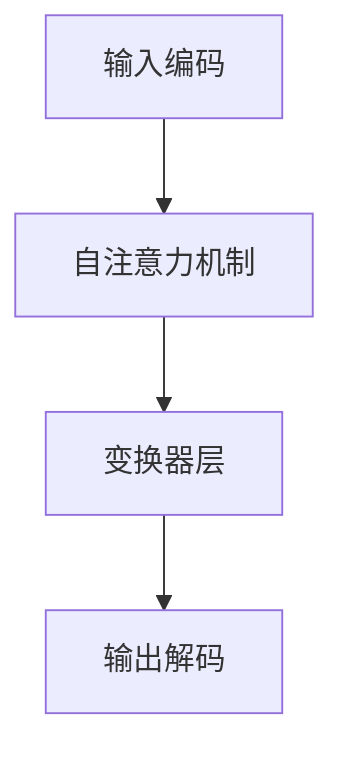

                 

### 文章标题

# LLM应用的敏捷度量指标：选择正确的KPI

### 关键词

- LLM
- 敏捷度量指标
- KPI
- 应用案例
- 最佳实践
- 技术实现

### 摘要

本文旨在探讨LLM（大型语言模型）应用中的敏捷度量指标，重点是如何选择合适的KPI（关键绩效指标）。通过分析LLM的基础理论、敏捷开发方法、以及实际应用案例，本文提供了详细的度量指标选择指南，并分享了最佳实践和实现方法。

### 引言

在现代人工智能领域，LLM（大型语言模型）已经成为自然语言处理（NLP）的核心技术。这些模型在文本生成、翻译、问答系统等方面展现出了强大的性能，但其应用效果往往受到度量指标选择的显著影响。敏捷开发方法作为一种高效的项目管理方法，强调快速迭代和持续改进，适用于不断变化的LLM应用场景。因此，如何选择并应用敏捷度量指标，成为LLM应用开发中的重要问题。

本文将围绕这一核心问题展开，首先介绍LLM的基础理论，包括其定义、特点和工作原理。随后，我们将探讨敏捷开发方法的核心原则和度量指标的重要性。接着，本文将详细介绍评估LLM性能和监控应用的关键性能指标（KPI），并通过伪代码展示选择KPI的算法示例。随后，本文将分析不同LLM应用场景下的案例，详细讨论数学模型和公式，并通过具体案例分析KPI的应用。在此基础上，本文将分享建立度量指标体系的最佳实践，讨论实施敏捷度量指标的挑战与解决方案，并介绍实现度量指标的技术框架。最后，本文将推荐相关的工具和资源，以帮助读者进一步探索这一领域。

### LLM基础

#### 定义与特点

LLM，即大型语言模型，是一种基于深度学习的自然语言处理模型，通过训练海量的文本数据，模型能够理解、生成和翻译自然语言。与传统的语言模型相比，LLM具有以下几个显著特点：

1. **大规模参数**：LLM通常包含数十亿到千亿个参数，这使得模型能够捕捉到语言中的复杂模式和规律。
2. **深度结构**：LLM采用多层神经网络结构，可以有效地学习和表示语言的层次结构。
3. **端到端学习**：LLM能够直接从原始文本数据中学习，无需手动设计特征工程。
4. **泛化能力**：通过训练海量数据，LLM能够在未见过的数据上表现出良好的泛化能力。

#### 工作原理

LLM的工作原理主要基于自注意力机制（Self-Attention）和变换器网络（Transformer）。以下是LLM的核心架构和流程：

1. **输入编码**：输入文本被预处理成向量形式，每个词汇被映射到一个高维向量。
2. **自注意力机制**：模型计算每个词汇与所有其他词汇之间的相似性权重，从而为每个词汇生成一个加权表示。
3. **变换器层**：多层变换器网络叠加，通过自注意力机制和点积注意力机制，模型逐层提取语言特征。
4. **输出解码**：模型根据训练目标，生成或预测输出文本。

#### Mermaid流程图：LLM核心架构展示

以下是一个简单的Mermaid流程图，展示了LLM的核心架构和流程：



### 敏捷开发基础

#### 核心原则

敏捷开发方法强调快速迭代、持续交付和客户满意度。其核心原则包括：

1. **个体和互动重于过程与工具**：团队成员的合作和沟通至关重要。
2. **可工作的软件重于详尽的文档**：交付可用的软件是首要任务。
3. **客户合作重于合同谈判**：与客户的紧密合作能够更好地满足需求。
4. **响应变化重于遵循计划**：项目需求和优先级往往变化，灵活应对是关键。

#### 方法论

敏捷开发方法论主要包括以下几种：

1. **Scrum**：强调短周期迭代（Sprint）和每日站立会议，以快速响应变更。
2. **Kanban**：通过可视化看板管理任务流程，持续优化流程。
3. **XP（极限编程）**：强调简单性、及时反馈和代码质量。

#### 敏捷度量指标的重要性

敏捷度量指标是评估项目健康状况和团队绩效的重要工具。对于LLM应用开发，以下是几个关键的敏捷度量指标：

1. **迭代速度**：每次迭代的交付量，反映了团队的敏捷性。
2. **缺陷率**：代码中的缺陷数量，影响产品的质量。
3. **用户满意度**：通过用户反馈评估产品是否符合用户期望。
4. **技术债务**：未完成的代码重构和优化任务，影响未来的开发效率。

### LLM应用中的敏捷度量指标

#### 评估LLM性能的指标

评估LLM性能的关键指标包括：

1. **Perplexity**：模型对生成文本的困惑度，数值越小，模型表现越好。
2. **F1 Score**：分类任务的精确率和召回率的调和平均，用于评估模型的准确性。
3. **BLEU Score**：基于记分匹配的评估指标，常用于机器翻译任务的评估。

#### 监控LLM应用的关键性能指标（KPI）

监控LLM应用的关键性能指标（KPI）包括：

1. **响应时间**：模型处理请求的时间，影响用户体验。
2. **吞吐量**：模型每秒处理的请求量，衡量系统的负载能力。
3. **准确性**：模型预测的准确性，影响应用的效果。
4. **资源利用率**：模型运行的资源消耗，如CPU、内存和带宽。

#### 选择合适的KPI

选择合适的KPI需要考虑以下几个因素：

1. **业务目标**：根据业务需求选择与目标相关的KPI。
2. **数据可用性**：选择可获取和测量的KPI。
3. **指标相关性**：确保选择的KPI能够反映模型性能和应用效果。
4. **动态调整**：根据项目进展和需求变化，适时调整KPI。

#### 伪代码：选择KPI的算法示例

以下是一个简单的伪代码示例，用于选择合适的KPI：

```python
def choose_kpi BUSINESS_GOALS, DATA_AVAILABILITY:
    if BUSINESS_GOALS == "Accuracy":
        kpi = "F1 Score"
    elif BUSINESS_GOALS == "Performance":
        kpi = "Response Time"
    elif DATA_AVAILABILITY == "High":
        kpi = "BLEU Score"
    else:
        kpi = "Perplexity"
    return kpi
```

### LLM应用案例

#### 案例研究1：文本生成应用

在一个文本生成应用中，如聊天机器人，选择合适的KPI至关重要。以下是一个具体案例：

1. **业务目标**：提高用户的满意度。
2. **数据可用性**：用户反馈和请求处理时间。
3. **指标相关性**：选择“响应时间”和“用户满意度”作为KPI。
4. **动态调整**：定期评估用户满意度，根据反馈调整KPI。

#### 案例研究2：自然语言处理应用

在自然语言处理（NLP）应用中，如情感分析，以下是一个案例：

1. **业务目标**：提高文本分类的准确性。
2. **数据可用性**：文本数据和分类标签。
3. **指标相关性**：选择“F1 Score”作为KPI。
4. **动态调整**：根据分类任务的不同，调整F1 Score的计算方法。

#### 案例研究3：语音识别应用

在语音识别应用中，以下是一个案例：

1. **业务目标**：提高语音识别的准确性。
2. **数据可用性**：语音数据和识别结果。
3. **指标相关性**：选择“准确性”和“资源利用率”作为KPI。
4. **动态调整**：根据语音输入的复杂度，调整资源分配策略。

#### 数学模型和公式：案例中应用的数学模型

以下是一个简单的数学模型，用于评估文本生成应用的用户满意度：

$$
\text{User Satisfaction} = \frac{\text{Positive Feedback}}{\text{Total Feedback}} \times 100\%
$$

#### 举例说明：具体案例分析中的KPI应用

以下是一个具体案例，说明如何在实际应用中选择和监控KPI：

1. **文本生成应用案例**：
   - **选择KPI**：响应时间和用户满意度。
   - **监控指标**：每次迭代的响应时间记录在日志中，用户满意度通过问卷调查获取。
   - **动态调整**：根据响应时间的统计结果，优化模型参数，以提高用户满意度。

### 最佳实践

#### 建立度量指标体系的步骤

1. **明确业务目标**：根据项目需求和业务目标，确定需要测量的关键指标。
2. **数据收集与处理**：确保收集到的数据准确、可靠，并进行预处理。
3. **指标定义**：为每个指标定义清晰的计算方法和阈值。
4. **监控与报告**：建立监控机制，定期生成报告，分析指标变化。

#### 实施敏捷度量指标的挑战与解决方案

1. **数据质量**：解决数据缺失、噪声和不一致问题。
   - **解决方案**：使用数据清洗和预处理技术，确保数据质量。

2. **指标相关性**：确保选择的指标与业务目标紧密相关。
   - **解决方案**：与业务团队密切合作，确保指标的选择和定义符合业务需求。

3. **动态调整**：根据项目进展和需求变化，及时调整指标。
   - **解决方案**：建立灵活的监控机制，定期评估指标的有效性。

#### 成功案例分享

以下是一个成功的LLM应用度量指标案例：

- **项目背景**：一个在线教育平台使用LLM生成个性化学习建议。
- **业务目标**：提高学生的学习效果和满意度。
- **度量指标**：响应时间、用户满意度和学习效果指标（如完成率、考试合格率）。
- **实现方法**：通过实时监控和数据分析，优化模型参数和系统性能，提高了用户满意度和学习效果。

### 技术实现

#### 实现度量指标的技术框架

1. **数据采集**：使用日志记录、API监控和实时数据流技术，采集相关数据。
2. **数据处理**：使用数据预处理、清洗和转换技术，确保数据的质量和一致性。
3. **指标计算**：使用自动化脚本和数据处理库，计算关键性能指标（KPI）。

#### 数据采集与处理

1. **数据采集**：
   - **日志记录**：使用日志收集工具（如Logstash）收集系统日志。
   - **API监控**：使用API监控工具（如Postman）定期采集API请求和响应数据。
   - **实时数据流**：使用消息队列（如Kafka）处理实时数据流。

2. **数据处理**：
   - **数据清洗**：使用Python的Pandas库清洗数据，处理缺失值、噪声和异常值。
   - **数据转换**：使用数据转换工具（如Elasticsearch）将数据格式化，以便后续计算和分析。

#### KPI计算的算法实现

以下是一个简单的KPI计算算法示例：

```python
import pandas as pd

def calculate_kpi(data):
    # 计算响应时间
    response_time = data['response_time'].mean()
    
    # 计算用户满意度
    user_satisfaction = data['user_satisfaction'].mean()
    
    # 计算准确性
    accuracy = data['accuracy'].mean()
    
    # 计算资源利用率
    resource_utilization = data['resource_utilization'].mean()
    
    return {
        'response_time': response_time,
        'user_satisfaction': user_satisfaction,
        'accuracy': accuracy,
        'resource_utilization': resource_utilization
    }
```

### 工具与资源

#### 常用LLM度量工具

1. **TensorBoard**：用于可视化训练过程中的性能指标。
2. **Scikit-learn**：提供多种机器学习算法和评估指标。
3. **Elasticsearch**：用于大规模数据索引和搜索。

#### 开源资源和框架

1. **Hugging Face**：提供丰富的预训练模型和工具。
2. **Transformers**：用于实现Transformer模型的Python库。
3. **TensorFlow**：用于构建和训练深度学习模型的框架。

#### 敏捷度量指标相关的书籍和论文

1. **《敏捷开发：实践指南》**：详细介绍了敏捷开发的方法和实践。
2. **《度量系统设计：打造高效的指标体系》**：关于度量指标设计和实施的技术书籍。
3. **相关论文**：关注顶级会议和期刊上的论文，了解最新的度量指标研究进展。

### 结论

选择合适的KPI对于LLM应用的敏捷度量至关重要。本文通过分析LLM的基础理论、敏捷开发方法、实际应用案例和最佳实践，提供了全面的度量指标选择指南。希望本文能够帮助读者在实际项目中有效应用敏捷度量指标，提升LLM应用的性能和用户体验。

### 作者信息

- **作者：AI天才研究院/AI Genius Institute & 禅与计算机程序设计艺术 /Zen And The Art of Computer Programming**

