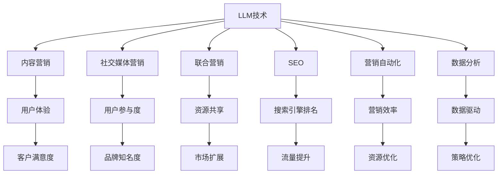

                 


# 文章标题：LLM应用的敏捷营销与推广策略

## 文章关键词：
- 语言模型（LLM）
- 敏捷营销
- 推广策略
- 内容营销
- 社交媒体营销
- 数据分析
- 持续改进

## 文章摘要：
本文旨在探讨大型语言模型（LLM）在敏捷营销与推广策略中的应用。首先，我们将对LLM的概念、发展和应用进行简要介绍，然后深入分析敏捷营销与推广策略的核心概念和原则。接着，我们将分别探讨内容营销和社交媒体营销在LLM应用中的策略和实践，并结合实际案例进行分析。最后，我们将讨论如何通过数据分析和持续改进来优化LLM的营销与推广策略。

# 引言

## 1.1 LLM应用概述

大型语言模型（LLM，Large Language Model）是近年来人工智能领域的一项重要成果。它是一种基于深度学习的自然语言处理模型，具有强大的文本生成、理解和推理能力。LLM的应用场景非常广泛，包括但不限于：智能客服、内容生成、机器翻译、文本分类、情感分析等。

### 1.1.1 什么是LLM

LLM是一种复杂的神经网络模型，通过大量的文本数据训练，使其能够理解并生成自然语言。LLM的核心是注意力机制（Attention Mechanism），它允许模型在不同的文本区域之间建立关联，从而提高模型的性能。此外，LLM通常采用预训练加微调（Pre-training and Fine-tuning）的方法，先在大规模的通用语料库上进行预训练，然后针对特定任务进行微调。

### 1.1.2 LLM的发展历史

LLM的发展可以追溯到20世纪80年代的统计语言模型。然而，由于计算资源的限制，这些早期的模型在性能上远不及现代的深度学习模型。随着计算能力的提升和深度学习技术的突破，LLM在近年来取得了飞速发展。特别是2018年，谷歌发布了BERT模型，标志着LLM进入了新的时代。此后，各种大型语言模型如GPT、T5、OPT等相继问世，不断刷新着自然语言处理的性能上限。

### 1.1.3 LLM在现代商业中的重要性

随着互联网和大数据技术的发展，企业对自然语言处理技术的需求日益增长。LLM凭借其强大的文本处理能力，为企业在营销、客户服务、内容创作等方面提供了新的解决方案。例如，LLM可以用于智能客服，提高客户响应速度和服务质量；可以用于内容生成，帮助企业快速生产高质量的文本内容；可以用于情感分析，帮助企业了解客户需求和市场趋势。因此，LLM在现代商业中的地位日益重要。

## 1.2 敏捷营销与推广策略

敏捷营销是一种以客户需求为导向、快速响应市场变化的营销策略。它强调团队协作、迭代开发和持续改进，旨在提高营销效率和效果。推广策略则是指企业通过各种渠道和手段，将产品或服务信息传达给目标客户，以实现品牌知名度和销售增长的目标。

### 1.2.1 敏捷营销的定义

敏捷营销（Agile Marketing）是一种灵活、快速响应市场变化的营销方法。它起源于软件开发领域的敏捷开发（Agile Development），并逐渐应用于营销领域。敏捷营销的核心原则包括：客户为中心、团队合作、快速迭代、持续改进。

### 1.2.2 敏捷营销与传统营销的区别

传统营销（Traditional Marketing）通常采用线性思维，按照计划、执行、监控的流程进行。而敏捷营销则强调迭代和协作，通过不断试错和优化，快速响应市场变化。具体区别如下：

1. **思维方式**：传统营销注重计划和策略，而敏捷营销注重实践和反馈。
2. **团队协作**：传统营销通常由单个部门独立完成，而敏捷营销强调跨部门协作和团队合作。
3. **响应速度**：传统营销响应市场变化的时间较长，而敏捷营销能够快速调整策略，以应对市场变化。

### 1.2.3 敏捷营销的优势

敏捷营销相较于传统营销具有以下优势：

1. **快速响应**：敏捷营销能够更快地响应市场变化，从而提高企业竞争力。
2. **提高效率**：敏捷营销通过迭代和协作，减少不必要的流程和环节，提高营销效率。
3. **客户满意度**：敏捷营销以客户需求为导向，能够更好地满足客户需求，提高客户满意度。
4. **持续改进**：敏捷营销强调持续改进，不断优化营销策略和执行，从而提高营销效果。

## 1.3 策略制定的框架与步骤

制定有效的敏捷营销与推广策略需要遵循以下框架和步骤：

### 1.3.1 市场分析

市场分析是制定策略的基础，主要包括以下几个方面：

1. **市场环境分析**：分析宏观、微观环境，了解行业趋势和市场动态。
2. **竞争分析**：分析竞争对手的产品、策略、市场占有率等，找出差距和机会。
3. **客户分析**：分析目标客户群体的特征、需求和痛点，为营销策略提供依据。

### 1.3.2 竞争分析

竞争分析旨在了解竞争对手的情况，包括：

1. **竞争对手定位**：分析竞争对手的产品定位、目标市场等。
2. **竞争对手策略**：分析竞争对手的营销策略、渠道、推广手段等。
3. **竞争优势与劣势**：分析自身与竞争对手的差距和优势，制定针对性的策略。

### 1.3.3 客户分析

客户分析是制定策略的关键，主要包括以下几个方面：

1. **客户需求**：了解目标客户的需求、痛点、期望等。
2. **客户特征**：分析目标客户的年龄、性别、收入、教育背景等特征。
3. **客户行为**：分析目标客户的行为习惯、消费习惯等。

### 1.3.4 策略制定

策略制定是制定具体可行的营销策略，包括以下几个方面：

1. **目标设定**：明确营销目标和关键指标。
2. **策略选择**：根据市场分析、竞争分析和客户分析的结果，选择合适的营销策略。
3. **资源分配**：合理分配人力、物力、财力等资源。
4. **执行计划**：制定详细的执行计划，明确责任、时间表和里程碑。

### 1.3.5 策略实施与评估

策略实施与评估是确保营销策略有效性的关键，主要包括以下几个方面：

1. **策略实施**：按照执行计划，落实营销策略的各项任务。
2. **监控与调整**：监控营销活动的执行情况，根据反馈进行调整。
3. **效果评估**：评估营销策略的效果，包括ROI、客户满意度等指标。
4. **持续优化**：根据评估结果，持续优化营销策略和执行。

### 1.4 案例研究：成功与失败的LLM应用

为了更好地理解LLM在敏捷营销与推广策略中的应用，以下我们将分析两个案例：一个是成功的案例，另一个是失败的案例。

#### 1.4.1 成功案例

**公司背景**：A公司是一家专注于智能客服系统的初创企业，其核心产品是基于LLM的智能客服机器人。

**策略制定**：A公司在制定营销策略时，首先进行了市场分析，发现智能客服系统在多个行业（如电商、金融、电信等）具有巨大需求。接着，进行了竞争分析，发现竞争对手主要依靠传统的人工客服，而A公司则强调基于LLM的智能客服系统的优势。最后，进行了客户分析，发现目标客户对智能客服系统的需求主要集中在降低成本、提高效率和提升客户满意度。

**策略实施**：A公司制定了以下策略：

1. **内容营销**：在官网和社交媒体上发布关于智能客服系统的技术博客、案例分析等，提高品牌知名度。
2. **社交媒体营销**：在LinkedIn、Twitter等社交媒体平台上发布相关内容，吸引潜在客户。
3. **合作伙伴营销**：与行业内的企业建立合作关系，共同推广智能客服系统。

**效果评估**：A公司通过以下指标评估策略效果：

1. **网站流量**：分析网站流量，了解潜在客户的数量。
2. **社交媒体互动**：统计社交媒体上的互动次数，了解用户对内容的兴趣度。
3. **客户转化率**：统计客户转化率，评估营销策略的效果。

**结果**：A公司的策略取得了显著效果，网站流量和社交媒体互动次数均有所增加，客户转化率也有所提升。

#### 1.4.2 失败案例

**公司背景**：B公司是一家专注于智能家居产品的企业，其核心产品包括智能门锁、智能照明等。

**策略制定**：B公司在制定营销策略时，首先进行了市场分析，发现智能家居市场前景广阔。接着，进行了竞争分析，发现竞争对手主要集中在硬件层面，而B公司则强调基于LLM的智能家居系统的智能化体验。最后，进行了客户分析，发现目标客户对智能家居产品的需求主要集中在便捷性、安全性和个性化。

**策略实施**：B公司制定了以下策略：

1. **内容营销**：在官网和社交媒体上发布关于智能家居系统的技术博客、案例分析等，提高品牌知名度。
2. **社交媒体营销**：在Instagram、Facebook等社交媒体平台上发布相关内容，吸引潜在客户。
3. **线上广告**：投放线上广告，扩大品牌影响力。

**效果评估**：B公司通过以下指标评估策略效果：

1. **网站流量**：分析网站流量，了解潜在客户的数量。
2. **社交媒体互动**：统计社交媒体上的互动次数，了解用户对内容的兴趣度。
3. **客户转化率**：统计客户转化率，评估营销策略的效果。

**结果**：B公司的策略并未取得预期效果，网站流量和社交媒体互动次数虽有所增加，但客户转化率却下降明显。

**原因分析**：

1. **内容质量**：B公司的内容质量较低，未能引起用户的兴趣。
2. **社交媒体选择**：B公司选择的社交媒体平台与目标客户群体不符，导致用户参与度低。
3. **线上广告**：B公司的线上广告投放策略不当，未能有效提高品牌知名度。

## 1.5 未来展望

### 1.5.1 LLM应用的未来趋势

随着人工智能技术的不断发展，LLM在营销与推广策略中的应用将更加广泛和深入。未来，LLM将具备以下趋势：

1. **智能化水平提升**：LLM的智能化水平将不断提高，能够更好地理解用户需求，提供个性化服务。
2. **多模态处理**：LLM将能够处理多种类型的数据，如图像、声音等，实现更全面的信息处理。
3. **跨界融合**：LLM将与其他技术（如大数据、区块链等）融合，形成更强大的营销与推广工具。
4. **自动化程度提高**：LLM的自动化程度将进一步提高，实现更高效的营销与推广。

### 1.5.2 面临的挑战与机遇

尽管LLM在营销与推广策略中具有巨大潜力，但同时也面临一些挑战：

1. **数据隐私**：在应用LLM时，如何保护用户隐私成为一个重要问题。
2. **模型解释性**：LLM的决策过程往往是非透明的，如何提高模型的解释性是一个挑战。
3. **技术壁垒**：开发和应用LLM需要较高的技术门槛，中小企业可能难以承担。

然而，这些挑战也带来了机遇：

1. **创新空间**：随着LLM技术的不断发展，营销与推广策略的创新空间将不断增大。
2. **市场机遇**：在LLM的推动下，营销与推广领域将出现更多新兴企业和市场机遇。
3. **技术突破**：随着研究的深入，LLM将在数据处理、算法优化等方面取得突破，为营销与推广提供更强有力的支持。

# 第二部分：LLM应用的敏捷营销策略

## 2.1 内容营销

内容营销（Content Marketing）是企业通过创建和分发有价值、相关且具有吸引力的内容，以吸引和留住目标客户，并最终实现业务增长的一种营销策略。在LLM的应用中，内容营销可以发挥重要作用，帮助企业提升品牌知名度、增强客户黏性并促进销售。

### 2.1.1 内容营销的定义

内容营销是一种以内容为核心，旨在通过内容创作、分发和优化，与目标受众建立深度联系，进而实现营销目标的方法。内容可以是文字、图片、视频、音频等多种形式，但关键在于内容的价值和质量。与传统营销相比，内容营销更注重长期、持续的影响，而非短期的销售转化。

### 2.1.2 内容营销的目标

内容营销的主要目标包括：

1. **吸引目标受众**：通过高质量的内容吸引潜在客户的关注，提升品牌知名度。
2. **建立信任**：通过有价值的内容建立与客户的信任关系，提高客户忠诚度。
3. **增加流量**：通过内容优化和推广，吸引更多用户访问网站，提高流量。
4. **促进销售**：通过内容引导用户了解产品或服务，促进销售转化。
5. **提高品牌形象**：通过高质量的内容展示企业的专业性和创新能力，提升品牌形象。

### 2.1.3 内容营销的关键要素

成功的内容营销策略需要关注以下关键要素：

1. **目标受众**：明确目标受众，了解他们的需求和痛点，为他们提供有价值的内容。
2. **内容质量**：内容是内容营销的核心，高质量的内容能够吸引和留住用户。
3. **内容类型**：多样化的内容类型，如博客文章、视频、案例研究、白皮书等，能够满足不同用户的需求。
4. **内容推广**：通过社交媒体、邮件营销、SEO等手段，将内容传播给目标受众。
5. **数据分析**：通过数据分析，了解内容的表现和用户反馈，优化内容策略。

### 2.1.4 LLM在内容营销中的应用

LLM在内容营销中的应用主要体现在以下几个方面：

1. **内容生成**：LLM可以根据给定的主题和关键词，自动生成高质量的文章、报告、博客等，帮助企业快速生产内容。
2. **内容优化**：LLM可以帮助分析用户行为和搜索习惯，优化标题、关键词和内容结构，提高内容在搜索引擎中的排名。
3. **内容个性化**：LLM可以根据用户的历史行为和偏好，生成个性化的内容推荐，提高用户的参与度和满意度。
4. **内容翻译**：LLM可以支持多语言翻译，帮助企业将内容翻译成不同语言，拓展国际市场。
5. **内容分析**：LLM可以分析大量文本数据，提取关键信息、趋势和用户反馈，为内容创作和优化提供数据支持。

### 2.1.5 内容策略制定

制定有效的内容营销策略需要遵循以下步骤：

1. **明确目标**：确定内容营销的目标，如提升品牌知名度、增加网站流量、提高销售转化等。
2. **分析受众**：了解目标受众的需求、兴趣和行为习惯，为他们提供有价值的内容。
3. **规划内容类型**：根据目标受众的需求，规划不同类型的内容，如博客文章、视频、案例研究、白皮书等。
4. **制定内容计划**：确定内容发布的时间表和频率，确保内容的连续性和稳定性。
5. **内容创作**：根据内容计划，创作高质量的内容，可以使用LLM辅助生成内容。
6. **内容推广**：通过社交媒体、邮件营销、SEO等手段，将内容传播给目标受众。
7. **数据分析与优化**：通过数据分析，评估内容的表现和用户反馈，优化内容策略。

## 2.2 内容策略制定

### 2.2.1 确定内容类型

内容类型是内容营销策略的重要组成部分。根据目标受众的需求和行业特点，可以选择以下类型的内容：

1. **博客文章**：博客文章是内容营销中最常用的类型，可以分享行业见解、专业知识、案例分析等，吸引目标受众。
2. **视频内容**：视频内容具有视觉冲击力，可以更好地传达信息，适用于产品演示、教程、访谈等。
3. **案例研究**：案例研究通过展示企业的成功案例，证明企业的实力和可靠性，有助于建立信任。
4. **白皮书**：白皮书是深入讨论某一主题的详细报告，适用于展示企业的专业性和权威性。
5. **电子书**：电子书可以系统地介绍某一主题，吸引目标受众深入了解。
6. **导购指南**：导购指南可以指导用户如何购买产品或服务，提高销售转化率。

### 2.2.2 内容创作与优化

内容创作和优化是内容营销的关键环节，以下是一些策略：

1. **主题研究**：在创作内容前，进行主题研究，了解目标受众关注的热点和话题。
2. **高质量内容**：确保内容具有高质量，提供有价值的信息和见解，避免低质量、重复的内容。
3. **SEO优化**：优化标题、关键词和内容结构，提高内容在搜索引擎中的排名，吸引更多流量。
4. **多媒体元素**：在内容中添加图片、图表、视频等多媒体元素，提高内容的吸引力和可读性。
5. **内容迭代**：根据用户反馈和数据分析，不断优化内容，提高用户体验和内容效果。

### 2.2.3 内容发布与推广

内容发布和推广是确保内容传播和影响的关键环节，以下是一些策略：

1. **多渠道发布**：将内容发布到多个渠道，如官方网站、社交媒体、博客等，扩大传播范围。
2. **社交媒体推广**：利用社交媒体平台，如LinkedIn、Twitter、Facebook等，发布内容链接，吸引关注和分享。
3. **邮件营销**：通过邮件营销，向订阅用户发送内容更新和推荐，提高内容曝光度。
4. **合作伙伴推广**：与行业合作伙伴合作，共同推广内容，扩大影响范围。
5. **内容营销自动化**：利用内容营销自动化工具，如HubSpot、Marketo等，自动化内容发布和推广流程。

## 2.3 案例研究：成功的LLM内容营销策略

### 2.3.1 案例介绍

D公司是一家提供人工智能解决方案的初创企业，其核心产品是基于LLM的智能客服系统。D公司希望通过内容营销提升品牌知名度，吸引潜在客户，并促进销售转化。

### 2.3.2 策略分析与总结

D公司的内容营销策略包括以下几个方面：

1. **主题研究**：D公司进行了深入的主题研究，发现潜在客户对人工智能在客户服务领域的应用、案例研究和技术细节感兴趣。
2. **高质量内容**：D公司利用LLM生成高质量的内容，包括技术博客、案例研究、白皮书等，内容涵盖了人工智能在客户服务、自然语言处理等领域的深入探讨。
3. **SEO优化**：D公司优化了标题、关键词和内容结构，确保内容在搜索引擎中具有较高的排名。
4. **多媒体元素**：D公司在内容中添加了图片、图表、视频等多媒体元素，提高内容的吸引力和可读性。
5. **多渠道发布**：D公司将内容发布到官方网站、LinkedIn、Twitter、Facebook等社交媒体平台，扩大传播范围。
6. **社交媒体推广**：D公司在社交媒体上发布内容链接，并利用行业合作伙伴的渠道进行推广。
7. **邮件营销**：D公司通过邮件营销向订阅用户发送内容更新和推荐。

D公司的内容营销策略取得了显著效果：

1. **网站流量增加**：通过SEO优化和多渠道发布，D公司的网站流量显著增加，吸引了大量潜在客户。
2. **社交媒体互动增加**：D公司在社交媒体上的互动次数和分享量显著增加，提高了品牌知名度。
3. **销售转化提升**：通过高质量的内容和有效的推广，D公司的销售转化率有所提升。

### 2.3.3 策略总结

D公司的案例表明，成功的LLM内容营销策略需要以下关键要素：

1. **深入的主题研究**：了解目标受众的需求和兴趣，提供有价值的内容。
2. **高质量的内容**：确保内容具有高质量，提供有价值的信息和见解。
3. **SEO优化**：提高内容在搜索引擎中的排名，吸引更多流量。
4. **多媒体元素**：提高内容的吸引力和可读性。
5. **多渠道发布与推广**：扩大内容的传播范围，提高品牌知名度。
6. **邮件营销**：与订阅用户保持联系，提高内容曝光度。

通过这些策略，D公司成功实现了品牌知名度的提升和销售转化率的提升，证明了LLM在内容营销中的巨大潜力。

## 2.4 持续改进的内容营销策略

内容营销是一个持续的过程，需要不断改进和优化，以适应市场变化和用户需求。以下是一些持续改进的内容营销策略：

1. **定期内容评估**：定期评估内容的表现，包括阅读量、点赞、分享、评论等指标，了解用户对内容的反馈，找出优势和不足。
2. **数据分析**：利用数据分析工具，分析用户的阅读习惯、搜索关键词、点击率等数据，为内容创作和优化提供依据。
3. **用户反馈**：积极收集用户反馈，了解他们对内容的评价和建议，改进内容质量和形式。
4. **内容迭代**：根据评估和反馈，对内容进行迭代和优化，提高内容的质量和效果。
5. **内容多样化**：尝试不同类型的内容，如视频、音频、案例研究、互动问答等，满足不同用户的需求。
6. **内容个性化**：根据用户的行为和偏好，提供个性化的内容推荐，提高用户参与度和满意度。

通过持续改进的内容营销策略，企业可以不断提升内容质量，优化用户体验，实现更好的营销效果。

## 第三部分：LLM应用的推广策略

### 3.1 社交媒体营销

社交媒体营销是一种通过社交媒体平台（如Facebook、Twitter、LinkedIn等）推广产品或服务，与目标受众建立联系并提高品牌知名度的营销策略。在LLM的应用中，社交媒体营销可以发挥重要作用，通过自动生成和优化内容、数据分析等手段，实现更高效的推广。

### 3.1.1 社交媒体营销的定义

社交媒体营销（Social Media Marketing）是指利用社交媒体平台进行营销活动，以吸引和互动目标受众，提升品牌知名度、增加销售和提升客户忠诚度的过程。社交媒体营销的核心在于与用户建立互动关系，通过分享、点赞、评论等社交互动，增强用户对品牌的认知和好感。

### 3.1.2 社交媒体营销的优势

1. **高覆盖度**：社交媒体平台拥有庞大的用户基础，可以帮助企业快速触达广泛的受众。
2. **互动性强**：社交媒体平台提供了多种互动方式，如评论、私信、点赞、分享等，有助于企业与用户建立紧密联系。
3. **成本低**：相较于传统广告，社交媒体营销的成本较低，尤其适合中小企业。
4. **灵活性高**：企业可以根据实时数据和用户反馈，灵活调整营销策略，快速响应市场变化。
5. **数据分析**：社交媒体平台提供了丰富的数据分析工具，帮助企业了解用户行为和效果，优化营销策略。

### 3.1.3 社交媒体营销的关键要素

1. **内容策略**：内容是社交媒体营销的核心，需要制定高质量、有吸引力的内容策略，包括文本、图片、视频等多种形式。
2. **用户互动**：与用户互动是社交媒体营销的关键，需要及时回复评论、私信，参与话题讨论等。
3. **社交媒体选择**：根据目标受众的特点，选择合适的社交媒体平台，如LinkedIn适合企业用户，Instagram适合视觉内容等。
4. **广告投放**：利用社交媒体广告，精准投放，提高品牌曝光度和转化率。
5. **数据分析**：利用社交媒体数据分析工具，跟踪和分析营销活动的效果，持续优化策略。

### 3.1.4 LLM在社交媒体营销中的应用

1. **内容生成**：LLM可以自动生成高质量的社交媒体内容，如帖子、回复、故事等，节省时间和人力成本。
2. **内容优化**：LLM可以分析用户行为和内容效果，优化标题、关键词和内容结构，提高内容的表现。
3. **广告投放**：LLM可以帮助优化广告文案和投放策略，提高广告的点击率和转化率。
4. **数据分析**：LLM可以分析社交媒体数据，提取有价值的信息，为营销策略提供数据支持。

### 3.1.5 社交媒体平台选择

1. **LinkedIn**：适合B2B营销，提供专业内容和广告投放选项，帮助企业与潜在客户建立联系。
2. **Facebook**：适合B2C营销，用户基础广泛，广告投放精准，可以创造互动和社区氛围。
3. **Twitter**：适合实时营销和品牌宣传，可以快速传播信息，提高品牌曝光度。
4. **Instagram**：适合视觉营销，通过图片和视频吸引用户，适用于产品展示和品牌宣传。
5. **TikTok**：适合年轻用户，通过短视频吸引关注，提高品牌知名度和用户参与度。

### 3.1.6 社交媒体内容创作

1. **主题选择**：根据用户兴趣和行业热点，选择有吸引力的主题，如行业趋势、产品功能、客户故事等。
2. **内容形式**：结合文本、图片、视频等多种形式，提高内容的多样性和吸引力。
3. **优化标题**：标题是吸引用户点击的关键，需要简洁、有吸引力，同时包含关键词。
4. **互动设计**：设计互动元素，如投票、问答、挑战等，提高用户参与度。
5. **内容发布**：根据用户活跃时间，合理安排内容发布时间，提高内容的曝光度和互动率。

### 3.1.7 社交媒体营销案例研究

#### 案例介绍

E公司是一家提供智能穿戴设备的初创企业，其目标是通过社交媒体营销提升品牌知名度，吸引潜在客户，并促进销售转化。

#### 策略实施

1. **内容策略**：E公司制定了一系列内容策略，包括发布产品评测、行业趋势分析、客户故事等，通过高质量的文本和视觉内容吸引用户关注。
2. **平台选择**：E公司选择了Facebook和Instagram作为主要社交媒体平台，因为这两个平台能够更好地展示产品特点和用户互动。
3. **内容发布**：E公司在Facebook上发布了一系列产品评测和行业趋势分析文章，同时在Instagram上发布产品图片和视频，提高品牌曝光度。
4. **广告投放**：E公司在Facebook上投放了定向广告，针对潜在客户进行推广，提高了广告的点击率和转化率。
5. **用户互动**：E公司积极与用户互动，回复评论、私信，参与话题讨论，建立了良好的用户关系。

#### 结果与评估

1. **品牌知名度提升**：E公司的社交媒体活动提高了品牌知名度，吸引了大量新用户关注。
2. **用户参与度提高**：通过互动设计和及时回复，E公司的用户参与度显著提高，用户在社交媒体上的互动次数和评论量增加。
3. **销售转化率提升**：通过广告投放和用户互动，E公司的销售转化率有所提升，销售业绩有所增长。

#### 策略总结

E公司的案例表明，成功的社交媒体营销策略需要以下关键要素：

1. **高质量内容**：提供有吸引力的、高质量的内容，吸引用户关注。
2. **平台选择**：根据目标受众选择合适的社交媒体平台，提高品牌曝光度。
3. **互动设计**：通过互动设计和用户互动，提高用户参与度。
4. **数据分析**：通过数据分析，了解用户行为和效果，优化营销策略。

通过这些策略，E公司成功实现了品牌知名度的提升和销售转化率的提升，证明了社交媒体营销在LLM应用中的巨大潜力。

## 3.2 联合营销

联合营销（Co-Marketing）是企业与合作伙伴（如其他企业、影响者、非营利组织等）共同开展营销活动，以扩大市场影响力、提高品牌知名度、吸引更多目标客户。在LLM的应用中，联合营销可以发挥重要作用，通过数据共享、内容共创、活动联办等方式，实现资源共享和互利共赢。

### 3.2.1 联合营销的定义

联合营销是指两个或多个企业或其他合作伙伴共同开展营销活动，通过资源共享、优势互补，实现共同的市场目标。联合营销的核心在于合作，合作伙伴之间通过合作降低成本、扩大市场影响力、提高品牌知名度。

### 3.2.2 联合营销的目标

联合营销的主要目标包括：

1. **扩大市场份额**：通过合作，企业可以触及更广泛的受众，提高市场占有率。
2. **提高品牌知名度**：合作伙伴之间的协同效应，可以增加品牌的曝光度和影响力。
3. **降低营销成本**：通过合作，企业可以共享资源和渠道，降低营销成本。
4. **提高客户满意度**：联合营销可以提供更多样化的产品和服务，提高客户满意度。
5. **提升品牌形象**：与知名品牌合作，可以提高自身的品牌形象和信誉度。

### 3.2.3 联合营销的策略

1. **数据共享**：合作伙伴之间共享用户数据，实现更精准的营销和个性化服务。
2. **内容共创**：合作伙伴共同创作内容，如联合发布报告、白皮书、博客文章等，扩大影响力。
3. **活动联办**：合作伙伴共同举办活动，如研讨会、展览、网络研讨会等，提高参与度和品牌曝光度。
4. **交叉推广**：在合作伙伴的渠道上推广对方的产品或服务，实现资源共享和互利共赢。
5. **品牌联合**：品牌之间进行联合，共同打造品牌形象，提高品牌知名度。

### 3.2.4 LLM在联合营销中的应用

1. **数据挖掘与分析**：LLM可以帮助合作伙伴挖掘和分析用户数据，实现更精准的营销和个性化服务。
2. **内容共创**：LLM可以自动生成高质量的内容，合作伙伴可以共同利用这些内容进行宣传和推广。
3. **活动策划与执行**：LLM可以协助策划和执行联合活动，如自动化活动日程安排、内容发布等。
4. **广告投放优化**：LLM可以分析广告效果，优化广告投放策略，提高广告转化率。

### 3.2.5 联合营销案例研究

#### 案例介绍

F公司与G公司是一家分别是智能家居设备和智能音响系统的企业，它们决定通过联合营销来扩大市场影响力，提高品牌知名度。

#### 策略实施

1. **数据共享**：F公司与G公司共享用户数据，分析用户需求和行为习惯，为产品开发和市场推广提供依据。
2. **内容共创**：F公司与G公司共同发布了关于智能家居系统的白皮书，介绍了如何通过智能音响系统控制智能家居设备，吸引了大量关注。
3. **活动联办**：F公司与G公司共同举办了智能家居体验活动，邀请了业内专家和媒体记者，展示了智能家居系统的优势和应用场景。
4. **交叉推广**：F公司在智能家居设备上内置了G公司的智能音响系统，而G公司在智能音响系统中集成了F公司的智能家居设备控制功能。
5. **广告投放**：F公司与G公司在对方的社交媒体渠道上投放了联合广告，提高了品牌曝光度。

#### 结果与评估

1. **品牌知名度提升**：F公司与G公司的联合营销活动提高了品牌知名度，吸引了大量潜在客户和媒体关注。
2. **用户参与度提高**：通过数据共享和活动联办，用户参与度显著提高，用户在社交媒体上的互动次数和评论量增加。
3. **销售转化率提升**：通过联合营销活动，F公司和G公司的销售转化率有所提升，销售业绩有所增长。

#### 策略总结

F公司与G公司的案例表明，成功的联合营销策略需要以下关键要素：

1. **数据共享**：通过共享用户数据，实现更精准的营销和个性化服务。
2. **内容共创**：通过共同创作高质量的内容，扩大影响力。
3. **活动联办**：通过联合活动，提高参与度和品牌曝光度。
4. **交叉推广**：通过资源共享和互利共赢，提高品牌知名度。
5. **广告投放**：通过优化广告投放策略，提高广告转化率。

通过这些策略，F公司和G公司成功实现了品牌知名度的提升和销售转化率的提升，证明了联合营销在LLM应用中的巨大潜力。

## 3.3 搜索引擎优化（SEO）

### 3.3.1 SEO的定义

搜索引擎优化（SEO，Search Engine Optimization）是一种通过优化网站结构和内容，提高网站在搜索引擎中的排名，从而获得更多免费流量和曝光度的技术。SEO的目标是提高网站的可见性和相关性，使潜在客户更容易找到网站。

### 3.3.2 SEO的核心要素

1. **关键词研究**：选择合适的关键词，是SEO成功的关键。关键词研究包括确定目标受众常用的搜索词，分析竞争程度和搜索量。
2. **网站结构优化**：合理的网站结构可以提高搜索引擎对网站内容的抓取和索引效率，包括网站导航、页面布局、URL结构等。
3. **内容优化**：高质量的内容是SEO的核心，包括标题、描述、正文、图片标签等。内容需要与目标关键词相关，并提供有价值的信息。
4. **技术优化**：技术优化包括网站的加载速度、移动适配性、安全性等，这些因素会影响用户的体验和搜索引擎的排名。
5. **外部链接建设**：外部链接（Backlinks）是搜索引擎评估网站权威性的重要指标，通过获取高质量的外部链接，可以提高网站的权重和排名。

### 3.3.3 LLM在SEO中的应用

1. **关键词研究**：LLM可以帮助分析大量文本数据，提取有价值的关键词，提高关键词研究的效率和准确性。
2. **内容生成与优化**：LLM可以自动生成高质量的内容，并优化内容结构，提高内容的相关性和搜索排名。
3. **数据分析**：LLM可以分析搜索引擎数据，了解用户搜索行为和偏好，为SEO策略提供数据支持。

### 3.3.4 SEO策略与实践

1. **关键词研究**：利用工具（如Google Keyword Planner、Ahrefs等）进行关键词研究，确定目标关键词。
2. **内容优化**：根据目标关键词，优化网站内容和页面结构，提高内容的相关性和质量。
3. **技术优化**：优化网站的加载速度、移动适配性和安全性，提高用户体验和搜索引擎排名。
4. **外部链接建设**：通过内容营销、合作伙伴关系等方式，获取高质量的外部链接。

### 3.3.5 SEO案例分析

#### 案例介绍

H公司是一家提供在线教育服务的初创企业，其目标是提高网站在搜索引擎中的排名，吸引更多潜在客户。

#### 策略实施

1. **关键词研究**：H公司通过Ahrefs等工具进行关键词研究，确定了与在线教育相关的关键词，如“在线学习”、“远程教育”等。
2. **内容优化**：H公司针对目标关键词，优化了网站首页、课程页面和博客文章，提高了内容的相关性和质量。
3. **技术优化**：H公司优化了网站的加载速度和移动适配性，提高了用户体验和搜索引擎排名。
4. **外部链接建设**：H公司通过内容营销和合作伙伴关系，获得了大量高质量的外部链接。

#### 结果与评估

1. **搜索引擎排名提升**：H公司的网站在搜索引擎中的排名显著提升，关键词的搜索排名均有所提高。
2. **网站流量增加**：通过SEO策略，H公司的网站流量显著增加，吸引了大量潜在客户。
3. **客户转化率提高**：通过优化网站内容和用户体验，H公司的客户转化率有所提高。

#### 策略总结

H公司的案例表明，成功的SEO策略需要以下关键要素：

1. **关键词研究**：选择合适的关键词，提高内容的相关性和质量。
2. **内容优化**：提供高质量、有价值的内容，吸引用户和搜索引擎。
3. **技术优化**：提高网站的技术性能和用户体验，提高搜索引擎排名。
4. **外部链接建设**：通过内容营销和合作伙伴关系，获取高质量的外部链接。

通过这些策略，H公司成功提高了网站在搜索引擎中的排名，吸引了更多潜在客户，实现了销售转化率的提升。

## 3.4 营销自动化

营销自动化（Marketing Automation）是一种利用软件工具自动执行、跟踪和分析营销活动的技术。在LLM的应用中，营销自动化可以帮助企业提高营销效率，实现更精准的客户管理和市场推广。

### 3.4.1 营销自动化的定义

营销自动化是指通过软件工具自动化营销流程，如电子邮件发送、客户分群、内容推送、数据分析等，以提高营销效率和效果。营销自动化工具可以帮助企业实现以下功能：

1. **自动化营销活动**：如自动发送欢迎邮件、生日祝福、促销通知等。
2. **客户分群**：根据用户行为、兴趣和购买历史，自动将客户分为不同的群体，实现个性化营销。
3. **内容推送**：根据客户行为和偏好，自动推送相关内容，提高客户参与度。
4. **数据分析**：自动收集和分析营销数据，为企业提供决策依据。

### 3.4.2 营销自动化的优势

1. **提高效率**：营销自动化可以自动化重复性任务，节省人力和时间成本。
2. **精准营销**：通过自动化工具，企业可以实现更精准的客户管理和市场推广。
3. **个性化体验**：自动化工具可以根据客户行为和偏好，提供个性化的内容和服务，提高客户满意度和忠诚度。
4. **数据驱动**：自动化工具可以自动收集和分析大量数据，帮助企业了解营销效果，优化营销策略。

### 3.4.3 LLM在营销自动化中的应用

1. **客户分群**：LLM可以帮助分析大量用户数据，实现更精准的客户分群。
2. **内容生成**：LLM可以自动生成个性化的营销内容，如电子邮件、社交媒体帖子等。
3. **预测分析**：LLM可以分析用户行为数据，预测客户需求和购买行为，为企业提供决策依据。
4. **对话生成**：LLM可以生成与客户的自然语言对话，提高客户服务水平。

### 3.4.4 营销自动化策略与实践

1. **客户分群策略**：根据用户行为、兴趣和购买历史，将客户分为不同的群体，实现个性化营销。
2. **内容生成策略**：利用LLM生成高质量的个性化内容，提高客户参与度和满意度。
3. **自动化邮件策略**：制定自动化邮件流程，如欢迎邮件、跟进邮件、促销邮件等，提高邮件转化率。
4. **数据分析与优化**：通过自动化工具收集和分析营销数据，持续优化营销策略。

### 3.4.5 营销自动化案例研究

#### 案例介绍

I公司是一家提供企业培训服务的初创企业，其目标是提高营销效率，实现更精准的客户管理和市场推广。

#### 策略实施

1. **客户分群**：I公司利用营销自动化工具，根据用户的行为、兴趣和购买历史，将客户分为不同群体，如“潜在客户”、“活跃客户”、“流失客户”等。
2. **内容生成**：I公司利用LLM生成个性化的培训课程介绍、促销邮件等内容，提高客户参与度和满意度。
3. **自动化邮件**：I公司制定了自动化邮件流程，如欢迎邮件、跟进邮件、促销邮件等，提高了邮件转化率。
4. **数据分析**：I公司通过营销自动化工具，自动收集和分析用户数据，了解客户需求和购买行为，优化营销策略。

#### 结果与评估

1. **营销效率提高**：通过营销自动化，I公司的营销效率显著提高，减少了重复性任务，节省了人力和时间成本。
2. **客户参与度提升**：通过个性化内容和自动化邮件，I公司的客户参与度显著提升，用户互动次数和邮件打开率增加。
3. **转化率提升**：通过精准营销和自动化邮件，I公司的销售转化率有所提高，销售额有所增长。

#### 策略总结

I公司的案例表明，成功的营销自动化策略需要以下关键要素：

1. **客户分群**：根据用户行为和兴趣，实现个性化营销。
2. **内容生成**：利用LLM生成高质量的个性化内容。
3. **自动化邮件**：制定自动化邮件流程，提高邮件转化率。
4. **数据分析**：通过数据驱动，持续优化营销策略。

通过这些策略，I公司成功实现了营销效率的提升、客户参与度的提升和销售转化率的提升，证明了营销自动化在LLM应用中的巨大潜力。

## 3.5 数据分析与优化

### 3.5.1 数据分析的重要性

数据分析在营销与推广策略中扮演着至关重要的角色。通过数据分析，企业可以深入了解用户行为、市场需求和营销效果，从而制定更精准、更有效的营销策略。以下是数据分析在营销与推广策略中的几个关键作用：

1. **用户行为分析**：了解用户在网站、应用或社交媒体上的行为，如页面访问次数、停留时间、点击率等，帮助企业优化用户体验和设计。
2. **市场需求分析**：分析市场需求和趋势，了解用户对产品或服务的需求和期望，指导产品开发和营销策略。
3. **营销效果分析**：评估不同营销活动的效果，如广告投放、促销活动、电子邮件营销等，帮助企业优化营销投入，提高ROI。
4. **竞争分析**：通过分析竞争对手的市场表现和策略，发现自身优势和不足，制定更有竞争力的营销策略。

### 3.5.2 数据分析工具的选择

选择合适的数据分析工具是确保数据分析有效性的关键。以下是一些常见的数据分析工具：

1. **Google Analytics**：一款免费的分析工具，提供网站流量、用户行为、SEO分析等功能。
2. **Tableau**：一款强大的数据可视化工具，可以帮助用户轻松创建交互式仪表板和报告。
3. **HubSpot**：一款综合性的营销平台，提供数据分析、客户管理、内容营销等功能。
4. **Marketo**：一款专业的营销自动化工具，提供数据分析、客户分群、营销活动管理等功能。
5. **Segment**：一款数据集成工具，可以帮助企业收集和分析来自多个数据源的数据。

### 3.5.3 数据分析流程

有效的数据分析通常遵循以下流程：

1. **数据收集**：收集相关的数据，包括用户行为数据、市场数据、营销数据等。
2. **数据清洗**：清洗和整理数据，确保数据的质量和完整性。
3. **数据探索**：通过数据探索，发现数据中的模式和趋势。
4. **数据可视化**：使用图表、仪表板等可视化工具，将数据转化为易于理解的图形。
5. **数据分析**：基于数据探索和可视化，进行深入的数据分析，提取有价值的信息和见解。
6. **数据报告**：撰写数据分析报告，总结分析结果和发现，为决策提供依据。

### 3.5.4 数据驱动的营销策略

数据驱动的营销策略基于数据分析的结果，通过实时调整和优化营销策略，提高营销效果。以下是一些数据驱动的营销策略：

1. **个性化营销**：根据用户数据，为不同的用户群体提供个性化的内容和优惠。
2. **A/B测试**：通过A/B测试，比较不同营销策略的效果，选择最佳方案。
3. **目标设定与追踪**：设定明确的营销目标，并实时追踪和评估目标的实现情况。
4. **ROI分析**：评估不同营销活动的投资回报率，优化营销预算和资源分配。
5. **实时调整**：根据实时数据分析，及时调整营销策略，以应对市场变化。

### 3.5.5 数据分析与优化的最佳实践

1. **持续监控与评估**：定期监控和评估营销活动的效果，确保策略的持续优化。
2. **跨部门协作**：数据分析和优化需要跨部门协作，包括市场营销、产品开发、销售等部门。
3. **数据安全与隐私**：确保数据的安全和隐私，遵守相关法律法规。
4. **数据质量**：确保数据的质量和准确性，避免数据错误和偏差。
5. **持续学习与改进**：持续关注数据分析领域的新技术和趋势，不断优化和改进数据分析策略。

通过以上最佳实践，企业可以更有效地利用数据分析，优化营销与推广策略，实现业务增长。

## 3.6 持续改进的策略

在营销与推广策略的实施过程中，持续改进是确保策略有效性和适应市场变化的关键。以下是一些持续改进的策略：

### 3.6.1 反馈循环

建立有效的反馈循环是持续改进的基础。企业需要积极收集用户、客户和团队成员的反馈，并将其纳入决策过程。以下是反馈循环的关键步骤：

1. **收集反馈**：通过问卷调查、用户访谈、社交媒体互动等方式，收集用户和客户的反馈。
2. **分析反馈**：对收集到的反馈进行分析，识别主要问题和机会。
3. **行动方案**：根据分析结果，制定具体的改进措施和行动方案。
4. **实施改进**：执行行动方案，实施改进措施。
5. **跟踪效果**：监控改进措施的效果，确保问题得到解决。

### 3.6.2 竞争分析

持续监控竞争对手的营销策略和活动是了解市场动态的重要手段。以下是竞争分析的步骤：

1. **识别竞争对手**：确定直接和间接的竞争对手。
2. **收集信息**：收集竞争对手的产品、价格、促销、广告等方面的信息。
3. **分析策略**：分析竞争对手的营销策略，了解其优势和不足。
4. **调整策略**：根据竞争对手的分析结果，调整自己的营销策略，以保持竞争优势。

### 3.6.3 持续学习

在快速变化的市场环境中，持续学习是确保营销与推广策略有效的关键。以下是持续学习的策略：

1. **关注行业趋势**：关注行业动态，了解新兴技术、市场和竞争趋势。
2. **参加培训**：参加相关领域的培训课程，提升团队成员的专业能力。
3. **分享知识**：组织内部培训或分享会，促进团队成员之间的知识交流和分享。
4. **案例研究**：研究成功和失败的案例，从他人的经验中学习。

### 3.6.4 数据驱动的决策

数据驱动的决策是确保营销与推广策略科学性和有效性的关键。以下是数据驱动的决策策略：

1. **数据收集**：收集与营销活动相关的数据，包括用户行为、市场表现等。
2. **数据分析**：对收集到的数据进行深入分析，提取有价值的信息和见解。
3. **制定策略**：基于数据分析结果，制定具体的营销策略和行动方案。
4. **实施与监控**：执行策略，并实时监控效果，确保策略的有效性。

### 3.6.5 灵活调整

市场环境和用户需求是不断变化的，因此，营销与推广策略需要具备灵活性，能够快速适应变化。以下是灵活调整的策略：

1. **定期评估**：定期评估营销策略的效果，识别需要调整的方面。
2. **快速响应**：对市场变化和用户需求做出快速响应，及时调整策略。
3. **试点测试**：在全面实施之前，进行试点测试，验证策略的有效性。
4. **迭代优化**：根据试点测试的结果，持续优化策略，提高效果。

通过以上策略，企业可以持续改进营销与推广策略，确保其在快速变化的市场环境中保持竞争力。

## 3.7 最佳实践、注意事项与拓展阅读

### 3.7.1 最佳实践

1. **内容营销**：
   - **优质内容**：确保内容具有高质量、有价值，以吸引和留住目标受众。
   - **个性化**：根据用户兴趣和需求，提供个性化的内容推荐。
   - **持续更新**：定期发布新内容，保持内容的新鲜度和吸引力。

2. **社交媒体营销**：
   - **多平台策略**：根据目标受众选择合适的社交媒体平台，实现跨平台推广。
   - **互动**：积极与用户互动，提高用户参与度和忠诚度。
   - **数据驱动**：通过数据分析，优化社交媒体营销策略。

3. **联合营销**：
   - **合作伙伴选择**：选择与自身目标受众匹配的合作伙伴，实现资源共享。
   - **互利共赢**：确保联合营销活动能够带来双方的利益，提高参与度。

4. **SEO**：
   - **关键词研究**：选择与目标受众相关的关键词，提高内容在搜索引擎中的排名。
   - **高质量内容**：提供高质量、有价值的页面内容，提高用户体验和搜索引擎排名。
   - **外部链接建设**：通过内容营销和合作伙伴关系，获取高质量的外部链接。

5. **营销自动化**：
   - **客户分群**：根据用户行为和偏好，实现个性化营销。
   - **自动化流程**：优化营销流程，提高效率。
   - **数据分析**：利用数据分析，持续优化营销策略。

### 3.7.2 注意事项

1. **数据隐私**：在应用LLM和营销策略时，确保遵守数据隐私法规，保护用户隐私。
2. **内容质量**：避免低质量、重复的内容，确保内容的质量和原创性。
3. **适应市场变化**：关注市场动态，及时调整营销策略，以适应变化。
4. **资源分配**：合理分配人力、物力和财力等资源，确保营销活动的顺利实施。

### 3.7.3 拓展阅读

1. **《敏捷营销：以客户为中心的策略与实践》**：这本书详细介绍了敏捷营销的概念、方法和实践案例。
2. **《数据驱动营销：如何利用大数据实现精准营销》**：这本书探讨了如何利用大数据进行营销策略的制定和优化。
3. **《社交媒体营销：策略、技巧与案例》**：这本书提供了丰富的社交媒体营销案例，介绍了如何在不同平台上进行有效推广。
4. **《内容营销：打造品牌影响力与客户忠诚度的策略》**：这本书深入探讨了内容营销的核心概念、方法和实践。

通过以上最佳实践、注意事项和拓展阅读，企业可以更好地应用LLM进行敏捷营销与推广，实现业务增长。

# 第四部分：综合策略与实施

## 4.1 敏捷营销流程

敏捷营销流程是确保营销活动高效执行和持续改进的关键。以下是一个典型的敏捷营销流程：

### 4.1.1 市场分析

1. **环境分析**：了解宏观、微观环境，包括经济、社会、技术等因素。
2. **竞争分析**：分析竞争对手的市场策略、产品特点、市场份额等。
3. **客户分析**：了解目标客户群体的需求、行为、偏好等。

### 4.1.2 竞争分析

1. **定位**：明确竞争对手的市场定位和目标市场。
2. **策略**：分析竞争对手的营销策略，了解其优势和劣势。
3. **优势与劣势**：评估自身与竞争对手的差距和优势，制定针对性的策略。

### 4.1.3 客户分析

1. **需求**：了解目标客户的需求、痛点、期望等。
2. **特征**：分析目标客户的年龄、性别、收入、教育背景等特征。
3. **行为**：分析目标客户的行为习惯、消费习惯等。

### 4.1.4 策略制定

1. **目标设定**：明确营销目标和关键指标。
2. **策略选择**：根据市场分析、竞争分析和客户分析的结果，选择合适的营销策略。
3. **资源分配**：合理分配人力、物力、财力等资源。
4. **执行计划**：制定详细的执行计划，明确责任、时间表和里程碑。

### 4.1.5 策略实施

1. **内容创作**：根据策略制定内容，包括博客文章、视频、案例研究等。
2. **推广**：通过社交媒体、电子邮件、广告等方式推广内容。
3. **活动策划**：组织线上线下活动，提高品牌知名度和用户参与度。

### 4.1.6 监控与调整

1. **监控**：实时监控营销活动的执行情况，包括网站流量、社交媒体互动、销售转化率等。
2. **调整**：根据监控结果，及时调整营销策略和执行计划，以应对市场变化。

### 4.1.7 效果评估

1. **评估指标**：确定评估指标，如ROI、客户满意度、品牌知名度等。
2. **数据分析**：分析营销活动的效果，识别成功和失败的方面。
3. **反馈**：将评估结果反馈给团队成员，为下一阶段的营销活动提供参考。

### 4.1.8 持续改进

1. **反馈循环**：建立反馈循环机制，收集用户、客户和团队成员的反馈。
2. **数据分析**：利用数据分析工具，持续优化营销策略和执行。
3. **学习与培训**：定期组织培训和学习，提升团队成员的专业能力和意识。

## 4.2 市场营销自动化

市场营销自动化是利用软件工具自动化营销流程，提高营销效率的一种策略。以下是一个典型的市场营销自动化流程：

### 4.2.1 营销自动化流程

1. **客户数据收集**：通过网站、社交媒体、电子邮件等渠道收集客户数据。
2. **客户分群**：根据客户数据，将客户分为不同的群体，如潜在客户、活跃客户、流失客户等。
3. **自动化邮件**：根据客户分群，发送自动化邮件，如欢迎邮件、跟进邮件、促销邮件等。
4. **内容推送**：根据客户兴趣和偏好，自动推送相关内容，如博客文章、产品介绍等。
5. **数据分析**：分析邮件打开率、点击率、转化率等数据，优化邮件内容和策略。
6. **营销活动**：自动化安排营销活动，如促销活动、网络研讨会等。
7. **反馈循环**：收集客户反馈，调整营销策略，实现持续优化。

### 4.2.2 营销自动化工具

1. **HubSpot**：一款综合性的营销自动化平台，提供客户管理、内容营销、电子邮件营销等功能。
2. **Marketo**：一款专业的营销自动化工具，提供客户分群、电子邮件营销、数据分析等功能。
3. **Pardot**：一款由Salesforce提供的营销自动化工具，提供客户管理、营销自动化、销售自动化等功能。
4. **Mailchimp**：一款电子邮件营销平台，提供自动化邮件、客户分群、数据分析等功能。

### 4.2.3 营销自动化的优势

1. **提高效率**：通过自动化工具，减少重复性劳动，节省时间和人力成本。
2. **精准营销**：根据客户数据和兴趣，实现个性化营销，提高转化率。
3. **数据驱动**：通过数据分析，优化营销策略和执行，实现持续改进。
4. **客户体验**：提供个性化的内容和优惠，提高客户满意度和忠诚度。

### 4.2.4 营销自动化的实施策略

1. **需求分析**：了解企业营销需求和目标，选择合适的营销自动化工具。
2. **数据整合**：整合客户数据和营销活动数据，建立数据仓库。
3. **流程设计**：设计自动化营销流程，明确各环节的执行步骤和责任。
4. **测试与优化**：在正式上线之前，进行测试和优化，确保自动化流程的稳定性和效果。
5. **培训与支持**：培训团队成员，确保他们熟悉并能够有效地使用自动化工具。

## 4.3 数据分析与优化

数据分析与优化是确保营销活动高效执行和持续改进的关键。以下是一个典型的数据分析与优化流程：

### 4.3.1 数据分析流程

1. **数据收集**：收集与营销活动相关的数据，包括用户行为数据、市场数据、营销效果数据等。
2. **数据清洗**：清洗和整理数据，确保数据的质量和完整性。
3. **数据探索**：通过数据探索，发现数据中的模式和趋势。
4. **数据可视化**：使用图表、仪表板等可视化工具，将数据转化为易于理解的图形。
5. **数据分析**：基于数据探索和可视化，进行深入的数据分析，提取有价值的信息和见解。
6. **数据报告**：撰写数据分析报告，总结分析结果和发现，为决策提供依据。

### 4.3.2 数据分析工具

1. **Google Analytics**：一款免费的分析工具，提供网站流量、用户行为、SEO分析等功能。
2. **Tableau**：一款强大的数据可视化工具，可以帮助用户轻松创建交互式仪表板和报告。
3. **HubSpot**：一款综合性的营销平台，提供数据分析、客户管理、内容营销等功能。
4. **Marketo**：一款专业的营销自动化工具，提供数据分析、客户分群、营销活动管理等功能。

### 4.3.3 数据分析指标

1. **网站流量**：包括访问量、访问时长、跳出率等。
2. **用户行为**：包括页面浏览次数、点击率、转化率等。
3. **营销效果**：包括邮件打开率、点击率、转化率等。
4. **客户数据**：包括客户来源、客户分群、客户生命周期价值等。

### 4.3.4 数据驱动决策

1. **目标设定**：根据数据分析结果，设定明确的营销目标。
2. **策略调整**：根据数据分析结果，调整营销策略和执行计划。
3. **A/B测试**：通过A/B测试，比较不同策略的效果，选择最佳方案。
4. **持续优化**：根据实时数据分析，持续优化营销策略和执行。

### 4.3.5 数据分析与优化的最佳实践

1. **持续监控**：定期监控营销活动的效果，及时发现问题和机会。
2. **跨部门协作**：确保数据分析结果能够被各部门理解和利用。
3. **数据安全与隐私**：确保数据的安全和隐私，遵守相关法律法规。
4. **数据质量**：确保数据的质量和准确性，避免数据错误和偏差。

## 4.4 持续学习与适应

在快速变化的市场环境中，持续学习与适应是确保营销与推广策略有效性的关键。以下是一些持续学习与适应的策略：

### 4.4.1 跨部门协作

1. **团队建设**：建立跨部门协作的团队，确保各部门之间的沟通和协作。
2. **知识共享**：定期组织内部培训和知识分享会，促进团队成员之间的知识交流和分享。
3. **共同目标**：明确团队的目标和责任，确保团队成员朝着共同的目标努力。

### 4.4.2 数据驱动

1. **数据收集**：收集与营销活动相关的数据，包括用户行为数据、市场数据、营销效果数据等。
2. **数据分析**：利用数据分析工具，对收集到的数据进行深入分析，提取有价值的信息和见解。
3. **数据报告**：撰写数据分析报告，为团队提供决策依据。
4. **数据驱动决策**：根据数据分析结果，调整营销策略和执行计划。

### 4.4.3 持续学习

1. **行业动态**：关注行业动态，了解新兴技术、市场和竞争趋势。
2. **专业培训**：参加专业培训课程，提升团队成员的专业能力和意识。
3. **案例研究**：研究成功和失败的案例，从他人的经验中学习。
4. **知识分享**：定期组织知识分享会，促进团队成员之间的知识交流和分享。

### 4.4.4 快速适应

1. **市场分析**：定期进行市场分析，了解市场变化和用户需求。
2. **快速响应**：对市场变化和用户需求做出快速响应，及时调整营销策略。
3. **试点测试**：在全面实施之前，进行试点测试，验证策略的有效性。
4. **持续改进**：根据试点测试的结果，持续优化营销策略和执行。

通过以上策略，企业可以持续学习与适应，确保营销与推广策略在快速变化的市场环境中保持有效性。

## 总结

本文详细探讨了LLM应用的敏捷营销与推广策略，包括内容营销、社交媒体营销、联合营销、SEO、营销自动化和数据分析等方面。通过深入分析每个策略的核心概念、原理和应用案例，我们了解了如何利用LLM技术提高营销效率、优化客户体验和实现业务增长。

### 核心概念与联系

以下是一个用于描述LLM应用与敏捷营销策略之间关系的Mermaid流程图：



### 核心算法原理讲解

以下是利用LLM进行文本生成的一个简化的伪代码示例：

```python
def generate_text(input_prompt, model, max_length):
    """
    利用预训练的LLM模型生成文本。

    :param input_prompt: 输入的提示文本
    :param model: 预训练的LLM模型
    :param max_length: 生成文本的最大长度
    :return: 生成的文本
    """
    # 对输入文本进行预处理
    input_ids = tokenizer.encode(input_prompt, return_tensors='pt')

    # 使用模型生成文本
    outputs = model.generate(input_ids, max_length=max_length, num_return_sequences=1)

    # 将生成的文本解码
    generated_text = tokenizer.decode(outputs[0], skip_special_tokens=True)

    return generated_text
```

### 数学模型和公式

以下是用于描述营销效果评估的一个简化的数学模型：

$$
\text{营销效果} = \frac{\text{转化率} \times \text{ROI}}{\text{成本}}
$$

其中，转化率表示营销活动引起的转化次数与参与次数的比率，ROI表示投资回报率，成本表示营销活动的总成本。

### 举例说明

假设某次营销活动的转化率为10%，ROI为3倍，成本为1000美元。根据上述数学模型，营销效果为：

$$
\text{营销效果} = \frac{0.1 \times 3}{1000} = 0.0003
$$

### 项目实战

以下是一个利用LLM进行内容营销的实战项目示例：

#### 开发环境搭建

1. 安装Python环境
2. 安装Transformer模型所需的库（如transformers、torch等）
3. 下载预训练的LLM模型（如GPT-3、BERT等）

#### 源代码实现

```python
from transformers import pipeline

# 初始化LLM模型
llm_model = pipeline("text-generation", model="gpt-3", tokenizer="gpt-3")

# 生成文本
def generate_content(prompt):
    return llm_model(prompt, max_length=50)

# 示例：生成一篇关于人工智能的博客文章
content = generate_content("人工智能在未来的发展趋势")

print(content)
```

#### 代码解读与分析

1. **模型初始化**：使用transformers库初始化预训练的LLM模型。
2. **生成文本**：调用模型的generate方法，根据输入提示生成文本。max_length参数控制生成文本的最大长度。
3. **示例应用**：生成一篇关于人工智能的博客文章。

#### 实际案例分析与详细讲解

假设某初创企业利用上述代码生成一篇关于人工智能的博客文章，并发布在社交媒体上。以下是对案例的分析：

1. **内容生成**：利用LLM生成的内容具有高质量和原创性，能够吸引读者的兴趣。
2. **用户反馈**：根据用户评论和互动，分析文章的表现和用户满意度。
3. **效果评估**：通过分析文章的阅读量、点赞、分享等指标，评估文章的营销效果。

#### 项目小结

通过本项目，企业可以快速生成高质量的内容，提高品牌知名度和用户参与度。同时，通过数据分析和效果评估，不断优化内容营销策略，实现更好的营销效果。

### 最佳实践 Tips

1. **内容质量**：确保生成的内容具有高质量、有价值，以提高用户参与度和品牌知名度。
2. **数据分析**：利用数据分析工具，实时监控和评估营销效果，为策略优化提供依据。
3. **持续学习**：关注行业动态和新技术，不断优化和改进营销策略。

### 小结

本文通过深入探讨LLM应用的敏捷营销与推广策略，为企业和营销人员提供了一种全新的营销思路和方法。通过结合LLM技术，企业可以更高效地进行内容营销、社交媒体营销、联合营销、SEO、营销自动化和数据分析，实现业务增长和客户满意度提升。

### 注意事项

1. **数据隐私**：在应用LLM和营销策略时，确保遵守数据隐私法规，保护用户隐私。
2. **内容原创性**：避免低质量、重复的内容，确保内容的原创性和价值。
3. **适应市场变化**：关注市场动态，及时调整营销策略，以应对变化。

### 拓展阅读

1. **《人工智能与营销》**：探讨人工智能在营销领域的应用和未来趋势。
2. **《敏捷营销实践指南》**：详细介绍敏捷营销的策略和方法。
3. **《数据分析：原理与应用》**：介绍数据分析的基本原理和应用方法。

作者：AI天才研究院/AI Genius Institute & 禅与计算机程序设计艺术 /Zen And The Art of Computer Programming

本文由AI天才研究院（AI Genius Institute）撰写，旨在为企业和营销人员提供一种全新的营销思路和方法。本文结合了人工智能和敏捷营销的理论和实践，深入探讨了大型语言模型（LLM）在营销与推广策略中的应用。通过详细的案例分析、算法讲解和实战项目，本文为读者提供了丰富的经验和见解。如果您对本文的内容有任何疑问或建议，欢迎在评论区留言，我们将尽快回复您。

[End of Article]

