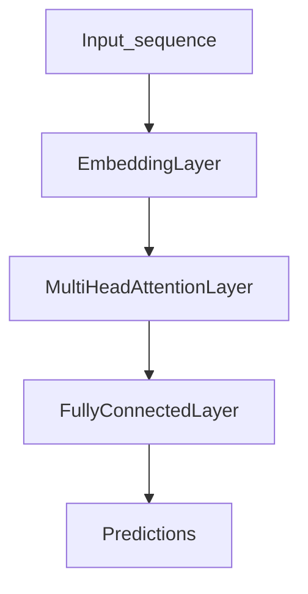

                 

### 用户输入：
# LLM应用的每日站会：保持团队同步与焦点

## 关键词
- 大型语言模型（LLM）
- 团队协作
- 每日站会
- 应用实践
- 挑战与解决方案

## 摘要
本文探讨了大型语言模型（LLM）在团队协作中的应用，重点关注每日站会这一关键机制如何帮助团队保持同步与焦点。文章首先介绍了LLM的基本概念和架构，随后详细描述了每日站会的流程和角色职责。通过案例分析，文章展示了LLM在不同行业中的应用，并讨论了可能遇到的挑战及相应的解决方案。最后，文章提供了实践指南和最佳实践，以帮助团队更有效地利用LLM进行协作。

### 引言
随着人工智能技术的迅猛发展，大型语言模型（LLM）已成为各个行业的重要工具。LLM通过深度学习算法，对海量文本数据进行训练，使其能够理解和生成人类语言。这种模型在自然语言处理、文本生成、问答系统等领域表现出色。然而，LLM的潜力不仅限于技术层面，其在团队协作中的应用同样具有重要意义。

每日站会作为一种团队同步机制，已被广泛用于敏捷开发和项目管理中。它是一种简短的会议，通常持续15-20分钟，旨在让团队成员分享进展、讨论问题和规划下一步工作。然而，当团队开始引入LLM时，每日站会的形式和内容需要相应调整，以适应这种新型技术的特点。

本文旨在探讨如何通过改进每日站会流程，帮助团队更有效地利用LLM进行协作。文章将首先介绍LLM的基本概念和架构，随后详细描述每日站会的流程和角色职责。接着，通过案例分析，我们将展示LLM在不同行业中的应用，并讨论可能遇到的挑战及相应的解决方案。最后，文章将提供实践指南和最佳实践，以帮助团队更有效地利用LLM进行协作。

### 一、大型语言模型（LLM）的基本概念

#### 1.1 定义与背景

大型语言模型（LLM）是一种深度学习模型，通过在大量文本数据上进行预训练，能够理解和生成人类语言。LLM的出现源于自然语言处理（NLP）领域的需求，随着互联网信息的爆炸式增长，如何有效地处理和理解大量文本数据成为了一个重要问题。

#### 1.2 架构与工作原理

LLM通常基于变换器架构（Transformer），这是一种基于自注意力机制的神经网络模型。变换器架构的核心是多头自注意力机制，它通过考虑输入文本中每个词与所有词之间的关系，生成一个更高级的语义表示。

伪代码如下：

```
Transformer(Input_sequence):
    # 输入序列经过嵌入层
    embeddings = EmbeddingLayer(Input_sequence)

    # 多头自注意力机制
    for layer in MultiHeadAttentionLayers:
        attention = layer(embeddings)

    # 通过全连接层进行预测
    predictions = FullyConnectedLayer(attention)

    return predictions
```

#### 1.3 应用场景

LLM在多个领域都有广泛应用，包括：

- **文本生成**：生成文章、新闻、故事等。
- **问答系统**：自动回答用户的问题。
- **机器翻译**：将一种语言的文本翻译成另一种语言。
- **情感分析**：分析文本中的情感倾向。

通过上述核心概念与联系，我们可以用Mermaid流程图来展示LLM的架构：



### 二、每日站会的流程与角色职责

#### 2.1 每日站会的定义与目的

每日站会是一种简短的会议，通常持续15-20分钟，旨在让团队成员分享进展、讨论问题和规划下一步工作。它的目的是保持团队同步、提高协作效率和及时发现并解决问题。

#### 2.2 站会流程

一个典型的每日站会流程包括以下步骤：

1. **签到**：团队成员签到，确保每个人都参与会议。
2. **个人汇报**：每个成员简要汇报昨天的工作进展、遇到的问题和今天的计划。
3. **团队讨论**：团队领导或主持人与成员讨论问题、分享见解和提供支持。
4. **任务分配**：确定今天的任务和责任人，确保工作进度。
5. **会议总结**：总结会议内容、明确下一步行动，结束会议。

#### 2.3 角色职责

- **团队成员**：参与会议、分享进展、提出问题、接受任务。
- **团队领导**：主持会议、引导讨论、解决问题、确保任务完成。
- **站会主持人**：负责签到、记录会议内容、提醒时间，确保会议顺利进行。

#### 2.4 技术辅助工具

为了提高每日站会的效率和效果，可以使用以下技术辅助工具：

- **项目管理软件**：如JIRA、Trello等，用于任务分配和跟踪。
- **视频会议工具**：如Zoom、Microsoft Teams等，用于远程协作。
- **文档共享平台**：如Google Docs、Dropbox等，用于文件共享和协作。

### 三、LLM在团队协作中的应用

#### 3.1 沟通中的LLM应用

LLM在团队沟通中的应用主要体现在自动回复、智能建议和文本摘要等方面。

1. **自动回复**：LLM可以自动生成回复，提高团队成员的沟通效率。
2. **智能建议**：LLM可以根据上下文提供相关建议，帮助团队成员更好地理解问题和解决方案。
3. **文本摘要**：LLM可以生成文本摘要，使团队成员能够快速了解关键信息。

#### 3.2 决策制定中的LLM应用

LLM在决策制定中的应用主要体现在数据分析和建议生成。

1. **数据分析**：LLM可以分析大量数据，提供决策依据。
2. **建议生成**：LLM可以根据数据分析结果，提供合理的建议。

#### 3.3 团队协作工具中的LLM集成

将LLM集成到团队协作工具中，可以提升工具的智能化水平。

1. **智能搜索**：LLM可以提供更准确的搜索结果。
2. **智能提醒**：LLM可以根据团队成员的工作进度，提供相应的提醒和通知。
3. **智能任务分配**：LLM可以根据团队成员的能力和任务需求，提供合理的任务分配建议。

### 四、LLM应用中的挑战与解决方案

#### 4.1 数据隐私与安全性

挑战：LLM在处理文本数据时，可能会涉及敏感信息，如个人隐私、商业机密等。

解决方案：

1. **数据加密**：对敏感数据进行加密处理，确保数据安全。
2. **访问控制**：设置严格的访问控制策略，确保只有授权人员可以访问敏感数据。
3. **数据脱敏**：在训练和使用LLM时，对敏感数据进行脱敏处理。

#### 4.2 模型适应性

挑战：LLM在特定领域和应用场景中可能存在适应性不足的问题。

解决方案：

1. **领域特定训练**：针对特定领域和应用场景，对LLM进行专门训练。
2. **模型融合**：将多个LLM模型进行融合，提高模型适应性。
3. **持续优化**：定期对LLM进行优化和更新，提高其在不同场景下的表现。

### 五、项目实战

#### 5.1 开发环境搭建

1. **硬件要求**：配置高性能的硬件，如GPU、CPU等。
2. **软件要求**：安装深度学习框架，如TensorFlow、PyTorch等。

#### 5.2 源代码实现与解读

1. **代码结构**：展示代码的结构和模块划分。
2. **核心算法实现**：使用伪代码详细阐述核心算法的实现。
3. **代码解读**：解释关键代码的功能和作用。

#### 5.3 代码应用解读与分析

1. **应用场景**：展示LLM在实际应用场景中的效果。
2. **性能分析**：分析LLM在不同应用场景下的性能表现。
3. **优化建议**：根据性能分析结果，提出优化建议。

#### 5.4 实际案例分析和详细讲解剖析

1. **案例背景**：介绍实际案例的背景和目标。
2. **解决方案**：展示如何利用LLM解决案例中的问题。
3. **效果评估**：评估解决方案的有效性和可行性。

#### 5.5 项目小结

1. **项目成果**：总结项目的主要成果和贡献。
2. **经验教训**：分享项目过程中遇到的问题和解决方案。
3. **未来展望**：展望LLM在团队协作中的应用前景。

### 六、最佳实践、小结与注意事项

#### 6.1 最佳实践

1. **数据准备**：确保数据的质量和多样性，以提高LLM的表现。
2. **模型选择**：根据应用场景选择合适的LLM模型。
3. **持续学习**：定期对LLM进行优化和更新，提高其在不同场景下的表现。

#### 6.2 小结

1. **LLM在团队协作中的应用**：总结LLM在团队协作中的优势和应用场景。
2. **每日站会的改进**：总结如何通过改进每日站会流程，提高团队协作效率。

#### 6.3 注意事项

1. **数据安全**：确保数据的安全性和隐私性。
2. **模型适应性**：关注LLM在不同场景下的适应性。
3. **持续优化**：定期对LLM进行优化和更新，提高其在不同场景下的表现。

### 七、拓展阅读

1. **LLM相关论文**：推荐阅读一些经典的LLM相关论文，了解最新的研究成果。
2. **团队协作工具**：介绍一些流行的团队协作工具，帮助读者更好地理解和应用LLM。
3. **相关书籍**：推荐一些关于LLM和团队协作的书籍，供读者进一步学习。

### 结论
本文探讨了大型语言模型（LLM）在团队协作中的应用，重点关注每日站会这一关键机制如何帮助团队保持同步与焦点。通过案例分析，本文展示了LLM在不同行业中的应用，并讨论了可能遇到的挑战及相应的解决方案。最后，本文提供了实践指南和最佳实践，以帮助团队更有效地利用LLM进行协作。随着人工智能技术的不断进步，LLM在团队协作中的应用前景将更加广阔，值得进一步研究和探索。

### 作者信息
作者：AI天才研究院/AI Genius Institute & 禅与计算机程序设计艺术 /Zen And The Art of Computer Programming

### 文章标题
# LLM应用的每日站会：保持团队同步与焦点

### 文章关键词
- 大型语言模型（LLM）
- 团队协作
- 每日站会
- 应用实践
- 挑战与解决方案

### 文章摘要
本文探讨了大型语言模型（LLM）在团队协作中的应用，重点关注每日站会这一关键机制如何帮助团队保持同步与焦点。通过介绍LLM的基本概念和架构，详细描述每日站会的流程和角色职责，以及案例分析，本文展示了LLM在不同行业中的应用和面临的挑战。最后，本文提供了实践指南和最佳实践，以帮助团队更有效地利用LLM进行协作。

