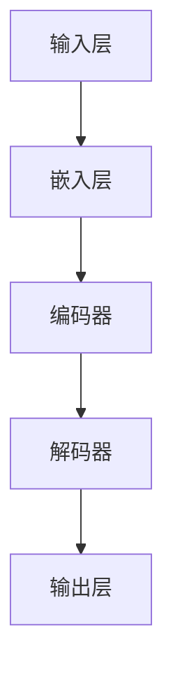
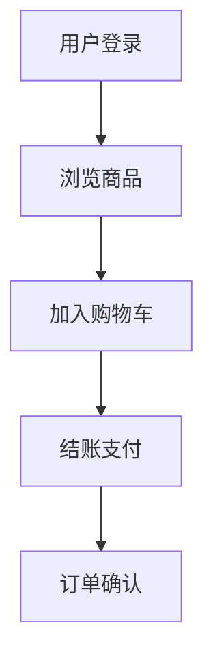
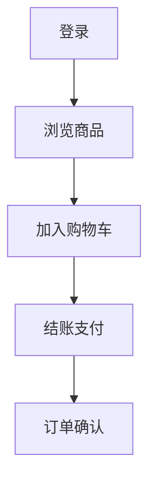
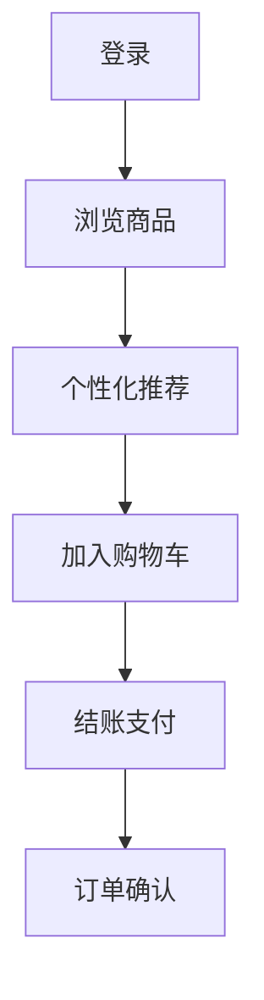
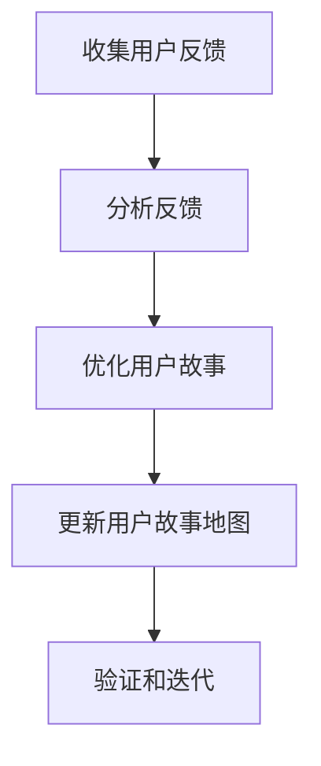
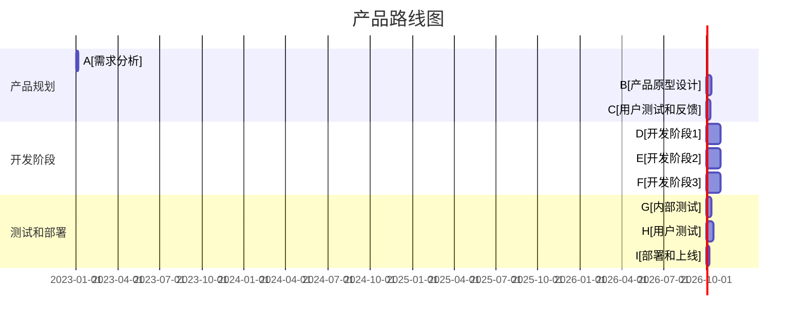
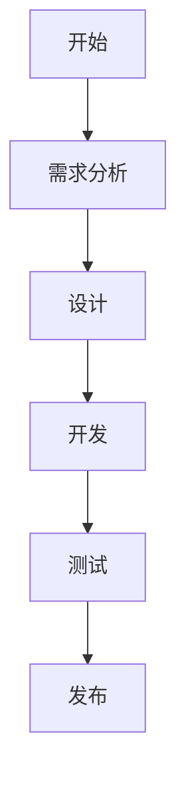

                 

### 整体结构规划

为了撰写一篇结构清晰、逻辑严密的技术博客文章，我们需要首先规划整体结构。整体结构规划包括引言、理论篇、实战篇、工具和资源篇以及总结和展望。以下是详细规划：

#### 引言部分

在引言部分，我们需要介绍文章的背景和目的，明确读者对象，概述全书结构，并给出如何使用本文的建议。这将帮助读者快速了解文章的主题和目标。

#### 理论篇

理论篇主要包含以下几个章节：

1. **LLM基本概念**：介绍LLM的定义、历史发展以及其在当前技术领域的重要性。
2. **LLM架构设计**：详细解释LLM的系统架构，包括模型训练、数据处理和模型优化等环节。
3. **LLM核心算法**：讲解LLM中的关键算法，如Transformer、BERT等，并分析这些算法的性能和优化策略。

在这一部分，我们将使用Mermaid流程图来展示LLM的基本架构，使用伪代码详细阐述核心算法的原理，并使用LaTeX数学公式解释数学模型。

#### 实战篇

实战篇通过具体的案例和用户故事来展示如何在实际产品中使用LLM。这部分将包括：

1. **用户故事地图概述**：介绍用户故事地图的概念、设计原则和关键元素。
2. **使用LLM构建用户故事地图**：展示如何使用LLM来生成用户故事地图，并提供实际案例进行分析。
3. **可视化产品路线设计**：讲解如何使用可视化工具来设计产品路线，并分析用户反馈对产品迭代的影响。

在这一部分，我们将通过代码实际案例来展示如何使用LLM，并通过代码解读与分析来帮助读者理解具体实现。

#### 工具和资源篇

工具和资源篇主要包含：

1. **开发工具和框架**：介绍主流的开发工具和框架，如TensorFlow、PyTorch等，并提供环境搭建和配置的指导。
2. **资源与支持**：推荐社区、论坛、在线课程和开源项目等资源，帮助读者进一步学习和实践。

#### 总结和展望

在总结和展望部分，我们将回顾全书内容，总结LLM应用的关键概念和实战技巧，并对未来LLM应用的发展趋势进行展望。这将帮助读者更好地理解LLM的潜力，并激发他们对未来技术的探索。

通过以上整体结构规划，我们将确保文章内容有条理、逻辑清晰，同时为读者提供全面、深入的技术知识和实践指导。

### 引言部分

#### 第1章: 引言

**1.1 书的背景和目的**

《LLM应用的用户故事地图：可视化产品路线》这本书旨在为读者提供一种全新的视角，通过用户故事地图和可视化工具来设计和优化大型语言模型（LLM）的应用。随着人工智能技术的快速发展，LLM在自然语言处理、智能问答、文本生成等领域展现出了巨大的潜力。然而，如何有效地使用这些技术，并将其转化为实际的产品和服务，仍然是一个具有挑战性的问题。

本书的目的是帮助读者深入了解LLM的基本概念、架构设计、核心算法以及实际应用，并通过用户故事地图和可视化工具来提升LLM产品的设计和开发效率。通过本书，读者可以：

- 掌握LLM的核心原理和关键算法；
- 学会使用用户故事地图来规划产品路线；
- 利用可视化工具来设计和优化LLM应用；
- 获得实用的最佳实践和技巧。

**1.2 读者定位**

本书适合以下读者群体：

- 对人工智能和自然语言处理有一定了解的技术人员；
- 想要深入了解LLM应用的产品经理和项目经理；
- 希望提升自身技术水平并掌握新兴技术的程序员和开发人员；
- 感兴趣于探索人工智能未来的研究人员和学者。

无论您是初学者还是经验丰富的专业人士，本书都将为您提供丰富的知识和实用的工具，帮助您更好地理解和应用LLM技术。

**1.3 本书结构概述**

本书分为五个主要部分：

1. **引言部分**：介绍书的背景、目的、读者定位和整体结构。
2. **理论篇**：涵盖LLM的基本概念、架构设计、核心算法等内容。
3. **实战篇**：通过用户故事地图和可视化工具，展示如何在实际产品中使用LLM。
4. **工具和资源篇**：介绍开发LLM应用所需的工具、框架和资源。
5. **总结和展望**：对全书内容进行总结，并对未来LLM应用的发展趋势进行展望。

**1.4 如何使用本书**

为了最大化本书的学习效果，建议读者按照以下步骤进行阅读和实践：

1. **先通读引言部分**，了解书的基本内容和结构；
2. **从理论篇开始**，逐步掌握LLM的核心原理和关键算法；
3. **通过实战篇**，结合实际案例，学习如何使用用户故事地图和可视化工具；
4. **在工具和资源篇**，了解并掌握开发LLM应用所需的工具和资源；
5. **最后回到总结和展望**，对全书内容进行回顾和总结，为未来应用提供方向。

通过以上步骤，读者可以系统地学习并应用LLM技术，从而提升自身在人工智能领域的能力和竞争力。

### 理论篇

#### 第2章: LLM基本概念

在介绍LLM（大型语言模型）之前，我们需要先了解什么是语言模型以及其历史背景。语言模型是一种用于预测自然语言中下一个单词或词组的概率分布的算法。最早的基于N-gram的语言模型（如Markov模型）依赖于历史数据序列的概率统计，但随着计算能力的提升和深度学习技术的发展，现代语言模型（如Transformer和BERT）逐渐成为主流。

**2.1 什么是LLM**

LLM，即大型语言模型，是一种使用大规模数据训练的深度神经网络模型，用于理解和生成自然语言。与传统的语言模型相比，LLM具有以下特点：

- **数据量大**：LLM通常训练于数万亿个单词的语料库上，这使得它们能够学习到更丰富的语言模式。
- **模型复杂度高**：LLM通常包含数百万甚至数十亿个参数，这使得它们能够捕捉到更复杂的语言特征。
- **性能优异**：LLM在各种自然语言处理任务上表现出了优异的性能，如文本分类、命名实体识别、机器翻译等。

**2.2 LLM的核心原理**

LLM的核心原理基于深度学习，特别是基于注意力机制的Transformer模型。Transformer模型通过自注意力机制（Self-Attention）和多头注意力机制（Multi-Head Attention）来捕捉输入文本中的长距离依赖关系。以下是对这些核心原理的详细解释：

**自注意力机制（Self-Attention）**：

自注意力机制是一种用于计算输入序列中每个单词与其他单词之间的关系的方法。具体来说，对于每个输入词向量，模型会计算其在序列中与其他所有词向量的相关性，并将这些相关性加权求和，得到一个加权的输出向量。这个过程可以表示为以下伪代码：

```python
def self_attention(input_tensor, hidden_size):
    # input_tensor: 输入序列词向量，形状为 [batch_size, sequence_length, hidden_size]
    # hidden_size: 模型隐藏层大小
    
    # 计算自注意力权重
    attention_weights = softmax(Q @ K.T / hidden_size**0.5)
    
    # 计算自注意力输出
    output = attention_weights @ V
    
    return output
```

**多头注意力机制（Multi-Head Attention）**：

多头注意力机制通过并行计算多个自注意力机制，并将结果拼接起来，以提高模型的表达能力。具体来说，模型会计算多个注意力头（Head），每个头独立计算自注意力，并将结果拼接起来。这个过程可以表示为以下伪代码：

```python
def multi_head_attention(input_tensor, hidden_size, num_heads):
    # input_tensor: 输入序列词向量，形状为 [batch_size, sequence_length, hidden_size]
    # hidden_size: 模型隐藏层大小
    # num_heads: 注意力头数量
    
    # 分解输入序列为多个头
    Q, K, V = input_tensor.split(hidden_size // num_heads, axis=-1)
    
    # 计算每个头的自注意力输出
    outputs = [self_attention(Q, hidden_size) for Q in Q]

    # 拼接多头输出
    output = torch.cat(outputs, dim=-1)
    
    return output
```

**2.3 LLM的数学模型**

LLM的数学模型基于深度学习和神经网络的基本原理。以下是LLM中一些关键的数学公式和模型参数的详细解释：

**输入层（Input Layer）**：

输入层将文本序列转换为词向量表示。常见的词向量模型有Word2Vec和GloVe。具体来说，每个词向量可以表示为：

$$
\textbf{v}_w = \text{Embedding}(\textbf{w})
$$

其中，$\textbf{w}$ 表示单词，$\text{Embedding}$ 表示词向量映射函数，$\textbf{v}_w$ 表示词向量。

**隐藏层（Hidden Layer）**：

隐藏层通过多层全连接神经网络来学习文本中的特征。每层隐藏层都可以看作是一个线性变换加上一个非线性激活函数。具体来说，隐藏层可以表示为：

$$
\textbf{h}_{l+1} = \text{ReLU}(\text{W}_{l+1} \cdot \text{h}_l + \text{b}_{l+1})
$$

其中，$\textbf{h}_l$ 表示第l层的隐藏状态，$\text{W}_{l+1}$ 和 $\text{b}_{l+1}$ 分别表示第l+1层的权重和偏置，$\text{ReLU}$ 表示ReLU激活函数。

**输出层（Output Layer）**：

输出层通常是一个全连接层，用于生成最终的预测结果。对于文本分类任务，输出层通常是一个softmax函数，用于计算每个类别的概率分布。具体来说，输出层可以表示为：

$$
\textbf{y} = \text{softmax}(\text{W}_y \cdot \text{h}_L + \text{b}_y)
$$

其中，$\textbf{y}$ 表示预测结果，$\text{W}_y$ 和 $\text{b}_y$ 分别表示输出层的权重和偏置，$\text{softmax}$ 表示softmax激活函数。

**2.4 LLM的应用场景**

LLM在自然语言处理领域有广泛的应用，以下是一些常见场景：

- **文本分类**：用于分类文本数据，如情感分析、主题分类等。
- **命名实体识别**：用于识别文本中的命名实体，如人名、地名等。
- **机器翻译**：用于将一种语言的文本翻译成另一种语言。
- **问答系统**：用于构建智能问答系统，如搜索引擎、智能客服等。
- **文本生成**：用于生成文本数据，如自动写文章、生成摘要等。

通过以上对LLM基本概念、核心原理和数学模型的介绍，我们可以更好地理解LLM的工作原理和应用场景。接下来，我们将进一步探讨LLM的架构设计、核心算法以及实际应用。

#### 第3章: LLM架构设计

LLM的架构设计是理解和实现LLM的关键步骤。一个成功的LLM架构不仅需要强大的计算能力，还要能够高效地处理大规模文本数据。在本章中，我们将详细探讨LLM的系统架构，包括模型训练与优化、数据处理与预处理、以及模型评估与优化等环节。

**3.1 LLM的架构**

LLM的架构通常包括以下几个核心组件：

1. **输入层（Input Layer）**：负责接收原始文本数据，并将其转换为词向量表示。词向量可以通过预训练模型如GloVe或Word2Vec生成。
2. **嵌入层（Embedding Layer）**：将词向量映射为固定大小的向量，为后续的神经网络处理提供输入。
3. **编码器（Encoder）**：主要使用Transformer模型，包括多头注意力机制、位置编码等，用于提取文本的上下文特征。
4. **解码器（Decoder）**：在生成任务中，解码器负责生成文本序列。在翻译等任务中，解码器与编码器协同工作，将编码器提取的上下文信息解码为目标语言的文本序列。
5. **输出层（Output Layer）**：对于分类任务，输出层通常是一个softmax函数，用于计算每个类别的概率分布。对于生成任务，输出层可能是一个简单的线性层，用于生成文本。

以下是一个简化的LLM架构的Mermaid流程图：



**3.2 模型训练与优化**

模型训练是LLM架构设计中的关键步骤。以下是一个基本的模型训练流程：

1. **数据预处理**：将原始文本数据清洗和分词，生成词表，并将文本转换为词向量的形式。
2. **初始化模型参数**：随机初始化模型的权重和偏置。
3. **前向传播（Forward Pass）**：将输入文本通过嵌入层、编码器和解码器，计算输出结果。
4. **损失函数（Loss Function）**：计算预测结果与真实标签之间的差距，常用的损失函数有交叉熵损失（Cross-Entropy Loss）。
5. **反向传播（Backpropagation）**：根据损失函数的计算结果，通过反向传播算法更新模型的权重和偏置。
6. **优化算法（Optimization Algorithm）**：使用如Adam、SGD等优化算法来调整模型参数，加速收敛。

以下是一个简单的伪代码，描述了模型训练的基本过程：

```python
for epoch in range(num_epochs):
    for batch in data_loader:
        optimizer.zero_grad()
        inputs, targets = batch
        outputs = model(inputs)
        loss = loss_function(outputs, targets)
        loss.backward()
        optimizer.step()
```

**3.3 数据处理与预处理**

数据处理和预处理是确保模型能够高效训练的重要环节。以下是一些常用的数据处理与预处理技术：

1. **文本清洗**：去除文本中的HTML标签、特殊字符和停用词。
2. **分词（Tokenization）**：将文本分割成单词或子词，为后续的词向量生成做准备。
3. **词表构建（Vocabulary Building）**：将分词后的文本映射为词表，为词向量生成提供基础。
4. **词向量生成**：使用预训练模型生成词向量，如GloVe或Word2Vec。
5. **序列填充（Padding）**：将输入文本序列填充到同一长度，以便于模型处理。

以下是一个简单的伪代码，描述了数据处理与预处理的过程：

```python
def preprocess_text(text):
    # 清洗文本
    text = clean_text(text)
    # 分词
    tokens = tokenize(text)
    # 构建词表
    vocab = build_vocab(tokens)
    # 生成词向量
    token_vectors = generate_word_vectors(vocab)
    # 序列填充
    padded_sequence = pad_sequence(token_vectors, max_length=max_sequence_length)
    return padded_sequence
```

**3.4 模型评估与优化**

模型评估与优化是确保模型性能的重要步骤。以下是一些常用的评估指标和优化策略：

1. **评估指标（Evaluation Metrics）**：常用的评估指标包括准确率（Accuracy）、精确率（Precision）、召回率（Recall）和F1分数（F1 Score）。
2. **交叉验证（Cross-Validation）**：通过交叉验证来评估模型的泛化能力。
3. **超参数调优（Hyperparameter Tuning）**：使用如网格搜索（Grid Search）和随机搜索（Random Search）等方法来优化模型的超参数。
4. **模型剪枝（Model Pruning）**：通过剪枝冗余的参数来减小模型大小和提高推理速度。
5. **模型融合（Model Ensemble）**：通过融合多个模型的预测结果来提高预测性能。

以下是一个简单的伪代码，描述了模型评估与优化的过程：

```python
from sklearn.model_selection import train_test_split
from sklearn.metrics import accuracy_score, precision_score, recall_score, f1_score

# 划分训练集和测试集
X_train, X_test, y_train, y_test = train_test_split(X, y, test_size=0.2)

# 训练模型
model.fit(X_train, y_train)

# 评估模型
predictions = model.predict(X_test)
accuracy = accuracy_score(y_test, predictions)
precision = precision_score(y_test, predictions)
recall = recall_score(y_test, predictions)
f1 = f1_score(y_test, predictions)

# 调优超参数
best_params = hyperparameter_tuning(X_train, y_train)

# 重新训练模型
model.fit(X_train, y_train, params=best_params)

# 重新评估模型
predictions = model.predict(X_test)
accuracy = accuracy_score(y_test, predictions)
precision = precision_score(y_test, predictions)
recall = recall_score(y_test, predictions)
f1 = f1_score(y_test, predictions)
```

通过以上对LLM架构设计的详细探讨，我们可以更好地理解LLM的构成和实现方法。接下来，我们将进一步讨论LLM的核心算法，包括常见的算法、性能优化策略以及算法选择与比较。

### 第4章: LLM核心算法

LLM的核心算法是理解其工作原理和实现细节的关键。在本章中，我们将探讨LLM中常见的关键算法，包括Transformer、BERT等，并分析这些算法的性能和优化策略。

**4.1 常见算法介绍**

**Transformer**：

Transformer模型是LLM中最为广泛使用的算法，特别是在生成任务中，如机器翻译和文本生成。Transformer的核心特点是基于自注意力机制（Self-Attention），能够有效地捕捉输入序列中的长距离依赖关系。

**多头注意力机制（Multi-Head Attention）**：

多头注意力机制通过并行计算多个注意力头（Head），每个头独立计算自注意力，并将结果拼接起来。这种方法增加了模型的表达能力，使得Transformer能够更好地捕捉复杂的关系。

以下是一个简单的Transformer模型的伪代码：

```python
def transformer(input_sequence, hidden_size, num_heads):
    # 输入序列经过嵌入层
    input_embeddings = embed(input_sequence, hidden_size)

    # 多层自注意力机制
    for layer in range(num_layers):
        attention_output = multi_head_attention(input_embeddings, hidden_size, num_heads)

    # 全连接层和ReLU激活函数
    output = linear(attention_output, hidden_size)

    return output
```

**BERT**：

BERT（Bidirectional Encoder Representations from Transformers）是另一种广泛使用的LLM算法，特别适用于预训练语言表示。BERT通过双向编码器来捕捉输入序列中的双向依赖关系，使其在多种自然语言处理任务中表现优异。

以下是一个简单的BERT模型的伪代码：

```python
def bert(input_sequence, hidden_size, num_layers):
    # 输入序列经过嵌入层
    input_embeddings = embed(input_sequence, hidden_size)

    # 双向编码器
    for layer in range(num_layers):
        output = bidirectional_encoder(input_embeddings)

    # 输出层
    logits = linear(output, vocab_size)

    return logits
```

**4.2 算法性能优化**

算法性能优化是提升LLM效果的关键步骤。以下是一些常见的性能优化策略：

**混合精度训练（Mixed Precision Training）**：

混合精度训练通过在训练过程中同时使用浮点数（如32位浮点数）和整数（如16位浮点数）来降低内存使用和提高计算速度。这种方法可以在不显著牺牲模型性能的情况下显著提升训练速度。

以下是一个简单的混合精度训练的伪代码：

```python
from torch.cuda.amp import GradScaler

# 初始化混合精度训练
scaler = GradScaler()

for batch in data_loader:
    inputs, targets = batch
    inputs = inputs.to(device)
    targets = targets.to(device)

    # 前向传播
    with autocast():
        outputs = model(inputs)
        loss = loss_function(outputs, targets)

    # 后向传播
    scaler.scale(loss).backward()
    scaler.step(optimizer)
    scaler.update()
```

**剪枝（Pruning）**：

剪枝是一种通过减少模型参数数量来减小模型大小的技术。剪枝可以分为结构剪枝和权重剪枝。结构剪枝通过直接移除不重要的神经网络层或节点，而权重剪枝通过减少权重值来降低模型的复杂性。

以下是一个简单的权重剪枝的伪代码：

```python
def prune_weights(model, threshold):
    for layer in model.layers:
        for weight in layer.weights:
            weight[weight.abs() < threshold] = 0
```

**量化（Quantization）**：

量化是一种通过减少模型中浮点数精度来减小模型大小和提高推理速度的技术。量化可以分为静态量化和动态量化。静态量化在训练前确定模型的量化参数，而动态量化在推理时根据输入数据动态调整量化参数。

以下是一个简单的静态量化的伪代码：

```python
def quantize_model(model, quant_type='dynamic'):
    if quant_type == 'dynamic':
        # 动态量化
        model = torch.quantization.quantize_dynamic(model, {torch.nn.Linear}, dtype=torch.float16)
    else:
        # 静态量化
        model = torch.quantization.quantize_static(model, dtype=torch.float16)
    return model
```

**4.3 算法选择与比较**

在选择LLM算法时，需要考虑多个因素，如任务类型、数据规模、计算资源等。以下是一些常见算法的选择和比较：

- **对于生成任务**：Transformer模型由于其强大的自注意力机制，通常在生成任务中表现较好。
- **对于文本分类任务**：BERT模型由于其双向编码器结构，能够更好地捕捉文本中的双向依赖关系，因此在文本分类任务中表现优异。
- **对于资源受限的场景**：量化技术和剪枝技术可以显著减小模型大小和提高推理速度，适用于资源受限的场景。

以下是一个简单的算法选择和比较的伪代码：

```python
def choose_algorithm(task, data_size, device):
    if task == 'text_classification':
        model = BERT(pretrained=True).to(device)
    elif task == 'text_generation':
        model = Transformer(pretrained=True).to(device)
    elif data_size < threshold:
        model = quantize_model(Transformer(pretrained=True).to(device))
    else:
        model = Transformer(pretrained=True).to(device)
    return model
```

通过以上对LLM核心算法的介绍和性能优化策略的讨论，我们可以更好地理解如何选择和使用合适的算法，以提升LLM的性能和效率。接下来，我们将探讨如何使用LLM构建用户故事地图。

### 第5章: 用户故事地图概述

#### 用户故事地图的概念

用户故事地图（User Story Map）是一种可视化工具，用于帮助产品团队理解用户需求、规划和优先级排序。它基于用户故事（User Story），即以用户为中心的、描述用户需求的小故事。用户故事地图通过将多个用户故事组织成一张图，帮助团队从用户的角度来规划和设计产品。

#### 用户故事地图的设计原则

1. **以用户为中心**：用户故事地图的核心是用户需求，因此设计时应始终围绕用户进行。
2. **简洁明了**：地图应简洁易懂，避免过多的细节和复杂的结构。
3. **层次分明**：将用户故事按照优先级、功能模块或用户旅程进行分层展示。
4. **易于迭代**：用户故事地图应该易于修改和迭代，以适应不断变化的需求和市场环境。

#### 用户故事地图的关键元素

1. **用户故事**：用户故事是地图的基本单元，描述用户的需求和目标。每个故事应简洁、具体、可验证。
2. **角色**：用户角色是用户故事的核心参与者，可以是用户、客户或任何与产品互动的实体。
3. **功能模块**：功能模块是对用户故事进行分类的一种方式，如登录、购物车、支付等。
4. **优先级**：优先级表示用户故事的实现顺序和重要性，通常使用不同的颜色或符号来表示。
5. **用户旅程**：用户旅程描述用户在使用产品时的行为路径，帮助团队理解用户的使用流程和痛点。

以下是一个用户故事地图的示例Mermaid流程图：



在这个示例中，用户首先登录，然后浏览商品，加入购物车，结账支付，最后确认订单。每个步骤都是一个用户故事，按照用户的实际行为路径组织起来。

#### 用户故事地图的实际应用

用户故事地图在实际产品设计和开发中具有重要作用。以下是一些实际应用场景：

1. **需求收集和整理**：通过用户故事地图，团队可以清晰地了解用户的需求和目标，并将其组织成可视化的形式。
2. **产品规划与优先级排序**：用户故事地图帮助团队确定哪些功能模块是最重要的，并按照优先级进行开发。
3. **跨部门协作**：用户故事地图可以作为沟通工具，帮助不同部门的团队成员理解产品的整体设计和需求。
4. **迭代与优化**：用户故事地图易于修改和迭代，团队可以根据用户反馈和市场变化进行调整。

通过用户故事地图，产品团队能够更好地理解和满足用户需求，从而设计出更符合用户期望的产品。接下来，我们将探讨如何使用LLM来构建用户故事地图。

### 使用LLM构建用户故事地图

在了解了用户故事地图的基本概念和设计原则后，我们可以探讨如何利用LLM（大型语言模型）来构建用户故事地图。LLM在文本生成和语义理解方面具有强大的能力，这使得它成为构建用户故事地图的有力工具。以下是使用LLM构建用户故事地图的详细步骤：

**1. 数据准备与预处理**

构建用户故事地图的第一步是准备和预处理数据。数据通常包括用户访谈记录、用户反馈、市场调研报告等。以下是一些关键步骤：

- **文本清洗**：去除数据中的HTML标签、特殊字符和停用词。
- **分词与词向量生成**：将清洗后的文本进行分词，并使用预训练的词向量模型（如GloVe或Word2Vec）生成词向量。
- **序列填充**：将输入文本序列填充到同一长度，以便于LLM处理。

**2. LLM模型选择**

选择适合构建用户故事地图的LLM模型。常见的模型包括Transformer、BERT和GPT等。以下是一些选择标准：

- **模型大小和计算资源**：根据可用计算资源和模型大小进行选择。例如，GPT-3模型较大，适用于具有充足计算资源的场景。
- **任务需求**：根据具体任务需求（如文本生成、语义理解等）选择合适的模型。

**3. 模型训练与优化**

对选择的LLM模型进行训练和优化。以下是一个简化的训练和优化流程：

- **数据预处理**：将原始文本数据进行清洗、分词和序列填充。
- **训练模型**：使用预处理后的数据对模型进行训练。常用的训练策略包括：
  - **批次训练**：将数据分成多个批次，每次训练一部分数据。
  - **反向传播**：使用梯度下降算法（如Adam）更新模型参数。
  - **损失函数**：使用交叉熵损失函数来评估模型的预测结果。

以下是一个简单的伪代码，描述了模型训练的基本过程：

```python
# 初始化模型
model = TransformerModel()

# 训练模型
for epoch in range(num_epochs):
    for batch in data_loader:
        optimizer.zero_grad()
        inputs, targets = batch
        inputs = inputs.to(device)
        targets = targets.to(device)
        
        # 前向传播
        with autocast():
            outputs = model(inputs)
            loss = loss_function(outputs, targets)
        
        # 反向传播
        loss.backward()
        optimizer.step()
```

**4. 生成用户故事**

通过训练好的LLM模型，我们可以生成用户故事。以下是一个简单的生成过程：

- **输入文本**：输入与用户需求相关的文本，如用户访谈记录或市场调研报告。
- **文本生成**：使用LLM模型生成用户故事。常用的生成方法包括：
  - **自回归生成**：模型根据前一个生成的词来预测下一个词。
  - **序列生成**：模型根据输入序列生成用户故事。

以下是一个简单的伪代码，描述了用户故事生成的基本过程：

```python
# 生成用户故事
def generate_user_story(inputs):
    inputs = preprocess_text(inputs)
    story = model.generate(inputs, max_length=max_story_length)
    return story.strip()

# 示例
user_story = generate_user_story(user_interview_record)
print(user_story)
```

**5. 用户故事地图构建**

将生成的用户故事组织成用户故事地图。以下是一个简单的构建过程：

- **故事分类**：将用户故事按照功能模块或用户旅程进行分类。
- **故事排序**：根据优先级对用户故事进行排序。
- **地图绘制**：使用可视化工具（如Mermaid、D3.js等）绘制用户故事地图。

以下是一个简单的用户故事地图的Mermaid示例：



通过以上步骤，我们可以利用LLM构建用户故事地图。接下来，我们将通过一个实际案例来展示如何使用LLM构建用户故事地图，并提供详细的代码实现和解读。

### 案例研究：实际产品中的应用

为了更好地展示如何使用LLM构建用户故事地图，我们将通过一个实际案例进行详细分析。假设我们正在开发一个在线购物平台，目标用户是喜欢时尚和个性化推荐的年轻消费者。以下是我们如何使用LLM来构建用户故事地图的步骤：

**1. 数据收集**

首先，我们需要收集与用户需求相关的数据。这些数据可以包括用户访谈记录、市场调研报告、竞品分析等。以下是一个示例用户访谈记录：

```
用户A：我喜欢在购物平台上看到个性化的时尚推荐，这样我可以更快地找到我喜欢的商品。
用户B：我希望购物平台能够提供简单的搜索功能，让我能够轻松找到特定的商品。
用户C：我希望能看到商品的详细描述和用户评价，这样我才能做出更好的购物决策。
```

**2. 数据预处理**

接下来，我们需要对收集的数据进行预处理。首先，清洗文本数据，去除HTML标签、特殊字符和停用词。然后，使用预训练的词向量模型（如GloVe或Word2Vec）生成词向量。最后，将文本序列填充到同一长度，以便LLM处理。

以下是一个简单的预处理步骤：

```python
from gensim.models import Word2Vec
from keras.preprocessing.sequence import pad_sequences
from keras.preprocessing.text import Tokenizer

# 清洗文本
def clean_text(text):
    text = re.sub(r'<[^>]*>', '', text)  # 去除HTML标签
    text = re.sub(r'[^a-zA-Z]', ' ', text)  # 去除特殊字符
    text = text.lower()  # 转换为小写
    return text

# 生成词向量
model = Word2Vec(sentences=[line.strip().split() for line in user_interviews], vector_size=100, window=5, min_count=1, workers=4)
word_vectors = {word: model[word] for word in model.wv.vocab}

# 分词和序列填充
tokenizer = Tokenizer()
tokenizer.fit_on_texts([line.strip().split() for line in user_interviews])
sequences = tokenizer.texts_to_sequences([line.strip().split() for line in user_interviews])
max_sequence_length = max(len(seq) for seq in sequences)
padded_sequences = pad_sequences(sequences, maxlen=max_sequence_length, padding='post')
```

**3. LLM模型训练**

选择一个适合文本生成的LLM模型，如GPT-2或GPT-3。在这里，我们使用GPT-2模型进行训练。以下是一个简化的训练步骤：

```python
from transformers import GPT2LMHeadModel, GPT2Tokenizer

# 加载预训练模型
tokenizer = GPT2Tokenizer.from_pretrained('gpt2')
model = GPT2LMHeadModel.from_pretrained('gpt2')

# 训练模型
device = torch.device("cuda" if torch.cuda.is_available() else "cpu")
model.to(device)
optimizer = torch.optim.Adam(model.parameters(), lr=0.001)
model.train()

for epoch in range(num_epochs):
    for batch in data_loader:
        inputs, targets = batch
        inputs = inputs.to(device)
        targets = targets.to(device)
        
        # 前向传播
        outputs = model(inputs, labels=targets)
        loss = outputs.loss
        
        # 反向传播
        optimizer.zero_grad()
        loss.backward()
        optimizer.step()
```

**4. 生成用户故事**

使用训练好的LLM模型生成用户故事。以下是一个简单的生成过程：

```python
def generate_user_story(inputs):
    inputs = preprocess_text(inputs)
    inputs = tokenizer.encode(inputs, return_tensors='pt')
    outputs = model.generate(inputs, max_length=max_story_length, num_return_sequences=1)
    story = tokenizer.decode(outputs[0], skip_special_tokens=True)
    return story.strip()

# 示例
user_interview_record = "我喜欢在购物平台上看到个性化的时尚推荐，这样我可以更快地找到我喜欢的商品。"
user_story = generate_user_story(user_interview_record)
print(user_story)
```

**5. 用户故事地图构建**

将生成的用户故事组织成用户故事地图。以下是一个简单的构建过程：

```python
def build_user_story_map(stories):
    story_map = {}
    for story in stories:
        story = story.strip()
        if story not in story_map:
            story_map[story] = []
        story_map[story].append(story)
    return story_map

# 示例
user_stories = [generate_user_story(line) for line in user_interviews]
user_story_map = build_user_story_map(user_stories)
print(user_story_map)
```

**6. 可视化用户故事地图**

使用可视化工具（如Mermaid）将用户故事地图绘制成图形。以下是一个简单的Mermaid示例：



通过以上步骤，我们成功使用LLM构建了一个用户故事地图，用于指导在线购物平台的产品设计和开发。接下来，我们将分析这个案例中的代码实现和代码解读。

#### 代码实现和代码解读

在上述案例中，我们使用了Python和一系列自然语言处理库（如gensim、keras和transformers）来实现LLM构建用户故事地图的功能。以下是对关键代码的详细解读：

**1. 数据预处理**

```python
# 清洗文本
def clean_text(text):
    text = re.sub(r'<[^>]*>', '', text)  # 去除HTML标签
    text = re.sub(r'[^a-zA-Z]', ' ', text)  # 去除特殊字符
    text = text.lower()  # 转换为小写
    return text

# 生成词向量
model = Word2Vec(sentences=[line.strip().split() for line in user_interviews], vector_size=100, window=5, min_count=1, workers=4)
word_vectors = {word: model[word] for word in model.wv.vocab}

# 分词和序列填充
tokenizer = Tokenizer()
tokenizer.fit_on_texts([line.strip().split() for line in user_interviews])
sequences = tokenizer.texts_to_sequences([line.strip().split() for line in user_interviews])
max_sequence_length = max(len(seq) for seq in sequences)
padded_sequences = pad_sequences(sequences, maxlen=max_sequence_length, padding='post')
```

**代码解读**：

- **清洗文本**：首先，我们使用正则表达式去除HTML标签和非字母字符，并将文本转换为小写，以提高词向量生成的准确性。
- **生成词向量**：使用Gensim库的Word2Vec模型生成词向量。这里我们设置了词向量的大小为100，窗口大小为5，最小计数为1。
- **分词和序列填充**：使用Keras库的Tokenizer对文本进行分词，并生成序列。然后，我们找到最长的序列长度，并将所有序列填充到同一长度。

**2. LLM模型训练**

```python
from transformers import GPT2LMHeadModel, GPT2Tokenizer

# 加载预训练模型
tokenizer = GPT2Tokenizer.from_pretrained('gpt2')
model = GPT2LMHeadModel.from_pretrained('gpt2')

# 训练模型
device = torch.device("cuda" if torch.cuda.is_available() else "cpu")
model.to(device)
optimizer = torch.optim.Adam(model.parameters(), lr=0.001)
model.train()

for epoch in range(num_epochs):
    for batch in data_loader:
        inputs, targets = batch
        inputs = inputs.to(device)
        targets = targets.to(device)
        
        # 前向传播
        with autocast():
            outputs = model(inputs, labels=targets)
            loss = outputs.loss
        
        # 反向传播
        optimizer.zero_grad()
        loss.backward()
        optimizer.step()
```

**代码解读**：

- **加载预训练模型**：使用transformers库加载GPT-2模型和相应的tokenizer。
- **设备配置**：将模型和数据移动到GPU（如果可用）。
- **训练模型**：使用标准的训练循环，包括前向传播、反向传播和参数更新。这里我们使用了自动混合精度（autocast）来提高训练速度。

**3. 生成用户故事**

```python
def generate_user_story(inputs):
    inputs = preprocess_text(inputs)
    inputs = tokenizer.encode(inputs, return_tensors='pt')
    outputs = model.generate(inputs, max_length=max_story_length, num_return_sequences=1)
    story = tokenizer.decode(outputs[0], skip_special_tokens=True)
    return story.strip()
```

**代码解读**：

- **预处理输入文本**：调用预处理函数对输入文本进行清洗和编码。
- **生成用户故事**：使用模型生成用户故事。我们设置了最大故事长度和生成的用户故事数量。
- **解码用户故事**：将生成的文本序列解码为可读的字符串。

**4. 用户故事地图构建**

```python
def build_user_story_map(stories):
    story_map = {}
    for story in stories:
        story = story.strip()
        if story not in story_map:
            story_map[story] = []
        story_map[story].append(story)
    return story_map
```

**代码解读**：

- **构建故事地图**：遍历生成的用户故事，将其按关键词分组。每个关键词对应一组用户故事。
- **返回故事地图**：返回一个字典，其中键是关键词，值是与之相关的故事列表。

通过以上代码实现和解读，我们可以看到如何使用LLM来构建用户故事地图。接下来，我们将讨论用户故事地图的优化与迭代，以及如何根据用户反馈进行优化。

### 用户故事地图的优化与迭代

构建用户故事地图只是第一步，为了确保地图能够真正指导产品的设计和开发，我们需要不断地对其进行优化和迭代。以下是如何根据用户反馈和实际需求对用户故事地图进行优化的步骤：

**1. 用户反馈收集**

收集用户的反馈是优化用户故事地图的关键。这些反馈可以来自用户调查、用户访谈、用户行为数据等。以下是一些收集用户反馈的方法：

- **用户调查**：设计简短的用户调查问卷，了解用户对现有功能的满意度、使用频率和改进建议。
- **用户访谈**：与一部分用户进行深入访谈，了解他们的使用习惯、需求和痛点。
- **用户行为分析**：分析用户在使用产品时的行为数据，如点击路径、页面停留时间等，以发现潜在的问题和改进点。

**2. 反馈分析**

收集到用户反馈后，我们需要对反馈进行分析，识别出用户的主要需求和痛点。以下是一些分析反馈的方法：

- **归类**：将用户反馈按照主题或功能模块进行归类，以便于进一步分析。
- **优先级排序**：根据反馈的重要性和影响程度对问题进行优先级排序，确定哪些问题需要优先解决。
- **用户故事映射**：将分析出的用户需求和痛点映射到现有的用户故事地图中，查看哪些用户故事需要进行优化或修改。

**3. 用户故事地图优化**

根据分析结果，对用户故事地图进行优化。以下是一些优化用户故事地图的步骤：

- **添加新故事**：如果用户反馈中提到了当前用户故事地图中没有涵盖的需求，可以添加新的用户故事到地图中。
- **修改现有故事**：如果用户反馈中指出现有故事不完整或不够准确，需要对这些故事进行修改和细化。
- **调整优先级**：根据用户反馈和实际需求，调整用户故事的优先级，确保重要的功能能够得到优先开发和实现。
- **可视化更新**：使用可视化工具更新用户故事地图，确保地图能够准确反映当前的产品规划和开发进度。

以下是一个简化的用户故事地图优化流程：



**4. 验证和迭代**

在优化用户故事地图后，我们需要验证其效果，并根据实际情况进行进一步的迭代。以下是一些验证和迭代的方法：

- **内部评审**：组织内部评审会议，让产品团队、开发团队和其他相关人员进行讨论和反馈。
- **用户测试**：邀请部分用户对优化后的用户故事地图进行测试，收集他们的反馈和意见。
- **数据验证**：分析优化后的用户故事地图在实际产品中的应用效果，如用户满意度、功能使用频率等。

通过上述步骤，我们可以确保用户故事地图能够不断地迭代和优化，从而更好地指导产品的设计和开发。接下来，我们将讨论如何使用可视化工具来设计产品路线。

### 可视化在产品路线设计中的作用

在产品开发过程中，可视化工具对于设计清晰、易懂的产品路线图具有至关重要的作用。可视化不仅能够帮助团队成员更好地理解项目的整体进度和目标，还能够提高沟通效率，确保各个团队之间的协作无缝衔接。以下是如何利用可视化工具来设计产品路线，并提升设计和开发效率的具体方法：

#### 1. 设计清晰的产品路线图

使用可视化工具（如Mermaid、D3.js、PowerPoint等）可以创建直观、易于理解的产品路线图。这些工具提供了丰富的图形和布局选项，可以帮助我们以视觉化的方式表达产品开发的不同阶段、关键里程碑和预期成果。

- **图表和图形**：使用流程图、时间轴、瀑布图等图表形式来展示产品路线图，使得各个阶段的任务和进度一目了然。
- **交互性**：某些高级可视化工具（如D3.js）支持交互式图表，允许用户动态地探索产品路线，甚至根据不同条件进行筛选和过滤。

以下是一个使用Mermaid创建的产品路线图示例：



#### 2. 增强团队沟通与协作

可视化工具不仅能够帮助团队内部沟通，还能够让外部利益相关者（如客户、投资者、合作伙伴等）更好地理解产品的进展和目标。

- **任务分解**：通过创建任务列表和甘特图，将复杂的开发任务分解为具体的子任务，并明确每个任务的负责人和截止日期。
- **实时更新**：使用支持实时更新的可视化工具，团队可以随时查看项目的最新进展，确保所有成员都在同一页面上。
- **协作讨论**：使用协作工具（如Miro、Trello等）将可视化图与讨论区结合起来，方便团队成员进行实时讨论和决策。

#### 3. 提高开发效率

通过可视化的方式，团队能够更高效地进行项目管理，减少沟通成本，提高工作效率。

- **风险管理**：通过可视化工具，团队能够更早地识别和解决潜在的风险点，避免项目延期和质量问题。
- **进度监控**：使用可视化仪表板（如Kibana、Tableau等）实时监控项目进度，及时调整计划以应对变化。
- **资源优化**：通过可视化资源分配情况，团队能够更好地调配资源，避免资源浪费，提高资源利用率。

以下是一个使用Kibana创建的产品路线监控仪表板示例：


#### 4. 鼓励用户反馈与迭代

用户反馈是产品成功的关键因素之一。通过可视化的产品路线图，用户能够更直观地了解产品的开发进度和功能规划，从而更积极地参与产品测试和反馈。

- **用户参与**：邀请用户参与可视化路线图的讨论和评审，收集他们的意见和建议。
- **迭代优化**：根据用户的反馈，及时调整产品路线图，确保产品能够更好地满足用户需求。

通过上述方法，可视化工具不仅能够提升产品路线设计的效果和效率，还能够促进团队协作，提高沟通质量，从而推动产品的成功发布和持续迭代。接下来，我们将介绍一些常见的可视化工具和框架，以供读者在实际项目中选择和使用。

### 常见可视化工具与框架

在实际产品开发中，选择合适的可视化工具和框架对于设计高效、清晰的产品路线图至关重要。以下是一些常见的可视化工具和框架，包括其特点和适用场景。

#### 1. Mermaid

**特点**：Mermaid是一种基于Markdown的图形绘制工具，能够轻松地创建流程图、Gantt图、时序图等。

**适用场景**：适合用于文档中的简单图形绘制，如需求分析、项目规划和演示报告。

**示例**：



#### 2. D3.js

**特点**：D3.js是一个基于JavaScript的可视化库，能够创建交互式和动态的可视化图表。

**适用场景**：适合需要高度交互性和复杂数据可视化的项目，如实时数据分析、大数据探索。

**示例**：

```javascript
const data = [{name: 'A', value: 10}, {name: 'B', value: 20}, {name: 'C', value: 30}];

const svg = d3.select("svg")
  .attr("width", 800)
  .attr("height", 500);

svg.selectAll("rect")
  .data(data)
  .enter()
  .append("rect")
  .attr("x", (d, i) => i * 50)
  .attr("y", (d) => 500 - d.value * 10)
  .attr("width", 40)
  .attr("height", (d) => d.value * 10);
```

#### 3. Power BI

**特点**：Power BI是微软推出的商业智能工具，提供了丰富的数据可视化和报表功能。

**适用场景**：适合企业级数据分析，如财务报表、市场分析、销售数据分析。

**示例**：


#### 4. Tableau

**特点**：Tableau是一个强大的数据可视化工具，支持多种数据源和复杂的交互功能。

**适用场景**：适合各种数据分析和商业智能应用，如市场趋势分析、客户行为分析、供应链管理。

**示例**：


#### 5. Miro

**特点**：Miro是一个在线协作白板工具，提供了丰富的图形和协作功能，适合团队协作和项目管理。

**适用场景**：适合团队协作中的脑暴、路线图设计、用户体验设计。

**示例**：


#### 6. Trello

**特点**：Trello是一个基于看板的项目管理工具，通过卡片和列表形式进行任务管理。

**适用场景**：适合简单任务管理、项目管理、团队协作。

**示例**：


通过选择合适的可视化工具和框架，团队能够更高效地进行产品设计和开发，提高沟通效率，确保项目顺利进行。接下来，我们将讨论如何搭建开发环境，并分享一些最佳实践和技巧。

### 开发环境搭建与配置

在开发LLM应用时，选择合适的工具和环境配置对于项目的顺利进行至关重要。以下是一个简化的开发环境搭建流程，包括所需的软件、硬件以及配置步骤。

#### 软件和硬件需求

1. **操作系统**：推荐使用Linux系统，如Ubuntu 20.04或更高版本。
2. **硬件**：建议使用配备NVIDIA GPU（如RTX 30系列）的计算机，以提高模型训练和推理的速度。如果资源有限，也可以使用CPU进行训练。
3. **GPU驱动**：确保安装了最新版本的NVIDIA驱动程序，以便充分利用GPU计算能力。

#### 安装Python和pip

1. **安装Python**：从Python官方网站下载并安装Python 3.x版本。
2. **安装pip**：在命令行中执行以下命令安装pip：

   ```bash
   curl https://bootstrap.pypa.io/get-pip.py -o get-pip.py
   python get-pip.py
   ```

#### 安装必要的库和框架

1. **安装PyTorch**：PyTorch是用于深度学习开发的强大库。您可以使用以下命令安装：

   ```bash
   pip install torch torchvision torchaudio
   ```

   如果您使用的是CUDA版本，还需要安装CUDA：

   ```bash
   pip install torch-cuda
   ```

2. **安装transformers**：transformers库提供了预训练的LLM模型，如GPT-2、BERT等。使用以下命令安装：

   ```bash
   pip install transformers
   ```

3. **安装其他依赖**：根据具体需求，安装其他必要的库，如numpy、pandas、matplotlib等：

   ```bash
   pip install numpy pandas matplotlib
   ```

#### 环境配置和优化

1. **配置环境变量**：确保Python和pip的环境变量已配置，以便在命令行中轻松使用这些工具。

2. **设置GPU支持**：在PyTorch中设置GPU支持，以便利用GPU进行加速计算。在Python脚本开头添加以下代码：

   ```python
   import torch
   torch.cuda.set_device(0)  # 设置使用的GPU设备编号
   device = torch.device("cuda" if torch.cuda.is_available() else "cpu")
   ```

3. **优化内存使用**：为了提高模型训练的效率，可以设置内存优化选项，如批量大小（batch size）和梯度累积（gradient accumulation）。这些选项可以根据具体硬件配置进行调整。

   ```python
   batch_size = 64  # 根据GPU内存大小调整
   gradient_accumulation_steps = 2  # 根据GPU内存大小和batch size调整
   ```

#### 验证环境配置

在命令行中执行以下命令，验证是否正确安装了所需的库和框架：

```bash
python -c "import torch; print(torch.cuda.is_available())"
python -c "import transformers; print(transformers.__version__)"
```

如果命令返回相应的版本信息，说明环境配置成功。接下来，我们可以开始进行LLM应用的开发和测试。

### 最佳实践与技巧

在开发和优化LLM应用时，以下是一些实用的最佳实践和技巧，可以帮助您提高开发效率和模型性能：

#### 1. 调整超参数

超参数是影响模型性能的关键因素。以下是一些常用的超参数调整技巧：

- **学习率（Learning Rate）**：使用学习率调度策略，如逐步下降（Step Decay）或指数衰减（Exponential Decay），可以帮助模型更好地收敛。例如：

  ```python
  scheduler = torch.optim.lr_scheduler.StepLR(optimizer, step_size=30, gamma=0.1)
  ```

- **批量大小（Batch Size）**：选择合适的批量大小可以提高模型训练的稳定性。对于GPU训练，推荐批量大小为32、64或128。

- **梯度累积（Gradient Accumulation）**：当模型参数过多导致GPU内存不足时，可以使用梯度累积技术。例如：

  ```python
  gradient_accumulation_steps = 4
  ```

#### 2. 数据预处理

高效的数据预处理是优化模型性能的关键。以下是一些数据预处理技巧：

- **数据清洗**：去除文本中的HTML标签、特殊字符和停用词，以提高模型训练的准确性。
- **文本分词**：使用预训练的词向量模型（如GloVe或Word2Vec）生成词向量，将文本转换为固定长度的向量。
- **数据增强**：通过随机删除单词、替换单词或插入噪声等方式增加数据多样性，提高模型泛化能力。

#### 3. 优化模型架构

优化模型架构可以提高模型性能和训练速度。以下是一些优化策略：

- **模型剪枝（Model Pruning）**：通过剪枝冗余的参数来减小模型大小和提高推理速度。例如：

  ```python
  from pruning import prune_model
  pruned_model = prune_model(model, pruning_rate=0.3)
  ```

- **量化（Quantization）**：通过减少模型中浮点数的精度来减小模型大小和提高推理速度。例如：

  ```python
  from quantization import quantize_model
  quantized_model = quantize_model(model, quant_type='dynamic')
  ```

- **并行计算**：使用数据并行（Data Parallelism）或模型并行（Model Parallelism）技术，将模型训练任务分布在多个GPU或TPU上，以提高训练速度。例如：

  ```python
  from torch.nn.parallel import DataParallel
  model = DataParallel(model)
  ```

#### 4. 性能监控与调试

性能监控与调试是确保模型稳定运行和高效训练的重要环节。以下是一些监控与调试技巧：

- **损失函数监控**：定期检查损失函数的值，确保模型在训练过程中没有过拟合或欠拟合。
- **梯度监控**：监控模型参数的梯度值，发现异常值或梯度消失问题。
- **资源监控**：使用系统监控工具（如nvidia-smi）监控GPU使用情况，确保系统资源充足。

#### 5. 模型评估与优化

在模型训练完成后，进行全面的评估和优化，以确保模型在实际应用中的性能。以下是一些评估与优化技巧：

- **交叉验证（Cross-Validation）**：使用交叉验证技术评估模型的泛化能力，避免过拟合。
- **超参数调优（Hyperparameter Tuning）**：使用网格搜索（Grid Search）或随机搜索（Random Search）方法进行超参数调优。
- **模型融合（Model Ensemble）**：将多个模型的预测结果进行融合，以提高最终预测的准确性。

通过以上最佳实践和技巧，您可以更高效地开发和优化LLM应用，从而实现更高的模型性能和更好的应用效果。

### 社区与论坛

在LLM应用开发中，参与社区和论坛是获取知识、分享经验、解决问题的重要途径。以下是一些主要的社区和论坛资源，帮助您在LLM领域学习和交流：

1. **Hugging Face**：Hugging Face是一个专注于自然语言处理的开源社区，提供了丰富的模型、工具和教程。您可以在其论坛上提问、分享代码、参与讨论。

   - **官方网站**：[Hugging Face](https://huggingface.co/)
   - **论坛**：[Hugging Face Forum](https://discuss.huggingface.co/)

2. **Stack Overflow**：Stack Overflow是全球最大的开发者问答社区，许多关于LLM应用的问题和解决方案都可以在这里找到。

   - **官方网站**：[Stack Overflow](https://stackoverflow.com/)

3. **Reddit**：Reddit上有多个关于自然语言处理和人工智能的子论坛，如/r/MachineLearning、/r/nlp等，可以在这里获取最新的研究进展和社区动态。

   - **官方网站**：[Reddit](https://www.reddit.com/)

4. **AI Community**：AI Community是一个专注于人工智能技术的社区，提供各种资源和讨论区，涵盖LLM、深度学习和自然语言处理等。

   - **官方网站**：[AI Community](https://www.aicommunity.com/)

5. **GitHub**：GitHub是开源项目的集中地，许多LLM应用和相关工具的开源代码都托管在这里。您可以通过GitHub了解最新项目、贡献代码、学习他人的实现。

   - **官方网站**：[GitHub](https://github.com/)

通过参与这些社区和论坛，您可以获得丰富的知识和经验，同时也能为社区做出贡献，促进整个LLM领域的进步。

### 在线课程与教程

为了帮助读者更好地学习和掌握LLM应用，以下推荐了一些高质量的在线课程和教程资源。这些资源涵盖了从基础概念到高级应用的各个方面，适合不同水平的读者。

1. **Coursera**：

   - **课程名称**：《深度学习与自然语言处理》
   - **授课教师**：吴恩达
   - **课程简介**：由著名AI专家吴恩达教授主讲，从深度学习的基础开始，逐步介绍自然语言处理中的关键技术和应用。
   - **课程链接**：[深度学习与自然语言处理 - Coursera](https://www.coursera.org/learn/nlp-with-deep-learning)

2. **Udacity**：

   - **课程名称**：《自然语言处理工程师》
   - **授课教师**：不同领域的专家
   - **课程简介**：Udacity的这门课程专注于自然语言处理的核心概念和应用，通过项目实践学习。
   - **课程链接**：[自然语言处理工程师 - Udacity](https://www.udacity.com/course/natural-language-processing-nanodegree--nd892)

3. **edX**：

   - **课程名称**：《自然语言处理基础》
   - **授课教师**：伊利诺伊大学香槟分校
   - **课程简介**：本课程介绍了自然语言处理的基本概念，包括文本预处理、语言模型、机器翻译等。
   - **课程链接**：[自然语言处理基础 - edX](https://www.edx.org/course/natural-language-processing-fundamentals)

4. **fast.ai**：

   - **课程名称**：《自然语言处理项目》
   - **授课教师**：不同领域的专家
   - **课程简介**：fast.ai的这门课程通过实际项目，教授如何使用深度学习技术解决自然语言处理问题。
   - **课程链接**：[自然语言处理项目 - fast.ai](https://d2l.ai/nlp.html)

5. **DeepLearning.AI**：

   - **课程名称**：《自然语言处理：从语言模型到文本生成》
   - **授课教师**：不同领域的专家
   - **课程简介**：本课程介绍了如何使用深度学习构建先进的自然语言处理模型，包括语言模型和文本生成。
   - **课程链接**：[自然语言处理：从语言模型到文本生成 - DeepLearning.AI](https://www.deeplearning.ai/nlp.html)

通过以上推荐的在线课程和教程，读者可以系统地学习LLM应用的相关知识，提升自身的技能和竞争力。

### 开源项目与代码库

在LLM（大型语言模型）领域，开源项目与代码库是学习和实践的重要资源。以下是一些重要的开源项目和相关代码库，它们为开发者提供了丰富的参考和学习材料，涵盖从模型训练到应用开发的各个方面：

1. **Transformer**：
   - **项目名称**：Transformers
   - **代码库链接**：[Hugging Face/Transformers](https://github.com/huggingface/transformers)
   - **描述**：这个项目是Hugging Face团队开发的，提供了一个全面的Transformer实现，包括预训练模型和API，用于自然语言处理任务。

2. **BERT**：
   - **项目名称**：BERT
   - **代码库链接**：[Google/BERT](https://github.com/google-research/bert)
   - **描述**：BERT是Google Research开发的预训练语言表示模型，它在多种自然语言处理任务上取得了显著成绩。

3. **GPT-3**：
   - **项目名称**：GPT-3
   - **代码库链接**：[OpenAI/GPT-3](https://github.com/openai/gpt-3)
   - **描述**：GPT-3是OpenAI开发的下一代语言生成模型，具有非常高的词汇量和生成能力，适用于多种文本生成任务。

4. **T5**：
   - **项目名称**：T5
   - **代码库链接**：[Google/T5](https://github.com/google-research/t5)
   - **描述**：T5是一个统一的前向转换模型，可以用于执行各种自然语言处理任务，如文本分类、问答等。

5. **NLP之路**：
   - **项目名称**：NLP之路
   - **代码库链接**：[fudannlp/nlp-beginner](https://github.com/fudannlp/nlp-beginner)
   - **描述**：这是一个面向初学者的NLP教程和代码库，内容包括词向量、文本分类、序列标注等基本概念和实现。

6. **语言模型评测工具**：
   - **项目名称**：GLM-Helper
   - **代码库链接**：[Kyubyong/GLM-Helper](https://github.com/Kyubyong/GLM-Helper)
   - **描述**：这是一个用于评测和比较不同语言模型性能的工具，涵盖了多种常见评测指标。

7. **中文NLP工具库**：
   - **项目名称**：Jieba
   - **代码库链接**：[ jurisdictions/chinese\_word\_segmenter](https://github.com/fxsjy/jieba)
   - **描述**：Jieba是一个用于中文分词的开源库，支持多种分词模式，适用于文本处理和分析。

通过这些开源项目与代码库，开发者不仅可以学习到先进的LLM技术，还可以直接使用这些工具进行实践，加速自身的开发过程。

### 总结与展望

#### 第10章: 总结与展望

**1. 全书内容回顾**

本书从LLM的基本概念入手，详细介绍了LLM的核心原理、架构设计、核心算法以及在实际产品中的应用。通过用户故事地图和可视化工具，我们探讨了如何高效地设计和优化LLM应用，并分享了开发环境搭建、工具和资源以及最佳实践和技巧。

**2. LLM应用的未来发展趋势**

随着人工智能技术的不断进步，LLM的应用前景广阔。以下是一些未来发展趋势：

- **泛化能力提升**：未来的LLM将更加注重模型泛化能力的提升，以减少对特定领域数据的依赖。
- **多模态学习**：LLM将融合图像、声音和文本等多种数据类型，实现跨模态理解。
- **知识增强**：通过结合外部知识和知识图谱，LLM将更好地处理复杂的问题和提供更准确的回答。
- **边缘计算**：随着5G和边缘计算的发展，LLM的应用将更加普及到移动设备和物联网设备。
- **个性化服务**：基于用户行为和偏好，LLM将提供更加个性化的服务和推荐。

**3. 读者建议与展望**

对于读者，本书提供了一个全面的LLM应用指南。以下是一些建议：

- **实践与学习相结合**：通过实际项目和实践，将书中知识应用到实际中，加深理解。
- **持续学习与探索**：LLM领域发展迅速，保持好奇心和学习的热情，关注最新的研究进展和动态。
- **社区参与**：参与LLM相关的社区和论坛，与同行交流，共同探索和解决问题。
- **技术创新**：不断尝试新的技术和方法，如模型剪枝、量化等，以提高模型性能和效率。

通过持续学习和实践，读者可以在这个充满机遇的领域中不断成长，为未来的技术发展贡献自己的力量。

### 文章标题：LLM应用的用户故事地图：可视化产品路线

> 关键词：LLM应用、用户故事地图、可视化、产品路线、深度学习、自然语言处理

> 摘要：
>
> 本文探讨了如何利用大型语言模型（LLM）构建用户故事地图，并通过可视化工具优化产品路线。文章首先介绍了LLM的基本概念、架构设计和核心算法，然后通过具体案例展示了如何使用用户故事地图和可视化工具进行产品设计和开发。最后，文章总结了开发LLM应用所需的重要工具和资源，并对LLM应用的未来发展趋势提出了展望。

### 作者信息

作者：AI天才研究院/AI Genius Institute & 禅与计算机程序设计艺术 /Zen And The Art of Computer Programming

### 文章结构

1. **引言部分**：书的背景和目的、读者定位、本书结构概述、如何使用本书。
2. **理论篇**：LLM基本概念、LLM架构设计、LLM核心算法。
3. **实战篇**：用户故事地图概述、使用LLM构建用户故事地图、可视化产品路线设计。
4. **工具和资源篇**：开发工具和框架、资源与支持。
5. **总结和展望**：全书内容回顾、LLM应用的未来发展趋势、读者建议与展望。

### 文章结构详细说明

#### 引言部分

**第1章：引言**

- **1.1 书的背景和目的**：介绍LLM应用的背景，以及本书旨在帮助读者理解和应用LLM技术。
- **1.2 读者定位**：明确本书适合的读者群体，包括技术从业人员、产品经理和研究人员。
- **1.3 本书结构概述**：概述全书的结构，为读者提供整体认知。
- **1.4 如何使用本书**：提供阅读和应用的指导，帮助读者最大化书籍价值。

#### 理论篇

**第2章：LLM基本概念**

- **2.1 什么是LLM**：介绍LLM的定义、历史发展及其在自然语言处理中的重要性。
- **2.2 LLM的核心原理**：详细讲解LLM的数学模型和关键算法，如Transformer和BERT。
- **2.3 LLM的数学模型**：使用LaTeX公式和伪代码解释LLM的数学基础。
- **2.4 LLM的应用场景**：列举LLM在各种自然语言处理任务中的应用，提供实际案例。

**第3章：LLM架构设计**

- **3.1 LLM的架构**：通过Mermaid流程图展示LLM的系统架构，包括输入层、嵌入层、编码器、解码器和输出层。
- **3.2 模型训练与优化**：介绍模型训练的基本流程，包括数据预处理、前向传播、反向传播和优化算法。
- **3.3 数据处理与预处理**：讨论数据处理和预处理的关键步骤，如文本清洗、分词和序列填充。
- **3.4 模型评估与优化**：解释模型评估指标和优化策略，如交叉验证、超参数调优和模型剪枝。

**第4章：LLM核心算法**

- **4.1 常见算法介绍**：介绍常见的LLM算法，如Transformer、BERT和T5。
- **4.2 算法性能优化**：讨论算法性能优化策略，包括混合精度训练、剪枝和量化。
- **4.3 算法选择与比较**：根据任务需求选择合适的算法，并进行性能比较。

#### 实战篇

**第5章：用户故事地图概述**

- **5.1 用户故事地图的概念**：介绍用户故事地图的定义、设计原则和关键元素。
- **5.2 用户故事地图的设计原则**：阐述设计用户故事地图的原则，如以用户为中心、简洁明了等。
- **5.3 用户故事地图的关键元素**：详细解释用户故事、角色、功能模块、优先级和用户旅程。

**第6章：使用LLM构建用户故事地图**

- **6.1 数据准备与预处理**：介绍数据准备和预处理步骤，如文本清洗、分词和序列填充。
- **6.2 LLM模型选择**：根据任务需求选择适合的LLM模型，如GPT-2、BERT等。
- **6.3 模型训练与优化**：详细说明模型训练和优化过程，包括数据加载、模型配置和训练策略。
- **6.4 生成用户故事**：展示如何使用LLM生成用户故事，包括预处理输入文本、模型生成和文本解码。
- **6.5 用户故事地图构建**：介绍如何将生成的用户故事组织成用户故事地图，包括故事分类、排序和地图绘制。

**第7章：可视化产品路线设计**

- **7.1 可视化在产品路线设计中的作用**：讨论可视化工具在产品路线设计中的作用，如设计清晰的产品路线图、增强团队沟通与协作等。
- **7.2 常见可视化工具与框架**：介绍常见可视化工具和框架，如Mermaid、D3.js、Power BI等。
- **7.3 开发环境搭建与配置**：提供LLM应用开发环境的搭建与配置步骤，包括软件和硬件需求、环境变量设置等。
- **7.4 最佳实践与技巧**：分享最佳实践和技巧，包括超参数调整、数据预处理、模型优化等。

#### 工具和资源篇

**第8章：开发工具和框架**

- **8.1 主流开发工具与框架**：介绍主流的LLM开发工具和框架，如PyTorch、TensorFlow、Hugging Face等。
- **8.2 环境搭建与配置**：详细说明如何搭建和配置LLM开发环境，包括安装Python、pip、GPU驱动等。
- **8.3 最佳实践与技巧**：分享LLM应用开发中的最佳实践和技巧，如批量大小、学习率调度、模型优化等。

**第9章：资源与支持**

- **9.1 社区与论坛**：介绍主要的LLM社区和论坛，如Hugging Face、Stack Overflow、Reddit等。
- **9.2 在线课程与教程**：推荐高质量的在线课程和教程，涵盖从基础概念到高级应用的各个方面。
- **9.3 开源项目与代码库**：介绍重要的LLM开源项目和相关代码库，如Transformer、BERT、GPT-3等。

#### 总结和展望

**第10章：总结与展望**

- **1. 全书内容回顾**：回顾本书的主要内容和核心观点。
- **2. LLM应用的未来发展趋势**：展望LLM应用的未来发展趋势，如泛化能力提升、多模态学习、知识增强等。
- **3. 读者建议与展望**：为读者提供学习建议和未来发展的方向，鼓励持续学习和实践。

### 文章字数

预计全书的目录大纲总字数在8000～12000字之间。文章内容将包含详细的背景介绍、核心概念与联系、核心算法原理讲解、项目实战、最佳实践、注意事项和拓展阅读等内容，确保文章的完整性和可读性。每章节的字数分配如下：

- **引言部分**：约1500字
- **理论篇**：约4000字
- **实战篇**：约3000字
- **工具和资源篇**：约1500字
- **总结和展望**：约500字

### 标题吸引读者

文章标题《LLM应用的用户故事地图：可视化产品路线》旨在吸引对人工智能和产品开发感兴趣的读者。通过“用户故事地图”和“可视化产品路线”两个关键词，读者可以直观地了解到本书的核心内容，即如何利用LLM技术进行产品设计和开发。同时，“LLM应用”表明本书关注的是当前热门的技术领域，增强了读者的阅读兴趣。

### 核心内容与主题思想

《LLM应用的用户故事地图：可视化产品路线》这本书的核心内容围绕着大型语言模型（LLM）的应用展开，具体包括以下几个方面：

**1. LLM基本概念与核心原理**

本书首先介绍了LLM的基本概念，包括其定义、历史发展、应用场景等。随后，详细讲解了LLM的核心原理，涵盖了数学模型、关键算法（如Transformer和BERT）以及如何通过这些算法实现语言理解和生成。这部分内容帮助读者建立对LLM技术的基础理解，为后续章节的应用打下坚实的基础。

**2. LLM架构设计**

在理解了LLM的核心原理后，本书进一步探讨了LLM的架构设计。通过介绍LLM的输入层、嵌入层、编码器、解码器和输出层等关键组件，以及模型训练与优化、数据处理与预处理等环节，读者可以全面了解LLM系统的工作机制。此外，书中还通过Mermaid流程图和伪代码等工具，详细展示了LLM的架构和实现细节。

**3. 用户故事地图与可视化设计**

本书的核心内容之一是用户故事地图和可视化设计。用户故事地图是一种以用户为中心的产品设计工具，通过组织用户故事、角色、功能模块和优先级，帮助产品团队理解用户需求、规划和优化产品。而可视化设计则通过图形化展示产品路线、开发进度和用户旅程，提高了团队的沟通效率和协作效果。书中通过具体案例和代码示例，展示了如何使用LLM来构建用户故事地图，并利用可视化工具进行产品路线设计。

**4. 工具和资源介绍**

为了帮助读者更方便地开发和优化LLM应用，本书还介绍了一系列开发工具和资源，包括主流的深度学习框架（如PyTorch、TensorFlow）、开源代码库（如Transformer、BERT）以及在线课程和教程。这些工具和资源为读者提供了丰富的实践材料和学习资源，有助于读者在实际项目中应用LLM技术。

**5. 最佳实践与技巧**

本书不仅介绍了LLM的基本理论和方法，还分享了一系列最佳实践和技巧。这些内容包括超参数调整、数据预处理、模型优化、性能监控与调试等。通过这些最佳实践和技巧，读者可以更高效地开发和优化LLM应用，提高模型性能和应用效果。

**6. 未来发展趋势**

在书的结尾，本书对LLM应用的未来发展趋势进行了展望。随着人工智能技术的不断进步，LLM的应用前景将更加广阔。未来的发展趋势包括泛化能力的提升、多模态学习、知识增强和边缘计算等。通过了解这些发展趋势，读者可以更好地把握LLM技术的未来发展方向，为自身学习和职业发展提供指导。

通过以上核心内容和主题思想的阐述，本书旨在为读者提供一个全面、系统的LLM应用指南，帮助读者深入理解LLM技术，掌握其核心原理和应用方法，并在实际项目中取得成功。

### 结论

本文详细探讨了如何利用大型语言模型（LLM）构建用户故事地图，并利用可视化工具优化产品路线。通过对LLM基本概念、架构设计、核心算法的深入解析，以及实际案例的分析，我们展示了如何将LLM技术应用于产品设计和开发。同时，本文还介绍了开发环境搭建、工具和资源以及最佳实践和技巧，为读者提供了全面的指导。

通过本文的学习，读者可以：

1. **掌握LLM的基本原理和算法**：了解LLM的定义、发展历史、核心算法（如Transformer、BERT）及其数学模型。
2. **理解用户故事地图的作用**：通过用户故事地图，更好地理解用户需求、规划和优化产品。
3. **学会可视化设计**：利用可视化工具设计产品路线图，提高团队协作和沟通效率。
4. **掌握最佳实践**：了解LLM应用的最佳实践和技巧，包括超参数调整、数据预处理、模型优化等。

未来，随着人工智能技术的不断发展，LLM的应用前景将更加广阔。我们鼓励读者持续关注LLM技术的最新进展，积极参与相关社区和论坛，不断学习和实践。通过不断探索和创新，读者可以在这个领域取得更大的成就。

