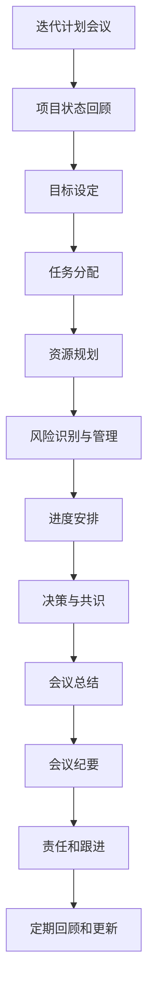
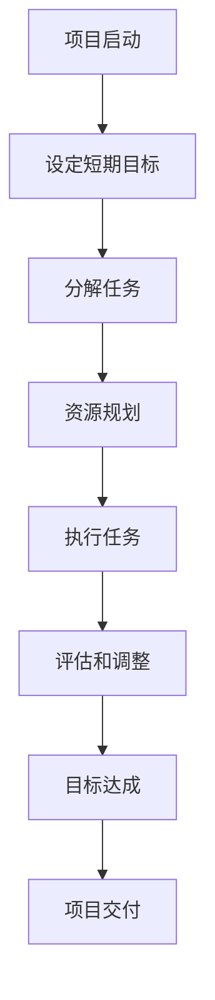
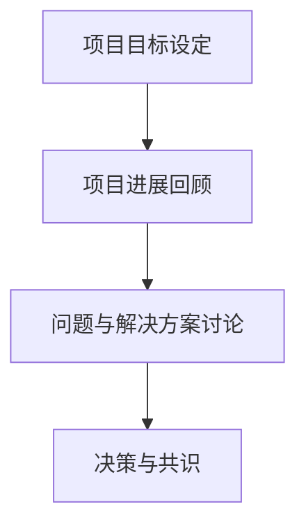
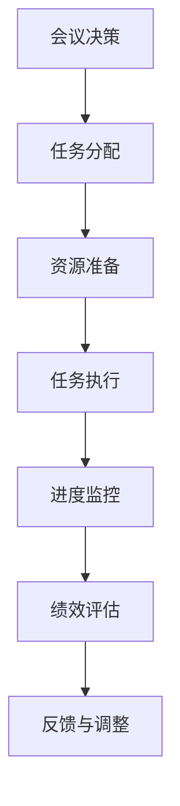
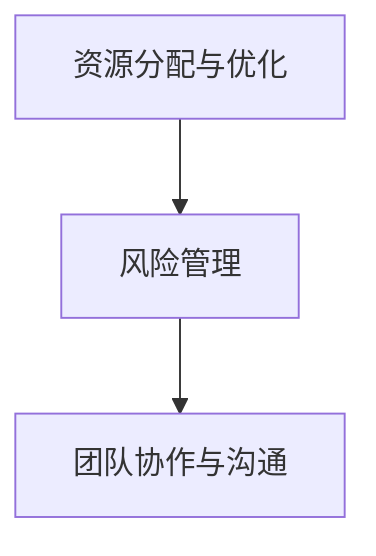
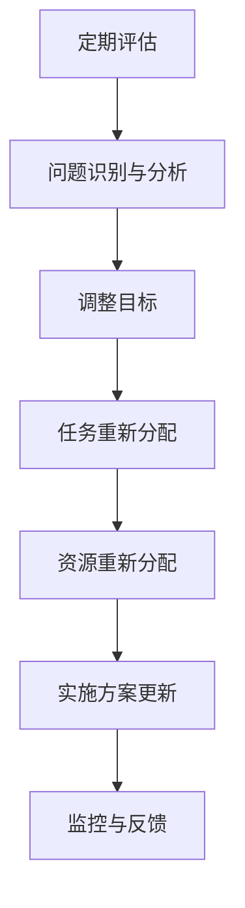
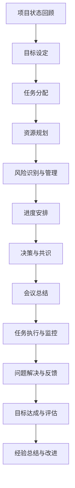
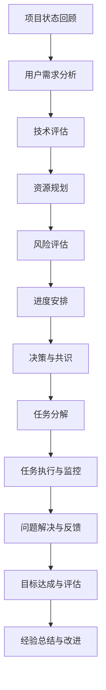
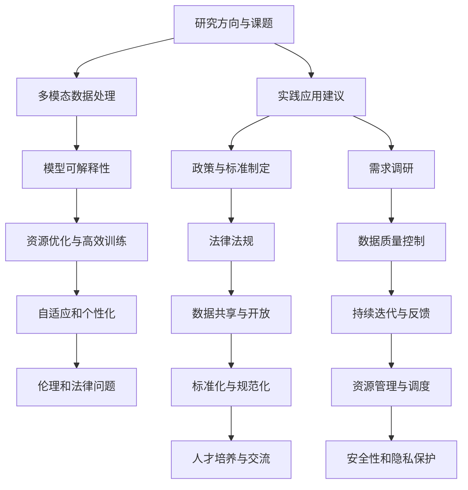

                 

### 文章标题

《LLM应用的迭代计划会议：设定明确的短期目标》

### 文章关键词

- 语言模型（LLM）
- 迭代计划会议
- 短期目标
- SMART原则
- 项目管理
- 技术开发

### 文章摘要

本文将深入探讨语言模型（LLM）在技术开发中的应用，特别是迭代计划会议中如何设定明确的短期目标。文章首先介绍了LLM的基础概念和其在现代科技中的应用场景，然后详细阐述了迭代计划会议的重要性及其在LLM项目开发中的具体实践。接着，文章重点讨论了短期目标的设定原则、方法和策略，以及如何在迭代计划会议中有效实现短期目标。最后，通过实际案例分析和最佳实践，本文为读者提供了宝贵的技术指南和操作建议。文章旨在为开发者和管理者提供一套系统化的迭代计划方法论，以优化LLM项目的开发流程和成果。

---

# 引言

语言模型（LLM，Language Model）是自然语言处理（NLP，Natural Language Processing）领域的关键技术之一。它通过学习大量的语言数据，能够预测下一个词或句子，从而生成文本、进行对话和回答问题。LLM在当今的科技领域中具有广泛的应用，如文本生成、机器翻译、语音识别、智能客服、智能写作等。随着人工智能技术的不断进步，LLM的应用前景愈发广阔，其性能和效果也在不断提升。

然而，在LLM的实际应用过程中，项目管理显得尤为重要。为了确保项目的顺利进行和目标的达成，开发者需要采用一种高效、系统化的方法来规划和管理项目开发过程。迭代计划会议作为一种常见的管理工具，在这种背景下发挥了关键作用。迭代计划会议是一种定期召开的会议，用于讨论项目进度、设定短期目标、解决问题和调整计划。通过迭代计划会议，团队可以保持对项目的持续关注，及时调整策略，提高开发效率和项目质量。

本文将围绕LLM应用的迭代计划会议，探讨如何设定明确的短期目标。文章首先介绍LLM的基础概念和其在现代科技中的应用，然后详细阐述迭代计划会议的必要性及其在LLM项目开发中的具体实践。接下来，文章将讨论短期目标的设定原则、方法和策略，以及如何在迭代计划会议中有效实现短期目标。通过实际案例分析和最佳实践，本文将为读者提供实用的指导和建议，帮助他们在LLM项目中实现高效开发和目标达成。

## 第一部分：背景与概念

### 1.1.1 语言模型（LLM）的定义与历史

语言模型（Language Model，简称LLM）是一种概率模型，用于预测一段文本的下一个词或符号。它通过对大量语言数据进行学习，捕捉到语言的统计规律和语法结构，从而能够在给定前文的情况下，生成合理的后续文本。语言模型是自然语言处理（NLP，Natural Language Processing）领域的一项核心技术，广泛应用于文本生成、机器翻译、语音识别、智能客服、文本摘要、情感分析等多种应用场景。

#### 语言模型的起源与发展历程

语言模型的起源可以追溯到20世纪50年代。当时，研究者们开始尝试通过计算机程序模拟人类语言生成和理解的能力。早期的语言模型主要基于规则的方法，例如上下文无关文法（CFG，Context-Free Grammar）和上下文相关文法（CG，Context-Dependent Grammar）。这些模型通过手动定义语法规则来描述语言的生成过程，但它们过于复杂且难以扩展。

随着计算机性能的提升和大规模数据集的获取，概率模型开始成为语言模型的主流。1952年，哈里·马克拉夫金（Harry Markov）提出了马尔可夫模型（Markov Model），这是一种基于概率的状态转移模型，可以有效地预测下一个词的概率。马尔可夫模型在语言生成中的应用取得了显著成果，为后续的改进奠定了基础。

20世纪80年代，基于神经网络的模型开始崭露头角。1982年，罗恩·艾尔温（Ronald Elvin）和约翰·霍普菲尔德（John Hopfield）提出了Hopfield网络，这种神经网络模型可以用于模式识别和记忆恢复。1990年代初，基于神经网络的统计语言模型逐渐取代了传统的规则方法，成为语言处理的主流工具。

近年来，深度学习技术的快速发展为语言模型带来了新的突破。2003年，乔治·H·唐（Geoffrey Hinton）等人提出了深度信念网络（Deep Belief Network，DBN），这种多层神经网络模型能够自动学习复杂的数据特征。随着深度学习技术的发展，2006年，达姆·库梅尔（Damian Kwist）和约翰·布莱克本（John Blac

### 1.1.2 迭代计划会议的必要性

#### 迭代计划会议的概念

迭代计划会议（Iteration Planning Meeting）是一种定期进行的会议，通常在项目开发的每个迭代周期开始时召开。在这种会议中，项目团队成员会共同讨论并确定项目的短期目标、任务分配、进度安排和资源需求。迭代计划会议的核心目标是确保项目按计划进行，及时发现并解决问题，以提高项目的开发效率和成果质量。

#### 迭代计划会议在LLM项目开发中的重要性

在LLM项目中，迭代计划会议的重要性体现在以下几个方面：

1. **灵活性**：LLM项目通常涉及复杂的算法设计和大量的数据训练，这些过程可能需要多次迭代和调整。通过定期召开迭代计划会议，团队可以灵活地应对项目变化，及时调整开发计划和策略。

2. **目标导向**：迭代计划会议有助于明确项目的短期目标，并将其分解为具体的任务和里程碑。这种目标导向的方法能够确保团队在开发过程中始终关注项目目标，提高开发效率和成果质量。

3. **问题发现与解决**：在迭代计划会议中，团队成员可以共同讨论项目中遇到的问题和挑战，分享经验和建议，找到解决问题的方法。这种集思广益的方式有助于提高问题解决的效率和质量。

4. **团队协作**：迭代计划会议是一种团队协作的工具，能够促进团队成员之间的沟通和合作。通过定期交流和互动，团队成员可以更好地理解项目需求和目标，增强团队的凝聚力和协作能力。

#### 迭代计划会议与传统会议的区别

与传统会议相比，迭代计划会议具有以下特点：

1. **周期性**：迭代计划会议通常是周期性进行的，例如每周或每月一次。这种定期的会议安排有助于团队保持对项目的持续关注，及时调整开发计划和策略。

2. **目标明确**：在迭代计划会议中，团队会明确设定短期目标，并将其分解为具体的任务和里程碑。这种目标明确的方法有助于提高开发效率和成果质量。

3. **任务分配**：迭代计划会议不仅讨论项目进度，还会明确每个团队成员的任务和责任。这种明确的任务分配有助于提高团队协作效率和项目进度控制。

4. **问题解决**：迭代计划会议强调问题发现和解决，团队成员可以共同讨论项目中遇到的问题，分享经验和建议，找到解决问题的方法。

5. **敏捷性**：迭代计划会议更加灵活，能够快速适应项目变化和需求调整。这种敏捷性有助于提高项目的响应速度和适应性。

通过以上分析可以看出，迭代计划会议在LLM项目开发中具有不可替代的重要性。它不仅有助于明确项目目标和任务，提高团队协作效率，还能够灵活应对项目变化和问题，确保项目顺利进行和目标达成。

### 1.1.3 短期目标的设定原则

#### 短期目标的重要性

在项目开发过程中，短期目标（Short-term Goals）的设定具有重要意义。短期目标是指在未来一段时间内需要达成的具体目标，通常与项目的里程碑或迭代周期相一致。以下为短期目标在项目开发中的几个关键作用：

1. **明确方向**：短期目标能够明确项目的方向和目标，为团队成员提供清晰的方向感。这有助于团队集中精力，专注于实现关键任务和成果。

2. **提高效率**：设定短期目标有助于团队在有限的资源下进行高效工作。通过分解任务和明确责任，团队可以更好地分配资源，提高工作效率。

3. **促进沟通**：短期目标的设定需要团队成员之间的密切合作和沟通。这种沟通有助于团队成员了解彼此的工作内容和进度，增强团队凝聚力。

4. **及时调整**：短期目标的设定使得团队能够及时发现和解决问题。在项目开发过程中，技术难题、资源限制和需求变化等情况时有发生，通过定期评估短期目标的实现情况，团队可以及时调整计划和策略。

#### 短期目标的设定原则

为了确保短期目标的有效性和可行性，需要遵循以下设定原则：

1. **SMART原则**

   SMART原则是一种广泛使用的目标设定方法，它包括五个关键要素：具体（Specific）、可衡量（Measurable）、可实现（Achievable）、相关（Relevant）和有时限（Time-bound）。具体原则如下：

   - **具体**：目标需要明确、具体，避免模糊和抽象。例如，“开发一个语言模型”不如“开发一个能够进行文本生成的语言模型”具体。
   - **可衡量**：目标需要可衡量，以便团队能够评估目标的实现程度。例如，目标可以是“训练语言模型，使其在某个数据集上的准确率达到90%”。
   - **可实现**：目标需要是可实现的，即团队成员有足够的能力和资源来实现目标。例如，如果团队成员缺乏必要的技能或资源，设定一个过于雄心勃勃的目标可能会导致失败。
   - **相关**：目标需要与项目的整体目标保持一致，确保短期目标对项目整体有积极的影响。例如，如果项目的整体目标是提高用户体验，那么短期目标可以是“优化用户界面的响应速度”。
   - **有时限**：目标需要有时限，以便团队能够明确目标的实现时间。例如，目标可以是“在三个月内完成语言模型开发”。

2. **目标分解**

   为了实现短期目标，需要将目标分解为具体的任务和子目标。目标分解的步骤如下：

   - **确定主要任务**：根据短期目标，确定需要完成的主要任务。例如，如果短期目标是“开发一个文本生成语言模型”，那么主要任务可能包括数据准备、模型训练和测试、系统集成等。
   - **分解为子目标**：将主要任务进一步分解为子目标。例如，对于“模型训练和测试”，可以分解为“数据清洗和预处理”、“模型选择和配置”、“模型训练”、“模型评估”等子目标。
   - **分配责任**：明确每个子目标的负责人和责任。这有助于确保任务按时完成，并避免责任不明导致的延误和混乱。

3. **持续评估与调整**

   短期目标的实现需要持续评估和调整。以下为评估和调整的步骤：

   - **定期检查**：定期检查短期目标的实现情况，通常在迭代计划会议中进行。这有助于团队及时发现问题和调整计划。
   - **评估成果**：根据设定的衡量标准，评估短期目标的实现成果。例如，如果目标是“训练语言模型，使其在某个数据集上的准确率达到90%”，可以检查实际准确率是否符合预期。
   - **调整计划**：根据评估结果，调整短期目标的实现计划。如果目标未实现，需要分析原因并制定改进措施；如果目标实现超出预期，可以考虑进一步优化和扩展。

通过遵循以上原则和步骤，团队可以有效地设定和实现短期目标，提高项目开发效率和成果质量。

### 1.1.4 迭代计划会议的议程与流程

迭代计划会议（Iteration Planning Meeting）是项目开发过程中至关重要的一环。通过有效的迭代计划会议，团队可以明确项目目标、规划任务和资源，确保项目按计划顺利进行。以下是迭代计划会议的基本议程、流程管理的关键点和会议记要的记录方法。

#### 迭代计划会议的基本议程

1. **项目状态回顾**
   - 上次迭代完成情况
   - 已完成任务的总结
   - 遇到的问题和挑战

2. **目标设定**
   - 根据项目计划和需求，设定本次迭代的目标
   - 确定短期目标的具体任务和里程碑

3. **任务分配**
   - 将短期目标分解为具体任务
   - 分配任务给团队成员，明确每个人的责任和角色

4. **资源规划**
   - 评估任务所需的资源，如人力、时间和技术支持
   - 确保资源分配合理，避免资源浪费或不足

5. **风险识别与管理**
   - 识别项目中潜在的风险和挑战
   - 制定风险应对策略和预案

6. **进度安排**
   - 制定详细的迭代计划，明确任务完成的时间节点
   - 确保项目进度与目标保持一致

7. **决策与共识**
   - 团队成员共同讨论并决定迭代计划
   - 达成共识，确保团队成员对计划的一致理解和支持

8. **会议总结**
   - 汇总会议讨论的内容和决策
   - 明确下一步行动计划和责任分工

#### 流程管理的关键点

1. **明确会议目标和议程**
   - 在会议开始前，明确会议的目标和议程，确保会议内容有条不紊

2. **充分准备**
   - 会议前准备相关资料和数据，确保会议讨论的资料准确和全面

3. **鼓励参与和讨论**
   - 鼓励团队成员积极参与讨论，提出意见和建议

4. **记录会议记要**
   - 及时记录会议讨论的内容、决策和责任分工，确保会议成果的可追溯性和执行力

5. **会议纪要的整理与分发**
   - 会议结束后，整理会议纪要，并分发给团队成员和相关人员，确保每个人都了解会议内容和行动计划

#### 会议记要的记录方法

1. **结构化记录**
   - 使用结构化的方式记录会议内容，包括时间、地点、参会人员、讨论内容、决策和责任分工等

2. **使用工具**
   - 使用项目管理工具或会议记录软件，如Microsoft Teams、Slack、Trello等，方便记录、整理和分发会议资料

3. **明确责任和跟进**
   - 在会议纪要中明确每个任务的责任人和完成时间，确保任务的执行和跟进

4. **定期回顾和更新**
   - 定期回顾和更新会议纪要，确保项目进度和计划的一致性

通过有效的迭代计划会议，团队可以确保项目目标的实现，提高开发效率和成果质量。以下是迭代计划会议的流程图，用于帮助团队理解和实施迭代计划会议：

通过以上流程，团队可以确保项目开发过程的有序进行，及时调整和优化计划，实现项目的成功交付。

### 1.1.5 短期目标在LLM项目开发中的适用性

在LLM项目开发中，短期目标的设定和实现至关重要。以下是短期目标在LLM项目开发中的作用、面临的挑战以及其价值的具体分析：

#### 短期目标在LLM项目开发中的作用

1. **明确开发方向**：短期目标能够为LLM项目的开发提供明确的方向和目标。通过设定具体的任务和里程碑，团队可以更好地理解项目的要求和期望，从而集中精力实现关键功能。

2. **提高开发效率**：短期目标的设定有助于团队在有限的资源下进行高效工作。通过将大型任务分解为具体的小任务，团队可以更好地分配资源，提高工作效率。

3. **及时反馈与调整**：在LLM项目开发中，技术难题和需求变化是常见的问题。通过设定短期目标，团队可以定期评估项目进度和成果，及时发现并解决问题，确保项目按计划进行。

4. **增强团队协作**：短期目标的实现需要团队成员之间的密切合作和沟通。通过共同设定和实现短期目标，团队成员可以更好地了解彼此的工作内容和进度，增强团队协作和凝聚力。

#### 短期目标在LLM项目开发中面临的挑战

1. **任务分解困难**：LLM项目通常涉及复杂的算法设计和大量的数据训练，任务分解可能较为困难。团队需要确保分解的任务既具体又有可实现性，避免任务过于琐碎或过于宏大。

2. **资源限制**：在资源有限的情况下，团队需要合理分配资源和时间，确保短期目标的实现。资源限制可能包括人力资源、计算资源和数据资源等，团队需要综合考虑这些因素，制定可行的计划。

3. **需求变化**：LLM项目在开发过程中可能会遇到需求变化，这可能会影响短期目标的实现。团队需要具备灵活性和快速响应能力，及时调整计划以适应需求变化。

4. **技术挑战**：LLM项目涉及的技术复杂，例如模型选择、训练和优化等。团队需要具备相应的技术能力，以确保短期目标的实现。

#### 短期目标在LLM项目开发中的价值

1. **优化开发流程**：通过设定和实现短期目标，团队可以优化LLM项目的开发流程。具体任务和里程碑的设定有助于团队更好地控制开发进度，确保项目按时交付。

2. **提高项目质量**：短期目标的设定和实现有助于团队关注项目的关键功能和质量要求。通过定期评估和调整短期目标，团队可以及时发现和解决潜在问题，提高项目质量。

3. **增强团队协作**：短期目标的实现需要团队成员之间的密切合作和沟通。通过共同设定和实现短期目标，团队成员可以更好地理解彼此的工作内容和进度，增强团队协作和凝聚力。

4. **提升项目成功率**：通过设定和实现短期目标，团队可以确保项目按计划进行，减少项目延期和失败的风险。短期目标的实现有助于提高项目的成功率，为项目的长期成功奠定基础。

总之，短期目标在LLM项目开发中具有重要的作用和巨大价值。通过合理设定和实现短期目标，团队可以优化开发流程，提高项目质量，增强团队协作，提升项目成功率。以下是一个简化的流程图，用于描述短期目标在LLM项目开发中的应用：

通过以上流程，团队可以确保LLM项目的成功开发和交付。

## 第二部分：LLM应用的现状与挑战

### 2.1.1 当前LLM应用领域概览

语言模型（LLM，Language Model）作为一种先进的自然语言处理技术，已经在多个领域得到广泛应用。以下是对当前LLM应用领域的概览，包括文本生成、自然语言处理、语言翻译和语音识别等方面的具体应用实例。

#### 文本生成

文本生成是LLM应用的重要领域之一，主要利用LLM生成各种类型的文本，如文章、新闻、故事、对话等。以下是一些典型的应用实例：

1. **自动写作**：自动写作系统利用LLM生成新闻报道、财经评论、体育赛事报道等，大大提高了新闻生产效率。例如，总部位于华盛顿的美国人工智能公司Hugging Face开发的自动写作工具，能够自动生成高质量的新闻报道。

2. **聊天机器人**：聊天机器人利用LLM进行对话生成，可以模拟人类对话，提供实时交互体验。例如，苹果公司开发的智能助手Siri和亚马逊的Alexa都使用了LLM技术，用于理解和生成自然语言回复。

3. **内容生成**：LLM在内容生成领域的应用也非常广泛，包括生成广告文案、营销内容、博客文章等。例如，OpenAI开发的GPT-3模型，能够生成高质量的文本内容，广泛应用于自动写作和内容生成平台。

#### 自然语言处理

自然语言处理（NLP，Natural Language Processing）是LLM应用的核心领域，涉及文本的提取、分类、理解、生成等任务。以下是一些典型的应用实例：

1. **文本分类**：LLM在文本分类任务中表现出色，能够对大量的文本进行自动分类。例如，垃圾邮件检测系统利用LLM技术，能够准确识别和分类垃圾邮件。

2. **情感分析**：LLM在情感分析任务中能够分析文本中的情感倾向，例如正面、负面或中性。这有助于企业了解用户反馈和市场需求，从而做出更明智的商业决策。

3. **问答系统**：LLM在问答系统中的应用，能够对用户提出的问题进行理解和回答。例如，微软的小冰和谷歌的Bard都使用了LLM技术，为用户提供智能问答服务。

#### 语言翻译

语言翻译是LLM应用的另一个重要领域，利用LLM技术实现高效准确的语言翻译。以下是一些典型的应用实例：

1. **机器翻译**：LLM在机器翻译任务中，能够将一种语言的文本翻译成另一种语言。例如，谷歌翻译和百度翻译都使用了基于LLM的翻译技术，为用户提供高质量的语言翻译服务。

2. **跨语言文本生成**：LLM能够生成跨语言的文本内容，例如将一种语言的文本生成为另一种语言。这有助于跨国企业和国际组织实现跨语言沟通和协作。

3. **多语言对话**：LLM在多语言对话中的应用，能够支持用户在不同语言之间的自然对话。例如，微软的小冰和谷歌的多语言对话平台，都能够支持用户在多种语言之间的交流。

#### 语音识别

语音识别是LLM应用的另一个重要领域，利用LLM技术实现语音到文本的转换。以下是一些典型的应用实例：

1. **语音助手**：语音助手（如苹果的Siri、亚马逊的Alexa和谷歌的Google Assistant）利用LLM技术，能够理解和回答用户的语音指令，提供智能化的交互体验。

2. **实时语音翻译**：LLM在实时语音翻译中的应用，能够将一种语言的语音实时翻译成另一种语言。例如，谷歌的实时语音翻译功能，能够支持用户在不同语言之间的实时交流。

3. **语音识别与合成**：LLM在语音识别与合成中的应用，能够将语音转化为文本，并将文本转化为语音。这有助于实现智能化的语音交互和语音合成服务。

总之，LLM在当前的技术领域中具有广泛的应用，涵盖了文本生成、自然语言处理、语言翻译和语音识别等多个领域。随着LLM技术的不断发展和完善，其在未来的应用前景将更加广阔。

### 2.1.2 LLM应用中的常见问题

在LLM（Language Model）的实际应用过程中，尽管其强大的生成能力和处理能力为许多任务提供了高效的解决方案，但也面临一系列常见问题。以下是LLM应用中常见的几个问题及其影响，以及可能的解决方案和应对策略。

#### 数据偏差

数据偏差是指模型在训练过程中，由于训练数据的不完整性、偏向性或错误，导致模型对某些情况或群体产生不公平或不准确的预测。以下为数据偏差的几个具体影响：

1. **不公平预测**：如果训练数据中包含了性别、种族、年龄等偏向性，模型可能会产生性别歧视、种族歧视或年龄歧视等不公平预测。
2. **错误泛化**：模型在特定条件下表现良好，但在其他情况下可能产生错误的预测，这称为错误泛化。

**解决方案与应对策略**：

1. **数据清洗**：在训练模型之前，对数据进行清洗，去除噪声、错误和不完整的数据。
2. **数据多样性**：确保训练数据具有多样性，包括不同群体和不同情境的数据，以减少偏差。
3. **加权与平衡**：在训练过程中，对偏向性数据进行加权或平衡，以减少偏差的影响。

#### 模型可解释性

模型可解释性（Model Interpretability）是指用户能够理解模型的工作原理和决策过程。缺乏可解释性的模型可能会导致以下问题：

1. **不信任**：用户可能不信任无法解释其决策的模型，这会影响模型的接受度和应用效果。
2. **法律和伦理问题**：在某些领域，如金融、医疗和法律，模型的决策过程需要透明和可解释，以遵守相关法规和伦理标准。

**解决方案与应对策略**：

1. **模型可视化**：通过可视化工具，如热力图、决策树和注意力机制等，展示模型的工作原理和决策过程。
2. **解释性算法**：使用可解释性算法，如LIME（Local Interpretable Model-agnostic Explanations）和SHAP（SHapley Additive exPlanations），为模型提供解释。
3. **透明度报告**：生成透明度报告，详细说明模型的训练过程、数据来源和决策逻辑，以增加用户的信任。

#### 模型规模与计算资源需求

LLM模型的训练和部署通常需要大量的计算资源和时间，这可能导致以下问题：

1. **计算资源不足**：特别是在企业环境中，计算资源可能有限，难以支持大规模模型的训练和部署。
2. **部署延迟**：模型训练时间较长，可能导致部署延迟，影响应用效果。

**解决方案与应对策略**：

1. **分布式训练**：使用分布式计算框架，如TensorFlow和PyTorch，将模型训练任务分配到多个节点，以加速训练过程。
2. **优化算法**：使用优化算法和预处理技术，减少模型的训练时间和计算需求。
3. **云计算服务**：利用云计算服务，如AWS、Google Cloud和Azure，提供强大的计算资源和存储服务，以支持大规模模型训练和部署。

通过识别和解决这些问题，LLM的应用效果可以显著提高，从而在更广泛的领域实现其潜力。

### 2.1.3 短期目标在LLM应用中的适用性

短期目标在LLM（Large Language Model）应用中具有重要的适用性，特别是在优化和开发LLM模型的过程中。以下从多个角度探讨短期目标在LLM应用中的作用、挑战和具体策略：

#### 短期目标在LLM优化中的作用

1. **指导优化方向**：短期目标的设定为LLM优化提供了明确的方向。例如，目标可以是提高模型在特定数据集上的文本生成质量或准确率，这有助于团队集中资源进行针对性的优化。
2. **提高开发效率**：通过设定短期目标，团队可以分阶段进行优化工作，每阶段的目标都是可衡量和可实现的。这种分阶段的方法有助于提高开发效率，避免资源浪费。
3. **及时反馈和调整**：短期目标的实现过程中，团队可以定期评估模型的性能，根据评估结果及时调整优化策略。这种及时反馈机制有助于持续改进模型性能。

#### 短期目标在LLM开发中的挑战

1. **复杂性**：LLM模型的优化和开发过程涉及多种复杂的技术，如深度学习算法、大数据处理和分布式计算。设定短期目标需要考虑到这些复杂性，确保目标具有可实现性。
2. **资源限制**：优化LLM模型通常需要大量的计算资源和时间，特别是在训练大规模模型时。团队需要在有限的资源下设定短期目标，确保目标的实现不受到资源限制。
3. **需求变化**：在LLM应用开发过程中，需求可能会发生变化，如用户反馈、市场变化和技术进步等。这要求团队具备灵活性和快速响应能力，以调整短期目标。

#### 短期目标的设定策略

1. **SMART原则**：使用SMART原则（具体、可衡量、可实现、相关和有时限）来设定短期目标。例如，目标可以是“在未来一个月内，将模型在特定数据集上的文本生成准确率提高5%”。
2. **任务分解**：将短期目标分解为具体任务，明确每个任务的负责人和完成时间。例如，如果目标是在一个月内提高文本生成准确率，任务可能包括数据预处理、模型训练和性能评估等。
3. **资源规划**：在设定短期目标时，要充分考虑所需资源，包括计算资源、数据资源和人力资源等。确保资源分配合理，避免资源浪费。
4. **需求分析**：在设定短期目标时，要充分分析用户需求和市场变化，确保目标与实际应用场景相符。

#### 具体策略

1. **阶段性目标**：设定阶段性目标，每阶段的目标都应与项目进度和需求相符。例如，在项目启动阶段，可以设定初步模型开发的目标；在项目中期，可以设定模型优化和性能提升的目标；在项目后期，可以设定模型部署和用户反馈收集的目标。
2. **定期评估**：定期评估短期目标的实现情况，包括任务进度、资源利用率和模型性能等。通过评估结果，及时调整目标和策略，确保项目按计划进行。
3. **协作与沟通**：在实现短期目标的过程中，要加强团队成员之间的协作和沟通。通过定期会议和报告，确保团队成员了解项目进展和目标，协同合作，共同解决问题。

通过合理设定和实现短期目标，团队可以优化LLM模型，提高模型性能和应用效果，为LLM在更广泛领域的应用奠定基础。

### 3.1.1 迭代计划会议的组织

在LLM项目中，迭代计划会议（Iteration Planning Meeting）的组织至关重要。以下将从参会人员的角色与职责、会议时间与地点安排、会议材料与准备工作等方面详细讨论如何高效组织迭代计划会议。

#### 参会人员的角色与职责

迭代计划会议的参与人员通常包括以下角色：

1. **项目经理**：负责会议的组织和引导，确保会议按照议程进行，并协调团队成员的工作。
2. **技术负责人**：负责技术讨论，提供技术指导和建议，确保项目技术路线的可行性和正确性。
3. **开发人员**：参与项目开发，负责实现具体的任务和功能。
4. **测试人员**：负责测试和验证项目的功能，确保项目的质量和稳定性。
5. **产品经理**：负责产品需求分析，确保项目开发符合用户需求和市场需求。
6. **数据科学家**：负责数据分析和模型优化，提供模型训练和调优的技术支持。

每个角色在会议中都有特定的职责：

- **项目经理**：制定会议议程，主持会议，确保会议高效进行，并记录会议纪要。
- **技术负责人**：提供技术路线和方案，解答技术问题，确保项目的技术可行性和稳定性。
- **开发人员**：讨论任务的分工和进度安排，提供开发过程中的技术支持。
- **测试人员**：讨论测试计划和测试策略，确保项目功能达到预期质量标准。
- **产品经理**：提供产品需求和用户反馈，确保项目开发符合用户需求。
- **数据科学家**：讨论模型优化和数据分析，提供模型训练和调优的技术支持。

#### 会议时间与地点安排

迭代计划会议的时间安排通常取决于项目的进度和团队的实际情况。以下是一些常见的时间安排建议：

1. **频率**：迭代计划会议可以每周、每两周或每月召开一次，具体频率根据项目的复杂程度和进度安排。
2. **时长**：会议时长通常在1-2小时，确保会议内容精简、高效。
3. **时间节点**：在项目启动阶段和关键里程碑节点，可以增加会议频率，确保项目按计划进行。

会议地点的选择应考虑以下因素：

1. **便利性**：选择团队成员易于到达的地点，如公司会议室、咖啡厅或远程在线会议平台。
2. **设备**：确保会议场所具备良好的网络环境和必要的会议设备，如投影仪、音响系统和网络会议软件。
3. **安静**：选择一个安静、无干扰的环境，确保会议顺利进行。

#### 会议材料与准备工作

为了确保迭代计划会议的高效和有序，需要提前准备以下会议材料：

1. **会议议程**：明确会议的主题和议程，包括项目状态回顾、目标设定、任务分配、资源规划等内容。
2. **项目进度报告**：提供项目当前进度和关键任务的完成情况，包括已完成的任务、正在进行的任务和计划中的任务。
3. **需求文档**：更新最新的产品需求和用户反馈，确保项目开发符合用户需求。
4. **技术文档**：提供技术方案和实现细节，确保团队成员对项目技术路线有清晰的理解。
5. **风险评估**：列出项目中潜在的风险和挑战，制定相应的应对措施和预案。

在会议准备工作阶段，项目经理应确保所有参会人员提前收到会议材料，并提供充足的时间进行预览和准备。同时，项目经理还应确保会议设备正常运作，网络连接稳定，以便会议顺利进行。

通过以上组织和准备工作，团队可以确保迭代计划会议的高效和有序，为LLM项目的顺利推进和目标达成提供有力支持。

### 3.1.2 迭代计划会议的讨论内容

在迭代计划会议中，讨论的内容至关重要，它直接关系到项目的进度、质量和目标达成。以下将详细讨论迭代计划会议的讨论内容，包括短期目标的设定、项目进展回顾和遇到的问题与解决方案。

#### 短期目标的设定

设定短期目标是迭代计划会议的核心内容之一。短期目标的设定需要遵循SMART原则，即具体、可衡量、可实现、相关和有时限。以下为具体讨论步骤：

1. **目标概述**：项目经理或产品经理首先概述本次迭代的目标，确保所有参会人员对目标有清晰的理解。
2. **目标细化**：团队成员针对目标进行细化，明确需要完成的任务和里程碑。例如，如果目标是在一个月内优化语言模型的生成质量，可以细化为实现以下任务：
   - 数据预处理
   - 模型重训练
   - 生成文本评估与优化
3. **任务分配**：根据任务细化结果，明确每个任务的负责人和完成时间。确保任务分配合理，避免过度负担或资源浪费。
4. **资源需求**：讨论每个任务所需的资源，如计算资源、数据资源和人力资源等。确保资源分配合理，确保任务能够按时完成。
5. **时间节点**：设定每个任务的完成时间节点，确保项目进度可控。例如，可以将一个月的时间节点细化为每周的任务进度，以便更好地监控和调整项目进度。

#### 项目进展回顾

项目进展回顾是迭代计划会议的重要组成部分，用于总结和评估上一个迭代周期的项目进展。以下为具体讨论步骤：

1. **已完成任务**：回顾上一个迭代周期内已完成的任务，包括任务的完成情况、质量和反馈。对完成的任务进行总结和评估，识别成功经验和可复制的最佳实践。
2. **正在进行任务**：讨论正在进行中的任务，了解任务进度和面临的挑战。对任务的进展情况进行实时监控，确保任务按计划进行。
3. **未完成任务**：对未完成的任务进行分析，找出原因和解决方案。讨论如何改进和调整计划，确保未完成的任务能够在下一个迭代周期内完成。
4. **问题与风险**：识别项目中存在的潜在问题和风险，讨论如何预防和解决。确保项目团队能够应对可能出现的挑战，保证项目的顺利进行。

#### 遇到的问题与解决方案

在迭代计划会议中，团队成员通常需要分享和讨论项目中遇到的问题和挑战，并共同寻找解决方案。以下为具体讨论步骤：

1. **问题识别**：团队成员分享在项目开发过程中遇到的问题和挑战，如技术难题、资源限制、需求变化等。
2. **问题分析**：对识别出的问题进行深入分析，找出问题的根本原因。例如，如果语言模型生成文本质量不高，可能是因为数据集质量不佳或模型参数设置不当。
3. **解决方案讨论**：讨论可能的解决方案和优化策略，评估每个方案的优缺点和可行性。确保解决方案具有实际操作性和可执行性。
4. **决策与共识**：团队成员共同决策并达成共识，选择最佳的解决方案。明确每个解决方案的责任人和实施时间，确保问题能够及时得到解决。

通过以上讨论内容，迭代计划会议能够确保项目目标明确、任务分配合理、问题及时解决，从而提高项目的开发效率和质量。以下是一个简化的流程图，用于描述迭代计划会议的讨论内容：

通过以上步骤，团队可以确保迭代计划会议的高效进行，为项目的成功交付奠定基础。

### 3.1.3 迭代计划会议的决策与执行

在迭代计划会议中，决策与执行环节至关重要，它是确保项目目标得以实现的关键步骤。以下将详细讨论如何进行决策、执行方案与责任分配，以及如何通过监控与反馈机制确保决策的有效执行。

#### 决策流程

1. **议题讨论**：在会议中，针对讨论内容（如短期目标、项目进展、问题与解决方案等），团队成员进行深入讨论，提出各自的看法和建议。
2. **决策制定**：在讨论过程中，项目经理或主持人汇总各方意见，根据会议目标和项目实际情况，制定决策。决策应具有可操作性和可行性，并确保所有参会人员达成共识。
3. **决策记录**：将决策内容详细记录在会议纪要中，包括决策事项、决策结果和责任分配，确保会议结果的可追溯性和执行力。

#### 执行方案与责任分配

1. **任务分解**：根据决策内容，将任务分解为具体的子任务和里程碑。每个子任务应明确具体的任务描述、责任人、完成时间和所需资源。
2. **责任分配**：将每个子任务的责任分配给相应的团队成员，确保任务负责人明确，责任清晰。在责任分配过程中，应充分考虑团队成员的能力和资源，避免任务负担过重。
3. **资源准备**：确保任务执行所需的资源（如计算资源、数据资源和人力资源等）已经准备就绪，避免资源短缺影响任务进度。

#### 监控与反馈机制

1. **任务进度监控**：通过定期检查和报告，监控每个任务的进度和完成情况。项目经理或项目负责人应定期收集任务进度数据，确保任务按计划进行。
2. **绩效评估**：根据任务进度和完成情况，对团队成员的绩效进行评估。绩效评估应客观、公正，并作为奖励和改进的依据。
3. **问题反馈与解决**：在监控过程中，如发现任务进度延误或问题，应及时反馈并讨论解决方案。确保问题得到及时解决，避免影响项目整体进度。
4. **迭代调整**：根据监控和反馈结果，对项目计划进行迭代调整，确保项目目标的实现。在必要时，调整任务优先级、资源分配和进度计划，以应对项目变化和挑战。

#### 实施步骤

1. **会议决策**：在迭代计划会议中，根据讨论结果制定决策，明确任务和责任。
2. **任务分配**：将决策内容分解为具体任务，分配给相关团队成员。
3. **资源准备**：确保任务执行所需的资源已经准备就绪。
4. **任务执行**：团队成员按照任务分配和资源准备情况，开始执行任务。
5. **进度监控**：定期检查任务进度，收集任务进度数据。
6. **绩效评估**：根据任务进度和完成情况，对团队成员进行绩效评估。
7. **反馈与调整**：根据监控和反馈结果，及时解决任务执行中遇到的问题，并对项目计划进行迭代调整。

通过以上决策与执行流程，团队可以确保迭代计划会议的决策得到有效执行，任务按计划完成，项目目标得以实现。以下是一个简化的流程图，用于描述决策与执行的步骤：

通过以上步骤，团队可以确保迭代计划会议的决策得到有效执行，为项目的成功交付奠定基础。

### 4.1.1 短期目标的设定方法

在LLM项目开发中，设定明确的短期目标是确保项目按计划进行、提高开发效率和成果质量的关键步骤。以下将详细讨论短期目标的设定方法，包括目标设定理论、SMART原则在短期目标设定中的应用，以及目标分解与任务分配的具体实施步骤。

#### 目标设定理论

目标设定理论（Goal Setting Theory）是由管理学家艾森豪威尔（Eisenhower）提出的一种管理方法，它强调通过设定明确的目标来提高工作效率和成果质量。目标设定理论认为，明确的目标能够为团队成员提供清晰的方向，提高工作动力和执行力。以下是目标设定理论的主要原则：

1. **明确性**：目标应具体、明确，避免模糊和抽象。明确的目标有助于团队成员更好地理解和执行任务。
2. **挑战性**：目标应具有一定的挑战性，能够激励团队成员努力实现目标。挑战性的目标能够激发团队的创新和进取精神。
3. **可衡量性**：目标应可衡量，以便团队能够评估目标的实现程度。可衡量性的目标有助于团队监控进度，及时调整策略。
4. **相关性**：目标应与项目的整体目标和团队职责保持一致。相关性的目标能够确保团队成员的工作对项目整体有积极的影响。
5. **时限性**：目标应有时限，以便团队明确目标的实现时间。时限性的目标有助于团队保持对项目进度的关注，提高工作效率。

#### SMART原则在短期目标设定中的应用

SMART原则是一种广泛使用的目标设定方法，它包括五个关键要素：具体（Specific）、可衡量（Measurable）、可实现（Achievable）、相关（Relevant）和有时限（Time-bound）。SMART原则在短期目标设定中的应用步骤如下：

1. **具体（Specific）**：确保目标具有明确的描述，具体指明需要完成的任务或目标。例如，而不是“提高模型性能”，可以设定为“在一个月内，将语言模型在特定数据集上的生成准确率提高5%”。
2. **可衡量（Measurable）**：设定具体可衡量的标准，以便团队能够评估目标的实现程度。例如，上述的“生成准确率提高5%”就是一个可衡量的目标。
3. **可实现（Achievable）**：确保目标在现有资源和技术条件下是可实现的。如果目标过于宏伟，可能导致团队失去信心和动力。例如，如果团队成员缺乏必要的技能或资源，设定一个过于雄心勃勃的目标是不切实际的。
4. **相关（Relevant）**：确保目标与项目的整体目标和团队职责保持一致。相关性的目标能够确保团队成员的工作对项目整体有积极的影响。
5. **有时限（Time-bound）**：设定具体的时间节点，以便团队明确目标的实现时间。例如，上述的“在一个月内”就是一个有时限的目标。

#### 目标分解与任务分配

在设定短期目标后，需要将目标分解为具体的任务和子目标，并明确每个任务的负责人和责任。以下是目标分解与任务分配的具体步骤：

1. **目标分解**：将短期目标分解为具体的任务和子目标。例如，如果短期目标是“在一个月内，将语言模型在特定数据集上的生成准确率提高5%”，可以将目标分解为以下子任务：
   - 数据预处理
   - 模型重训练
   - 生成文本评估与优化
   - 模型参数调整
2. **任务分配**：将分解后的任务分配给相应的团队成员。例如，可以将数据预处理任务分配给数据工程师，模型重训练任务分配给机器学习工程师，生成文本评估与优化任务分配给测试人员，模型参数调整任务分配给算法工程师。
3. **责任明确**：明确每个任务的负责人和责任。例如，可以在任务分配表中记录每个任务的负责人、完成时间和所需资源，确保任务负责人明确，责任清晰。
4. **资源协调**：确保任务执行所需的资源已经准备就绪。例如，需要计算资源、数据资源和人力资源等。在任务执行过程中，如遇到资源不足的情况，需要及时进行资源协调和调整。

通过以上步骤，团队可以确保短期目标的明确性和可执行性，提高项目的开发效率和成果质量。

### 4.1.2 短期目标的实现策略

在LLM项目的开发过程中，实现短期目标是确保项目按计划进行、提高开发效率和成果质量的关键步骤。以下将详细讨论短期目标的实现策略，包括资源分配与优化、风险管理与预案，以及团队协作与沟通的具体措施。

#### 资源分配与优化

1. **人力资源分配**：根据短期目标的任务需求，合理分配人力资源。确保每个任务都有足够的人员负责，避免任务过度集中或分配不均。同时，考虑团队成员的技能和能力，将合适的人员分配到相应的任务中。
2. **时间管理**：合理安排工作时间，确保任务能够在预定时间内完成。使用项目管理工具，如甘特图或任务管理软件，制定详细的时间表和进度计划，跟踪任务进度，及时调整时间安排。
3. **技术资源协调**：确保项目所需的技术资源（如计算资源、数据资源和工具等）已经准备就绪。在资源有限的情况下，优先分配关键任务所需资源，确保关键任务的顺利进行。
4. **资源优化**：通过优化资源使用，提高资源利用率。例如，使用分布式计算框架和并行处理技术，提高计算资源的使用效率。同时，定期评估资源使用情况，根据项目进展和需求变化，及时调整资源分配策略。

#### 风险管理与预案

1. **风险识别**：在项目开始前，对项目可能面临的风险进行识别和评估。这包括技术风险、需求变化、资源限制等方面的风险。通过风险识别，为风险管理提供基础。
2. **风险分类**：将识别出的风险按照影响程度和发生概率进行分类。对于高影响、高概率的风险，需要制定详细的应急预案。
3. **风险预案**：制定风险预案，明确在风险发生时的应对措施和责任分工。例如，如果遇到技术难题，可以安排技术负责人进行解决；如果遇到资源限制，可以寻求外部支持或调整资源分配策略。
4. **定期评估与更新**：定期评估风险预案的执行情况和有效性，根据项目进展和实际情况进行更新和调整。确保风险预案能够及时应对项目变化和挑战。

#### 团队协作与沟通

1. **明确职责和任务分工**：在项目开始前，明确每个团队成员的职责和任务分工。确保每个成员都了解自己的工作内容和责任，避免重复工作和责任不明。
2. **定期会议与报告**：定期召开团队会议和任务报告会议，确保团队成员之间的沟通和信息共享。通过会议，讨论项目进展、问题和解决方案，协调任务进度和资源需求。
3. **沟通渠道**：建立有效的沟通渠道，确保团队成员能够随时进行沟通和协作。例如，使用即时通讯工具、邮件和项目管理软件等，方便团队成员之间实时沟通和交流。
4. **反馈机制**：建立反馈机制，确保团队成员能够及时反馈问题和建议。通过定期反馈，团队能够及时发现和解决问题，提高项目质量和开发效率。

通过以上策略，团队可以确保短期目标的实现，提高LLM项目的开发效率和成果质量。以下是一个简化的流程图，用于描述短期目标的实现策略：

通过以上步骤，团队可以确保短期目标的实现，为项目的成功交付奠定基础。

### 4.1.3 短期目标的评估与调整

在LLM项目开发过程中，对短期目标的评估与调整是确保项目顺利进行、及时发现问题并采取纠正措施的重要环节。以下将详细讨论评估短期目标达成度的标准、评估方法，以及目标调整的策略与实施步骤。

#### 评估短期目标达成度的标准

为了有效评估短期目标的达成度，需要设定具体的评估标准和指标。以下是一些常见的评估标准：

1. **任务完成率**：衡量任务完成的数量与总任务数量的比例。例如，如果设定了5个任务，实际完成了4个，则任务完成率为80%。
2. **质量标准**：根据项目需求和技术规范，设定质量标准。例如，对于语言模型生成文本的质量，可以设定准确率、流畅度和逻辑一致性等指标。
3. **时间完成率**：衡量任务完成时间与计划完成时间的比例。例如，如果计划在一个月内完成某个任务，实际完成时间为45天，则时间完成率为75%。
4. **资源利用率**：衡量任务执行过程中资源的使用情况。例如，计算资源的利用率、数据资源的消耗等。
5. **用户满意度**：通过用户反馈和满意度调查，评估项目成果是否符合用户需求。

#### 评估方法

1. **定期检查与报告**：在迭代周期内，定期检查短期目标的完成情况。项目经理或负责人可以每周或每月进行一次任务进度和成果的检查，并生成报告。
2. **关键指标分析**：根据设定的评估标准，对任务完成率、质量标准、时间完成率和资源利用率等关键指标进行分析。通过数据分析，评估目标的实现情况。
3. **用户反馈**：收集用户对项目成果的反馈和评价，评估项目成果的实用性和用户满意度。用户反馈可以来自用户调查、用户体验测试和实际使用情况等。
4. **专家评审**：邀请行业专家或项目团队成员进行评审，对项目成果进行专业评估，提供客观、公正的意见和建议。

#### 目标调整的策略与实施步骤

1. **定期评估**：在每次迭代计划会议中，对短期目标的达成情况进行评估。根据评估结果，分析目标设定和任务执行的合理性，确定是否需要调整目标。
2. **问题识别与分析**：在评估过程中，识别目标未能达成的原因。例如，技术难题、资源限制、需求变化等。对问题进行深入分析，找出根本原因。
3. **调整目标**：根据评估结果和问题分析，对短期目标进行调整。调整目标应遵循SMART原则，确保目标具体、可衡量、可实现、相关和有时限。
4. **任务重新分配**：根据调整后的目标，重新分配任务和责任。确保每个任务都有明确的责任人和完成时间，避免任务过度集中或分配不均。
5. **资源重新分配**：根据调整后的任务需求，重新评估和分配资源。确保资源充足且合理利用，避免资源浪费或不足。
6. **实施方案更新**：更新项目的实施方案，包括任务进度计划、资源分配和时间节点等。确保实施方案与调整后的目标一致。
7. **监控与反馈**：在新的目标和计划实施过程中，持续监控任务进度和成果，及时收集反馈并进行调整。确保目标能够按时、按质实现。

通过以上评估与调整策略，团队可以确保短期目标的实现，提高项目质量和开发效率。以下是一个简化的流程图，用于描述短期目标的评估与调整过程：

通过以上步骤，团队可以确保短期目标的实现，为项目的成功交付奠定基础。

### 案例研究：智能客服系统迭代计划会议

智能客服系统是LLM应用的一个重要领域，通过自然语言处理和语言模型技术，提供高效的客户服务体验。在本案例中，我们将详细探讨智能客服系统迭代计划会议的实践，包括案例背景、迭代计划会议的议程与流程，以及短期目标的设定与实现。

#### 案例背景

某大型互联网公司正在开发一款智能客服系统，旨在为用户提供24/7的在线客服支持。该系统基于大型语言模型（LLM）进行设计，能够处理用户的问题并生成合理的回答。项目团队由项目经理、技术负责人、开发人员、测试人员和数据科学家组成。

#### 迭代计划会议的议程与流程

1. **项目状态回顾**：会议开始，项目经理对上一个迭代周期的项目进展进行回顾。内容包括已完成的任务、正在进行的任务和未完成的任务。团队成员分享在项目开发过程中遇到的问题和挑战。

2. **目标设定**：基于项目目标和用户需求，项目经理与技术负责人共同设定本次迭代的目标。目标包括提高语言模型的回答准确性、增加常见问题回答的覆盖率和优化用户界面。

3. **任务分配**：将设定的目标分解为具体任务，并明确每个任务的负责人和完成时间。例如，数据科学家负责数据预处理和模型训练，开发人员负责集成模型和优化用户界面，测试人员负责测试和验证系统性能。

4. **资源规划**：讨论任务执行所需的资源，包括计算资源、数据资源和人力资源。确保资源充足且合理利用，避免资源浪费或不足。

5. **风险识别与管理**：识别项目中潜在的风险，如数据质量问题和模型性能不稳定。制定相应的风险应对策略和预案，确保项目顺利进行。

6. **进度安排**：制定详细的迭代计划，包括任务完成时间节点和里程碑。项目经理与团队成员确认进度计划，确保任务按时完成。

7. **决策与共识**：团队对迭代计划进行讨论，达成共识，确保团队成员对计划的一致理解和支持。

8. **会议总结**：会议结束时，项目经理总结会议内容，记录决策和责任分工。确保会议成果可追溯，并分发给团队成员和相关人员。

#### 短期目标的设定与实现

1. **目标设定**：根据项目需求和用户反馈，设定本次迭代的目标：
   - 提高语言模型回答准确性：在现有基础上，将回答准确率提高5%。
   - 增加常见问题回答覆盖率：添加100个常见问题及其回答，覆盖更多用户需求。
   - 优化用户界面：提高用户界面的响应速度和易用性。

2. **任务分解**：将目标分解为具体任务：
   - 数据科学家：负责数据预处理、模型重训练和性能评估。
   - 开发人员：负责系统集成、用户界面优化和常见问题添加。
   - 测试人员：负责测试和验证系统性能，确保回答准确性和用户体验。

3. **资源规划**：根据任务需求，合理分配计算资源、数据资源和人力资源。例如，增加计算节点以加速模型训练，确保数据科学家有足够的资源进行数据处理和模型训练。

4. **任务执行与监控**：团队成员按计划执行任务，项目经理和项目负责人定期检查任务进度，确保任务按时完成。通过项目管理工具，如Jira或Trello，实时监控任务进展。

5. **问题解决与反馈**：在任务执行过程中，如遇到问题或挑战，团队成员及时反馈并讨论解决方案。通过迭代计划会议，调整任务计划，确保项目顺利进行。

6. **目标达成与评估**：在迭代周期结束时，评估短期目标的实现情况。通过测试和用户反馈，确认回答准确率提高、常见问题回答覆盖率和用户界面优化目标的达成情况。

7. **经验总结与改进**：总结本次迭代的经验和教训，为下一个迭代提供参考。根据评估结果，制定下一阶段的计划和目标。

通过以上迭代计划会议的实践，智能客服系统项目团队能够高效地设定和实现短期目标，提高系统性能和用户满意度。以下是一个简化的流程图，用于描述智能客服系统迭代计划会议的实践：

通过以上步骤，团队可以确保智能客服系统项目的顺利推进，为用户提供高质量的在线客服体验。

### 案例研究：智能写作平台迭代优化

智能写作平台是另一个典型的LLM应用场景，通过自然语言处理技术，帮助用户生成高质量的文本内容。在本案例中，我们将详细探讨智能写作平台迭代优化的实践，包括案例背景、迭代计划会议的讨论内容、短期目标的设定与实现。

#### 案例背景

某互联网公司开发了一款智能写作平台，旨在帮助用户快速生成博客文章、新闻报道和营销文案等。随着用户量的增加和需求的变化，平台需要不断优化和改进，以提供更好的用户体验。项目团队由项目经理、技术负责人、数据科学家、前端和后端开发人员以及产品经理组成。

#### 迭代计划会议的讨论内容

1. **项目状态回顾**：项目经理对上一个迭代周期的项目进展进行回顾，包括已完成的任务、正在进行的任务和未完成的任务。团队成员分享在项目开发过程中遇到的问题和挑战。

2. **用户需求分析**：产品经理对用户需求进行分析，讨论用户反馈和需求变化。基于用户需求，确定本次迭代的目标和优先级。

3. **技术评估**：技术负责人对现有技术和模型性能进行评估，识别技术瓶颈和改进空间。讨论可能的优化方案和策略。

4. **资源规划**：根据任务需求和资源情况，讨论任务执行所需的计算资源、数据资源和人力资源。确保资源充足且合理利用。

5. **风险评估**：识别项目中潜在的风险，如技术难题、需求变化和资源限制等。制定相应的风险应对策略和预案。

6. **进度安排**：制定详细的迭代计划，包括任务完成时间节点和里程碑。项目经理与团队成员确认进度计划，确保任务按时完成。

7. **决策与共识**：团队对迭代计划进行讨论，达成共识，确保团队成员对计划的一致理解和支持。

#### 短期目标的设定与实现

1. **目标设定**：基于用户需求和技术评估结果，设定本次迭代的短期目标：
   - 提高文章生成质量：通过改进模型训练和优化算法，提高文章生成的准确性和流畅度。
   - 增加文本生成样式和风格：扩展平台支持的文本生成样式和风格，满足不同用户需求。
   - 优化用户界面和交互体验：改进用户界面设计，提高平台的易用性和用户体验。

2. **任务分解**：将目标分解为具体任务：
   - 数据科学家：负责数据预处理、模型训练和性能评估。
   - 前端开发人员：负责用户界面设计和交互体验优化。
   - 后端开发人员：负责系统架构优化和接口调整。
   - 产品经理：负责用户需求分析、功能规划和测试。

3. **资源规划**：根据任务需求，合理分配计算资源、数据资源和人力资源。例如，增加计算节点以加速模型训练，确保数据科学家有足够的资源进行数据处理和模型训练。

4. **任务执行与监控**：团队成员按计划执行任务，项目经理和项目负责人定期检查任务进度，确保任务按时完成。通过项目管理工具，如Jira或Trello，实时监控任务进展。

5. **问题解决与反馈**：在任务执行过程中，如遇到问题或挑战，团队成员及时反馈并讨论解决方案。通过迭代计划会议，调整任务计划，确保项目顺利进行。

6. **目标达成与评估**：在迭代周期结束时，评估短期目标的实现情况。通过用户反馈和系统测试，确认文章生成质量、文本生成样式和用户界面优化的目标达成情况。

7. **经验总结与改进**：总结本次迭代的经验和教训，为下一个迭代提供参考。根据评估结果，制定下一阶段的计划和目标。

通过以上迭代计划会议的实践，智能写作平台项目团队能够高效地设定和实现短期目标，提升平台性能和用户满意度。以下是一个简化的流程图，用于描述智能写作平台迭代优化的实践：

通过以上步骤，团队可以确保智能写作平台项目的顺利推进，为用户提供高质量的文本生成服务。

### 案例研究：企业内部沟通平台的LLM应用迭代

企业内部沟通平台是一个重要工具，用于提高团队协作效率和沟通质量。在本案例中，我们将探讨如何在一个企业内部沟通平台上应用LLM技术进行迭代优化，包括迭代计划会议的决策与执行、短期目标的评估与调整以及项目的整体进展。

#### 案例背景

某大型企业正在其内部沟通平台上引入LLM技术，以实现更智能化的消息处理、自动回复和会议记录等功能。该企业内部沟通平台已拥有一定的用户基础和基本功能，但为了满足日益增长的业务需求和提升用户体验，需要通过迭代优化进行功能扩展和性能提升。项目团队由项目经理、数据科学家、前端和后端开发人员、测试工程师和产品经理组成。

#### 迭代计划会议的决策与执行

1. **决策会议**：
   - **需求分析**：产品经理根据用户反馈和业务需求，提出了多个改进方案，包括智能消息处理、自动会议记录和实时翻译等。
   - **技术评估**：数据科学家和开发人员评估了现有技术和LLM模型的能力，确定了哪些功能可以通过LLM技术实现，并讨论了可能的技术挑战和资源需求。
   - **资源分配**：项目经理协调团队资源，确保有足够的人力、时间和技术支持来实施这些改进方案。
   - **风险识别**：团队讨论了可能面临的风险，如数据隐私、模型性能不稳定和用户接受度等，并制定了相应的风险应对策略。

2. **执行计划**：
   - **任务分配**：根据决策结果，将任务分配给相应的团队成员，明确每个任务的负责人和完成时间。
   - **进度监控**：使用项目管理工具（如Jira或Trello）监控任务进度，确保每个任务按时完成。
   - **协作与沟通**：定期召开团队会议，讨论任务进展和遇到的问题，确保团队成员之间的协作和信息共享。

#### 短期目标的评估与调整

1. **评估短期目标**：
   - **任务完成率**：根据任务的完成情况，评估任务完成率是否符合预期。
   - **质量标准**：根据设定的质量标准，如消息处理的准确性、自动会议记录的完整性等，评估功能的质量。
   - **用户反馈**：收集用户对新增功能的反馈，评估用户满意度和接受度。

2. **调整短期目标**：
   - **问题识别**：根据评估结果，识别任务完成和质量方面的不足之处。
   - **原因分析**：分析问题产生的原因，包括技术问题、资源限制或需求变化等。
   - **调整计划**：根据问题分析和用户反馈，调整短期目标，确保目标的可实现性和合理性。

#### 项目整体进展

1. **里程碑达成**：
   - **功能实现**：按照迭代计划，逐步实现了智能消息处理、自动会议记录和实时翻译等功能。
   - **用户培训**：为员工提供使用新功能的培训，确保他们能够充分利用这些新功能。

2. **性能评估**：
   - **系统稳定性**：通过压力测试和性能评估，确保系统的稳定性和响应速度。
   - **用户体验**：通过用户测试和反馈，评估新功能的用户体验和满意度。

3. **持续迭代**：
   - **需求收集**：持续收集用户反馈和业务需求，为下一个迭代提供改进方向。
   - **问题解决**：及时解决用户反馈中的问题，持续优化和改进功能。

通过以上案例研究，我们可以看到企业内部沟通平台通过LLM技术的迭代优化，实现了功能的扩展和性能的提升。迭代计划会议的决策与执行、短期目标的评估与调整以及持续迭代的方法，为项目的成功提供了有力保障。

### 6.1.1 LLM应用的迭代计划会议展望

随着人工智能技术的快速发展，语言模型（LLM，Large Language Model）在各个领域的应用前景愈发广阔。在未来，LLM技术的迭代计划会议将面临一系列技术趋势和挑战，这将推动会议方法的不断优化和改进。

#### 技术趋势

1. **模型规模和计算能力的提升**：随着计算能力的显著提升，未来LLM模型的规模将进一步扩大。这将为迭代计划会议提供更强大的计算资源，使得模型优化和调整过程更加高效。例如，更大规模的模型可以处理更复杂的语言任务，提高文本生成的质量和准确性。

2. **自动化和智能化的迭代流程**：随着人工智能技术的发展，自动化和智能化的迭代流程将成为趋势。例如，自动化工具可以协助项目经理进行任务分配、进度监控和风险评估，智能化的决策支持系统可以帮助团队更好地制定和调整迭代计划。

3. **多模态数据处理**：未来的LLM应用将不仅限于文本数据，还将涉及到图像、音频和视频等多模态数据。这要求迭代计划会议能够处理和整合不同类型的数据，从而更好地理解用户需求和优化模型性能。

4. **个性化定制**：随着用户需求的多样化，个性化的LLM应用将成为趋势。迭代计划会议将需要根据不同用户群体的需求，制定个性化的迭代目标和优化方案，从而提供更加精准和高效的解决方案。

#### 挑战

1. **数据隐私和安全**：随着LLM模型处理的数据规模和种类不断增加，数据隐私和安全将成为一个重大挑战。迭代计划会议需要制定严格的数据保护策略，确保用户数据的安全性和隐私性。

2. **模型可解释性和透明度**：尽管LLM模型的性能不断提升，但其决策过程通常缺乏可解释性。这可能导致用户对模型的不信任，从而影响其应用效果。迭代计划会议需要关注模型可解释性和透明度的问题，通过改进算法和工具，提高模型的可解释性。

3. **资源优化和成本控制**：随着模型规模的扩大和计算需求的增加，资源优化和成本控制将成为重要挑战。迭代计划会议需要制定高效的资源利用策略，降低计算成本，确保项目的可持续性。

4. **跨领域协作与知识共享**：未来的LLM应用将涉及多个领域，如医疗、金融和制造业等。迭代计划会议需要建立有效的跨领域协作机制，促进知识共享和技术交流，从而提高项目的整体效率和质量。

#### 未来发展

1. **标准化和规范化**：为了促进LLM技术的广泛应用和可持续发展，需要制定相应的标准和规范。迭代计划会议可以积极参与标准的制定和推广，为LLM技术的应用提供统一的框架和指南。

2. **持续学习和优化**：迭代计划会议应鼓励团队进行持续学习和优化，通过不断更新知识和技能，提高团队应对新技术和挑战的能力。

3. **用户参与和反馈**：迭代计划会议应注重用户参与和反馈，通过定期收集用户需求和反馈，及时调整迭代目标和优化方案，确保模型的应用效果符合用户期望。

通过以上分析，我们可以看到，未来的LLM应用的迭代计划会议将面临一系列技术趋势和挑战。随着人工智能技术的不断进步，迭代计划会议方法也将不断优化和改进，以适应不断变化的需求和挑战，推动LLM技术的广泛应用和持续发展。

### 6.1.2 未来工作的建议

在LLM应用领域，未来的工作方向不仅需要紧跟技术发展趋势，还需要在实践操作中注重细节和策略。以下是一些建议，旨在为研究者和开发者提供指导，帮助他们在LLM应用中取得更好的成果。

#### 研究方向与课题

1. **多模态数据处理**：随着LLM技术从单一文本处理向多模态数据处理拓展，未来的研究方向可以集中在如何有效整合文本、图像、音频等多种数据类型。这包括开发新的算法和模型，以实现更精准的多模态信息理解和交互。

2. **模型可解释性**：增强模型的可解释性是提高用户信任和合规性的关键。研究者可以探索基于可视化、统计分析等方法，提高模型决策过程的透明度，从而在使用中减少不确定性。

3. **资源优化与高效训练**：未来可以深入研究如何通过改进训练算法、模型压缩和优化技术，降低模型训练所需的计算资源和时间。这有助于提高LLM应用的效率和可扩展性。

4. **自适应和个性化**：未来的工作可以关注如何开发自适应的LLM模型，使其能够根据用户行为和需求动态调整模型参数和策略，实现个性化服务。

5. **伦理和法律问题**：随着LLM应用在社会各个领域的普及，相关的伦理和法律问题也日益突出。研究者应关注如何确保模型的应用符合道德规范，不侵犯用户隐私，并符合相关法律法规。

#### 实践应用建议

1. **需求调研**：在开始任何LLM项目之前，进行详细的需求调研至关重要。了解用户需求、使用场景和业务目标，有助于设计更符合实际需求的应用方案。

2. **数据质量控制**：确保数据的质量是LLM应用成功的关键。研究者应注重数据清洗、去噪和多样性，以提高模型的泛化能力。

3. **持续迭代与反馈**：LLM应用的开发是一个持续迭代的过程。开发者应定期收集用户反馈，评估模型性能，并根据反馈进行调整和优化。

4. **资源管理与调度**：在大规模模型训练和部署过程中，合理管理和调度计算资源至关重要。建议使用云计算服务和分布式计算框架，以提高资源利用效率和降低成本。

5. **安全性和隐私保护**：在设计和部署LLM应用时，必须考虑数据安全和隐私保护。采用加密技术、访问控制和数据匿名化等方法，确保用户数据的安全和隐私。

#### 政策与标准制定

1. **法律法规**：政府和相关机构应制定明确的法律法规，规范LLM技术的应用，确保其符合伦理和道德标准。

2. **数据共享与开放**：鼓励建立开放的数据共享平台，促进数据资源的共享和再利用，从而推动LLM技术的创新发展。

3. **标准化与规范化**：行业协会和组织应制定统一的LLM技术标准和规范，以提高应用的互操作性和兼容性。

4. **人才培养与交流**：加强人才培养和学术交流，建立专业的研究机构和培训机构，为LLM技术的发展提供强大的人才支持。

通过以上建议，研究者、开发者和政策制定者可以共同推动LLM技术的应用和发展，为社会的数字化转型和智能化升级做出贡献。以下是关于未来工作的建议的Mermaid流程图：

通过以上流程，我们能够更好地规划和实施未来的工作，推动LLM技术的不断进步和应用。

### 总结

本文通过详细探讨语言模型（LLM）应用中的迭代计划会议，全面解析了如何设定明确的短期目标，从而优化项目开发流程，提高项目质量和成果。我们从背景介绍开始，逐步分析了LLM的定义与历史、迭代计划会议的必要性、短期目标的设定原则、迭代计划会议的议程与流程，以及LLM应用中的常见问题。接着，本文详细讨论了短期目标在LLM项目开发中的应用策略，包括目标分解与任务分配、资源分配与优化、风险管理、团队协作与沟通，以及短期目标的评估与调整。

通过实际案例研究，我们展示了智能客服系统、智能写作平台和企业内部沟通平台在迭代计划会议中的实践，验证了短期目标设定方法在提升项目成果和用户体验方面的有效性。最后，本文展望了LLM应用的未来发展，提出了未来工作建议，包括研究方向、实践应用和政策措施。

本文的研究结论如下：

1. **明确性**：设定明确的短期目标是确保项目顺利进行的关键。通过遵循SMART原则（具体、可衡量、可实现、相关和有时限），团队可以更有效地分解任务、分配资源，并制定详细的迭代计划。

2. **灵活性**：迭代计划会议应具备灵活性，以应对项目中的变化和挑战。通过定期评估和调整短期目标，团队可以及时调整开发策略，保持项目的进展和目标的实现。

3. **协作与沟通**：有效的团队协作和沟通是确保迭代计划会议成功的重要因素。通过定期的会议、任务分配和进度监控，团队成员可以保持对项目进展的一致理解，提高协作效率和成果质量。

4. **持续优化**：项目开发是一个持续迭代的过程。通过不断收集用户反馈和评估项目成果，团队可以持续优化模型和应用，提高用户体验和满意度。

总之，本文为LLM项目开发提供了系统化的方法论和实用的操作建议，有助于开发者和管理者更好地理解和实施迭代计划会议，从而实现高效的项目管理和成果交付。未来的研究和应用将继续推动LLM技术的发展，为各行业带来更多创新和变革。

