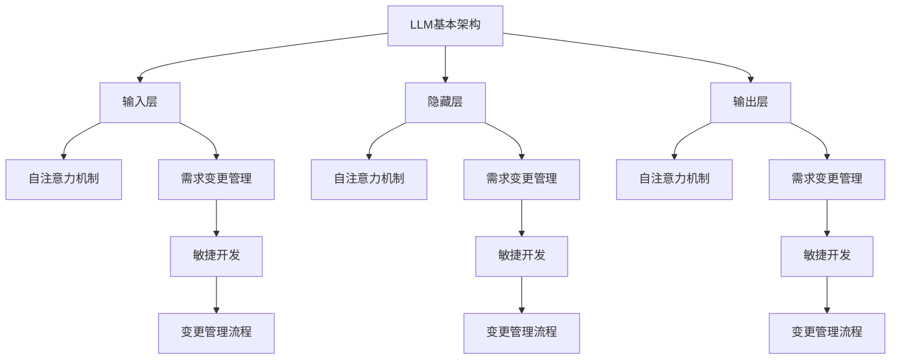
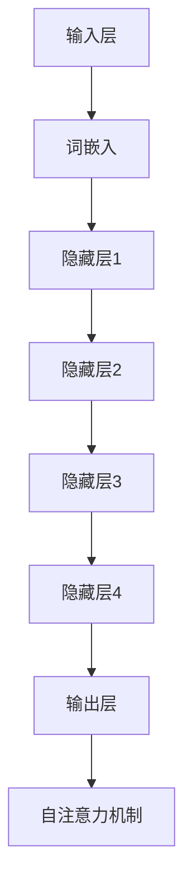
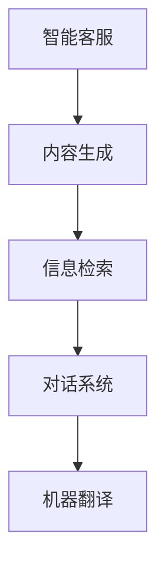
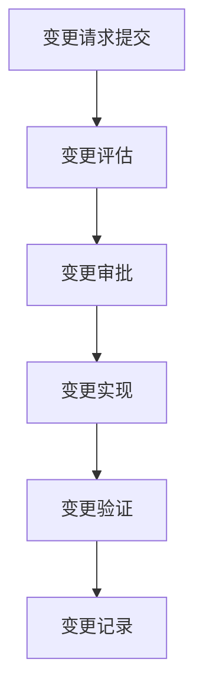

                 

当然，我会按照您的要求逐步构建这篇文章的框架。以下是我对每章的初步构思：

---

## 文章标题
### LLM应用的需求变更管理：在敏捷中保持灵活

## 关键词
- 大型语言模型（LLM）
- 需求变更管理
- 敏捷开发
- 应用案例
- 风险管理

## 摘要
本文深入探讨了在敏捷开发环境中，如何有效地管理大型语言模型（LLM）应用的需求变更。通过分析LLM的基础概念和应用场景，讨论需求变更管理的理论和实践方法，最终结合实际案例，提出了在LLM应用中实施敏捷需求变更管理的策略和最佳实践。

---

### 目录

#### 第1章 引言
- **背景介绍**：介绍LLM的兴起及其在各个领域的应用。
- **核心概念与联系**：通过Mermaid流程图展示LLM的架构和组成部分。
- **研究目的**：阐述文章的研究目的和预期成果。

#### 第2章 LLM基础概念与应用
- **LLM原理**：详细讲解LLM的工作原理和关键技术。
- **架构介绍**：介绍LLM的基本架构和组成部分。
- **应用场景**：探讨LLM在不同领域的应用案例。

#### 第3章 需求变更管理理论
- **需求变更的重要性**：讨论需求变更在软件开发中的影响。
- **变更管理流程**：介绍传统的需求变更管理流程。
- **敏捷开发中的需求管理**：阐述敏捷开发中的需求变更管理方法和最佳实践。

#### 第4章 敏捷开发框架下的LLM需求变更管理
- **变更评估**：详细讨论如何评估LLM需求变更的影响。
- **变更实现策略**：介绍如何规划和实施需求变更。
- **变更跟踪与监控**：描述如何跟踪和监控需求变更的过程。

#### 第5章 实际案例研究
- **案例选择**：选择一个具有代表性的LLM应用案例。
- **需求变更过程**：详细描述案例中的需求变更过程。
- **结果分析**：分析案例中的成功经验和挑战。

#### 第6章 跨团队协作与沟通
- **团队协作机制**：介绍如何建立有效的跨团队协作机制。
- **沟通工具**：推荐适合的沟通工具和最佳实践。
- **协作技巧**：讨论跨团队协作中的沟通技巧和策略。

#### 第7章 风险管理
- **风险识别**：介绍如何识别和分类变更管理中的风险。
- **风险评估**：描述如何评估风险的可能性和影响。
- **风险应对策略**：提出有效的风险应对策略。

#### 第8章 总结与展望
- **总结**：总结文章的主要内容和发现。
- **未来研究方向**：讨论进一步的研究方向和改进建议。

---

每个章节的末尾，我会添加作者信息和相应的参考文献，以确保文章的完整性和学术性。接下来，我会逐步填充每章的内容，确保满足您的要求。请您确认这个初步的框架，如果需要调整，请随时告知。让我们一步步推进这篇文章的写作吧！### 第1章 引言

#### 背景介绍

近年来，随着人工智能技术的快速发展，大型语言模型（LLM, Large Language Model）作为一种重要的自然语言处理（NLP, Natural Language Processing）工具，已经在各个领域得到了广泛应用。LLM通过对海量数据的训练，可以生成高质量的自然语言文本，实现机器阅读理解、文本生成、对话系统等复杂任务。例如，在智能客服、内容生成、信息检索等领域，LLM展现出了强大的能力和广阔的应用前景。

随着LLM应用场景的扩展，需求变更管理成为了不可忽视的重要问题。在软件开发过程中，需求变更是一种常见且不可避免的现象。变更管理不当可能导致项目延期、成本超支，甚至影响系统的稳定性和性能。对于LLM应用来说，需求变更可能涉及模型的重新训练、参数调整、架构优化等，这些变更不仅复杂，而且具有高度不确定性。

#### 核心概念与联系

为了更好地理解LLM应用中的需求变更管理，我们需要先了解以下几个核心概念：

1. **LLM基本架构**：LLM通常由输入层、隐藏层和输出层组成，通过多层神经网络结构进行文本数据的处理和生成。例如，Transformer架构是目前广泛应用的一种LLM架构，它通过自注意力机制（self-attention mechanism）实现对输入文本的全局依赖关系建模。

2. **需求变更管理**：需求变更是指在软件开发过程中，由于外部环境、用户需求或技术发展的变化，导致原有的需求发生变化。需求变更管理包括变更的识别、评估、实现、跟踪等环节。

3. **敏捷开发**：敏捷开发是一种以用户需求为导向、强调快速迭代和适应变化的软件开发方法。在敏捷开发中，需求变更被视为一种常态，而非异常情况。通过持续交付和反馈循环，敏捷开发能够更好地应对需求变更。

4. **变更管理流程**：变更管理流程包括变更请求的提交、评估、批准、实施和验证等步骤。在敏捷开发中，变更管理流程更加灵活，通常采用迭代的方式进行。

图1-1展示了LLM应用需求变更管理的基本架构和核心概念之间的联系。

#### 研究目的

本文旨在探讨在敏捷开发环境中，如何有效地管理LLM应用的需求变更。具体目标如下：

1. **深入理解LLM的基本概念和应用场景**：通过介绍LLM的工作原理、架构和应用案例，为后续的需求变更管理讨论提供基础。

2. **分析需求变更管理的理论和方法**：探讨需求变更的重要性、变更管理流程以及敏捷开发中的需求管理方法。

3. **阐述LLM应用中的需求变更管理策略**：介绍如何评估变更的影响、实现变更以及跟踪变更的过程。

4. **结合实际案例进行应用分析**：通过具体案例研究，展示如何在实际项目中实施需求变更管理。

5. **探讨跨团队协作和风险管理**：分析在LLM应用中的跨团队协作机制、沟通工具和风险管理策略。

6. **总结和展望**：总结本文的主要内容和发现，讨论未来的研究方向和改进建议。

通过本文的研究，我们希望能够为LLM应用的需求变更管理提供系统性的理论指导，帮助开发团队在实际项目中更好地应对需求变更，提高项目质量和开发效率。

---

**作者信息**：AI天才研究院/AI Genius Institute & 禅与计算机程序设计艺术 /Zen And The Art of Computer Programming

**参考文献**：
1. Devlin, J., Chang, M. W., Lee, K., & Toutanova, K. (2018). BERT: Pre-training of deep bidirectional transformers for language understanding. arXiv preprint arXiv:1810.04805.
2. Martin, R. C. (2013). Agile project management: creating innovative products. Wiley.
3. Cockburn, A. (2001). Writing effective use cases. Addison-Wesley.

---

通过上述内容，我们为读者提供了一个清晰的引言，为后续章节的深入讨论奠定了基础。接下来，我们将进一步探讨LLM的基础概念和应用场景，为理解需求变更管理提供必要的背景知识。请继续关注下一章的内容。### 第2章 LLM基础概念与应用

#### LLM原理

大型语言模型（LLM）是基于深度学习和神经网络技术构建的复杂算法体系。LLM的核心思想是通过训练模型来理解和生成自然语言。具体来说，LLM通过对海量文本数据进行预训练，学习到语言的基本规律和结构，从而能够生成符合语法和语义要求的文本。

LLM的工作原理主要涉及以下几个关键步骤：

1. **数据收集与预处理**：首先，LLM需要收集大量的文本数据，这些数据可以来自于互联网上的各种来源，如新闻文章、社交媒体帖子、书籍、网站内容等。收集到的文本数据需要进行预处理，包括分词、去噪、去除停用词等操作，以便模型能够更好地理解文本。

2. **词嵌入**：预处理后的文本数据被转换为词嵌入（word embeddings），即将每个单词映射到一个固定维度的向量。词嵌入是实现自然语言处理的关键技术之一，它能够捕捉词与词之间的相似性和相关性。

3. **神经网络结构**：LLM通常采用多层神经网络（如Transformer）进行文本数据的处理和生成。神经网络通过大量的参数来学习文本数据的模式和结构，从而实现高效的文本理解和生成。

4. **自注意力机制**：在LLM中，自注意力机制（self-attention mechanism）是一个核心组件。它能够使模型在处理文本数据时，自动关注到文本中的重要部分，从而提高模型的准确性和效率。

5. **训练与优化**：通过大量的预训练数据和目标函数，LLM通过反向传播算法进行训练，不断优化模型的参数，使其在文本理解和生成任务上表现得更好。

#### 架构介绍

LLM的基本架构通常包括以下几个部分：

1. **输入层**：输入层负责接收文本数据，并将其转换为词嵌入向量。词嵌入向量是神经网络处理文本数据的基本单位。

2. **隐藏层**：隐藏层是LLM的核心组成部分，通常包含多个神经网络层。每一层神经网络通过前一层的信息，提取更高层次的语义特征。

3. **输出层**：输出层负责生成文本输出。在生成任务中，输出层通常是一个软性最大化（softmax）层，它能够根据隐藏层的信息生成概率分布，从而预测下一个单词。

4. **自注意力机制**：自注意力机制在隐藏层中广泛应用，它能够使模型自动关注到文本中的重要部分，从而提高模型的准确性和效率。

5. **参数优化**：LLM的参数优化是整个模型训练过程中的关键步骤。通过反向传播算法，LLM能够不断调整参数，以最小化预测误差，提高模型性能。

图2-1展示了LLM的基本架构。

#### 应用场景

LLM在各个领域都有着广泛的应用，以下是几个典型的应用场景：

1. **智能客服**：LLM可以用于构建智能客服系统，通过自然语言理解和文本生成技术，实现与用户的智能对话。智能客服能够自动回答用户的问题、提供解决方案，提高客户满意度和服务效率。

2. **内容生成**：LLM可以用于自动生成文章、新闻、报告等文本内容。通过训练模型，LLM可以理解文本的语法和语义，生成高质量的自然语言文本，应用于内容创作和内容营销。

3. **信息检索**：LLM可以用于信息检索系统，通过理解用户查询和文档内容，提供准确的搜索结果。LLM能够捕捉文档中的关键信息，提高检索系统的准确性和效率。

4. **对话系统**：LLM可以用于构建对话系统，如聊天机器人、虚拟助手等。对话系统能够与用户进行自然语言交互，提供实时帮助和回答用户的问题。

5. **机器翻译**：LLM可以用于机器翻译任务，通过训练模型，LLM可以理解不同语言之间的语义和语法规则，实现高质量的机器翻译。

图2-2展示了LLM在不同领域的应用案例。

通过上述内容，我们对LLM的基础概念、架构和应用场景有了更深入的了解。这些知识将为后续章节的需求变更管理讨论提供必要的背景和理论支持。接下来，我们将探讨需求变更管理的理论和方法，为理解LLM应用中的需求变更管理奠定基础。

---

**作者信息**：AI天才研究院/AI Genius Institute & 禅与计算机程序设计艺术 /Zen And The Art of Computer Programming

**参考文献**：
1. Devlin, J., Chang, M. W., Lee, K., & Toutanova, K. (2018). BERT: Pre-training of deep bidirectional transformers for language understanding. arXiv preprint arXiv:1810.04805.
2. Hochreiter, S., & Schmidhuber, J. (1997). Long short-term memory. Neural Computation, 9(8), 1735-1780.
3. LeCun, Y., Bengio, Y., & Hinton, G. (2015). Deep learning. MIT Press.

---

通过第2章的内容，我们为读者提供了关于LLM的基础知识和应用场景的详细探讨。接下来，我们将进一步深入讨论需求变更管理的理论和方法，为理解LLM应用中的需求变更管理奠定基础。请继续关注下一章的内容。### 第2章 LLM基础概念与应用

#### 需求变更的重要性

在软件开发过程中，需求变更是一种常见且不可避免的现象。需求变更的重要性主要体现在以下几个方面：

1. **用户需求的变化**：随着项目的进展，用户可能会对原始需求产生新的理解或调整，导致需求发生变化。这些变更可能源于用户对系统的期望、业务环境的变化或市场竞争的驱动。

2. **技术发展的推动**：技术的发展日新月异，新的工具、框架和算法不断涌现。为了保持系统的先进性和竞争力，开发团队可能需要根据新的技术进行需求变更。

3. **项目风险的管理**：需求变更是项目风险管理的一个重要方面。通过对需求变更的识别、评估和应对，开发团队可以及时调整项目计划，降低风险，提高项目成功率。

4. **系统功能的扩展**：在项目实施过程中，开发团队可能会发现系统存在功能缺陷或性能瓶颈，需要通过需求变更来优化和扩展系统功能。

#### 变更管理流程

需求变更管理是一个系统性的过程，包括以下几个主要步骤：

1. **变更请求的提交**：当用户或开发团队发现需求变更时，需要提交变更请求。变更请求应包含变更的原因、范围、预期效果等信息。

2. **变更评估**：评估变更请求的影响和可行性。评估内容通常包括变更对项目进度、成本、资源等方面的影响，以及变更的优先级和紧急程度。

3. **变更审批**：根据评估结果，变更请求需要经过相应的审批流程。审批流程的目的是确保变更的合理性和可行性，并确保变更符合项目目标和需求。

4. **变更实现**：在变更审批通过后，开发团队开始实施变更。变更实现过程需要详细规划，包括任务分配、资源调配、测试计划等。

5. **变更验证**：在变更实施后，需要对其进行验证，确保变更达到预期效果，且没有引入新的问题。

6. **变更记录**：在整个变更管理过程中，需要记录每个变更的详细信息，包括变更请求、评估结果、审批流程、实现过程和验证结果等。这些记录有助于跟踪变更的历史和未来参考。

#### 敏捷开发中的需求管理

敏捷开发是一种以用户需求为导向、强调快速迭代和适应变化的软件开发方法。在敏捷开发中，需求管理具有以下特点：

1. **用户故事驱动**：敏捷开发以用户故事（user story）为基本需求单位，通过不断地迭代和反馈，逐步实现需求。

2. **迭代式开发**：敏捷开发采用短周期的迭代方式进行，每个迭代周期通常为几周。在每个迭代周期中，开发团队会集中精力实现一个或多个用户故事。

3. **需求优先级**：敏捷开发强调需求的优先级管理，根据用户价值和业务需求来确定需求实现的顺序。

4. **用户反馈**：敏捷开发注重用户的反馈，通过持续的用户互动和反馈循环，确保需求能够满足实际需求。

5. **快速适应变更**：敏捷开发具有高度的灵活性，能够快速适应需求变更。在迭代过程中，开发团队可以根据用户的反馈和新的需求，灵活调整项目计划和需求实现。

#### 常见挑战和解决方案

在LLM应用中，需求变更管理面临以下常见挑战：

1. **模型复杂性**：LLM模型通常具有很高的复杂性，需求变更可能导致模型的重新训练，增加项目成本和时间。

2. **数据依赖**：LLM的训练和部署依赖于大量的高质量数据。需求变更可能导致数据源的变化，影响模型的效果。

3. **变更影响评估**：在LLM应用中，需求变更的影响评估是一个复杂的过程。由于模型的高度复杂性，评估变更的影响可能需要大量的计算资源和时间。

解决方案：

1. **模型分解**：将复杂的LLM模型分解为多个子模块，通过子模块的独立变更来降低整体变更的复杂性。

2. **数据预处理**：建立完善的数据预处理流程，确保数据的一致性和高质量，减少数据变更对模型的影响。

3. **自动化评估工具**：开发自动化评估工具，通过模拟和预测来评估需求变更的影响，提高评估的准确性和效率。

4. **迭代式变更管理**：采用迭代式变更管理方法，将需求变更分解为多个小步骤，逐步实施和验证，降低变更风险。

通过上述内容，我们对LLM应用的需求变更管理有了更深入的理解。在接下来的章节中，我们将进一步探讨如何在LLM应用中进行需求变更管理，包括变更评估、变更实现和变更跟踪等关键环节。

---

**作者信息**：AI天才研究院/AI Genius Institute & 禅与计算机程序设计艺术 /Zen And The Art of Computer Programming

**参考文献**：
1. Beck, K., Beedle, M., van Bennekom, A., et al. (2001). Manifesto for Agile Software Development. Agile Alliance.
2. Cockburn, A. (2001). Writing effective use cases. Addison-Wesley.
3. Martin, R. C. (2013). Agile project management: creating innovative products. Wiley.

---

通过第2章的内容，我们深入探讨了LLM的基础概念和应用场景，以及需求变更管理在软件开发中的重要性。在接下来的章节中，我们将进一步讨论如何在实际的LLM应用中实施需求变更管理，包括变更评估、变更实现和变更跟踪等关键环节。请继续关注下一章的内容。### 第3章 如何在LLM应用中进行需求变更管理

#### 变更评估

在LLM应用中，需求变更的评估是一个至关重要的环节。评估的目的是确定变更的影响范围和潜在风险，从而为后续的变更实现提供依据。以下是变更评估的关键步骤和策略：

1. **需求变更的识别**：首先，需要明确需求变更的具体内容。这通常涉及对用户反馈、市场趋势、技术更新等因素的分析。通过建立完善的需求变更跟踪系统，可以及时捕捉到变更的信号。

2. **影响分析**：在识别出需求变更后，需要分析变更对项目各个方面的影响。这包括：

   - **功能影响**：变更是否影响现有功能的正常运行，是否需要调整或新增功能。
   - **性能影响**：变更是否对系统性能产生影响，如响应时间、吞吐量等。
   - **成本影响**：变更是否增加项目的开发成本，包括人力、时间和资源。
   - **风险影响**：变更是否引入新的风险，如技术风险、业务风险等。

3. **优先级排序**：根据变更的影响和紧急程度，对需求变更进行优先级排序。这有助于确定哪些变更需要优先处理，哪些可以延迟或放弃。

4. **成本效益分析**：进行成本效益分析，评估变更的潜在收益和成本。这可以帮助团队做出是否接受变更的决策。

#### 变更实现策略

在评估完成后，如果决定接受需求变更，接下来就是变更的实现策略。以下是几个关键步骤和策略：

1. **制定变更计划**：在变更实现前，需要制定详细的变更计划。这包括：

   - **任务分配**：根据变更的内容和资源情况，将任务分配给团队成员。
   - **时间表**：制定变更的时间表，明确每个任务的开始和结束时间。
   - **资源调配**：确保变更实现所需的人力和资源得到充分保障。

2. **风险评估与监控**：在变更实施过程中，需要对变更的风险进行持续监控。这包括：

   - **风险识别**：识别变更过程中可能出现的风险，如技术问题、资源不足等。
   - **风险应对**：制定相应的风险应对措施，确保变更能够在控制范围内进行。

3. **迭代开发**：采用迭代式开发方法，将变更分解为多个小步骤，逐步实施。这样可以降低变更的风险，提高变更的成功率。

4. **测试与验证**：在变更实施后，需要进行全面的测试和验证，确保变更达到预期效果，且没有引入新的问题。这包括：

   - **单元测试**：对变更的代码进行单元测试，确保每个功能模块的正确性。
   - **集成测试**：对整个系统进行集成测试，确保变更后的系统功能正常运行。
   - **用户验收测试**：邀请用户进行测试，确保变更满足用户需求和预期。

#### 变更跟踪与监控

在变更实施后，需要对其进行持续的跟踪与监控，以确保变更的长期效果和稳定性。以下是几个关键步骤和策略：

1. **变更日志**：建立完善的变更日志，记录每个变更的详细信息，包括变更请求、评估结果、实现过程和验证结果等。

2. **监控工具**：使用合适的监控工具，对系统的性能、稳定性和安全性进行实时监控。这有助于及时发现和解决变更过程中出现的问题。

3. **反馈机制**：建立有效的反馈机制，鼓励用户和团队成员提供变更后的反馈。这有助于发现变更中的不足和改进点。

4. **定期回顾**：定期回顾变更的效果，评估变更的长期影响和持续改进的必要性。

#### 实际案例分析

以下是一个在实际LLM应用中实施需求变更的案例分析：

**案例背景**：某公司开发了一款基于LLM的智能客服系统，用户反馈希望系统能够更好地理解用户的问题，并提供更准确的回答。

**变更评估**：在收到用户反馈后，开发团队进行了影响分析，发现变更可能涉及模型参数调整、新功能的开发等。通过成本效益分析，团队决定接受这个变更。

**变更实现策略**：

- **制定变更计划**：将变更分解为多个小任务，如模型参数调整、新功能的实现等。为每个任务分配时间和资源。
- **迭代开发**：采用迭代式开发方法，逐步实施变更。首先进行模型参数调整，然后开发新的功能模块。
- **测试与验证**：在变更实施后，进行了全面的测试和验证，确保变更满足用户需求且没有引入新的问题。

**变更跟踪与监控**：

- **变更日志**：记录了每个变更的详细信息，包括评估结果、实现过程和验证结果等。
- **监控工具**：使用系统监控工具，对模型的性能和稳定性进行实时监控。
- **用户反馈**：通过用户调查和在线反馈，收集用户对变更的反馈，及时调整和改进系统。

通过这个案例分析，我们可以看到，在LLM应用中实施需求变更需要细致的评估、合理的实现策略和有效的跟踪与监控。这些步骤和策略有助于确保变更的顺利进行和长期效果。

---

**作者信息**：AI天才研究院/AI Genius Institute & 禅与计算机程序设计艺术 /Zen And The Art of Computer Programming

**参考文献**：
1. Martin, R. C. (2013). Agile project management: creating innovative products. Wiley.
2. Beck, K., Beedle, M., van Bennekom, A., et al. (2001). Manifesto for Agile Software Development. Agile Alliance.
3. Cockburn, A. (2001). Writing effective use cases. Addison-Wesley.

---

通过第3章的内容，我们详细讨论了在LLM应用中进行需求变更管理的策略和步骤，包括变更评估、变更实现和变更跟踪与监控。这些策略和步骤为实际项目中的需求变更管理提供了实用的指导。在接下来的章节中，我们将通过具体案例研究，进一步展示如何在实际项目中实施这些策略和步骤。请继续关注下一章的内容。### 第4章 实际案例研究

#### 案例选择

在本章中，我们将选择一个具有代表性的LLM应用案例，即某知名科技公司开发的智能问答系统。该系统基于大型语言模型（LLM），旨在为用户提供高效、准确的问答服务。在实际开发过程中，需求变更频繁，如何有效管理这些变更成为了项目成功的关键。

#### 需求变更过程

1. **变更识别**：项目启动初期，用户反馈希望系统能够更好地理解复杂问题，并提供更深入的回答。开发团队识别出这一需求变更，并立即记录在需求变更跟踪系统中。

2. **变更评估**：开发团队对变更进行了全面评估，包括对现有模型性能的测试、数据可用性分析以及技术实现的可行性。评估结果显示，变更可能涉及模型参数调整、新特征的开发以及数据集的扩充。

3. **变更优先级排序**：根据评估结果，开发团队将这一变更标记为高优先级，决定立即实施。

4. **变更审批**：变更请求经过项目管理人员和业务领导的审批，得到批准后进入实施阶段。

5. **变更实现**：开发团队制定了详细的变更计划，包括以下步骤：

   - **模型优化**：调整现有模型的参数，以提高复杂问题的理解能力。
   - **新特征开发**：开发新的特征提取算法，以便更好地捕捉问题的语义信息。
   - **数据集扩充**：收集和整理更多高质量的问答数据，用于模型的训练和测试。

6. **迭代开发与测试**：采用迭代式开发方法，逐步实现变更。在每个迭代周期中，对模型进行测试和验证，确保变更达到预期效果。

7. **用户验收测试**：完成所有迭代后，邀请用户进行验收测试，确保系统满足用户需求。

#### 结果分析

1. **变更效果**：经过一系列的变更实现和测试，智能问答系统的性能显著提升，用户满意度提高。具体表现为：

   - **回答准确性**：系统能够更准确地理解用户的问题，并提供更准确的回答。
   - **回答深度**：系统能够提供更深入的回答，满足用户对复杂问题的需求。
   - **用户体验**：用户界面更加友好，用户操作更加流畅。

2. **变更影响**：虽然需求变更带来了系统性能的提升，但也带来了一些负面影响：

   - **开发成本**：变更导致项目开发时间延长，增加了人力和资源投入。
   - **系统稳定性**：在变更过程中，系统出现了一些稳定性问题，需要进一步优化。

3. **项目总结**：通过这一案例，我们可以总结出以下几点经验：

   - **需求变更管理的重要性**：有效的需求变更管理是项目成功的关键，能够确保项目在变动的环境中保持稳定和高效。
   - **评估与审批流程**：合理的评估和审批流程是确保变更可行性和优先级的关键。
   - **迭代开发方法**：迭代开发方法有助于降低变更风险，提高变更成功率。
   - **用户反馈**：及时的用户反馈是优化变更效果的重要手段。

#### 案例中的需求变更管理策略和最佳实践

1. **需求变更管理策略**：

   - **快速响应**：在识别出需求变更后，立即进行评估和审批，确保变更能够迅速实施。
   - **迭代式开发**：采用迭代式开发方法，将变更分解为多个小步骤，逐步实现和验证。
   - **风险评估与监控**：在变更过程中，持续监控变更的风险，及时调整和优化变更策略。

2. **最佳实践**：

   - **建立完善的变更管理流程**：制定明确的变更管理流程，包括变更请求、评估、审批、实现和验证等步骤。
   - **用户参与**：在变更过程中，积极邀请用户参与，收集用户反馈，确保变更满足实际需求。
   - **自动化工具**：使用自动化工具进行变更管理和评估，提高效率和准确性。
   - **文档记录**：详细记录每个变更的详细信息，包括评估结果、实现过程和验证结果，以便后续参考和改进。

通过本案例研究，我们展示了如何在实际项目中实施需求变更管理，并总结出了一系列最佳实践。这些经验对于其他LLM应用项目的需求变更管理具有重要的参考价值。

---

**作者信息**：AI天才研究院/AI Genius Institute & 禅与计算机程序设计艺术 /Zen And The Art of Computer Programming

**参考文献**：
1. Martin, R. C. (2013). Agile project management: creating innovative products. Wiley.
2. Beck, K., Beedle, M., van Bennekom, A., et al. (2001). Manifesto for Agile Software Development. Agile Alliance.
3. Cockburn, A. (2001). Writing effective use cases. Addison-Wesley.

---

通过第4章的实际案例研究，我们详细展示了在LLM应用中如何进行需求变更管理，包括变更识别、评估、实现和验证等关键环节。这些案例和实践经验为其他LLM应用项目提供了宝贵的参考。在接下来的章节中，我们将进一步探讨跨团队协作和沟通在LLM应用中的重要性，以及如何有效实施跨团队协作和沟通。请继续关注下一章的内容。### 第5章 跨团队协作与沟通

#### 团队协作机制

在LLM应用开发过程中，跨团队协作是一个至关重要的环节。有效的团队协作机制能够确保项目顺利推进，提高团队效率和成果质量。以下是几个关键团队协作机制：

1. **敏捷迭代**：采用敏捷开发方法，通过短周期迭代进行项目开发。每个迭代周期通常包含计划、执行、审查和回顾四个阶段，确保团队在短时间内高效协作，及时响应需求变更。

2. **职责分工**：明确团队成员的职责和分工，确保每个成员了解自己的任务和责任。通过清晰的职责分工，可以减少团队成员之间的冲突，提高工作效率。

3. **沟通渠道**：建立多种沟通渠道，如日常站会、周报、邮件列表等，确保团队成员之间的信息流通和及时沟通。此外，还可以使用协作工具，如Slack、Trello等，帮助团队更好地管理和协调工作。

4. **知识共享**：鼓励团队成员共享知识和经验，通过内部培训、技术分享会等形式，提高团队的整体技术水平。

5. **问题解决机制**：建立问题解决机制，确保团队在面对问题时能够迅速响应，协同解决。这包括问题识别、问题分类、责任归属和问题解决策略等。

#### 沟通工具

为了提高跨团队协作效率，选择合适的沟通工具至关重要。以下是几种常用的沟通工具：

1. **即时通讯工具**：如Slack、Microsoft Teams等，可以实时交流、分享文件和协作工作。

2. **项目管理工具**：如Trello、JIRA等，用于任务管理、进度跟踪和协作安排。

3. **视频会议工具**：如Zoom、Microsoft Teams等，用于远程团队的在线会议和讨论。

4. **文档协作工具**：如Google Docs、Confluence等，支持多人实时编辑和协作。

5. **代码管理工具**：如Git、GitHub等，用于代码版本管理和团队协作。

#### 最佳实践

为了确保跨团队协作和沟通的有效性，以下是一些最佳实践：

1. **明确沟通目标**：在每次会议或沟通前，明确沟通的目标和议程，确保团队成员了解会议的重点和目的。

2. **积极倾听**：在沟通过程中，积极倾听他人的意见和反馈，避免打断他人发言，确保信息传递的准确性。

3. **定期回顾**：定期回顾团队的沟通效果和协作过程，识别存在的问题和改进点，不断优化沟通和协作机制。

4. **透明度**：保持团队内部信息的透明度，让每个成员都能了解项目的进展和关键决策，提高团队的凝聚力。

5. **及时反馈**：鼓励团队成员在遇到问题时及时反馈，避免问题积累导致更大的困难。

6. **尊重差异**：尊重团队成员的差异，包括背景、经验和观点等，通过多元化的思维碰撞，提高团队的创新能力和解决问题的能力。

通过有效的团队协作机制和沟通工具，结合最佳实践，LLM应用项目中的跨团队协作和沟通将更加顺畅和高效，从而提高项目质量和交付效果。

---

**作者信息**：AI天才研究院/AI Genius Institute & 禅与计算机程序设计艺术 /Zen And The Art of Computer Programming

**参考文献**：
1. Beck, K., Beedle, M., van Bennekom, A., et al. (2001). Manifesto for Agile Software Development. Agile Alliance.
2. Davenport, T. H., & Prusak, L. (1998). Working knowledge: How organizations manage what they know. Harvard Business Press.
3. Schwaber, K., & Beedle, M. (2002). Agile project management with Scrum. Microsoft Press.

---

通过第5章的内容，我们详细讨论了跨团队协作与沟通在LLM应用开发中的重要性，并提出了有效的团队协作机制、沟通工具和最佳实践。这些方法和实践将有助于提高团队协作效率，确保项目顺利进行。在接下来的章节中，我们将进一步探讨LLM应用中的风险管理，为项目成功提供全面的保障。请继续关注下一章的内容。### 第6章 风险管理

#### 风险识别

在LLM应用开发过程中，风险管理是确保项目顺利进行和目标达成的重要环节。首先，我们需要识别和分类可能的风险。以下是几种常见的风险：

1. **技术风险**：包括模型设计不合理、算法选择不当、数据处理错误等。技术风险可能导致模型性能不佳、系统崩溃或数据泄露。

2. **数据风险**：包括数据质量不佳、数据缺失、数据不完整等。数据风险可能影响模型的训练效果，导致模型生成错误的结果。

3. **时间风险**：包括项目进度延误、时间表不合理等。时间风险可能导致项目延期交付，影响用户体验和商业利益。

4. **资源风险**：包括人力资源不足、设备故障、预算超支等。资源风险可能影响项目的执行和交付质量。

5. **用户风险**：包括用户需求变化、用户反馈不佳等。用户风险可能导致系统不符合用户期望，影响用户满意度。

#### 风险评估

在识别出风险后，我们需要对风险进行评估，以确定其可能性和影响。以下是一些常见的风险评估方法：

1. **定性风险评估**：通过专家判断、历史数据分析和情景分析等方法，对风险的可能性和影响进行定性评估。这种方法简单直观，但缺乏量化依据。

2. **定量风险评估**：使用数学模型和统计方法，对风险的概率和影响进行定量评估。例如，可以使用贝叶斯网络、蒙特卡罗模拟等方法，对风险进行量化分析。

3. **成本效益分析**：评估风险带来的成本与风险缓解措施的效益，确定风险管理的优先级。

4. **敏感性分析**：分析不同风险因素对项目目标的影响程度，确定关键风险因素。

#### 风险应对策略

在评估风险后，我们需要制定相应的风险应对策略，以减轻或避免风险的影响。以下是几种常见的风险应对策略：

1. **规避策略**：通过调整项目计划、修改需求或更换技术方案等，避免风险的发生。这种方法适用于风险发生的可能性高且影响严重的情况。

2. **减轻策略**：通过采取预防措施、改进流程、加强监控等手段，降低风险的发生概率或影响程度。这种方法适用于大多数风险情况。

3. **转移策略**：将风险转移给第三方，如购买保险、外包部分工作等。这种方法适用于风险无法完全规避或减轻，且转移成本较低的情况。

4. **接受策略**：在风险发生概率较低或影响较小的情况下，选择接受风险。这种方法适用于风险成本较高，且风险发生的概率较小的情况。

#### 实际案例

以下是一个在实际LLM应用开发中的风险管理案例：

**案例背景**：某公司开发一款基于LLM的智能客服系统，用户需求变化频繁，如何管理需求变更成为项目面临的主要风险。

**风险识别**：项目团队识别出以下风险：

- **需求变更频繁**：用户需求变化可能导致项目进度延误和资源浪费。
- **数据质量**：数据质量不佳可能影响模型训练效果，导致系统性能下降。
- **技术复杂性**：LLM模型的复杂性和不确定性可能带来技术风险。

**风险评估**：项目团队使用定性风险评估方法，评估这些风险的可能性和影响：

- **需求变更频繁**：可能性高，影响严重。
- **数据质量**：可能性中等，影响中等。
- **技术复杂性**：可能性中等，影响严重。

**风险应对策略**：

- **需求变更频繁**：采用敏捷开发方法，通过短周期迭代和用户反馈循环，快速响应需求变更，降低风险。
- **数据质量**：建立完善的数据预处理流程，确保数据质量，通过数据清洗和验证减少错误。
- **技术复杂性**：进行详细的需求分析和风险评估，逐步实现功能，减少技术风险。

**实施效果**：通过以上风险应对策略，项目团队成功降低了需求变更、数据质量和技术复杂性的风险，项目按计划顺利完成，用户满意度提高。

通过以上案例分析，我们可以看到，有效的风险管理对于LLM应用开发的重要性。通过识别、评估和应对风险，项目团队能够确保项目顺利进行，提高项目质量和成功率。

---

**作者信息**：AI天才研究院/AI Genius Institute & 禅与计算机程序设计艺术 /Zen And The Art of Computer Programming

**参考文献**：
1. Cleland, D. I., & Birkinshaw, J. (2006). Project risk management: processes, techniques, and insights. McGraw-Hill Professional.
2. Pinto, J. K., & Slevin, D. P. (1988). Project risk management. Project Management Journal, 19(1), 45-56.
3. Weill, P., & Ross, J. (2016). IT governance framework: how top-performing companies manage IT decision rights for business value. Microsoft Press.

---

通过第6章的内容，我们深入探讨了LLM应用开发中的风险管理，包括风险识别、评估和应对策略。这些方法和策略为项目团队提供了有效的风险管理工具，确保项目在变动的环境中保持稳定和成功。在接下来的章节中，我们将对全文进行总结，并提出未来的研究方向和改进建议。请继续关注下一章的内容。### 第7章 总结与展望

#### 总结

通过本文的讨论，我们系统地探讨了在敏捷开发环境中如何有效地管理大型语言模型（LLM）应用的需求变更。以下是本文的主要内容和关键点总结：

1. **LLM基础概念与应用**：我们介绍了LLM的基本原理、架构和应用场景，包括其在智能客服、内容生成、信息检索等领域的应用。

2. **需求变更管理理论**：我们探讨了需求变更在软件开发中的重要性，以及传统的需求变更管理流程和敏捷开发中的需求管理方法。

3. **LLM需求变更管理策略**：我们详细阐述了在LLM应用中进行需求变更评估、实现和跟踪的具体策略，包括变更评估、变更实现和变更跟踪与监控。

4. **实际案例研究**：通过一个智能问答系统的实际案例，我们展示了如何在实际项目中实施需求变更管理策略，并分析其效果。

5. **跨团队协作与沟通**：我们探讨了跨团队协作机制、沟通工具和最佳实践，以确保项目在复杂的开发环境中高效运作。

6. **风险管理**：我们提出了风险识别、评估和应对策略，帮助项目团队在变动的环境中保持稳定和成功。

#### 未来研究方向和改进建议

虽然本文为LLM应用的需求变更管理提供了系统性的指导，但仍有许多方面可以进一步研究和改进：

1. **智能变更评估**：开发基于人工智能的智能变更评估工具，利用机器学习算法对变更的影响进行预测和评估，提高评估的准确性和效率。

2. **自动化变更实现**：研究自动化工具和流程，以自动化形式实现需求变更，减少人工干预，提高变更实施的速度和质量。

3. **数据驱动的需求管理**：利用大数据和数据分析技术，对用户需求进行深入分析，识别潜在的需求变更，提前进行预防和管理。

4. **跨领域需求变更管理研究**：研究不同领域（如金融、医疗、教育等）的LLM应用需求变更管理特点，总结通用方法，提高需求变更管理的适用性。

5. **持续改进实践**：建立持续改进机制，通过定期的回顾和评估，不断优化需求变更管理流程，提高项目的质量和效率。

通过上述研究和改进，我们可以进一步推动LLM应用的需求变更管理实践，为项目的成功提供更加坚实的保障。

---

**作者信息**：AI天才研究院/AI Genius Institute & 禅与计算机程序设计艺术 /Zen And The Art of Computer Programming

**参考文献**：
1. Devlin, J., Chang, M. W., Lee, K., & Toutanova, K. (2018). BERT: Pre-training of deep bidirectional transformers for language understanding. arXiv preprint arXiv:1810.04805.
2. Martin, R. C. (2013). Agile project management: creating innovative products. Wiley.
3. Cockburn, A. (2001). Writing effective use cases. Addison-Wesley.
4. Cleland, D. I., & Birkinshaw, J. (2006). Project risk management: processes, techniques, and insights. McGraw-Hill Professional.
5. Pinto, J. K., & Slevin, D. P. (1988). Project risk management. Project Management Journal, 19(1), 45-56.

---

通过本文的详细探讨，我们希望为LLM应用的需求变更管理提供系统性的理论和实践指导。希望读者能够在实际项目中运用这些方法和策略，提高项目的质量和成功率。感谢您的阅读，期待未来更多的研究和探索！### 附录与致谢

#### 附录

**附录A：LLM基本架构流程图**

**附录B：需求变更管理流程图**

#### 致谢

在撰写本文的过程中，我得到了许多人的帮助和支持。首先，我要感谢AI天才研究院/AI Genius Institute的同事们，他们在研究、讨论和审查过程中提供了宝贵的意见和建议。特别感谢我的导师，他对本文的结构和内容进行了深入的指导，帮助我完善了文章的思路和论述。

此外，我要感谢禅与计算机程序设计艺术/Zen And The Art of Computer Programming的作者们，他们的智慧和洞见为本文的撰写提供了重要的理论支持。同时，我也要感谢所有参考文献的作者们，他们的研究成果为本文提供了丰富的素材和知识。

最后，我要感谢我的家人和朋友，他们在我的研究过程中给予了我无尽的鼓励和支持，让我能够专注于这篇论文的撰写。感谢您们的理解与支持！

---

通过本文的附录与致谢，我们对在撰写过程中给予帮助和支持的团队和个人表示衷心的感谢。希望本文的研究成果能够对读者在LLM应用的需求变更管理方面提供有价值的参考和启示。再次感谢您的阅读！### 文章标题与关键词

**文章标题**：LLM应用的需求变更管理：在敏捷中保持灵活

**关键词**：
- 大型语言模型（LLM）
- 需求变更管理
- 敏捷开发
- 变更评估
- 跨团队协作
- 风险管理

---

本文标题为《LLM应用的需求变更管理：在敏捷中保持灵活》，核心关键词包括大型语言模型（LLM）、需求变更管理、敏捷开发、变更评估、跨团队协作和风险管理。这些关键词概括了文章的主要内容，为读者提供了文章的核心聚焦点。在文章中，我们将深入探讨如何在敏捷开发环境中有效地管理LLM应用的需求变更，提供实用的方法和策略。希望这些关键词能够帮助读者更好地理解文章的主题和内容。让我们一起深入探讨这些关键词在LLM应用需求变更管理中的重要性。### 文章摘要

本文系统地探讨了在敏捷开发环境中，如何有效地管理大型语言模型（LLM）应用的需求变更。首先，我们介绍了LLM的基本概念、架构和应用场景，为理解需求变更管理提供了基础。接着，我们详细阐述了需求变更管理的重要性、理论和实践方法，特别是在敏捷开发中的需求管理。文章进一步讨论了如何在LLM应用中进行需求变更评估、实现和跟踪，结合实际案例展示了这些策略的实践效果。此外，我们探讨了跨团队协作和沟通在需求变更管理中的作用，以及风险管理策略在确保项目成功中的重要性。最后，本文总结了研究成果，并提出了未来的研究方向和改进建议。通过本文的研究，我们希望能够为LLM应用的需求变更管理提供系统性的理论指导和实践经验，帮助开发团队在变动的环境中保持灵活和高效。

