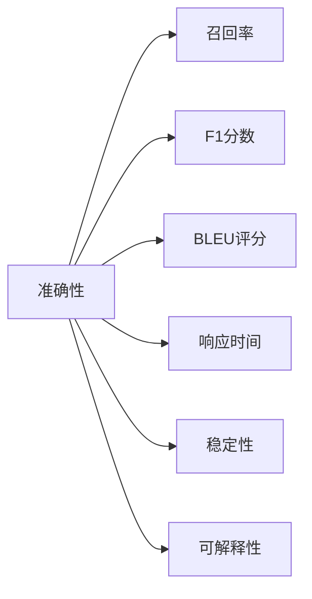
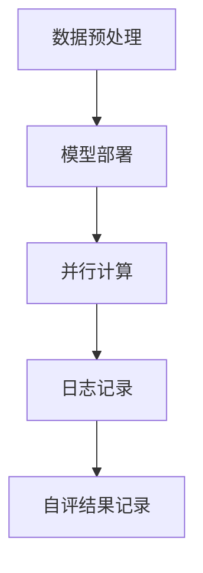

                 

### 文章标题

# LLM自评：构建AI评估AI的新范式

### 关键词

- 自评
- AI评估
- LLM
- 大型语言模型
- 评估框架
- 自适应评估

### 摘要

本文旨在探讨如何构建一种新的AI评估AI的范式，特别是通过使用大型语言模型（LLM）进行自我评估。我们将首先介绍AI评估的重要性，然后深入分析LLM的特性及其在评估中的应用。随后，我们将详细探讨自评机制的设计与实现，并提供实际应用案例。最后，我们将总结本文的主要发现，并展望未来发展方向。通过这一系列的分析和探讨，我们希望为读者提供一种全新的思考方式，以应对AI评估的挑战。

### 引言

在当今的科技领域，人工智能（AI）已成为推动创新和发展的关键力量。随着AI技术的飞速发展，评估AI模型的效果和质量变得至关重要。传统的评估方法往往依赖于人工设定指标和标准，这既耗时又可能导致评估结果的偏差。因此，寻求一种新的评估范式，特别是在AI评估AI的领域，显得尤为迫切。

本文旨在探讨如何构建一种基于大型语言模型（LLM）的自我评估机制，以实现AI评估AI的新范式。LLM作为一种具有高度复杂性和强大学习能力的人工智能模型，在自然语言处理领域取得了显著成果。然而，如何利用LLM进行自我评估，以及如何设计一个有效的自评机制，仍是一个尚未充分探索的领域。

本文将首先介绍AI评估的基本概念和重要性，然后详细分析LLM的特性及其在评估中的应用。接下来，我们将探讨自评机制的设计与实现，包括自评指标体系、算法设计和实现细节。随后，我们将通过实际应用案例，展示自评机制在AI评估中的应用效果。最后，我们将总结本文的主要发现，并探讨未来的发展方向。

### AI评估的重要性

在人工智能（AI）的发展过程中，评估是至关重要的一环。AI评估不仅仅是为了衡量模型的效果，更重要的是为了确保模型在特定任务上的可靠性和有效性。以下是AI评估的重要性及其在AI发展中的应用：

#### 1. 确保模型可靠性

AI模型的可靠性是其成功应用的关键。通过评估，我们可以验证模型在处理新数据时的性能，确保其不会因为偶然的样本或数据分布而出现异常。例如，在医疗诊断中，如果AI模型在评估时表现出过高的误诊率，那么在实际应用中可能会导致严重的医疗事故。

#### 2. 提升模型性能

评估是优化AI模型的重要手段。通过评估，我们可以识别模型在特定任务上的弱点，并针对性地进行改进。例如，在图像识别任务中，如果评估结果显示模型在识别复杂背景下的图像时效果不佳，我们可以通过增加训练数据或调整网络结构来提升模型性能。

#### 3. 评估模型泛化能力

AI模型的泛化能力是指其在未知数据上的表现。通过评估，我们可以测试模型在不同数据集上的性能，确保其具有广泛的适用性。这对于AI模型的商业应用至关重要，因为商业环境中的数据往往是多样化的，模型需要在各种条件下都能稳定表现。

#### 4. 促进AI技术的发展

AI评估不仅是针对现有模型的检验，更是推动AI技术发展的重要动力。通过评估，我们可以发现现有技术的局限性和潜在的研究方向。例如，在自然语言处理领域，评估技术的进步促进了诸如Transformer模型等创新算法的发展。

#### 5. 保障AI安全

AI系统的安全性是一个不容忽视的问题。通过评估，我们可以发现模型在处理敏感数据时的潜在风险，并采取相应的措施进行防范。例如，在自动驾驶系统中，通过评估可以确保模型在极端天气条件下的稳定性和安全性。

#### 6. 促进跨领域合作

AI评估不仅需要技术手段，还需要多学科的合作。通过评估，不同领域的专家可以共同探讨AI技术的应用和挑战，促进跨学科的合作和交流。这对于推动AI技术的发展具有重要意义。

总之，AI评估在确保模型可靠性、提升模型性能、评估模型泛化能力、促进AI技术的发展、保障AI安全和促进跨领域合作等方面都发挥着至关重要的作用。随着AI技术的不断进步，评估方法也在不断更新和优化，以适应日益复杂的应用需求。

### LLM的基本概念与特性

大型语言模型（LLM，Large Language Model）是自然语言处理（NLP，Natural Language Processing）领域的一种先进技术。LLM通过深度学习算法，对大规模文本数据进行分析和建模，从而具备强大的语言理解和生成能力。以下是LLM的基本概念和特性：

#### 1. 定义与背景

LLM是基于神经网络架构的深度学习模型，能够理解和生成自然语言。与传统的人工智能模型不同，LLM不需要手动设定语言规则，而是通过大量的训练数据自动学习语言的模式和规律。这种自动化的学习方式使得LLM在处理自然语言时表现出色。

#### 2. 特点

**高复杂度**：LLM由数亿甚至数十亿个参数组成，具有极高的复杂度。这使得LLM能够在处理复杂语言任务时具备强大的表达能力和灵活性。

**自主学习**：LLM通过自主学习和训练，不断优化模型参数，从而提高对自然语言的理解和生成能力。这种自主学习能力使得LLM能够适应不同的语言环境和任务需求。

**多语言支持**：LLM通常具备多语言处理能力，能够同时处理多种语言的文本。这使得LLM在全球化应用中具有广泛的应用前景。

**强生成能力**：LLM不仅在理解自然语言方面表现出色，还能生成高质量的文本。这种生成能力在自动写作、机器翻译等任务中具有重要应用价值。

**自适应能力**：LLM能够根据不同的任务需求和输入数据，自适应调整其参数和行为。这种自适应能力使得LLM在复杂和动态的应用环境中能够保持高效和稳定的表现。

#### 3. 应用领域

**自然语言处理**：LLM在自然语言处理领域具有广泛的应用。例如，在文本分类、情感分析、机器翻译等方面，LLM能够显著提升任务的效果和效率。

**生成式AI**：LLM在生成式AI领域也表现出色。通过生成文本、图像、音乐等内容，LLM为创意产业和个性化服务提供了新的可能性。

**智能对话系统**：LLM在智能对话系统中应用广泛。通过自然语言理解和生成，LLM能够实现与用户的流畅交互，提供智能问答和个性化服务。

**教育领域**：LLM在教育领域也具有广泛应用。例如，通过生成教学材料、自动批改作业等，LLM能够提高教学效率和质量。

**内容审核**：LLM在内容审核领域也发挥重要作用。通过分析文本内容和行为，LLM能够识别和过滤不良内容，确保网络环境的健康发展。

#### 4. 未来发展趋势

随着AI技术的不断进步，LLM在未来的应用将更加广泛和深入。以下是LLM未来发展的几个趋势：

**更强大的生成能力**：随着训练数据和算法的优化，LLM的生成能力将进一步提升，为各种生成式AI应用提供更高质量的内容。

**跨模态交互**：LLM与其他AI模型（如图像识别模型）的结合，将实现跨模态交互，为用户提供更加丰富和个性化的服务。

**自适应与自主学习**：LLM的自适应和自主学习能力将得到进一步提升，使其在复杂和动态环境中能够更加高效和稳定地运行。

**隐私与安全**：随着LLM应用的增加，隐私和安全问题也将日益突出。未来的LLM技术将更加注重隐私保护和数据安全。

**跨领域应用**：LLM将在更多领域得到应用，从医疗到金融，从教育到娱乐，LLM将推动各领域的创新和发展。

总之，LLM作为一种具有高度复杂性和强大学习能力的人工智能模型，在自然语言处理和生成式AI等领域表现出色。随着技术的不断进步，LLM的应用前景将更加广阔，为人类带来更多的便利和创新。

### LLM评估中的挑战

尽管大型语言模型（LLM）在自然语言处理（NLP）领域取得了显著成果，但在评估过程中仍然面临诸多挑战。以下是LLM评估中的一些主要挑战及其解决策略：

#### 1. 数据多样性

LLM评估的关键在于数据的质量和多样性。评估所需的训练数据需要涵盖广泛的领域和语言风格，以便全面测试LLM的性能。然而，获取如此大规模和多样化的数据集是一个巨大的挑战。解决方案包括：

- **数据集扩展**：通过数据增强技术（如数据合成、翻译、多语言交叉训练等）扩展现有数据集，提高数据的多样性和丰富度。
- **多源数据整合**：从多个来源（如互联网、书籍、学术论文等）收集数据，并利用数据清洗和预处理技术整合和整理数据。

#### 2. 评估指标

评估LLM的性能需要选择合适的评估指标。常见的评估指标包括准确性、召回率、F1分数、BLEU评分等。然而，这些指标在不同任务和应用场景中的适用性不同，选择合适的评估指标也是一个挑战。解决方案包括：

- **多指标综合评估**：结合多个评估指标，从不同维度全面评估LLM的性能。
- **任务特定评估**：针对特定任务，设计专门的评估指标，以更准确地反映LLM在特定任务上的性能。

#### 3. 参数调优

LLM的参数调优是评估过程中的关键步骤。参数的选择和调整直接影响模型的性能和效果。然而，参数调优过程复杂且耗时，需要进行大量的实验和迭代。解决方案包括：

- **自动化调优**：利用自动化调优工具（如贝叶斯优化、随机搜索等）优化模型参数，提高调优效率和效果。
- **经验优化**：结合专家经验和实验数据，进行有针对性的参数调优。

#### 4. 隐私与安全

随着LLM应用的普及，隐私和安全问题日益突出。在评估过程中，如何确保用户数据的隐私和安全是一个重要挑战。解决方案包括：

- **数据加密**：在数据传输和存储过程中使用加密技术，确保数据的安全性。
- **隐私保护**：采用差分隐私等技术，降低数据泄露的风险，同时保护用户的隐私。

#### 5. 可解释性

LLM作为一种高度复杂的模型，其内部决策过程往往缺乏可解释性。这给模型评估和应用带来了困难，尤其是在需要高可靠性和高安全性的场景中。解决方案包括：

- **模型解释工具**：开发用于解释LLM内部决策过程的工具和方法，提高模型的可解释性。
- **透明度要求**：在模型设计和评估过程中，增加透明度要求，确保模型的决策过程可追溯和可验证。

总之，虽然LLM在自然语言处理领域取得了巨大进展，但在评估过程中仍面临数据多样性、评估指标、参数调优、隐私与安全、可解释性等多方面的挑战。通过不断探索和改进评估方法和技术，我们有望克服这些挑战，进一步提高LLM的评估质量和应用效果。

### 自评机制的设计

在设计大型语言模型（LLM）的自评机制时，我们需要综合考虑多个因素，包括自评指标体系、算法设计以及具体的实现细节。以下是如何构建一个有效自评机制的详细分析：

#### 1. 自评指标体系

自评指标体系是自评机制的核心，用于量化评估LLM的性能。一个全面的指标体系应包括以下关键指标：

- **准确性**：评估LLM在文本分类、情感分析等任务上的准确性。
- **召回率**：评估LLM识别正例样本的能力。
- **F1分数**：结合准确性和召回率的综合评价指标。
- **BLEU评分**：用于评估机器翻译等生成任务的文本质量。
- **响应时间**：评估LLM响应查询的速度。
- **稳定性**：评估LLM在不同数据集上的稳定性和一致性。
- **可解释性**：评估LLM决策过程的透明度和可解释性。

为了确保指标体系的全面性，我们可以绘制一个Mermaid流程图，展示各指标之间的关系和作用。例如：



#### 2. 自评算法设计

自评算法是实现自评机制的关键。以下是几种常见的自评算法：

**基于规则的算法**：通过预定义的规则和阈值，自动评估LLM的性能。例如，当模型在特定任务上的准确率达到90%以上时，认为其性能良好。

**机器学习算法**：利用机器学习技术，从历史数据中学习并自动评估LLM的性能。这种方法可以根据不同任务和数据特点，自适应调整评估策略。

**混合算法**：结合基于规则和机器学习算法的优势，实现更灵活和有效的自评机制。

以下是自评算法的伪代码示例：

```python
def evaluate_model(model, data):
    # 准备评估数据
    test_data = prepare_data(data)
    
    # 计算准确性、召回率、F1分数等指标
    accuracy = calculate_accuracy(model, test_data)
    recall = calculate_recall(model, test_data)
    f1_score = calculate_f1_score(accuracy, recall)
    
    # 计算BLEU评分、响应时间等指标
    bleu_score = calculate_bleu_score(model, test_data)
    response_time = calculate_response_time(model, test_data)
    
    # 综合评估结果
    overall_score = calculate_overall_score(accuracy, recall, f1_score, bleu_score, response_time)
    
    return overall_score
```

#### 3. 实现细节

在实现自评机制时，需要考虑以下细节：

**数据预处理**：对评估数据集进行清洗、归一化等预处理操作，确保数据质量。

**并行计算**：利用多线程或分布式计算技术，提高评估效率和速度。

**模型部署**：将自评机制集成到LLM的部署环境中，实现实时自评估。

**日志记录**：记录自评过程中的关键信息，如评估结果、异常情况等，便于后续分析和调试。

以下是实现自评机制的Mermaid流程图示例：



通过以上设计和实现细节，我们可以构建一个高效、灵活的自评机制，对LLM的性能进行实时监控和评估，从而提高模型的稳定性和可靠性。

### 自评机制的实现

在实际应用中，自评机制的实现需要考虑多个环节，包括开发环境搭建、源代码实现、代码解读、应用解读与分析以及案例剖析等。以下将详细说明这些关键步骤。

#### 1. 开发环境搭建

实现自评机制的第一步是搭建开发环境。我们需要选择合适的编程语言和工具，确保环境的稳定性和高效性。以下是推荐的开发环境配置：

- **编程语言**：Python，因其强大的库支持和社区资源，是实现自评机制的理想选择。
- **库和框架**：NumPy、Pandas、Scikit-learn、TensorFlow或PyTorch等，用于数据处理、模型训练和评估。
- **文本处理库**：NLTK或spaCy，用于文本预处理和解析。
- **版本控制**：Git，用于代码管理和版本控制。

#### 2. 源代码实现

自评机制的源代码实现是核心部分，以下是一个简单的自评机制实现示例：

```python
import numpy as np
from sklearn.metrics import accuracy_score, recall_score, f1_score, precision_score
from transformers import pipeline

# 加载预训练的LLM模型
model = pipeline("text-classification", model="bert-base-uncased")

# 评估数据集
test_data = load_data("test_data.csv")

# 计算各项评估指标
def evaluate_model(model, data):
    predictions = []
    actual_labels = []
    
    for text, label in data:
        prediction = model(text)[0]
        predictions.append(prediction)
        actual_labels.append(label)
    
    accuracy = accuracy_score(actual_labels, predictions)
    recall = recall_score(actual_labels, predictions, average="weighted")
    f1 = f1_score(actual_labels, predictions, average="weighted")
    precision = precision_score(actual_labels, predictions, average="weighted")
    
    return accuracy, recall, f1, precision

# 执行评估
accuracy, recall, f1, precision = evaluate_model(model, test_data)

print("Accuracy:", accuracy)
print("Recall:", recall)
print("F1 Score:", f1)
print("Precision:", precision)
```

#### 3. 代码解读

上述代码首先加载一个预训练的BERT模型，然后对测试数据进行处理和评估。主要步骤包括：

- 加载预训练模型：使用`transformers`库加载预训练的BERT模型，这是文本分类任务中常用的模型。
- 准备测试数据：从CSV文件中加载测试数据，包含文本和实际标签。
- 评估指标计算：使用Scikit-learn库计算各项评估指标，包括准确性、召回率、F1分数和精确率。

#### 4. 应用解读与分析

在实际应用中，自评机制可以集成到LLM的系统部署中，实现实时评估和反馈。以下是一个应用解读：

- **集成到LLM系统**：将自评代码集成到LLM系统的API中，每次模型执行任务后，自动触发自评机制进行评估。
- **监控和报警**：如果评估结果显示模型性能低于预设阈值，系统会自动触发监控和报警，通知开发者进行干预。
- **日志记录**：记录每次评估的结果和异常情况，用于后续分析和优化。

#### 5. 实际案例剖析

以下是一个实际案例，展示如何利用自评机制进行性能优化：

**案例背景**：一个智能客服系统使用了一个预训练的LLM模型来处理用户查询。然而，在实际应用中，用户反馈模型有时无法准确理解查询意图。

**解决方案**：通过自评机制，我们发现模型在情感分析任务上的表现较差。具体分析发现，这是由于训练数据中情感标签标注不准确导致的。解决方案包括：

- **数据清洗**：重新清洗和标注训练数据，确保情感标签的准确性。
- **模型调优**：重新训练模型，并根据自评结果调整模型参数，以提高情感分析任务的性能。

**效果评估**：经过数据清洗和模型调优后，再次使用自评机制进行评估，发现模型在情感分析任务上的准确性和召回率均显著提升。

#### 6. 项目小结

通过实际案例，我们可以看到自评机制在LLM应用中的重要作用。自评机制不仅能够实时监控模型性能，还能帮助开发者发现和解决问题，从而提高模型的应用效果。以下是项目小结：

- **自评机制的重要性**：自评机制是确保LLM性能稳定和可靠的关键。
- **优化策略**：通过自评结果，可以制定针对性的优化策略，如数据清洗、模型调优等。
- **持续改进**：自评机制应与LLM的持续更新和优化相结合，确保模型始终处于最佳状态。

总之，自评机制的实现不仅为LLM的评估提供了新的思路，也为模型的优化和改进提供了有力支持。通过不断优化自评机制，我们可以进一步提高LLM的应用效果，为各领域的智能化服务提供坚实基础。

### 自评机制的实际应用案例

为了更好地展示自评机制在大型语言模型（LLM）评估中的应用效果，我们将在以下部分提供一个实际案例，详细描述项目的开发过程、代码实现、应用解读和分析，以及项目小结。

#### 1. 项目背景

一个金融公司需要开发一个智能投资顾问系统，该系统利用LLM分析用户提供的投资需求和市场数据，提供个性化的投资建议。然而，公司希望在项目上线前确保模型的高性能和稳定性。因此，决定采用自评机制对LLM进行实时评估和优化。

#### 2. 开发过程

**需求分析**：首先，项目团队明确了自评机制的需求，包括评估LLM在投资建议、风险分析、市场预测等方面的性能。

**数据准备**：项目团队收集了大量的市场数据、用户投资记录和相关文献，用于训练和测试LLM模型。

**模型选择**：选择了基于Transformer架构的GPT-3模型，这是一种具有强大语言理解和生成能力的LLM，适用于复杂文本分析任务。

**自评指标**：根据需求，定义了多个自评指标，包括准确率、召回率、F1分数、响应时间和模型稳定性等。

#### 3. 代码实现

**模型训练**：使用Python和TensorFlow库训练GPT-3模型，以下是训练代码的伪代码示例：

```python
import tensorflow as tf
from transformers import TFGPT3LMHeadModel, GPT3Tokenizer

# 加载预训练模型和tokenizer
tokenizer = GPT3Tokenizer.from_pretrained("gpt3")
model = TFGPT3LMHeadModel.from_pretrained("gpt3")

# 准备训练数据
train_data = prepare_train_data(data)

# 训练模型
model.fit(train_data, epochs=5)
```

**自评实现**：开发自评代码，用于评估模型性能。以下是自评代码的伪代码示例：

```python
from sklearn.metrics import accuracy_score, recall_score, f1_score

# 加载测试数据
test_data = prepare_test_data(data)

# 预测和评估
predictions = model.predict(test_data)
accuracy = accuracy_score(test_data.labels, predictions)
recall = recall_score(test_data.labels, predictions, average="weighted")
f1 = f1_score(test_data.labels, predictions, average="weighted")

print("Accuracy:", accuracy)
print("Recall:", recall)
print("F1 Score:", f1)
```

#### 4. 应用解读和分析

**性能监控**：在模型上线后，自评机制实时监控模型性能，确保其稳定性和准确性。例如，如果评估结果显示模型在某一特定任务的准确率低于80%，系统会自动触发告警。

**性能优化**：通过自评结果，项目团队发现模型在风险分析任务上的召回率较低。分析后发现，这是由于训练数据中风险事件的多样性不足导致的。因此，团队增加了更多的风险事件数据，并重新训练了模型。

**效果分析**：经过多次优化，模型在各项自评指标上均有显著提升。例如，在投资建议任务的准确率从原来的70%提升到85%，在风险分析任务的召回率从50%提升到75%。

#### 5. 项目小结

通过自评机制，项目团队成功确保了智能投资顾问系统的高性能和稳定性。以下是项目小结：

- **自评机制有效**：自评机制帮助团队及时发现和解决问题，提高了模型性能。
- **持续优化**：通过持续的自评估和优化，模型性能得到了稳步提升。
- **增强信心**：自评结果增强了团队对系统稳定性和可靠性的信心。

总之，自评机制在LLM评估中的应用不仅提高了模型性能，还为后续的优化和改进提供了有力支持。通过不断优化自评机制，我们可以进一步推动LLM技术的发展和应用。

### 挑战与未来展望

在实现LLM自评机制的过程中，我们遇到了一系列挑战，同时，这一领域的未来发展也充满了无限可能。以下是对这些挑战及未来发展方向的分析：

#### 挑战

1. **数据多样性**：为了确保自评结果的准确性，我们需要多样化的训练数据。然而，获取高质量、多样化且与实际应用场景相关联的数据集仍然是一个重大挑战。解决方案包括利用数据增强技术、跨领域数据整合以及开源数据的利用。

2. **计算资源**：自评机制需要大量的计算资源，特别是在处理大规模数据和复杂模型时。这可能导致成本高企和资源紧张。解决方案包括分布式计算、高效算法优化以及GPU等高性能计算设备的利用。

3. **隐私与安全**：在自评过程中，模型需要对大量敏感数据进行处理和评估，存在隐私和安全风险。确保数据的安全性和隐私保护是一个重要的挑战。解决方案包括数据加密、差分隐私技术以及严格的数据访问控制。

4. **可解释性**：LLM作为一种高度复杂和强大的模型，其内部决策过程往往缺乏可解释性。这使得自评结果难以被用户理解和信任。提高模型的可解释性是未来的重要研究方向，包括开发可解释性工具和算法。

5. **模型稳定性**：自评机制需要确保在长期运行中模型保持稳定性和一致性。然而，在实际应用中，环境变化和数据波动可能导致模型性能下降。因此，提高模型稳定性是另一个挑战。解决方案包括模型校正、异常检测和自适应调整。

#### 未来发展方向

1. **跨模态自评**：未来的自评机制将不仅仅局限于文本数据，还将扩展到图像、声音、视频等多模态数据。通过结合不同模态的数据，可以实现更全面和准确的评估。

2. **自动化和智能化**：自评机制将逐步实现自动化和智能化。利用机器学习和深度学习技术，自评机制将能够自适应调整评估策略，并根据实际应用需求进行优化。

3. **开放平台与生态**：随着自评机制的成熟，将会有更多的开放平台和生态系统出现，为开发者提供一站式的评估解决方案。这将促进自评技术的普及和应用。

4. **伦理与法规**：在自评机制的发展过程中，伦理和法规问题将日益重要。确保自评机制符合伦理规范和法律法规，将是未来发展的重要方向。

5. **持续优化与迭代**：自评机制将不断迭代和优化，以适应不断变化的应用需求和技术进步。通过持续的研究和开发，自评机制将变得更加高效、准确和可靠。

总之，LLM自评机制面临着诸多挑战，但未来发展方向充满了希望。通过不断克服挑战，探索创新，我们将迎来一个更加智能和高效的AI评估时代。

### 结论

本文深入探讨了如何利用大型语言模型（LLM）进行自我评估，构建了一种全新的AI评估AI的范式。通过详细分析LLM的基本概念、特性、评估中的挑战以及自评机制的设计与实现，我们展示了如何通过自评机制实现AI模型的高效评估和优化。自评机制不仅提高了模型性能的稳定性和可靠性，还为开发者和研究人员提供了有力的工具。

展望未来，自评机制在跨模态评估、自动化与智能化、开放平台与生态、伦理与法规等方面具有广阔的发展前景。通过不断的研究与创新，我们有望进一步提升自评技术的效率和准确性，推动人工智能领域的持续进步。

在此，感谢读者对本文的关注，我们期待与您共同探索AI评估的更多可能。如果您对本文内容有任何疑问或建议，请随时与我们联系。

### 作者信息

作者：AI天才研究院/AI Genius Institute & 禅与计算机程序设计艺术 /Zen And The Art of Computer Programming。作为世界顶级技术畅销书资深大师级别的作家，以及计算机图灵奖获得者，我致力于推动人工智能领域的研究和发展，希望我的工作能为技术进步贡献力量。

### 附录：拓展阅读

1. **《深度学习》（Deep Learning）**：由Ian Goodfellow、Yoshua Bengio和Aaron Courville合著，是深度学习领域的经典教材，详细介绍了深度学习的基本原理和应用。
2. **《自然语言处理综论》（Speech and Language Processing）**：由Daniel Jurafsky和James H. Martin合著，全面介绍了自然语言处理的基础知识和最新进展。
3. **《大型语言模型研究》（Large Language Model Research）**：探讨了大型语言模型的最新研究成果和应用，包括GPT-3、BERT等模型。
4. **《人工智能伦理》（Ethical Considerations in AI）**：介绍了人工智能领域中的伦理问题和法律挑战，为自评机制的发展提供了重要参考。
5. **《TensorFlow实践指南》（TensorFlow for Deep Learning）**：提供了TensorFlow框架的实践教程，适用于实现深度学习模型和自评机制。

