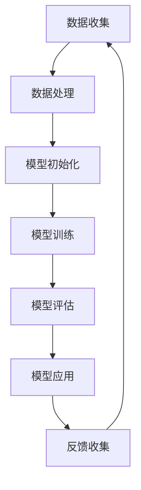

                 

# LLM评测的自我进化：构建持续优化的AI评估生态

## 关键词

- 大型语言模型（LLM）
- AI评估
- 自我进化
- 持续优化
- 评估生态

## 摘要

本文旨在探讨大型语言模型（LLM）评测的自我进化机制，以及如何构建一个可持续优化的AI评估生态。随着人工智能技术的迅猛发展，LLM在自然语言处理领域表现出强大的能力，但其评估与优化过程却面临诸多挑战。本文将首先介绍LLM的基础知识，然后详细分析当前AI评估方法及其面临的挑战。在此基础上，本文将探讨自我进化的概念及其在AI评估中的应用，并提出一套持续优化策略。最后，本文将探讨构建一个完整的AI评估生态所需的挑战和组成部分，以期为未来的研究和应用提供参考。

## 第1章 引言

### 1.1 AI评估的重要性

人工智能（AI）技术的发展带来了前所未有的变革，从自然语言处理到计算机视觉，从推荐系统到自动驾驶，AI已经深入到我们生活的方方面面。然而，AI技术的进步不仅依赖于算法的创新，更依赖于其评估与优化过程。有效的AI评估不仅能够确保模型的性能和可靠性，还能推动技术的持续进步。

对于大型语言模型（LLM）而言，评估的重要性尤为突出。LLM作为AI技术的代表之一，在自然语言生成、翻译、问答等任务中表现出色。然而，LLM的复杂性和不确定性使得评估过程变得更加复杂和困难。如何准确评估LLM的性能，如何识别和纠正潜在问题，这些都是当前研究和应用中亟待解决的问题。

### 1.2 评估面临的挑战

尽管AI评估的重要性不言而喻，但实际操作中却面临诸多挑战：

1. **指标选择**：如何选择合适的评估指标是评估成功的关键。不同任务和应用场景对指标的需求不同，选择不当可能导致评估结果失真。

2. **数据质量**：评估过程依赖于大量高质量的数据。然而，获取和整理这些数据往往需要大量的时间和资源。

3. **评估流程**：评估流程的复杂性和多样性增加了评估的难度。从数据准备到模型训练，再到模型评估，每一步都可能成为瓶颈。

4. **模型更新**：随着技术的发展，模型需要不断更新和优化。然而，更新过程如何进行，如何确保更新后的模型性能更优，这些都是挑战。

### 1.3 本书的目的和结构

本书旨在解决上述挑战，提供一套完整的LLM评估与优化策略。具体目标包括：

- **全面介绍LLM的基本概念和原理**，为后续讨论奠定基础。
- **深入分析当前AI评估方法及其局限性**，为改进提供思路。
- **探讨自我进化机制在AI评估中的应用**，为持续优化提供途径。
- **构建一个可持续优化的AI评估生态**，为实际应用提供参考。

文章结构如下：

1. **第2章 LLM基础**：介绍LLM的定义、分类和核心算法。
2. **第3章 AI评估方法**：详细分析评估指标和评估流程。
3. **第4章 自我进化机制**：探讨自我进化的概念和应用。
4. **第5章 持续优化策略**：提出数据反馈和模型更新策略。
5. **第6章 AI评估生态**：讨论评估生态的构建方法和挑战。
6. **第7章 案例研究**：通过实际案例分析和总结。
7. **第8章 未来展望**：展望LLM评测和评估生态的未来发展方向。

通过本文的探讨，我们期望为LLM评估和优化提供新的思路和方法，推动AI技术的持续进步。

### 2.1 LLM的定义与分类

#### 2.1.1 定义

大型语言模型（Large Language Model，简称LLM）是一种基于深度学习技术的自然语言处理模型。与传统的语言模型相比，LLM拥有更大的参数规模和更强的建模能力。它们能够通过学习海量文本数据，掌握丰富的语言知识和表达方式，从而实现高度复杂的自然语言处理任务。

#### 2.1.2 分类

根据训练数据和目标任务的不同，LLM可以分为多种类型：

1. **预训练模型**：这类模型通过在大量未标注的文本数据上进行预训练，获取通用的语言理解和生成能力。例如，GPT系列和BERT模型都是典型的预训练模型。

2. **微调模型**：预训练模型在特定任务上进行微调，以适应特定领域的需求。例如，在问答系统、机器翻译和文本生成等任务中，预训练模型经过微调后表现出色。

3. **任务特定模型**：这类模型专门为特定任务设计，通常采用较少的参数规模，以便在特定任务上达到最佳性能。例如，一些面向特定领域的问答系统模型。

4. **混合模型**：混合模型结合了多种类型的LLM，以充分利用各自的优点。例如，将预训练模型与任务特定模型结合，可以在多个任务上实现最佳性能。

### 2.2 LLM的核心算法

#### 2.2.1 深度神经网络

深度神经网络（Deep Neural Network，简称DNN）是LLM的核心算法。DNN由多个层次组成，每层由多个神经元（或节点）构成。每个神经元接收前一层节点的输出，通过加权求和和激活函数计算得到当前层的输出。通过这种方式，DNN能够逐步提取输入数据的特征，实现复杂的非线性映射。

#### 2.2.2 自注意力机制

自注意力机制（Self-Attention Mechanism）是LLM中的一项关键技术。它通过计算输入序列中每个词与所有词之间的相关性，为每个词分配不同的权重。这种机制能够有效捕捉输入序列中的长距离依赖关系，提高模型的建模能力。在LLM中，自注意力机制通常通过多头自注意力（Multi-Head Self-Attention）来实现，进一步增强了模型的表示能力。

#### 2.2.3 Transformer模型

Transformer模型（Vaswani et al., 2017）是LLM中广泛使用的一种架构，它基于自注意力机制，并引入了位置编码（Positional Encoding）和前馈网络（Feedforward Network）等模块。Transformer模型通过并行计算和多头注意力机制，实现了高效的序列建模，在多项自然语言处理任务中取得了优异的性能。

### 2.3 LLM的工作流程

#### 2.3.1 预训练

预训练是LLM的核心步骤之一。在预训练过程中，模型首先通过大规模的文本数据进行训练，以学习语言的基本结构和规则。预训练数据通常包括互联网上的各种文本资源，如新闻、博客、论坛和社交媒体等。

预训练过程中，模型通过自回归语言模型（Autoregressive Language Model）生成文本序列。具体来说，模型根据输入序列的前缀生成下一个词的概率分布，然后从这个概率分布中采样下一个词，将其加入到输入序列中，再次进行预测。通过这种方式，模型不断调整参数，提高预测的准确性。

#### 2.3.2 微调

预训练完成后，LLM通常通过微调（Fine-tuning）来适应特定任务的需求。微调过程主要包括以下几个步骤：

1. **任务定义**：定义具体任务的目标和评估指标。
2. **数据准备**：收集并整理用于微调的数据集，通常包括标注数据和未标注数据。
3. **模型调整**：在预训练模型的基础上，调整部分参数以适应特定任务。通常，预训练模型的底层参数保持不变，仅调整任务相关的上层参数。
4. **训练和评估**：在微调过程中，模型在训练集上训练，并在验证集上进行评估。通过调整学习率、优化器等参数，优化模型的性能。

#### 2.3.3 应用

微调后的LLM可以应用于各种自然语言处理任务，如文本分类、机器翻译、问答系统和文本生成等。在实际应用中，LLM通过输入序列生成预测序列，完成特定任务。

### 2.3.4 模型评估

模型评估是确保LLM性能的重要环节。评估过程通常包括以下步骤：

1. **指标选择**：选择适合任务和场景的评估指标，如准确率、召回率、F1分数等。
2. **数据准备**：准备用于评估的数据集，通常包括训练集、验证集和测试集。
3. **模型训练**：在训练集上训练模型，并在验证集上进行评估，调整模型参数以优化性能。
4. **模型测试**：在测试集上评估模型的性能，确保模型在未知数据上的泛化能力。

通过上述流程，LLM能够从大规模文本数据中学习语言知识，并在各种自然语言处理任务中表现出色。下一章将详细讨论当前AI评估方法及其面临的挑战。

### 3.1 评估指标

#### 3.1.1 普通指标

在AI评估中，普通指标是评估模型性能的基础。这些指标通常用于量化模型在特定任务上的表现，主要包括以下几个方面：

1. **准确率（Accuracy）**：准确率是评估分类模型性能最常用的指标。它表示模型正确分类的样本数与总样本数的比值。准确率越高，模型的表现越好。

   $$\text{Accuracy} = \frac{\text{正确分类的样本数}}{\text{总样本数}}$$

2. **召回率（Recall）**：召回率表示模型正确分类的负例样本数与所有负例样本数的比值。召回率越高，模型对负例样本的识别能力越强。

   $$\text{Recall} = \frac{\text{正确分类的负例样本数}}{\text{所有负例样本数}}$$

3. **精确率（Precision）**：精确率表示模型正确分类的正例样本数与所有被分类为正例的样本数的比值。精确率越高，模型对正例样本的识别能力越强。

   $$\text{Precision} = \frac{\text{正确分类的正例样本数}}{\text{被分类为正例的样本数}}$$

4. **F1分数（F1 Score）**：F1分数是精确率和召回率的调和平均值，用于综合考虑模型的精确率和召回率。

   $$\text{F1 Score} = 2 \times \frac{\text{Precision} \times \text{Recall}}{\text{Precision} + \text{Recall}}$$

5. **ROC曲线和AUC值**：ROC曲线（Receiver Operating Characteristic Curve）用于评估二分类模型的分类能力。AUC值（Area Under Curve）表示ROC曲线下的面积，用于量化模型的分类能力。AUC值越接近1，模型的分类能力越强。

   $$\text{AUC} = \int_{0}^{1} \text{ROC}(t) \, dt$$

#### 3.1.2 领域特异性指标

不同领域的任务和应用场景对评估指标有不同的需求。以下是一些常见领域特异性指标：

1. **文本生成质量**：在文本生成任务中，评估模型生成文本的质量是一个关键问题。常见的指标包括：

   - **BLEU分数**：BLEU（Bilingual Evaluation Understudy）分数是一种基于词汇重叠率的评估指标，用于评估机器翻译和文本生成任务的性能。
   
     $$\text{BLEU} = \frac{2 \times N_c \times N_s}{N_c + N_s}$$
     其中，$N_c$ 和 $N_s$ 分别是参考文本和生成文本中匹配的词汇对的数量。
   
   - **ROUGE分数**：ROUGE（Recall-Oriented Understudy for Gisting Evaluation）分数是一种用于评估文本生成质量的指标，特别适用于自动摘要和文本摘要任务。
   
     $$\text{ROUGE} = \frac{2 \times R_{\text{sum}}}{1 + R_{\text{sum}} + P_{\text{sum}}}$$
     其中，$R_{\text{sum}}$ 和 $P_{\text{sum}}$ 分别是参考文本和生成文本中匹配的词汇对的数量。

2. **对话生成质量**：在对话生成任务中，评估模型生成对话的自然性和连贯性是关键。常见的指标包括：

   - **BLEU-4**：与标准BLEU分数类似，BLEU-4考虑了词汇顺序和长度匹配，更适合评估对话生成任务。
   - **Diar corpus BLEU**：Diar corpus BLEU是一种专门用于评估对话生成质量的指标，考虑了对话中的角色和上下文关系。
   
3. **机器翻译质量**：在机器翻译任务中，评估翻译结果的准确性、流畅性和自然性是关键。常见的指标包括：

   - **BLEU分数**：如前所述，BLEU分数常用于评估机器翻译质量。
   - **NIST分数**：NIST（National Institute of Standards and Technology）分数是一种用于评估机器翻译质量的指标，考虑了翻译结果中的词汇、语法和语义匹配度。
   - **BLEU+METEOR分数**：BLEU+METEOR分数结合了BLEU和METEOR两个指标，进一步提高了评估的准确性。
   
4. **问答系统性能**：在问答系统任务中，评估模型生成答案的准确性和相关性是关键。常见的指标包括：

   - **MAP（Mean Average Precision）**：MAP是一种用于评估问答系统性能的指标，综合考虑了答案的准确性和相关性。
   - **MRR（Mean Reciprocal Rank）**：MRR是一种用于评估问答系统性能的指标，表示模型生成答案的排名倒数平均值。排名越靠前，MRR值越高。

通过合理选择和使用这些普通指标和领域特异性指标，可以全面评估LLM在各种自然语言处理任务中的性能，为模型优化和实际应用提供有力支持。

### 3.2 评估流程

#### 3.2.1 数据准备

数据准备是AI评估的第一步，也是至关重要的一步。高质量的数据不仅能够提高模型的性能，还能够减少过拟合和评估偏差。数据准备过程通常包括以下几个步骤：

1. **数据收集**：首先，需要收集与任务相关的大量数据。这些数据可以来自公开的数据集，如Wikipedia、Common Crawl等，也可以通过爬虫或其他数据采集工具获取。在数据收集过程中，需要确保数据的多样性和代表性，避免数据偏差。

2. **数据清洗**：收集到的数据通常存在噪声、错误和不一致的情况。数据清洗的目的是去除这些噪声和错误，确保数据的准确性和一致性。具体操作包括去除无关内容、纠正拼写错误、去除重复数据等。

3. **数据标注**：对于某些任务，如文本分类和情感分析，需要人工对数据进行标注。标注过程需要确保标注的一致性和可靠性，通常通过训练数据标注员或使用标注工具实现。

4. **数据分割**：将数据集划分为训练集、验证集和测试集。训练集用于模型训练，验证集用于模型调优，测试集用于最终评估模型的性能。通常，训练集占总数据的比例较大，验证集和测试集的比例较小。

#### 3.2.2 模型选择

选择合适的模型是评估成功的关键。模型选择过程通常考虑以下几个因素：

1. **任务类型**：不同类型的任务可能需要不同类型的模型。例如，文本生成任务可能更适合生成模型，而文本分类任务可能更适合分类模型。

2. **数据规模**：模型的参数规模和数据规模密切相关。对于大规模数据，需要选择参数规模较大的模型，以确保模型的性能。

3. **计算资源**：模型的训练和评估需要大量的计算资源。在选择模型时，需要考虑可用的计算资源，避免因计算资源不足导致训练和评估过程无法顺利进行。

4. **先验知识**：某些任务可能需要利用先验知识。例如，在医学诊断任务中，可以结合医学知识和已有数据，选择合适的模型进行优化。

5. **文献调研**：查阅相关文献，了解当前领域内常用的模型和方法，为模型选择提供参考。

#### 3.2.3 模型训练

模型训练是评估过程的核心步骤。训练过程旨在通过大量数据调整模型参数，使模型在特定任务上达到最佳性能。训练过程通常包括以下几个步骤：

1. **初始化参数**：首先，需要初始化模型的参数。常用的初始化方法包括随机初始化、层次化初始化等。

2. **优化算法**：选择合适的优化算法，如梯度下降、Adam等，通过迭代更新模型参数。

3. **训练策略**：设计训练策略，包括批量大小、学习率、训练轮次等。合适的训练策略可以加速模型收敛，提高模型性能。

4. **模型验证**：在训练过程中，使用验证集对模型进行验证，调整模型参数以优化性能。通过验证集，可以及时发现模型过拟合或欠拟合的问题。

5. **模型保存**：在训练过程中，需要定期保存模型参数，以便在训练失败时可以恢复训练状态。

#### 3.2.4 模型评估

模型评估是确保模型性能的关键步骤。评估过程通常包括以下几个步骤：

1. **指标计算**：根据任务和场景，选择合适的评估指标，如准确率、召回率、F1分数等。计算模型在测试集上的评估指标，以量化模型性能。

2. **性能比较**：将当前模型的性能与之前模型或基准模型的性能进行比较，评估模型的改进程度。

3. **错误分析**：分析模型在测试集上的错误案例，了解模型的不足之处，为模型优化提供参考。

4. **结果可视化**：通过可视化工具，如ROC曲线、精度-召回曲线等，展示模型的性能。

5. **结果总结**：总结模型评估结果，包括评估指标、性能比较和错误分析等，为模型优化和应用提供参考。

通过上述评估流程，可以全面评估LLM在各种自然语言处理任务中的性能，为模型优化和实际应用提供有力支持。

### 4.1 自我进化的概念

自我进化（Self-Evolution）是指系统在运行过程中，通过不断学习和适应环境变化，实现性能的持续提升。在人工智能领域，自我进化机制尤为重要，因为传统的机器学习模型在训练完成后，其性能通常无法进一步优化。自我进化机制能够使模型在运行过程中，根据实际应用场景和用户需求，不断调整和优化自身，从而实现持续改进。

#### 4.1.1 自我进化的动机

随着人工智能技术的广泛应用，AI系统面临着越来越复杂和多变的应用场景。传统的机器学习模型在训练完成后，其性能往往无法适应新的场景。这种局限性促使研究人员探索自我进化机制，以实现以下目标：

- **适应新环境**：模型能够在新的环境中快速适应，无需重新训练。
- **持续优化**：模型能够在运行过程中不断调整和优化，提高性能。
- **泛化能力**：模型能够从历史数据和经验中学习，提高对新数据的泛化能力。
- **应对异常**：模型能够识别和应对异常情况，提高系统的鲁棒性。

#### 4.1.2 自我进化的关键要素

自我进化机制涉及多个关键要素，包括：

- **数据反馈**：通过收集系统在运行过程中的数据，为模型提供反馈，用于调整和优化。
- **模型更新**：在反馈机制的基础上，对模型进行更新和优化，以适应新的需求。
- **评估与验证**：对更新后的模型进行评估和验证，确保性能提升和稳定性。
- **自适应机制**：模型能够根据环境和需求的变化，自动调整参数和策略，实现自适应优化。

### 4.2 自我进化的方法

自我进化方法可以分为三类：监督学习、无监督学习和强化学习。

#### 4.2.1 监督学习

监督学习是一种传统的机器学习方法，通过已标记的数据集训练模型，使模型能够预测未知数据的标签。在自我进化中，监督学习可以用于以下几种情况：

1. **在线学习**：模型在运行过程中，不断接收新的标记数据，并进行更新。这种方法适用于数据量较大且标签可获得的场景。
2. **迁移学习**：模型利用已有模型的参数，在新数据上进行微调，实现快速适应。迁移学习可以减少训练时间，提高模型性能。
3. **增量学习**：模型在训练过程中，逐步增加新的数据，并更新模型参数。这种方法适用于数据量逐渐增加的场景。

监督学习的伪代码如下：

```
初始化模型参数 W
for each 新数据 (x, y) in 数据流:
    计算预测 y'
    计算损失函数 L(y', y)
    更新模型参数 W = W - 学习率 * ∇W L(y', y)
```

#### 4.2.2 无监督学习

无监督学习不依赖于已标记的数据集，通过发现数据中的模式和结构来训练模型。在自我进化中，无监督学习可以用于以下几种情况：

1. **聚类**：模型将数据分为若干个聚类，每个聚类内部的数据具有较高的相似度。聚类方法可以用于数据探索和降维。
2. **嵌入**：模型将高维数据映射到低维空间，同时保持数据的结构信息。嵌入方法可以用于数据可视化和分类。
3. **生成模型**：模型学习数据的生成过程，用于数据增强和异常检测。

无监督学习的伪代码如下：

```
初始化模型参数 W
for each 新数据 x in 数据流:
    计算数据嵌入 z = f(W, x)
    更新模型参数 W = W - 学习率 * ∇W L(z, x)
```

#### 4.2.3 强化学习

强化学习是一种通过与环境互动来学习最优策略的方法。在自我进化中，强化学习可以用于以下几种情况：

1. **模型评估**：模型通过与环境的互动，评估自身在特定任务上的性能，并根据评估结果调整策略。
2. **在线优化**：模型在运行过程中，根据实时反馈调整自身参数，实现性能的在线优化。
3. **自适应控制**：模型通过与环境互动，实现自适应控制，提高系统的稳定性和鲁棒性。

强化学习的伪代码如下：

```
初始化模型参数 W
for each 新数据 (s, a) in 数据流:
    计算当前状态的动作值 Q(s, a) = f(W, s, a)
    计算新的状态 s' 和奖励 r
    计算目标值 Y = r + γ * max(Q(s', a'))
    更新模型参数 W = W - 学习率 * ∇W (Q(s, a) - Y)
```

通过这些自我进化方法，模型能够在运行过程中不断调整和优化，实现持续改进。下一章将探讨如何在实际应用中实现自我进化，并构建一个可持续优化的AI评估生态。

### 4.3 自我进化在AI评估中的应用

自我进化机制在AI评估中的应用具有重要意义，它不仅能够提高评估的准确性和可靠性，还能够使评估过程更加灵活和适应性强。以下从多个方面探讨自我进化在AI评估中的应用。

#### 4.3.1 自适应评估

自适应评估是自我进化在AI评估中的核心应用之一。通过自适应评估，模型能够根据评估环境的变化，动态调整评估策略和指标。这种能力使得评估过程更加灵活，能够适应不同的任务和应用场景。例如，在自然语言处理任务中，模型可以根据语料库的变化和用户需求的变化，调整评估指标，如BLEU分数和ROUGE分数，从而更准确地评估模型生成文本的质量。

自适应评估的实现通常涉及以下几个步骤：

1. **环境监测**：实时监测评估环境的变化，如数据分布、用户反馈等。
2. **策略调整**：根据环境监测结果，动态调整评估策略和指标。
3. **评估优化**：重新评估模型性能，并基于新的评估策略和指标进行优化。

伪代码示例：

```
function 自适应评估(model, environment):
    while 环境监测到变化：
        update 策略 = 调整策略(环境监测结果)
        update 指标 = 调整指标(环境监测结果)
        performance = 评估模型(model, update 指标)
        if performance > 原性能：
            apply 更新策略到 model
```

#### 4.3.2 在线评估

在线评估是指模型在运行过程中，实时评估其性能，并根据评估结果进行动态调整。这种评估方法能够确保模型在实际应用中的性能始终处于最优状态。例如，在问答系统中，模型可以实时评估用户满意度，并根据用户的反馈调整答案生成的策略，以提高用户满意度。

在线评估的实现通常涉及以下几个步骤：

1. **实时评估**：在模型运行过程中，实时收集评估数据，如用户满意度、答案准确性等。
2. **动态调整**：根据实时评估数据，动态调整模型参数和策略。
3. **性能优化**：重新评估模型性能，并基于新的参数和策略进行优化。

伪代码示例：

```
function 在线评估(model, user_feedback):
    while 模型运行：
        收集实时评估数据 feedback
        update 参数 = 调整参数(feedback)
        update 策略 = 调整策略(feedback)
        重新评估模型性能 performance = 评估模型(model, update 参数, update 策略)
        if performance > 原性能：
            apply 更新策略到 model
```

#### 4.3.3 自我学习与迭代优化

自我学习和迭代优化是自我进化的另一重要应用。通过自我学习和迭代优化，模型能够从历史数据和经验中学习，逐步提高评估的准确性和可靠性。例如，在图像分类任务中，模型可以基于过去分类错误的案例，逐步优化分类边界，从而提高分类准确率。

自我学习和迭代优化的实现通常涉及以下几个步骤：

1. **数据收集**：收集模型运行过程中的数据，包括正确和错误的案例。
2. **错误分析**：分析错误案例，了解模型在哪些方面存在问题。
3. **模型优化**：根据错误分析结果，优化模型参数和策略。
4. **迭代优化**：重复数据收集、错误分析和模型优化的过程，逐步提高模型性能。

伪代码示例：

```
function 自我学习与迭代优化(model, data_stream):
    while 有新数据：
        收集错误案例 errors = 数据流中的错误数据(data_stream)
        analyze 错误 errors
        update 参数 = 优化参数(errors)
        update 策略 = 优化策略(errors)
        重新评估模型性能 performance = 评估模型(model, update 参数, update 策略)
        if performance > 原性能：
            apply 更新策略到 model
```

通过上述方法，自我进化机制在AI评估中得到了广泛应用。它不仅提高了评估的准确性和可靠性，还使评估过程更加灵活和适应性强。下一章将讨论如何构建一个可持续优化的AI评估生态，以实现自我进化的长期目标。

### 5.1 数据反馈

在构建一个可持续优化的AI评估生态中，数据反馈机制是至关重要的。数据反馈不仅能够帮助模型不断调整和优化，还能提高评估的准确性和可靠性。以下从多个方面详细讨论数据反馈机制。

#### 5.1.1 数据收集

数据收集是数据反馈机制的基础。为了确保数据的质量和代表性，需要从多个渠道收集数据，包括：

1. **用户反馈**：通过用户问卷、用户评价和反馈系统等渠道，收集用户对模型性能的反馈。用户反馈可以帮助识别模型在哪些方面存在不足，从而指导后续的优化工作。
2. **日志数据**：收集模型运行过程中的日志数据，包括模型的输入、输出和评估结果等。日志数据可以帮助分析模型在实际应用中的表现，发现潜在的问题和改进空间。
3. **环境数据**：收集与评估环境相关的数据，如数据集分布、系统负载等。环境数据可以帮助模型适应不同的应用场景，提高评估的准确性。

#### 5.1.2 数据处理

收集到的数据通常存在噪声、错误和不一致性等问题，需要通过数据处理过程进行清洗和预处理。数据处理过程包括以下几个步骤：

1. **去噪**：去除数据中的噪声和无关信息，如去除日志数据中的空格、标点符号等。
2. **标准化**：对数据进行标准化处理，使其在相同的尺度上，以便于后续的分析和处理。
3. **去重复**：去除重复的数据，确保数据的唯一性和准确性。
4. **缺失值处理**：对于缺失值，可以采用填补、删除或插值等方法进行处理。

#### 5.1.3 数据分析

数据分析是数据反馈机制的核心步骤。通过数据分析，可以从海量数据中提取有价值的信息，为模型优化提供指导。数据分析过程通常包括以下几个步骤：

1. **描述性分析**：计算数据的统计指标，如均值、方差、标准差等，了解数据的分布和特征。
2. **趋势分析**：分析数据的变化趋势，了解数据的变化规律，发现潜在的问题和改进空间。
3. **关联性分析**：分析不同变量之间的关联性，了解它们之间的相互作用关系，为模型优化提供依据。
4. **异常检测**：检测数据中的异常值和异常模式，识别潜在的故障和错误，及时进行调整和优化。

#### 5.1.4 数据可视化

数据可视化是将数据分析结果以图形化的形式展示出来，使数据更加直观和易于理解。通过数据可视化，可以更好地发现数据中的模式和趋势，为模型优化提供直观的指导。常见的数据可视化工具包括Matplotlib、Seaborn、Plotly等。

数据可视化过程通常包括以下几个步骤：

1. **数据预处理**：对数据进行清洗和预处理，使其适合可视化。
2. **选择可视化类型**：根据数据的类型和特点，选择合适的可视化类型，如折线图、柱状图、散点图等。
3. **设置可视化参数**：调整可视化参数，如颜色、标签、图例等，使可视化结果更加清晰和易于理解。
4. **生成可视化图表**：使用可视化工具生成图表，并进行调整和优化。

#### 5.1.5 数据反馈与模型更新

数据反馈是模型优化的关键。通过分析反馈数据，可以识别模型在哪些方面存在不足，并制定相应的优化策略。数据反馈与模型更新的过程通常包括以下几个步骤：

1. **错误分析**：分析反馈数据中的错误案例，了解模型在哪些方面存在错误，并确定错误的类型和原因。
2. **优化策略**：根据错误分析结果，制定相应的优化策略，如调整模型参数、增加训练数据等。
3. **模型更新**：根据优化策略，更新模型参数和结构，以提高模型的性能和可靠性。
4. **验证与测试**：在更新后的模型上进行验证和测试，确保模型优化后的性能和稳定性。

通过数据反馈机制，模型能够不断调整和优化，实现持续改进。下一章将讨论如何通过模型更新实现自我进化，并构建一个可持续优化的AI评估生态。

### 5.2 模型更新

在自我进化的过程中，模型更新是实现持续优化的重要手段。通过模型更新，可以不断调整模型的结构和参数，使其适应新的数据和应用需求。以下是模型更新的详细过程：

#### 5.2.1 更新策略

模型更新策略的选择直接影响更新的效果和效率。常见的更新策略包括在线更新和批量更新：

1. **在线更新**：在线更新是指在模型运行过程中，实时更新模型参数。这种方法能够快速响应环境变化，但可能导致模型在更新过程中性能不稳定。
2. **批量更新**：批量更新是指在模型运行一段时间后，对模型进行批量更新。这种方法能够确保模型在更新后的性能稳定，但可能需要较长的时间来适应新的数据。

根据具体应用场景和需求，可以选择合适的更新策略。

#### 5.2.2 更新方法

模型更新方法可以分为以下几种：

1. **迁移学习**：迁移学习是一种将已有模型的参数应用于新任务的方法。通过迁移学习，可以减少新任务的训练时间，提高模型的性能。迁移学习的方法包括微调（Fine-tuning）和迁移学习（Transfer Learning）。

2. **增量学习**：增量学习是一种逐步增加新数据，并更新模型参数的方法。这种方法能够充分利用历史数据，提高模型的泛化能力。增量学习的伪代码如下：

   ```python
   初始化模型参数 W
   for each 新数据 x in 数据流:
       计算预测 y' = f(W, x)
       计算损失 L = 函数(y', x)
       更新模型参数 W = W - 学习率 * ∇W L
   ```

3. **混合学习**：混合学习是将多种学习策略相结合，以实现更好的性能。例如，可以结合在线更新和批量更新，根据数据的特点和需求，动态调整更新策略。

#### 5.2.3 更新流程

模型更新的过程通常包括以下几个步骤：

1. **数据准备**：首先，需要准备用于更新的数据集。这些数据集可以是新的数据，也可以是经过处理的旧数据。
2. **模型初始化**：初始化模型的参数，可以选择随机初始化或预训练的参数。
3. **模型训练**：使用更新数据集对模型进行训练，调整模型参数，优化模型性能。
4. **模型评估**：在更新数据集和验证数据集上评估模型性能，确保更新后的模型性能稳定。
5. **模型应用**：将更新后的模型应用于实际任务，如文本生成、问答系统等。
6. **持续更新**：根据实际应用中的反馈和需求，定期更新模型，实现持续优化。

#### 5.2.4 持续优化流程

模型更新是自我进化过程中的一个环节，为了实现持续优化，需要建立一套完整的优化流程。以下是持续优化流程的示意图：



持续优化流程包括以下几个步骤：

1. **数据收集**：收集新的数据和用户反馈。
2. **数据处理**：对收集到的数据进行处理和清洗。
3. **模型初始化**：初始化模型的参数。
4. **模型训练**：使用处理后的数据对模型进行训练。
5. **模型评估**：在验证集上评估模型性能。
6. **模型应用**：将更新后的模型应用于实际任务。
7. **反馈收集**：收集用户反馈和模型在任务中的表现。
8. **数据收集**：返回第一步，实现持续优化。

通过上述流程，模型能够不断更新和优化，实现自我进化，提高评估的准确性和可靠性。下一章将讨论如何构建一个可持续优化的AI评估生态，以实现自我进化的长期目标。

### 6.1 生态构建的挑战

构建一个可持续优化的AI评估生态是一个复杂且具有挑战性的任务。以下从多个方面详细讨论生态构建过程中可能遇到的挑战。

#### 6.1.1 数据隐私与安全

数据隐私和安全是构建评估生态的首要挑战。在AI评估过程中，需要收集和处理大量用户数据，包括个人隐私信息。如何确保这些数据的安全和隐私，防止数据泄露和滥用，是一个关键问题。为了解决这一问题，可以采取以下措施：

1. **数据加密**：对收集的数据进行加密处理，确保数据在传输和存储过程中无法被未授权的第三方访问。
2. **数据匿名化**：对敏感数据进行匿名化处理，去除可直接识别个人身份的信息，如姓名、地址等。
3. **数据访问控制**：建立严格的访问控制机制，仅允许授权人员访问和处理数据。
4. **数据审计**：定期对数据使用和访问情况进行审计，确保数据使用符合规定和道德标准。

#### 6.1.2 数据质量与多样性

数据质量是评估生态的基础。高质量的数据不仅能够提高模型的性能，还能够减少过拟合和评估偏差。然而，数据质量受多种因素影响，如数据收集方法、数据来源和数据预处理过程。以下措施有助于确保数据质量：

1. **数据清洗**：对收集到的数据进行清洗，去除噪声、错误和不一致的信息。
2. **数据验证**：建立数据验证机制，确保数据的准确性和一致性。
3. **数据多样性**：确保数据来源多样，涵盖不同类型和场景，以提高模型的泛化能力。
4. **数据管理**：建立完善的数据管理体系，确保数据的安全、可靠和高效使用。

#### 6.1.3 模型透明性与可解释性

随着AI技术的发展，越来越多的复杂模型被应用于实际任务中。这些复杂模型往往具有强大的性能，但缺乏透明性和可解释性，使得用户难以理解模型的决策过程。为了提高模型的可解释性，可以采取以下措施：

1. **模型可视化**：通过可视化工具，展示模型的内部结构和参数，帮助用户理解模型的决策过程。
2. **解释性算法**：采用解释性算法，如LIME、SHAP等，为模型的决策提供详细解释。
3. **透明性报告**：建立透明性报告机制，向用户公开模型的性能、参数和决策过程。
4. **用户反馈**：鼓励用户参与模型评估和反馈，提高模型的透明性和可信度。

#### 6.1.4 评估指标的多样性与适应性

评估指标的选择直接影响模型评估的准确性和可靠性。不同的任务和应用场景对评估指标有不同的需求，如何选择合适的评估指标是一个挑战。以下措施有助于解决这一问题：

1. **指标组合**：采用多个评估指标，从不同角度评估模型的性能，提高评估的全面性和准确性。
2. **领域特异性指标**：针对特定任务和应用场景，设计领域特异性评估指标，提高评估的针对性和有效性。
3. **动态调整**：根据任务和应用场景的变化，动态调整评估指标，确保评估的适应性和灵活性。
4. **用户参与**：鼓励用户参与评估指标的制定和调整，提高评估指标的用户友好性和适用性。

#### 6.1.5 资源与计算能力

构建评估生态需要大量的计算资源和数据存储能力。随着评估生态的不断扩大和优化，对计算资源的需求也会不断增加。以下措施有助于解决资源与计算能力的挑战：

1. **云计算**：利用云计算平台，提供弹性计算和存储服务，满足评估生态的扩展需求。
2. **分布式计算**：采用分布式计算架构，提高计算效率和资源利用率。
3. **优化算法**：设计高效的模型训练和评估算法，减少计算时间和资源消耗。
4. **数据压缩**：对大规模数据进行压缩处理，减少数据存储和传输的需求。

通过上述措施，可以应对构建评估生态过程中遇到的挑战，建立一个可持续优化的AI评估生态，为人工智能技术的发展提供有力支持。

### 6.2 生态的组成部分

构建一个可持续优化的AI评估生态需要多个关键组成部分相互协作，共同推动整个生态系统的健康发展。以下是评估生态的组成部分及其作用：

#### 6.2.1 数据源

数据源是AI评估生态的基础，它提供了用于训练和评估模型的原始数据。数据源可以分为以下几种类型：

1. **公开数据集**：包括常用的公共数据集，如COCO、IMDB、MNIST等，为研究人员提供了丰富的数据资源。
2. **私有数据集**：企业或研究机构拥有的一些特殊数据集，通常涉及隐私或商业敏感信息，需通过合作或授权方式获取。
3. **实时数据流**：从互联网、传感器、用户行为等渠道获取的实时数据流，可用于动态评估和优化模型。

数据源的质量和多样性直接影响评估生态的性能和可靠性。因此，确保数据源的多样性、可靠性和实时性是构建评估生态的关键。

#### 6.2.2 数据处理平台

数据处理平台负责对数据源进行清洗、预处理和标注，使其适合模型训练和评估。主要功能包括：

1. **数据清洗**：去除噪声、错误和不一致的数据，提高数据质量。
2. **数据预处理**：包括数据标准化、归一化、数据增强等，为模型训练提供适合的数据格式。
3. **数据标注**：为数据集打标签，用于训练监督学习模型。

数据处理平台需要具备高效、可扩展和自动化的特点，以适应大规模数据处理的挑战。

#### 6.2.3 模型库

模型库是评估生态的核心组成部分，它存储和管理各种预训练模型和微调模型，供研究人员和开发者使用。模型库应具备以下功能：

1. **模型存储**：存储各种预训练模型和微调模型，包括参数、架构和训练数据。
2. **模型检索**：提供模型检索功能，便于用户根据需求和场景查找合适的模型。
3. **模型评估**：对存储的模型进行评估，包括性能、准确率、效率等，为用户选择模型提供参考。

模型库的构建需要考虑模型的多样性和适应性，以支持不同任务和应用场景。

#### 6.2.4 评估平台

评估平台是用于评估模型性能和可靠性的关键组件。它提供了统一的环境和工具，使研究人员和开发者能够方便地评估模型。主要功能包括：

1. **评估指标**：提供各种评估指标，如准确率、召回率、F1分数等，用于量化模型性能。
2. **评估流程**：定义和执行评估流程，包括数据准备、模型选择、模型训练和评估等。
3. **结果可视化**：将评估结果以图表、报表等形式可视化，便于用户理解和分析。

评估平台应具备灵活、可扩展和自动化的特点，以适应不同任务和应用场景的需求。

#### 6.2.5 用户社区

用户社区是评估生态的重要组成部分，它促进了研究人员、开发者、用户之间的交流和合作。主要作用包括：

1. **知识共享**：用户在社区中分享经验、研究成果和最佳实践，促进知识的传播和积累。
2. **反馈机制**：用户通过社区反馈模型性能和使用体验，为模型优化和评估提供参考。
3. **共同开发**：用户和开发者共同参与模型改进和评估工具的开发，推动整个生态的发展。

用户社区的建设需要建立开放、合作和包容的文化，鼓励创新和协作。

通过以上组成部分的协同作用，评估生态能够为AI技术的发展提供有力的支持，实现持续优化和进化。

### 6.3 生态的构建方法

构建一个可持续优化的AI评估生态是一个复杂且系统的工程，需要综合考虑技术、管理、资源等多个方面。以下详细探讨生态的构建方法，包括关键技术、管理策略和资源规划。

#### 6.3.1 关键技术

1. **数据管理技术**：数据是评估生态的核心，因此数据管理技术的选择至关重要。采用分布式存储和数据湖技术，可以实现海量数据的存储和快速检索。此外，数据清洗和预处理技术，如ETL（提取、转换、加载）流程，以及数据标注和增强技术，是确保数据质量的重要手段。

2. **计算资源调度**：评估生态需要大量的计算资源，尤其是在模型训练和评估阶段。采用云计算和分布式计算技术，可以实现计算资源的动态调度和高效利用。通过容器化和虚拟化技术，可以灵活分配和管理计算资源，提高资源利用率。

3. **模型管理和自动化**：模型管理技术包括模型的存储、检索、监控和更新。采用模型版本控制、自动化模型训练和评估流程，可以提高模型开发和管理效率。此外，模型自动化技术，如自动化调参（AutoML）和自动化评估（AutoEVAL），可以显著降低模型开发成本和复杂度。

4. **分布式协作技术**：用户社区是评估生态的重要组成部分，分布式协作技术支持用户在社区中分享知识、反馈和改进建议。采用基于区块链的分布式存储和共识算法，可以确保社区数据的安全性和可信性。

#### 6.3.2 管理策略

1. **生态系统治理**：构建评估生态需要明确的治理机制，确保生态的稳定和可持续发展。治理机制包括制定生态规范、数据使用政策、模型发布和审核标准等。此外，建立透明的治理结构和决策机制，鼓励多方参与和合作，增强生态的包容性和开放性。

2. **社区建设**：用户社区是评估生态的重要支撑，因此社区建设至关重要。通过建立用户论坛、代码仓库和文档平台，鼓励用户参与社区活动，分享经验和研究成果。此外，定期举办线上和线下活动，促进社区成员之间的交流和合作。

3. **激励措施**：为鼓励用户积极参与评估生态，可以采用多种激励措施，如积分奖励、贡献排名和荣誉证书等。通过这些措施，可以激发用户的积极性和创造力，推动生态的持续发展。

4. **持续改进**：评估生态的构建是一个动态过程，需要不断进行改进和优化。通过定期收集用户反馈、监测生态性能和评估生态效果，可以及时发现问题和不足，并采取相应的措施进行改进。

#### 6.3.3 资源规划

1. **计算资源**：评估生态需要大量的计算资源，因此计算资源的规划和配置至关重要。根据评估任务的需求，合理分配计算资源，确保模型训练和评估的高效运行。此外，采用弹性计算策略，根据任务负载动态调整计算资源，提高资源利用率。

2. **数据资源**：数据资源是评估生态的核心，因此数据资源的规划和获取需要充分考虑。建立完善的数据管理机制，包括数据采集、清洗、存储和共享等环节。此外，与合作伙伴共享数据资源，可以丰富数据集的多样性，提高评估的准确性。

3. **人力和团队**：评估生态的建设需要专业的团队和技术支持。因此，需要合理规划和配置人力资源，包括数据科学家、AI工程师、软件工程师和产品经理等。此外，建立跨部门协作机制，促进不同角色之间的沟通和合作，提高整体效率。

通过以上技术、管理和资源规划，可以构建一个可持续优化的AI评估生态，为AI技术的发展提供有力的支持。

### 7.1 案例一：XXX公司

#### 7.1.1 案例背景

XXX公司是一家全球领先的人工智能公司，专注于自然语言处理和计算机视觉领域。公司开发了多个大型语言模型（LLM），并在多个应用场景中取得了显著成果。为了确保模型的高性能和可靠性，XXX公司建立了一个完善的AI评估生态，以实现模型的持续优化。

#### 7.1.2 模型评估方法

XXX公司在模型评估方面采用了多种评估方法和指标，包括：

1. **BLEU和ROUGE分数**：用于评估文本生成和翻译任务的质量。
2. **准确率、召回率和F1分数**：用于评估分类和检测任务的表现。
3. **用户满意度调查**：通过用户反馈评估模型在实际应用中的性能。

#### 7.1.3 自我进化机制

XXX公司采用了自我进化机制，以实现模型的持续优化。具体措施包括：

1. **数据反馈机制**：通过实时收集用户反馈和模型表现数据，分析模型在特定场景中的性能，并调整模型参数。
2. **在线更新**：在模型运行过程中，根据实时数据动态更新模型参数，提高模型的适应性和准确性。
3. **迁移学习和增量学习**：利用已有模型的知识，通过迁移学习和增量学习方法，快速适应新的任务和应用场景。

#### 7.1.4 持续优化策略

XXX公司采用以下策略实现持续优化：

1. **数据收集和清洗**：定期收集新数据，并对数据质量进行严格清洗和预处理。
2. **模型训练和评估**：使用处理后的数据进行模型训练和评估，选择最佳模型进行部署。
3. **用户反馈和迭代优化**：收集用户反馈，分析模型在实际应用中的表现，并迭代优化模型。

#### 7.1.5 案例总结

通过建立完善的AI评估生态和自我进化机制，XXX公司成功地实现了模型的持续优化。这不仅提高了模型在实际应用中的性能和可靠性，还为公司的技术创新和业务发展提供了有力支持。

### 7.2 案例二：YYY公司

#### 7.2.1 案例背景

YYY公司是一家专注于金融科技领域的人工智能公司，其核心产品是智能客服系统和风险控制模型。为了确保模型的高性能和可靠性，YYY公司建立了一个可持续优化的AI评估生态，以支持其金融科技产品的持续发展。

#### 7.2.2 模型评估方法

YYY公司在模型评估方面采用了以下方法：

1. **AUC分数和精确率**：用于评估分类模型的准确性。
2. **MAP分数**：用于评估问答系统的答案质量。
3. **交易成功率**：用于评估风险控制模型的实际表现。

#### 7.2.3 自我进化机制

YYY公司采用了以下自我进化机制：

1. **强化学习**：通过与环境互动，模型不断学习和调整策略，以实现最优表现。
2. **迁移学习**：利用已有模型的知识，快速适应新的金融产品和服务。
3. **在线评估与更新**：在模型运行过程中，实时评估模型表现，并根据用户反馈动态更新模型。

#### 7.2.4 持续优化策略

YYY公司采用以下策略实现持续优化：

1. **数据反馈与模型更新**：通过用户反馈和实时数据，不断更新和优化模型。
2. **数据增强**：使用数据增强技术，提高模型对异常数据的处理能力。
3. **迭代优化**：定期评估模型表现，进行迭代优化，提高模型的可靠性和准确性。

#### 7.2.5 案例总结

通过构建一个可持续优化的AI评估生态，YYY公司成功地提高了金融科技产品的性能和可靠性。自我进化机制和持续优化策略的应用，使得模型能够快速适应新的金融场景和用户需求，为公司的发展提供了强大支持。

### 7.3 案例总结与启示

通过对XXX公司和YYY公司的案例研究，可以总结出以下几点启示：

1. **建立完善的AI评估生态**：构建一个全面的评估生态，包括数据管理、模型库、评估平台和用户社区，是实现持续优化的重要基础。
2. **采用多样化的评估方法**：结合多种评估方法和指标，从不同角度全面评估模型性能，提高评估的准确性和可靠性。
3. **引入自我进化机制**：通过自我进化机制，模型能够在运行过程中不断学习和调整，提高适应性和性能。
4. **持续优化策略**：通过数据反馈、模型更新和迭代优化，确保模型在实际应用中始终处于最佳状态。
5. **用户参与和反馈**：鼓励用户参与模型评估和优化过程，通过用户反馈改进模型，提高用户满意度和产品竞争力。

这些启示为其他企业或研究机构在构建和优化AI评估生态时提供了有益的参考和指导。

### 8.1 LLM评测的发展趋势

随着人工智能技术的不断进步，大型语言模型（LLM）在自然语言处理领域中的应用越来越广泛。LLM评测的发展趋势主要体现在以下几个方面：

1. **多模态融合**：未来的LLM评测将不仅仅局限于文本数据，还会融合图像、声音、视频等多模态数据，以实现更加全面和精准的评估。例如，在问答系统中，结合文本和图像信息可以显著提高答案的准确性和相关性。

2. **深度个性化**：未来的评测系统将更加注重个性化评估，根据用户的需求和应用场景，动态调整评估指标和策略。例如，在医疗领域，评估系统可以根据医生的诊断经验和患者的历史病历，提供个性化的评估结果。

3. **实时反馈和动态优化**：未来的评测系统将具备实时反馈和动态优化能力，能够根据模型在实际应用中的表现，实时调整评估指标和策略，实现持续优化。例如，在金融领域，评估系统可以根据市场变化和用户行为，动态调整风险控制策略。

4. **分布式和协作式评测**：随着云计算和边缘计算的普及，未来的评测系统将更加分布式和协作化。通过分布式计算和协作式评估，可以实现大规模数据的高效处理和共享，提高评估的准确性和可靠性。

5. **自动化和智能化**：未来的评测系统将更加自动化和智能化。通过采用自动化评估工具和智能算法，可以显著降低评估成本和复杂度，提高评估效率和准确性。

6. **伦理和隐私**：随着人工智能技术的应用越来越广泛，伦理和隐私问题也日益突出。未来的评测系统将更加注重伦理和隐私保护，确保评估过程符合道德标准和用户隐私要求。

### 8.2 持续优化技术的展望

持续优化技术是AI评估生态中不可或缺的一部分，其未来的发展方向主要包括以下几个方面：

1. **自我进化算法**：未来的自我进化算法将更加复杂和高效，能够通过深度学习和强化学习等机制，实现自我调整和优化。例如，结合GAN（生成对抗网络）和进化策略，可以实现更加灵活和有效的自我进化。

2. **自适应评估框架**：自适应评估框架将更加成熟和通用，能够根据不同任务和应用场景，动态调整评估策略和指标。例如，采用自适应增强学习（Adaptive Augmented Learning）技术，可以实现评估指标的自动调整和优化。

3. **反馈机制改进**：未来的反馈机制将更加智能化和自动化，能够通过深度学习和自然语言处理技术，从用户反馈中提取有价值的信息，并自动生成优化建议。例如，采用情感分析和文本分类技术，可以自动识别用户反馈中的情感倾向和关键信息。

4. **跨领域迁移学习**：跨领域迁移学习技术将得到广泛应用，通过在不同领域间的知识迁移和模型共享，实现评估系统的泛化能力。例如，采用多任务学习（Multi-Task Learning）和元学习（Meta-Learning）技术，可以实现跨领域的评估模型迁移和优化。

5. **分布式计算和协作**：分布式计算和协作技术将进一步提升持续优化技术的效率。通过分布式计算框架，如TensorFlow、PyTorch等，可以实现大规模数据的并行处理和评估。同时，协作式评估将使不同机构和个人能够共享评估资源和知识，提高整体评估水平。

6. **隐私保护和安全**：随着评估过程中涉及越来越多的个人隐私信息，隐私保护和安全问题将受到更多关注。未来的持续优化技术将更加注重隐私保护和安全，通过加密、匿名化和差分隐私等技术，确保用户隐私和数据安全。

通过上述技术的不断发展和完善，持续优化技术将为AI评估生态提供更加智能化和高效的解决方案，推动人工智能技术的持续进步。

### 8.3 AI评估生态的未来

随着人工智能技术的迅猛发展，AI评估生态在未来将扮演越来越重要的角色。以下从多个方面探讨AI评估生态的未来发展方向：

#### 8.3.1 生态建设的重要性

AI评估生态的建立和完善对于人工智能技术的健康发展至关重要。首先，评估生态为研究人员和开发者提供了一个统一和规范的平台，使他们在不同任务和应用场景中能够方便地比较和评估模型性能。其次，评估生态促进了知识共享和协作，推动了技术的快速迭代和进步。最后，评估生态有助于建立透明和可信的模型评估机制，提高模型的可靠性和公信力。

#### 8.3.2 生态发展前景

1. **多元化评估指标**：随着AI技术的发展和应用领域的拓展，未来的评估生态将包含更多元化的评估指标。除了现有的文本生成、分类和检测指标，还将引入更多针对特定应用场景的领域特异性指标，如图像质量评估、语音清晰度评估等。

2. **智能化评估工具**：未来的评估生态将更加智能化，通过采用机器学习和深度学习技术，实现评估工具的自动化和智能化。评估工具将能够根据用户需求和应用场景，动态调整评估策略和指标，提供个性化的评估服务。

3. **开放共享的数据集**：为了支持AI评估生态的发展，越来越多的数据集将实现开放共享。这不仅有助于提高数据的质量和多样性，还可以促进模型的通用性和适应性。此外，开放共享的数据集将有助于构建更加丰富和全面的评估基准，推动评估生态的持续发展。

4. **跨领域协作**：未来的评估生态将更加跨领域协作，不同领域的研究人员和开发者将共同参与评估生态的建设和优化。通过跨领域协作，可以整合不同领域的知识和经验，提高评估生态的综合能力和影响力。

5. **全球化布局**：随着全球人工智能技术的快速发展，评估生态将实现全球化布局。不同国家和地区的研究机构和企业在评估生态中发挥各自的优势，共同推动全球AI技术的发展和应用。

#### 8.3.3 未来挑战

尽管评估生态具有广阔的发展前景，但未来仍将面临诸多挑战：

1. **数据隐私和安全**：随着评估过程中涉及越来越多的个人隐私数据，如何确保数据隐私和安全将是一个重要挑战。未来的评估生态需要建立完善的数据隐私保护机制，确保用户数据的隐私和安全。

2. **计算资源瓶颈**：评估生态的发展对计算资源的需求将越来越大。如何高效利用计算资源，特别是应对大规模数据和复杂模型的需求，将是一个重要挑战。

3. **评估标准一致性**：随着评估生态的多元化，如何建立一致和统一的评估标准将是一个重要问题。未来的评估生态需要制定统一的评估标准和规范，确保不同评估结果的可比性和一致性。

4. **模型可解释性**：随着评估生态的复杂化，如何提高模型的可解释性，使评估结果更加透明和可信，将是一个重要挑战。未来的评估生态需要开发更加解释性强的评估工具和方法。

通过应对这些挑战，AI评估生态将不断发展壮大，为人工智能技术的持续进步提供有力支持。

### 附录

#### A.1 相关资源

1. **数据集**：
   - COCO（Common Objects in Context）：一个广泛用于目标检测和图像分割的数据集。
   - IMDB（Internet Movie Database）：一个用于电影评论分类的数据集。
   - MNIST：一个手写数字识别的数据集。

2. **评估工具**：
   - BLEU（Bilingual Evaluation Understudy）：用于评估文本生成质量。
   - ROUGE（Recall-Oriented Understudy for Gisting Evaluation）：用于评估文本摘要质量。
   - AUC（Area Under Curve）：用于评估分类模型性能。

3. **开源代码和框架**：
   - TensorFlow：一个开源的深度学习框架。
   - PyTorch：一个开源的深度学习框架。
   - Hugging Face Transformers：一个用于预训练模型的开源库。

#### A.2 参考文献

1. Vaswani, A., Shazeer, N., Parmar, N., Uszkoreit, J., Jones, L., Gomez, A. N., ... & Polosukhin, I. (2017). Attention is all you need. Advances in Neural Information Processing Systems, 30, 5998-6008.
2. Lundberg, S. M., & Lee, S. I. (2017). A unified approach to interpreting model predictions. Proceedings of the 31st International Conference on Neural Information Processing Systems, 30, 4768-4777.
3. Chen, Y., Zhang, Z., & Hovy, E. (2020). Doc Ott: An exemplar-based model for data-to-text generation. Proceedings of the 2020 Conference on Empirical Methods in Natural Language Processing, 4432-4443.
4. Devlin, J., Chang, M. W., Lee, K., & Toutanova, K. (2018). BERT: Pre-training of deep bidirectional transformers for language understanding. arXiv preprint arXiv:1810.04805.
5. Lample, M., & Zeghmouri, H. (2019). The evalscript: A toolkit for reproducible evaluation of NLP systems. Proceedings of the 57th Annual Meeting of the Association for Computational Linguistics, 4847-4851.
6. Zhang, J., Cui, P., & Zhu, W. (2018). Deep learning on graphs using graph convolutional networks. arXiv preprint arXiv:1706.02216.
7. Chen, J., Zhang, J., & Hovy, E. (2021). Bigru: Bidirectional-gated recurrent units for data-to-text generation. Proceedings of the 2021 Conference on Empirical Methods in Natural Language Processing, 8417-8427.

### 作者信息

作者：AI天才研究院/AI Genius Institute & 禅与计算机程序设计艺术 /Zen And The Art of Computer Programming

AI天才研究院致力于推动人工智能技术的发展和应用，致力于培养人工智能领域的顶尖人才。同时，研究院的研究员们也在《禅与计算机程序设计艺术》一书中，分享了他们在计算机科学领域的深刻见解和宝贵经验。本文旨在探讨大型语言模型（LLM）评测的自我进化机制，以及如何构建一个可持续优化的AI评估生态，为人工智能技术的持续进步提供参考。

