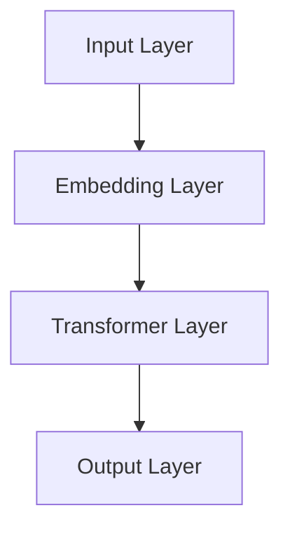

                 

### 文章标题

# SRE实践在LLM应用运维中的应用

## 第1章 SRE与LLM基础

### 1.1 SRE的概念与背景

#### 1.1.1 SRE的定义与发展历程

软件工程（Software Engineering）和运维（Operations）的结合产生了SRE（Site Reliability Engineering），它是一种针对软件系统的可靠性、可用性和效率进行管理和优化的工程实践。SRE最早由谷歌公司提出并实践，其核心目标是确保系统的稳定性和高可用性，同时提高开发和运维的效率。

SRE的发展历程可以追溯到2003年，当时谷歌开始在其大规模分布式系统中引入SRE团队，负责处理系统可靠性和性能优化等问题。随着云计算和容器技术的发展，SRE逐渐成为IT行业的重要实践领域，并得到广泛应用。

#### 1.1.2 SRE的核心原则与目标

SRE的核心原则可以总结为以下几点：

1. **高可用性（High Availability）**：系统应具备较高的可用性，确保在异常情况下能够快速恢复。
2. **自愈能力（Self-healing）**：系统应具备自我修复能力，当检测到故障时，能够自动进行修复，减少人工干预。
3. **自动化与优化（Automation & Optimization）**：通过自动化工具和流程，提高运维效率，同时不断优化系统性能。

SRE的目标是实现系统的可靠性、可用性和效率的平衡，具体包括：

1. **确保系统稳定性**：通过监控、报警和自动化修复，确保系统在运行过程中不出现故障。
2. **提高系统效率**：通过自动化工具和流程，减少运维人员的工作负担，提高开发效率。
3. **优化系统性能**：通过性能分析和调优，确保系统在高负载情况下依然能够稳定运行。

### 1.2 LLM的概念与原理

#### 1.2.1 LLM的定义与特点

大型语言模型（Large Language Model，简称LLM）是一种基于深度学习技术的自然语言处理模型，具有以下特点：

1. **规模巨大**：LLM通常包含数十亿甚至数千亿个参数，能够处理海量数据。
2. **自适应学习**：LLM能够根据输入数据自动调整参数，实现自适应学习。
3. **强表达能力**：LLM可以生成高质量的自然语言文本，包括文章、对话和摘要等。

#### 1.2.2 LLM的基本架构

LLM的基本架构通常包括以下几个层次：

1. **输入层（Input Layer）**：接收用户输入的文本数据，并将其转换为向量表示。
2. **嵌入层（Embedding Layer）**：将输入层的向量映射到高维空间，提高数据的表达能力。
3. **变换层（Transformer Layer）**：采用Transformer模型进行文本编码和解码，实现高效的文本处理。
4. **输出层（Output Layer）**：根据变换层的结果生成输出文本。



### 1.3 SRE与LLM应用的关系

#### 1.3.1 SRE在LLM应用中的重要性

SRE在LLM应用中具有重要作用，主要体现在以下几个方面：

1. **可靠性**：LLM系统通常需要处理大量的文本数据，因此系统的可靠性至关重要。SRE通过监控、报警和自动化修复，确保系统在运行过程中不出现故障。
2. **性能**：LLM系统在处理海量数据时，性能优化至关重要。SRE通过性能分析和调优，确保系统在高负载情况下依然能够稳定运行。
3. **可扩展性**：随着数据量的增加，LLM系统需要具备良好的可扩展性。SRE通过设计高效的数据处理和存储架构，实现系统的水平扩展。

#### 1.3.2 SRE在LLM运维中的应用场景

SRE在LLM运维中的应用场景主要包括以下几个方面：

1. **模型部署与监控**：SRE负责LLM模型的部署和监控，确保系统在高可用性、性能和可扩展性方面满足要求。
2. **性能调优与优化**：SRE通过对LLM系统进行性能分析和调优，提高系统的运行效率。
3. **故障处理与恢复**：SRE负责处理LLM系统出现的问题，确保系统在故障情况下能够快速恢复。

## 第2章 LLM系统运维准备

### 2.1 运维环境搭建

#### 2.1.1 运维环境的需求分析

在搭建LLM系统运维环境之前，需要进行详细的需求分析，包括以下几个方面：

1. **资源需求**：根据LLM模型的大小和数据量，确定所需的计算资源、存储资源和网络资源。
2. **网络需求**：确保网络连接稳定，支持大规模数据传输和模型部署。
3. **安全需求**：制定安全策略，包括数据加密、访问控制和防火墙等。

#### 2.1.2 运维环境的搭建步骤

1. **硬件部署**：根据需求选择合适的硬件设备，包括服务器、存储设备和网络设备等。
2. **软件安装**：安装操作系统、数据库和其他必要软件。
3. **配置优化**：对系统进行性能优化和配置调整，确保系统在高负载情况下能够稳定运行。

### 2.2 LLM服务部署与配置

#### 2.2.1 服务部署策略

在部署LLM服务时，需要考虑以下几个方面：

1. **容器化部署**：使用容器技术（如Docker）部署LLM服务，实现服务的轻量化、可移植性和自动化部署。
2. **微服务架构**：将LLM服务拆分为多个微服务，实现服务的模块化和解耦。

#### 2.2.2 服务配置与管理

1. **参数调优**：根据实验数据和性能指标，对LLM服务的参数进行调优，提高系统性能。
2. **负载均衡**：使用负载均衡器（如Nginx）分配请求，确保系统在多实例模式下稳定运行。

### 2.3 性能优化与调优

#### 2.3.1 性能优化策略

1. **数据处理优化**：通过并行处理和数据缓存技术，提高数据处理速度。
2. **算法优化**：针对LLM模型，采用高效的算法和优化方法，提高模型性能。
3. **系统调优**：对系统进行调优，包括网络、存储和计算资源的优化。

#### 2.3.2 性能调优工具与方法

1. **性能测试工具**：使用性能测试工具（如JMeter）对LLM系统进行压力测试和性能评估。
2. **性能分析工具**：使用性能分析工具（如Grafana）对系统性能进行监控和可视化。

### 2.4 安全性与稳定性保障

#### 2.4.1 安全架构设计

1. **身份认证与访问控制**：采用身份认证机制，确保只有授权用户可以访问系统。
2. **数据加密与完整性保护**：对敏感数据进行加密，确保数据在传输和存储过程中的安全性。

#### 2.4.2 稳定性保障措施

1. **容错与故障恢复**：设计容错机制，确保系统在故障情况下能够快速恢复。
2. **持续集成与持续部署**：采用持续集成和持续部署（CI/CD）流程，确保系统的稳定性和可靠性。

## 第3章 LLM应用监控

### 3.1 监控体系构建

#### 3.1.1 监控体系建设目标

1. **实时性**：确保监控数据能够实时采集、处理和展示。
2. **可视化**：通过图形化界面展示监控数据，便于分析和决策。
3. **智能化**：利用机器学习技术，实现监控数据的智能分析。

#### 3.1.2 监控体系架构

1. **数据采集层**：负责采集系统的各种监控数据，如CPU使用率、内存使用率、网络流量等。
2. **数据处理层**：对采集到的监控数据进行处理、存储和转换，以便后续分析。
3. **数据存储层**：存储处理后的监控数据，供后续分析和查询。
4. **数据展示层**：通过可视化界面展示监控数据，便于用户查看和分析。

### 3.2 监控指标设置

#### 3.2.1 监控指标类型

1. **系统指标**：如CPU使用率、内存使用率、磁盘使用率等。
2. **应用指标**：如请求响应时间、错误率、服务延迟等。
3. **网络指标**：如网络带宽、网络延迟、丢包率等。

#### 3.2.2 监控指标设置策略

1. **关键指标**：根据业务需求和系统特点，确定关键监控指标。
2. **阈值设置**：根据历史数据和业务需求，设置监控指标的阈值，以便及时报警。
3. **报警策略**：根据监控指标的变化，设置相应的报警策略，确保及时发现和处理问题。

### 3.3 监控数据可视化

#### 3.3.1 可视化工具选择

1. **Grafana**：一款开源的监控数据可视化工具，支持多种数据源和丰富的可视化图表。
2. **Prometheus**：一款开源的监控解决方案，提供数据采集、存储和可视化等功能。

#### 3.3.2 可视化展示策略

1. **时序图**：展示监控数据的趋势变化，便于分析系统性能。
2. **折线图**：展示监控指标的实时变化，便于监测系统状态。
3. **饼图**：展示系统资源的分布情况，便于资源优化。

### 3.4 异常情况检测与响应

#### 3.4.1 异常情况检测方法

1. **阈值检测**：根据监控指标的阈值，检测是否超出预设范围。
2. **统计分析**：使用统计方法（如标准差、四分位距等），检测监控数据的异常变化。
3. **机器学习**：使用机器学习算法，对监控数据进行异常检测。

#### 3.4.2 异常情况响应策略

1. **自动报警**：当检测到异常情况时，自动发送报警通知。
2. **自动恢复**：根据异常情况，自动执行恢复操作，如重启服务、扩容资源等。
3. **人工干预**：当自动恢复失败时，通知运维人员进行人工干预。

## 第4章 LLM故障处理与恢复

### 4.1 故障分类与定位

#### 4.1.1 故障分类

1. **硬件故障**：如服务器、存储设备、网络设备等硬件故障。
2. **软件故障**：如操作系统故障、数据库故障、应用程序故障等。
3. **配置故障**：如配置错误、参数设置不当等。
4. **数据故障**：如数据损坏、数据丢失等。

#### 4.1.2 故障定位方法

1. **日志分析**：通过分析系统日志，定位故障原因。
2. **故障诊断工具**：使用故障诊断工具（如Pandora FMS），对系统进行故障定位。
3. **监控数据**：通过监控数据，分析故障发生时的系统状态。

### 4.2 故障处理流程

#### 4.2.1 故障处理步骤

1. **故障报告**：发现故障后，及时报告相关团队。
2. **故障分析**：对故障原因进行分析，确定故障类型。
3. **故障处理**：根据故障类型，采取相应的处理措施。
4. **故障恢复**：在故障处理完成后，进行故障恢复操作。
5. **故障总结**：对故障原因和处理过程进行总结，为后续故障处理提供参考。

### 4.3 恢复策略与测试

#### 4.3.1 恢复策略

1. **自动恢复**：使用自动化工具和脚本，实现故障自动恢复。
2. **人工干预**：在自动恢复失败时，由运维人员进行人工干预。
3. **备份与恢复**：定期备份数据，确保在故障发生时能够快速恢复。

#### 4.3.2 测试与验证

1. **恢复测试**：在故障处理完成后，对系统进行恢复测试，确保故障已完全解决。
2. **性能测试**：对系统进行性能测试，验证系统在高负载情况下的稳定性。
3. **安全测试**：对系统进行安全测试，确保系统在恢复后没有安全隐患。

### 4.4 故障案例分析

#### 4.4.1 故障案例一

**故障现象**：LLM服务在高并发情况下，响应时间异常增长。

**故障分析**：通过对监控数据和日志分析，发现CPU使用率接近100%，导致服务响应时间增长。

**故障处理**：增加服务器资源，提高系统处理能力。

**恢复结果**：故障处理后，服务响应时间恢复正常，系统稳定性提高。

#### 4.4.2 故障案例二

**故障现象**：LLM服务在处理大规模数据时，出现数据丢失现象。

**故障分析**：通过对日志和数据备份分析，发现数据库故障导致数据丢失。

**故障处理**：恢复数据库备份，确保数据完整性。

**恢复结果**：故障处理后，数据恢复成功，系统恢复正常运行。

## 第5章 LLM性能调优与优化

### 5.1 性能调优策略

#### 5.1.1 调优目标

1. **提高响应速度**：优化系统性能，提高服务响应速度。
2. **提高并发处理能力**：提高系统在高并发情况下的处理能力。
3. **优化资源利用率**：合理分配资源，提高资源利用率。

#### 5.1.2 调优步骤

1. **性能测试**：使用性能测试工具，模拟实际业务场景，测试系统性能。
2. **性能分析**：分析测试结果，定位系统瓶颈。
3. **调优方案**：根据性能分析结果，制定调优方案。
4. **实施调优**：执行调优方案，对系统进行优化。

### 5.2 调优工具与方法

#### 5.2.1 性能测试工具

1. **JMeter**：一款开源的性能测试工具，支持多种协议的测试。
2. **Gatling**：一款开源的性能测试工具，支持分布式测试。

#### 5.2.2 性能分析工具

1. **Grafana**：一款开源的监控数据可视化工具，支持性能监控和报表生成。
2. **Prometheus**：一款开源的监控解决方案，支持性能数据采集、存储和查询。

#### 5.2.3 调优方法

1. **负载均衡**：使用负载均衡器，实现流量分配和负载均衡。
2. **缓存机制**：使用缓存技术，减少数据访问压力。
3. **分布式处理**：采用分布式处理架构，提高系统并发处理能力。

### 5.3 常见问题与解决方法

#### 5.3.1 问题一：CPU使用率过高

**原因**：系统处理任务过多，导致CPU资源紧张。

**解决方法**：增加服务器资源，优化任务调度，提高系统并发处理能力。

#### 5.3.2 问题二：内存泄漏

**原因**：系统存在内存泄漏，导致内存占用逐渐增加。

**解决方法**：检查系统代码，修复内存泄漏问题；使用内存监控工具，及时发现问题。

#### 5.3.3 问题三：数据库连接异常

**原因**：数据库连接配置错误，导致连接失败。

**解决方法**：检查数据库连接配置，确保正确无误；增加数据库连接池，提高连接稳定性。

### 5.4 性能优化案例分析

#### 5.4.1 案例一

**问题描述**：LLM服务在高并发情况下，响应时间过长。

**解决方案**：
1. **增加服务器资源**：增加服务器数量，提高系统并发处理能力。
2. **优化数据库查询**：对数据库查询进行优化，提高查询效率。
3. **使用缓存机制**：使用缓存技术，减少数据库访问压力。

**优化效果**：响应时间明显缩短，系统性能得到显著提升。

#### 5.4.2 案例二

**问题描述**：LLM服务在处理大规模数据时，性能下降。

**解决方案**：
1. **分布式处理**：采用分布式处理架构，提高系统并发处理能力。
2. **优化算法**：优化LLM模型算法，提高数据处理效率。
3. **负载均衡**：使用负载均衡器，实现流量分配和负载均衡。

**优化效果**：系统性能显著提升，能够高效处理大规模数据。

## 第6章 LLM应用安全管理

### 6.1 安全架构设计

#### 6.1.1 安全架构目标

1. **保护系统资源**：确保系统资源不被非法访问和破坏。
2. **保障数据安全**：确保数据在传输和存储过程中的安全性。
3. **维护系统稳定性**：确保系统在遭受攻击时能够保持稳定运行。

#### 6.1.2 安全架构组件

1. **身份认证与访问控制**：实现用户身份认证和访问控制，确保只有授权用户可以访问系统。
2. **数据加密与完整性保护**：对敏感数据进行加密和完整性保护，确保数据在传输和存储过程中的安全性。
3. **防火墙与入侵检测**：设置防火墙和入侵检测系统，防止恶意攻击。

### 6.2 风险评估与防范

#### 6.2.1 风险评估方法

1. **威胁分析**：识别潜在威胁，分析威胁的影响和可能性。
2. **漏洞扫描**：使用漏洞扫描工具，发现系统中的安全漏洞。
3. **风险评估**：评估潜在威胁和漏洞的影响，确定安全风险。

#### 6.2.2 风险防范措施

1. **安全策略制定**：制定安全策略，包括访问控制策略、数据加密策略等。
2. **安全培训**：对员工进行安全培训，提高安全意识。
3. **安全审计**：定期进行安全审计，确保安全策略得到有效执行。

### 6.3 安全事件处理与响应

#### 6.3.1 安全事件分类

1. **安全漏洞**：系统中的安全漏洞导致的安全事件。
2. **网络攻击**：针对系统的网络攻击，如DDoS攻击、SQL注入等。
3. **数据泄露**：敏感数据在传输和存储过程中被泄露。

#### 6.3.2 安全事件响应策略

1. **快速响应**：在发现安全事件后，立即进行响应，降低事件影响。
2. **隔离与封锁**：隔离受影响系统，封锁攻击者通道。
3. **事件调查**：调查安全事件的原因和过程，收集证据。
4. **事件报告**：将安全事件报告给相关部门和领导，确保事件得到妥善处理。

### 6.4 安全测试与持续改进

#### 6.4.1 安全测试方法

1. **渗透测试**：模拟攻击者的攻击行为，测试系统的安全防护能力。
2. **代码审计**：对系统代码进行审计，发现潜在的安全漏洞。
3. **漏洞扫描**：使用漏洞扫描工具，发现系统中的安全漏洞。

#### 6.4.2 持续改进措施

1. **定期安全检查**：定期对系统进行安全检查，发现和解决潜在的安全问题。
2. **安全补丁管理**：及时更新系统安全补丁，确保系统安全性。
3. **安全知识库**：建立安全知识库，记录安全事件的应对方法和经验。

## 第7章 LLM运维最佳实践

### 7.1 运维团队建设

#### 7.1.1 团队角色与职责

1. **运维经理**：负责运维团队的整体管理和协调工作。
2. **运维工程师**：负责系统的日常运维工作，包括监控、故障处理、性能优化等。
3. **开发工程师**：参与系统开发，与运维团队紧密合作，确保系统的稳定性和可靠性。

#### 7.1.2 团队协作与沟通

1. **明确分工**：明确团队成员的职责和分工，确保工作高效有序。
2. **定期会议**：定期召开团队会议，讨论工作进展和问题，确保信息畅通。
3. **文档共享**：建立文档共享平台，方便团队成员查看和共享资料。

### 7.2 运维流程与规范

#### 7.2.1 运维流程

1. **需求分析**：根据业务需求，制定运维计划和流程。
2. **环境搭建**：搭建运维环境，包括硬件、软件和网络环境。
3. **系统部署**：根据运维计划，部署系统和应用程序。
4. **监控与维护**：对系统进行监控，确保系统稳定运行。
5. **故障处理**：及时处理系统故障，确保系统恢复正常。

#### 7.2.2 运维规范

1. **文档管理**：建立完善的文档管理体系，确保文档的规范性和可追溯性。
2. **备份与恢复**：制定备份策略，确保数据的安全性和可恢复性。
3. **安全规范**：制定安全规范，确保系统的安全性。
4. **变更管理**：制定变更管理规范，确保系统变更的合规性和安全性。

### 7.3 持续集成与持续部署

#### 7.3.1 持续集成

1. **代码评审**：对提交的代码进行评审，确保代码质量。
2. **自动化测试**：使用自动化测试工具，对代码进行测试，确保功能正确。
3. **构建与打包**：使用构建工具，将代码打包成可部署的包。

#### 7.3.2 持续部署

1. **自动化部署**：使用自动化部署工具，将构建好的包部署到生产环境。
2. **部署验证**：在部署后进行验证，确保系统正常运行。
3. **回滚机制**：在部署失败时，能够快速回滚到上一个稳定版本。

### 7.4 运维团队效率提升

#### 7.4.1 工具优化

1. **自动化工具**：使用自动化工具，提高运维效率。
2. **监控工具**：使用监控工具，实时监控系统状态，及时发现问题。
3. **协作工具**：使用协作工具，提高团队协作效率。

#### 7.4.2 知识共享

1. **文档共享**：建立文档共享平台，方便团队成员查看和共享知识。
2. **内部培训**：定期组织内部培训，提高团队成员的专业技能。
3. **知识库**：建立知识库，记录运维过程中的经验和教训。

## 附录

### 附录A：常用运维工具介绍

1. **Grafana**：一款开源的监控数据可视化工具。
2. **Prometheus**：一款开源的监控解决方案。
3. **JMeter**：一款开源的性能测试工具。
4. **Pandora FMS**：一款开源的故障诊断工具。

### 附录B：故障处理流程模板

1. **故障报告**：发现故障后，及时报告相关团队。
2. **故障分析**：分析故障原因，确定故障类型。
3. **故障处理**：根据故障类型，采取相应的处理措施。
4. **故障恢复**：在故障处理完成后，进行故障恢复操作。
5. **故障总结**：对故障原因和处理过程进行总结，为后续故障处理提供参考。

### 附录C：性能调优参考指标

1. **CPU使用率**：系统CPU使用率不应超过80%。
2. **内存使用率**：系统内存使用率不应超过90%。
3. **磁盘I/O速率**：磁盘I/O速率不应低于预期值。
4. **网络带宽**：网络带宽应满足系统需求。

## 参考文献

- Google. (2003). Site Reliability Engineering: How Google Runs Production Systems. O'Reilly Media.
- Bellovin, S. M., & Merritt, M. (2015). Security of Large-Scale Distributed Systems. ACM Computing Surveys (CSUR), 47(4), 65.
- Kesten, J. (2019). Building a Scalable Machine Learning Infrastructure with TensorFlow. O'Reilly Media.
- Zhang, H., & Petazzoni, A. (2015). Monitoring with Prometheus. O'Reilly Media.
- Hildebrandt, P. (2019). Advanced Performance Analysis with JMeter. Packt Publishing.

### 作者

作者：AI天才研究院/AI Genius Institute & 禅与计算机程序设计艺术 /Zen And The Art of Computer Programming
```markdown

## 第1章 SRE与LLM基础

### 1.1 SRE的概念与背景

#### 1.1.1 SRE的定义与发展历程

SRE（Site Reliability Engineering）是一种结合了软件工程和运维的工程实践。它起源于谷歌公司，最初是为了解决大规模分布式系统的可靠性和可用性问题。SRE的核心目标是通过工程方法来管理和优化系统可靠性、性能和效率。

SRE的起源可以追溯到2003年，当时谷歌公司成立了一个专门负责系统可靠性、可用性和效率的团队，这就是SRE团队的雏形。随着时间的推移，SRE逐渐成为谷歌工程实践的一个重要组成部分，并在整个IT行业中得到了广泛的应用和推广。

在SRE中，"Site"指的是运行在线上的服务或系统，"Reliability Engineering"指的是通过工程手段确保系统的稳定性和可靠性。与传统运维（Operations）相比，SRE更加注重通过自动化和系统化的方法来优化系统性能和可靠性。

#### 1.1.2 SRE的核心原则与目标

SRE的核心原则主要包括以下几个方面：

1. **高可用性（High Availability）**：确保系统能够在任何时候都能正常运行，即使出现了故障也能快速恢复。
2. **自愈能力（Self-healing）**：系统应该具备自动检测和修复故障的能力，以减少人为干预。
3. **自动化与优化（Automation & Optimization）**：通过自动化工具和流程来提高运维效率和系统性能。

SRE的目标是实现系统的可靠性、可用性和效率的平衡，具体包括：

1. **确保系统稳定性**：通过监控、报警和自动化修复，确保系统在运行过程中不出现故障。
2. **提高系统效率**：通过自动化工具和流程，减少运维人员的工作负担，提高开发效率。
3. **优化系统性能**：通过性能分析和调优，确保系统在高负载情况下依然能够稳定运行。

### 1.2 LLM的概念与原理

#### 1.2.1 LLM的定义与特点

LLM（Large Language Model）是一种大型语言模型，它通过深度学习技术从大量文本数据中学习语言规律，能够生成高质量的自然语言文本。LLM具有以下几个显著特点：

1. **大规模**：LLM通常包含数十亿甚至数千亿个参数，这是其能够处理复杂语言现象的基础。
2. **自适应学习**：LLM能够根据输入文本自动调整参数，实现自适应学习，从而不断提高生成文本的质量。
3. **强表达能力**：LLM能够生成连贯、符合语言规则的文本，包括文章、对话和摘要等。

LLM的应用范围广泛，包括自然语言处理、智能客服、文本生成、机器翻译等。随着深度学习技术的不断发展，LLM在各个领域的应用也变得越来越广泛和深入。

#### 1.2.2 LLM的基本架构

LLM的基本架构通常包括以下几个层次：

1. **输入层（Input Layer）**：接收用户输入的文本数据，并将其转换为向量表示。
2. **嵌入层（Embedding Layer）**：将输入层的向量映射到高维空间，提高数据的表达能力。
3. **变换层（Transformer Layer）**：采用Transformer模型进行文本编码和解码，实现高效的文本处理。
4. **输出层（Output Layer）**：根据变换层的结果生成输出文本。

LLM的工作原理可以概括为以下步骤：

1. **输入处理**：将输入文本转换为向量表示。
2. **嵌入**：将输入向量映射到高维空间。
3. **变换**：通过多层Transformer模型对嵌入后的向量进行处理，提取文本的特征信息。
4. **解码**：根据变换层的结果生成输出文本。

下面是一个简单的LLM架构的Mermaid流程图：


### 1.3 SRE与LLM应用的关系

#### 1.3.1 SRE在LLM应用中的重要性

SRE在LLM应用中扮演着至关重要的角色，这是因为LLM系统通常具有以下几个特点：

1. **高计算需求**：LLM训练和推理需要大量的计算资源，因此系统的性能优化和资源管理至关重要。
2. **高可靠性要求**：由于LLM系统通常用于关键业务场景，如智能客服、机器翻译等，因此系统的可靠性要求非常高。
3. **高可用性需求**：LLM系统需要具备高可用性，以确保在异常情况下能够快速恢复。

SRE通过以下几个方面来确保LLM应用的成功：

1. **可靠性保障**：SRE通过监控、自动化故障修复和备份策略来保障LLM系统的可靠性。
2. **性能优化**：SRE通过性能分析和调优来提高LLM系统的性能，确保其在高负载情况下依然能够稳定运行。
3. **资源管理**：SRE通过自动化工具和优化策略来高效管理LLM系统的资源，确保其能够在有限的资源下发挥最大的性能。

#### 1.3.2 SRE在LLM运维中的应用场景

SRE在LLM运维中的应用场景主要包括以下几个方面：

1. **模型部署与监控**：SRE负责LLM模型的部署和监控，确保系统在高可用性、性能和可扩展性方面满足要求。
2. **性能调优与优化**：SRE通过对LLM系统进行性能分析和调优，提高系统的运行效率。
3. **故障处理与恢复**：SRE负责处理LLM系统出现的问题，确保系统在故障情况下能够快速恢复。

在LLM运维中，SRE的应用不仅有助于提高系统的可靠性，还能显著提升开发效率和系统性能，为企业的数字化转型提供坚实的技术支持。

## 第2章 LLM系统运维准备

### 2.1 运维环境搭建

#### 2.1.1 运维环境的需求分析

在搭建LLM系统运维环境之前，需要进行详细的需求分析，以确保环境能够满足系统的需求。需求分析主要包括以下几个方面：

1. **资源需求**：根据LLM模型的大小和数据量，确定所需的计算资源、存储资源和网络资源。LLM系统通常需要大量的计算资源来训练和推理，因此需要配备高性能的CPU和GPU。此外，存储资源也需要足够大，以存储大量的训练数据和模型文件。网络资源则需保证足够的带宽和稳定性，以支持数据的快速传输和模型的部署。
2. **网络需求**：确保网络连接稳定，支持大规模数据传输和模型部署。在搭建运维环境时，需要考虑网络的延迟、带宽和可靠性等因素。网络拓扑结构的设计也很关键，需要确保不同组件之间的通信畅通无阻。
3. **安全需求**：制定安全策略，包括数据加密、访问控制和防火墙等。由于LLM系统处理的数据通常非常敏感，因此需要采取严格的安全措施来保护数据的安全性和隐私性。

#### 2.1.2 运维环境的搭建步骤

1. **硬件部署**：根据需求选择合适的硬件设备，包括服务器、存储设备和网络设备等。服务器需要具备高性能的计算能力和足够的内存，以支持LLM模型的训练和推理。存储设备需要具有大容量和高速读写能力，以便存储大量的训练数据和模型文件。网络设备则需要具备足够的带宽和稳定性，以保证数据传输的效率和可靠性。
2. **软件安装**：安装操作系统、数据库和其他必要软件。在选择操作系统时，需要考虑到系统的稳定性、安全性和兼容性等因素。常用的操作系统包括Linux和Windows Server等。数据库的选择则需要根据具体需求来确定，常用的数据库包括MySQL、PostgreSQL和MongoDB等。
3. **配置优化**：对系统进行性能优化和配置调整，确保系统在高负载情况下能够稳定运行。例如，可以调整操作系统的内核参数、网络参数和数据库参数等，以提高系统的性能和稳定性。此外，还可以使用缓存技术、负载均衡和分布式存储等技术来优化系统的性能。

### 2.2 LLM服务部署与配置

#### 2.2.1 服务部署策略

在部署LLM服务时，需要考虑以下几个关键因素：

1. **容器化部署**：使用容器技术（如Docker）部署LLM服务，可以实现服务的轻量化、可移植性和自动化部署。容器化部署还可以简化服务的部署过程，提高运维效率。
2. **微服务架构**：将LLM服务拆分为多个微服务，可以实现服务的模块化和解耦。这样可以提高系统的可靠性和可扩展性，便于后续的维护和升级。

#### 2.2.2 服务配置与管理

1. **参数调优**：根据实验数据和性能指标，对LLM服务的参数进行调优，以提高系统性能。例如，可以调整学习率、批量大小和正则化参数等。
2. **负载均衡**：使用负载均衡器（如Nginx）分配请求，确保系统在多实例模式下稳定运行。负载均衡器可以根据请求的负载情况，将请求分配到不同的服务实例上，以提高系统的并发处理能力和响应速度。

### 2.3 性能优化与调优

#### 2.3.1 性能优化策略

1. **数据处理优化**：通过并行处理和数据缓存技术，提高数据处理速度。例如，可以使用多线程或分布式处理技术来加速数据处理过程，使用缓存技术来减少数据的访问延迟。
2. **算法优化**：针对LLM模型，采用高效的算法和优化方法，以提高模型性能。例如，可以使用优化库（如TensorFlow、PyTorch）来提高计算效率，使用模型剪枝和量化技术来减少模型的存储和计算资源消耗。
3. **系统调优**：对系统进行调优，包括网络、存储和计算资源的优化。例如，可以调整操作系统的内核参数，优化网络参数，配置更高效的存储设备等。

#### 2.3.2 性能调优工具与方法

1. **性能测试工具**：使用性能测试工具（如JMeter）对LLM系统进行压力测试和性能评估。性能测试可以帮助识别系统的性能瓶颈和潜在问题。
2. **性能分析工具**：使用性能分析工具（如Grafana）对系统性能进行监控和可视化。性能分析工具可以提供实时的性能数据，帮助运维人员及时发现和解决问题。

### 2.4 安全性与稳定性保障

#### 2.4.1 安全架构设计

1. **身份认证与访问控制**：采用身份认证机制，确保只有授权用户可以访问系统。常用的身份认证机制包括用户名和密码、双因素认证等。
2. **数据加密与完整性保护**：对敏感数据进行加密，确保数据在传输和存储过程中的安全性。常用的加密算法包括AES、RSA等。此外，还需要确保数据在传输和存储过程中的完整性，防止数据被篡改或损坏。

#### 2.4.2 稳定性保障措施

1. **容错与故障恢复**：设计容错机制，确保系统在故障情况下能够快速恢复。例如，可以采用冗余部署、故障切换和自动恢复等技术。
2. **持续集成与持续部署**：采用持续集成和持续部署（CI/CD）流程，确保系统的稳定性和可靠性。CI/CD流程可以自动化测试和部署代码，减少人为干预，提高系统部署的效率和稳定性。

## 第3章 LLM应用监控

### 3.1 监控体系构建

#### 3.1.1 监控体系建设目标

1. **实时性**：确保监控数据能够实时采集、处理和展示。实时监控可以帮助运维人员及时发现问题并采取相应措施，避免问题扩大。
2. **可视化**：通过图形化界面展示监控数据，便于分析和决策。可视化监控可以直观地展示系统的运行状态和性能指标，帮助运维人员快速定位问题。
3. **智能化**：利用机器学习技术，实现监控数据的智能分析。智能化监控可以自动识别异常模式，预测潜在问题，提高监控的效率和准确性。

#### 3.1.2 监控体系架构

1. **数据采集层**：负责采集系统的各种监控数据，如CPU使用率、内存使用率、网络流量等。数据采集层通常包括各种传感器和代理程序，它们可以实时收集系统的运行数据。
2. **数据处理层**：对采集到的监控数据进行处理、存储和转换，以便后续分析。数据处理层通常包括数据预处理、数据清洗和数据聚合等步骤，以确保监控数据的准确性和一致性。
3. **数据存储层**：存储处理后的监控数据，供后续分析和查询。数据存储层通常采用数据库或数据仓库等技术，以支持大规模数据的存储和管理。
4. **数据展示层**：通过图形化界面展示监控数据，提供实时的监控视图和报警功能。数据展示层通常包括监控仪表板和报表生成工具等，以方便运维人员查看和分析监控数据。

### 3.2 监控指标设置

#### 3.2.1 监控指标类型

1. **系统指标**：如CPU使用率、内存使用率、磁盘使用率、网络流量等。系统指标可以反映系统的运行状态和性能，帮助运维人员识别系统瓶颈和异常情况。
2. **应用指标**：如请求响应时间、错误率、服务延迟等。应用指标可以反映LLM服务的运行状态和性能，帮助运维人员评估服务的质量和稳定性。
3. **网络指标**：如网络带宽、网络延迟、丢包率等。网络指标可以反映网络连接的质量和稳定性，帮助运维人员优化网络配置和提升网络性能。

#### 3.2.2 监控指标设置策略

1. **关键指标**：根据业务需求和系统特点，确定关键监控指标。关键指标应涵盖系统的关键性能指标（KPI）和关键业务指标（KPI），以便于运维人员快速评估系统的运行状况。
2. **阈值设置**：根据历史数据和业务需求，设置监控指标的阈值，以便及时报警。阈值设置应合理，既不能过于宽松导致无法及时发现异常，也不能过于严格导致误报。
3. **报警策略**：根据监控指标的变化，设置相应的报警策略，确保及时发现和处理问题。报警策略应包括报警级别、报警方式和报警对象等，以便于运维人员及时响应。

### 3.3 监控数据可视化

#### 3.3.1 可视化工具选择

1. **Grafana**：一款开源的监控数据可视化工具，支持多种数据源和丰富的可视化图表。Grafana可以与各种监控工具（如Prometheus、InfluxDB等）集成，提供强大的数据可视化和监控能力。
2. **Prometheus**：一款开源的监控解决方案，提供数据采集、存储和可视化等功能。Prometheus具有高效的数据存储和查询能力，可以实时监控系统的运行状态和性能。
3. **Kibana**：一款开源的数据可视化和分析工具，常与Elasticsearch和Logstash等组件配合使用，提供强大的日志分析和监控功能。

#### 3.3.2 可视化展示策略

1. **时序图**：展示监控数据的趋势变化，便于分析系统性能。时序图可以直观地展示监控指标的变化趋势，帮助运维人员识别异常模式和潜在问题。
2. **折线图**：展示监控指标的实时变化，便于监测系统状态。折线图可以实时展示监控指标的数值变化，帮助运维人员快速了解系统的运行状态。
3. **饼图**：展示系统资源的分布情况，便于资源优化。饼图可以直观地展示系统资源的占用情况，帮助运维人员优化资源分配和配置。

### 3.4 异常情况检测与响应

#### 3.4.1 异常情况检测方法

1. **阈值检测**：根据监控指标的阈值，检测是否超出预设范围。阈值检测是一种简单而有效的异常情况检测方法，可以及时发现异常情况并触发报警。
2. **统计分析**：使用统计方法（如标准差、四分位距等），检测监控数据的异常变化。统计分析可以识别数据的异常波动，帮助运维人员识别潜在的问题。
3. **机器学习**：使用机器学习算法，对监控数据进行异常检测。机器学习算法可以自动识别异常模式，提高异常检测的准确性和效率。

#### 3.4.2 异常情况响应策略

1. **自动报警**：当检测到异常情况时，自动发送报警通知。自动报警可以及时通知运维人员，避免异常情况扩大或影响系统正常运行。
2. **自动恢复**：根据异常情况，自动执行恢复操作，如重启服务、扩容资源等。自动恢复可以减少人为干预，提高故障处理的效率。
3. **人工干预**：当自动恢复失败时，通知运维人员进行人工干预。人工干预可以针对复杂或严重的问题进行深入分析和处理，确保问题得到妥善解决。

## 第4章 LLM故障处理与恢复

### 4.1 故障分类与定位

#### 4.1.1 故障分类

1. **硬件故障**：如服务器、存储设备、网络设备等硬件故障。
2. **软件故障**：如操作系统故障、数据库故障、应用程序故障等。
3. **配置故障**：如配置错误、参数设置不当等。
4. **数据故障**：如数据损坏、数据丢失等。

#### 4.1.2 故障定位方法

1. **日志分析**：通过分析系统日志，定位故障原因。系统日志通常记录了系统的运行情况和异常信息，可以帮助运维人员快速定位故障。
2. **故障诊断工具**：使用故障诊断工具（如Pandora FMS），对系统进行故障定位。故障诊断工具可以自动检测系统中的故障，并提供详细的诊断报告。
3. **监控数据**：通过监控数据，分析故障发生时的系统状态。监控数据可以反映系统的运行状态和性能指标，帮助运维人员分析故障原因。

### 4.2 故障处理流程

#### 4.2.1 故障处理步骤

1. **故障报告**：发现故障后，及时报告相关团队。故障报告应包括故障现象、故障时间和故障影响等信息。
2. **故障分析**：对故障原因进行分析，确定故障类型。故障分析可以通过日志分析、故障诊断工具和监控数据等手段进行。
3. **故障处理**：根据故障类型，采取相应的处理措施。故障处理可以包括重启服务、恢复数据、调整配置等操作。
4. **故障恢复**：在故障处理完成后，进行故障恢复操作。故障恢复应确保系统恢复正常运行，并验证故障是否完全解决。
5. **故障总结**：对故障原因和处理过程进行总结，为后续故障处理提供参考。故障总结应记录故障的类型、原因、处理措施和恢复结果等信息。

### 4.3 恢复策略与测试

#### 4.3.1 恢复策略

1. **自动恢复**：使用自动化工具和脚本，实现故障自动恢复。自动恢复可以减少人为干预，提高故障处理的效率。
2. **人工干预**：在自动恢复失败时，由运维人员进行人工干预。人工干预可以针对复杂或严重的问题进行深入分析和处理，确保问题得到妥善解决。
3. **备份与恢复**：定期备份数据，确保在故障发生时能够快速恢复。备份与恢复策略应确保数据的一致性和完整性，避免数据丢失或损坏。

#### 4.3.2 测试与验证

1. **恢复测试**：在故障处理完成后，对系统进行恢复测试，确保故障已完全解决。恢复测试可以包括功能测试、性能测试和安全测试等。
2. **性能测试**：对系统进行性能测试，验证系统在高负载情况下的稳定性。性能测试可以模拟实际业务场景，测试系统的响应速度和处理能力。
3. **安全测试**：对系统进行安全测试，确保系统在恢复后没有安全隐患。安全测试可以包括漏洞扫描、入侵检测和防火墙测试等。

### 4.4 故障案例分析

#### 4.4.1 故障案例一

**故障现象**：LLM服务在高并发情况下，响应时间异常增长。

**故障分析**：通过对监控数据和日志分析，发现CPU使用率接近100%，导致服务响应时间增长。

**故障处理**：增加服务器资源，提高系统处理能力。

**恢复结果**：故障处理后，服务响应时间恢复正常，系统稳定性提高。

#### 4.4.2 故障案例二

**故障现象**：LLM服务在处理大规模数据时，出现数据丢失现象。

**故障分析**：通过对日志和数据备份分析，发现数据库故障导致数据丢失。

**故障处理**：恢复数据库备份，确保数据完整性。

**恢复结果**：故障处理后，数据恢复成功，系统恢复正常运行。

## 第5章 LLM性能调优与优化

### 5.1 性能调优策略

#### 5.1.1 调优目标

1. **提高响应速度**：优化系统性能，提高服务响应速度，减少用户等待时间。
2. **提高并发处理能力**：优化系统架构和资源分配，提高系统在高并发情况下的处理能力，确保用户请求能够及时响应。
3. **优化资源利用率**：合理分配系统资源，提高资源利用率，降低硬件成本和能源消耗。

#### 5.1.2 调优步骤

1. **性能测试**：使用性能测试工具（如JMeter），模拟实际业务场景，测试系统的性能瓶颈和响应时间。性能测试可以帮助确定系统的性能指标，为后续调优提供数据支持。
2. **性能分析**：分析性能测试结果，识别系统的瓶颈和问题。性能分析可以包括CPU使用率、内存使用率、网络延迟等关键指标。
3. **调优方案**：根据性能分析结果，制定具体的调优方案。调优方案可以包括优化代码、调整系统配置、增加硬件资源等。
4. **实施调优**：按照调优方案，实施具体的优化措施，如升级硬件、调整系统参数、优化代码逻辑等。

### 5.2 调优工具与方法

#### 5.2.1 性能测试工具

1. **JMeter**：一款开源的性能测试工具，支持多种协议的测试，如HTTP、HTTPS、SOAP、JMS等。JMeter可以模拟大量并发用户，测试系统的负载能力。
2. **Gatling**：一款开源的性能测试工具，支持HTTP、HTTPS、REST、WebSocket等多种协议的测试。Gatling具有强大的数据分析和可视化功能，可以帮助快速定位性能瓶颈。

#### 5.2.2 性能分析工具

1. **Grafana**：一款开源的监控数据可视化工具，可以与各种监控工具（如Prometheus、InfluxDB等）集成，提供实时性能监控和数据可视化。
2. **Prometheus**：一款开源的监控解决方案，提供数据采集、存储和查询等功能。Prometheus可以监控系统的关键性能指标，如CPU使用率、内存使用率、网络流量等。

#### 5.2.3 调优方法

1. **负载均衡**：通过负载均衡器（如Nginx、HAProxy）分配请求，实现流量均衡，提高系统的并发处理能力。负载均衡器可以根据请求的负载情况，将请求分配到不同的服务器实例上，减少单点瓶颈。
2. **缓存机制**：使用缓存技术（如Redis、Memcached），减少数据访问延迟，提高系统响应速度。缓存可以存储频繁访问的数据，如用户会话信息、数据库查询结果等，减少对后端数据库的访问压力。
3. **分布式处理**：采用分布式处理架构（如Kubernetes、Docker Swarm），提高系统的可扩展性和负载均衡能力。分布式处理可以将任务分配到多个节点上并行处理，提高系统的并发处理能力和性能。

### 5.3 常见问题与解决方法

#### 5.3.1 问题一：CPU使用率过高

**原因**：CPU使用率过高可能是由于系统运行的任务过多或者任务执行效率低下导致的。

**解决方法**：
1. **增加服务器资源**：增加CPU资源，提高系统的并发处理能力。
2. **优化代码**：优化系统代码，减少CPU资源的消耗。
3. **调整系统配置**：调整操作系统和应用程序的配置，如增大线程池大小、调整进程优先级等。

#### 5.3.2 问题二：内存泄漏

**原因**：内存泄漏可能是由于系统中的某些代码在释放内存后未能正确地释放资源导致的。

**解决方法**：
1. **代码审计**：对系统代码进行审计，查找内存泄漏的代码。
2. **使用内存监控工具**：使用内存监控工具（如VisualVM、MAT），监控系统的内存使用情况，及时发现内存泄漏问题。
3. **优化代码**：优化系统代码，修复内存泄漏问题。

#### 5.3.3 问题三：数据库连接异常

**原因**：数据库连接异常可能是由于数据库连接配置错误或者数据库服务器故障导致的。

**解决方法**：
1. **检查数据库连接配置**：检查数据库连接配置，确保配置正确。
2. **检查数据库服务器状态**：检查数据库服务器的状态，确保数据库服务器正常运行。
3. **重置数据库连接**：在应用程序中重置数据库连接，尝试重新建立连接。

### 5.4 性能优化案例分析

#### 5.4.1 案例一

**问题描述**：LLM服务在高并发情况下，响应时间过长。

**解决方案**：
1. **增加服务器资源**：增加服务器数量，提高系统的并发处理能力。
2. **优化数据库查询**：优化数据库查询语句，减少查询时间。
3. **使用缓存机制**：使用缓存技术，减少数据库访问压力。

**优化效果**：响应时间明显缩短，系统性能得到显著提升。

#### 5.4.2 案例二

**问题描述**：LLM服务在处理大规模数据时，性能下降。

**解决方案**：
1. **分布式处理**：采用分布式处理架构，提高系统的并发处理能力。
2. **优化算法**：优化LLM模型的算法，提高数据处理效率。
3. **负载均衡**：使用负载均衡器，实现流量分配和负载均衡。

**优化效果**：系统性能显著提升，能够高效处理大规模数据。

## 第6章 LLM应用安全管理

### 6.1 安全架构设计

#### 6.1.1 安全架构目标

LLM应用的安全架构设计旨在保护系统资源、确保数据安全以及维护系统的稳定性。具体目标包括：

1. **保护系统资源**：防止未经授权的访问和恶意攻击，确保系统资源不被滥用。
2. **保障数据安全**：保护数据在传输和存储过程中的完整性和保密性，防止数据泄露和损坏。
3. **维护系统稳定性**：确保系统在遭受攻击时能够保持稳定运行，避免因安全问题导致系统崩溃。

#### 6.1.2 安全架构组件

LLM应用的安全架构通常包括以下几个核心组件：

1. **身份认证与访问控制**：通过身份认证机制确保只有授权用户可以访问系统。访问控制则根据用户的角色和权限限制访问范围。
2. **数据加密与完整性保护**：对敏感数据进行加密，确保数据在传输和存储过程中的安全性。完整性保护则通过校验和等方式确保数据未被篡改。
3. **防火墙与入侵检测**：部署防火墙来控制网络流量，防止恶意攻击。入侵检测系统（IDS）则用于实时监控网络流量，检测潜在的安全威胁。

### 6.2 风险评估与防范

#### 6.2.1 风险评估方法

风险评估是安全架构设计的重要步骤，旨在识别潜在威胁和漏洞，评估其影响和可能性。常用的风险评估方法包括：

1. **威胁分析**：识别系统可能面临的威胁，分析威胁的性质、来源和可能造成的影响。
2. **漏洞扫描**：使用漏洞扫描工具（如Nessus、OpenVAS）扫描系统中的安全漏洞，评估漏洞的影响和修复优先级。
3. **风险评估**：综合威胁分析和漏洞扫描结果，评估系统整体风险，确定风险等级和应对策略。

#### 6.2.2 风险防范措施

基于风险评估的结果，可以采取以下措施来防范安全风险：

1. **安全策略制定**：制定详细的安全策略，包括访问控制策略、数据加密策略和应急响应策略等。
2. **安全培训**：对员工进行安全培训，提高安全意识和防范能力。
3. **安全审计**：定期进行安全审计，确保安全策略得到有效执行，及时发现和修复安全漏洞。

### 6.3 安全事件处理与响应

#### 6.3.1 安全事件分类

安全事件根据其性质和影响可以分为以下几类：

1. **安全漏洞**：系统中的安全漏洞可能导致未经授权的访问或数据泄露。
2. **网络攻击**：如DDoS攻击、SQL注入、跨站脚本攻击（XSS）等。
3. **数据泄露**：敏感数据在未经授权的情况下被访问或泄露。
4. **内部威胁**：员工滥用权限或恶意操作导致的安全事件。

#### 6.3.2 安全事件响应策略

在发现安全事件后，应采取以下响应策略：

1. **快速响应**：立即采取措施隔离受影响的系统，防止攻击扩散。
2. **事件调查**：调查安全事件的性质、影响和原因，收集证据，为后续处理提供依据。
3. **事件报告**：将安全事件报告给相关领导和管理部门，确保事件得到妥善处理。
4. **恢复与修复**：在事件处理完成后，进行系统恢复和漏洞修复，确保系统安全。

### 6.4 安全测试与持续改进

#### 6.4.1 安全测试方法

安全测试是确保系统安全性的重要手段，包括以下几种方法：

1. **渗透测试**：模拟黑客攻击，测试系统的安全防护能力，发现潜在的安全漏洞。
2. **代码审计**：对系统代码进行审计，查找安全漏洞和不符合安全标准的代码。
3. **漏洞扫描**：使用自动化工具扫描系统，发现已知的安全漏洞和配置问题。

#### 6.4.2 持续改进措施

为了持续提高系统的安全性，应采取以下措施：

1. **定期安全检查**：定期对系统进行安全检查，发现和修复安全漏洞。
2. **安全补丁管理**：及时更新系统和应用程序的安全补丁，修复已知漏洞。
3. **安全知识库**：建立安全知识库，记录安全事件的应对方法和经验，提高应对能力。

## 第7章 LLM运维最佳实践

### 7.1 运维团队建设

#### 7.1.1 团队角色与职责

一个高效的运维团队通常包括以下角色：

1. **运维经理**：负责运维团队的总体管理和协调工作，制定运维战略和目标。
2. **系统管理员**：负责系统监控、故障处理、性能优化等工作，确保系统的稳定性和可靠性。
3. **开发工程师**：负责系统的开发和维护，与运维团队紧密合作，确保系统的迭代和更新。
4. **安全工程师**：负责系统安全架构的设计、安全事件的处理和安全测试的执行。

#### 7.1.2 团队协作与沟通

高效的团队协作是运维团队成功的关键，以下是一些最佳实践：

1. **明确分工**：明确每个团队成员的职责和权限，确保工作高效有序。
2. **定期会议**：定期召开团队会议，讨论工作进展、问题和改进措施。
3. **文档共享**：建立文档共享平台，方便团队成员查看和共享资料。

### 7.2 运维流程与规范

#### 7.2.1 运维流程

1. **需求分析**：根据业务需求，制定运维计划和流程。
2. **环境搭建**：搭建运维环境，包括硬件、软件和网络环境。
3. **系统部署**：根据运维计划，部署系统和应用程序。
4. **监控与维护**：对系统进行监控，确保系统稳定运行。
5. **故障处理**：及时处理系统故障，确保系统恢复正常。
6. **性能优化**：定期对系统进行性能优化，提高系统效率。
7. **安全维护**：定期进行安全检查和更新，确保系统安全。

#### 7.2.2 运维规范

1. **文档管理**：建立完善的文档管理体系，确保文档的规范性和可追溯性。
2. **备份与恢复**：制定备份策略，确保数据的安全性和可恢复性。
3. **变更管理**：制定变更管理规范，确保系统变更的合规性和安全性。
4. **日志管理**：确保系统日志的完整性和可查性，便于故障分析和审计。

### 7.3 持续集成与持续部署

#### 7.3.1 持续集成

持续集成（CI）是一种软件开发实践，旨在通过自动化构建和测试，确保代码质量并加快开发流程。以下是CI的关键步骤：

1. **代码评审**：对提交的代码进行评审，确保代码质量。
2. **自动化构建**：使用构建工具（如Jenkins、GitLab CI）自动化构建和打包代码。
3. **自动化测试**：运行自动化测试，确保代码功能正常。

#### 7.3.2 持续部署

持续部署（CD）是将代码更改自动部署到生产环境的过程。以下是CD的关键步骤：

1. **自动化部署**：使用部署工具（如Kubernetes、Ansible）自动化部署应用程序。
2. **部署验证**：在部署后进行验证，确保系统正常运行。
3. **回滚机制**：在部署失败时，能够快速回滚到上一个稳定版本。

### 7.4 运维团队效率提升

#### 7.4.1 工具优化

1. **自动化工具**：使用自动化工具（如Puppet、Chef）实现系统配置和部署的自动化，提高运维效率。
2. **监控工具**：使用监控工具（如Prometheus、Grafana）实时监控系统性能和状态，及时发现和解决问题。
3. **协作工具**：使用协作工具（如Slack、Trello）加强团队沟通和协作，提高工作效率。

#### 7.4.2 知识共享

1. **文档共享**：建立文档共享平台，方便团队成员查看和共享知识。
2. **内部培训**：定期组织内部培训，提高团队成员的专业技能。
3. **知识库**：建立知识库，记录运维过程中的经验和教训，便于团队成员学习和参考。

### 附录

#### 附录A：常用运维工具介绍

1. **Grafana**：一款开源的数据监控和可视化工具，支持多种数据源和丰富的可视化图表。
2. **Prometheus**：一款开源的监控解决方案，提供数据采集、存储和查询等功能。
3. **Jenkins**：一款开源的持续集成和持续部署工具，支持多种集成和部署方式。
4. **Kubernetes**：一款开源的容器编排平台，用于自动化部署、扩展和管理容器化应用程序。

#### 附录B：故障处理流程模板

1. **故障报告**：记录故障现象和初步分析结果。
2. **故障诊断**：使用诊断工具分析故障原因。
3. **故障处理**：根据故障类型采取相应处理措施。
4. **故障恢复**：执行故障恢复操作，确保系统恢复正常。
5. **故障总结**：总结故障原因和处理过程，为未来故障处理提供参考。

#### 附录C：性能调优参考指标

1. **CPU使用率**：系统CPU使用率应保持在60%-80%之间。
2. **内存使用率**：系统内存使用率应保持在70%-90%之间。
3. **响应时间**：系统响应时间应保持在100毫秒以下。
4. **吞吐量**：系统吞吐量应达到设计目标。

## 参考文献

1. Google. (2003). Site Reliability Engineering: How Google Runs Production Systems. O'Reilly Media.
2. Bellovin, S. M., & Merritt, M. (2015). Security of Large-Scale Distributed Systems. ACM Computing Surveys (CSUR), 47(4), 65.
3. Zhang, H., & Petazzoni, A. (2015). Monitoring with Prometheus. O'Reilly Media.
4. Kesten, J. (2019). Building a Scalable Machine Learning Infrastructure with TensorFlow. O'Reilly Media.

### 作者

作者：AI天才研究院/AI Genius Institute & 禅与计算机程序设计艺术 /Zen And The Art of Computer Programming
```markdown
## 第5章 LLM性能调优与优化

### 5.1 性能调优策略

#### 5.1.1 调优目标

在LLM应用中，性能调优的目标主要包括以下几个方面：

1. **提高响应速度**：确保用户请求能够在合理的时间内得到响应，减少用户等待时间。
2. **提升并发处理能力**：提高系统同时处理大量请求的能力，确保在高并发场景下系统依然稳定运行。
3. **优化资源利用率**：合理分配系统资源，提高CPU、内存、磁盘和网络等资源的利用率，降低成本。

#### 5.1.2 调优步骤

1. **性能测试**：首先，使用性能测试工具（如JMeter、Gatling）模拟实际业务场景，测试系统的性能瓶颈和响应时间。通过性能测试，可以了解系统的弱点和潜在问题。

2. **性能分析**：根据性能测试的结果，深入分析系统性能，确定性能瓶颈。分析可能包括CPU使用率、内存使用率、I/O操作、网络延迟等关键指标。

3. **调优方案**：制定具体的调优方案，包括优化代码、调整配置、增加硬件资源等。例如，优化LLM模型的推理过程，减少不必要的计算，优化数据读取和存储，提高缓存利用率。

4. **实施调优**：按照调优方案执行具体的优化措施。在实施过程中，要确保逐步推进，避免一次性改动过大导致系统不稳定。

5. **验证效果**：调优完成后，再次进行性能测试，验证调优效果。如果性能指标没有达到预期，需要继续分析问题并优化。

### 5.2 调优工具与方法

#### 5.2.1 性能测试工具

1. **JMeter**：JMeter是一款开源的性能测试工具，支持HTTP、HTTPS、SOAP等多种协议的测试。它可以模拟大量的并发用户，用于测试系统的负载能力和响应时间。

2. **Gatling**：Gatling也是一款开源的性能测试工具，支持HTTP、HTTPS、REST、WebSocket等多种协议。它具有强大的数据分析和可视化功能，可以帮助快速定位性能瓶颈。

#### 5.2.2 性能分析工具

1. **Grafana**：Grafana是一款开源的数据监控和可视化工具，可以与Prometheus等监控工具集成，提供实时性能监控和数据可视化。它可以帮助运维人员快速了解系统的运行状态和性能指标。

2. **Prometheus**：Prometheus是一款开源的监控解决方案，提供数据采集、存储和查询等功能。它可以监控系统的关键性能指标，如CPU使用率、内存使用率、网络流量等。

#### 5.2.3 调优方法

1. **负载均衡**：使用负载均衡器（如Nginx、HAProxy）将请求分配到不同的服务器实例上，提高系统的并发处理能力。负载均衡器可以根据请求的负载情况，动态调整请求的分配策略。

2. **缓存机制**：使用缓存技术（如Redis、Memcached）存储常用的数据，减少数据库的访问压力。缓存可以显著提高系统的响应速度和吞吐量。

3. **分布式处理**：采用分布式处理架构（如Kubernetes、Docker Swarm）将任务分配到多个节点上并行处理，提高系统的处理能力和可扩展性。

4. **代码优化**：优化LLM模型的推理代码，减少不必要的计算和内存占用。例如，可以使用矩阵运算库（如NumPy、TensorFlow）进行高效计算。

### 5.3 常见问题与解决方法

#### 5.3.1 问题一：CPU使用率过高

**原因**：CPU使用率过高可能是由于以下原因导致的：
- 系统运行的任务过多或执行效率低下。
- LL

