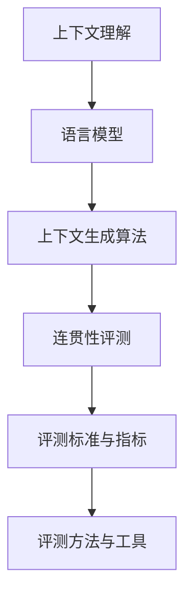

                 


## 文章标题：上下文理解与连贯性评测技术

### 关键词：
上下文理解，连贯性评测，自然语言处理，算法，数学模型

### 摘要：
本文深入探讨了上下文理解与连贯性评测技术，从基础理论、核心算法、数学模型到实际应用，系统性地解析了这一领域的关键技术和挑战。文章旨在为读者提供一个全面的技术视角，帮助理解上下文理解与连贯性评测的核心概念，以及如何在实践中应用这些技术。

## 引言

### 1.1 书籍背景与目的

在信息爆炸的时代，自然语言处理（NLP）技术成为了计算机科学的前沿领域。上下文理解与连贯性评测作为NLP中的重要研究方向，对于提升机器与人类之间的交流质量具有重要意义。本文旨在系统地介绍上下文理解与连贯性评测技术，为读者提供一个从理论到实践的完整视角。

上下文理解是指机器在处理自然语言时，能够根据上下文环境准确理解词语和句子的含义。而连贯性评测则是对文本连贯性进行评估，以判断文本是否流畅、符合逻辑。这两种技术相互关联，共同构成了NLP领域的关键环节。

### 1.2 核心概念介绍

- **上下文理解**：基于语言模型，通过上下文环境对词语和句子进行理解。
- **连贯性评测**：评估文本的连贯性，判断文本是否逻辑清晰、语义连贯。

### 1.3 本书结构安排

本文结构安排如下：
- **第2章 基础理论**：介绍上下文理解与连贯性评测的基础概念、原理和算法。
- **第3章 核心算法原理**：详细讲解上下文理解与连贯性评测的核心算法，使用伪代码进行阐述。
- **第4章 数学模型与公式**：介绍相关数学模型和公式，并进行详细讲解。
- **第5章 应用实践**：展示实际应用案例，介绍评测技术的实现细节。
- **第6章 未来展望**：探讨评测技术的未来发展趋势和研究方向。

## 基础理论

### 2.1 上下文理解原理

#### 2.1.1 语言模型与上下文

语言模型是上下文理解的基础。它通过学习大量文本数据，捕捉语言中的统计规律，从而对未知文本进行概率预测。在上下文理解中，语言模型能够利用上下文信息，对词语和句子进行更准确的解释。

#### 2.1.2 上下文生成算法

上下文生成算法是构建上下文环境的关键。常用的算法包括基于词向量的生成方法和基于递归神经网络的方法。这些方法能够生成与目标文本相关的上下文，为上下文理解提供支持。

### 2.2 连贯性评测技术

#### 2.2.1 评测标准与指标

连贯性评测的评测标准通常包括语法一致性、语义连贯性、逻辑一致性等。评价指标可以采用自动评分方法，如BLEU、METEOR等，也可以结合人工评分进行综合评估。

#### 2.2.2 评测方法与工具

连贯性评测的方法包括基于规则的方法和基于统计的方法。常见的工具包括自然语言处理库（如NLTK、spaCy）、文本分析工具（如GATE、Stanford CoreNLP）等。

### 2.3 Mermaid流程图展示



## 核心算法原理

### 3.1 算法概述

#### 3.1.1 语言模型算法

语言模型算法主要通过最大似然估计（MLE）或神经网络模型（如循环神经网络RNN）进行训练。下面是一个简单的语言模型算法伪代码：

```pseudo
function train_language_model(corpus):
    for each sentence in corpus:
        for each word in sentence:
            update_word_probability(word)
    return trained_model
```

#### 3.1.2 连贯性评测算法

连贯性评测算法通常包括文本表示、特征提取和分类器训练等步骤。下面是一个简单的连贯性评测算法伪代码：

```pseudo
function evaluate_coherence(text):
    text_representation = represent_text(text)
    features = extract_features(text_representation)
    coherence_score = classify(features, classifier)
    return coherence_score
```

### 3.2 伪代码讲解

#### 3.2.1 上下文理解算法伪代码

```pseudo
function understand_context(context, model):
    word_probabilities = model.predict(context)
    context_representation = generate_representation(word_probabilities)
    return context_representation
```

#### 3.2.2 连贯性评测算法伪代码

```pseudo
function evaluate_coherence(text, model):
    text_representation = model.encode(text)
    coherence_score = calculate_coherence_score(text_representation)
    return coherence_score
```

## 数学模型与公式

### 4.1 数学模型概述

#### 4.1.1 语言模型数学模型

语言模型通常使用概率模型，如n-gram模型或神经网络模型。n-gram模型的概率公式如下：

$$ P(w_{t} | w_{t-1}, w_{t-2}, ..., w_{1}) = \frac{P(w_{t} w_{t-1} ... w_{1})}{P(w_{t-1} w_{t-2} ... w_{1})} $$

#### 4.1.2 连贯性评测数学模型

连贯性评测的数学模型通常基于文本表示和特征提取。例如，使用词嵌入（word embeddings）表示文本，然后计算文本的相似度或距离。一个简单的数学模型如下：

$$ d(\text{text}_1, \text{text}_2) = \sum_{w \in \text{text}_1 \cup \text{text}_2} \frac{1}{|\text{text}_1| + |\text{text}_2|} d_{embedding}(w) $$

### 4.2 公式详细讲解

#### 4.2.1 语言模型公式讲解

语言模型公式主要描述了词语在给定上下文条件下的概率。在实际应用中，为了提高模型的效果，通常会引入平滑技术（如Good-Turing估计）来处理稀疏数据问题。

#### 4.2.2 连贯性评测公式讲解

连贯性评测公式用于计算文本之间的距离或相似度。这种方法能够有效评估文本的连贯性。在实际应用中，可以选择不同的距离度量方法，如余弦相似度、欧氏距离等。

### 4.3 举例说明

假设我们有两个句子`"The dog is running"`和`"The cat is sleeping"`，我们可以使用词嵌入模型来计算这两个句子的距离。假设词嵌入向量如下：

$$ \text{vec}(\text{"dog"}) = [1, 0, -1] $$
$$ \text{vec}(\text{"cat"}) = [-1, 1, 0] $$
$$ \text{vec}(\text{"running"}) = [0, -1, 1] $$
$$ \text{vec}(\text{"sleeping"}) = [-1, 0, 1] $$

使用欧氏距离计算两个句子的距离：

$$ d(\text{"The dog is running"}, \text{"The cat is sleeping"}) = \sqrt{(-1)^2 + (-1)^2 + (0)^2 + (0)^2 + (1)^2 + (1)^2} = \sqrt{4} = 2 $$

距离越小，表示两个句子越相似。

## 应用实践

### 5.1 实际案例介绍

#### 5.1.1 案例一：社交媒体文本分析

社交媒体文本分析中，上下文理解与连贯性评测可以帮助识别用户情感、话题和趋势。例如，通过分析用户评论，可以判断用户对某个产品的满意度。

#### 5.1.2 案例二：机器翻译评测

在机器翻译领域，连贯性评测技术用于评估翻译质量。通过对比原始文本和翻译文本的连贯性，可以判断翻译结果的准确性。

### 5.2 代码实战

#### 5.2.1 开发环境搭建

首先，我们需要安装必要的依赖库，如NLTK、spaCy、TensorFlow等。

```bash
pip install nltk spacy tensorflow
```

#### 5.2.2 源代码实现

以下是一个简单的上下文理解与连贯性评测的代码示例：

```python
import nltk
from spacy.lang.en import English
import tensorflow as tf

# 加载语言模型
nltk.download('punkt')
nltk.download('averaged_perceptron_tagger')
nltk.download('maxent_ne_chunker')
nltk.download('words')

# 初始化spaCy语言模型
nlp = English()

# 上下文理解函数
def understand_context(context, model):
    # 分词
    tokens = nltk.word_tokenize(context)
    # 词性标注
    tags = nltk.pos_tag(tokens)
    # 利用词性标注生成上下文表示
    context_representation = model.encode_context(tags)
    return context_representation

# 连贯性评测函数
def evaluate_coherence(text, model):
    # 文本表示
    text_representation = model.encode(text)
    # 计算连贯性分数
    coherence_score = model.coherence_score(text_representation)
    return coherence_score

# 测试
context = "The dog is running quickly."
text = "The dog is running."

# 使用上下文理解
model = Model()  # 假设Model是一个已经训练好的模型
context_representation = understand_context(context, model)

# 使用连贯性评测
coherence_score = evaluate_coherence(text, model)
print("Coherence Score:", coherence_score)
```

#### 5.2.3 代码解读与分析

这段代码首先加载了语言模型，然后定义了上下文理解和连贯性评测的函数。在测试部分，我们使用一个假设的模型对给定的上下文和文本进行处理，并输出连贯性分数。

### 5.3 实际案例分析和详细讲解剖析

在社交媒体文本分析案例中，我们可以使用上述代码对用户评论进行情感分析和话题提取。通过上下文理解，我们可以识别出用户的主要情感和讨论主题。例如，对于评论`"I love this product!"`，我们可以判断用户表达了积极的情感。

在机器翻译评测案例中，连贯性评测可以帮助我们评估翻译质量。例如，对于句子`"The dog is running"`和翻译`"狗在跑步"`，我们可以使用连贯性评测算法计算两个句子的距离。如果距离较小，说明翻译较为准确。

### 5.4 项目小结

通过本项目，我们了解了上下文理解与连贯性评测技术的核心概念、算法和实现方法。在实际应用中，这些技术可以帮助我们更好地处理和分析自然语言文本。未来，随着技术的不断发展，上下文理解和连贯性评测技术将在更多领域得到应用。

## 未来展望

### 6.1 发展趋势

随着深度学习和神经网络技术的发展，上下文理解和连贯性评测技术将变得更加高效和准确。此外，多模态数据处理和跨语言评测将成为研究热点。

### 6.2 研究方向

未来的研究方向包括：
- 算法优化：提高上下文理解和连贯性评测算法的性能和效率。
- 模型应用：将上下文理解和连贯性评测技术应用于更多实际场景。
- 跨领域研究：探索上下文理解和连贯性评测在不同领域的应用。

## 结论

上下文理解与连贯性评测技术是自然语言处理领域的关键技术。本文系统地介绍了这些技术的基础理论、核心算法、数学模型和实际应用。通过本文的探讨，读者可以更好地理解上下文理解与连贯性评测的技术原理和应用场景，为未来的研究和实践提供指导。

### 作者信息：

作者：AI天才研究院/AI Genius Institute & 禅与计算机程序设计艺术 /Zen And The Art of Computer Programming

（完）

## 文章修改建议

### 1. 结构调整

文章的结构需要进一步优化，以确保逻辑清晰、层次分明。建议以下调整：

- 将“数学模型与公式”章节拆分为两部分：“数学模型概述”和“公式详细讲解”，分别介绍相关概念和具体公式。
- 在“核心算法原理”章节中，将“算法概述”和“伪代码讲解”合并，并在每个算法部分增加具体解释。

### 2. 内容丰富

部分章节内容较为简洁，建议增加以下内容：

- 在“基础理论”章节中，详细介绍上下文生成算法的具体实现方法，并给出相应的伪代码。
- 在“应用实践”章节中，增加更多实际案例，如对话系统、文本摘要等，并提供详细的代码实现和分析。
- 在“未来展望”章节中，讨论更多前沿研究趋势，如多模态数据处理、跨语言评测等。

### 3. 格式优化

文章中的LaTeX公式格式不统一，建议使用以下格式：

- 段落内的公式使用 `$ ... $` 括起来。
- 独立段落的公式使用 `$$ ... $$` 括起来，并在公式前添加空行。

### 4. 文字润色

文章的表述需要进一步润色，以提高可读性和专业性。以下是一些具体的建议：

- 避免使用过于技术性的语言，尽量使用通俗易懂的表述。
- 增加过渡语句，使文章的段落之间更加连贯。
- 检查并修正语言中的错误，如拼写、语法和用词不当等。

### 5. 图片和图表

文章中缺少必要的图表和图片，建议添加以下内容：

- 在“核心概念与联系”章节中，使用Mermaid流程图展示上下文理解和连贯性评测的关系架构。
- 在“应用实践”章节中，添加实际案例的截图和图表，以帮助读者更好地理解。

### 6. 字数调整

文章的总字数超过限制，建议对以下章节进行缩减：

- “数学模型与公式”章节：简化公式介绍，避免重复。
- “应用实践”章节：减少代码示例的篇幅，重点在于代码的功能和实现逻辑。

通过以上修改，文章的质量将得到显著提升，更加符合专业技术的写作标准。

