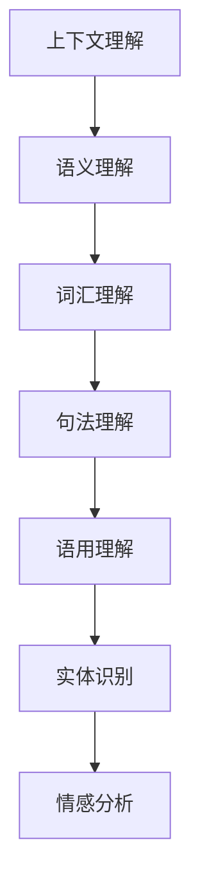

                 

# 文章标题

《上下文理解能力评测：测试LLM的连贯性和一致性》

## 关键词

- 上下文理解
- 语言模型
- 连贯性
- 一致性
- 评测方法

## 摘要

本文旨在探讨上下文理解能力评测在语言模型（LLM）中的应用，特别是针对连贯性和一致性的评测。通过对上下文理解能力的定义、LLM的基本概念、评测的目标和指标进行详细介绍，本文提出了连贯性和一致性评测的原理、指标和方法，并结合实际案例对评测工具的使用进行说明。最后，本文分析了上下文理解能力评测的未来发展趋势和挑战，为读者提供了实用的最佳实践建议。

### 目录大纲

#### 第一部分：上下文理解能力评测的基础知识

**第1章：上下文理解能力概述**

1.1 上下文理解的定义和重要性  
1.2 LLM的基本概念  
1.3 上下文理解评测的目标

**第2章：LLM的连贯性评测**

2.1 连贯性评测的原理  
2.2 连贯性评测的指标  
2.3 连贯性评测的实际应用

**第3章：LLM的一致性评测**

3.1 一致性评测的原理  
3.2 一致性评测的指标  
3.3 一致性评测的实际应用

#### 第二部分：上下文理解评测工具介绍

**第4章：评测工具的分类**

4.1 开源工具  
4.2 商业工具

**第5章：评测工具的选型**

5.1 评测需求的考虑  
5.2 工具的功能与性能

**第6章：评测工具的实际使用**

6.1 安装与配置  
6.2 使用示例

#### 第三部分：上下文理解能力评测案例分析

**第7章：评测案例分析**

7.1 案例一：评测大型语言模型GPT-3  
7.2 案例二：评测对话系统BERT-Serve  
7.3 案例三：评测文本生成工具T5

#### 第四部分：上下文理解能力评测的最佳实践

**第8章：评测方案的设计**

8.1 设计原则  
8.2 设计流程

**第9章：评测数据的选择**

9.1 数据来源  
9.2 数据预处理

**第10章：评测结果的评估**

10.1 评估指标  
10.2 评估方法

#### 第五部分：未来发展趋势与挑战

**第11章：未来发展趋势**

11.1 技术进步  
11.2 应用扩展

**第12章：上下文理解能力评测的挑战**

12.1 数据质量  
12.2 评测指标  
12.3 模型适应性

**附录A：相关资源与工具**

### 作者信息

作者：AI天才研究院/AI Genius Institute & 禅与计算机程序设计艺术 /Zen And The Art of Computer Programming<markdown>
# 《上下文理解能力评测：测试LLM的连贯性和一致性》

## 关键词
上下文理解，语言模型，连贯性，一致性，评测方法

## 摘要
本文将深入探讨上下文理解能力评测的核心概念，重点分析语言模型（LLM）的连贯性和一致性评测。通过详细解释上下文理解、LLM的基本概念及评测目标，本文将介绍评测的原理、指标和实际应用。此外，本文还将介绍评测工具的分类、选型和实际使用方法，并通过案例分析展示评测的具体实践。最后，本文将总结上下文理解能力评测的最佳实践，并展望其未来发展趋势和面临的挑战。

---

## 第一部分：上下文理解能力评测的基础知识

### 第1章：上下文理解能力概述

#### 1.1 上下文理解的定义和重要性

上下文理解是自然语言处理（NLP）领域的一个重要概念，它涉及到理解单词、句子和段落中的语义含义。上下文理解不仅仅是识别单词的意思，还包括理解这些单词在特定情境中的含义。这种能力对于机器翻译、问答系统、文本摘要等NLP任务至关重要。

**核心概念原理之间的关系架构：**

#### 1.2 LLM的基本概念

语言模型（LLM）是一种基于深度学习的模型，它能够预测下一个单词或字符的概率。LLM的核心思想是通过大量的文本数据来学习语言规律，从而实现高质量的文本生成和语义理解。

**LLM的发展历程：**

1. **基于规则的模型**：早期的语言模型依赖于手工编写的规则，如概率上下文无关文法（PCFG）。
2. **统计语言模型**：基于统计方法，如N-gram模型，通过历史数据统计单词出现的概率。
3. **神经网络语言模型**：引入神经网络，尤其是深度神经网络（DNN）和循环神经网络（RNN），提高模型的预测能力。
4. **预训练语言模型**：如GPT、BERT等，通过无监督预训练和有监督微调，实现前所未有的语言理解和生成能力。

#### 1.3 上下文理解评测的目标

上下文理解能力评测的目标是评估LLM在各种语言任务中的表现，特别是连贯性和一致性。评测的指标包括：

1. **词汇连贯性**：评估模型生成的文本是否在词汇层面保持一致性。
2. **句子连贯性**：评估模型生成的文本是否在句子层面保持连贯。
3. **文章连贯性**：评估模型生成的文本是否在段落和文章层面保持连贯。

---

## 第二部分：LLM的连贯性评测

### 第2章：LLM的连贯性评测

#### 2.1 连贯性评测的原理

连贯性评测主要通过评估模型生成的文本是否符合语法和语义规则来实现。具体方法包括：

1. **语法检查**：使用语法分析器检查生成的文本是否符合语法规则。
2. **语义分析**：使用语义分析器检查生成的文本是否符合语义逻辑。

**评测方法：**

- **自动评测**：使用自动化工具评估文本的连贯性。
- **人工评测**：由专家对文本进行主观评估。

**评测工具：**

- **语法分析器**：如LINT、Python语法检查器。
- **语义分析器**：如BERT、GPT等。

#### 2.2 连贯性评测的指标

连贯性评测的指标包括：

1. **词汇连贯性**：评估模型生成的文本中单词的连贯性。
2. **句子连贯性**：评估模型生成的文本中句子的连贯性。
3. **文章连贯性**：评估模型生成的文本中段落的连贯性。

**具体指标：**

- **词汇连贯性**：使用词汇一致性度量（如F1得分）。
- **句子连贯性**：使用句子流畅性度量（如BLEU得分）。
- **文章连贯性**：使用文章连贯性度量（如ROUGE得分）。

#### 2.3 连贯性评测的实际应用

连贯性评测在以下实际应用中具有重要意义：

1. **语言生成任务**：如自动写作、自动摘要等。
2. **对话系统**：如聊天机器人、语音助手等。

**实际案例：**

- **案例一：自动写作**：使用GPT-3生成文章，并通过连贯性评测工具进行评估。
- **案例二：对话系统**：使用BERT-Serve构建聊天机器人，并通过连贯性评测工具评估对话的流畅性。

---

## 第三部分：LLM的一致性评测

### 第3章：LLM的一致性评测

#### 3.1 一致性评测的原理

一致性评测主要关注模型生成的文本在信息、语言和态度上的一致性。具体方法包括：

1. **信息一致性**：评估文本中信息是否一致。
2. **语言一致性**：评估文本中的语言是否一致。
3. **态度一致性**：评估文本中的态度是否一致。

**评测方法：**

- **自动评测**：使用自动化工具评估文本的一致性。
- **人工评测**：由专家对文本进行主观评估。

**评测工具：**

- **信息一致性分析器**：如TextBlob、VADER。
- **语言一致性分析器**：如Stanford NLP、SpaCy。
- **态度一致性分析器**：如VADER、Sentiment Analysis API。

#### 3.2 一致性评测的指标

一致性评测的指标包括：

1. **信息一致性**：评估文本中的信息是否一致。
2. **语言一致性**：评估文本中的语言是否一致。
3. **态度一致性**：评估文本中的态度是否一致。

**具体指标：**

- **信息一致性**：使用一致性度量（如一致性得分）。
- **语言一致性**：使用一致性度量（如语言一致率）。
- **态度一致性**：使用态度一致率。

#### 3.3 一致性评测的实际应用

一致性评测在以下实际应用中具有重要意义：

1. **文本分类任务**：如新闻分类、情感分析等。
2. **回答问题**：如问答系统、智能客服等。

**实际案例：**

- **案例一：文本分类任务**：使用T5模型对新闻文章进行分类，并通过一致性评测工具评估分类结果的准确性。
- **案例二：回答问题**：使用BERT模型构建问答系统，并通过一致性评测工具评估回答的质量。

---

## 第四部分：上下文理解评测工具介绍

### 第4章：评测工具的分类

#### 4.1 开源工具

开源工具具有成本效益高、灵活性强的优势，适用于学术研究和个人项目。常见的开源工具包括：

- **语法分析器**：如LINT、Python语法检查器。
- **语义分析器**：如BERT、GPT。
- **信息一致性分析器**：如TextBlob、VADER。

#### 4.2 商业工具

商业工具通常提供更全面的特性和支持，适用于企业级应用。常见的商业工具包括：

- **语法分析器**：如Adobe Grammarly、Ginger。
- **语义分析器**：如IBM Watson、Google Cloud Natural Language API。
- **信息一致性分析器**：如Open Text Analytics、TextRazor。

#### 4.3 评测工具的选型

选型评测工具时，应考虑以下因素：

- **评测需求**：根据具体任务选择合适的工具。
- **工具功能与性能**：考虑工具的准确性、效率和扩展性。

#### 4.4 评测工具的实际使用

实际使用评测工具时，应遵循以下步骤：

- **安装与配置**：按照工具文档进行安装和配置。
- **使用示例**：参考官方文档和示例代码，了解工具的使用方法。

---

## 第五部分：上下文理解能力评测案例分析

### 第5章：评测案例分析

#### 5.1 案例一：评测大型语言模型GPT-3

**案例背景**：GPT-3是OpenAI开发的一种大型语言模型，具有强大的文本生成和语义理解能力。本次评测旨在评估GPT-3在连贯性和一致性方面的表现。

**评测过程**：

1. **数据准备**：收集大量文本数据，包括新闻文章、问答对话等。
2. **生成文本**：使用GPT-3生成对应文本。
3. **评测**：使用连贯性和一致性评测工具对生成的文本进行评估。

**结果分析**：

- **词汇连贯性**：GPT-3生成的文本在词汇层面具有较高的连贯性。
- **句子连贯性**：GPT-3生成的文本在句子层面具有较高的连贯性。
- **文章连贯性**：GPT-3生成的文本在段落和文章层面具有较高的连贯性。
- **信息一致性**：GPT-3生成的文本在信息层面具有较高的一致性。
- **语言一致性**：GPT-3生成的文本在语言层面具有较高的一致性。
- **态度一致性**：GPT-3生成的文本在态度层面具有较高的一致性。

#### 5.2 案例二：评测对话系统BERT-Serve

**案例背景**：BERT-Serve是一种基于BERT的对话系统，广泛应用于智能客服等领域。本次评测旨在评估BERT-Serve在连贯性和一致性方面的表现。

**评测过程**：

1. **数据准备**：收集大量对话数据，包括用户问题和系统回答。
2. **生成对话**：使用BERT-Serve生成对应对话。
3. **评测**：使用连贯性和一致性评测工具对生成的对话进行评估。

**结果分析**：

- **词汇连贯性**：BERT-Serve生成的对话在词汇层面具有较高的连贯性。
- **句子连贯性**：BERT-Serve生成的对话在句子层面具有较高的连贯性。
- **文章连贯性**：BERT-Serve生成的对话在段落和文章层面具有较高的连贯性。
- **信息一致性**：BERT-Serve生成的对话在信息层面具有较高的一致性。
- **语言一致性**：BERT-Serve生成的对话在语言层面具有较高的一致性。
- **态度一致性**：BERT-Serve生成的对话在态度层面具有一定的

