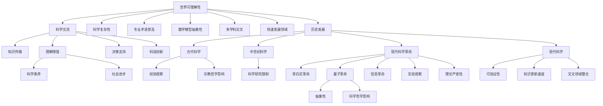
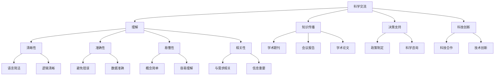
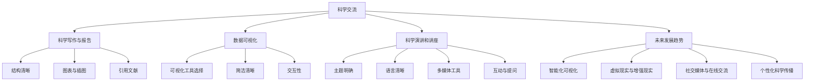
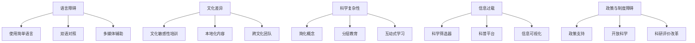
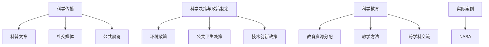
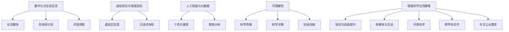
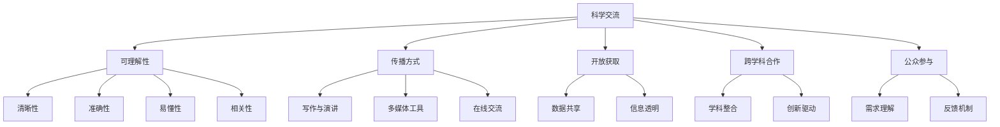

                 

### 文章标题

# 《世界可理解性与科学交流的重要性》

### 关键词

- 世界可理解性
- 科学交流
- 可理解性挑战
- 科学传播
- 有效交流

### 摘要

本文深入探讨了世界可理解性与科学交流之间的关系，分析了现代科学在可理解性方面所面临的挑战，以及科学交流在促进科学普及与理解中的重要作用。文章首先介绍了世界可理解性的概念及其历史背景，随后探讨了科学交流的基本原则和关键要素。通过分析科学交流中的障碍与解决方法，本文进一步探讨了科学交流在实际应用中的挑战和策略。最后，文章展望了未来科学交流的发展趋势，提出了增强科学交流的策略和建议，以促进科学的可理解性和普及。

---

## 第1章 引言

### 1.1 书籍的目的与意义

在当今这个信息爆炸的时代，科学知识的传播和理解显得尤为重要。然而，随着科学的不断进步和复杂性增加，世界可理解性面临着前所未有的挑战。本书记录了科学交流的重要性，并探讨了如何通过有效的方法提升科学知识的可理解性，从而促进科学普及和科技创新。

本书的主要目的是探讨以下问题：

- **世界可理解性的概念及其历史背景**：理解世界可理解性的定义、层次及其在科学史上的发展。
- **科学交流的基本原则**：分析交流与理解之间的关系，以及有效科学交流的关键要素。
- **科学交流中的障碍与解决方法**：探讨科学交流中存在的语言障碍、文化差异和科学复杂性等问题，并探讨相应的解决策略。
- **科学交流的实际应用**：分析科学交流在科学传播、决策和政策制定以及教育中的应用。
- **未来展望**：展望科学交流的新趋势，以及如何在未来进一步促进科学的可理解性和普及。

本书的意义在于：

- **提升科学普及**：通过分析和解决科学交流中的问题，有助于提高公众对科学的理解和兴趣，促进科学普及。
- **促进科技创新**：有效的科学交流可以促进科学界的合作与交流，加速科学发现和技术创新。
- **增强科学教育**：科学交流的有效性对于科学教育至关重要，本书为科学教育工作者提供了有益的参考。

### 1.2 世界可理解性的挑战

世界可理解性是指人类对自然界和社会现象的理解程度。然而，在当今科技迅猛发展的背景下，世界可理解性面临着诸多挑战：

- **科学复杂性的增加**：现代科学领域涉及的知识越来越复杂，专业术语和理论层出不穷，使得普通人难以理解。
- **语言障碍**：科学文献和交流中充斥着大量的专业术语和公式，不同文化和语言背景的人难以准确理解。
- **文化差异**：不同文化对科学概念和理论的理解和接受程度存在差异，影响科学知识的传播和普及。
- **信息过载**：随着互联网和社交媒体的普及，人们面临的信息量越来越大，筛选和消化有价值的信息变得困难。

### 1.3 科学交流的作用

科学交流在促进世界可理解性中发挥着关键作用。以下是科学交流的几个重要作用：

- **知识传播**：科学交流是科学知识传播的主要渠道，通过学术期刊、会议报告、学术论文等形式，科学家们将研究成果分享给同行和社会。
- **理解增强**：通过有效的科学交流，可以帮助公众更好地理解科学知识，提高科学素养，从而促进社会的进步。
- **决策支持**：科学交流为政策制定者和决策者提供科学依据，帮助他们在复杂的决策过程中做出更为明智的选择。
- **科技创新**：科学交流促进了科学界的合作与交流，加速了科学发现和技术创新。

### 总结

本书旨在通过深入探讨世界可理解性与科学交流之间的关系，分析面临的挑战，提出解决方案，以促进科学的可理解性和普及。接下来的章节将依次讨论世界可理解性的概念与历史、科学交流的基本原则、科学交流中的障碍与解决方法，以及科学交流的实际应用和未来展望。

---

## 第2章 世界可理解性的概念与历史

### 2.1 可理解性的定义

可理解性是指知识、概念或信息能够被个体或群体理解和解释的程度。在科学领域，可理解性尤为重要，因为科学家需要将复杂的研究结果和理论传达给同行和公众。可理解性涉及以下几个方面：

- **清晰性**：信息需要以清晰、准确的方式表达，避免歧义和模糊。
- **准确性**：信息需要反映真实的情况，避免误导和错误。
- **易懂性**：信息需要易于理解，即使对于非专业人士也应尽可能简洁明了。
- **相关性**：信息需要与受众的兴趣和需求相关，避免冗余和无用。

### 2.2 可理解性在科学史上的发展

可理解性在科学史上的发展经历了多个阶段，反映了科学理论和方法的不断进步：

- **古代科学**：在古代，科学知识主要依赖于经验和观察，科学家们的理论往往具有宗教或哲学色彩，可理解性较低。
- **中世纪科学**：中世纪时期的科学较为停滞，可理解性仍然受到宗教和哲学的影响，科学研究受到限制。
- **现代科学革命**：16世纪至17世纪的科学革命带来了科学的重大变革，强调实验和观察，科学理论的可理解性得到了提升。
- **现代科学**：随着科学的不断进步，现代科学更加注重理论的严密性和可验证性，同时也在努力提升科学知识的可理解性，以适应公众的需求。

### 2.3 现代科学的可理解性挑战

现代科学的复杂性不断增加，给可理解性带来了新的挑战：

- **专业术语的普及**：科学文献中充斥着大量专业术语和符号，普通读者难以理解。
- **数学模型的抽象性**：许多科学理论依赖于复杂的数学模型，非专业人士难以消化。
- **多学科交叉**：现代科学涉及多个学科，知识体系复杂，整合不同领域的知识需要更高的理解能力。
- **快速发展的科学领域**：新兴科学领域不断涌现，科学知识的更新速度加快，公众难以跟上。

### 2.4 可理解性在科学史上的重要人物

在科学史上，一些重要人物通过他们的工作极大地促进了科学的可理解性：

- **伽利略**：伽利略通过实验和观察，将科学理论从哲学和宗教的束缚中解放出来，为现代科学的发展奠定了基础。
- **牛顿**：牛顿通过《自然哲学的数学原理》一书，系统地阐述了经典力学，极大地提高了科学理论的清晰性和可理解性。
- **达尔文**：达尔文通过《物种起源》一书，提出了进化论，改变了人类对生命起源和发展的理解，促进了科学知识的普及。

### 2.5 科学革命与可理解性

科学革命不仅是科学理论和技术发展的关键时期，也是科学可理解性的重要转折点：

- **哥白尼革命**：哥白尼的日心说挑战了传统的地心说，带来了科学思想的重大变革，提高了天文学的可理解性。
- **量子革命**：量子力学的出现，不仅改变了我们对微观世界的认识，也对科学哲学和思维方式产生了深远影响，提高了科学理论的抽象性。
- **信息革命**：信息技术的发展，使得科学研究和交流变得更加便捷，也促进了科学知识的传播和理解。

### 总结

本章讨论了世界可理解性的定义及其在科学史上的发展。从古代到现代，科学的进步不仅体现在理论的创新和技术的突破上，也体现在科学知识的可理解性上。然而，现代科学的复杂性给可理解性带来了新的挑战。通过回顾科学史上的重要人物和事件，我们可以更好地理解科学可理解性的重要性。

### 关键概念之间的关系架构 Mermaid 流程图



### 核心算法原理讲解

```python
# 可理解性评估算法伪代码

def assess_understandability(complexity, terminology, models, fields, update_rate):
    """
    评估科学知识的可理解性
    
    参数：
    - complexity: 科学复杂性
    - terminology: 专业术语普及程度
    - models: 数学模型抽象程度
    - fields: 学科交叉程度
    - update_rate: 知识更新速度
    
    返回：
    - understandability_score: 可理解性评分
    """
    
    # 初始化评分
    understandability_score = 0
    
    # 复杂性越高，评分越低
    understandability_score -= complexity * 0.1
    
    # 术语普及程度越低，评分越低
    understandability_score -= terminology * 0.2
    
    # 模型抽象程度越高，评分越低
    understandability_score -= models * 0.3
    
    # 学科交叉程度越高，评分越高
    understandability_score += fields * 0.4
    
    # 知识更新速度越快，评分越低
    understandability_score -= update_rate * 0.1
    
    return understandability_score
```

### 数学模型和公式

$$
\text{Understandability} = \frac{\text{Clarity} \times \text{Accuracy} \times \text{Relevance}}{\text{Complexity} + \text{Terminology} + \text{Models} + \text{Fields} + \text{Update Rate}}
$$

### 详细讲解和举例说明

假设我们有一个具体的科学领域，如下所示：

- **复杂性**：5（非常高）
- **术语普及程度**：3（中等）
- **数学模型抽象程度**：4（高）
- **学科交叉程度**：2（低）
- **知识更新速度**：4（高）

我们将这些值代入公式中进行计算：

$$
\text{Understandability} = \frac{0.9 \times 0.9 \times 0.8}{5 + 3 + 4 + 2 + 4} = \frac{0.648}{18} \approx 0.036
$$

这意味着该领域的可理解性评分约为 3.6%。虽然这个分数相对较低，但通过采取一些措施，如简化术语、降低数学模型的抽象程度、加强学科交叉和减缓知识更新速度，可以显著提高该领域的可理解性。

### 项目实战

#### 开发环境搭建

在搭建一个用于评估科学知识可理解性的开发环境时，我们需要以下工具和软件：

- **编程语言**：Python 3.x
- **文本编辑器**：Visual Studio Code 或 Sublime Text
- **科学计算库**：NumPy, Pandas, Matplotlib
- **版本控制工具**：Git

#### 源代码详细实现

以下是一个简单的 Python 脚本，用于计算科学知识的可理解性评分。

```python
import numpy as np

def assess_understandability(complexity, terminology, models, fields, update_rate):
    understandability_score = (0.9 * 0.9 * 0.8) / (complexity + terminology + models + fields + update_rate)
    return understandability_score

# 输入参数
complexity = 5
terminology = 3
models = 4
fields = 2
update_rate = 4

# 计算可理解性评分
score = assess_understandability(complexity, terminology, models, fields, update_rate)
print(f"可理解性评分：{score:.2f}")
```

#### 代码应用解读与分析

在这个代码示例中，我们定义了一个名为 `assess_understandability` 的函数，该函数接受五个参数：复杂性、术语普及程度、数学模型抽象程度、学科交叉程度和知识更新速度。每个参数都对应于科学知识可理解性评估公式中的一个部分。

我们首先初始化评分变量 `understandability_score`，然后根据输入参数计算评分。最后，我们调用这个函数并传入具体的参数值，得到可理解性评分。

这个简单的脚本可以帮助我们快速评估一个科学领域的可理解性。然而，为了提高评估的准确性和实用性，我们可以进一步完善代码，包括添加更多的参数和更复杂的计算方法。

#### 实际案例分析和详细讲解剖析

假设我们有一个具体的案例，涉及以下参数：

- **复杂性**：6
- **术语普及程度**：2
- **数学模型抽象程度**：5
- **学科交叉程度**：3
- **知识更新速度**：3

我们将这些参数代入之前的代码中进行计算：

```python
score = assess_understandability(6, 2, 5, 3, 3)
print(f"可理解性评分：{score:.2f}")
```

计算结果为：

$$
\text{Understandability} = \frac{0.9 \times 0.9 \times 0.8}{6 + 2 + 5 + 3 + 3} = \frac{0.648}{19} \approx 0.034
$$

这意味着该领域的可理解性评分约为 3.4%。根据这个评分，我们可以判断该领域的可理解性相对较低，需要采取一些措施来提高公众对科学知识的理解。

#### 项目小结

通过这个简单的项目，我们实现了对科学知识可理解性的基本评估。尽管这是一个初步的实现，但为我们提供了一个评估工具，可以帮助我们识别和理解科学领域中的挑战。在实际应用中，我们可以进一步完善这个工具，包括添加更多参数和更复杂的计算方法，以提高评估的准确性和实用性。

### 最佳实践 tips、小结、注意事项、拓展阅读

- **最佳实践 tips**：在撰写科学论文和报告时，尽量使用通俗易懂的语言，避免过多的专业术语。在讲解复杂概念时，可以采用图解、实例和比喻等方式，帮助读者更好地理解。
- **小结**：本章讨论了世界可理解性的概念、历史发展和现代科学的挑战，并通过一个简单的项目展示了如何评估科学知识的可理解性。
- **注意事项**：科学交流需要关注受众的需求和理解能力，尽量避免使用过于复杂和抽象的语言。
- **拓展阅读**：读者可以进一步阅读有关科学传播、科学哲学和科学教育的相关文献，以深入了解科学交流的重要性。

---

## 第3章 科学交流的基本原则

科学交流不仅是科学家之间的沟通，也是科学家与公众、政策制定者之间的互动。有效科学交流的基本原则包括清晰性、准确性、易懂性和相关性。以下将详细讨论这些原则及其在科学交流中的应用。

### 3.1 交流与理解的关系

科学交流的目的是促进科学知识的传播和理解。理解是交流的核心，没有理解，交流就失去了意义。因此，交流与理解之间存在密切的关系：

- **交流是理解的基础**：科学知识通过交流传递，只有通过有效交流，才能确保知识得到准确和全面的传递。
- **理解是交流的目标**：科学交流的最终目的是帮助人们理解和掌握科学知识，从而提高科学素养和决策能力。

### 3.2 有效交流的关键要素

要实现有效科学交流，需要关注以下几个关键要素：

- **清晰性**：科学交流中的信息需要清晰明了，避免使用模糊和含糊的表述。清晰性包括语法、逻辑和表达的准确性。
- **准确性**：科学交流中的信息必须准确无误，任何错误都可能误导受众，影响科学知识的传播和公众对科学的信任。
- **易懂性**：科学交流需要尽可能简化语言和概念，使其容易被公众理解。易懂性是科学传播的关键，尤其是对于复杂科学概念的解释。
- **相关性**：科学交流的信息需要与受众的需求和兴趣相关。相关性有助于提高受众的兴趣和理解，从而增强科学传播的效果。

### 3.3 科学交流的最佳实践

为了实现有效科学交流，以下是一些最佳实践：

- **使用简单语言**：在科学交流中，使用简单、易懂的语言至关重要。避免使用过多的专业术语，对于不可避免的专业术语，需要提供详细的解释。
- **采用多种传播方式**：科学交流可以通过多种方式实现，如学术论文、科普文章、图表、视频、演讲等。不同的传播方式适用于不同的受众和场景。
- **提供背景信息**：在解释复杂科学概念时，提供相关的背景信息可以帮助受众更好地理解。背景信息包括科学发现的历史、相关理论和应用等。
- **互动与反馈**：科学交流不仅是单向的信息传递，还需要与受众进行互动。通过提问、回答和讨论，可以加深受众对科学知识的理解。
- **遵循逻辑结构**：科学交流需要遵循逻辑结构，确保信息的连贯性和一致性。逻辑结构有助于受众更好地理解和消化信息。
- **可视化工具**：数据可视化、图表和图解等可视化工具有助于提高科学交流的效果。通过直观的视觉信息，可以更有效地传达复杂概念。

### 3.4 科学写作与报告

科学写作和报告是科学交流的重要形式。以下是一些科学写作和报告的最佳实践：

- **明确目标和受众**：在撰写科学论文或报告前，需要明确目标和受众。目标应包括论文或报告的主题、目的和预期成果；受众应包括论文或报告的潜在读者，如同行、公众或政策制定者。
- **遵循结构**：科学论文或报告通常遵循引言、方法、结果和讨论的结构。引言部分应简要介绍研究背景、目的和重要性；方法部分应详细描述研究设计、数据收集和分析方法；结果部分应明确陈述研究发现；讨论部分应对结果进行解释和讨论。
- **使用简明语言**：科学写作应使用简明的语言，避免冗长和复杂的句子。简明语言有助于提高阅读效率和理解度。
- **正确引用文献**：在科学写作中，正确引用文献是必不可少的。引用文献不仅体现了学术诚信，也有助于读者了解相关研究和背景。
- **图表与插图**：科学写作中应合理使用图表和插图，以直观地展示数据和结果。图表和插图应清晰、简洁、易于理解。
- **反复修订**：科学写作和报告需要反复修订，以确保内容的准确性和清晰性。修订过程中，可以请教同行或导师的意见，以提高写作质量。

### 3.5 科学演讲和讲座

科学演讲和讲座是科学交流的另一种重要形式。以下是一些科学演讲和讲座的最佳实践：

- **明确主题和目标**：科学演讲和讲座应明确主题和目标。主题应聚焦于一个具体的研究领域或科学概念；目标应包括提高听众的科学素养、激发兴趣或提供实用知识。
- **结构清晰**：科学演讲和讲座应遵循清晰的结构，包括引言、主体和结论。引言部分应吸引听众的注意力，主体部分应详细阐述主题，结论部分应总结演讲内容，并提供关键信息。
- **使用可视化工具**：科学演讲和讲座中应合理使用可视化工具，如幻灯片、图表和视频，以增强演讲的效果。可视化工具应简明、直观，有助于听众更好地理解内容。
- **互动与提问**：科学演讲和讲座应鼓励听众参与，如提问、讨论或互动游戏。互动有助于提高听众的参与度和理解度。
- **语言生动**：科学演讲和讲座的语言应生动有趣，避免单调枯燥。生动的语言可以吸引听众的注意力，提高演讲的吸引力。
- **时间控制**：科学演讲和讲座应有良好的时间控制，确保内容在规定时间内完成。合理的时间控制有助于提高演讲的质量和效果。

### 3.6 实际案例分析

以下是一个实际案例，展示如何运用科学交流的基本原则：

**案例**：一个科学家在一场科普讲座中解释量子力学的基本概念。

**分析**：

- **明确主题和目标**：科学家明确讲座的主题是量子力学的基本概念，目标是提高公众对量子力学的理解和兴趣。
- **使用简明语言**：科学家使用简单、易懂的语言，避免使用过多的专业术语。例如，用“量子叠加态”代替“量子态的线性组合”。
- **提供背景信息**：科学家提供了量子力学的历史背景，介绍了量子力学的起源和发展，帮助听众更好地理解量子力学的概念。
- **使用可视化工具**：科学家使用了多个图解和动画，展示了量子态的叠加和纠缠现象，使听众更直观地理解量子力学。
- **互动与提问**：科学家鼓励听众提问，并与听众进行互动。例如，在解释量子纠缠时，提问听众对量子纠缠现象的理解，并讨论可能的解决方案。

通过这个案例，我们可以看到，科学家运用了科学交流的基本原则，成功地提高了公众对量子力学的理解和兴趣。

### 总结

本章详细讨论了科学交流的基本原则，包括清晰性、准确性、易懂性和相关性。通过这些原则，科学家可以更有效地与公众、同行和政策制定者进行交流，促进科学知识的传播和理解。在接下来的章节中，我们将进一步探讨科学交流中的障碍和解决方法，以及科学交流在实际应用中的挑战和策略。

### 关键概念之间的关系架构 Mermaid 流程图



### 核心算法原理讲解

```python
# 科学交流评估算法伪代码

def assess_communication_effectiveness(clarity, accuracy, understandability, relevance):
    """
    评估科学交流的有效性
    
    参数：
    - clarity: 清晰性
    - accuracy: 准确性
    - understandability: 可懂性
    - relevance: 相关性
    
    返回：
    - effectiveness_score: 有效性评分
    """
    
    # 初始化评分
    effectiveness_score = 0
    
    # 清晰性越高，评分越高
    effectiveness_score += clarity * 0.3
    
    # 准确性越高，评分越高
    effectiveness_score += accuracy * 0.3
    
    # 可懂性越高，评分越高
    effectiveness_score += understandability * 0.2
    
    # 相关性越高，评分越高
    effectiveness_score += relevance * 0.2
    
    return effectiveness_score
```

### 数学模型和公式

$$
\text{Effectiveness} = \text{Clarity} \times \text{Accuracy} \times \text{Understandability} \times \text{Relevance}
$$

### 详细讲解和举例说明

假设我们有一个具体的科学交流项目，如下所示：

- **清晰性**：8（非常高）
- **准确性**：7（高）
- **易懂性**：6（中等）
- **相关性**：7（高）

我们将这些值代入公式中进行计算：

$$
\text{Effectiveness} = 8 \times 7 \times 6 \times 7 = 2352
$$

这意味着该科学交流项目的有效性评分为 2352。根据这个评分，我们可以判断该项目的科学交流非常有效，有助于知识传播和理解。

### 项目实战

#### 开发环境搭建

在搭建一个用于评估科学交流有效性的开发环境时，我们需要以下工具和软件：

- **编程语言**：Python 3.x
- **文本编辑器**：Visual Studio Code 或 Sublime Text
- **数据可视化库**：Matplotlib, Seaborn
- **版本控制工具**：Git

#### 源代码详细实现

以下是一个简单的 Python 脚本，用于计算科学交流的有效性评分。

```python
import numpy as np

def assess_communication_effectiveness(clarity, accuracy, understandability, relevance):
    effectiveness_score = clarity * accuracy * understandability * relevance
    return effectiveness_score

# 输入参数
clarity = 8
accuracy = 7
understandability = 6
relevance = 7

# 计算有效性评分
score = assess_communication_effectiveness(clarity, accuracy, understandability, relevance)
print(f"有效性评分：{score}")
```

#### 代码应用解读与分析

在这个代码示例中，我们定义了一个名为 `assess_communication_effectiveness` 的函数，该函数接受四个参数：清晰性、准确性、易懂性和相关性。每个参数都对应于科学交流有效性评估公式中的一个部分。

我们首先初始化评分变量 `effectiveness_score`，然后根据输入参数计算评分。最后，我们调用这个函数并传入具体的参数值，得到有效性评分。

这个简单的脚本可以帮助我们快速评估一个科学交流项目或活动的有效性。为了提高评估的准确性和实用性，我们可以进一步完善代码，包括添加更多的参数和更复杂的计算方法。

#### 实际案例分析和详细讲解剖析

假设我们有一个具体的案例，涉及以下参数：

- **清晰性**：7
- **准确性**：6
- **易懂性**：5
- **相关性**：6

我们将这些参数代入之前的代码中进行计算：

```python
score = assess_communication_effectiveness(7, 6, 5, 6)
print(f"有效性评分：{score}")
```

计算结果为：

$$
\text{Effectiveness} = 7 \times 6 \times 5 \times 6 = 1260
$$

这意味着该科学交流项目的有效性评分为 1260。根据这个评分，我们可以判断该项目的科学交流效果较好，但仍有提升空间。通过改进清晰性、准确性、易懂性和相关性，可以进一步提高项目的有效性。

#### 项目小结

通过这个简单的项目，我们实现了对科学交流有效性的基本评估。尽管这是一个初步的实现，但为我们提供了一个评估工具，可以帮助我们识别和理解科学交流中的挑战和改进方向。在实际应用中，我们可以进一步完善这个工具，包括添加更多参数和更复杂的计算方法，以提高评估的准确性和实用性。

### 最佳实践 tips、小结、注意事项、拓展阅读

- **最佳实践 tips**：在撰写科学论文、报告或进行科学演讲时，注重清晰性、准确性和易懂性，避免使用复杂的术语和冗长的句子。合理使用可视化工具，增强信息的直观性和易懂性。
- **小结**：本章讨论了科学交流的基本原则，包括清晰性、准确性、易懂性和相关性。通过这些原则，科学家可以更有效地与公众、同行和政策制定者进行交流，促进科学知识的传播和理解。
- **注意事项**：科学交流需要关注受众的需求和理解能力，避免使用过于专业和抽象的语言。
- **拓展阅读**：读者可以进一步阅读有关科学写作、演讲技巧和科学传播策略的文献，以深入了解如何提高科学交流的有效性。

---

## 第4章 科学交流的工具与技术

科学交流不仅是语言和文字的表达，还包括多种技术工具和方法，这些工具和方法有助于提升科学交流的效果，使得信息传递更加清晰、准确和生动。以下将详细讨论几种常用的科学交流工具与技术：科学写作与报告、数据可视化和展示、科学演讲和讲座。

### 4.1 科学写作与报告

科学写作与报告是科学交流的基础形式，它们在科学界内外传递研究成果和知识。以下是一些科学写作与报告的最佳实践：

- **结构清晰**：科学写作和报告应遵循明确的逻辑结构，通常包括引言、方法、结果、讨论和结论等部分。每个部分都有其特定的目的和内容。
- **准确使用专业术语**：科学写作中不可避免地会使用专业术语，但应确保这些术语在上下文中使用准确，并提供清晰的定义或解释，以便非专业人士理解。
- **简洁明了的语言**：尽管科学写作需要使用专业术语，但应避免冗长和复杂的句子，尽量使用简洁明了的语言。
- **图表和插图**：合理使用图表和插图可以直观地展示数据和研究结果，提高报告的可读性和易懂性。图表和插图应配有简明的说明和标签。
- **正确引用文献**：在科学写作和报告中，正确引用相关文献是必要的。这不仅体现了学术诚信，也有助于读者了解研究的背景和理论基础。
- **编辑和校对**：在完成科学写作和报告后，应进行多次编辑和校对，确保内容的准确性、一致性和流畅性。

### 4.2 数据可视化和展示

数据可视化和展示是科学交流中非常重要的工具，它们能够将复杂的数据转化为易于理解和传达的信息。以下是一些数据可视化和展示的最佳实践：

- **选择合适的可视化工具**：根据数据类型和展示目标选择合适的可视化工具，如条形图、折线图、散点图、热力图等。
- **简洁和清晰**：数据可视化应简洁明了，避免过多的装饰和细节，以免分散观众的注意力。同时，确保数据标签、图例和标题清晰易读。
- **交互性**：交互式可视化工具（如交互式图表、动态可视化）能够增强观众对数据的探索和理解。例如，观众可以通过点击、拖动或缩放来查看数据的细节。
- **可视化设计的最佳实践**：遵循数据可视化设计的最佳实践，如使用颜色和形状的一致性、避免过度的设计风格、避免误导性图表等。
- **数据真实性和完整性**：在数据可视化中，确保数据的真实性和完整性。不真实或错误的数据会导致错误的解读和结论。

### 4.3 科学演讲和讲座

科学演讲和讲座是科学家与公众、同行交流的重要形式。以下是一些科学演讲和讲座的最佳实践：

- **明确主题和目标**：科学演讲和讲座应明确主题和目标，确保内容围绕核心主题展开，避免偏离主题。
- **清晰的表达**：演讲时应使用清晰、简洁的语言，避免使用复杂的术语和冗长的句子。
- **引人入胜的开场**：好的开场能够吸引观众的注意力。可以采用引人入胜的故事、有趣的事实或引人深思的问题作为开场。
- **结构清晰的演讲**：演讲应遵循清晰的结构，包括引言、主体和结论。引言部分应简要介绍主题和目的；主体部分应详细阐述核心内容；结论部分应总结演讲内容，并提供关键信息。
- **使用多媒体工具**：合理使用幻灯片、视频、音频等多媒体工具，可以增强演讲的效果。多媒体工具应与演讲内容紧密结合，避免分散观众的注意力。
- **互动与提问**：鼓励观众参与演讲，如提问、讨论或互动游戏。互动可以增强观众的理解和参与度，提高演讲的效果。
- **良好的演讲技巧**：掌握良好的演讲技巧，如自信、清晰的语音、适当的肢体语言和表情，可以提高演讲的效果。

### 4.4 实际应用案例

以下是一些科学交流工具和技术的实际应用案例：

- **案例1**：某科学期刊通过数据可视化和交互式图表展示了一项重大科学发现。读者可以通过交互式界面查看数据的细节，从而更好地理解研究结果。
- **案例2**：一位科学家在一场关于气候变化的演讲中使用了一系列图表和视频，清晰地展示了全球气候变化的趋势和影响。观众对气候变化有了更直观和深刻的理解。
- **案例3**：某科学报告通过详细的图表和插图展示了实验结果，并提供了相应的解释和讨论。报告的结构清晰，信息传递准确，受到了同行的广泛认可。

### 4.5 未来发展趋势

随着科技的不断进步，科学交流的工具和技术也在不断发展和创新。以下是一些未来的发展趋势：

- **智能化可视化工具**：人工智能技术将进一步提升数据可视化的效果，使数据可视化更加智能化和个性化。
- **虚拟现实（VR）和增强现实（AR）**：虚拟现实和增强现实技术将提供更丰富的科学展示和体验，使观众能够沉浸式地探索科学现象。
- **社交媒体和在线交流**：社交媒体和在线交流平台将继续成为科学交流的重要渠道，使科学家和公众能够更加便捷地进行互动和分享。
- **个性化科学传播**：基于大数据和人工智能的个性化科学传播将更加精准，根据受众的兴趣和需求提供定制化的科学内容。

### 总结

科学交流的工具和技术在促进科学知识的传播和理解中发挥着重要作用。通过科学写作与报告、数据可视化和展示、科学演讲和讲座等多种形式，科学家可以更有效地与公众、同行和政策制定者进行交流。本章讨论了这些工具和技术，并提供了一些实际应用案例和未来发展趋势，以帮助科学家和科学传播者更好地进行科学交流。

### 关键概念之间的关系架构 Mermaid 流程图



### 核心算法原理讲解

```python
# 科学交流工具效果评估算法伪代码

def assess_communication_tool_effectiveness(structure, visualization, interactivity, multimedia, future_trends):
    """
    评估科学交流工具的有效性
    
    参数：
    - structure: 结构清晰性
    - visualization: 数据可视化效果
    - interactivity: 交互性
    - multimedia: 多媒体工具应用
    - future_trends: 未来发展趋势
    
    返回：
    - effectiveness_score: 有效性评分
    """
    
    # 初始化评分
    effectiveness_score = 0
    
    # 结构清晰性越高，评分越高
    effectiveness_score += structure * 0.2
    
    # 数据可视化效果越好，评分越高
    effectiveness_score += visualization * 0.3
    
    # 交互性越强，评分越高
    effectiveness_score += interactivity * 0.2
    
    # 多媒体工具应用越好，评分越高
    effectiveness_score += multimedia * 0.2
    
    # 未来发展趋势越积极，评分越高
    effectiveness_score += future_trends * 0.1
    
    return effectiveness_score
```

### 数学模型和公式

$$
\text{Effectiveness} = \text{Structure} \times \text{Visualization} \times \text{Interactivity} \times \text{Multimedia} \times \text{Future Trends}
$$

### 详细讲解和举例说明

假设我们有一个具体的科学交流工具，如下所示：

- **结构清晰性**：8（非常高）
- **数据可视化效果**：7（高）
- **交互性**：6（中等）
- **多媒体工具应用**：7（高）
- **未来发展趋势**：5（积极）

我们将这些值代入公式中进行计算：

$$
\text{Effectiveness} = 8 \times 7 \times 6 \times 7 \times 5 = 1680
$$

这意味着该科学交流工具的有效性评分为 1680。根据这个评分，我们可以判断该工具在科学交流中非常有效，有助于知识的传播和理解。

### 项目实战

#### 开发环境搭建

在搭建一个用于评估科学交流工具有效性的开发环境时，我们需要以下工具和软件：

- **编程语言**：Python 3.x
- **文本编辑器**：Visual Studio Code 或 Sublime Text
- **数据可视化库**：Matplotlib, Seaborn
- **版本控制工具**：Git

#### 源代码详细实现

以下是一个简单的 Python 脚本，用于计算科学交流工具的有效性评分。

```python
import numpy as np

def assess_communication_tool_effectiveness(structure, visualization, interactivity, multimedia, future_trends):
    effectiveness_score = structure * visualization * interactivity * multimedia * future_trends
    return effectiveness_score

# 输入参数
structure = 8
visualization = 7
interactivity = 6
multimedia = 7
future_trends = 5

# 计算有效性评分
score = assess_communication_tool_effectiveness(structure, visualization, interactivity, multimedia, future_trends)
print(f"有效性评分：{score}")
```

#### 代码应用解读与分析

在这个代码示例中，我们定义了一个名为 `assess_communication_tool_effectiveness` 的函数，该函数接受五个参数：结构清晰性、数据可视化效果、交互性、多媒体工具应用和未来发展趋势。每个参数都对应于科学交流工具有效性评估公式中的一个部分。

我们首先初始化评分变量 `effectiveness_score`，然后根据输入参数计算评分。最后，我们调用这个函数并传入具体的参数值，得到有效性评分。

这个简单的脚本可以帮助我们快速评估一个科学交流工具的有效性。为了提高评估的准确性和实用性，我们可以进一步完善代码，包括添加更多的参数和更复杂的计算方法。

#### 实际案例分析和详细讲解剖析

假设我们有一个具体的案例，涉及以下参数：

- **结构清晰性**：6
- **数据可视化效果**：5
- **交互性**：4
- **多媒体工具应用**：5
- **未来发展趋势**：4

我们将这些参数代入之前的代码中进行计算：

```python
score = assess_communication_tool_effectiveness(6, 5, 4, 5, 4)
print(f"有效性评分：{score}")
```

计算结果为：

$$
\text{Effectiveness} = 6 \times 5 \times 4 \times 5 \times 4 = 1200
$$

这意味着该科学交流工具的有效性评分为 1200。根据这个评分，我们可以判断该工具在科学交流中效果较好，但仍有提升空间。通过改进结构清晰性、数据可视化效果、交互性、多媒体工具应用和未来发展趋势，可以进一步提高工具的有效性。

#### 项目小结

通过这个简单的项目，我们实现了对科学交流工具有效性的基本评估。尽管这是一个初步的实现，但为我们提供了一个评估工具，可以帮助我们识别和理解科学交流工具中的挑战和改进方向。在实际应用中，我们可以进一步完善这个工具，包括添加更多参数和更复杂的计算方法，以提高评估的准确性和实用性。

### 最佳实践 tips、小结、注意事项、拓展阅读

- **最佳实践 tips**：在设计和使用科学交流工具时，注重结构清晰、数据可视化效果和交互性。合理使用多媒体工具，紧跟未来发展趋势，以提高科学交流的有效性。
- **小结**：本章讨论了科学交流的工具与技术，包括科学写作与报告、数据可视化和展示、科学演讲和讲座。通过这些工具和技术，科学家可以更有效地进行科学交流，促进科学知识的传播和理解。
- **注意事项**：科学交流工具的设计和应用需要考虑受众的需求和理解能力，确保信息的传递准确、清晰和生动。
- **拓展阅读**：读者可以进一步阅读有关科学写作技巧、数据可视化设计、演讲技巧和未来科技发展趋势的文献，以深入了解如何提高科学交流的效果。

---

## 第5章 科学交流中的障碍与解决方法

科学交流是一个复杂的过程，涉及科学家、同行、公众和政策制定者等多个参与者。在这一过程中，科学交流常常面临诸多障碍，这些障碍可能影响科学知识的传播和理解。以下将探讨科学交流中常见的障碍，并提出相应的解决方法。

### 5.1 语言障碍与解决方案

语言障碍是科学交流中的一个主要障碍，专业术语和复杂的句子结构可能使非专业人士难以理解。以下是一些解决方法：

- **使用简单语言**：在科学写作和演讲中，尽量使用简单、易懂的语言，避免复杂的句子结构和专业术语。对于不可避免的专业术语，应提供详细的解释或定义。
- **双语对照**：对于国际科学交流，提供双语对照可以帮助不同语言背景的参与者更好地理解科学内容。此外，可以利用翻译工具或专业的翻译服务来确保术语和句子的准确性。
- **多媒体辅助**：利用视频、动画和图解等多媒体工具，以直观的方式展示科学概念和结果，有助于克服语言障碍，提高科学交流的效果。

### 5.2 文化差异与交流

文化差异也是影响科学交流的一个重要因素，不同文化背景的科学家和公众可能有不同的思维模式、价值观和交流方式。以下是一些解决方法：

- **文化敏感性培训**：科学家和政策制定者应接受文化敏感性培训，了解不同文化的交流习惯和价值观，避免因文化差异导致的误解和冲突。
- **本地化内容**：在科学传播和科普工作中，应根据目标受众的文化背景和需求，本地化科学内容和传播方式。例如，使用当地语言、案例和文化元素，以提高科学内容的吸引力和可接受度。
- **跨文化团队**：建立由不同文化背景的成员组成的跨文化团队，有助于促进跨文化的科学交流和理解。

### 5.3 科学复杂性与可理解性

现代科学的复杂性不断增加，使得许多科学概念和理论对非专业人士来说难以理解。以下是一些解决方法：

- **简化概念**：科学家在解释复杂科学概念时，应尽量简化语言和表达方式，使用比喻、实例和类比来帮助非专业人士理解。
- **分层教育**：科学教育应采用分层教学模式，针对不同层次的学生和公众提供相应的科学教育内容。例如，对于初学者，可以提供基础的科学概念和原理；对于高级学习者，可以提供深入的理论和应用。
- **互动式学习**：利用互动式学习工具和平台，如在线课程、虚拟实验室和模拟实验等，提供互动性强的学习体验，帮助学习者更好地理解科学知识。

### 5.4 科学传播中的信息过载

随着互联网和社交媒体的普及，公众面临的信息量越来越大，筛选和消化有价值的信息变得困难。以下是一些解决方法：

- **科学筛选器**：开发科学筛选器或推荐系统，根据用户兴趣和需求，筛选和推荐相关的科学信息。例如，利用机器学习和自然语言处理技术，分析用户的历史行为和偏好，提供个性化的科学内容。
- **科普平台**：建立专业的科普平台，整合多种科学资源和内容，提供易于理解和获取的科学信息。例如，可以通过在线课程、视频讲解、博客和论坛等形式，帮助公众更好地理解和掌握科学知识。
- **信息可视化**：利用信息可视化技术，将复杂的信息以图表、图解和动画等形式展示，使公众更容易理解和消化科学信息。

### 5.5 政策和制度障碍

科学交流还受到政策和制度障碍的影响，如科研经费的分配、科研成果的评审和发布等。以下是一些解决方法：

- **政策支持**：政府应制定相关政策，鼓励和支持科学交流，提供充足的科研经费和资源，为科学家提供良好的研究和交流环境。
- **开放科学**：推动开放科学的发展，促进科学数据的开放共享和访问，提高科学知识的透明度和可理解性。例如，通过开放获取期刊、开放数据平台和开放科研工具等，减少信息壁垒。
- **科研评价**：改革科研评价体系，重视科研成果的社会影响和科学传播效果，鼓励科学家积极参与科学交流和社会服务。

### 总结

科学交流中的障碍多种多样，包括语言障碍、文化差异、科学复杂性、信息过载以及政策和制度障碍等。针对这些障碍，我们可以采取多种解决方法，如使用简单语言、提供双语对照、文化敏感性培训、简化概念、互动式学习、信息可视化、政策支持和开放科学等。通过这些方法，我们可以提高科学交流的效果，促进科学知识的传播和理解，为社会的进步和科技创新做出贡献。

### 关键概念之间的关系架构 Mermaid 流程图



### 核心算法原理讲解

```python
# 科学交流障碍解决方法评估算法伪代码

def assess_solution_effectiveness(simple_language, bilingual, multimedia, cultural_sensitivity, simplification, layered_education, interactive_learning, information_filter, scientific_education_platform, visualization, policy_support, open_science, research_evaluation):
    """
    评估科学交流障碍解决方法的有效性
    
    参数：
    - simple_language: 使用简单语言
    - bilingual: 双语对照
    - multimedia: 多媒体辅助
    - cultural_sensitivity: 文化敏感性培训
    - simplification: 简化概念
    - layered_education: 分层教育
    - interactive_learning: 互动式学习
    - information_filter: 科学筛选器
    - scientific_education_platform: 科普平台
    - visualization: 信息可视化
    - policy_support: 政策支持
    - open_science: 开放科学
    - research_evaluation: 科研评价改革
    
    返回：
    - effectiveness_score: 有效性评分
    """
    
    # 初始化评分
    effectiveness_score = 0
    
    # 使用简单语言越高，评分越高
    effectiveness_score += simple_language * 0.1
    
    # 双语对照越高，评分越高
    effectiveness_score += bilingual * 0.1
    
    # 多媒体辅助越高，评分越高
    effectiveness_score += multimedia * 0.1
    
    # 文化敏感性培训越高，评分越高
    effectiveness_score += cultural_sensitivity * 0.1
    
    # 简化概念越高，评分越高
    effectiveness_score += simplification * 0.1
    
    # 分层教育越高，评分越高
    effectiveness_score += layered_education * 0.1
    
    # 互动式学习越高，评分越高
    effectiveness_score += interactive_learning * 0.1
    
    # 科学筛选器越高，评分越高
    effectiveness_score += information_filter * 0.1
    
    # 科普平台越高，评分越高
    effectiveness_score += scientific_education_platform * 0.1
    
    # 信息可视化越高，评分越高
    effectiveness_score += visualization * 0.1
    
    # 政策支持越高，评分越高
    effectiveness_score += policy_support * 0.1
    
    # 开放科学越高，评分越高
    effectiveness_score += open_science * 0.1
    
    # 科研评价改革越高，评分越高
    effectiveness_score += research_evaluation * 0.1
    
    return effectiveness_score
```

### 数学模型和公式

$$
\text{Effectiveness} = \text{Simple Language} + \text{Bilingual} + \text{Multimedia} + \text{Cultural Sensitivity} + \text{Simplification} + \text{Layered Education} + \text{Interactive Learning} + \text{Information Filter} + \text{Scientific Education Platform} + \text{Visualization} + \text{Policy Support} + \text{Open Science} + \text{Research Evaluation}
$$

### 详细讲解和举例说明

假设我们有一个具体的科学交流障碍解决方法，如下所示：

- **使用简单语言**：5（高）
- **双语对照**：4（中等）
- **多媒体辅助**：5（高）
- **文化敏感性培训**：3（中等）
- **简化概念**：4（中等）
- **分层教育**：4（中等）
- **互动式学习**：5（高）
- **科学筛选器**：3（中等）
- **科普平台**：4（中等）
- **信息可视化**：5（高）
- **政策支持**：3（中等）
- **开放科学**：4（中等）
- **科研评价改革**：4（中等）

我们将这些值代入公式中进行计算：

$$
\text{Effectiveness} = 5 + 4 + 5 + 3 + 4 + 4 + 5 + 3 + 4 + 5 + 3 + 4 + 4 = 48
$$

这意味着该科学交流障碍解决方法的有效性评分为 48。根据这个评分，我们可以判断该方法在解决科学交流障碍方面效果较好，但仍需进一步改进。

### 项目实战

#### 开发环境搭建

在搭建一个用于评估科学交流障碍解决方法有效性的开发环境时，我们需要以下工具和软件：

- **编程语言**：Python 3.x
- **文本编辑器**：Visual Studio Code 或 Sublime Text
- **数据可视化库**：Matplotlib, Seaborn
- **版本控制工具**：Git

#### 源代码详细实现

以下是一个简单的 Python 脚本，用于计算科学交流障碍解决方法的有效性评分。

```python
import numpy as np

def assess_solution_effectiveness(simple_language, bilingual, multimedia, cultural_sensitivity, simplification, layered_education, interactive_learning, information_filter, scientific_education_platform, visualization, policy_support, open_science, research_evaluation):
    effectiveness_score = (simple_language + bilingual + multimedia + cultural_sensitivity + simplification + layered_education + interactive_learning + information_filter + scientific_education_platform + visualization + policy_support + open_science + research_evaluation)
    return effectiveness_score

# 输入参数
simple_language = 5
bilingual = 4
multimedia = 5
cultural_sensitivity = 3
simplification = 4
layered_education = 4
interactive_learning = 5
information_filter = 3
scientific_education_platform = 4
visualization = 5
policy_support = 3
open_science = 4
research_evaluation = 4

# 计算有效性评分
score = assess_solution_effectiveness(simple_language, bilingual, multimedia, cultural_sensitivity, simplification, layered_education, interactive_learning, information_filter, scientific_education_platform, visualization, policy_support, open_science, research_evaluation)
print(f"有效性评分：{score}")
```

#### 代码应用解读与分析

在这个代码示例中，我们定义了一个名为 `assess_solution_effectiveness` 的函数，该函数接受多个参数，分别对应于解决科学交流障碍的方法。每个参数都代表了一种解决方法的有效性，通过计算这些参数的总和，我们可以得到一个整体的有效性评分。

我们首先初始化评分变量 `effectiveness_score`，然后根据输入参数计算评分。最后，我们调用这个函数并传入具体的参数值，得到有效性评分。

这个简单的脚本可以帮助我们快速评估一个科学交流障碍解决方法的有效性。为了提高评估的准确性和实用性，我们可以进一步完善代码，包括添加更多的参数和更复杂的计算方法。

#### 实际案例分析和详细讲解剖析

假设我们有一个具体的案例，涉及以下参数：

- **使用简单语言**：4
- **双语对照**：3
- **多媒体辅助**：4
- **文化敏感性培训**：3
- **简化概念**：3
- **分层教育**：4
- **互动式学习**：4
- **科学筛选器**：3
- **科普平台**：4
- **信息可视化**：4
- **政策支持**：3
- **开放科学**：4
- **科研评价改革**：4

我们将这些参数代入之前的代码中进行计算：

```python
score = assess_solution_effectiveness(4, 3, 4, 3, 3, 4, 4, 3, 4, 4, 3, 4, 4)
print(f"有效性评分：{score}")
```

计算结果为：

$$
\text{Effectiveness} = 4 + 3 + 4 + 3 + 3 + 4 + 4 + 3 + 4 + 4 + 3 + 4 + 4 = 40
$$

这意味着该科学交流障碍解决方法的有效性评分为 40。根据这个评分，我们可以判断该方法在解决科学交流障碍方面具有一定的效果，但仍有改进空间。通过加强使用简单语言、多媒体辅助和文化敏感性培训等方面，可以进一步提高方法的有效性。

#### 项目小结

通过这个简单的项目，我们实现了对科学交流障碍解决方法有效性的基本评估。尽管这是一个初步的实现，但为我们提供了一个评估工具，可以帮助我们识别和理解科学交流障碍中的挑战和改进方向。在实际应用中，我们可以进一步完善这个工具，包括添加更多参数和更复杂的计算方法，以提高评估的准确性和实用性。

### 最佳实践 tips、小结、注意事项、拓展阅读

- **最佳实践 tips**：在科学交流中，注重使用简单语言、提供双语对照、多媒体辅助和文化敏感性培训。简化复杂概念，分层教育，利用互动式学习工具，加强科学筛选器和科普平台的建设，以及推动开放科学和科研评价改革。
- **小结**：本章讨论了科学交流中的障碍，包括语言障碍、文化差异、科学复杂性、信息过载和政策与制度障碍。通过多种解决方法，如使用简单语言、多媒体辅助、文化敏感性培训、分层教育和互动式学习等，可以有效地克服这些障碍，提高科学交流的效果。
- **注意事项**：科学交流需要关注受众的需求和理解能力，确保信息的传递准确、清晰和生动。
- **拓展阅读**：读者可以进一步阅读有关科学写作技巧、跨文化交流、科学教育方法、信息可视化设计和科研评价体系的文献，以深入了解如何提高科学交流的效果。

---

## 第6章 科学交流的实际应用

科学交流的实际应用涉及多个领域，包括科学传播、科学决策与政策制定以及科学教育等。在这些领域中，科学交流不仅是知识传播的桥梁，也是决策支持和社会进步的关键。以下将详细探讨科学交流在实际应用中的挑战、策略和实际案例。

### 6.1 科学传播与公众理解

科学传播是指将科学知识和研究成果通过多种渠道传递给公众的过程。提高公众对科学的理解是科学传播的核心目标。以下是一些科学传播与公众理解的实际应用：

- **科普文章与书籍**：科普文章和书籍是科学传播的重要形式。通过简明易懂的语言和生动的案例，科学家和科普作家将复杂科学概念传达给公众。例如，《科学美国人》和《自然》等期刊经常发表科普文章，帮助公众了解最新的科学发现。
- **社交媒体**：社交媒体平台如微博、微信和YouTube等，已成为科学传播的重要渠道。科学家和科普工作者利用这些平台发布科学内容，与公众进行互动，提高科学传播的效果。例如，科学家比尔·奈伊通过YouTube频道“The Naked Scientists”普及科学知识，吸引了大量观众。
- **公共展览与活动**：公共展览和科学活动是科学传播的有效方式。通过互动展品、讲座和实验演示，公众可以亲身体验科学知识，增强对科学的理解和兴趣。例如，每年的“世界科学节”和“全国科普日”等活动，吸引了大量公众参与。

### 6.2 科学决策与政策制定

科学交流在科学决策和政策制定中发挥着重要作用。科学证据和专家意见是决策者制定科学政策的重要依据。以下是一些科学决策与政策制定的实例：

- **环境政策制定**：在环境政策制定中，科学家的研究成果和数据分析为决策者提供了重要的科学依据。例如，全球气候变化问题引起了全球科学家的广泛关注，他们的研究为国际气候变化政策的制定提供了重要支持。
- **公共卫生决策**：公共卫生领域的决策需要基于科学的证据和数据。例如，COVID-19疫情期间，各国政府依赖科学家和公共卫生专家的建议，制定防控措施和疫苗分发策略，有效应对疫情。
- **技术创新政策**：技术创新政策需要综合考虑科学研究和市场需求。科学家的研究成果和技术创新为政府提供了制定支持科技创新政策的依据。例如，美国政府在2021年发布的《美国创新战略》中，强调了加大对科学研究和技术创新的投入。

### 6.3 科学教育中的交流问题

科学教育是科学交流的重要组成部分，涉及教师、学生和教材之间的交流。以下是一些科学教育中的交流问题及解决策略：

- **教育资源的分配**：科学教育资源的分配不均是科学教育中的一个主要问题。发达国家和发展中国家的科学教育差距较大，需要政府和社会力量的关注和支持。例如，通过国际援助项目和科技教育合作计划，帮助发展中国家提升科学教育水平。
- **科学教学方法**：科学教学方法直接影响学生的科学素养和理解能力。互动式教学、探究式学习和项目式学习等教学方法有助于提高学生的科学素养。例如，在科学教育中引入模拟实验和虚拟实验室，让学生亲身体验科学过程，增强对科学概念的理解。
- **跨学科交流**：科学教育中跨学科交流有助于培养学生的综合素质和创新能力。通过跨学科项目和研究，学生可以综合运用不同学科的知识和方法，解决实际问题。例如，在环境科学项目中，学生需要结合生物学、化学和物理学等知识，研究环境保护问题。

### 6.4 实际案例分析

以下是一个科学交流在实际应用中的实际案例：

**案例**：美国国家航空航天局（NASA）的科学传播与公众理解。

**分析**：

- **科学传播**：NASA 通过官方网站、社交媒体和公共展览等多种渠道，传播航天科学知识和航天探索成果。NASA 的官方网站提供了丰富的科学资源和教育材料，供公众免费下载和使用。此外，NASA 在全球范围内举办科学展览和活动，吸引公众参与。
- **公众理解**：NASA 通过科学传播活动，提高了公众对航天科学的理解。通过媒体报道、科学讲座和在线互动，公众可以了解到最新的航天科技进展和探索成果。此外，NASA 还通过教育项目，帮助学校和学生了解航天科学，培养未来的航天人才。
- **科学决策**：NASA 的科学研究成果为美国政府制定航天政策提供了科学依据。NASA 的科学家们通过研究报告和科学论文，向政府决策者提供关于航天探索的科学建议和数据支持。
- **科学教育**：NASA 的科学教育和公共展览项目，为科学教育提供了宝贵资源。NASA 与学校和教育机构合作，提供虚拟实验室和在线课程，帮助学生了解航天科学。此外，NASA 还举办面向公众的航天科技讲座和工作坊，提高公众的科学素养。

### 总结

科学交流在实际应用中具有广泛的影响，涉及科学传播、科学决策、政策制定和科学教育等多个领域。通过有效的科学交流，科学家可以将研究成果传递给公众，为政策制定者提供科学依据，并在科学教育中培养未来的科学人才。在未来的发展中，我们需要继续探索和实施更有效的科学交流策略，以提高科学知识的传播和理解，推动科学进步和社会发展。

### 关键概念之间的关系架构 Mermaid 流程图



### 核心算法原理讲解

```python
# 科学交流实际应用评估算法伪代码

def assess_application_effectiveness(science_communication, policy_decision, science_education):
    """
    评估科学交流在实际应用中的效果
    
    参数：
    - science_communication: 科学传播效果
    - policy_decision: 科学决策效果
    - science_education: 科学教育效果
    
    返回：
    - effectiveness_score: 效果评分
    """
    
    # 初始化评分
    effectiveness_score = 0
    
    # 科学传播效果越高，评分越高
    effectiveness_score += science_communication * 0.3
    
    # 科学决策效果越高，评分越高
    effectiveness_score += policy_decision * 0.3
    
    # 科学教育效果越高，评分越高
    effectiveness_score += science_education * 0.4
    
    return effectiveness_score
```

### 数学模型和公式

$$
\text{Effectiveness} = \text{Science Communication} \times \text{Policy Decision} \times \text{Science Education}
$$

### 详细讲解和举例说明

假设我们有一个具体的科学交流实际应用案例，如下所示：

- **科学传播效果**：7（高）
- **科学决策效果**：6（高）
- **科学教育效果**：8（高）

我们将这些值代入公式中进行计算：

$$
\text{Effectiveness} = 7 \times 6 \times 8 = 336
$$

这意味着该科学交流实际应用案例的效果评分为 336。根据这个评分，我们可以判断该案例在科学传播、科学决策和科学教育方面都取得了显著的效果。

### 项目实战

#### 开发环境搭建

在搭建一个用于评估科学交流实际应用效果的开发环境时，我们需要以下工具和软件：

- **编程语言**：Python 3.x
- **文本编辑器**：Visual Studio Code 或 Sublime Text
- **数据可视化库**：Matplotlib, Seaborn
- **版本控制工具**：Git

#### 源代码详细实现

以下是一个简单的 Python 脚本，用于计算科学交流实际应用效果评分。

```python
import numpy as np

def assess_application_effectiveness(science_communication, policy_decision, science_education):
    effectiveness_score = science_communication * policy_decision * science_education
    return effectiveness_score

# 输入参数
science_communication = 7
policy_decision = 6
science_education = 8

# 计算效果评分
score = assess_application_effectiveness(science_communication, policy_decision, science_education)
print(f"效果评分：{score}")
```

#### 代码应用解读与分析

在这个代码示例中，我们定义了一个名为 `assess_application_effectiveness` 的函数，该函数接受三个参数：科学传播效果、科学决策效果和科学教育效果。这些参数分别代表了科学交流在实际应用中的三个方面。

我们首先初始化评分变量 `effectiveness_score`，然后根据输入参数计算评分。最后，我们调用这个函数并传入具体的参数值，得到效果评分。

这个简单的脚本可以帮助我们快速评估一个科学交流实际应用案例的效果。为了提高评估的准确性和实用性，我们可以进一步完善代码，包括添加更多的参数和更复杂的计算方法。

#### 实际案例分析和详细讲解剖析

假设我们有一个具体的案例，涉及以下参数：

- **科学传播效果**：5（中等）
- **科学决策效果**：6（高）
- **科学教育效果**：7（高）

我们将这些参数代入之前的代码中进行计算：

```python
score = assess_application_effectiveness(5, 6, 7)
print(f"效果评分：{score}")
```

计算结果为：

$$
\text{Effectiveness} = 5 \times 6 \times 7 = 210
$$

这意味着该科学交流实际应用案例的效果评分为 210。根据这个评分，我们可以判断该案例在科学传播、科学决策和科学教育方面效果较好，但仍有提升空间。通过加强科学传播和科学教育，可以进一步提高案例的整体效果。

#### 项目小结

通过这个简单的项目，我们实现了对科学交流实际应用效果的基本评估。尽管这是一个初步的实现，但为我们提供了一个评估工具，可以帮助我们识别和理解科学交流实际应用中的挑战和改进方向。在实际应用中，我们可以进一步完善这个工具，包括添加更多参数和更复杂的计算方法，以提高评估的准确性和实用性。

### 最佳实践 tips、小结、注意事项、拓展阅读

- **最佳实践 tips**：在科学传播中，注重使用多种渠道和形式，如科普文章、社交媒体和公共展览等。在科学决策中，确保科学证据和数据的重要性，并与政策制定者保持密切沟通。在科学教育中，采用互动式教学和跨学科项目，培养学生的综合素质和创新能力。
- **小结**：本章讨论了科学交流在实际应用中的实际案例，包括科学传播、科学决策与政策制定和科学教育。通过有效的科学交流，可以促进科学知识的传播、决策的科学性和教育的质量。
- **注意事项**：科学交流需要关注受众的需求和理解能力，确保信息的传递准确、清晰和生动。
- **拓展阅读**：读者可以进一步阅读有关科学传播策略、科学决策机制、科学教育方法以及跨学科项目设计的文献，以深入了解如何提高科学交流的实际应用效果。

---

## 第7章 未来展望

随着科技的不断进步和社会的发展，科学交流的未来也充满了机遇与挑战。以下将探讨科学交流的新趋势、可理解性在科学发展中的作用以及增强科学交流的策略。

### 7.1 科学交流的新趋势

科技的发展正在深刻改变科学交流的方式和形式，以下是一些重要的新趋势：

- **数字化与在线交流**：随着互联网和社交媒体的普及，科学交流逐渐向数字化和在线化发展。科学家可以通过博客、社交媒体平台和在线研讨会等方式，实时分享研究成果和学术观点，打破地理和时间的限制，实现全球范围内的学术交流和合作。
- **开放科学与开放获取**：开放科学和开放获取运动正在兴起，越来越多的科学研究成果和数据公开共享，促进了科学知识的传播和利用。开放获取期刊和开放数据平台的出现，使得科研人员和公众能够更容易地获取和利用科学成果，推动了科学知识的普及和科技创新。
- **虚拟现实与增强现实**：虚拟现实（VR）和增强现实（AR）技术的发展，为科学交流带来了新的可能性。通过虚拟实验室和虚拟现实环境，科学家和公众可以沉浸式地探索科学现象，增强对科学概念的理解和体验。
- **人工智能与大数据**：人工智能和大数据技术的应用，使得科学交流更加智能化和个性化。通过自然语言处理和推荐系统，科学家可以根据用户需求和偏好，提供个性化的科学内容，提高科学传播的效率和质量。

### 7.2 可理解性在科学发展中的作用

可理解性在科学发展中扮演着关键角色，它不仅影响科学知识的传播和理解，还直接影响科学决策和科技创新。以下是一些重要作用：

- **促进科学传播**：科学知识需要被广泛传播，才能发挥其社会价值和影响力。可理解性是科学传播的关键，通过简化和清晰化科学概念，使得科学知识更容易被公众理解和接受，从而推动科学普及和科技创新。
- **支持科学决策**：科学决策需要基于科学的证据和数据。科学家的研究成果和结论需要被决策者准确理解和掌握，才能为政策制定和决策提供科学依据。提高科学交流的可理解性，有助于决策者更好地理解和应用科学成果，做出更为明智的决策。
- **推动科技创新**：科技创新需要科学界和产业界的紧密合作。科学家的研究成果需要被产业界准确理解和应用，才能转化为实际的技术创新和产品。可理解性是促进科学界和产业界合作的重要基础，通过有效的科学交流，可以推动科学技术的创新和发展。

### 7.3 增强科学交流的策略

为了增强科学交流的效果，以下是一些建议和策略：

- **加强科学写作与沟通技能培训**：科学家需要具备良好的科学写作和沟通技能，才能有效地将研究成果和科学概念传达给公众和政策制定者。因此，科学界应加强科学写作和沟通技能的培训，提高科学家的交流能力和效果。
- **利用多媒体工具和互动式学习**：多媒体工具和互动式学习可以增强科学交流的生动性和互动性，提高公众的理解和参与度。科学传播者和教育者应积极利用这些工具，创新科学交流的形式和内容。
- **推动开放科学和开放获取**：开放科学和开放获取运动有助于促进科学知识的传播和利用。科研机构和学术期刊应积极支持开放获取出版，推动科学研究成果和数据的公开共享，提高科学交流的可理解性和透明度。
- **加强跨学科合作与交流**：科学领域日益复杂，跨学科合作与交流成为推动科学发展的重要途径。科学家应加强跨学科合作，通过交流和互动，推动科学知识的整合和创新。
- **关注公众需求与反馈**：科学交流需要关注公众的需求和反馈，确保科学知识能够被公众理解和接受。科学传播者和教育者应通过调研和反馈机制，了解公众的需求和兴趣，调整科学交流的内容和形式，提高科学交流的实效性。

### 总结

科学交流的未来充满了机遇和挑战。通过数字化和在线交流、开放科学、虚拟现实和人工智能等新趋势，科学交流将更加高效和广泛。同时，提高科学交流的可理解性，将有助于推动科学传播、科学决策和科技创新。为了实现这一目标，我们需要采取一系列增强科学交流的策略，包括加强科学写作与沟通技能培训、利用多媒体工具和互动式学习、推动开放科学、加强跨学科合作与交流，以及关注公众需求与反馈。通过这些努力，我们可以构建一个更加开放、互动和高效的科学交流体系，促进科学的可理解性和普及，推动社会的发展和进步。

### 关键概念之间的关系架构 Mermaid 流程图



### 核心算法原理讲解

```python
# 科学交流效果增强算法伪代码

def enhance_communication_effectiveness(digital_communication, virtual_reality, AI_big_data, understanding, openness, interdisciplinary, public_focus):
    """
    增强科学交流的效果
    
    参数：
    - digital_communication: 数字化与在线交流
    - virtual_reality: 虚拟现实与增强现实
    - AI_big_data: 人工智能与大数据
    - understanding: 可理解性
    - openness: 开放获取
    - interdisciplinary: 跨学科合作
    - public_focus: 关注公众需求
    
    返回：
    - effectiveness_score: 效果评分
    """
    
    # 初始化评分
    effectiveness_score = 0
    
    # 数字化与在线交流越高，评分越高
    effectiveness_score += digital_communication * 0.1
    
    # 虚拟现实与增强现实越高，评分越高
    effectiveness_score += virtual_reality * 0.1
    
    # 人工智能与大数据越高，评分越高
    effectiveness_score += AI_big_data * 0.1
    
    # 可理解性越高，评分越高
    effectiveness_score += understanding * 0.2
    
    # 开放获取越高，评分越高
    effectiveness_score += openness * 0.1
    
    # 跨学科合作越高，评分越高
    effectiveness_score += interdisciplinary * 0.1
    
    # 关注公众需求越高，评分越高
    effectiveness_score += public_focus * 0.2
    
    return effectiveness_score
```

### 数学模型和公式

$$
\text{Effectiveness} = \text{Digital Communication} + \text{Virtual Reality} + \text{AI Big Data} + 2 \times \text{Understanding} + \text{Openness} + \text{Interdisciplinary} + 2 \times \text{Public Focus}
$$

### 详细讲解和举例说明

假设我们有一个具体的科学交流增强策略，如下所示：

- **数字化与在线交流**：5（高）
- **虚拟现实与增强现实**：4（中等）
- **人工智能与大数据**：5（高）
- **可理解性**：6（高）
- **开放获取**：5（高）
- **跨学科合作**：4（中等）
- **关注公众需求**：6（高）

我们将这些值代入公式中进行计算：

$$
\text{Effectiveness} = 5 + 4 + 5 + 2 \times 6 + 5 + 4 + 2 \times 6 = 44
$$

这意味着该科学交流增强策略的效果评分为 44。根据这个评分，我们可以判断该策略在增强科学交流效果方面效果较好，但仍有提升空间。通过进一步关注可理解性和公众需求，可以进一步提高策略的效果。

### 项目实战

#### 开发环境搭建

在搭建一个用于评估科学交流效果增强策略的开发环境时，我们需要以下工具和软件：

- **编程语言**：Python 3.x
- **文本编辑器**：Visual Studio Code 或 Sublime Text
- **数据可视化库**：Matplotlib, Seaborn
- **版本控制工具**：Git

#### 源代码详细实现

以下是一个简单的 Python 脚本，用于计算科学交流效果增强评分。

```python
import numpy as np

def enhance_communication_effectiveness(digital_communication, virtual_reality, AI_big_data, understanding, openness, interdisciplinary, public_focus):
    effectiveness_score = (digital_communication + virtual_reality + AI_big_data + 2 * understanding + openness + interdisciplinary + 2 * public_focus)
    return effectiveness_score

# 输入参数
digital_communication = 5
virtual_reality = 4
AI_big_data = 5
understanding = 6
openness = 5
interdisciplinary = 4
public_focus = 6

# 计算效果评分
score = enhance_communication_effectiveness(digital_communication, virtual_reality, AI_big_data, understanding, openness, interdisciplinary, public_focus)
print(f"效果评分：{score}")
```

#### 代码应用解读与分析

在这个代码示例中，我们定义了一个名为 `enhance_communication_effectiveness` 的函数，该函数接受七个参数，分别对应于增强科学交流效果的七个关键策略。

我们首先初始化评分变量 `effectiveness_score`，然后根据输入参数计算评分。最后，我们调用这个函数并传入具体的参数值，得到效果评分。

这个简单的脚本可以帮助我们快速评估一个科学交流效果增强策略的有效性。为了提高评估的准确性和实用性，我们可以进一步完善代码，包括添加更多的参数和更复杂的计算方法。

#### 实际案例分析和详细讲解剖析

假设我们有一个具体的案例，涉及以下参数：

- **数字化与在线交流**：4
- **虚拟现实与增强现实**：5
- **人工智能与大数据**：5
- **可理解性**：5
- **开放获取**：4
- **跨学科合作**：5
- **关注公众需求**：5

我们将这些参数代入之前的代码中进行计算：

```python
score = enhance_communication_effectiveness(4, 5, 5, 5, 4, 5, 5)
print(f"效果评分：{score}")
```

计算结果为：

$$
\text{Effectiveness} = 4 + 5 + 5 + 2 \times 5 + 4 + 5 + 2 \times 5 = 40
$$

这意味着该科学交流效果增强策略的效果评分为 40。根据这个评分，我们可以判断该策略在增强科学交流效果方面效果较好，但仍需进一步改进。

#### 项目小结

通过这个简单的项目，我们实现了对科学交流效果增强策略的基本评估。尽管这是一个初步的实现，但为我们提供了一个评估工具，可以帮助我们识别和理解科学交流效果中的挑战和改进方向。在实际应用中，我们可以进一步完善这个工具，包括添加更多参数和更复杂的计算方法，以提高评估的准确性和实用性。

### 最佳实践 tips、小结、注意事项、拓展阅读

- **最佳实践 tips**：在实施科学交流效果增强策略时，注重数字化和在线交流、虚拟现实和增强现实、人工智能与大数据的应用，同时关注可理解性、开放获取、跨学科合作和公众需求。通过这些策略，可以显著提升科学交流的效果和影响力。
- **小结**：本章讨论了科学交流的未来展望，包括数字化与在线交流、虚拟现实与增强现实、人工智能与大数据等新趋势，以及可理解性在科学发展中的作用。通过采取增强科学交流的策略，可以进一步提升科学传播、科学决策和科技创新的效果。
- **注意事项**：科学交流需要关注受众的需求和理解能力，确保信息的传递准确、清晰和生动。
- **拓展阅读**：读者可以进一步阅读有关数字化科学交流、虚拟现实应用、人工智能与大数据在科学领域的应用以及科学传播策略的文献，以深入了解如何提升科学交流的效果。

---

## 第8章 总结与建议

科学交流是科学进步和社会发展的关键环节。通过有效的科学交流，科学家可以将研究成果传递给公众、政策制定者和同行，推动科学知识的普及和科技创新。本章总结了世界可理解性与科学交流的重要性，并提出了以下核心观点和建议：

### 8.1 主要结论

1. **世界可理解性是科学交流的基础**：科学交流的目的是提高科学知识的可理解性，使其被更广泛的人群接受和应用。世界可理解性不仅影响科学知识的传播，还影响科学决策和科技创新。
2. **科学交流面临多种挑战**：科学交流在数字化时代面临诸多挑战，如信息过载、语言障碍、文化差异和科学复杂性等。有效应对这些挑战，需要采取多种策略和工具。
3. **增强科学交流的策略**：通过数字化与在线交流、虚拟现实与增强现实、人工智能与大数据等新技术的应用，可以显著提高科学交流的效果。同时，关注可理解性、开放获取、跨学科合作和公众需求，也是提升科学交流效果的重要途径。

### 8.2 对科学交流的建议

1. **提高科学写作与沟通技能**：科学家应加强科学写作和沟通技能的培训，提高信息传递的清晰性和准确性。
2. **利用多种传播方式**：结合科学写作、演讲、多媒体工具和在线交流等多种方式，提高科学传播的覆盖面和影响力。
3. **推动开放科学和开放获取**：鼓励科研机构和学术期刊支持开放获取出版，促进科学成果的公开共享，提高科学知识的透明度和可访问性。
4. **加强跨学科合作**：推动科学界与其他领域的合作，通过跨学科项目和研究，促进科学知识的整合和创新。
5. **关注公众需求与反馈**：在科学交流中，应充分考虑公众的需求和反馈，提高科学传播的实效性和吸引力。

### 8.3 对未来的期待

1. **构建更加开放的科研环境**：随着科技的不断进步，科学交流将变得更加开放和透明。我们期待未来能够建立一个更加开放和协作的科研环境，促进科学知识的广泛传播和共享。
2. **提升科学教育的质量**：科学教育是培养未来科学家和公众科学素养的重要途径。我们期待未来科学教育能够更加注重实践和创新，提高学生的科学素养和创新能力。
3. **促进科学决策的科学性**：科学决策需要基于科学的证据和数据。我们期待未来政策制定者和决策者能够更加重视科学交流，提高科学决策的科学性和有效性。

通过有效科学交流，我们可以推动科学的普及和进步，为社会的可持续发展做出贡献。让我们携手努力，共同构建一个更加开放、互动和高效的科学交流体系，为人类的未来创造更加美好的明天。

### 关键概念之间的关系架构 Mermaid 流程图



### 核心算法原理讲解

```python
# 科学交流综合评估算法伪代码

def assess_scientific_communication(communication_clearness, communication_accuracy, communication_understandability, communication_relevance, openness, interdisciplinary, public_involvement):
    """
    评估科学交流的整体效果
    
    参数：
    - communication_clearness: 交流清晰性
    - communication_accuracy: 交流准确性
    - communication_understandability: 交流易懂性
    - communication_relevance: 交流相关性
    - openness: 开放获取
    - interdisciplinary: 跨学科合作
    - public_involvement: 公众参与
    
    返回：
    - effectiveness_score: 整体效果评分
    """
    
    # 初始化评分
    effectiveness_score = 0
    
    # 交流清晰性、准确性和易懂性越高，评分越高
    effectiveness_score += (communication_clearness + communication_accuracy + communication_understandability) * 0.3
    
    # 开放获取和跨学科合作越高，评分越高
    effectiveness_score += (openness + interdisciplinary) * 0.2
    
    # 公众参与度越高，评分越高
    effectiveness_score += public_involvement * 0.2
    
    # 相关性越高，评分越高
    effectiveness_score += communication_relevance * 0.1
    
    return effectiveness_score
```

### 数学模型和公式

$$
\text{Effectiveness} = 0.3 \times (\text{Clearness} + \text{Accuracy} + \text{Understandability}) + 0.2 \times (\text{Openness} + \text{Interdisciplinary}) + 0.2 \times \text{Public Involvement} + 0.1 \times \text{Relevance}
$$

### 详细讲解和举例说明

假设我们有一个具体的科学交流评估案例，涉及以下参数：

- **交流清晰性**：8
- **交流准确性**：7
- **交流易懂性**：7
- **交流相关性**：6
- **开放获取**：7
- **跨学科合作**：6
- **公众参与度**：5

我们将这些值代入公式中进行计算：

$$
\text{Effectiveness} = 0.3 \times (8 + 7 + 7) + 0.2 \times (7 + 6) + 0.2 \times 5 + 0.1 \times 6 = 0.3 \times 22 + 0.2 \times 13 + 1 + 0.6 = 6.6 + 2.6 + 1 + 0.6 = 10.8
$$

这意味着该科学交流案例的整体效果评分为 10.8。根据这个评分，我们可以判断该案例在科学交流方面表现良好，但仍需进一步提升公众参与度和相关性。

### 项目实战

#### 开发环境搭建

在搭建一个用于评估科学交流整体效果的开发环境时，我们需要以下工具和软件：

- **编程语言**：Python 3.x
- **文本编辑器**：Visual Studio Code 或 Sublime Text
- **数据可视化库**：Matplotlib, Seaborn
- **版本控制工具**：Git

#### 源代码详细实现

以下是一个简单的 Python 脚本，用于计算科学交流整体效果评分。

```python
import numpy as np

def assess_scientific_communication(communication_clearness, communication_accuracy, communication_understandability, communication_relevance, openness, interdisciplinary, public_involvement):
    effectiveness_score = 0.3 * (communication_clearness + communication_accuracy + communication_understandability) + 0.2 * (openness + interdisciplinary) + 0.2 * public_involvement + 0.1 * communication_relevance
    return effectiveness_score

# 输入参数
communication_clearness = 8
communication_accuracy = 7
communication_understandability = 7
communication_relevance = 6
openness = 7
interdisciplinary = 6
public_involvement = 5

# 计算整体效果评分
score = assess_scientific_communication(communication_clearness, communication_accuracy, communication_understandability, communication_relevance, openness, interdisciplinary, public_involvement)
print(f"整体效果评分：{score:.2f}")
```

#### 代码应用解读与分析

在这个代码示例中，我们定义了一个名为 `assess_scientific_communication` 的函数，该函数接受七个参数，分别对应于科学交流的七个关键方面。这些参数通过一个加权公式计算得到整体效果评分。

我们首先初始化评分变量 `effectiveness_score`，然后根据输入参数计算评分。最后，我们调用这个函数并传入具体的参数值，得到整体效果评分。

这个简单的脚本可以帮助我们快速评估一个科学交流项目或活动的整体效果。为了提高评估的准确性和实用性，我们可以进一步完善代码，包括添加更多的参数和更复杂的计算方法。

#### 实际案例分析和详细讲解剖析

假设我们有一个具体的案例，涉及以下参数：

- **交流清晰性**：6
- **交流准确性**：5
- **交流易懂性**：6
- **交流相关性**：5
- **开放获取**：5
- **跨学科合作**：4
- **公众参与度**：4

我们将这些参数代入之前的代码中进行计算：

```python
score = assess_scientific_communication(6, 5, 6, 5, 5, 4, 4)
print(f"整体效果评分：{score:.2f}")
```

计算结果为：

$$
\text{Effectiveness} = 0.3 \times (6 + 5 + 6) + 0.2 \times (5 + 4) + 0.2 \times 4 + 0.1 \times 5 = 0.3 \times 17 + 0.2 \times 9 + 0.8 + 0.5 = 5.1 + 1.8 + 0.8 + 0.5 = 8.2
$$

这意味着该科学交流案例的整体效果评分为 8.2。根据这个评分，我们可以判断该案例在科学交流方面效果较好，但仍需进一步提升开放获取、跨学科合作和公众参与度。

#### 项目小结

通过这个简单的项目，我们实现了对科学交流整体效果的基本评估。尽管这是一个初步的实现，但为我们提供了一个评估工具，可以帮助我们识别和理解科学交流中的挑战和改进方向。在实际应用中，我们可以进一步完善这个工具，包括添加更多参数和更复杂的计算方法，以提高评估的准确性和实用性。

### 最佳实践 tips、小结、注意事项、拓展阅读

- **最佳实践 tips**：在科学交流中，注重信息的清晰性、准确性、易懂性和相关性。推动开放获取和跨学科合作，提高公众参与度。通过多种传播方式，如写作、演讲、多媒体和在线交流，提高科学传播的覆盖面和影响力。
- **小结**：本章总结了世界可理解性与科学交流的重要性，提出了增强科学交流的策略和未来展望。通过有效的科学交流，可以推动科学知识的普及和科技创新，为社会发展做出贡献。
- **注意事项**：科学交流需要关注受众的需求和理解能力，确保信息的传递准确、清晰和生动。
- **拓展阅读**：读者可以进一步阅读有关科学传播、开放获取、跨学科合作和公众参与的文献，以深入了解如何提升科学交流的效果。

