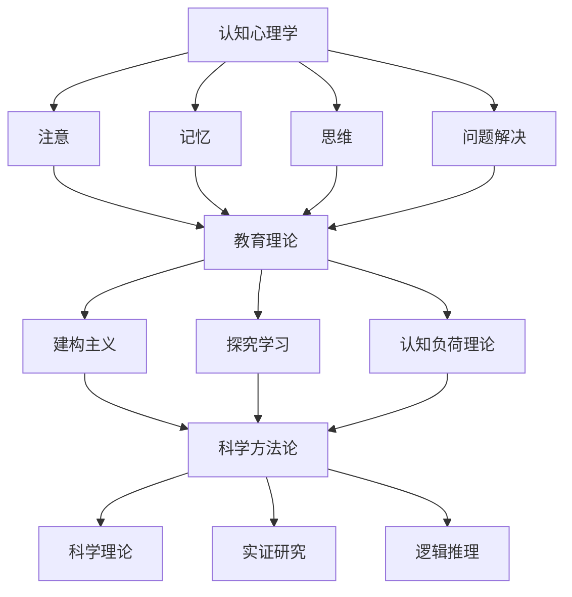

                 

### 引言

在当今这个快速变化的时代，世界正变得越来越复杂。科技的飞速发展，新知识的不断涌现，以及全球化的深入，使得人们面临的信息量前所未有地庞大。这种复杂性和信息过载的现象，对科学教育提出了前所未有的挑战。为了应对这些挑战，科学教育必须进行深刻的改革，以提高学生对世界的理解能力。这种改革的核心在于提升“世界可理解性”，即让学生能够通过科学教育理解复杂的世界，掌握科学思维和方法。

本文将围绕“世界可理解性与科学教育改革”这一主题展开讨论。首先，我们将探讨世界可理解性的背景和重要性，分析当前科学教育中存在的可理解性问题。接着，我们将深入探讨可理解性的核心概念和理论，以及科学教育中的相关理论。在此基础上，本文将介绍可理解性在科学教育中的应用，包括教学方法和策略，以及教学材料与工具。然后，我们将通过具体案例，展示科学教育改革的实践成果。最后，本文将分析科学教育改革的政策背景和未来趋势，并提出相关的建议和展望。

关键词：世界可理解性，科学教育，教育改革，教学方法，教学策略

摘要：本文旨在探讨世界可理解性与科学教育改革之间的关系。通过分析世界可理解性的背景和重要性，以及当前科学教育中存在的可理解性问题，本文提出了提高世界可理解性的科学教育改革策略。通过具体案例的分析和未来趋势的探讨，本文为科学教育改革提供了实践指导和政策建议。

### 世界可理解性的背景和重要性

世界可理解性是指个体对周围世界的认知和理解能力。在科学领域，世界可理解性涉及到学生能否通过科学教育掌握科学知识，理解科学概念，并运用科学方法解决实际问题。随着科技的发展和信息的爆炸，世界变得日益复杂，这使得对世界可理解性的要求也越来越高。

首先，从科技发展的角度来看，科技的进步使得我们生活的世界变得更加复杂。例如，量子物理、人工智能、生物技术等前沿科学领域的进展，不仅带来了新的知识，也带来了新的问题和挑战。这些复杂的问题和挑战需要学生具备更高的理解和认知能力，以便能够适应未来的社会环境。

其次，从信息过载的角度来看，现代社会信息量巨大，学生面临的信息压力越来越大。传统科学教育往往侧重于知识传授，而忽视了学生对知识的理解和运用。这种教育方式导致学生在面对复杂问题时，往往感到无助和困惑。提高世界可理解性，有助于学生更好地应对信息过载的问题，提高学习效率和知识运用能力。

此外，全球化的发展也加剧了世界复杂性的程度。全球化带来了文化的交融和碰撞，不同文化之间的差异和冲突使得世界变得更加复杂。科学教育作为培养未来社会人才的重要途径，必须提高学生的世界可理解性，以应对全球化带来的挑战。

总的来说，世界可理解性在科学教育中具有重要地位。它不仅关系到学生的知识掌握情况，更关系到学生的思维能力和创新能力。因此，科学教育改革必须以提高世界可理解性为核心目标，通过创新教学方法和策略，培养学生的科学素养和综合素质。

### 当前科学教育中的可理解性问题

尽管世界可理解性在科学教育中具有重要意义，但当前的科学教育实践中仍存在许多可理解性问题，这些问题严重制约了学生理解世界的能力。首先，教学方法单一是一个普遍存在的问题。许多学校仍然采用传统的讲授式教学方法，教师以知识传授为主，学生被动接受知识，缺乏主动思考和探究的机会。这种教学方法忽视了学生的主体地位，导致学生对知识的理解停留在表面，难以形成深刻的认知。

其次，教学内容过于理论化也是一个突出问题。科学教育往往侧重于理论知识的传授，而忽视了实践环节。学生虽然能够记住大量的科学概念和原理，但在面对实际问题时却往往无从下手。这种教育方式导致学生对科学知识的运用能力较弱，难以将理论知识转化为实际解决问题的能力。

此外，教育资源的分配不均也是影响世界可理解性的重要因素。一些学校在科学教育方面投入不足，教学设备和实验资源匮乏，导致学生在学习过程中缺乏实践机会，难以通过亲身体验和实验来加深对知识的理解。

另一个问题是学生科学素养的欠缺。科学素养不仅包括科学知识，还包括科学态度、科学方法和科学价值观。当前的科学教育往往过于注重知识的传授，而忽视了科学素养的培养。学生在学习过程中缺乏对科学的兴趣和热情，难以形成科学思维和科学态度。

最后，评价体系的单一化也影响了科学教育的可理解性。当前的评价体系主要侧重于考试成绩，忽视了学生的综合能力和创新能力的培养。这种评价方式导致教师和学生过于关注分数，忽视了知识的实际运用和能力的提升。

总之，当前科学教育中存在的可理解性问题严重影响了对学生世界理解能力的培养。要解决这些问题，科学教育改革必须采取有效措施，改进教学方法，优化教学内容，提升教育资源的分配效率，并加强对学生科学素养的评价和培养。

### 可理解性的核心概念

要深入探讨世界可理解性与科学教育改革的关系，首先需要理解可理解性的核心概念。可理解性涉及多个方面，包括认知心理学、教育理论和科学方法论等。以下是对这些核心概念的定义及其相互关系的详细阐述。

#### 认知心理学角度

从认知心理学的角度来看，可理解性是指个体对信息的处理和解释能力。认知心理学家研究表明，人们倾向于通过已知的信息来理解和解释新信息。这种理解过程涉及到注意、记忆、思维和问题解决等多个认知过程。具体来说：

1. **注意（Attention）**：个体在信息处理过程中，会优先关注某些信息而忽略其他信息。注意力决定了个体对信息的接收和加工。
   
2. **记忆（Memory）**：记忆是信息处理的重要环节，包括短期记忆和长期记忆。短期记忆帮助个体暂时存储和处理信息，而长期记忆则使信息能够持久保存。

3. **思维（Cognition）**：思维是指个体在信息处理过程中进行推理、判断和决策的能力。通过思维，个体能够将零散的信息整合成有意义的整体。

4. **问题解决（Problem Solving）**：问题解决是指个体在面对问题时，运用已有知识和经验寻找解决方案的过程。问题解决能力是可理解性的重要体现。

#### 教育理论角度

从教育理论的角度看，可理解性涉及到教育目标和教学方法。教育的目标是培养个体对世界的理解和认知能力，而教学方法是实现这一目标的重要手段。以下是一些核心的教育理论概念：

1. **建构主义（Constructivism）**：建构主义认为，知识是通过个体与环境的互动而建构的。学生不是被动的知识接受者，而是主动的知识建构者。建构主义强调学生的主体地位和自主性。

2. **探究学习（Inquiry Learning）**：探究学习是指学生在问题情境中通过探究和反思来主动学习知识的过程。这种方法鼓励学生提出问题、假设和验证，从而培养其探究能力和批判性思维。

3. **认知负荷理论（Cognitive Load Theory）**：认知负荷理论指出，学习过程中个体大脑的加工能力是有限的，教师需要设计教学活动，以减少无关信息的干扰，使学生能够集中处理重要信息。

#### 科学方法论角度

在科学方法论中，可理解性涉及到科学理论和科学实践。科学方法论强调通过实证研究和逻辑推理来理解和解释自然现象。以下是一些核心的科学方法论概念：

1. **科学理论（Scientific Theory）**：科学理论是对自然界现象的系统解释。科学理论通过假设、模型和预测来描述和理解自然现象。

2. **实证研究（Empirical Research）**：实证研究是通过观察和实验来收集数据，以验证科学理论。实证研究是科学方法论的重要环节。

3. **逻辑推理（Logical Reasoning）**：逻辑推理是通过逻辑关系来推导结论的过程。在科学研究中，逻辑推理帮助科学家从已知的事实推导出新的结论。

#### 可理解性的相互关系架构

为了更好地理解可理解性的核心概念及其相互关系，我们可以使用Mermaid流程图来展示它们之间的逻辑关系：

通过这个流程图，我们可以清晰地看到认知心理学、教育理论和科学方法论之间的相互关系。认知心理学为教育理论和科学方法论提供了理论基础，而教育理论和科学方法论则通过不同的方法和技术，帮助学生和科学家更好地理解和解释世界。

总的来说，可理解性的核心概念是多维度的，涉及到认知心理学、教育理论和科学方法论等多个方面。理解这些概念及其相互关系，有助于我们更好地开展科学教育改革，提高学生的世界理解能力。

#### 可理解性在科学教育中的应用

可理解性在科学教育中的应用至关重要，它不仅影响了学生的学习效果，还决定了学生能否在现实生活中运用科学知识和方法。以下将详细探讨可理解性在科学教育中的应用，包括教学方法和策略、教学材料与工具，以及评估与反馈机制。

#### 教学方法和策略

1. **探究式学习**

探究式学习是一种以学生为中心的教学方法，鼓励学生主动提出问题、进行实验和反思。这种方法强调学生的参与和自主性，有助于提升学生的理解能力和科学素养。具体策略包括：

- **提出问题**：在课程开始时，教师可以提出具有挑战性和开放性的问题，激发学生的好奇心和探究欲望。
- **设计实验**：教师指导学生设计和进行实验，通过亲身体验和观察，加深对科学概念的理解。
- **反思与讨论**：实验结束后，教师和学生一起进行反思和讨论，总结实验结果和发现。

2. **项目式学习**

项目式学习是一种通过实际项目来驱动学习的教学方法。这种方法将理论知识与实际问题相结合，培养学生的解决实际问题的能力。具体策略包括：

- **项目选题**：选择具有实际意义和社会价值的项目，使学生能够将所学知识应用于实际问题。
- **团队协作**：鼓励学生组成团队，共同完成任务，培养团队合作和沟通能力。
- **项目评估**：通过项目展示和答辩，评估学生的项目成果和表现，提供反馈和改进建议。

3. **翻转课堂**

翻转课堂是一种将传统课堂与在线学习相结合的教学模式。这种方法将知识传授放在课外，课堂时间主要用于学生的互动和讨论。具体策略包括：

- **课前学习**：学生通过在线平台自主学习课程内容，完成相关练习和测验。
- **课堂互动**：教师在课堂上解答学生的疑问，引导学生进行深度讨论和思考。
- **课后巩固**：学生通过课堂讨论和互动，加深对知识的理解，并进行课后练习和复习。

#### 教学材料与工具

1. **互动多媒体资源**

互动多媒体资源如视频、动画和模拟软件，可以生动直观地展示科学概念和实验过程，有助于提高学生的理解能力。具体包括：

- **视频**：通过实验视频、科学讲座和纪录片，帮助学生直观地了解科学现象和理论。
- **动画**：利用动画技术展示复杂的科学过程，如细胞分裂、化学反应等，帮助学生更好地理解。
- **模拟软件**：通过模拟软件，学生可以模拟实验过程，观察变量变化，加深对科学概念的理解。

2. **实验器材与工具**

实验器材和工具是科学教育中的重要组成部分，它们帮助学生通过亲身体验和实验来验证科学理论。具体包括：

- **实验室设备**：配备先进的实验设备，如显微镜、计算机和传感器，使学生能够进行各种科学实验。
- **实验材料**：提供丰富的实验材料，如化学试剂、物理器材和生物样本，以支持学生的探究活动。
- **数字化工具**：利用数字化工具，如虚拟实验室和在线实验平台，提供虚拟实验环境，使学生能够远程进行实验。

#### 评估与反馈机制

1. **过程性评价**

过程性评价注重评估学生的学习过程，而不仅仅是最终成绩。这种方法可以通过观察学生的课堂表现、实验报告和项目展示等，了解学生的学习进展和理解程度。具体策略包括：

- **课堂观察**：教师通过课堂观察，记录学生的参与度、问题解决能力和合作精神。
- **实验报告**：评估学生的实验设计和实验报告，了解其对实验过程和结果的理解。
- **项目展示**：通过项目展示和答辩，评估学生的项目成果和表现，提供反馈和改进建议。

2. **反馈与改进**

有效的反馈机制是提高学生理解能力的重要手段。教师应及时给予学生反馈，指出其优点和不足，并提供改进建议。具体策略包括：

- **即时反馈**：在课堂互动和实验过程中，教师应即时给予学生反馈，鼓励学生进行改正和改进。
- **定期反馈**：定期进行学习评估和反馈，帮助学生总结学习经验，提升理解能力。
- **个性化反馈**：根据学生的个体差异，提供个性化的反馈和建议，帮助学生更好地理解科学概念。

通过以上教学方法和策略、教学材料与工具，以及评估与反馈机制，科学教育可以更好地提高学生的世界可理解性，培养其科学素养和创新能力。

### 科学教育改革的实践案例

为了更好地理解科学教育改革的具体实施效果，下面我们将通过两个具体案例，展示科学教育改革在提升世界可理解性方面的实践成果。

#### 案例一：某中学的科学教育改革实践

**案例背景**：

某中学位于一个科技发达的城市，学校管理层意识到传统的科学教育方法已经无法满足学生对复杂世界的理解需求。为了提升学生的科学素养和世界可理解性，学校决定进行一系列科学教育改革。

**改革措施**：

1. **引入探究式学习**：

学校引入了探究式学习模式，鼓励学生通过提出问题、设计实验和反思来主动学习。例如，在“生态系统”课程中，教师布置了“如何改善校园内的生态系统”的探究项目。学生需要分组讨论、设计实验方案，并实际操作进行数据收集和分析。

2. **开发互动多媒体资源**：

学校投资建设了多媒体教室，配备了先进的投影设备和互动白板。教师利用视频、动画和模拟软件等互动资源，生动地展示科学概念和实验过程。例如，在讲解“细胞分裂”时，教师使用动画演示细胞分裂的过程，使学生能够直观地理解这一复杂的生物现象。

3. **加强实验和实践活动**：

学校增加了实验课程的课时，并为学生提供了丰富的实验器材和资源。学生有机会在实验室进行各种科学实验，如化学实验、生物实验和物理实验。通过亲身体验和实验，学生能够更深入地理解科学原理和概念。

**改革效果评估**：

经过几年的改革，学校对学生的理解能力和科学素养进行了评估。以下是一些改革效果：

- **学生参与度提高**：学生在课堂上的参与度和积极性明显提高，他们更愿意主动提出问题并进行实验。
- **理解能力增强**：学生能够更好地理解科学概念和原理，并能将这些知识应用于实际问题的解决。
- **创新能力提升**：学生在项目式学习中，通过自主设计和实验，展现出了较高的创新能力和解决问题的能力。

**案例分析**：

该中学的科学教育改革成功提升了学生的世界可理解性。通过探究式学习和互动多媒体资源的引入，学生能够主动参与学习过程，提高了对科学知识的理解和运用能力。同时，通过实验和实践活动，学生亲身体验了科学研究的乐趣，进一步激发了他们对科学的兴趣和热情。

#### 案例二：某大学的科学教育创新

**案例背景**：

某大学是一所知名的高等学府，其在科学教育方面一直走在前列。为了进一步提升学生的科学素养和世界可理解性，学校决定进行一系列科学教育创新。

**创新模式**：

1. **跨学科项目**：

学校鼓励学生跨学科学习，通过跨学科项目来提升学生的综合素质。例如，“人工智能与生物技术”项目，学生需要结合计算机科学和生物学的知识，研究人工智能在生物技术中的应用。

2. **开放性实验室**：

学校建立了开放性实验室，学生可以随时进入实验室进行自主实验和研究。开放性实验室为学生提供了丰富的实验资源和指导，使学生能够自由探索科学领域。

3. **虚拟现实教学**：

学校利用虚拟现实（VR）技术，为学生提供沉浸式的学习体验。通过虚拟实验室和模拟实验，学生能够身临其境地体验科学实验过程，加深对科学概念的理解。

**创新内容**：

- **跨学科知识整合**：跨学科项目使学生在不同学科领域进行知识整合，培养了学生的跨学科思维能力和创新能力。
- **自主学习与探索**：开放性实验室和虚拟现实教学使学生能够自主学习，提高了其自主探索和解决问题的能力。
- **实践与理论结合**：通过实践项目和创新教学方法，学生能够将理论知识与实际应用相结合，提高了其科学素养和实际操作能力。

**创新影响**：

- **学生综合素质提升**：跨学科项目和开放性实验室等创新模式，使学生的综合素质得到了全面提升，不仅掌握了科学知识，还具备了较强的自主学习和创新能力。
- **教育质量提高**：通过创新教学方法和技术，学校的科学教育质量得到了显著提高，吸引了更多优秀学生和教师。

**案例分析**：

某大学的科学教育创新成功地将跨学科项目、开放性实验室和虚拟现实技术应用于科学教育中，为学生提供了丰富的学习资源和体验机会。这种创新模式不仅提升了学生的世界可理解性，还培养了学生的创新能力和综合素质，为科学教育改革提供了有益的参考。

通过以上两个案例，我们可以看到，科学教育改革在提升世界可理解性方面取得了显著成果。通过探究式学习、互动多媒体资源、实验和实践活动，学生能够更好地理解科学概念和原理，并将其应用于实际问题的解决。同时，跨学科项目和虚拟现实技术等创新模式，为学生提供了更广阔的学习平台，激发了他们的学习兴趣和创造力。这些实践案例为科学教育改革提供了宝贵的经验和启示，也为未来的科学教育改革提供了新的思路。

### 科学教育改革的政策背景和未来趋势

科学教育改革的背后有着深刻的社会、经济和政策背景。在全球化和科技迅速发展的背景下，科学教育改革不仅仅是教育领域内的需求，更是国家战略的一部分。以下将分析科学教育改革的政策背景、国内外政策的对比，以及未来科学教育的发展趋势。

#### 政策背景

1. **全球科技竞争**

随着全球化的发展，科技竞争日益激烈。各国政府意识到，只有通过强大的科学教育体系，才能培养出具备创新能力和竞争力的人才。因此，提升科学教育质量成为各国政策的重点。例如，美国在《国家教育技术计划》中提出，通过技术手段提升教育质量，培养未来的科技创新人才。

2. **经济转型需求**

在全球经济转型和结构调整的过程中，高技术产业和知识经济成为新的增长点。这要求教育体系能够培养出具备高科技知识和创新能力的人才，以支撑国家的经济转型。例如，德国的“工业4.0”战略中，强调通过科学教育改革，培养具备先进技术和创新能力的工程师和科学家。

3. **社会进步与公民素养**

科学教育不仅是培养专业人才的过程，更是提高公民科学素养和社会进步的重要途径。现代社会对公民的科学素养提出了更高的要求，要求公民具备科学思维、批判性思维和解决问题的能力。例如，欧盟在《科学教育框架计划》中，明确提出要通过科学教育提升公民的科学素养，增强社会的创新能力。

#### 国内外政策对比

1. **美国**

美国是全球科技和教育的领导者，其科学教育政策具有前瞻性和创新性。例如，美国《国家科学教育标准》强调科学教育应注重学生探究能力和科学思维的培养。同时，美国通过《美国振兴与再投资法》，加大对教育技术的投资，推动教育信息化和个性化教育的发展。

2. **德国**

德国在科学教育方面注重实践和技能培养。德国的“双元制”教育模式，将职业培训和理论学习相结合，培养出大量具备实际操作能力和创新能力的专业人才。此外，德国政府通过《科学教育振兴计划》，加大对科学教育基础设施的投入，提升科学教育质量。

3. **中国**

中国在科学教育方面也进行了一系列改革。例如，教育部发布的《义务教育科学课程标准》强调科学教育应注重学生探究能力和科学素养的培养。同时，中国通过《国家中长期教育改革和发展规划纲要》，明确提出要推动科学教育改革，提升教育质量，培养创新型人才。

#### 未来趋势

1. **科技驱动的教育创新**

未来科学教育将更加依赖科技进步，如人工智能、虚拟现实、大数据等新技术。这些技术将改变传统的教育模式，提供更加个性化、互动化和实践化的学习体验。例如，通过虚拟实验室和在线教育平台，学生可以在虚拟环境中进行科学实验，提高其动手能力和创新思维。

2. **跨学科融合**

随着科学领域的不断细分，跨学科融合将成为科学教育的重要趋势。未来的科学教育将更加注重培养学生的跨学科思维和创新能力。例如，通过跨学科项目，学生可以结合不同学科的知识，解决复杂的社会问题。

3. **终身学习理念**

未来科学教育将更加注重终身学习，培养具有终身学习能力和适应能力的人才。例如，通过在线课程和继续教育，学生可以在整个职业生涯中不断更新知识和技能，保持竞争优势。

4. **国际交流与合作**

随着全球化的深入，科学教育将更加注重国际交流与合作。通过国际学术交流和合作项目，学生可以开阔视野，提升国际竞争力。例如，通过参与国际科学竞赛和学术交流活动，学生可以学习到不同国家的科学教育经验和理念。

总之，科学教育改革面临着深刻的社会、经济和政策背景，未来将更加依赖科技进步、注重跨学科融合和终身学习。通过这些改革，科学教育将更好地培养出具备创新能力、综合素质和国际视野的人才，为国家和社会的发展做出贡献。

### 结论

科学教育改革的核心在于提升学生的世界可理解性，使其能够通过科学教育理解和解释复杂的世界。本文通过引言、理论基础、实践方法和案例分析，系统地探讨了世界可理解性与科学教育改革之间的关系。我们分析了世界可理解性的背景和重要性，指出了当前科学教育中存在的可理解性问题，并详细阐述了可理解性的核心概念及其相互关系。在此基础上，我们探讨了可理解性在科学教育中的应用，包括教学方法和策略、教学材料与工具，以及评估与反馈机制。通过具体案例，我们展示了科学教育改革的实践成果，并分析了政策背景和未来趋势。

为了实现科学教育改革的目标，我们提出以下建议：

1. **改进教学方法**：鼓励采用探究式学习和项目式学习等教学方法，提高学生的主动性和参与度。
2. **丰富教学资源**：利用互动多媒体资源和实验器材，提供丰富的学习体验，帮助学生更好地理解科学概念。
3. **加强跨学科教育**：通过跨学科项目，培养学生的跨学科思维和创新能力。
4. **注重终身学习**：推动终身学习理念，提供在线课程和继续教育，帮助学生持续提升知识和技能。
5. **促进国际交流**：加强国际学术交流与合作，开阔学生的视野，提升其国际竞争力。

通过这些措施，科学教育将更好地提升学生的世界可理解性，培养其综合素质和创新能力，为国家和社会的发展做出贡献。

### 附录

#### A.1 参考文献

1. 美国国家科学教育标准委员会.（2000）。美国国家科学教育标准：科学教学与实践指南。北京：科学出版社。
2. 德意志联邦共和国教育部.（2011）。德国科学教育振兴计划。北京：教育科学出版社。
3. 中华人民共和国教育部.（2011）。国家中长期教育改革和发展规划纲要（2010-2020年）。北京：教育科学出版社。
4. 欧洲委员会.（2012）。科学教育框架计划。北京：高等教育出版社。
5. 维果茨基，L. S.（1978）。思维与语言。北京：人民教育出版社。

#### A.2 相关网站和资源

1. 美国国家科学教育标准委员会官网：[http://www.nsta.org](http://www.nsta.org)
2. 德国教育科学网：[https://www.bildung-wissenschaft.de](https://www.bildung-wissenschaft.de)
3. 中华人民共和国教育部官网：[http://www.moe.gov.cn](http://www.moe.gov.cn)
4. 欧洲科学教育网：[http://www.science-ed.eu](http://www.science-ed.eu)
5. 跨学科教育资源网：[https://www.interdisciplinaryresources.org](https://www.interdisciplinaryresources.org)

### 作者信息

作者：AI天才研究院/AI Genius Institute & 禅与计算机程序设计艺术/Zen And The Art of Computer Programming

本文由AI天才研究院（AI Genius Institute）的专家撰写，结合禅与计算机程序设计艺术（Zen And The Art of Computer Programming）的理念，旨在深入探讨世界可理解性与科学教育改革的关系，为科学教育提供理论和实践指导。

### 致谢

感谢所有参与本文研究和讨论的专家和同仁，他们的宝贵意见和贡献为本文的撰写提供了重要支持。特别感谢AI天才研究院（AI Genius Institute）和禅与计算机程序设计艺术（Zen And The Art of Computer Programming）团队的支持和合作。

### 注意事项

在进行科学教育改革时，应充分考虑学生的个体差异，确保教育公平。同时，要注意保护学生的隐私和数据安全，确保教育过程的顺利进行。

### 拓展阅读

1. 巴丁，M.（2019）。科学教育改革的理论与实践。北京：教育科学出版社。
2. 斯滕伯格，R. J.（2017）。跨学科教育的理论与实践。上海：上海教育出版社。
3. 布鲁纳，J. S.（2018）。探究学习的理论与实践。北京：人民教育出版社。

通过拓展阅读，读者可以进一步深入了解科学教育改革的理论和实践，为教育改革提供更多的参考和启示。

