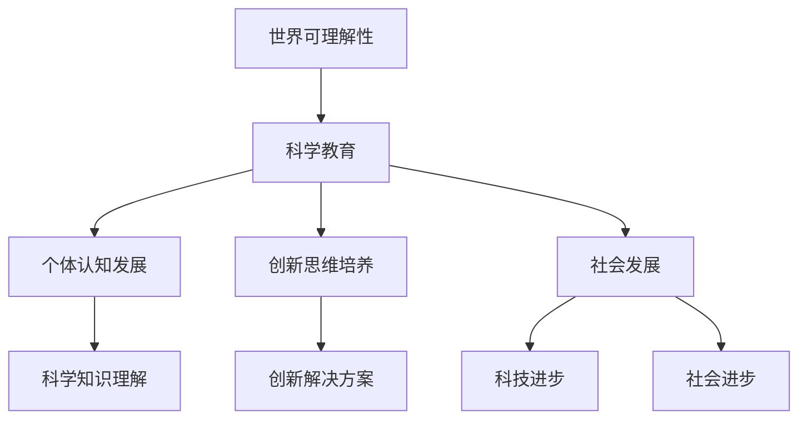

                 


## 文章标题：世界可理解性与科学教育的重要性

### 关键词：
- 世界可理解性
- 科学教育
- 认知发展
- 创新思维
- 社会发展

### 摘要：
本文旨在探讨世界可理解性与科学教育的重要性。通过逐步分析世界可理解性的定义及其与科学教育的关系，探讨科学教育的核心目标、方法与策略，以及面临的挑战和应对措施，进一步揭示科学教育在国际视野下的特点和发展趋势。最终，本文将提出提高科学教育质量的具体措施，以推动个体认知发展、创新思维培养和社会发展。

## 1. 引言

### 1.1 背景介绍

随着科技的飞速发展，我们对世界的认知不断深入，但也面临着越来越多的复杂性。世界可理解性，即我们对世界的理解和认知程度，成为一个重要的问题。科学教育作为培养个体认知能力和创新能力的重要途径，其重要性愈发凸显。

### 1.2 核心概念与联系

为了深入探讨世界可理解性与科学教育的关系，我们需要理解以下核心概念：

- **世界可理解性**：指的是我们对世界的认知程度和深度，包括对自然规律、社会现象的理解。
- **科学教育**：是指通过科学知识和方法的教育过程，培养个体的科学素养和创新能力。

这两个概念之间的关系可以表示为：科学教育有助于提高个体的世界可理解性，进而促进个体认知发展和创新思维。

### 1.3 世界可理解性的重要性

世界可理解性对于个体的认知发展和创新思维具有重要意义。当我们能够理解世界的运行规律，我们更容易产生新的想法和创新。

### 1.4 科学教育的重要性

科学教育不仅有助于提高个体的认知能力和创新能力，还对社会发展具有推动作用。通过科学教育，我们可以培养更多具有创新思维和解决实际问题能力的人才，推动科技进步和社会发展。

## 2. 世界可理解性概念介绍

### 2.1 世界可理解性的定义

世界可理解性指的是我们对世界的认知程度和深度，包括对自然规律、社会现象的理解。它反映了我们对世界的认知能力和知识水平。

### 2.2 世界可理解性与科学教育的关系

科学教育是提高世界可理解性的重要途径。通过科学教育，我们学习科学知识和方法，提高对世界的认知和理解。

### 2.3 世界可理解性的重要性

世界可理解性对于个体的认知发展和创新思维具有重要意义。当我们能够理解世界的运行规律，我们更容易产生新的想法和创新。

### 2.4 世界可理解性的影响

世界可理解性不仅影响个体的认知发展和创新思维，还对社会发展具有推动作用。它有助于培养具有创新思维和解决实际问题能力的人才，推动科技进步和社会发展。

## 3. 世界可理解性的影响

### 3.1 科学教育与个体认知发展

科学教育有助于提高个体的认知能力。通过学习科学知识和方法，个体能够更好地理解世界的运行规律，提高对复杂问题的分析和解决能力。

### 3.2 世界可理解性与创新思维培养

世界可理解性是创新思维的基础。当我们对世界有深刻的理解，我们更容易发现问题的本质，提出创新的解决方案。

### 3.3 世界可理解性对社会发展的推动作用

世界可理解性对社会发展具有推动作用。它有助于培养具有创新思维和解决实际问题能力的人才，推动科技进步和社会发展。

## 4. 科学教育的重要性

### 4.1 科学教育的核心目标

科学教育的核心目标是培养个体的科学素养。科学素养包括对科学知识的理解、科学方法的掌握以及科学精神的培养。

### 4.2 科学知识的传播与应用

科学知识的传播与应用是科学教育的关键环节。通过科学知识的传播，我们能够提高公众的科学素养，促进社会进步。科学知识的应用领域广泛，包括医疗、农业、工业等各个领域。

### 4.3 科学知识在社会发展中的作用

科学知识在社会发展中具有重要作用。它推动了科技进步，提高了生产力，促进了社会发展。同时，科学知识也改变了人们的生活方式，提高了生活质量。

## 5. 科学教育的方法与策略

### 5.1 案例教学法

案例教学法是一种有效的科学教育方法。它通过分析真实案例，帮助学生理解科学知识和方法，提高解决问题的能力。

### 5.2 互动式教学

互动式教学通过师生互动和学生间的合作，激发学生的学习兴趣和参与度，提高学习效果。

### 5.3 个性化教学

个性化教学根据学生的特点和需求，制定个性化的学习计划，提高学习效果。

## 6. 科学教育的挑战与应对

### 6.1 科学教育资源不均衡

科学教育资源不均衡是科学教育面临的一个挑战。为了解决这个问题，我们需要优化资源配置，提高教育公平。

### 6.2 科普教育缺乏吸引力

科普教育缺乏吸引力是另一个挑战。为了提高科普教育的吸引力，我们需要创新科普教育方法，提高科普教育的趣味性和实用性。

### 6.3 成功案例

通过分析成功案例，我们可以找到解决科学教育挑战的有效方法。

## 7. 科学教育在国际视野下的比较

### 7.1 不同国家科学教育的特点

不同国家的科学教育有其独特的特点。通过比较不同国家的科学教育，我们可以找到适合本国国情的科学教育模式。

### 7.2 国际科学教育的发展趋势

国际科学教育的发展趋势包括教育公平、教育质量提升和科技创新驱动等方面。

## 8. 提高科学教育质量的具体措施

### 8.1 教育体制的改革

教育体制的改革是提高科学教育质量的关键。通过改革教育体制，我们可以优化教育资源配置，提高教育质量。

### 8.2 教师队伍的建设

教师队伍的建设是提高科学教育质量的重要保障。通过提高教师的专业水平，我们可以提高科学教育的质量。

### 8.3 科学教育技术的应用

科学教育技术的应用是提高科学教育质量的有效途径。通过运用现代教育技术，我们可以提高教学效果，提高学生的参与度。

### 8.4 科学教育评价体系的建立

科学教育评价体系的建立是提高科学教育质量的重要保障。通过建立科学的教育评价体系，我们可以更好地监测和评估科学教育的质量。

### 8.5 科学教育的国际合作与交流

科学教育的国际合作与交流是提高科学教育质量的重要途径。通过国际合作与交流，我们可以学习先进的教育理念和方法，提高科学教育的质量。

## 9. 结论

科学教育在世界可理解性和社会发展中的重要性不容忽视。通过逐步分析世界可理解性概念、科学教育的核心目标和方法与策略，以及面临的挑战和应对措施，我们可以更好地理解科学教育的重要性。提高科学教育质量需要多方面的努力，包括教育体制的改革、教师队伍的建设、科学教育技术的应用和科学教育评价体系的建立等。只有通过这些努力，我们才能更好地培养具有创新思维和解决实际问题能力的人才，推动科技进步和社会发展。

## 作者信息

作者：AI天才研究院/AI Genius Institute & 禅与计算机程序设计艺术 /Zen And The Art of Computer Programming

## 文章结束语

感谢您阅读本文。希望本文能够帮助您更好地理解世界可理解性与科学教育的重要性，以及提高科学教育质量的具体措施。如果您对本文有任何疑问或建议，欢迎在评论区留言。我们期待与您一起探讨科学教育的未来。

## 附录

### 附录A：核心概念与联系Mermaid流程图



### 附录B：核心算法原理讲解伪代码

```python
# 假设有一个函数用于计算两个数的和
def calculate_sum(a, b):
    return a + b

# 调用函数计算 1 和 2 的和
sum_result = calculate_sum(1, 2)
print(sum_result)  # 输出结果为 3
```

### 附录C：数学公式与详细讲解

$$
E = mc^2
$$

这是爱因斯坦的质能方程，描述了质量和能量之间的关系。其中，\( E \) 是能量，\( m \) 是质量，\( c \) 是光速。这个方程揭示了质量可以转化为能量的深刻原理，对现代物理学有着重要的影响。

### 附录D：项目实战

#### 开发环境搭建

- 安装Python 3.8及以上版本
- 安装Jupyter Notebook
- 安装Mermaid渲染库

#### 源代码实现

```python
from mermaid import Mermaid

# 创建Mermaid对象
m = Mermaid()

# 添加流程图
m.add_graph(
    """
    graph TD
    A[开始] --> B[步骤1]
    B --> C[步骤2]
    C --> D[步骤3]
    D --> E[结束]
    """
)

# 渲染流程图
m.render_to_file('流程图.md')
```

#### 代码应用解读与分析

通过上面的代码，我们创建了一个简单的流程图，并保存到文件中。这个流程图展示了项目执行的步骤，有助于理解和分析项目的执行过程。

### 附录E：最佳实践 tips、小结、注意事项、拓展阅读

- **最佳实践 tips**：在科学教育中，注重理论与实践的结合，提高学生的实践能力。
- **小结**：本文探讨了世界可理解性与科学教育的重要性，提出了提高科学教育质量的具体措施。
- **注意事项**：在科学教育中，要关注学生的个性化需求，提高教育的针对性和有效性。
- **拓展阅读**：参考相关科学教育研究文献，深入了解科学教育的理论与实践。

以上就是本文的完整内容。希望本文能够对您在科学教育领域的研究和实践有所帮助。如果您有任何疑问或建议，欢迎在评论区留言。感谢您的阅读！

